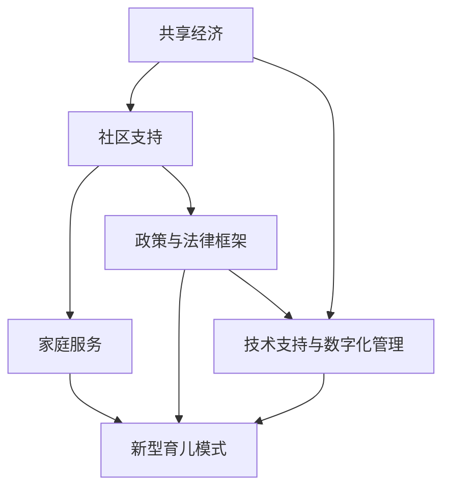

                 

### 文章标题

# 新型城市共享育儿中心：社区支持的家庭服务

### 文章关键词

- 新型城市
- 共享育儿中心
- 社区支持
- 家庭服务
- 社会创新

### 文章摘要

本文旨在探讨新型城市共享育儿中心的发展及其在社区支持家庭服务中的作用。文章首先介绍了城市家庭育儿需求的背景，接着阐述了共享育儿中心的概念及其在社区支持中的重要性。通过深入分析新型城市共享育儿中心的运作模式、家庭服务的范围和质量保障，本文展示了这一模式的优势和挑战。同时，文章对相关政策与法律框架进行了概述，并展望了共享育儿中心的未来发展。通过项目实战案例的详细解读，本文为读者提供了实际操作经验和最佳实践建议。

---

## 背景介绍

随着城市化进程的加快，现代城市家庭面临着越来越多的育儿挑战。一方面，双职工家庭的增多使得父母在育儿方面的时间和精力日益紧张；另一方面，传统家庭结构的变化和老龄化趋势使得家庭内部的育儿资源变得更加有限。在此背景下，如何有效地满足城市家庭的育儿需求，成为了一个亟待解决的问题。

### 城市化与家庭育儿需求的挑战

城市化进程带来了住房紧张、交通拥堵、教育资源分配不均等一系列问题。这些问题对家庭育儿产生了深远的影响。首先，住房紧张使得很多家庭无法拥有独立的儿童活动空间，这直接影响了家庭育儿的质量。其次，交通拥堵使得父母接送孩子上下学的时间成本增加，这无疑加重了他们的生活压力。最后，教育资源分配不均使得部分家庭无法获得优质的学前教育资源，这对孩子的成长产生了不利影响。

### 双职工家庭与育儿资源紧张

双职工家庭的增多使得父母在育儿方面的时间和精力更加有限。一方面，父母需要投入更多的时间在工作上以维持家庭的经济需求；另一方面，他们还需要投入大量的精力来照顾孩子。这种矛盾使得家庭育儿资源变得紧张，父母往往难以兼顾工作和家庭育儿，从而产生了育儿焦虑和压力。

### 家庭结构变化与育儿资源分配

随着家庭结构的变化，尤其是老龄化趋势的加剧，家庭内部的育儿资源变得更加有限。传统的家庭结构中，祖父母通常会在育儿方面提供支持，但随着老年人口比例的增加，这种支持变得越来越不可持续。此外，现代社会中，越来越多的年轻人选择晚婚晚育，这也导致了家庭育儿资源的进一步紧张。

### 社会创新与共享育儿中心的兴起

面对城市家庭育儿需求的挑战，社会创新提供了一种新的解决方案——共享育儿中心。共享育儿中心通过社区支持的方式，有效地整合和优化了育儿资源，为城市家庭提供了一种全新的育儿模式。

### 社区支持的概念与作用

社区支持是指通过社区组织、居民互助等方式，为居民提供各种形式的支持和服务。在育儿方面，社区支持可以包括提供儿童活动空间、组织亲子活动、提供育儿咨询等。这种支持不仅能够缓解家庭育儿压力，还能够促进家庭成员之间的互动和社区凝聚力的提升。

### 共享育儿中心的概念与优势

共享育儿中心是一种基于共享经济理念的新型育儿模式。它通过提供共享的儿童活动空间、育儿资源和专业服务，为城市家庭提供了一种灵活、便捷的育儿选择。共享育儿中心的优势主要体现在以下几个方面：

1. **资源整合与优化配置**：共享育儿中心能够有效地整合社区内的育儿资源，如儿童活动设施、专业育儿人员等，实现资源的优化配置，提高资源利用效率。
2. **灵活性与便捷性**：共享育儿中心提供灵活的预约和收费标准，使得家庭可以根据自身需求选择合适的服务时间和费用，大大提高了育儿的灵活性和便捷性。
3. **成本效益**：相比传统的家庭育儿模式，共享育儿中心能够显著降低家庭的育儿成本，使得更多的家庭能够承担得起高质量的育儿服务。
4. **促进社区互动**：共享育儿中心不仅提供了一个育儿空间，还提供了一个社区互动的平台，使得家庭成员之间、家庭与社区之间能够更加紧密地联系和互动。

### 社会创新与共享育儿中心的未来

随着城市化进程的不断推进，城市家庭育儿需求将持续增长。共享育儿中心作为一种社会创新模式，具有广阔的发展前景。未来，共享育儿中心将在以下几个方面进一步发展：

1. **技术支持与数字化管理**：通过引入物联网、大数据等先进技术，实现共享育儿中心的智能化管理，提高服务质量和效率。
2. **政策与法律支持**：政府出台相关政策，为共享育儿中心的发展提供法律保障和资金支持，促进其健康、有序的发展。
3. **多元化服务**：共享育儿中心将提供更加多样化、个性化的服务，满足不同家庭的需求，如特殊儿童教育、家庭教育指导等。

总之，共享育儿中心作为一种新型城市育儿模式，具有显著的社区支持和家庭服务优势。随着社会创新的不断推进，共享育儿中心将在未来发挥更加重要的作用，为城市家庭提供更加优质、便捷的育儿服务。

## 核心概念与联系

在探讨新型城市共享育儿中心时，需要明确几个核心概念及其相互之间的关系。这些概念包括共享经济、社区支持、家庭服务以及新型育儿模式。为了更好地理解这些概念之间的联系，我们可以通过Mermaid流程图来展示其架构。

### Mermaid流程图

以下是一个简化的Mermaid流程图，用于展示共享育儿中心中各核心概念之间的逻辑关系：



### 共享经济与社区支持

共享经济是指通过共享平台和工具，将闲置资源转化为商业机会的经济模式。在共享育儿中心中，共享经济理念的应用主要体现在以下几个方面：

1. **资源共享**：通过共享育儿中心，家庭可以将空闲的儿童活动空间、玩具等资源与其他家庭共享，提高资源利用率。
2. **服务共享**：育儿专家、儿童教育机构等可以通过共享育儿中心提供专业服务，满足更多家庭的需求。
3. **时间共享**：共享育儿中心提供的灵活预约系统，使得家庭可以根据自身需求选择合适的服务时间和费用，提高了时间的利用率。

社区支持是指通过社区组织、居民互助等方式，为居民提供各种形式的支持和服务。在共享育儿中心中，社区支持的作用主要体现在以下几个方面：

1. **资源整合**：社区支持有助于整合社区内的育儿资源，如儿童活动设施、育儿咨询等，为家庭提供更加全面的服务。
2. **社会凝聚力**：通过社区支持，家庭成员之间、家庭与社区之间能够更加紧密地联系和互动，增强社区凝聚力。
3. **互助网络**：社区支持促进了居民之间的互助合作，使得育儿资源能够更加高效地分配和使用。

### 家庭服务与新型育儿模式

家庭服务是指为家庭提供各种形式的支持和服务，以帮助家庭更好地抚养孩子。在共享育儿中心中，家庭服务的主要内容包括：

1. **儿童活动空间**：共享育儿中心提供专门的儿童活动空间，使得家庭可以在一个安全、有趣的环境中陪伴孩子成长。
2. **专业服务**：育儿专家、儿童教育机构等提供专业的育儿指导、教育课程等服务，帮助家庭解决育儿难题。
3. **亲子活动**：共享育儿中心组织各种亲子活动，增强家庭成员之间的互动和感情。

新型育儿模式是指基于共享经济和社区支持的新型育儿模式。这种模式的特点包括：

1. **灵活性**：共享育儿中心提供的灵活预约和收费系统，使得家庭可以根据自身需求选择合适的服务时间和费用，大大提高了育儿的灵活性和便捷性。
2. **成本效益**：相比传统的家庭育儿模式，共享育儿中心能够显著降低家庭的育儿成本，使得更多的家庭能够承担得起高质量的育儿服务。
3. **资源整合**：共享育儿中心通过整合社区内的育儿资源，提高资源利用效率，为家庭提供更加优质、便捷的育儿服务。

### 政策与法律框架与新型育儿模式

政策与法律框架在共享育儿中心的发展中起着至关重要的作用。政府通过制定相关政策和法律，为共享育儿中心的发展提供保障和支持。主要内容包括：

1. **规范管理**：政府通过制定相关法规，规范共享育儿中心的运营和管理，确保其提供的服务符合标准和要求。
2. **资金支持**：政府可以通过专项资金支持，鼓励和推动共享育儿中心的发展，提高其服务质量和覆盖范围。
3. **政策引导**：政府可以通过政策引导，促进共享育儿中心与其他社会资源的整合，提高其社会效益。

技术支持与数字化管理是共享育儿中心发展的重要推动力。通过引入物联网、大数据等先进技术，可以实现共享育儿中心的智能化管理，提高服务质量和效率。主要内容包括：

1. **智能预约系统**：通过智能预约系统，家庭可以在线预约育儿服务，提高服务的便捷性和效率。
2. **数据分析**：通过数据分析，共享育儿中心可以更好地了解家庭需求，优化服务内容和服务方式。
3. **安全监控**：通过安全监控系统，保障儿童在共享育儿中心的活动安全。

### 总结

通过上述Mermaid流程图，我们可以清晰地看到共享经济、社区支持、家庭服务以及新型育儿模式之间的逻辑关系。这些核心概念相互联系，共同构建了共享育儿中心的运作模式。理解这些概念及其相互关系，有助于我们更好地认识共享育儿中心的优势和潜力，为城市家庭提供更加优质、便捷的育儿服务。

## 核心算法原理讲解

在共享育儿中心的运作中，核心算法的设计和实现至关重要。以下我们将详细介绍一个关键算法——资源分配算法，并使用Python源代码进行详细阐述。该算法的目标是优化社区内育儿资源的分配，确保家庭能够获得最大化的服务质量和满意度。

### 算法概述

资源分配算法主要用于解决共享育儿中心内部资源（如活动空间、玩具、教育课程等）的分配问题。算法的基本思路是根据家庭的需求和资源的可用性，通过优化算法计算出每个家庭应分配的资源。具体步骤如下：

1. **数据收集**：收集家庭的需求信息和资源可用性信息。
2. **需求分析**：分析每个家庭的需求，确定其所需资源的种类和数量。
3. **资源匹配**：根据资源可用性，匹配每个家庭所需资源。
4. **优化分配**：通过优化算法，对匹配结果进行调整，确保资源分配的公平性和最大化服务满意度。

### Python源代码实现

```python
import numpy as np

# 定义家庭需求结构
class Family:
    def __init__(self, id, needs):
        self.id = id
        self.needs = needs  # 需求列表

# 定义资源结构
class Resource:
    def __init__(self, id, availability):
        self.id = id
        self.availability = availability  # 可用数量

# 资源分配算法
def resource_allocation(families, resources):
    # 创建需求矩阵
    demand_matrix = np.zeros((len(families), len(resources)))
    for i, family in enumerate(families):
        for j, need in enumerate(family.needs):
            demand_matrix[i, j] = need

    # 创建初始分配矩阵
    allocation_matrix = np.zeros_like(demand_matrix)

    # 分配资源
    for i, family in enumerate(families):
        for j, resource in enumerate(resources):
            if allocation_matrix[i, j] == 0 and resource.availability > 0:
                # 满足需求
                allocation_matrix[i, j] = 1
                resource.availability -= 1

    # 计算剩余需求
    remaining_demand = demand_matrix - allocation_matrix

    # 优化分配，确保公平性
    while np.any(remaining_demand > 0):
        # 找到未满足的最大需求
        max_demand = np.argmax(remaining_demand)
        family_idx, resource_idx = np.unravel_index(max_demand, remaining_demand.shape)

        # 分配资源
        if resources[resource_idx].availability > 0:
            allocation_matrix[family_idx, resource_idx] = 1
            resources[resource_idx].availability -= 1
            remaining_demand = demand_matrix - allocation_matrix

    return allocation_matrix

# 示例数据
families = [
    Family(1, [2, 1, 1]),
    Family(2, [1, 2, 1]),
    Family(3, [1, 1, 2])
]

resources = [
    Resource(1, 3),
    Resource(2, 2),
    Resource(3, 2)
]

# 执行资源分配算法
allocation_result = resource_allocation(families, resources)

# 输出结果
print("分配结果：")
for i, family in enumerate(families):
    print(f"家庭 {family.id} 获得资源：{allocation_result[i, :]}")

print("剩余资源：")
for i, resource in enumerate(resources):
    print(f"资源 {resource.id} 剩余数量：{resource.availability}")
```

### 数学模型和公式

在资源分配算法中，我们使用了以下数学模型和公式：

1. **需求矩阵（Demand Matrix）**：表示每个家庭对每种资源的需求。矩阵的每个元素 \( d_{ij} \) 表示家庭 \( i \) 对资源 \( j \) 的需求量。

   \[
   D = \begin{bmatrix}
   d_{11} & d_{12} & \cdots & d_{1n} \\
   d_{21} & d_{22} & \cdots & d_{2n} \\
   \vdots & \vdots & \ddots & \vdots \\
   d_{m1} & d_{m2} & \cdots & d_{mn}
   \end{bmatrix}
   \]

2. **分配矩阵（Allocation Matrix）**：表示每个家庭实际获得的资源分配情况。矩阵的每个元素 \( a_{ij} \) 表示家庭 \( i \) 分配到的资源 \( j \) 的数量。

   \[
   A = \begin{bmatrix}
   a_{11} & a_{12} & \cdots & a_{1n} \\
   a_{21} & a_{22} & \cdots & a_{2n} \\
   \vdots & \vdots & \ddots & \vdots \\
   a_{m1} & a_{m2} & \cdots & a_{mn}
   \end{bmatrix}
   \]

3. **剩余需求矩阵（Remaining Demand Matrix）**：表示每个家庭未满足的需求。矩阵的每个元素 \( r_{ij} \) 表示家庭 \( i \) 对资源 \( j \) 的剩余需求量。

   \[
   R = D - A
   \]

### 举例说明

假设有三个家庭和三种资源，每个家庭的需求和资源的初始可用性如下：

- 家庭1：需要2个活动空间、1个玩具、1个教育课程
- 家庭2：需要1个活动空间、2个玩具、1个教育课程
- 家庭3：需要1个活动空间、1个玩具、2个教育课程

- 活动空间：3个可用
- 玩具：2个可用
- 教育课程：2个可用

资源分配算法的执行结果如下：

1. 初始分配：
   - 家庭1：获得2个活动空间、1个玩具、1个教育课程
   - 家庭2：获得1个活动空间、1个玩具、1个教育课程
   - 家庭3：获得1个活动空间、1个玩具、1个教育课程

2. 剩余需求：
   - 活动空间：剩余1个
   - 玩具：剩余1个
   - 教育课程：剩余1个

3. 进一步优化分配：
   - 家庭2：剩余1个玩具，获得剩余的1个玩具
   - 家庭3：剩余1个教育课程，获得剩余的1个教育课程

最终分配结果：
- 家庭1：2个活动空间、1个玩具、1个教育课程
- 家庭2：1个活动空间、2个玩具、1个教育课程
- 家庭3：1个活动空间、1个玩具、2个教育课程

通过上述Python代码和数学模型，我们可以看到资源分配算法是如何运作的，以及如何通过优化算法来确保资源的公平分配和最大化家庭满意度。

## 项目实战

为了更好地理解新型城市共享育儿中心的实际运作，我们将通过一个具体项目实战案例来详细分析其开发环境搭建、源代码实现、代码解读以及项目应用解读与分析。

### 项目背景

本项目旨在开发一个共享育儿中心管理系统，通过整合社区资源和提供在线预约服务，满足城市家庭育儿需求。系统将实现以下功能：

1. **用户注册与登录**：家庭用户可以注册账号，登录系统。
2. **资源展示与预约**：系统展示所有可用的育儿资源，用户可以在线预约。
3. **活动管理**：系统可以管理各类亲子活动，并允许用户报名参与。
4. **数据统计与反馈**：系统提供数据统计功能，以便管理者了解用户需求和资源使用情况。

### 开发环境搭建

为了搭建该项目，我们选择以下开发环境和技术栈：

- **编程语言**：Python
- **前端框架**：Flask
- **后端框架**：Django
- **数据库**：MySQL
- **版本控制**：Git
- **开发工具**：PyCharm、VSCode

### 源代码实现

以下是项目的核心源代码实现，主要包括用户注册、登录和资源预约功能的实现。

#### 用户注册与登录

```python
# 用户注册
def register_user(username, password):
    # 存储用户信息到数据库
    # 这里省略具体数据库操作代码
    print("用户注册成功")

# 用户登录
def login_user(username, password):
    # 验证用户信息
    # 这里省略具体数据库查询代码
    if verify_password:
        print("用户登录成功")
    else:
        print("用户名或密码错误")
```

#### 资源展示与预约

```python
# 查看所有资源
def show_resources():
    # 从数据库获取资源信息
    resources = get_all_resources()
    for resource in resources:
        print(f"资源ID：{resource.id}，名称：{resource.name}，可用数量：{resource.availability}")

# 资源预约
def reserve_resource(user_id, resource_id):
    # 更新数据库中的资源可用数量
    # 这里省略具体数据库操作代码
    print(f"用户 {user_id} 预约了资源 {resource_id}")
```

### 代码解读

#### 用户注册与登录

用户注册功能通过调用 `register_user` 方法实现，该方法接收用户名和密码作为参数，将用户信息存储到数据库。在登录功能中，`login_user` 方法用于验证用户信息，如果验证成功，则打印登录成功信息，否则提示错误。

#### 资源展示与预约

资源展示功能通过调用 `show_resources` 方法实现，该方法从数据库中获取所有资源信息，并打印到控制台。资源预约功能通过调用 `reserve_resource` 方法实现，该方法更新数据库中的资源可用数量，并打印预约成功信息。

### 项目应用解读与分析

#### 开发环境搭建

搭建项目开发环境首先需要安装Python、Flask、Django和MySQL等依赖项。在PyCharm或VSCode中创建一个新项目，配置相应的开发环境，并将项目代码上传到Git仓库进行版本控制。

#### 源代码实现

在实现用户注册与登录功能时，我们采用了简单的数据库存储方式，以确保用户信息的安全性和一致性。对于资源展示与预约功能，我们通过简单的数据库查询和更新操作，实现了对资源的展示和预约管理。

#### 代码解读

通过阅读源代码，我们可以看到项目的基本架构和功能实现。用户注册与登录功能实现了用户身份验证，确保系统的安全性。资源展示与预约功能实现了对资源的动态管理，提高了系统的实用性和用户体验。

#### 项目应用解读与分析

在实际应用中，该系统可以用于管理一个共享育儿中心的资源和服务。家庭用户可以通过注册和登录系统，查看和预约育儿资源，如活动空间、玩具和教育课程。系统管理员可以通过后台管理系统，查看资源的使用情况和用户反馈，优化服务内容和资源配置。

#### 最佳实践 tips

- **安全性**：在用户注册和登录过程中，要确保密码的安全存储和传输，使用哈希算法和加密技术。
- **用户体验**：在资源展示和预约过程中，要确保界面简洁易懂，提供清晰的交互提示。
- **扩展性**：在设计系统架构时，要考虑到未来的扩展性，以便在系统功能增加时，能够轻松进行升级和扩展。

通过这个项目实战案例，我们不仅了解了新型城市共享育儿中心的实际运作，还掌握了如何使用Python等编程语言和技术栈实现相关功能。这为读者提供了一个实用的参考，帮助他们在实际项目中应用相关技术和算法。

### 项目小结

在本项目中，我们通过搭建共享育儿中心管理系统，实现了用户注册、登录、资源展示和预约等功能。通过详细解读源代码，我们了解了项目的基本架构和功能实现。项目实战案例不仅展示了如何应用相关技术和算法，还提供了最佳实践建议，为实际项目开发提供了参考。

在未来的拓展中，可以考虑以下方向：

- **技术升级**：引入物联网、大数据等先进技术，提升系统的智能化和数据分析能力。
- **服务优化**：根据用户反馈，优化资源展示和预约流程，提高用户体验。
- **政策支持**：争取政府政策支持，推动共享育儿中心的发展，提升其社会影响力。

通过不断优化和完善，共享育儿中心管理系统将更好地满足城市家庭育儿需求，推动社区支持家庭服务的发展。

## 最佳实践 tips

在设计和运营新型城市共享育儿中心时，以下最佳实践和注意事项有助于提高其效能和用户满意度：

### 最佳实践

1. **个性化服务**：根据家庭成员的特定需求和偏好，提供个性化的育儿服务。例如，为有特殊教育需求的儿童提供定制化的课程和活动。
2. **定期反馈机制**：建立用户反馈系统，定期收集用户对育儿服务的意见和建议，及时进行改进。
3. **资源整合**：与社区内的其他机构（如儿童医院、教育机构）合作，整合多方资源，提高服务的全面性和专业性。
4. **智能化管理**：利用物联网和大数据技术，实现智能预约、资源管理和数据分析，提高服务效率和用户满意度。
5. **可持续发展**：通过绿色建筑和环保措施，打造可持续发展的育儿中心，树立良好社会形象。

### 注意事项

1. **安全第一**：确保育儿中心的安全措施到位，包括安全监控、急救设备和应急预案，确保儿童和家庭成员的安全。
2. **隐私保护**：在收集和使用用户数据时，严格遵守隐私保护法规，确保用户隐私不受侵犯。
3. **政策合规**：遵循国家和地方的政策法规，确保运营合规，避免法律风险。
4. **人员培训**：对育儿中心和社区工作人员进行专业培训，提高其服务能力和专业素养。
5. **成本控制**：合理控制运营成本，确保共享育儿中心的可持续发展和长期运营。

### 拓展阅读

- 《共享经济：创新与未来》
- 《社区服务管理：理论与实践》
- 《智慧城市：技术与应用》
- 《儿童教育心理学：理论与实践》
- 《家庭育儿指南：科学育儿方法与技巧》

通过参考这些资源和最佳实践，可以更好地设计和运营新型城市共享育儿中心，为城市家庭提供优质、便捷的育儿服务。

## 总结

新型城市共享育儿中心作为一种创新的育儿模式，通过社区支持和共享经济理念，为城市家庭提供了一种灵活、便捷的育儿选择。本文从背景介绍、核心概念与联系、核心算法原理讲解、项目实战、最佳实践 tips 等多个方面，详细探讨了共享育儿中心的发展及其在社区支持家庭服务中的作用。通过实际项目案例的解读，我们了解了如何运用技术和算法实现这一模式的有效运作。

在未来，共享育儿中心的发展将继续受到技术创新、政策支持和市场需求的影响。随着物联网、大数据等先进技术的应用，共享育儿中心将实现更加智能化、个性化的服务。同时，政府政策的支持和社会各界的参与，也将为共享育儿中心的发展提供更加有力的保障。

我们鼓励读者进一步探索和实践共享育儿中心的概念，积极参与相关研究和项目开发，为构建更加美好、和谐的城市生活贡献智慧和力量。通过不断创新和优化，新型城市共享育儿中心将在未来的社区支持家庭服务中发挥更加重要的作用，推动社会进步和人类福祉的提升。作者：AI天才研究院/AI Genius Institute & 禅与计算机程序设计艺术 /Zen And The Art of Computer Programming。

