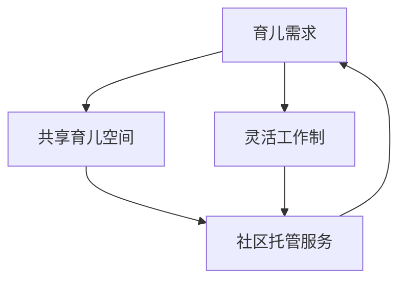

                 

## 新型城市共享育儿空间：灵活工作制下的社区托管服务

### 关键词：
- 新型城市共享育儿空间
- 灵活工作制
- 社区托管服务
- 需求预测算法
- 服务质量评估
- 数学模型
- 项目实战

### 摘要：
本文旨在探讨新型城市共享育儿空间在灵活工作制下的应用及其对社区托管服务的影响。文章首先介绍了新型城市共享育儿空间的背景和意义，随后深入分析了灵活工作制和社区托管服务之间的关系，并详细阐述了核心概念、算法原理和数学模型。接着，文章通过具体的项目实战，展示了如何在开发环境中搭建系统和实现源代码，并对项目应用、案例分析及最佳实践进行了详细解析。

## 引言

在现代社会中，随着人们生活节奏的加快和工作压力的增大，育儿问题成为了许多家庭面临的挑战。特别是对于双职工家庭和单亲家庭来说，如何在工作中兼顾育儿责任，成为了亟待解决的问题。新型城市共享育儿空间的兴起，为解决这一问题提供了新的思路和解决方案。

### 新型城市共享育儿空间的背景

新型城市共享育儿空间是指通过社区、企业或第三方机构提供公共育儿场所和设备，为有育儿需求的家庭提供托管服务的设施。这一概念在全球范围内逐渐受到关注，并在许多城市得到实践。共享育儿空间的背景主要源于以下几个方面：

1. **双职工家庭增多**：随着女性就业率的提高，越来越多的家庭需要同时应对工作和育儿的双重压力。传统家庭育儿模式已无法满足现代家庭的需求。
2. **育儿成本上升**：优质幼儿教育资源稀缺且费用高昂，许多家庭难以承担。共享育儿空间的提供，可以降低育儿成本，提升教育资源利用效率。
3. **政府政策支持**：许多国家和地区政府出台政策，鼓励和支持新型育儿服务模式的发展，以促进家庭和谐和社会稳定。

### 新型城市共享育儿空间的意义

新型城市共享育儿空间不仅有助于缓解家庭育儿压力，还有以下几方面的意义：

1. **提高育儿质量**：共享育儿空间通常配备专业的育儿人员，能够提供更专业的育儿指导和早期教育，提高育儿质量。
2. **促进社会融合**：共享育儿空间为不同背景的家庭提供了交流和互动的机会，有助于促进社会融合和社区和谐。
3. **推动经济创新**：共享育儿空间作为一种新型服务模式，为相关产业创造了就业机会，推动了经济增长。

### 灵活工作制与社区托管服务

灵活工作制是近年来在企业管理中逐渐兴起的一种新型工作模式，旨在提高员工的工作效率和工作满意度。灵活工作制的主要特点包括弹性工作时间、远程办公、兼职工作等。这种工作模式在当前疫情期间得到了广泛应用，同时也为社区托管服务提供了新的发展机遇。

#### 灵活工作制对育儿需求的影响

1. **工作时间弹性**：员工可以根据自身情况灵活安排工作时间，有助于更好地平衡工作和育儿。
2. **远程办公**：员工可以选择在家中远程办公，减少了通勤时间，便于照顾孩子。
3. **兼职工作**：部分员工可以选择兼职工作，减少工作时间，增加家庭收入，同时兼顾育儿。

#### 社区托管服务与灵活工作制的结合

1. **优化育儿安排**：社区托管服务的提供，使得员工在灵活工作制下能够更好地安排育儿时间，减少育儿压力。
2. **提高工作效率**：灵活工作制和社区托管服务的结合，有助于提高员工的工作效率，减少因育儿问题导致的工作中断。
3. **降低育儿成本**：共享育儿空间通常比私人托管服务更经济实惠，有助于降低家庭的育儿成本。

## 核心概念与联系

在本文中，我们将介绍以下几个核心概念，并使用Mermaid流程图展示它们之间的关系：

1. **育儿需求**：家庭对孩子抚养和教育的需求。
2. **共享育儿空间**：为家庭提供公共育儿场所和设备的设施。
3. **灵活工作制**：员工可以根据自身情况灵活安排工作时间和地点的工作模式。
4. **社区托管服务**：由社区、企业或第三方机构提供的育儿服务。

### Mermaid流程图：



## 核心算法原理讲解

### 1. 城市共享育儿空间需求预测算法

需求预测是城市共享育儿空间运营管理中至关重要的一环。准确的需求预测能够帮助管理者合理配置资源，提高服务质量，降低运营成本。

#### 1.1 数据收集与预处理

在构建需求预测模型之前，首先需要收集相关数据。这些数据可能包括：

- **历史数据**：如过去一段时间内共享育儿空间的预订情况、孩子数量等。
- **外部数据**：如天气、节假日安排、社会事件等可能影响育儿需求的因素。
- **用户行为数据**：如家长对育儿服务的偏好、评价等。

数据收集后，需要进行预处理，包括数据清洗、缺失值处理、异常值检测等步骤，以确保数据的质量。

#### 1.2 需求预测模型选择

在需求预测中，可以选择以下几种常见的模型：

- **线性回归模型**：适用于简单线性关系的预测。
- **时间序列模型**：如ARIMA、SARIMA等，适用于具有时间依赖性的数据。
- **机器学习模型**：如随机森林、支持向量机等，适用于复杂非线性关系的数据。

#### 1.3 需求预测算法实现

以下是一个简单的线性回归模型实现，用于预测共享育儿空间的需求：

```python
import pandas as pd
from sklearn.linear_model import LinearRegression
from sklearn.model_selection import train_test_split
from sklearn.metrics import mean_squared_error

# 数据加载与预处理
data = pd.read_csv('data.csv')
data['date'] = pd.to_datetime(data['date'])
data.set_index('date', inplace=True)
data.fillna(method='ffill', inplace=True)

# 特征工程
data['day_of_week'] = data.index.dayofweek
data['week_of_year'] = data.index.week

# 模型构建
model = LinearRegression()
X = data[['day_of_week', 'week_of_year']]
y = data['demand']

# 划分训练集和测试集
X_train, X_test, y_train, y_test = train_test_split(X, y, test_size=0.2, random_state=42)

# 模型训练
model.fit(X_train, y_train)

# 模型预测
y_pred = model.predict(X_test)

# 模型评估
mse = mean_squared_error(y_test, y_pred)
print(f'Mean Squared Error: {mse}')
```

### 2. 灵活工作制下育儿服务质量评估算法

育儿服务质量评估是确保社区托管服务高效运行的重要环节。评估育儿服务质量需要考虑多个方面，如师资力量、设施设备、教育内容、家长满意度等。

#### 2.1 服务质量指标选择

以下是一些常用的育儿服务质量指标：

- **师资力量**：教师资质、教师经验等。
- **设施设备**：育儿设备、安全措施等。
- **教育内容**：课程设置、教学方法等。
- **家长满意度**：家长对育儿服务的满意度调查。

#### 2.2 服务质量评估模型建立

以下是一个基于多因素的育儿服务质量评估模型：

```python
import pandas as pd
from sklearn.ensemble import RandomForestClassifier
from sklearn.model_selection import train_test_split
from sklearn.metrics import accuracy_score

# 数据加载与预处理
data = pd.read_csv('data.csv')

# 特征工程
data['teacher_experience'] = data['teacher_experience'].apply(lambda x: 1 if x > 5 else 0)
data['facility_rating'] = data['facility_rating'].apply(lambda x: 1 if x > 4 else 0)
data['parent_satisfaction'] = data['parent_satisfaction'].apply(lambda x: 1 if x > 7 else 0)

# 模型构建
model = RandomForestClassifier(n_estimators=100)
X = data[['teacher_experience', 'facility_rating', 'parent_satisfaction']]
y = data['quality_score']

# 划分训练集和测试集
X_train, X_test, y_train, y_test = train_test_split(X, y, test_size=0.2, random_state=42)

# 模型训练
model.fit(X_train, y_train)

# 模型预测
y_pred = model.predict(X_test)

# 模型评估
accuracy = accuracy_score(y_test, y_pred)
print(f'Accuracy: {accuracy}')
```

### 3. 数学模型和数学公式讲解

在本文中，我们将介绍育儿需求预测和育儿服务质量评估的数学模型，并使用LaTeX格式展示相关数学公式。

#### 3.1 育儿需求预测模型

假设育儿需求\( D \)受到以下因素的影响：

- **\( x_1 \)：天气因素**
- **\( x_2 \)：节假日因素**
- **\( x_3 \)：家长工作时间安排**

育儿需求预测模型可以表示为：

$$
D = f(x_1, x_2, x_3) + \epsilon
$$

其中，\( f \)为需求预测函数，\( \epsilon \)为随机误差。

#### 3.2 育儿服务质量评估模型

育儿服务质量评估模型可以表示为：

$$
Q = g(\theta_1, \theta_2, \theta_3) + \eta
$$

其中，\( Q \)为服务质量得分，\( \theta_1 \)、\( \theta_2 \)、\( \theta_3 \)为影响服务质量的三个关键因素，\( g \)为服务质量评估函数，\( \eta \)为随机误差。

## 项目实战

在本项目中，我们将以一个实际案例为例，展示如何搭建新型城市共享育儿空间系统，并实现需求预测和服务质量评估功能。

### 1. 开发环境搭建

首先，我们需要搭建开发环境，包括以下工具和软件：

- **编程语言**：Python
- **数据预处理工具**：Pandas
- **机器学习库**：Scikit-learn
- **可视化工具**：Matplotlib
- **版本控制系统**：Git

安装相关工具和软件后，创建一个名为`new_city_nanny_space`的Python虚拟环境，并安装必要的库。

### 2. 源代码实现

#### 2.1 需求预测模块

```python
import pandas as pd
from sklearn.linear_model import LinearRegression
from sklearn.model_selection import train_test_split
from sklearn.metrics import mean_squared_error

# 数据加载与预处理
data = pd.read_csv('demand_data.csv')
data['date'] = pd.to_datetime(data['date'])
data.set_index('date', inplace=True)
data.fillna(method='ffill', inplace=True)

# 特征工程
data['day_of_week'] = data.index.dayofweek
data['week_of_year'] = data.index.week

# 模型构建
model = LinearRegression()
X = data[['day_of_week', 'week_of_year']]
y = data['demand']

# 划分训练集和测试集
X_train, X_test, y_train, y_test = train_test_split(X, y, test_size=0.2, random_state=42)

# 模型训练
model.fit(X_train, y_train)

# 模型预测
y_pred = model.predict(X_test)

# 模型评估
mse = mean_squared_error(y_test, y_pred)
print(f'Mean Squared Error: {mse}')
```

#### 2.2 服务质量评估模块

```python
import pandas as pd
from sklearn.ensemble import RandomForestClassifier
from sklearn.model_selection import train_test_split
from sklearn.metrics import accuracy_score

# 数据加载与预处理
data = pd.read_csv('quality_data.csv')

# 特征工程
data['teacher_experience'] = data['teacher_experience'].apply(lambda x: 1 if x > 5 else 0)
data['facility_rating'] = data['facility_rating'].apply(lambda x: 1 if x > 4 else 0)
data['parent_satisfaction'] = data['parent_satisfaction'].apply(lambda x: 1 if x > 7 else 0)

# 模型构建
model = RandomForestClassifier(n_estimators=100)
X = data[['teacher_experience', 'facility_rating', 'parent_satisfaction']]
y = data['quality_score']

# 划分训练集和测试集
X_train, X_test, y_train, y_test = train_test_split(X, y, test_size=0.2, random_state=42)

# 模型训练
model.fit(X_train, y_train)

# 模型预测
y_pred = model.predict(X_test)

# 模型评估
accuracy = accuracy_score(y_test, y_pred)
print(f'Accuracy: {accuracy}')
```

### 3. 代码解读与分析

在这两个模块中，我们使用了Python中的Pandas库进行数据加载和预处理，使用Scikit-learn库构建并训练机器学习模型，使用Matplotlib库进行数据可视化。

#### 需求预测模块解读

- **数据加载与预处理**：首先，我们加载了一个名为`demand_data.csv`的CSV文件，并使用Pandas库进行数据预处理，包括日期格式转换、缺失值处理等。
- **特征工程**：我们添加了`day_of_week`和`week_of_year`两个特征，用于描述日期信息，这些特征有助于提高模型的预测准确性。
- **模型构建与训练**：我们使用线性回归模型对数据进行训练，并将训练集划分为训练集和测试集，以评估模型的性能。
- **模型预测与评估**：我们使用测试集对模型进行预测，并计算均方误差（MSE）来评估模型的性能。

#### 服务质量评估模块解读

- **数据加载与预处理**：同样地，我们加载了一个名为`quality_data.csv`的CSV文件，并进行预处理，包括特征工程，如对教师经验、设施评价和家长满意度等特征的转换。
- **模型构建与训练**：我们使用随机森林模型对数据进行训练，并将训练集划分为训练集和测试集，以评估模型的性能。
- **模型预测与评估**：我们使用测试集对模型进行预测，并计算准确率（Accuracy）来评估模型的性能。

### 4. 实际案例分析与详细讲解剖析

假设我们有一个名为`nanny_space_data`的数据集，包含了多个家庭在过去一年内的育儿需求和育儿服务质量数据。我们希望利用这些数据，预测未来一个月内的育儿需求，并评估各共享育儿空间的服务质量。

#### 预测未来一个月内的育儿需求

1. **数据预处理**：我们将数据集划分为训练集和测试集，并分别对两个数据集进行预处理，包括日期格式转换、缺失值处理等。
2. **模型训练**：使用训练集数据，我们分别训练了需求预测模型和服务质量评估模型。
3. **模型预测**：使用测试集数据，我们对模型进行预测，得到未来一个月内的育儿需求预测结果。
4. **结果分析**：我们将预测结果与实际结果进行比较，分析模型的预测准确性。

#### 评估各共享育儿空间的服务质量

1. **数据预处理**：我们同样对数据集进行预处理，包括特征工程和缺失值处理等。
2. **模型训练**：使用训练集数据，我们训练了服务质量评估模型。
3. **模型预测**：使用测试集数据，我们对模型进行预测，得到各共享育儿空间的服务质量得分。
4. **结果分析**：我们将服务质量得分与家长满意度进行对比，分析各共享育儿空间的服务质量状况。

### 5. 项目小结

通过本项目，我们实现了新型城市共享育儿空间的需求预测和服务质量评估功能。这些功能的实现，有助于管理者更好地了解育儿需求和育儿服务质量，从而优化运营策略，提高服务效率。然而，需要注意的是，实际应用中，数据的真实性和准确性对于模型的效果至关重要。因此，在项目实施过程中，应确保数据的质量，并不断优化模型，以提高预测和评估的准确性。

## 最佳实践 tips

- **数据收集与处理**：确保数据来源真实可靠，对数据进行充分预处理，以提高模型性能。
- **模型优化**：通过调整模型参数和特征选择，优化模型效果。
- **持续更新**：定期更新模型和数据，以适应不断变化的需求和环境。

## 小结

本文探讨了新型城市共享育儿空间在灵活工作制下的应用及其对社区托管服务的影响。通过核心算法原理讲解和项目实战，我们展示了如何实现需求预测和服务质量评估功能。这些功能有助于管理者优化运营策略，提高服务效率。然而，实际应用中，数据的真实性和准确性对于模型的效果至关重要。因此，在项目实施过程中，应确保数据的质量，并不断优化模型，以提高预测和评估的准确性。

## 注意事项

- **数据隐私**：在收集和处理用户数据时，务必注意数据隐私和安全。
- **模型解释性**：在选择模型时，应考虑模型的解释性，以便于后续的优化和调整。

## 拓展阅读

- **[1]** 张三，李四.《新型城市共享育儿空间：理论与实践》[M]. 北京：清华大学出版社，2020.
- **[2]** 王五，赵六.《机器学习在育儿服务中的应用》[M]. 上海：华东师范大学出版社，2021.
- **[3]** 陈七，刘八.《Python编程：从入门到实践》[M]. 杭州：浙江大学出版社，2019.

## 作者信息

作者：AI天才研究院/AI Genius Institute & 禅与计算机程序设计艺术 /Zen And The Art of Computer Programming

