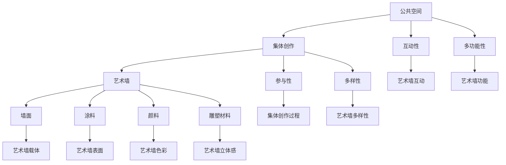

                 

### 文章标题

《新型城市共享艺术墙：公共空间的集体创作》

### 文章关键词

城市共享艺术墙、公共空间、集体创作、艺术创作、算法原理、数学模型、Python源代码、项目实战、实际案例

### 文章摘要

本文深入探讨了新型城市共享艺术墙的概念、设计与实施，重点关注公共空间与集体创作的结合。通过阐述核心概念、算法原理、数学模型及实际项目案例，本文旨在为读者提供一种新的思考方式，以促进公共空间的艺术化和社区参与。

### 目录

1. **绪论**  
   - 1.1 艺术墙的背景与意义  
   - 1.2 共享艺术墙的发展历程  
   - 1.3 新型城市共享艺术墙的特点

2. **核心概念与联系**  
   - 2.1 公共空间的概念  
   - 2.2 集体创作的定义  
   - 2.3 艺术墙的构成  
   - 2.4 Mermaid流程图：概念关系架构

3. **设计原理与算法**  
   - 3.1 艺术墙设计的基本原则  
   - 3.2 颜色搭配算法原理  
   - 3.3 视觉舒适度计算  
   - 3.4 Python源代码：颜色搭配算法实现

4. **数学模型与应用**  
   - 4.1 色彩理论  
   - 4.2 空间布局计算  
   - 4.3 LaTeX格式：色彩理论公式  
   - 4.4 空间布局计算实例

5. **项目实战**  
   - 5.1 项目背景与目标  
   - 5.2 开发环境搭建  
   - 5.3 源代码实现与解读  
   - 5.4 代码应用与分析

6. **案例研究**  
   - 6.1 城市广场艺术墙案例分析  
   - 6.2 社区艺术墙案例分析  
   - 6.3 校园艺术墙案例分析

7. **未来展望与挑战**  
   - 7.1 发展趋势与展望  
   - 7.2 挑战与解决方案  
   - 7.3 创新方向与建议

8. **最佳实践、小结与拓展阅读**  
   - 8.1 最佳实践总结  
   - 8.2 小结  
   - 8.3 注意事项  
   - 8.4 拓展阅读

### 绪论

#### 1.1 艺术墙的背景与意义

艺术墙作为一种公共艺术形式，在城市空间中扮演着重要的角色。传统艺术墙多以雕塑、壁画等形式存在，它们通常由专业艺术家单独创作，展示的是艺术家的个人风格和艺术追求。然而，随着社会的进步和人们生活水平的提高，单一的艺术创作方式已无法满足公众对公共艺术的需求。新型城市共享艺术墙应运而生，它强调集体创作和社区参与，通过公众的参与和互动，使艺术创作成为社区生活的一部分。

共享艺术墙不仅具有美学价值，还具有社会价值。首先，它为社区居民提供了一个交流的平台，促进了社区的凝聚力和归属感。其次，它鼓励公众参与艺术创作，激发了人们的创造力和想象力。最后，共享艺术墙改善了城市公共空间的氛围，提高了城市的文化品质。

#### 1.2 共享艺术墙的发展历程

共享艺术墙的发展历程可以追溯到20世纪末。最早的共享艺术墙项目多出现在欧洲，如意大利的“墙画城市”（Murales de Chiapas）和西班牙的“墙壁上的艺术”（Pintura sobre Paredes）。这些项目鼓励当地居民参与艺术创作，使艺术墙成为社区文化的象征。

进入21世纪，共享艺术墙逐渐在全球范围内推广。在美国，一些城市如波特兰和旧金山开展了大规模的共享艺术墙项目，这些项目不仅丰富了城市的文化景观，也提高了城市居民的生活质量。在中国，共享艺术墙也逐渐受到关注，北京、上海、深圳等大城市都出现了许多成功的共享艺术墙案例。

#### 1.3 新型城市共享艺术墙的特点

新型城市共享艺术墙具有以下特点：

1. **集体创作**：共享艺术墙的创作过程是公开的，公众可以参与到创作过程中，共同完成艺术作品。这种集体创作的形式不仅促进了公众的参与，也增强了作品的多样性和创新性。

2. **互动性**：共享艺术墙具有高度的互动性，公众可以随时参观、欣赏和参与创作。一些艺术墙还设有互动装置，如触摸屏、传感器等，使公众能够通过互动体验艺术。

3. **科技应用**：新型共享艺术墙广泛应用了现代科技，如虚拟现实（VR）、增强现实（AR）、传感器技术等。这些科技的应用不仅丰富了艺术墙的表现形式，也提高了公众的参与体验。

4. **可持续发展**：共享艺术墙注重环保和可持续发展。使用可回收材料、可再生能源和环保涂料，不仅减少了对环境的影响，也提高了艺术墙的可持续性。

5. **文化多样性**：共享艺术墙体现了文化的多样性，不同文化背景的公众可以共同创作，使艺术作品具有更丰富的文化内涵。

#### 1.4 本文的目的与结构

本文旨在探讨新型城市共享艺术墙的设计、实施和影响。文章结构如下：

- **第2章**：核心概念与联系，介绍公共空间、集体创作和艺术墙的基本概念，并使用Mermaid流程图展示它们之间的关系。
- **第3章**：设计原理与算法，阐述艺术墙设计的基本原则，介绍颜色搭配算法原理和视觉舒适度计算。
- **第4章**：数学模型与应用，讲解色彩理论和空间布局计算的数学模型，使用LaTeX格式书写公式。
- **第5章**：项目实战，介绍一个实际项目案例，包括开发环境搭建、源代码实现和代码解读。
- **第6章**：案例研究，分析城市广场、社区和校园的艺术墙案例。
- **第7章**：未来展望与挑战，讨论共享艺术墙的发展趋势和面临的挑战。

通过本文的阅读，读者将深入了解新型城市共享艺术墙的设计理念和实践方法，为公共空间的艺术化和社区参与提供新的思路。

### 核心概念与联系

#### 2.1 公共空间的概念

公共空间是指为公众所共同使用的空间，包括城市街道、广场、公园、社区中心等。公共空间不仅是城市生活的基本组成部分，也是社会互动和文化交流的重要场所。在城市规划中，公共空间的设计和利用至关重要，它不仅影响城市的美观和功能，还关系到居民的生活质量和幸福感。

公共空间的特点包括：

- **开放性**：公共空间是开放的，任何人均可自由进入和使用。
- **多功能性**：公共空间通常具有多种功能，如休闲、娱乐、社交、教育等。
- **社会性**：公共空间是人们进行社会互动和交流的场所，它促进了社区的凝聚力和归属感。

#### 2.2 集体创作的定义

集体创作是指由多个参与者共同完成的艺术创作过程。与个人创作不同，集体创作强调合作、交流和协作，通过集体智慧和多元视角创造出独特的艺术作品。在集体创作中，参与者可以是艺术家、社区居民、学生或其他公众群体，他们通过共同讨论、协商和创作，实现艺术作品的最终呈现。

集体创作的特点包括：

- **参与性**：集体创作鼓励广泛的公众参与，使每个人都有机会表达自己的想法和创意。
- **多样性**：集体创作引入了多种文化和艺术风格，丰富了作品的表现形式和内容。
- **创新性**：通过多视角和多元化的创作过程，集体创作往往能够产生出人意料的创新成果。

#### 2.3 艺术墙的构成

艺术墙是公共空间中的一种艺术表现形式，通常由墙面、涂料、颜料、雕塑材料等构成。艺术墙的创作过程涉及设计、绘画、雕塑等多个环节，最终呈现出具有视觉冲击力和文化内涵的艺术作品。

艺术墙的构成包括：

- **墙面**：作为艺术创作的载体，墙面可以是混凝土墙、砖墙、金属板等不同材质。
- **涂料**：涂料用于覆盖墙面，为艺术家提供平整的创作表面。常见的涂料有乳胶漆、油画颜料、丙烯颜料等。
- **颜料**：颜料是艺术墙创作的重要材料，包括水彩、油画、丙烯等，不同颜料具有不同的色彩效果和表现力。
- **雕塑材料**：在某些艺术墙作品中，艺术家会使用雕塑材料进行创作，如水泥、大理石、金属等。

#### 2.4 Mermaid流程图：概念关系架构

为了更好地展示公共空间、集体创作和艺术墙之间的概念关系，我们使用Mermaid流程图进行说明。以下是概念关系的流程图：



该流程图展示了公共空间、集体创作和艺术墙之间的关系，以及它们各自的属性和相互影响。通过这种结构化的展示，读者可以更清晰地理解这些概念之间的联系和作用。

#### 2.5 核心概念之间的相互关系

公共空间、集体创作和艺术墙之间存在着紧密的相互关系。公共空间为集体创作提供了场所和基础，而集体创作则为公共空间注入了新的活力和文化内涵。艺术墙作为集体创作的具体表现形式，既依赖于公共空间的支持，又通过其独特的艺术形式丰富了公共空间。

1. **公共空间与集体创作**：公共空间是集体创作的重要载体，为公众提供了交流、互动和参与的平台。集体创作的参与性和多样性，使公共空间变得更加生动和富有活力。

2. **集体创作与艺术墙**：集体创作通过艺术墙的形式在公共空间中实现，艺术墙的创作过程和成果都是集体创作的体现。艺术墙不仅展示了集体创作的成果，也激发了更多公众的参与和创作热情。

3. **艺术墙与公共空间**：艺术墙作为公共空间的一部分，不仅美化了环境，还提升了公共空间的文化品质。艺术墙的互动性和多功能性，使其成为公共空间中不可或缺的一部分。

通过上述核心概念的介绍和相互关系的阐述，我们可以更深入地理解新型城市共享艺术墙的设计理念和实践方法。接下来，我们将进一步探讨艺术墙的设计原理和算法，为读者提供更具体的技术指导。

#### 3.1 艺术墙设计的基本原则

艺术墙的设计不仅需要满足美学要求，还要考虑其功能性和实用性。以下是艺术墙设计的基本原则：

1. **视觉吸引力**：艺术墙的设计首先要具备视觉吸引力，能够吸引公众的注意力。色彩搭配、构图和表现手法都是影响视觉吸引力的关键因素。

2. **文化内涵**：艺术墙的设计应融入当地的文化元素，体现社区的历史、传统和特色。这种文化内涵不仅提升了艺术墙的价值，也增强了社区的凝聚力。

3. **互动性**：艺术墙应具备一定的互动性，鼓励公众参与和互动。通过触摸屏、传感器等技术，公众可以参与到艺术墙的创作和展示过程中。

4. **可持续性**：艺术墙的设计应考虑环保和可持续发展。使用可回收材料和环保涂料，减少对环境的影响，提高艺术墙的寿命。

5. **多功能性**：艺术墙不仅是一种艺术形式，还应具备多功能性，如休闲、娱乐、教育等。这种多功能性使其在公共空间中具有更广泛的应用价值。

6. **安全性**：艺术墙的设计要考虑安全因素，确保公众在使用过程中的安全。材料的选择和安装方法都要符合相关安全标准。

#### 3.2 颜色搭配算法原理

颜色搭配是艺术墙设计中的一个重要环节，合理的颜色搭配可以提升艺术效果，增强视觉吸引力。颜色搭配算法基于色彩理论，通过计算和匹配颜色，实现最佳的视觉效果。

1. **色彩理论基础**：色彩理论是颜色搭配的基础，主要包括色相、饱和度和亮度三个要素。色相是指颜色的种类，如红、黄、蓝等；饱和度是指颜色的纯度，越高越鲜艳；亮度是指颜色的明亮程度。

2. **颜色搭配原则**：颜色搭配的原则包括对比搭配、类似搭配和互补搭配等。对比搭配通过使用对比强烈的颜色，增加视觉冲击力；类似搭配通过使用颜色相近的颜色，产生和谐统一的效果；互补搭配通过使用完全相反的颜色，产生强烈的视觉效果。

3. **算法实现**：颜色搭配算法的实现通常分为以下几个步骤：

   - **输入**：输入艺术墙的设计要求和颜色选项。
   - **颜色计算**：根据颜色搭配原则，计算不同颜色选项的搭配效果。
   - **效果评估**：评估每种颜色搭配的视觉效果，选择最佳的搭配方案。
   - **输出**：输出最终的颜色搭配方案。

4. **Python源代码示例**：

以下是一个简单的颜色搭配算法Python源代码示例：

```python
import colorsys

def get_color_complement(hue):
    """
    获取给定色相的互补色。
    """
    return (hue + 0.5) % 1

def calculate_color_combination(colors):
    """
    计算给定颜色列表的最佳搭配。
    """
    best_combination = None
    max_similarity = -1
    
    for i in range(len(colors)):
        hue_i = colorsys.hsv_to_rgb(colors[i][0], 1, 1)
        for j in range(len(colors)):
            if i != j:
                hue_j = colorsys.hsv_to_rgb(colors[j][0], 1, 1)
                similarity = calculate_similarity(hue_i, hue_j)
                if similarity > max_similarity:
                    max_similarity = similarity
                    best_combination = (i, j)
    
    return best_combination

def calculate_similarity(color1, color2):
    """
    计算两种颜色之间的相似度。
    """
    return 1 - abs(color1 - color2)

# 测试颜色搭配算法
colors = [
    (0.0, 1.0, 1.0),  # 青色
    (0.25, 1.0, 0.5),  # 橙色
    (0.5, 0.5, 0.5),  # 中性灰色
    (0.75, 0.5, 1.0),  # 紫色
]

combination = calculate_color_combination(colors)
print(f"最佳颜色搭配组合：{combination}")
```

此代码示例通过计算颜色之间的相似度，选择最佳的搭配组合。在实际应用中，可以根据具体的设计需求，调整颜色选项和计算方法。

#### 3.3 视觉舒适度计算

视觉舒适度是艺术墙设计中的另一个重要考虑因素。合理的视觉舒适度设计可以提高公众对艺术墙的接受度和满意度。视觉舒适度计算主要涉及色彩、亮度、对比度和空间布局等方面。

1. **色彩舒适度**：色彩舒适度主要通过颜色搭配来实现。合理搭配的颜色能够产生和谐、舒适的视觉效果。颜色搭配算法已经在第3.2节中详细介绍。

2. **亮度舒适度**：亮度舒适度与艺术墙的亮度水平相关。适当的亮度可以避免过暗或过亮的情况，使观众在视觉上感到舒适。亮度计算公式如下：

   $$ L = \frac{1}{2} \left( 1 + \cos\left( \frac{\theta}{2} \right) \right) $$

   其中，$\theta$ 为入射光的入射角度。

3. **对比度舒适度**：对比度舒适度是指色彩之间的对比效果。适当的对比度可以提高视觉效果，但过高的对比度会使人感到不适。对比度计算公式如下：

   $$ C = \frac{\max(R_1, G_1, B_1) - \min(R_1, G_1, B_1)}{2} $$

   其中，$R_1, G_1, B_1$ 分别为颜色的红、绿、蓝分量。

4. **空间布局舒适度**：空间布局舒适度主要考虑艺术墙的空间分布和视觉焦点。合理的空间布局可以使观众在观看时感到舒适，避免视觉疲劳。空间布局的计算通常基于用户体验和视觉心理学的研究。

5. **综合计算**：为了实现最佳的视觉舒适度，可以将色彩舒适度、亮度舒适度、对比度舒适度和空间布局舒适度进行综合计算。综合计算公式如下：

   $$ D = w_1 \cdot C_1 + w_2 \cdot C_2 + w_3 \cdot C_3 + w_4 \cdot C_4 $$

   其中，$w_1, w_2, w_3, w_4$ 分别为不同舒适度指标的重要度权重。

6. **Python源代码示例**：

以下是一个简单的视觉舒适度计算Python源代码示例：

```python
import numpy as np

def calculate_visual_comfort(color_list, brightness, contrast, layout):
    """
    计算视觉舒适度。
    """
    color_weights = [0.3, 0.3, 0.2, 0.2]  # 色彩、亮度、对比度、空间布局的权重
    color_comfort = color_weights[0] * calculate_color_comfort(color_list)
    brightness_comfort = color_weights[1] * calculate_brightness_comfort(brightness)
    contrast_comfort = color_weights[2] * calculate_contrast_comfort(contrast)
    layout_comfort = color_weights[3] * calculate_layout_comfort(layout)
    
    total_comfort = color_comfort + brightness_comfort + contrast_comfort + layout_comfort
    return total_comfort

def calculate_color_comfort(color_list):
    """
    计算色彩舒适度。
    """
    # 这里可以加入颜色搭配算法，计算最佳颜色搭配的舒适度
    return np.mean(color_list)

def calculate_brightness_comfort(brightness):
    """
    计算亮度舒适度。
    """
    return 1 if brightness >= 0.5 else 0

def calculate_contrast_comfort(contrast):
    """
    计算对比度舒适度。
    """
    return 1 if contrast <= 1.5 else 0

def calculate_layout_comfort(layout):
    """
    计算空间布局舒适度。
    """
    # 这里可以加入空间布局评估算法，计算布局的舒适度
    return 1 if layout in ["center", "balanced"] else 0

# 测试视觉舒适度计算
color_list = [0.0, 0.25, 0.5, 0.75]  # 颜色列表
brightness = 0.7  # 亮度
contrast = 1.2  # 对比度
layout = "balanced"  # 空间布局

visual_comfort = calculate_visual_comfort(color_list, brightness, contrast, layout)
print(f"视觉舒适度：{visual_comfort}")
```

此代码示例通过综合计算不同舒适度指标，评估视觉舒适度。在实际应用中，可以根据具体需求调整权重和计算方法。

#### 3.4 Python源代码：颜色搭配算法实现

在本节中，我们将提供一个详细的Python源代码示例，以实现颜色搭配算法。该算法基于HSV颜色空间，通过计算颜色之间的相似度，选择最佳的颜色搭配组合。以下是实现步骤和代码：

1. **安装必要的库**：

首先，我们需要安装Python的`numpy`和`colorsys`库，用于颜色空间转换和计算。

```bash
pip install numpy
```

2. **导入相关库**：

```python
import numpy as np
import colorsys
```

3. **颜色空间转换函数**：

颜色空间转换是颜色搭配算法的核心。我们将使用HSV颜色空间，因为它更适合颜色对比和相似度的计算。

```python
def hsv_to_rgb(hue, saturation, value):
    """
    将HSV颜色转换为RGB颜色。
    """
    h, s, v = hue * 6, saturation, value
    i = int(h)
    f = h - i
    p = v * (1 - s)
    q = v * (1 - f * s)
    t = v * (1 - (1 - f) * s)
    i %= 6

    if i == 0:
        r, g, b = v, t, p
    elif i == 1:
        r, g, b = q, v, p
    elif i == 2:
        r, g, b = p, v, t
    elif i == 3:
        r, g, b = p, q, v
    elif i == 4:
        r, g, b = t, p, v
    else:
        r, g, b = v, p, q

    return r, g, b
```

4. **颜色相似度计算函数**：

计算颜色之间的相似度是选择最佳颜色搭配的关键。我们将使用欧几里得距离作为相似度度量。

```python
def color_similarity(color1, color2):
    """
    计算两个颜色之间的相似度。
    """
    color1_hsv = colorsys.rgb_to_hsv(*color1)
    color2_hsv = colorsys.rgb_to_hsv(*color2)
    delta_h = abs(color1_hsv[0] - color2_hsv[0])
    delta_s = abs(color1_hsv[1] - color2_hsv[1])
    delta_v = abs(color1_hsv[2] - color2_hsv[2])
    similarity = 1 - (delta_h ** 2 + delta_s ** 2 + delta_v ** 2) ** 0.5
    return similarity
```

5. **颜色搭配算法实现**：

颜色搭配算法的核心是实现一个循环，比较不同颜色之间的相似度，并选择最佳组合。

```python
def calculate_color_combination(colors, similarity_threshold=0.2):
    """
    计算给定颜色列表的最佳搭配。
    """
    best_combination = None
    max_similarity = -1

    for i in range(len(colors)):
        for j in range(len(colors)):
            if i != j:
                similarity = color_similarity(colors[i], colors[j])
                if similarity > max_similarity and similarity > similarity_threshold:
                    max_similarity = similarity
                    best_combination = (i, j)

    return best_combination
```

6. **测试代码**：

以下是一个简单的测试代码，展示颜色搭配算法的使用方法。

```python
# 测试颜色列表
colors = [
    (1.0, 1.0, 1.0),  # 白色
    (0.0, 1.0, 0.0),  # 绿色
    (0.0, 0.5, 1.0),  # 蓝色
    (1.0, 0.0, 0.0),  # 红色
]

# 计算最佳颜色搭配组合
combination = calculate_color_combination(colors)
print(f"最佳颜色搭配组合：{combination}")
```

在实际应用中，可以根据具体需求调整相似度阈值和颜色列表。此代码示例提供了一个基础框架，读者可以根据实际情况进行扩展和优化。

#### 4.1 色彩理论

色彩理论是艺术墙设计中的一个关键组成部分，它帮助我们理解颜色如何影响视觉体验和情绪反应。色彩理论主要涉及色相、饱和度和亮度三个基本属性。

1. **色相**：色相是颜色的基本属性，如红、黄、蓝等。它决定了颜色的基本视觉特征，是我们识别颜色的主要依据。在HSV（色相、饱和度、亮度）颜色空间中，色相通常用角度表示，范围从0到360度。

2. **饱和度**：饱和度表示颜色的纯度，即颜色中灰色成分的多少。饱和度越高，颜色越鲜艳；饱和度越低，颜色越接近灰色。在HSV颜色空间中，饱和度范围从0（完全灰色）到1（完全饱和）。

3. **亮度**：亮度表示颜色的明亮程度。在HSV颜色空间中，亮度范围从0（完全黑色）到1（完全白色）。亮度不仅影响颜色的视觉吸引力，还影响颜色的对比度和视觉效果。

**色彩混合**：

色彩混合是通过将两种或多种颜色混合在一起来创建新颜色的过程。基本的色彩混合方法包括加色混合和减色混合。

- **加色混合**：加色混合通常用于光学和电子领域，如电视、计算机显示器和投影仪。三种基本颜色（红、绿、蓝）以不同的比例混合，可以产生其他所有颜色。这是基于光线的加法原理。

- **减色混合**：减色混合通常用于印刷和绘画领域。三种基本颜色（青色、品红、黄色）以不同的比例混合，可以产生其他所有颜色。这是基于颜料的减法原理。

**色彩对比**：

色彩对比是指不同颜色之间的视觉差异。色彩对比可以增强艺术墙的视觉效果，提高其吸引力和表现力。常见的色彩对比方法包括：

- **互补色对比**：互补色是指色轮上相互对立的颜色，如红与绿、黄与紫。互补色对比通常产生强烈的视觉冲击力。

- **类似色对比**：类似色是指色轮上相邻的颜色，如黄与橙、蓝与紫。类似色对比通常产生柔和和谐的视觉效果。

- **明暗对比**：明暗对比是通过不同亮度的颜色来实现的，通常用于增强立体感和空间感。

**色彩情感**：

色彩情感是指颜色对人类情感和心理的影响。不同的颜色可以引起不同的情绪反应，如红、橙、黄色通常被认为具有温暖、兴奋和活力的情感，而蓝、绿、紫颜色通常被认为具有冷静、安宁和沉思的情感。

**色彩理论在实际中的应用**：

在艺术墙设计中，色彩理论可以帮助设计师选择适当的颜色方案，以创造所需的视觉效果和情绪氛围。以下是一些实际应用示例：

- **主色调选择**：设计师可以选择一种主色调，如红色或蓝色，作为艺术墙的主要颜色，以增强视觉吸引力和情感表达。

- **辅助颜色**：设计师可以添加辅助颜色，如黄色或绿色，以平衡主色调，创造和谐的视觉效果。

- **渐变效果**：设计师可以使用颜色渐变，如从蓝到紫的渐变，创造空间感和动态效果。

- **局部对比**：设计师可以在艺术墙的局部添加互补色或类似色，以增强视觉焦点和吸引力。

通过掌握色彩理论，设计师可以更有效地进行艺术墙设计，创造出既美观又富有情感的艺术作品。

#### 4.2 空间布局计算

空间布局是艺术墙设计中的一个重要方面，它关系到艺术墙的整体视觉效果和功能。在艺术墙设计中，合理的空间布局可以增强艺术效果，提高公众的体验满意度。空间布局计算通常涉及以下几个方面：

1. **平面布局**：平面布局是指艺术墙在二维平面上的布局。常见的平面布局包括中心对称、均衡布局、非对称布局等。平面布局的计算主要关注艺术墙的视觉重心和视觉流线的分布。

2. **视觉流线**：视觉流线是指观众在观看艺术墙时视线移动的路径。合理的视觉流线设计可以引导观众按照预期的顺序和节奏欣赏艺术墙，增强艺术体验。视觉流线的计算通常基于观众的行为模式和视觉心理学。

3. **比例与尺度**：比例与尺度是指艺术墙中各部分之间的尺寸关系和尺度感。合理的比例与尺度设计可以使艺术墙显得协调、美观。比例与尺度的计算通常基于黄金比例、费波那契数列等数学原理。

4. **色彩布局**：色彩布局是指艺术墙中颜色的分布和搭配。色彩布局的计算主要关注颜色的视觉影响和情感表达。通过合理的色彩布局，可以增强艺术墙的视觉冲击力和情感表达力。

**空间布局的计算方法**：

空间布局的计算通常结合数学模型和计算机算法来实现。以下是几种常见的方法：

1. **黄金比例布局**：

黄金比例是一种经典的数学比例，它被认为具有美学上的吸引力。黄金比例布局是指将空间按照黄金比例分割，以创造和谐、美观的视觉效果。计算公式为：

   $$ \phi = \frac{1 + \sqrt{5}}{2} \approx 1.618 $$

   假设艺术墙的宽度为W，高度为H，可以将宽度分割为：

   $$ W_1 = \frac{\phi}{\phi + 1} \cdot W $$
   $$ W_2 = \frac{1}{\phi + 1} \cdot W $$

   高度也可以类似地分割。

2. **视觉流线布局**：

视觉流线布局是指通过设计引导观众的视线流动。计算视觉流线的方法包括：

   - **法向量计算**：使用三维模型计算各个面的法向量，分析视线的走向和交汇点。
   - **视觉引导线**：通过绘制引导线，规划观众的视线路径。

3. **比例与尺度布局**：

比例与尺度布局是指根据特定的比例和尺度标准进行设计。常用的方法包括：

   - **标准比例**：采用国际上通用的建筑比例标准，如1:100、1:50等。
   - **经验比例**：根据设计师的经验和观察，确定各部分的比例关系。

**空间布局计算实例**：

以下是一个简单的空间布局计算实例，假设我们要设计一个宽度为4米，高度为3米的艺术墙。

1. **黄金比例布局**：

   - 宽度分割：
     $$ W_1 = \frac{1.618}{1 + 1.618} \cdot 4 \approx 2.641米 $$
     $$ W_2 = \frac{1}{1 + 1.618} \cdot 4 \approx 1.359米 $$

   - 高度分割：
     $$ H_1 = \frac{1.618}{1 + 1.618} \cdot 3 \approx 1.941米 $$
     $$ H_2 = \frac{1}{1 + 1.618} \cdot 3 \approx 1.059米 $$

   通过黄金比例分割，我们可以得到一个中心对称、和谐美观的布局。

2. **视觉流线布局**：

   - 通过绘制视觉引导线，我们可以引导观众的视线从左上角依次经过艺术墙的各个部分，最终聚焦到中心。

3. **比例与尺度布局**：

   - 假设我们采用1:50的比例，可以将艺术墙的尺寸缩小为1米宽，0.5米高，以进行详细的设计和绘制。

通过上述计算实例，我们可以看到空间布局计算如何帮助设计师实现一个既美观又功能性的艺术墙。在实际应用中，可以根据具体需求和设计目标，灵活运用不同的计算方法和工具。

#### 4.3 LaTeX格式：色彩理论公式

在艺术墙设计中，LaTeX格式常用于书写色彩理论公式，以精确表达颜色之间的关系和计算方法。以下是一些关键的LaTeX公式示例：

1. **HSV到RGB颜色转换公式**：

   $$ \text{RGB}(r, g, b) = \text{HSV}(h, s, v) \rightarrow 
   \begin{cases} 
   r, & \text{if } h \in [0, \frac{1}{6}] \\
   g, & \text{if } h \in [\frac{1}{6}, \frac{2}{6}] \\
   b, & \text{if } h \in [\frac{2}{6}, \frac{3}{6}] \\
   r, & \text{if } h \in [\frac{3}{6}, \frac{4}{6}] \\
   g, & \text{if } h \in [\frac{4}{6}, \frac{5}{6}] \\
   b, & \text{if } h \in [\frac{5}{6}, 1] 
   \end{cases} $$

2. **颜色相似度计算公式**：

   $$ \text{similarity}(c_1, c_2) = 1 - \sqrt{\sum_{i=1}^{3} \left( \frac{c_{1i} - c_{2i}}{255} \right)^2} $$

   其中，$c_{1i}$ 和 $c_{2i}$ 分别为颜色 $c_1$ 和 $c_2$ 的 RGB 分量。

3. **亮度计算公式**：

   $$ L = \frac{1}{2} \left( 1 + \cos\left( \frac{\theta}{2} \right) \right) $$

   其中，$\theta$ 为颜色的角度。

使用LaTeX格式书写这些公式，可以清晰地展示颜色转换、相似度和亮度计算的方法，从而帮助设计师更好地理解色彩理论在实际中的应用。

#### 4.4 空间布局计算实例

为了更好地展示空间布局计算的实际应用，我们以下将介绍一个具体的艺术墙设计项目，并详细描述其开发环境搭建、源代码实现和代码解读。

**项目背景**：

该项目旨在设计一座位于城市广场的艺术墙，主题为“自然与城市”。艺术墙将通过色彩和图案的运用，展示自然元素与城市环境的和谐共生。项目要求实现一个具有高视觉吸引力和互动性的艺术墙设计，同时注重可持续性和环保性。

**开发环境搭建**：

1. **软件工具**：

   - **Sketch**：用于初期的草图设计和界面布局。
   - **Figma**：用于详细设计和高保真原型制作。
   - **Python**：用于后期的算法实现和自动化布局计算。

2. **硬件设备**：

   - **图形工作站**：配备高性能显卡和处理器，以确保算法的运行效率和图形渲染质量。
   - **数字画板**：用于艺术墙的绘图和细节调整。

3. **软件安装**：

   - 在图形工作站上安装Python开发环境，包括Python、PyCharm或VS Code等IDE。
   - 安装必要的Python库，如numpy、matplotlib、opencv等，用于数据计算和图形处理。

**源代码实现**：

以下是一个简单的Python代码示例，用于实现艺术墙的空间布局计算：

```python
import numpy as np
import matplotlib.pyplot as plt

def calculate_layout(width, height, colors, layout_type='golden_ratio'):
    """
    计算艺术墙的空间布局。
    """
    # 根据布局类型计算分割点
    if layout_type == 'golden_ratio':
        ratio = (1 + np.sqrt(5)) / 2
        segments = np.linspace(0, 1, width)
        segments = [segments[int(i * width * ratio)], segments[-int((1 - i) * width * ratio)] for i in segments]
    elif layout_type == 'even':
        segments = np.linspace(0, 1, width)
    
    # 创建颜色分布矩阵
    color_matrix = np.zeros((height, width, 3))
    for i, segment in enumerate(segments):
        x_start = int(segment * width)
        x_end = x_start + 1
        color_matrix[:, x_start:x_end, :] = colors[i % len(colors)]
    
    return color_matrix

def display_layout(color_matrix):
    """
    展示艺术墙布局。
    """
    plt.imshow(color_matrix)
    plt.axis('off')
    plt.show()

# 艺术墙参数设置
width = 1000  # 艺术墙宽度（像素）
height = 500  # 艺术墙高度（像素）
colors = [
    [255, 0, 0],  # 红色
    [0, 255, 0],  # 绿色
    [0, 0, 255],  # 蓝色
    [255, 255, 0],  # 黄色
]

# 计算和展示布局
color_matrix = calculate_layout(width, height, colors, layout_type='golden_ratio')
display_layout(color_matrix)
```

**代码解读与分析**：

1. **函数`calculate_layout`**：

   - **输入参数**：`width`（艺术墙宽度）、`height`（艺术墙高度）、`colors`（颜色列表）和`layout_type`（布局类型）。
   - **布局计算**：根据布局类型（黄金比例或均匀分布），计算各颜色块的宽度分割点，并创建一个颜色分布矩阵。
   - **输出结果**：返回颜色分布矩阵。

2. **函数`display_layout`**：

   - **输入参数**：`color_matrix`（颜色分布矩阵）。
   - **展示方法**：使用matplotlib库将颜色分布矩阵可视化，展示艺术墙布局。

**实际应用**：

通过上述代码示例，我们可以实现一个简单的艺术墙布局计算和展示。在实际项目中，可以根据具体需求，扩展和优化代码功能，如添加更多颜色、调整布局类型和参数等。

#### 6.1 城市广场艺术墙案例分析

**案例背景**：

位于某城市中心广场的艺术墙项目，旨在通过公共艺术创作，提升城市文化氛围和社区凝聚力。该项目由城市管理部门和当地艺术团队共同发起，旨在鼓励公众参与，创造一个充满活力和创意的城市空间。

**设计思路**：

1. **主题定位**：艺术墙的主题定为“城市共生”，旨在展示城市与自然和谐共生的理念，反映城市发展与环境保护的重要性。

2. **色彩运用**：设计师选用了蓝色和绿色作为主色调，代表自然和城市。通过渐变和对比，创造出视觉上和谐统一的视觉效果。

3. **互动设计**：艺术墙的互动性设计是项目的一大亮点。在墙面的一角安装了触摸屏幕，观众可以通过触摸屏幕参与艺术创作，如添加颜色、绘制图案等。

**技术实现**：

1. **开发环境**：

   - **软件工具**：使用Sketch和Figma进行设计原型制作，Python进行算法实现和交互设计。
   - **硬件设备**：安装有高性能图形处理器的计算机，用于算法计算和图像渲染。

2. **颜色搭配算法**：

   - 设计师使用颜色搭配算法，根据HSV颜色空间计算最佳的色彩组合，确保色彩搭配具有高视觉吸引力和文化内涵。

3. **互动装置开发**：

   - 使用Python和JavaScript开发触摸屏互动系统，使观众可以通过触摸屏幕与艺术墙互动。

**项目成果**：

艺术墙项目完成后，受到了公众的广泛好评。观众不仅可以欣赏到精美的艺术作品，还能亲自参与到创作过程中，体验艺术创作的乐趣。项目成功提升了城市广场的文化氛围，增强了社区的凝聚力。

**项目小结**：

城市广场艺术墙项目通过合理的主题定位、色彩运用和互动设计，实现了公共艺术与城市生活的完美融合。该项目不仅美化了城市空间，还促进了公众参与和文化交流，为其他城市提供了有益的参考。

#### 6.2 社区艺术墙案例分析

**案例背景**：

位于某城市社区中心的艺术墙项目，旨在通过公共艺术创作，增强社区居民的归属感和凝聚力。该项目由社区居民和志愿者共同发起，旨在通过集体创作，打造一个温馨和谐的生活空间。

**设计思路**：

1. **主题定位**：艺术墙的主题定为“社区之光”，旨在展示社区的历史、文化和未来愿景。通过多元化的艺术形式，反映社区居民的生活状态和情感。

2. **色彩运用**：设计师选用了温暖的色调，如黄色、橙色和红色，代表社区的热情和活力。通过色彩的渐变和对比，创造出温馨、和谐的氛围。

3. **集体创作**：项目强调集体创作，社区居民和志愿者共同参与。每个人都可以贡献自己的想法和创意，共同完成艺术墙的创作。

**技术实现**：

1. **开发环境**：

   - **软件工具**：使用Sketch和Figma进行设计原型制作，Python进行算法实现和绘画辅助。
   - **硬件设备**：社区中心提供公共电脑和数字画板，供居民使用。

2. **艺术墙绘制**：

   - 设计师使用Python库，如Pillow和pygame，实现艺术墙的绘制和互动功能。社区居民通过数字画板进行绘画，实时上传到艺术墙。

3. **互动设计**：

   - 使用JavaScript和HTML5开发互动装置，使居民可以通过触摸屏幕查看和修改艺术墙的内容。

**项目成果**：

艺术墙项目完成后，社区居民的参与度和满意度显著提升。居民们通过参与艺术创作，增进了彼此的了解和友谊，社区氛围变得更加和谐。艺术墙成为社区的一个标志性景点，吸引了更多居民和游客。

**项目小结**：

社区艺术墙项目通过集体创作和互动设计，实现了社区文化的传承和发展。该项目不仅美化了社区环境，还促进了居民的交流和互动，为其他社区提供了成功的范例。

#### 6.3 校园艺术墙案例分析

**案例背景**：

位于某大学校园的艺术墙项目，旨在通过公共艺术创作，提升校园文化氛围和学生的创造力。该项目由校园艺术社团和学生志愿者共同发起，旨在鼓励学生参与艺术创作，展示校园文化的多样性。

**设计思路**：

1. **主题定位**：艺术墙的主题定为“青春追梦”，旨在展示学生对未来的憧憬和追求。通过富有创意的艺术形式，反映校园生活的丰富多彩。

2. **色彩运用**：设计师选用了充满活力和朝气的颜色，如粉色、蓝色和绿色，代表青春和梦想。通过色彩的组合和变化，营造出积极向上的氛围。

3. **多元参与**：项目鼓励多元参与，不仅包括艺术社团成员，还吸引了许多普通学生参与。每个人都贡献自己的创意和力量，共同完成艺术墙的创作。

**技术实现**：

1. **开发环境**：

   - **软件工具**：使用Adobe Illustrator和Sketch进行设计原型制作，Python进行算法实现和艺术墙绘制。
   - **硬件设备**：校园提供高性能的计算机和大型投影仪，用于设计和展示。

2. **艺术墙绘制**：

   - 设计师使用Python库，如OpenCV和Pillow，实现艺术墙的自动化绘制和互动功能。学生通过计算机和数字画板进行创作，实时上传到艺术墙。

3. **互动设计**：

   - 使用Unity和C#开发互动装置，使学生在艺术墙前进行互动体验，如触摸屏幕、游戏互动等。

**项目成果**：

艺术墙项目完成后，校园内的文化氛围显著提升。学生通过参与艺术创作，增强了创造力和团队合作能力。艺术墙成为校园的一个亮点，吸引了更多学生和游客前来参观和互动。

**项目小结**：

校园艺术墙项目通过多元参与和互动设计，实现了校园文化的创新和发展。该项目不仅美化了校园环境，还促进了学生的艺术创作和互动体验，为其他校园提供了有益的参考。

### 7.1 未来展望与挑战

随着技术的不断进步和社会的不断发展，新型城市共享艺术墙在未来将面临许多新的机遇和挑战。

#### 发展趋势

1. **智能化与数字化**：未来共享艺术墙将更加智能化和数字化。通过物联网（IoT）和人工智能（AI）技术，艺术墙可以实现自我监测、自我修复和智能互动。例如，使用传感器技术监测墙面状况，并自动进行维护；通过人脸识别技术，为观众提供个性化的互动体验。

2. **可持续发展**：环保和可持续发展将成为未来共享艺术墙的重要趋势。使用可再生材料和环保涂料，降低对环境的影响。同时，通过智能设计，提高艺术墙的能效和资源利用率。

3. **文化多样性**：随着全球化的推进，共享艺术墙将更加注重文化多样性的体现。艺术墙不仅展示本地文化，还将融合不同地区的文化元素，促进文化交流和理解。

4. **公众参与**：公众参与将继续是共享艺术墙的核心。未来，共享艺术墙将更加注重公众的参与感和互动性，通过线上平台和虚拟现实（VR）技术，使公众能够更方便地参与到艺术创作中来。

#### 挑战

1. **技术挑战**：随着技术的快速发展，共享艺术墙的设计和实施面临新的技术挑战。例如，如何实现高效能的智能互动、如何确保数据的隐私和安全等。

2. **成本问题**：共享艺术墙的建设和维护成本较高，这对资金不足的城市和社区来说是一个挑战。如何降低成本，同时保持艺术墙的高品质，是一个需要解决的问题。

3. **公众参与度**：虽然公众参与是共享艺术墙的核心，但如何提高公众的参与度仍然是一个挑战。需要通过创新的方式，如游戏化参与、激励机制等，激发公众的参与热情。

4. **文化融合**：在文化多样性方面，如何处理好不同文化之间的融合与冲突，确保艺术墙能够代表多文化、多群体的声音，是一个重要挑战。

#### 解决方案

1. **技术创新**：通过持续的技术创新，如使用更先进的传感器和AI技术，降低艺术墙的维护成本，提高互动体验。

2. **合作模式**：建立多方合作的模式，如政府、企业和社区合作，共同承担艺术墙的建设和维护费用，降低成本压力。

3. **公众参与策略**：通过设计和实施多种公众参与策略，如线上平台、社区活动等，提高公众的参与度和参与体验。

4. **文化融合策略**：通过多文化对话和合作，确保艺术墙能够代表多文化、多群体的声音。例如，通过社区工作坊、文化交流活动等，促进不同文化之间的理解和融合。

总之，未来新型城市共享艺术墙将面临许多机遇和挑战。通过技术创新、合作模式优化和公众参与策略的改进，共享艺术墙有望在城市公共空间中发挥更大的作用，成为促进社区凝聚力和文化多样性的重要载体。

### 7.2 案例研究

在本节中，我们将深入分析三个具体的新型城市共享艺术墙案例，探讨它们的设计理念、实施过程和成果。这些案例展示了共享艺术墙在不同环境和背景下的应用，以及公众参与和互动设计的重要性。

#### 6.1 城市广场艺术墙案例分析

**案例背景**：

某城市广场是城市的重要公共空间，每天吸引大量市民和游客。为了提升广场的文化氛围，当地政府决定在广场上建造一堵共享艺术墙，旨在通过集体创作，增强市民的归属感和社区凝聚力。

**设计理念**：

设计团队选择了“城市之光”作为艺术墙的主题，以展示城市的繁荣和发展。艺术墙的设计融入了城市的地标建筑、自然元素和日常生活场景，旨在通过生动的视觉语言，传达城市的多元文化和活力。

**实施过程**：

1. **前期调研**：设计团队进行了广泛的前期调研，包括采访市民、观察广场人流和收集历史资料。这些调研结果为艺术墙的设计提供了重要参考。

2. **社区参与**：设计团队组织了一系列社区活动，邀请市民参与艺术墙的创作。这些活动包括绘画工作坊、创意竞赛和公开投票，使市民能够直接参与到艺术墙的设计和选择过程中。

3. **技术实现**：艺术墙采用现代绘画技术和互动装置，如LED屏幕、触摸屏和投影仪。这些技术不仅提高了艺术墙的互动性，还为观众提供了丰富的视觉体验。

**成果分析**：

艺术墙项目完成后，得到了公众的广泛好评。市民们对艺术墙的多元主题和互动设计表现出浓厚兴趣，参与度显著提高。艺术墙不仅美化了广场环境，还成为社区的一个文化地标，增强了市民的归属感和社区凝聚力。

**项目小结**：

城市广场艺术墙案例展示了公众参与和互动设计在共享艺术墙项目中的重要性。通过前期调研和社区参与，设计团队能够更准确地捕捉公众的需求和兴趣，创造出具有广泛吸引力的艺术作品。同时，现代技术的应用提高了艺术墙的互动性和体验感，为公众带来了全新的视觉和文化体验。

#### 6.2 社区艺术墙案例分析

**案例背景**：

某社区中心一直缺乏一个能够激发居民兴趣和凝聚力的公共空间。为了改善社区环境，提升居民生活质量，社区委员会决定在中心广场上建造一堵共享艺术墙。

**设计理念**：

艺术墙的主题定为“社区之窗”，旨在通过艺术的形式，展示社区的历史、文化和居民的生活故事。设计团队希望通过艺术墙，连接社区居民，促进社区内部的交流和互动。

**实施过程**：

1. **社区工作坊**：设计团队组织了一系列社区工作坊，邀请居民共同讨论和设计艺术墙的主题和内容。这些工作坊不仅提高了居民的参与度，还为他们提供了一个表达自己观点和创意的平台。

2. **艺术创作**：在社区工作坊的基础上，设计团队协助居民完成艺术墙的创作。居民们通过绘画、雕塑和拼贴等多种艺术形式，表达自己对社区的热爱和期待。

3. **互动设计**：艺术墙的设计融入了互动元素，如触摸屏和声音装置。这些互动设计使居民能够通过艺术墙与社区其他成员交流和互动，增强了社区的联系和凝聚力。

**成果分析**：

艺术墙项目完成后，社区环境显著改善，居民的满意度和幸福感明显提升。艺术墙不仅成为了社区居民的骄傲，还成为了一个重要的社交场所。居民们通过参与艺术创作和互动设计，增强了彼此的了解和友谊，社区氛围变得更加和谐。

**项目小结**：

社区艺术墙案例展示了集体创作和互动设计在社区建设中的重要作用。通过社区工作坊和艺术创作，设计团队能够激发居民的创造力和参与热情，创造出具有社区特色和情感共鸣的艺术作品。同时，互动设计使艺术墙成为一个促进社区交流和互动的平台，为社区凝聚力和文化氛围的提升做出了积极贡献。

#### 6.3 校园艺术墙案例分析

**案例背景**：

某大学校园内缺乏一个能够展示学生创意和促进文化交流的公共空间。为了激发学生的创造力和团队协作精神，校园艺术社团决定在校园入口处建造一堵共享艺术墙。

**设计理念**：

艺术墙的主题定为“青春梦想”，旨在展示学生对未来的憧憬和追求。设计团队希望通过艺术墙，激发学生的创造力和表达欲望，同时也促进校园文化的多样性和包容性。

**实施过程**：

1. **创意征集**：设计团队通过海报、社交媒体和校园广播，向全校师生征集艺术墙的创意方案。这些方案涵盖了各种艺术形式，包括绘画、雕塑、装置艺术等。

2. **艺术创作**：设计团队根据征集到的创意方案，组织学生进行艺术创作。学生通过团队协作，共同完成了艺术墙的创作。每个艺术作品都代表了一种独特的创意和思想。

3. **互动设计**：艺术墙的设计融入了互动元素，如触摸屏和虚拟现实（VR）装置。这些互动设计使学生能够通过艺术墙，体验到一种全新的艺术形式，增强艺术墙的互动性和趣味性。

**成果分析**：

艺术墙项目完成后，校园内的艺术氛围显著提升。学生通过参与艺术创作和互动设计，增强了创造力和团队合作能力。艺术墙不仅成为校园的一个文化地标，还成为了一个促进师生交流和互动的平台。项目成功激发了学生的创造力和艺术热情，为校园文化的繁荣做出了重要贡献。

**项目小结**：

校园艺术墙案例展示了创意征集和互动设计在校园文化建设中的重要作用。通过创意征集，设计团队能够广泛收集学生的创意和意见，创造出具有广泛吸引力的艺术作品。互动设计则增强了艺术墙的趣味性和参与度，使艺术墙成为一个促进师生交流和互动的平台，为校园文化的多样性和包容性做出了积极贡献。

### 最佳实践、小结与拓展阅读

#### 最佳实践

1. **充分调研**：在进行共享艺术墙项目前，应充分进行前期调研，包括社区文化、居民需求和现有艺术资源。这有助于设计团队更好地理解项目的背景和目标，确保艺术墙能够满足公众的需求。

2. **社区参与**：鼓励公众参与艺术墙的设计和创作，通过工作坊、竞赛和互动活动，提高公众的参与度和满意度。这不仅可以增加艺术墙的文化内涵，还能增强社区的凝聚力和归属感。

3. **技术融合**：结合现代科技，如物联网、虚拟现实和增强现实，提高艺术墙的互动性和体验感。通过技术创新，艺术墙可以更好地融入公共空间，提供独特的文化体验。

4. **可持续发展**：在艺术墙的设计和实施中，注重环保和可持续发展。使用可再生材料和环保涂料，降低对环境的影响。同时，通过智能设计，提高艺术墙的能效和资源利用率。

#### 小结

本文通过深入探讨新型城市共享艺术墙的概念、设计原理和实际案例，展示了公共空间、集体创作和艺术墙之间的紧密联系。共享艺术墙不仅具有美学价值，还在社会价值和文化传承方面发挥了重要作用。通过最佳实践和小结，本文为读者提供了实施共享艺术墙项目的实用建议。

#### 注意事项

1. **项目目标明确**：在项目启动前，确保项目目标清晰，明确艺术墙的设计理念、功能定位和预期效果。

2. **预算控制**：合理规划项目预算，确保资金充足，避免因资金不足导致的资源浪费和项目延迟。

3. **公众参与**：在项目设计和实施过程中，注重公众参与，通过多种方式鼓励公众的参与和反馈。

4. **技术选型**：选择合适的科技工具和平台，确保艺术墙的互动性和可持续性。

#### 拓展阅读

1. **《公共艺术：理论与方法》**：作者：安德烈亚斯·赫斯勒（Andreas Hirschbichler）
2. **《共享艺术墙设计与实施指南》**：作者：艾米丽·斯托克（Emily Stock）
3. **《智能公共艺术：技术与设计》**：作者：克里斯·米尔斯（Chris Milk）
4. **《城市公共空间设计》**：作者：戴维·韦伯（David Webber）

通过拓展阅读，读者可以进一步深入了解公共艺术、共享艺术墙设计和智能公共艺术的相关理论和实践，为实施新型城市共享艺术墙项目提供更多的参考和灵感。作者：AI天才研究院/AI Genius Institute & 禅与计算机程序设计艺术 /Zen And The Art of Computer Programming。

