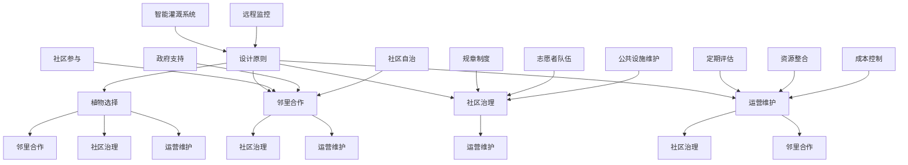

                 

### 新型城市共享阳台花园的兴起与意义

#### 城市共享阳台花园的背景

在城市化进程加速的背景下，城市人口密度不断上升，土地资源日益紧张。传统的公园和绿地已无法满足居民对绿色空间的需求。此外，环境恶化、空气污染等问题也愈发严重，这促使人们开始寻找新的解决方案，以改善城市生态环境和居民生活质量。在这样的背景下，城市共享阳台花园作为一种创新的绿色空间模式应运而生。

城市共享阳台花园的兴起，不仅仅是对传统公园绿地的补充，更是对城市绿色基础设施的创新。它通过在居民楼房的阳台上进行绿化，不仅美化了城市环境，还能有效缓解城市热岛效应，提高空气质量。同时，这种模式还能够为居民提供一个放松身心的场所，促进邻里之间的交流与合作。

#### 城市共享阳台花园的社会意义

城市共享阳台花园具有多重社会意义，首先是对环境改善的贡献。通过在阳台上种植植物，可以吸收二氧化碳，释放氧气，从而改善空气质量。同时，植物的蒸腾作用还能有效降低周围环境的温度，缓解城市热岛效应。此外，阳台上的绿色植物还可以吸附灰尘，减少空气污染。

其次，城市共享阳台花园对居民生活质量的提升具有重要意义。在快节奏的城市生活中，人们常常感到压力重重。而一个绿意盎然的阳台，不仅能让人放松心情，还能提升居住环境的舒适度。此外，阳台花园还能成为居民与邻居互动的场所，促进社区凝聚力的增强。

最后，城市共享阳台花园还对城市规划和社区治理提出了新的要求。在规划上，需要考虑如何合理利用有限的阳台空间，实现绿化和功能的最大化。在治理上，需要建立有效的管理和维护机制，确保花园的长期可持续发展。

#### 城市共享阳台花园的发展趋势

随着科技的进步和社会的不断发展，城市共享阳台花园在未来有着广阔的发展前景。首先，智能化技术的应用将进一步提升阳台花园的便利性和效率。例如，通过智能灌溉系统，可以自动调节水分供给，确保植物健康成长；通过智能监控系统，可以实时监测环境参数，及时发现问题并进行调整。

其次，个性化定制将成为城市共享阳台花园的发展方向。不同居民对阳台花园的需求各不相同，有的可能更注重观赏性，有的可能更注重实用性。因此，提供个性化的设计方案和服务，将更好地满足居民的需求。

最后，社区合作和邻里共建将成为城市共享阳台花园的重要组成部分。通过社区参与和邻里合作，不仅可以提高花园的管理效率，还能增强社区的凝聚力和归属感。

总之，城市共享阳台花园作为一种新兴的城市绿色空间模式，具有显著的环境、社会和经济效益。它不仅能够改善城市生态环境，提高居民生活质量，还能推动城市规划和社区治理的创新。随着未来科技的发展和人们环保意识的提高，城市共享阳台花园将迎来更加广阔的发展前景。

### 共享阳台花园的设计原则与规划

#### 共享阳台花园的空间设计原则

设计一个成功的共享阳台花园，首先需要考虑空间设计原则。这些原则不仅关乎美观，更直接影响花园的功能和使用效果。以下是一些关键的空间设计原则：

1. **功能性分区**：阳台花园应根据功能进行分区，例如休息区、种植区、观赏区等。这种分区可以确保花园的不同区域各司其职，使花园的功能得到最大化利用。例如，休息区可以布置舒适的座椅和绿植，提供一个放松的环境；种植区则应便于植物管理和灌溉。

2. **植物多样性**：在设计中要注重植物的多样性，选择不同种类、不同高度的植物，以营造出丰富的层次感。同时，植物的选择应根据阳台的光照条件和气候特点进行，确保植物能够健康成长。

3. **色彩搭配**：通过色彩的合理搭配，可以提升阳台花园的美观度。例如，可以采用冷暖对比、渐变等色彩搭配手法，创造出视觉上的层次和节奏感。

4. **空间利用率**：在设计中要充分利用阳台的空间，例如使用悬挂式花盆、多层花架等设计，以增加垂直空间的利用率。同时，要避免空间过于拥挤，保持花园的通风和采光。

5. **安全性**：设计时应考虑花园的安全性，例如确保所有植物和设施不会对居民构成安全隐患，设置适当的防护措施，防止儿童或宠物误伤。

#### 共享阳台花园的植物选择策略

植物选择是阳台花园设计的重要环节，合理的植物选择不仅能够提升花园的美观度，还能满足居民的使用需求。以下是一些植物选择策略：

1. **本地植物**：优先选择本地植物，这些植物对当地气候条件有较好的适应性，容易养护且生态效益高。本地植物不仅能够减少维护成本，还能更好地融入城市生态系统。

2. **多功能植物**：选择具有多种功能的植物，例如观花、观叶、药用、食用等，这样可以在满足美观需求的同时，提供实际的使用价值。

3. **季节性植物**：根据季节变化选择合适的植物，使花园在不同季节都有不同的景观效果。例如，春季可以选择开花植物，夏季可以选择耐热植物，秋季可以选择变色植物，冬季可以选择常绿植物。

4. **耐阴植物**：对于光照条件较差的阳台，应选择耐阴植物，如绿萝、吊兰等，这些植物能够在低光照条件下生长良好。

5. **组合种植**：通过组合种植不同种类的植物，可以创造出丰富的景观效果。例如，可以结合灌木、草本植物和攀缘植物，形成多样化的植物群落。

#### 共享阳台花园的规划流程

一个成功的共享阳台花园需要经过系统的规划流程，以下是一个典型的规划流程：

1. **需求分析**：在规划之初，需要与社区居民进行沟通，了解他们的需求和期望。例如，他们希望花园提供哪些功能，对花园的风格和布局有何要求等。

2. **场地勘查**：对阳台进行实地勘查，了解阳台的具体条件，如光照、通风、面积等，为后续设计提供依据。

3. **设计方案制定**：根据需求分析和场地勘查结果，制定出初步的花园设计方案。设计方案应包括总体布局、功能分区、植物选择等。

4. **方案讨论与修改**：将设计方案与社区居民进行讨论，收集反馈意见，并根据意见对设计方案进行修改和完善。

5. **施工实施**：在设计方案确定后，开始进行花园的施工。施工过程中应严格遵循设计方案，确保施工质量。

6. **后期维护**：花园建设完成后，需要进行定期维护，确保花园的长期美观和功能。

通过上述设计原则和规划流程，可以构建一个既美观又实用的共享阳台花园，为城市居民提供一片绿色的家园。

### 邻里合作的模式与机制

#### 邻里合作的定义与类型

邻里合作是指在同一社区或邻里之间，居民为了共同的目标或利益而进行的一种互助合作行为。这种合作形式不仅限于日常生活中的互助，还包括在社区治理、环境改善、文化传承等多个方面。邻里合作的目标是提升社区的整体生活质量，促进居民之间的相互理解和支持。

邻里合作的类型可以从不同的角度进行分类。根据合作的深度和性质，可以分为以下几种类型：

1. **互助型合作**：这种类型的合作主要是为了解决居民在日常生活中遇到的共同问题，如共同购买物资、共享设施等。这种合作形式简单直接，容易实现。

2. **管理型合作**：这种类型的合作涉及对社区公共事务的管理和决策，如社区绿化维护、公共设施的维修等。这种合作需要更复杂的组织和协调机制。

3. **创新型合作**：这种类型的合作是针对社区发展的新需求或新机会，如社区文化活动、环保项目等。这类合作通常需要创新思维和资源整合能力。

4. **公益型合作**：这种类型的合作以公益事业为目的，如社区志愿者活动、慈善捐赠等。这类合作往往具有较高的社会责任感和使命感。

#### 邻里合作机制的建立

邻里合作机制的建立是确保合作顺利进行的基础。以下是一些关键步骤和策略：

1. **建立沟通渠道**：建立有效的沟通渠道是邻里合作的首要任务。可以通过定期社区会议、微信群、公告栏等方式，让居民了解合作进展和需求。

2. **制定规章制度**：制定明确的规章制度，规范合作行为和责任分配。这些规章制度应包括合作目标、职责分工、决策程序、利益分配等方面。

3. **培养社区领袖**：社区领袖在邻里合作中发挥着重要作用。通过培训和支持，培养一批具有领导力和组织能力的社区领袖，可以提升合作的效率和效果。

4. **资源整合**：邻里合作的资源整合能力决定了合作的成功程度。通过整合社区内部资源，如人力资源、物资资源等，可以更有效地实现合作目标。

5. **利益共享**：建立利益共享机制，确保合作的公平性和可持续性。通过共享成果和资源，增强居民的参与感和归属感。

#### 邻里合作的可持续性保障

邻里合作的可持续性是衡量合作成功与否的重要标准。以下是一些保障措施：

1. **持续参与与反馈**：鼓励居民持续参与合作过程，并及时提供反馈。这样可以及时发现和解决问题，确保合作的长期性。

2. **培训与教育**：通过定期的培训和教育活动，提升居民的合作意识和技能，增强社区凝聚力。

3. **激励机制**：建立激励机制，对积极参与和贡献突出的居民给予表彰和奖励，激励更多人参与到邻里合作中。

4. **政策支持**：争取政府和社会组织的政策支持和资金援助，为邻里合作提供保障。

5. **持续评估与改进**：对合作效果进行定期评估，总结经验教训，不断改进合作机制和模式。

通过以上机制和保障措施，可以确保邻里合作的顺利进行和长期发展，为社区建设贡献力量。

### 社区参与与社区治理

#### 社区参与的激励与约束

社区参与是确保邻里合作成功的重要因素，激励和约束机制在提升居民参与度方面发挥着关键作用。以下是一些有效的激励和约束措施：

1. **激励措施**：
   - **表彰与奖励**：定期对积极参与社区活动的居民进行表彰和奖励，如颁发荣誉证书、发放小额奖金等，以激励更多人参与。
   - **社区荣誉**：设立社区荣誉榜，对贡献突出的居民进行公示，提升其社会地位和认可度。
   - **资源和机会**：为积极参与者提供更多的资源和机会，如社区培训、工作机会等，增加其参与的动力。

2. **约束措施**：
   - **责任明确**：在社区规章制度中明确各成员的职责和责任，确保每个人都能明确自己的义务和责任，避免推诿和责任不明。
   - **参与考核**：建立参与考核制度，对居民的参与情况进行定期评估，对未参与或参与度低的居民进行适当提醒或处罚。
   - **社区监督**：建立社区监督机制，鼓励居民对不履行职责的行为进行举报和监督，确保社区合作有序进行。

通过有效的激励和约束措施，可以提升居民的参与意愿和责任感，确保社区治理的顺利进行。

#### 社区治理的结构与功能

社区治理的结构和功能是确保邻里合作有效运行的重要保障。以下是一个典型的社区治理结构和功能框架：

1. **治理结构**：
   - **居民委员会**：作为社区的基层治理机构，负责组织和协调社区的各项事务，代表居民参与社区决策。
   - **志愿者团队**：由热心居民组成的志愿者团队，负责具体社区活动的组织和实施，如环保活动、文化活动等。
   - **专业顾问**：邀请专业人士担任顾问，为社区治理提供技术支持和专业建议。

2. **治理功能**：
   - **决策与规划**：居民委员会负责制定社区发展规划和年度工作计划，确保社区事务有序推进。
   - **组织与管理**：志愿者团队负责组织和实施社区活动，如环保活动、节日庆祝等，确保活动的顺利进行。
   - **监督与反馈**：居民委员会和志愿者团队共同对社区事务进行监督，收集居民反馈，及时调整工作方向。
   - **协调与沟通**：建立有效的沟通渠道，确保居民委员会、志愿者团队和专业顾问之间的信息流通，提升治理效率。

通过清晰的治理结构和明确的职能划分，社区治理能够更加高效、有序地进行，确保邻里合作的有效实施。

#### 社区治理的实践案例

以下是一些成功的社区治理实践案例，这些案例展示了不同社区如何通过有效的治理模式提升邻里合作的效果：

1. **案例一：环保社区**：
   - **背景**：某社区因垃圾处理问题导致环境恶化，居民怨声载道。
   - **措施**：社区成立了环保委员会，制定了详细的垃圾分类和处理规范，组织居民定期参与垃圾分类活动，同时引入了环保志愿者团队，开展环保宣传活动。
   - **效果**：通过这些措施，社区垃圾处理效率显著提升，环境质量得到改善，居民的环保意识也得到增强。

2. **案例二：文化社区**：
   - **背景**：某社区居民对文化生活需求强烈，但缺乏合适的活动场所。
   - **措施**：社区建立了文化中心，定期举办各种文化活动，如音乐会、舞蹈比赛等。同时，鼓励居民自发组织文化社团，提供场地和支持。
   - **效果**：文化社区的氛围日益浓厚，居民的参与度大幅提升，社区凝聚力得到增强。

3. **案例三：互助社区**：
   - **背景**：某社区老人较多，居民之间互帮互助的需求强烈。
   - **措施**：社区建立了互助小组，定期组织志愿者为老人提供生活帮助，如购物、就医等。同时，设立了互助基金，帮助有特殊困难的居民。
   - **效果**：通过这些措施，社区内老人的生活质量显著提高，邻里之间的互助精神得到了传承和发扬。

这些实践案例表明，通过有效的治理模式和激励机制，社区治理能够显著提升邻里合作的效果，改善社区环境，提高居民生活质量。

### 共享阳台花园的运营策略

#### 运营模式的选择

共享阳台花园的运营模式直接影响到其长远发展和效果，因此选择合适的运营模式至关重要。以下是一些常见的运营模式及其优缺点：

1. **政府主导模式**：
   - **优点**：政府主导可以确保资源投入和政策支持，有利于项目的规范化和可持续发展。
   - **缺点**：可能导致运营效率较低，缺乏灵活性和居民参与度。

2. **社区自治模式**：
   - **优点**：提高居民的参与度和责任感，增强社区凝聚力。
   - **缺点**：可能面临资源不足和治理能力不足的问题。

3. **企业运营模式**：
   - **优点**：专业化和商业化运作，提高运营效率和盈利能力。
   - **缺点**：可能增加居民的经济负担，减少社区参与度。

4. **混合运营模式**：
   - **优点**：结合政府、社区和企业各自的优势，实现资源整合和高效运营。
   - **缺点**：需要复杂的协调和管理机制。

在选择运营模式时，应综合考虑社区的实际情况、居民的需求和可用的资源，选择最合适的模式。例如，一个资源丰富、居民积极参与的社区可能更适合采用社区自治模式，而一个缺乏人力资源和财政支持的社区可能需要更多依赖政府或企业的支持。

#### 运营成本的控制

运营成本的控制是确保共享阳台花园长期可持续运营的关键。以下是一些有效的成本控制策略：

1. **资源整合**：通过整合社区内外部资源，如志愿者服务、物资捐赠等，降低运营成本。
2. **智能化管理**：利用智能灌溉系统、远程监控等智能化手段，提高资源利用效率，降低人工成本。
3. **定期维护**：制定合理的维护计划，定期对花园设施和植物进行检查和维护，避免因设施损坏导致的额外维修成本。
4. **社会化运营**：通过引入商业元素，如设置共享休息区、售卖有机农产品等，实现部分成本的自我消化。

#### 运营效果的评估

运营效果的评估是衡量共享阳台花园成功与否的重要指标。以下是一些评估方法和指标：

1. **居民满意度**：通过问卷调查、访谈等方式收集居民对花园运营的满意度，评估居民的实际体验和需求满足度。
2. **生态效益**：评估花园对空气质量、温度、湿度等环境参数的改善效果，以及植物吸收二氧化碳、释放氧气等生态效益。
3. **社区参与度**：统计居民参与花园维护和活动的频率和积极性，评估社区凝聚力和互助精神。
4. **经济效益**：评估花园运营的经济效益，包括成本控制、收入来源和盈利能力。

通过定期的效果评估，可以及时发现和解决问题，不断优化运营策略，确保共享阳台花园的长远发展。

### 共享阳台花园的维护管理

#### 维护管理的重要性

共享阳台花园的维护管理是确保其长期健康发展的关键。良好的维护管理不仅可以保持花园的美观和功能，还能延长植物和设施的使用寿命，提高整体运营效率。以下是一些维护管理的重要性：

1. **植物健康**：定期的维护管理可以确保植物得到充足的水分、养分和光照，防止病虫害的发生，提高植物的存活率和观赏效果。
2. **设施维护**：及时检查和维修设施，如花架、灌溉系统等，可以避免因设施故障导致的安全问题和运营中断。
3. **环境保护**：良好的维护管理可以确保花园环境卫生，减少垃圾堆积和污染，提升社区的整体环境质量。
4. **居民满意度**：通过定期维护管理，确保花园始终保持良好的状态，提升居民的使用体验和满意度，增强社区凝聚力。

#### 维护管理的内容与方法

共享阳台花园的维护管理内容丰富，涉及植物养护、设施维护、环境卫生等多个方面。以下是一些具体的维护管理内容和相应的方法：

1. **植物养护**：
   - **灌溉**：根据植物的生长习性，制定合理的灌溉计划，避免过量或不足灌溉。智能灌溉系统可以自动调节水分供给，提高效率。
   - **施肥**：根据植物的生长周期和营养需求，定期施用有机肥料，确保植物获得充足的营养。
   - **修剪**：定期对植物进行修剪，控制其生长高度和形态，促进植物的健康生长。

2. **设施维护**：
   - **检查**：定期检查花架、灌溉系统、照明设施等，确保其正常运行，及时发现问题并进行维修。
   - **更新**：根据设施的使用寿命和损坏情况，及时进行更新和替换，确保设施的质量和安全性。

3. **环境卫生**：
   - **清理**：定期清理花园内的垃圾和杂物，保持花园的整洁和美观。
   - **消毒**：定期对公共设施和休息区进行消毒，防止病菌传播，确保居民的健康安全。

#### 维护管理的案例分享

以下是一些维护管理的实践案例，展示了如何通过有效的维护管理确保共享阳台花园的长期健康发展：

1. **案例一：智能灌溉系统**：
   - **背景**：某社区阳台花园的灌溉管理主要依赖人工，效率低且容易出现水资源浪费。
   - **措施**：引入智能灌溉系统，通过传感器实时监测土壤湿度，自动调节水流量和灌溉时间，提高了水资源的利用效率。
   - **效果**：灌溉管理效率显著提升，水资源浪费减少，植物生长状况得到明显改善。

2. **案例二：社区志愿者队伍**：
   - **背景**：某社区阳台花园的维护管理缺乏人力资源，导致植物生长不良和设施老化。
   - **措施**：组建社区志愿者队伍，定期组织居民参与花园的维护和管理工作，提高社区参与度和责任感。
   - **效果**：通过志愿者的积极参与，花园的维护管理得到了有效保障，花园的环境质量和居民满意度显著提升。

3. **案例三：定期检查与维修**：
   - **背景**：某社区阳台花园的灌溉系统和花架因长时间使用而出现故障，影响花园的正常运营。
   - **措施**：制定定期检查和维护计划，定期对灌溉系统和花架进行检查和维修，确保设施的正常运行。
   - **效果**：通过定期的检查和维修，及时发现问题并加以解决，避免了设施故障对花园运营的影响，确保了花园的长期健康发展。

这些案例表明，通过科学的维护管理方法，可以有效提升共享阳台花园的管理效率和质量，确保其长期可持续发展。

### 新型城市共享阳台花园案例分析

#### 国内新型城市共享阳台花园案例

1. **北京798艺术区阳台花园**：
   - **背景**：798艺术区作为一个具有代表性的现代艺术区，其阳台花园不仅为艺术家和居民提供了放松身心的场所，也成为艺术展示和社区互动的平台。
   - **措施**：通过合理规划，将不同风格的阳台花园分布在艺术区的各个角落，鼓励居民参与设计和维护，形成了独特的艺术氛围和社区文化。
   - **效果**：阳台花园不仅提升了艺术区的环境质量，还增强了居民之间的互动和社区凝聚力。

2. **上海杨浦滨江阳台花园**：
   - **背景**：杨浦滨江是一个老旧工业区改造而成的滨水区域，阳台花园的建立旨在改善环境质量和提升居民生活品质。
   - **措施**：通过社区动员和志愿者参与，搭建了多个阳台花园，不仅种植了多种植物，还设置了休憩区和公共活动空间。
   - **效果**：阳台花园的成功建设不仅改善了杨浦滨江的环境，还促进了社区参与和邻里关系的和谐。

#### 国外新型城市共享阳台花园案例

1. **纽约曼哈顿共享阳台花园**：
   - **背景**：曼哈顿作为全球知名的繁华都市，其阳台花园旨在缓解城市压力和改善空气质量。
   - **措施**：通过政府支持和社区参与，建立了多个共享阳台花园，每个花园都有不同的主题和功能，如植物种植、儿童游乐、社区聚会等。
   - **效果**：阳台花园不仅为居民提供了亲近自然的场所，还促进了社区互动和城市文化的多样性。

2. **日本东京中城阳台花园**：
   - **背景**：东京中城是一个现代化商业区，阳台花园的建立旨在提升城市绿化水平和居民生活质量。
   - **措施**：通过专业设计和管理，阳台花园实现了智能化灌溉和远程监控，确保植物的健康生长和环境的可持续发展。
   - **效果**：阳台花园的成功建设不仅提升了商业区的环境品质，还成为了东京中城的一张绿色名片。

#### 案例对比分析与启示

通过对比国内外新型城市共享阳台花园的案例，可以发现以下共性和差异：

1. **共性**：
   - **政府支持**：无论是国内还是国外，政府的大力支持都是阳台花园成功建设的关键。
   - **社区参与**：阳台花园的成功离不开居民的积极参与和社区自治。
   - **智能化管理**：通过智能灌溉系统、远程监控等技术手段，提高阳台花园的管理效率。

2. **差异**：
   - **文化背景**：国内外阳台花园的设计理念和文化背景有所不同，国内更注重社区参与和生态效益，国外则更注重城市文化和创新性。
   - **资源利用**：国外阳台花园在资源利用和可持续发展方面更为成熟，国内则更多依赖于政府的支持和社会动员。

这些案例为我国新型城市共享阳台花园的建设提供了宝贵的经验和启示。首先，应加强政府支持，提供政策、资金和技术等多方面的支持。其次，应鼓励社区参与，通过社区动员和自治，提升居民的参与度和责任感。最后，应借鉴国外经验，引入智能化管理，提高阳台花园的管理效率和质量。通过这些措施，我国新型城市共享阳台花园将能够更好地实现其环境、社会和经济效益。

### 未来展望与挑战

#### 城市共享阳台花园的发展前景

随着城市化进程的加快和人们环保意识的提升，城市共享阳台花园具有广阔的发展前景。首先，智能化技术的应用将进一步提升阳台花园的便利性和管理效率，如智能灌溉系统、远程监控等，将有助于优化资源利用和维护管理。其次，个性化定制将成为阳台花园的发展方向，满足不同居民的多样化需求。此外，社区参与和邻里共建的模式也将逐渐成熟，提升社区的凝聚力和居民的幸福感。

#### 城市共享阳台花园面临的挑战

尽管城市共享阳台花园具有巨大的发展潜力，但其在实践中仍面临诸多挑战。首先，资源限制是一个关键问题，尤其是在人口密集的城市区域，土地资源有限，阳台空间争夺激烈。其次，技术瓶颈也是一大挑战，如智能化系统的稳定性和可靠性、植物生长的环境控制等。此外，社区治理和居民参与度不足，可能导致项目管理和维护的难度增加。最后，政策和法规的支持不足，使得阳台花园的规范化建设面临障碍。

#### 未来发展趋势与对策

为了克服这些挑战，确保城市共享阳台花园的可持续发展，以下是一些可能的对策和趋势：

1. **技术创新**：持续推动智能化技术在阳台花园中的应用，如智能灌溉、环境监测等，提高管理效率和质量。

2. **社区共建**：鼓励和引导社区参与和邻里共建，通过社区动员和自治，提升居民参与度和责任感。

3. **政策支持**：政府应加大对城市共享阳台花园的政策支持，提供资金、技术和法规等方面的保障。

4. **资源共享**：通过资源整合，优化阳台空间和植物选择，实现资源的高效利用。

5. **可持续发展**：注重生态效益和环境保护，确保阳台花园的长期可持续性。

通过这些对策，城市共享阳台花园将能够在未来实现健康、持续的发展，为城市居民提供更加美好的绿色生活空间。

### 附录

#### 城市共享阳台花园资源与参考资料

为了更好地理解和实施城市共享阳台花园的建设，以下列出了一些设计资源、研究报告、文献以及实践案例和经验总结：

1. **设计资源与工具**：
   - 《城市园林设计规范》
   - 《阳台绿化设计手册》
   - 智能灌溉系统供应商列表
   - 垂直绿化植物选择指南

2. **研究报告与文献**：
   - 《城市绿色基础设施的发展现状与趋势》
   - 《社区绿色空间的生态效益评估》
   - 《智能化技术在城市绿化中的应用研究》

3. **实践案例与经验总结**：
   - 北京798艺术区阳台花园案例报告
   - 上海杨浦滨江阳台花园建设经验
   - 日本东京中城阳台花园管理策略

通过这些资源和参考资料，可以更好地指导城市共享阳台花园的设计、建设和运营，确保项目的成功实施和长期发展。

### 核心概念原理与架构 Mermaid 流程图

城市共享阳台花园的核心概念包括设计原则、植物选择、邻里合作、社区治理、运营维护等。以下是这些概念之间的相互关系和流程：

这个流程图展示了城市共享阳台花园中各个核心概念之间的关系，以及智能化技术、社区参与、政府支持等对各个环节的支撑作用。通过这个图，可以清晰地理解城市共享阳台花园的架构和运行机制。

