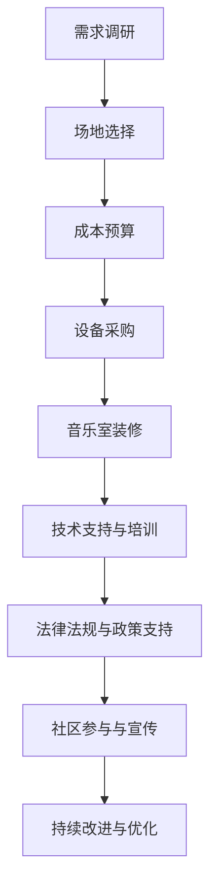

                 

### 第2章: 新型城市共享音乐室的规划与建设

**2.1 规划前的准备工作**

在着手规划与建设新型城市共享音乐室之前，必须进行一系列的前期准备工作，以确保项目的成功实施。

#### **需求调研**

- **目标用户分析**：明确目标用户群体，如业余音乐人、音乐爱好者、教育机构等。这有助于设计出满足用户需求的功能和服务。
- **场地选择**：根据用户需求，选择合适的场地，如废弃厂房、社区中心等。场地的地理位置、面积、周边设施等都是重要考虑因素。

#### **成本预算**

- **设备采购费用**：包括音响设备、乐器、录音设备等。这需要详细的预算清单，确保每一项开支都得到合理的规划。
- **装修费用**：音乐室的装修需考虑到隔音、照明、通风等因素。装修的质量直接影响到音乐室的使用效果和用户体验。
- **运营维护费用**：包括人员工资、水电费、设备维护等。这是确保音乐室长期稳定运营的关键。

**2.2 设备采购与配置**

- **基本设备清单**：
  - **音响设备**：包括音箱、功放、调音台等。这些设备是音乐室的核心，直接影响到音乐的质量和效果。
  - **乐器**：吉他、贝斯、键盘等。这些乐器是音乐人创作和练习的基本工具。
  - **录音设备**：麦克风、录音笔等。录音设备对于音乐创作和制作至关重要，需要选择高品质的设备以保证录音质量。

- **软件配置**：
  - **音乐制作软件**：如Logic Pro、Ableton Live等。这些软件提供了丰富的音乐创作和制作工具，是音乐人的得力助手。
  - **音频处理软件**：如Audacity、FL Studio等。这些软件用于音频的编辑和处理，可以提升音乐作品的品质。

**2.3 音乐室装修与布置**

- **隔音措施**：
  - **墙体隔音**：使用隔音板、隔音棉等材料。这可以有效减少外界噪音的干扰，提供更好的音乐创作环境。
  - **门窗隔音**：选择隔音效果好的门窗，进一步减少噪音干扰。
- **照明与通风**：良好的照明和通风条件对于音乐创作和练习至关重要。照明应柔和而不刺眼，通风要确保室内空气清新。

**2.4 技术支持与培训**

- **技术支持**：提供专业的技术支持，包括设备维护、故障排查等。这有助于保障音乐室的正常运营和用户的良好体验。
- **培训**：为音乐人提供专业的音乐培训和指导，帮助他们提升创作和表演水平。这不仅可以提高音乐室的使用效率，还可以为社区培养更多的音乐人才。

**2.5 法律法规与政策支持**

- **了解相关法律法规**：在规划与建设过程中，需要了解和遵守相关的法律法规，如消防安全、知识产权保护等。
- **寻求政策支持**：一些地方政府和部门可能会提供政策支持，如税收优惠、资金补贴等。这些支持对于音乐室的发展至关重要。

**2.6 社区参与与宣传**

- **社区参与**：鼓励社区居民参与到音乐室的运营和管理中，共同打造社区文化品牌。这不仅可以增强社区凝聚力，还可以提升音乐室的社会影响力。
- **宣传推广**：通过多种渠道进行宣传推广，如社交媒体、传统媒体等，提高音乐室的知名度和吸引力。

### Mermaid 流程图：新型城市共享音乐室的建设流程



**总结**

新型城市共享音乐室的规划与建设是一个复杂而细致的过程，需要充分考虑用户需求、场地选择、设备采购、装修布置、技术支持和法律法规等多方面因素。通过合理的规划和科学的实施，新型城市共享音乐室将成为城市文化的新亮点，为音乐人提供良好的创作和交流平台。**作者：AI天才研究院/AI Genius Institute & 禅与计算机程序设计艺术 /Zen And The Art of Computer Programming**。

----------------------------------------------------------------

```markdown
## 第2章: 新型城市共享音乐室的规划与建设

**2.1 规划前的准备工作**

在着手规划与建设新型城市共享音乐室之前，必须进行一系列的前期准备工作，以确保项目的成功实施。

#### **需求调研**

- **目标用户分析**：明确目标用户群体，如业余音乐人、音乐爱好者、教育机构等。这有助于设计出满足用户需求的功能和服务。
- **场地选择**：根据用户需求，选择合适的场地，如废弃厂房、社区中心等。场地的地理位置、面积、周边设施等都是重要考虑因素。

#### **成本预算**

- **设备采购费用**：包括音响设备、乐器、录音设备等。这需要详细的预算清单，确保每一项开支都得到合理的规划。
- **装修费用**：音乐室的装修需考虑到隔音、照明、通风等因素。装修的质量直接影响到音乐室的使用效果和用户体验。
- **运营维护费用**：包括人员工资、水电费、设备维护等。这是确保音乐室长期稳定运营的关键。

**2.2 设备采购与配置**

- **基本设备清单**：
  - **音响设备**：包括音箱、功放、调音台等。这些设备是音乐室的核心，直接影响到音乐的质量和效果。
  - **乐器**：吉他、贝斯、键盘等。这些乐器是音乐人创作和练习的基本工具。
  - **录音设备**：麦克风、录音笔等。录音设备对于音乐创作和制作至关重要，需要选择高品质的设备以保证录音质量。

- **软件配置**：
  - **音乐制作软件**：如Logic Pro、Ableton Live等。这些软件提供了丰富的音乐创作和制作工具，是音乐人的得力助手。
  - **音频处理软件**：如Audacity、FL Studio等。这些软件用于音频的编辑和处理，可以提升音乐作品的品质。

**2.3 音乐室装修与布置**

- **隔音措施**：
  - **墙体隔音**：使用隔音板、隔音棉等材料。这可以有效减少外界噪音的干扰，提供更好的音乐创作环境。
  - **门窗隔音**：选择隔音效果好的门窗，进一步减少噪音干扰。
- **照明与通风**：良好的照明和通风条件对于音乐创作和练习至关重要。照明应柔和而不刺眼，通风要确保室内空气清新。

**2.4 技术支持与培训**

- **技术支持**：提供专业的技术支持，包括设备维护、故障排查等。这有助于保障音乐室的正常运营和用户的良好体验。
- **培训**：为音乐人提供专业的音乐培训和指导，帮助他们提升创作和表演水平。这不仅可以提高音乐室的使用效率，还可以为社区培养更多的音乐人才。

**2.5 法律法规与政策支持**

- **了解相关法律法规**：在规划与建设过程中，需要了解和遵守相关的法律法规，如消防安全、知识产权保护等。
- **寻求政策支持**：一些地方政府和部门可能会提供政策支持，如税收优惠、资金补贴等。这些支持对于音乐室的发展至关重要。

**2.6 社区参与与宣传**

- **社区参与**：鼓励社区居民参与到音乐室的运营和管理中，共同打造社区文化品牌。这不仅可以增强社区凝聚力，还可以提升音乐室的社会影响力。
- **宣传推广**：通过多种渠道进行宣传推广，如社交媒体、传统媒体等，提高音乐室的知名度和吸引力。

### Mermaid 流程图：新型城市共享音乐室的建设流程


**总结**

新型城市共享音乐室的规划与建设是一个复杂而细致的过程，需要充分考虑用户需求、场地选择、设备采购、装修布置、技术支持和法律法规等多方面因素。通过合理的规划和科学的实施，新型城市共享音乐室将成为城市文化的新亮点，为音乐人提供良好的创作和交流平台。

**作者：AI天才研究院/AI Genius Institute & 禅与计算机程序设计艺术 /Zen And The Art of Computer Programming**
```

