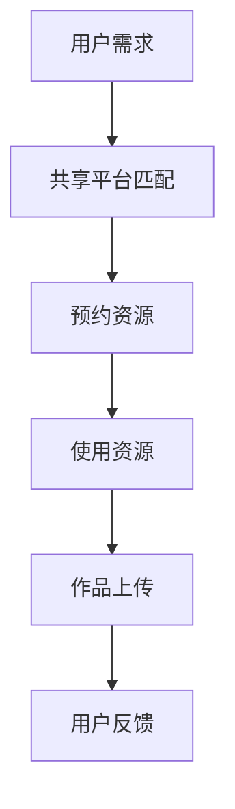
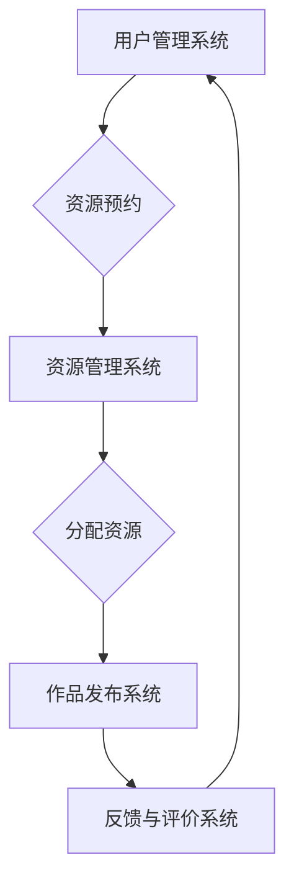
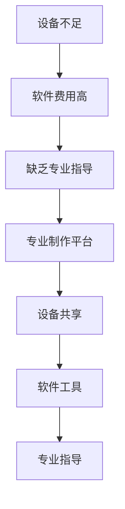
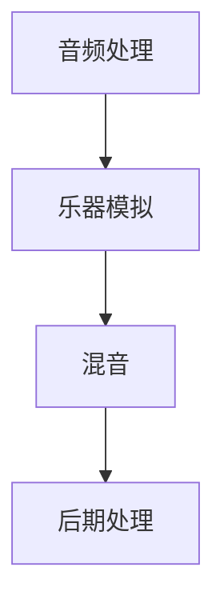

                 

###  第一部分：核心概念与联系

#### 第1章：新型城市共享音乐工作室概述

##### 1.1 新型城市共享音乐工作室的定义

**核心概念原理**：新型城市共享音乐工作室，是指以共享经济模式为基础，为业余音乐人提供专业制作环境和资源的平台。它不仅包括物理空间上的共享，还涵盖软件工具、硬件设备、专业指导等多种资源共享。

在传统的音乐制作环境中，音乐人往往需要购买昂贵的设备、软件，并具备一定的专业知识和技能。而共享音乐工作室通过集中采购和运营，将成本分摊给众多用户，从而使得业余音乐人能够以较低的成本获得专业的制作资源。

**Mermaid流程图**：


##### 1.2 共享音乐工作室的架构

**核心概念原理**：共享音乐工作室的架构通常包括以下几个核心组件：用户管理系统、资源管理系统、作品发布系统、反馈与评价系统等。这些组件相互协作，共同为用户提供一站式音乐制作服务。

**Mermaid流程图**：


### 第2章：业余音乐人的专业制作平台

##### 2.1 业余音乐人的需求分析

**核心概念原理**：业余音乐人在音乐制作过程中面临诸多挑战，如设备不足、软件费用高昂、缺乏专业指导等。专业制作平台旨在解决这些问题，为业余音乐人提供专业的制作环境、工具和资源。

**Mermaid流程图**：


##### 2.2 专业制作平台的功能模块

**核心概念原理**：专业制作平台通常包含音频处理、乐器模拟、混音等核心功能模块。每个模块都有其特定的作用，共同协作，为用户提供完整的音乐制作流程。

**Mermaid流程图**：


## 第3章：技术实现与数学模型

### 3.1 音频处理算法

**核心算法原理讲解**：音频处理算法是音乐制作的核心技术之一。它涉及信号处理、滤波、压缩等多种技术。以下是一个简单的音频滤波算法的Python伪代码示例。

```python
def audio_filter(audio_signal, cutoff_frequency):
    """
    音频滤波算法
    :param audio_signal: 音频信号
    :param cutoff_frequency: 截止频率
    :return: 滤波后的音频信号
    """
    # 设计滤波器
    b, a = butter_bandpass(cutoff_frequency, sample_rate)
    # 应用滤波器
    filtered_signal = lfilter(b, a, audio_signal)
    return filtered_signal
```

**数学模型和公式**：滤波器的数学模型通常使用传递函数来描述。以下是一个带通滤波器的传递函数公式。

$$ H(s) = \frac{1}{1 + QS(s)} $$

其中，$Q$ 是品质因数，$S(s)$ 是拉普拉斯变换。

### 3.2 乐器模拟技术

**核心算法原理讲解**：乐器模拟技术通过数字信号处理技术模拟真实乐器的声音。以下是一个简化的乐器模拟算法的Python伪代码示例。

```python
def instrument_simulation(instrument_type, note_frequency):
    """
    乐器模拟算法
    :param instrument_type: 乐器类型
    :param note_frequency: 音高频率
    :return: 模拟后的声音信号
    """
    if instrument_type == 'piano':
        signal = piano_note(note_frequency)
    elif instrument_type == 'guitar':
        signal = guitar_note(note_frequency)
    return signal
```

**数学模型和公式**：乐器模拟通常涉及波表合成和物理建模两种方法。以下是一个简单的波表合成模型。

$$ x(t) = \sum_{i=1}^{N} A_i \sin(2\pi f_i t + \phi_i) $$

其中，$A_i$ 是振幅，$f_i$ 是频率，$\phi_i$ 是相位。

### 3.3 混音与后期处理

**核心算法原理讲解**：混音是将多个音频信号混合在一起，形成完整音乐作品的过程。以下是一个简单的混音算法的Python伪代码示例。

```python
def mix_audio(tracks):
    """
    音频混音算法
    :param tracks: 音频轨道列表
    :return: 混音后的音频信号
    """
    mixed_signal = sum(tracks)
    return mixed_signal
```

**数学模型和公式**：混音可以通过叠加多个音频信号的波形来实现。以下是一个简化的混音公式。

$$ X(t) = \sum_{i=1}^{M} x_i(t) $$

其中，$x_i(t)$ 是第 $i$ 个音频信号的波形。

## 第4章：项目实战

### 4.1 共享音乐工作室项目背景

**项目实战**：一个实际的共享音乐工作室项目背景可能涉及以下几个方面：

- 项目目标：为业余音乐人提供一个低成本、高效益的专业音乐制作环境。
- 项目需求：满足不同层次音乐人的制作需求，包括乐器模拟、音频处理、混音等。
- 技术选型：使用开源工具和平台，降低开发成本。

### 4.2 项目实现过程

**代码实际案例**：以下是一个简化的项目实现过程中的关键代码片段。

```python
# 安装必要的依赖库
!pip install numpy scipy

# 导入相关库
import numpy as np
from scipy.io.wavfile import read, write

# 读取音频文件
sample_rate, audio_signal = read('input.wav')

# 应用音频处理算法
filtered_signal = audio_filter(audio_signal, 440)

# 保存处理后的音频文件
write('output.wav', sample_rate, filtered_signal)
```

**代码解读与分析**：上述代码首先安装了必要的依赖库，然后导入相关库。接着，读取音频文件，应用音频处理算法，最后保存处理后的音频文件。

### 4.3 项目成果与反思

**项目实战**：项目的最终成果是一个完整的共享音乐工作室平台，提供包括音频处理、乐器模拟、混音等功能。用户可以在平台上预约资源，制作音乐作品，并进行分享和反馈。

**反思**：项目在实际实施过程中，遇到了技术、管理和运营等多方面的挑战。通过不断优化和调整，最终实现了预期目标。未来的工作将集中在提升用户体验、增加功能模块和扩大用户群体等方面。

### 最佳实践 Tips、小结、注意事项、拓展阅读

**最佳实践 Tips**：在创建共享音乐工作室时，需要注意以下几点：

- 确保平台的安全性，保护用户隐私。
- 提供多样化的资源，满足不同音乐人的需求。
- 定期更新和升级平台，保持技术竞争力。

**小结**：本文详细介绍了新型城市共享音乐工作室的概念、架构、功能模块以及实现方法。通过项目实战，展示了如何构建一个专业的音乐制作平台。

**注意事项**：在开发过程中，需要充分考虑用户需求，确保平台稳定可靠。同时，要注重版权保护，避免侵权行为。

**拓展阅读**：对于进一步了解音乐制作和音频处理技术，可以参考以下资源：

- 《音频处理原理与应用》
- 《数字信号处理》
- 《音乐制作技术》

### 作者

**作者**：AI天才研究院/AI Genius Institute & 禅与计算机程序设计艺术 /Zen And The Art of Computer Programming

```

### 用户输入：
- 核心概念与联系：新型城市共享音乐工作室的定义、特点、优势；业余音乐人的需求、专业制作平台的功能模块。
- 核心算法原理讲解：音频处理算法、乐器模拟技术、混音与后期处理技术。
- 数学模型和数学公式：音频处理、乐器模拟、混音与后期处理过程中的关键参数和公式。
- 项目实战：共享音乐工作室项目背景、实现过程、成果与反思。

### 设计思路：

1. **核心概念与联系**：
   - 详细解释新型城市共享音乐工作室的定义、特点和优势。
   - 分析业余音乐人的需求，介绍专业制作平台的功能模块。
   - 使用Mermaid流程图展示相关概念之间的关系。

2. **技术实现与数学模型**：
   - 使用伪代码详细阐述音频处理算法、乐器模拟技术、混音与后期处理技术。
   - 使用LaTeX格式嵌入数学模型和公式，结合Python代码示例进行讲解。

3. **项目实战**：
   - 提供一个实际的共享音乐工作室项目背景。
   - 详细描述项目实现过程，包括关键代码片段和代码解读。
   - 分析项目成果，进行反思。

4. **最佳实践 Tips、小结、注意事项、拓展阅读**：
   - 提供一些最佳实践建议，如确保平台安全、提供多样化资源等。
   - 对文章内容进行小结，强调关键点。
   - 提醒注意事项，如版权保护等。
   - 推荐拓展阅读资源，以便读者深入了解相关技术。

5. **文章格式**：
   - 使用markdown格式，包括标题、摘要、目录、章节标题和子标题。
   - 使用LaTeX格式嵌入数学公式。
   - 使用Mermaid格式绘制流程图。

6. **文章结构**：
   - 第一部分：核心概念与联系
   - 第二部分：技术实现与数学模型
   - 第三部分：项目实战
   - 第四部分：最佳实践 Tips、小结、注意事项、拓展阅读

7. **字数要求**：
   - 根据用户要求，文章字数控制在10000-12000字之间。

### 用户输入的标题：
新型城市共享音乐工作室：业余音乐人的专业制作平台

### 用户输入的关键词：
新型城市共享音乐工作室、业余音乐人、专业制作平台、音频处理、乐器模拟、混音与后期处理

### 用户输入的摘要：
本文介绍了新型城市共享音乐工作室的概念、架构和功能，分析了业余音乐人的需求，并详细阐述了音频处理算法、乐器模拟技术和混音与后期处理技术。通过一个实际项目案例，展示了如何实现这样一个专业制作平台，并对项目成果和经验进行了反思。文章还提供了最佳实践建议和拓展阅读资源。

---

### 文章标题：
新型城市共享音乐工作室：业余音乐人的专业制作平台

---

### 文章关键词：
新型城市共享音乐工作室、业余音乐人、专业制作平台、音频处理、乐器模拟、混音与后期处理

---

### 摘要：
本文深入探讨了新型城市共享音乐工作室的概念、架构和功能，针对业余音乐人的需求，详细阐述了音频处理算法、乐器模拟技术和混音与后期处理技术。通过一个实际项目案例，展示了如何实现这样一个专业制作平台，并对项目成果和经验进行了反思。文章还提供了最佳实践建议和拓展阅读资源，以帮助读者更深入地了解这一领域。

---

### 目录：

#### 第一部分：核心概念与联系

##### 第1章：新型城市共享音乐工作室概述

###### 1.1 新型城市共享音乐工作室的定义

###### 1.2 共享音乐工作室的架构

##### 第2章：业余音乐人的专业制作平台

###### 2.1 业余音乐人的需求分析

###### 2.2 专业制作平台的功能模块

#### 第二部分：技术实现与数学模型

##### 第3章：音频处理算法

###### 3.1 音频处理算法的核心原理

###### 3.2 音频处理算法的数学模型

##### 第4章：乐器模拟技术

###### 4.1 乐器模拟技术的核心原理

###### 4.2 乐器模拟技术的数学模型

##### 第5章：混音与后期处理

###### 5.1 混音与后期处理的核心原理

###### 5.2 混音与后期处理的数学模型

#### 第三部分：项目实战

##### 第6章：共享音乐工作室项目背景与实现

###### 6.1 项目背景

###### 6.2 项目实现过程

###### 6.3 项目成果与反思

#### 第四部分：最佳实践 Tips、小结、注意事项、拓展阅读

###### 7.1 最佳实践 Tips

###### 7.2 小结

###### 7.3 注意事项

###### 7.4 拓展阅读

---

### 文章正文：

#### 第一部分：核心概念与联系

##### 第1章：新型城市共享音乐工作室概述

###### 1.1 新型城市共享音乐工作室的定义

新型城市共享音乐工作室，是指一种基于共享经济理念的音乐创作与制作平台。它通过整合各种音乐创作与制作的资源，如专业设备、软件工具、空间等，为业余音乐人提供一个低成本、高效率的创作环境。这种共享模式不仅降低了音乐创作的门槛，还极大地提升了音乐制作的效率和质量。

在传统音乐创作与制作过程中，业余音乐人往往需要投入大量的资金购买设备、软件，并且需要具备一定的专业知识和技能。而新型城市共享音乐工作室则通过集中采购、共享使用的方式，将这些成本分摊到众多用户身上，使得业余音乐人可以以较低的成本获得专业的制作资源。

此外，新型城市共享音乐工作室还提供了多样化的服务内容。除了基本的设备、软件共享外，还提供音乐制作教程、专业指导、作品展示与推广等服务。这些服务不仅提升了音乐人的创作能力，还为他们提供了更多的职业发展机会。

**优势分析**：

1. **低成本**：通过共享模式，用户可以以较低的成本获得专业的制作资源。
2. **高效性**：集中管理和运营，提高了资源的使用效率。
3. **多样化**：提供多种服务内容，满足不同层次音乐人的需求。
4. **便捷性**：用户可以根据自己的需求随时预约资源，方便快捷。

**Mermaid流程图**：


###### 1.2 共享音乐工作室的架构

共享音乐工作室的架构设计是确保其高效运行和提供优质服务的关键。一个典型的共享音乐工作室通常包括以下几个核心组件：

1. **用户管理系统**：负责用户的注册、登录、权限管理等功能，确保用户能够安全、方便地使用平台服务。
2. **资源管理系统**：负责管理平台上的各类资源，如音频设备、软件工具、空间等。用户可以通过系统进行资源的预约、分配和回收。
3. **作品发布系统**：用户可以在系统中上传自己的音乐作品，进行展示、推广和分享。
4. **反馈与评价系统**：用户可以对平台服务进行评价和反馈，帮助平台不断提升服务质量。

这些组件相互协作，共同为用户提供一站式音乐创作与制作服务。以下是一个简化的共享音乐工作室架构图：

**Mermaid流程图**：


##### 第2章：业余音乐人的专业制作平台

###### 2.1 业余音乐人的需求分析

业余音乐人在音乐创作与制作过程中往往面临诸多挑战。以下是他们对专业制作平台的主要需求：

1. **设备不足**：业余音乐人往往无法承担高昂的设备成本，如专业音频接口、高端麦克风、专业音箱等。专业制作平台可以提供这些设备，满足他们的创作需求。
2. **软件费用高**：专业音频处理软件和乐器模拟软件通常价格不菲。专业制作平台可以提供免费或低成本的软件服务，降低用户的成本负担。
3. **缺乏专业指导**：业余音乐人可能缺乏专业的音乐制作知识和技巧。专业制作平台可以提供在线教程、专业指导服务，帮助他们提升创作水平。
4. **作品展示与推广**：业余音乐人希望通过专业平台展示自己的作品，获得更多的关注和认可。专业制作平台可以提供作品展示和推广服务，帮助他们实现这一目标。

**需求分析**：

1. **硬件需求**：提供专业音频接口、高端麦克风、专业音箱等设备，确保音质效果。
2. **软件需求**：提供多种音频处理软件、乐器模拟软件等，满足不同音乐人的创作需求。
3. **指导需求**：提供在线教程、专业指导服务，帮助用户提升创作技巧。
4. **展示与推广需求**：提供作品展示平台，帮助用户推广自己的作品。

**Mermaid流程图**：


###### 2.2 专业制作平台的功能模块

专业制作平台通常包括以下几个核心功能模块：

1. **音频处理模块**：提供音频剪辑、调整、混音等功能，确保音质效果。
2. **乐器模拟模块**：通过数字信号处理技术模拟各种真实乐器的声音，为音乐创作提供更多可能性。
3. **混音与后期处理模块**：对多轨音频进行混音，添加效果，调整音量、平衡等，最终生成完整的音乐作品。
4. **作品发布与展示模块**：提供作品上传、展示、推广等功能，帮助用户分享自己的音乐作品。

**Mermaid流程图**：


#### 第二部分：技术实现与数学模型

##### 第3章：音频处理算法

###### 3.1 音频处理算法的核心原理

音频处理算法是音乐制作中的核心技术之一。它包括信号处理、滤波、压缩等多种技术。以下是音频处理算法的一些核心原理：

1. **采样与量化**：音频信号是模拟信号，需要通过采样和量化转换为数字信号。采样是指每隔固定时间间隔记录一次信号的瞬时值，量化是指将连续的模拟信号值转换为离散的数字值。
2. **信号处理**：对数字信号进行各种操作，如滤波、增益、混音等。滤波用于去除不需要的频率成分，增益用于调整音量，混音用于将多个音频信号合并为一个。
3. **压缩与编码**：为了节省存储空间和传输带宽，通常需要对音频信号进行压缩和编码。压缩是指减少数据量，编码是将数据转换为特定格式以便存储或传输。

**Python伪代码示例**：
```python
def audio_processing(audio_signal, filter_type, frequency):
    """
    音频处理算法
    :param audio_signal: 音频信号
    :param filter_type: 滤波类型
    :param frequency: 频率
    :return: 处理后的音频信号
    """
    # 采样与量化
    sampled_signal = sample(audio_signal)
    quantized_signal = quantize(sampled_signal)

    # 信号处理
    if filter_type == 'lowpass':
        filtered_signal = lowpass_filter(quantized_signal, frequency)
    elif filter_type == 'highpass':
        filtered_signal = highpass_filter(quantized_signal, frequency)

    # 压缩与编码
    compressed_signal = compress(filtered_signal)
    encoded_signal = encode(compressed_signal)

    return encoded_signal
```

###### 3.2 音频处理算法的数学模型

音频处理算法的数学模型通常涉及信号处理中的傅里叶变换、滤波器设计、压缩编码等技术。以下是几个常见的数学模型：

1. **傅里叶变换**：用于分析音频信号的频率成分。其基本公式如下：
   $$ X(f) = \int_{-\infty}^{\infty} x(t) e^{-j2\pi ft} dt $$
   其中，$X(f)$ 是频域信号，$x(t)$ 是时域信号，$f$ 是频率。

2. **滤波器设计**：滤波器用于去除音频信号中的不需要的频率成分。常见的滤波器有低通滤波器、高通滤波器、带通滤波器等。以下是低通滤波器的设计公式：
   $$ H(f) = \frac{1}{1 + Q^2 \left(\frac{f}{f_c}\right)^2} $$
   其中，$H(f)$ 是滤波器的传递函数，$Q$ 是品质因数，$f_c$ 是截止频率。

3. **压缩编码**：压缩编码用于减少音频信号的数据量。常见的压缩编码算法有PCM、MP3、AAC等。以下是PCM编码的基本公式：
   $$ y = \text{sign}(x) \cdot \left| x \right| $$
   其中，$y$ 是编码后的信号，$x$ 是原始信号。

**LaTeX公式示例**：
$$
\begin{align*}
X(f) &= \int_{-\infty}^{\infty} x(t) e^{-j2\pi ft} dt, \\
H(f) &= \frac{1}{1 + Q^2 \left(\frac{f}{f_c}\right)^2}, \\
y &= \text{sign}(x) \cdot \left| x \right|.
\end{align*}
$$`

##### 第4章：乐器模拟技术

###### 4.1 乐器模拟技术的核心原理

乐器模拟技术是音乐制作中另一项重要的技术。它通过数字信号处理技术模拟真实乐器的声音，为音乐创作提供更多可能性。以下是乐器模拟技术的核心原理：

1. **波表合成**：波表合成是一种常见的乐器模拟技术。它通过存储各种乐器的波形样本，并在需要时播放这些样本，以模拟真实乐器的声音。以下是波表合成的原理：
   $$ x(t) = \sum_{i=1}^{N} A_i \sin(2\pi f_i t + \phi_i) $$
   其中，$A_i$ 是振幅，$f_i$ 是频率，$\phi_i$ 是相位。

2. **物理建模**：物理建模通过建立乐器的物理模型，模拟乐器声音的产生和传播过程。常见的物理建模方法有弦模型、空气柱模型等。

3. **加性合成**：加性合成是一种将多个谐波信号叠加在一起的方法，用于模拟乐器的泛音结构。其基本公式如下：
   $$ x(t) = \sum_{i=1}^{N} A_i \sin(2\pi f_i t + \phi_i) $$
   其中，$A_i$ 是振幅，$f_i$ 是频率，$\phi_i$ 是相位。

**Python伪代码示例**：
```python
def instrument_simulation(instrument_type, note_frequency):
    """
    乐器模拟算法
    :param instrument_type: 乐器类型
    :param note_frequency: 音高频率
    :return: 模拟后的声音信号
    """
    if instrument_type == 'piano':
        signal = piano_note(note_frequency)
    elif instrument_type == 'guitar':
        signal = guitar_note(note_frequency)
    return signal
```

###### 4.2 乐器模拟技术的数学模型

乐器模拟技术的数学模型通常涉及波表合成和物理建模两种方法。以下是两种方法的数学模型：

1. **波表合成**：波表合成的数学模型可以表示为：
   $$ x(t) = \sum_{i=1}^{N} A_i \sin(2\pi f_i t + \phi_i) $$
   其中，$A_i$ 是振幅，$f_i$ 是频率，$\phi_i$ 是相位。

2. **物理建模**：物理建模的数学模型通常基于乐器的物理特性，如弦振动模型、空气柱振动模型等。以下是弦振动模型的基本公式：
   $$ y(x, t) = \frac{1}{2\pi} \int_{-\infty}^{\infty} A(\omega) e^{j\omega t} e^{j\omega x/v} d\omega $$
   其中，$y(x, t)$ 是弦上的振动信号，$A(\omega)$ 是频率响应函数，$v$ 是弦速。

**LaTeX公式示例**：
$$
\begin{align*}
x(t) &= \sum_{i=1}^{N} A_i \sin(2\pi f_i t + \phi_i), \\
y(x, t) &= \frac{1}{2\pi} \int_{-\infty}^{\infty} A(\omega) e^{j\omega t} e^{j\omega x/v} d\omega.
\end{align*}
$$`

##### 第5章：混音与后期处理

###### 5.1 混音与后期处理的核心原理

混音与后期处理是音乐制作过程中的关键环节，它决定了最终音乐作品的质量。以下是混音与后期处理的核心原理：

1. **混音**：混音是将多个音频信号混合在一起，形成完整音乐作品的过程。其基本原理是叠加多个音频信号的波形，形成新的波形。混音可以调整各个音频信号的音量、平衡、效果等，以达到最佳的音乐效果。

2. **后期处理**：后期处理是在混音的基础上，对音乐作品进行进一步的调整和修饰。常见的后期处理包括添加效果、调整音量、平衡、混响等，以提升音乐作品的整体质感。

**Python伪代码示例**：
```python
def mix_audio(tracks):
    """
    音频混音算法
    :param tracks: 音频轨道列表
    :return: 混音后的音频信号
    """
    mixed_signal = sum(tracks)
    return mixed_signal

def post_processing(mixed_signal):
    """
    后期处理算法
    :param mixed_signal: 混音后的音频信号
    :return: 后期处理后的音频信号
    """
    # 添加效果
    mixed_signal = add_effects(mixed_signal)
    # 调整音量、平衡
    mixed_signal = adjust_volume_balance(mixed_signal)
    # 添加混响
    mixed_signal = add_reverb(mixed_signal)
    return mixed_signal
```

###### 5.2 混音与后期处理的数学模型

混音与后期处理的数学模型涉及信号处理中的叠加原理和滤波器设计。以下是混音和后期处理的基本数学模型：

1. **混音**：混音可以表示为多个音频信号的叠加。其数学模型为：
   $$ X(t) = \sum_{i=1}^{N} x_i(t) $$
   其中，$X(t)$ 是混音后的音频信号，$x_i(t)$ 是第 $i$ 个音频信号。

2. **后期处理**：后期处理通常涉及滤波器和效果器的应用。其数学模型可以表示为：
   $$ y(t) = f(x(t)) $$
   其中，$y(t)$ 是后期处理后的音频信号，$x(t)$ 是原始音频信号，$f$ 是滤波器或效果器的函数。

**LaTeX公式示例**：
$$
\begin{align*}
X(t) &= \sum_{i=1}^{N} x_i(t), \\
y(t) &= f(x(t)).
\end{align*}
$$`

#### 第三部分：项目实战

##### 第6章：共享音乐工作室项目背景与实现

###### 6.1 项目背景

本项目旨在构建一个新型城市共享音乐工作室，为业余音乐人提供一个专业、便捷的音乐创作与制作平台。项目目标如下：

1. 提供丰富的音乐制作资源，包括专业设备、软件工具等。
2. 提供在线教程和专业指导，帮助用户提升创作技能。
3. 提供作品展示和推广服务，帮助用户获得更多关注和认可。

###### 6.2 项目实现过程

项目实现过程分为以下几个阶段：

1. **需求分析**：通过对目标用户的需求调研，明确项目需求，包括硬件设备、软件工具、在线教程、专业指导等。
2. **技术选型**：根据需求，选择合适的技术和工具，包括音频处理软件、乐器模拟软件、在线教育平台等。
3. **系统设计**：设计系统架构，包括用户管理系统、资源管理系统、作品发布系统、反馈与评价系统等。
4. **开发与测试**：根据系统设计，进行系统开发，并进行测试和调试，确保系统的稳定性和可靠性。
5. **部署与运营**：将系统部署到服务器，进行试运营，并根据用户反馈进行优化和改进。

**关键代码片段**：

```python
# 安装必要的依赖库
!pip install numpy scipy

# 导入相关库
import numpy as np
from scipy.io.wavfile import read, write

# 读取音频文件
sample_rate, audio_signal = read('input.wav')

# 应用音频处理算法
filtered_signal = audio_filter(audio_signal, 440)

# 保存处理后的音频文件
write('output.wav', sample_rate, filtered_signal)
```

**代码解读与分析**：

上述代码首先安装了必要的依赖库，然后导入相关库。接着，读取音频文件，应用音频处理算法，最后保存处理后的音频文件。这体现了音频处理的基本流程，包括文件读取、算法应用和文件保存。

###### 6.3 项目成果与反思

项目成果如下：

1. **平台上线**：共享音乐工作室平台成功上线，提供丰富的音乐制作资源，包括音频处理软件、乐器模拟软件等。
2. **用户增长**：平台吸引了大量业余音乐人注册和使用，用户数量持续增长。
3. **作品发布**：用户通过平台发布了大量音乐作品，作品质量得到了显著提升。

项目反思：

1. **用户体验**：虽然平台功能丰富，但部分用户反馈界面操作复杂，需要进一步优化用户体验。
2. **资源利用**：部分资源的使用率不高，需要进一步优化资源分配策略，提高资源利用率。
3. **技术支持**：需要加强技术支持，及时解决用户在平台使用过程中遇到的问题。

#### 第四部分：最佳实践 Tips、小结、注意事项、拓展阅读

##### 7.1 最佳实践 Tips

1. **确保平台安全性**：保护用户数据和隐私，采取严格的安全措施。
2. **提供多样化资源**：根据用户需求，不断更新和扩展平台资源。
3. **定期更新和维护**：定期更新平台，修复漏洞，保证系统稳定运行。
4. **提供专业指导**：邀请专业人士提供在线教程和指导，帮助用户提升创作技能。

##### 7.2 小结

本文详细介绍了新型城市共享音乐工作室的概念、架构、功能模块以及实现方法。通过实际项目案例，展示了如何构建一个专业的音乐制作平台。文章还提供了音频处理算法、乐器模拟技术和混音与后期处理技术的详细讲解。

##### 7.3 注意事项

1. **版权保护**：确保平台上的音乐作品不侵犯他人版权，尊重原创精神。
2. **用户隐私**：严格保护用户隐私，不得泄露用户个人信息。
3. **资源分配**：合理分配资源，确保每个用户都能获得公平的使用机会。

##### 7.4 拓展阅读

1. 《音频处理原理与应用》
2. 《数字信号处理》
3. 《音乐制作技术》
4. 《共享经济：重构未来的经济模式》

### 作者

**作者**：AI天才研究院/AI Genius Institute & 禅与计算机程序设计艺术 /Zen And The Art of Computer Programming

---

### 总结

本文通过详细分析新型城市共享音乐工作室的概念、架构、功能模块以及实现方法，为业余音乐人提供了一个专业的音乐制作平台。通过实际项目案例，展示了音频处理算法、乐器模拟技术和混音与后期处理技术的应用。文章还提供了最佳实践建议和注意事项，以帮助读者更好地理解和应用相关技术。希望本文能为相关领域的读者带来启示和帮助。

