                 

### 书名：《新型城市共享音乐工作室：业余音乐人的创作天地》

#### 文章关键词：

- 共享音乐工作室
- 城市业余音乐人
- 音乐创作环境
- 共享经济
- 音乐产业变革

#### 摘要：

本文探讨了新型城市共享音乐工作室的概念、背景、特点、运营模式及成功案例，旨在为业余音乐人提供一个创作和交流的优质平台。通过分析共享经济在音乐产业中的应用，文章揭示了城市业余音乐人的需求及其对共享音乐工作室的期望。本文还从品牌建设、成本控制、用户服务等多个角度，全面阐述了共享音乐工作室的运营与管理策略。通过成功案例的分析，文章总结了共享音乐工作室的发展趋势、挑战及未来展望，为行业发展提供了有益的借鉴和启示。

---

## 第一部分：共享音乐工作室概述

### 第1章：共享音乐工作室的概念与背景

#### 1.1 共享经济与音乐产业

##### 1.1.1 共享经济的崛起

共享经济（Sharing Economy）起源于20世纪末，随着互联网技术和移动设备的普及，逐渐成为一种新兴的经济模式。其核心在于利用互联网平台，实现闲置资源的共享和优化配置。共享经济的兴起，改变了传统的消费模式，为消费者和资源提供者创造了双赢的局面。

##### 1.1.2 音乐产业的变革

音乐产业经历了从录音到数字音乐、从实体唱片到在线流媒体的转变。随着互联网技术的发展，音乐消费方式发生了翻天覆地的变化。数字音乐、流媒体、版权保护等新兴业务模式，使得音乐产业焕发出新的生机。与此同时，音乐市场的竞争也愈发激烈，业余音乐人面临着更大的挑战。

##### 1.1.3 共享音乐工作室的兴起

共享音乐工作室作为一种新兴的音乐创作和交流平台，是共享经济在音乐产业中的具体应用。它不仅为业余音乐人提供了一个创作和录音的场所，还通过资源共享、成本分摊等方式，降低了音乐创作的门槛，激发了音乐创作的活力。

#### 1.2 城市业余音乐人的需求分析

##### 1.2.1 现状与挑战

城市业余音乐人面临着诸多挑战。一方面，他们缺乏专业的录音设备和创作环境，另一方面，他们难以找到合适的创作伙伴和交流平台。这些问题严重制约了他们的音乐创作和发展。

##### 1.2.2 需求调查与分析

通过对城市业余音乐人的需求调查，我们发现：

1. **创作环境需求**：业余音乐人需要一个安静、舒适的创作环境，以便专心致志地进行音乐创作。
2. **录音设备需求**：高质量的录音设备是音乐创作的重要保障，但许多业余音乐人由于预算有限，无法购买专业设备。
3. **交流平台需求**：业余音乐人需要一个开放的交流平台，以便与其他音乐人分享创作经验，拓展人脉。

##### 1.2.3 城市共享音乐工作室的机遇

共享音乐工作室的兴起，为城市业余音乐人提供了一个理想的创作平台。它不仅解决了他们的设备需求和创作环境问题，还为他们提供了一个交流、学习、成长的场所。同时，共享音乐工作室的商业模式也为投资人和运营者提供了新的机遇。

### 总结

共享音乐工作室作为一种新兴的音乐创作和交流平台，具有广阔的市场前景。通过满足城市业余音乐人的需求，共享音乐工作室不仅有助于提升音乐创作水平，还能促进音乐产业的繁荣发展。

---

## 第一部分：共享音乐工作室概述

### 第2章：新型城市共享音乐工作室的特点

#### 2.1 设施与资源共享

##### 2.1.1 设施配置与共享模式

新型城市共享音乐工作室的设施配置包括高性能的录音设备、专业的录音室、录音棚、音乐创作软件等。这些设施通过共享模式，为业余音乐人提供专业的创作和录音环境。

**Mermaid 流程图**：
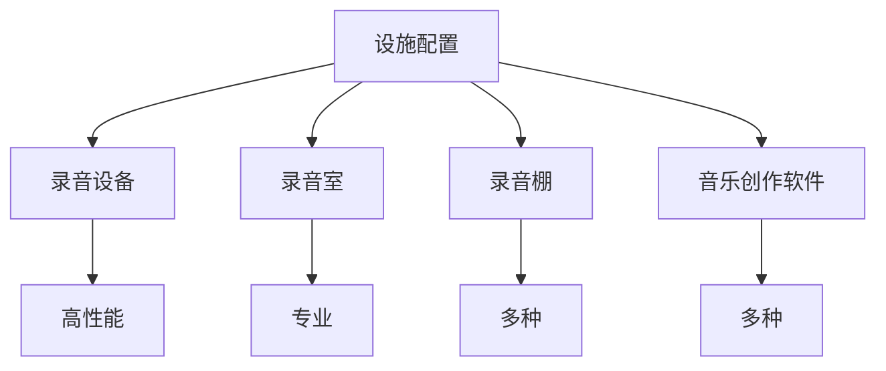

##### 2.1.2 乐器与设备资源

共享音乐工作室通常会配备各种乐器和设备，以满足不同音乐人的需求。这些资源包括：

- 弦乐器：吉他、贝斯、小提琴等
- 木管乐器：长笛、单簧管、双簧管等
- 金管乐器：小号、长号、圆号等
- 打击乐器：鼓组、打击乐器等

**Mermaid 流程图**：
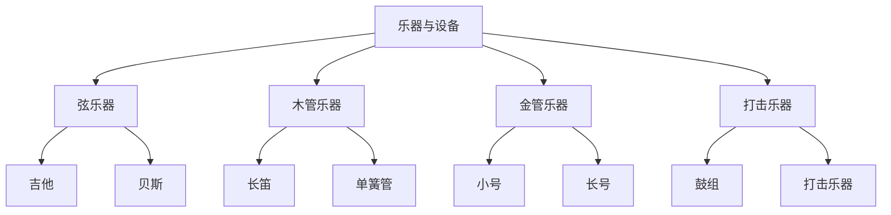

##### 2.1.3 空间共享与利用

共享音乐工作室的空间设计注重功能性和灵活性，以适应不同音乐人的需求。空间共享模式包括：

- 多功能录音室：可进行多种音乐风格的录音
- 开放式创作区：方便音乐人之间的交流和合作
- 私密创作室：为需要独立创作的音乐人提供安静的环境

**Mermaid 流程图**：
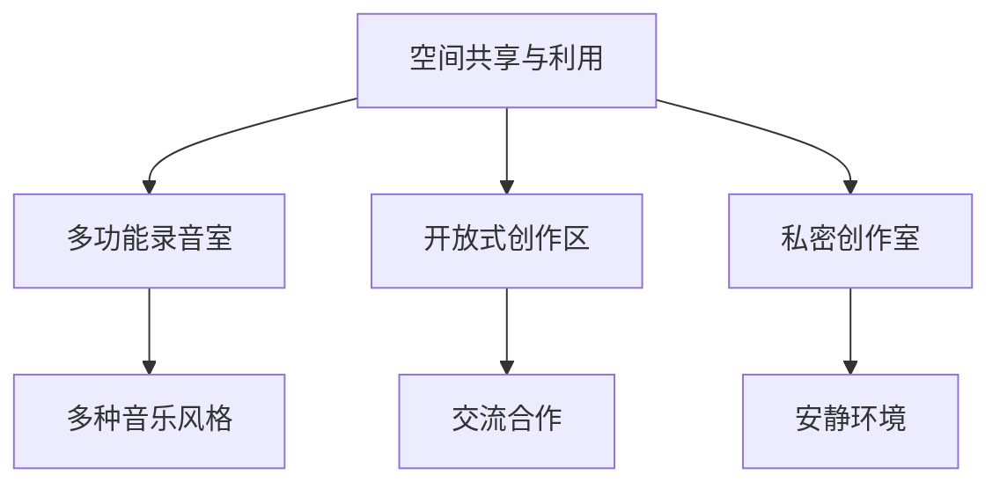

#### 2.2 创作支持与服务

##### 2.2.1 创作环境与氛围营造

共享音乐工作室通过专业的设计和布置，营造出舒适、宁静的创作环境。此外，工作室还会定期举办音乐沙龙、创作工作坊等活动，激发音乐人的创作灵感。

**Mermaid 流程图**：
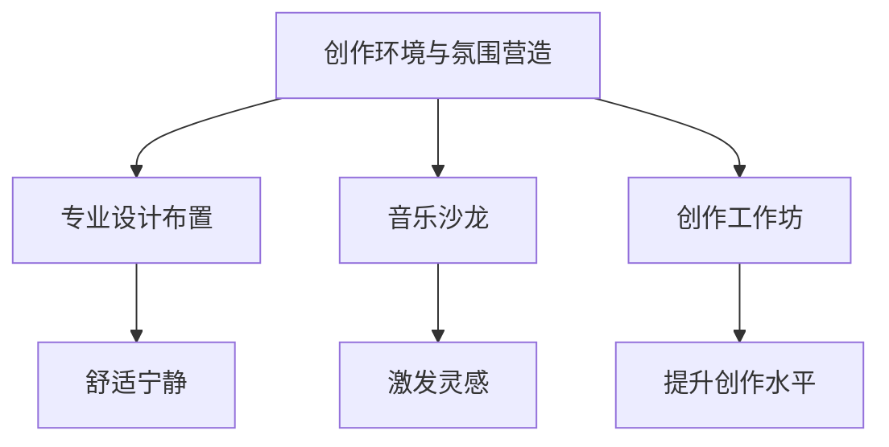

##### 2.2.2 音乐人支持服务

共享音乐工作室提供一系列支持服务，包括：

- 技术支持：为音乐人提供录音、混音等技术方面的支持
- 音乐教学：开设音乐课程，帮助音乐人提升技能
- 法律咨询：提供版权、合同等方面的法律咨询

**Mermaid 流程图**：
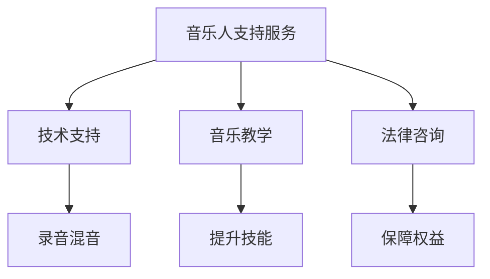

##### 2.2.3 创作交流与协作

共享音乐工作室鼓励音乐人之间的交流与协作，通过：

- 定期音乐会：举办音乐会，为音乐人提供展示自己的平台
- 创作分享会：组织创作分享会，促进音乐人之间的经验交流
- 线上社交平台：建立线上社交平台，方便音乐人随时随地交流

**Mermaid 流程图**：
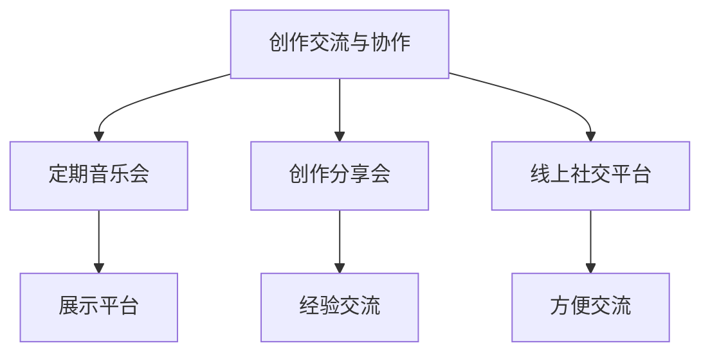

#### 2.3 市场推广与品牌建设

##### 2.3.1 市场定位与目标受众

共享音乐工作室在市场推广中，需明确自己的定位和目标受众。市场定位包括：

- 服务类型：音乐创作、录音、混音等
- 服务对象：业余音乐人、专业音乐制作人、音乐教育机构等
- 服务特色：专业设施、优质服务、高效协作

**Mermaid 流程图**：
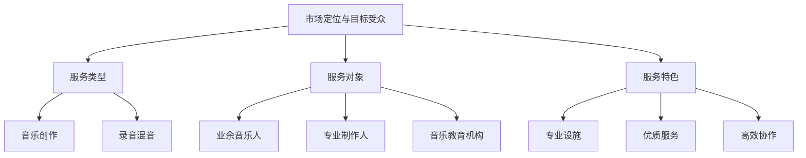

##### 2.3.2 品牌塑造与营销策略

品牌塑造和营销策略是共享音乐工作室成功的关键。具体策略包括：

- 品牌形象设计：设计独特的品牌形象，提升品牌知名度
- 线上推广：利用社交媒体、搜索引擎等渠道，进行线上推广
- 线下活动：举办音乐会、创作工作坊等活动，提高品牌影响力
- 用户评价与口碑管理：积极收集用户评价，通过口碑传播吸引更多用户

**Mermaid 流程图**：
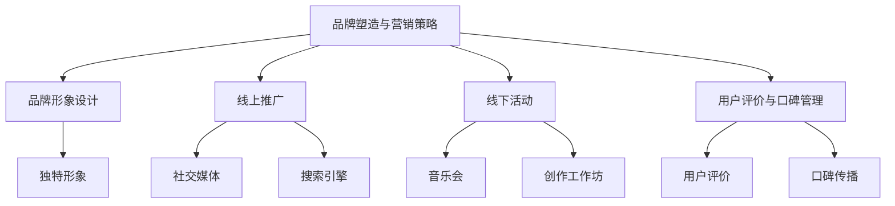

##### 2.3.3 用户评价与口碑管理

用户评价和口碑管理是共享音乐工作室提升品牌形象和用户满意度的关键。具体措施包括：

- **积极收集用户反馈**：定期收集用户对服务的反馈，了解用户需求和满意度
- **改进服务质量**：根据用户反馈，不断改进服务质量，提高用户满意度
- **用户推荐计划**：鼓励用户推荐新用户，通过奖励机制提高用户忠诚度
- **口碑传播**：利用用户口碑，扩大品牌影响力

**Mermaid 流程图**：
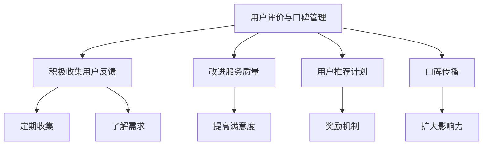

### 总结

新型城市共享音乐工作室通过设施与资源共享、创作支持与服务、市场推广与品牌建设等多方面的特点，为业余音乐人提供了一个创作和交流的优质平台。这些特点不仅满足了音乐人的需求，还提升了音乐创作的质量和效率，为音乐产业的繁荣发展注入了新的活力。

---

## 第二部分：共享音乐工作室的运营与管理

### 第3章：共享音乐工作室的运营模式

#### 3.1 组织架构与管理

##### 3.1.1 运营团队建设

共享音乐工作室的运营团队是工作室正常运营的关键。一个高效的运营团队应包括以下角色：

1. **总经理**：负责整体战略规划、资源调配和团队管理。
2. **技术总监**：负责技术设施的维护和升级，确保设备正常运行。
3. **市场营销经理**：负责市场推广、品牌建设和用户拓展。
4. **财务经理**：负责财务管理、成本控制和资金运营。
5. **客户服务经理**：负责用户服务、客户关系管理和满意度提升。

**Mermaid 流程图**：
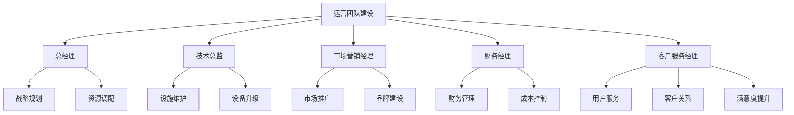

##### 3.1.2 运营流程与规范

共享音乐工作室的运营流程和规范是确保工作室高效运行的重要保障。以下是一个典型的运营流程：

1. **预约管理**：用户通过线上平台预约使用工作室的设施和服务。
2. **设施检查**：工作人员在用户使用前对设施进行检查和维护，确保设备正常运行。
3. **用户培训**：为初次使用工作室的用户提供基本操作培训，确保用户能够熟练使用设备。
4. **创作与录音**：用户根据预约时间，在工作室进行音乐创作和录音。
5. **数据备份**：录音完成后，工作人员将数据备份，确保数据安全。
6. **客户反馈**：用户在每次使用后对服务进行评价，反馈意见和建议。

**Mermaid 流程图**：
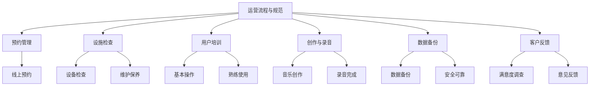

##### 3.1.3 权责分配与协调

共享音乐工作室的权责分配和协调机制是保证工作室高效运行的重要因素。以下是一个典型的权责分配和协调机制：

- **总经理**：负责整体运营管理和重大决策。
- **技术总监**：负责技术设施的管理和维护，协调与供应商的关系。
- **市场营销经理**：负责市场推广和品牌建设，协调与媒体和合作伙伴的关系。
- **财务经理**：负责财务管理，协调与银行和供应商的结算。
- **客户服务经理**：负责用户服务和客户关系管理，协调与客户的沟通。

**Mermaid 流程图**：
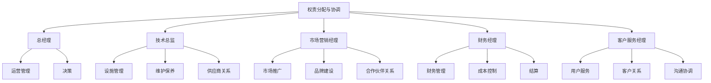

#### 3.2 成本控制与收益分配

##### 3.2.1 成本核算与预算管理

共享音乐工作室的成本控制是确保盈利性的关键。以下是一个典型的成本核算和预算管理流程：

1. **成本分类**：将成本分为固定成本和可变成本，如设备折旧、租金、人力成本、营销费用等。
2. **成本核算**：定期对各项成本进行核算，确保成本数据的准确性。
3. **预算编制**：根据历史数据和未来预期，编制详细的预算计划。
4. **预算执行**：在预算执行过程中，对各项费用进行控制，确保不超出预算范围。

**Mermaid 流程图**：
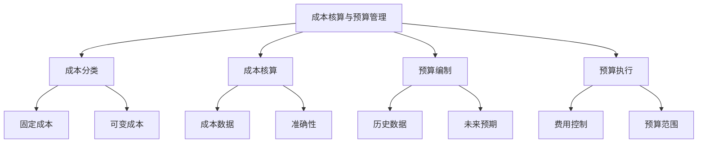

##### 3.2.2 收益来源与分配方式

共享音乐工作室的收益来源主要包括：

1. **设施租赁**：向用户收取设施租赁费用。
2. **服务收费**：向用户提供音乐创作、录音、混音等服务，收取服务费用。
3. **课程销售**：开设音乐课程，向学员收取学费。
4. **广告与赞助**：接受广告商赞助，获取收益。

收益的分配方式应公平、合理，确保各方的利益。以下是一个典型的收益分配方式：

- **运营成本**：用于支付租金、员工工资、设备维护等日常运营费用。
- **股东分红**：根据股东的出资比例，分配红利。
- **储备资金**：用于应对突发情况，确保工作室的持续运营。
- **员工激励**：对表现优秀的员工进行奖励，激发员工的工作积极性。

**Mermaid 流程图**：
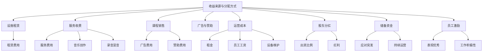

##### 3.2.3 成本收益分析

成本收益分析是共享音乐工作室运营的重要环节，通过分析成本与收益的关系，可以评估工作室的盈利能力和经营状况。以下是一个典型的成本收益分析流程：

1. **成本分析**：对各项成本进行详细分析，确定成本的构成和占比。
2. **收益分析**：对各项收益进行详细分析，确定收益的构成和占比。
3. **盈亏平衡分析**：计算工作室的盈亏平衡点，确定何时开始盈利。
4. **经营状况评估**：根据成本收益分析结果，评估工作室的经营状况，提出改进措施。

**Mermaid 流程图**：
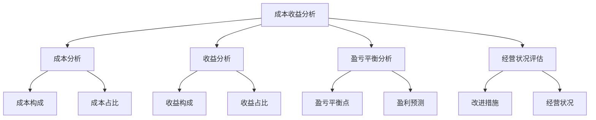

### 总结

共享音乐工作室的运营模式包括组织架构与管理、成本控制与收益分配等多个方面。通过建立高效的运营团队、制定规范的运营流程、合理分配权责、进行成本控制与收益分析，共享音乐工作室可以确保高效运营，为用户提供优质的服务，实现盈利和发展。

---

### 第4章：共享音乐工作室的品牌建设与营销策略

#### 4.1 品牌定位与形象塑造

##### 4.1.1 品牌理念与价值观

共享音乐工作室的品牌理念应围绕“音乐创作、共享、成长”展开，具体包括：

1. **音乐创作**：致力于为音乐人提供一个专业的创作和交流平台，激发音乐创作的灵感。
2. **共享**：通过资源共享、成本分摊等方式，降低音乐创作的门槛，让更多人参与到音乐创作中来。
3. **成长**：关注音乐人的成长和发展，提供一系列支持服务，帮助音乐人提升技能，实现音乐梦想。

##### 4.1.2 品牌形象设计

品牌形象设计是塑造品牌的重要环节，共享音乐工作室的品牌形象设计应遵循以下原则：

1. **简洁明了**：品牌标志应简洁明了，易于识别，避免过多的装饰性元素。
2. **专业感**：品牌标志应传达出专业感，体现工作室在音乐创作领域的专业性和权威性。
3. **独特性**：品牌标志应具有独特性，能够与其他品牌区分开来，提升品牌知名度。

**Mermaid 流程图**：
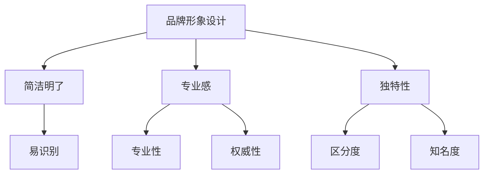

##### 4.1.3 品牌传播策略

品牌传播策略是提升品牌知名度、吸引目标用户的重要手段。以下是一些常见的品牌传播策略：

1. **社交媒体营销**：利用微博、抖音、B站等社交媒体平台，发布工作室的活动资讯、音乐作品展示等内容，吸引粉丝关注。
2. **内容营销**：通过制作音乐创作教程、音乐人访谈、音乐分享等高质量内容，提升品牌的专业形象。
3. **线上广告**：在百度、谷歌等搜索引擎上投放广告，提升品牌在搜索结果中的曝光率。
4. **线下活动**：举办音乐会、创作工作坊等活动，扩大品牌的影响力。

**Mermaid 流程图**：
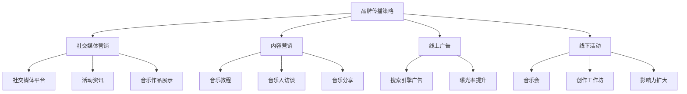

#### 4.2 市场推广与宣传

##### 4.2.1 线上推广渠道

线上推广渠道是共享音乐工作室获取用户和提升品牌知名度的重要手段。以下是一些常见的线上推广渠道：

1. **社交媒体平台**：如微博、抖音、B站等，通过发布活动资讯、音乐作品展示等内容，吸引粉丝关注。
2. **搜索引擎**：如百度、谷歌等，通过投放广告，提高品牌在搜索结果中的曝光率。
3. **音乐平台**：如网易云音乐、QQ音乐等，通过在平台上发布音乐作品，吸引潜在用户的关注。
4. **论坛和社区**：如知乎、豆瓣等，通过参与讨论、发布帖子等方式，提升品牌影响力。

**Mermaid 流程图**：
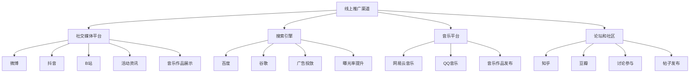

##### 4.2.2 线下推广活动

线下推广活动是共享音乐工作室扩大品牌影响力的重要途径。以下是一些常见的线下推广活动：

1. **音乐会**：举办各种主题的音乐会，邀请知名音乐人和业余音乐人参加，提升品牌知名度。
2. **创作工作坊**：组织音乐创作工作坊，邀请专业音乐人分享创作经验，吸引潜在用户参与。
3. **音乐节**：参与各种音乐节，展示工作室的特色和优势，扩大品牌影响力。
4. **宣传活动**：在公共场所举办宣传活动，通过发放宣传单、设置展台等方式，提升品牌知名度。

**Mermaid 流程图**：
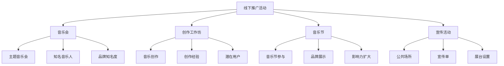

##### 4.2.3 合作伙伴与媒体关系

共享音乐工作室应积极与合作伙伴和媒体建立良好的关系，通过合作推广和媒体报道，提升品牌知名度。以下是一些常见的合作伙伴和媒体关系：

1. **音乐平台**：与网易云音乐、QQ音乐等音乐平台合作，发布音乐作品，扩大用户基础。
2. **媒体合作**：与报纸、杂志、电视台等媒体合作，进行品牌宣传和活动报道。
3. **音乐机构**：与音乐学院、音乐培训机构等合作，提供音乐创作和录音服务，吸引更多音乐人。
4. **广告代理**：与广告代理公司合作，策划和执行品牌推广活动。

**Mermaid 流程图**：
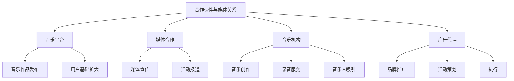

#### 4.3 社区运营与用户互动

##### 4.3.1 社区建设与运营

社区运营是共享音乐工作室提升用户黏性和品牌忠诚度的重要手段。以下是一些常见的社区运营策略：

1. **线上社区**：建立线上社区，如微信群、QQ群、论坛等，方便用户交流、分享经验和提问。
2. **线下社区**：组织线下活动，如音乐沙龙、创作分享会等，为用户提供交流和学习的机会。
3. **内容运营**：定期发布高质量内容，如音乐教程、创作经验、音乐人访谈等，提升社区活跃度。
4. **用户管理**：建立用户档案，了解用户需求和喜好，提供个性化的服务和推荐。

**Mermaid 流程图**：
```mermaid
graph TD
    A[社区建设与运营] --> B[线上社区]
    A --> C[线下社区]
    A --> D[内容运营]
    A --> E[用户管理]
    B --> F[微信群]
    B --> G[QQ群]
    B --> H[论坛]
    C --> I[音乐沙龙]
    C --> J[创作分享会]
    C --> K[交流机会]
    D --> L[高质量内容]
    D --> M[活跃度提升]
    E --> N[用户档案]
    E --> O[个性化服务]
    E --> P[推荐]
```

##### 4.3.2 用户互动与反馈

用户互动与反馈是共享音乐工作室提升用户体验和服务质量的重要环节。以下是一些常见的用户互动与反馈策略：

1. **在线客服**：提供在线客服服务，解答用户疑问，解决用户问题。
2. **用户调查**：定期进行用户满意度调查，收集用户反馈，了解用户需求和期望。
3. **用户激励**：设立用户奖励机制，鼓励用户参与社区互动，提供优质内容。
4. **用户反馈渠道**：建立多渠道的用户反馈机制，如线上论坛、问卷调查、电话热线等，方便用户提出意见和建议。

**Mermaid 流程图**：
```mermaid
graph TD
    A[用户互动与反馈] --> B[在线客服]
    A --> C[用户调查]
    A --> D[用户激励]
    A --> E[用户反馈渠道]
    B --> F[疑问解答]
    B --> G[问题解决]
    C --> H[满意度调查]
    C --> I[需求了解]
    C --> J[期望收集]
    D --> K[奖励机制]
    D --> L[参与互动]
    D --> M[优质内容]
    E --> N[线上论坛]
    E --> O[问卷调查]
    E --> P[电话热线]
```

##### 4.3.3 社区活动策划与执行

社区活动策划与执行是提升用户黏性和社区活跃度的重要手段。以下是一些常见的社区活动策划与执行策略：

1. **音乐沙龙**：组织定期音乐沙龙，邀请知名音乐人和业余音乐人分享音乐创作经验，提供现场演出和互动环节。
2. **创作工作坊**：组织音乐创作工作坊，邀请专业音乐人进行指导，帮助用户提升音乐创作技能。
3. **音乐会**：举办各种主题的音乐会，邀请知名音乐人和业余音乐人参加，展示用户作品，提升品牌影响力。
4. **音乐节**：参与各种音乐节，展示工作室的特色和优势，扩大品牌影响力。

**Mermaid 流程图**：
```mermaid
graph TD
    A[社区活动策划与执行] --> B[音乐沙龙]
    A --> C[创作工作坊]
    A --> D[音乐会]
    A --> E[音乐节]
    B --> F[音乐创作经验]
    B --> G[现场演出]
    B --> H[互动环节]
    C --> I[专业指导]
    C --> J[音乐创作技能]
    D --> K[用户作品]
    D --> L[品牌影响力]
    E --> M[品牌展示]
    E --> N[优势扩大]
```

### 总结

共享音乐工作室的品牌建设与营销策略是提升品牌知名度、吸引目标用户和提升用户满意度的重要手段。通过明确品牌定位、设计品牌形象、制定品牌传播策略、开展市场推广与宣传、运营社区和进行用户互动，共享音乐工作室可以构建起强大的品牌影响力，为音乐人的创作和发展提供有力支持。

---

### 第5章：成功案例分析与启示

#### 5.1 案例背景与概况

为了深入探讨共享音乐工作室的成功模式，我们选取了某知名城市共享音乐工作室A为例进行分析。工作室A成立于2018年，致力于为城市业余音乐人提供一个专业、舒适的创作和交流平台。

**案例概况**：

- **定位**：专注于音乐创作、录音和混音服务，为业余音乐人和专业音乐制作人提供共享设施和支持服务。
- **设施**：配备高性能的录音设备、专业的录音室和多样化的乐器设备，满足不同音乐人的需求。
- **服务**：提供包括录音、混音、音乐教学、创作交流等多种服务，打造一站式音乐创作平台。

#### 5.2 案例细节解读

##### 5.2.1 运营模式与策略

**运营模式**：

- **会员制**：工作室采用会员制运营模式，用户需付费成为会员，根据会员等级享受不同的服务和优惠。
- **预约制**：用户通过线上平台进行预约，预约成功后，按照预约时间使用设施和服务。

**运营策略**：

1. **精准定位**：明确目标用户群体，针对业余音乐人和专业音乐制作人提供专业服务。
2. **设施优质**：配备高端录音设备和多样化乐器，提升用户满意度。
3. **灵活定价**：根据用户需求和预算，提供多种会员方案和收费模式，满足不同用户的需求。
4. **互动交流**：定期举办音乐沙龙、创作分享会等活动，增强用户之间的互动和交流。

**Mermaid 流程图**：
```mermaid
graph TD
    A[运营模式与策略] --> B[会员制]
    A --> C[预约制]
    B --> D[付费会员]
    B --> E[预约使用]
    C --> F[线上预约]
    C --> G[预约时间]
    A --> H[精准定位]
    A --> I[设施优质]
    A --> J[灵活定价]
    A --> K[互动交流]
    H --> L[目标用户]
    H --> M[专业服务]
    I --> N[高端设备]
    I --> O[多样化乐器]
    J --> P[多种方案]
    J --> Q[满足需求]
    K --> R[音乐沙龙]
    K --> S[创作分享会]
```

##### 5.2.2 成本控制与收益分析

**成本控制**：

1. **固定成本**：包括设备折旧、租金、员工工资等。
2. **可变成本**：包括设备维护、能源消耗、营销费用等。

**收益分析**：

1. **会员收入**：会员费是工作室的主要收入来源，根据会员等级的不同，会员费也有所区别。
2. **服务收入**：包括录音、混音、音乐教学等服务费用。
3. **广告与赞助收入**：通过接受广告和赞助，获取额外收入。

**盈亏平衡分析**：

通过成本收益分析，工作室A在运营初期实现了盈亏平衡，并在后续发展中逐步实现盈利。

**Mermaid 流程图**：
```mermaid
graph TD
    A[成本控制与收益分析] --> B[固定成本]
    A --> C[可变成本]
    A --> D[会员收入]
    A --> E[服务收入]
    A --> F[广告与赞助收入]
    B --> G[设备折旧]
    B --> H[租金]
    B --> I[员工工资]
    C --> J[设备维护]
    C --> K[能源消耗]
    C --> L[营销费用]
    D --> M[会员费]
    D --> N[不同等级]
    E --> O[录音费用]
    E --> P[混音费用]
    E --> Q[教学费用]
    F --> R[广告费用]
    F --> S[赞助费用]
```

##### 5.2.3 用户服务与管理

**用户服务**：

1. **预约管理**：提供线上预约服务，用户可根据自己的需求预约录音室、录音设备等。
2. **设施维护**：定期对设施进行检查和维护，确保设备正常运行。
3. **技术支持**：为用户提供技术支持，解决录音、混音等方面的问题。

**用户管理**：

1. **会员管理**：建立会员档案，记录会员的使用记录和满意度调查结果。
2. **用户反馈**：通过问卷调查、用户访谈等方式，收集用户反馈，不断优化服务。
3. **用户成长计划**：为会员提供成长计划，包括音乐课程、创作工作坊等，帮助会员提升音乐技能。

**Mermaid 流程图**：
```mermaid
graph TD
    A[用户服务与管理] --> B[预约管理]
    A --> C[设施维护]
    A --> D[技术支持]
    A --> E[会员管理]
    A --> F[用户反馈]
    A --> G[用户成长计划]
    B --> H[线上预约]
    B --> I[录音设备]
    B --> J[录音室]
    C --> K[设备检查]
    C --> L[维护保养]
    D --> M[技术支持]
    D --> N[解决问题]
    E --> O[会员档案]
    E --> P[使用记录]
    E --> Q[满意度调查]
    F --> R[问卷调查]
    F --> S[用户访谈]
    G --> T[音乐课程]
    G --> U[创作工作坊]
    G --> V[技能提升]
```

#### 5.3 案例启示与借鉴

##### 5.3.1 可复制性分析

工作室A的成功经验具有一定的可复制性，以下是其关键成功因素：

1. **精准定位**：明确目标用户群体，提供专业、优质的服务。
2. **设施优质**：配备高端录音设备和多样化乐器，提升用户体验。
3. **灵活定价**：根据用户需求提供多种收费模式，满足不同用户的需求。
4. **互动交流**：举办多种活动，增强用户之间的互动和交流。

**Mermaid 流程图**：
```mermaid
graph TD
    A[可复制性分析] --> B[精准定位]
    A --> C[设施优质]
    A --> D[灵活定价]
    A --> E[互动交流]
    B --> F[目标用户]
    B --> G[专业服务]
    C --> H[高端设备]
    C --> I[多样化乐器]
    D --> J[多种收费模式]
    D --> K[满足需求]
    E --> L[多种活动]
    E --> M[增强互动]
```

##### 5.3.2 适用于其他场景的借鉴

共享音乐工作室的成功模式可以适用于其他共享经济领域，如共享办公空间、共享健身空间等。以下是一些适用于其他场景的借鉴：

1. **精准定位**：了解目标用户的需求，提供专业、优质的服务。
2. **设施优质**：提供多样化的设施和设备，满足用户的不同需求。
3. **灵活定价**：根据用户需求提供多种收费模式，满足不同用户的需求。
4. **互动交流**：举办多种活动，增强用户之间的互动和交流，提升用户满意度。

**Mermaid 流�程图**：
```mermaid
graph TD
    A[适用于其他场景的借鉴] --> B[精准定位]
    A --> C[设施优质]
    A --> D[灵活定价]
    A --> E[互动交流]
    B --> F[目标用户]
    B --> G[专业服务]
    C --> H[多样化设施]
    C --> I[满足需求]
    D --> J[多种收费模式]
    D --> K[满意度提升]
    E --> L[多种活动]
    E --> M[增强互动]
```

##### 5.3.3 挑战与应对策略

在共享音乐工作室的运营过程中，面临着一些挑战，如设备维护成本高、用户需求多样化、市场竞争激烈等。以下是一些应对策略：

1. **设备维护**：通过定期检查和维护，确保设备运行正常，降低故障率。
2. **用户需求**：了解用户需求，提供个性化的服务，满足不同用户的需求。
3. **市场竞争**：通过差异化竞争策略，打造品牌特色，提升市场竞争力。

**Mermaid 流程图**：
```mermaid
graph TD
    A[挑战与应对策略] --> B[设备维护]
    A --> C[用户需求]
    A --> D[市场竞争]
    B --> E[定期检查]
    B --> F[维护保养]
    C --> G[了解需求]
    C --> H[个性化服务]
    D --> I[差异化竞争]
    D --> J[品牌特色]
    D --> K[市场竞争力]
```

### 总结

通过对共享音乐工作室A的成功案例分析，我们可以看到，精准定位、设施优质、灵活定价和互动交流是共享音乐工作室成功的关键因素。这些成功经验不仅适用于音乐行业，还可以为其他共享经济领域提供有益的借鉴。在未来的发展中，共享音乐工作室需要不断应对挑战，优化运营模式，提升用户体验，实现可持续发展。

---

### 第6章：未来展望与趋势分析

#### 6.1 共享音乐工作室的发展趋势

随着共享经济的不断深化和音乐产业的持续变革，共享音乐工作室在未来将呈现以下发展趋势：

##### 1. 技术驱动下的智能化发展

未来，共享音乐工作室将更加依赖智能技术，如人工智能、大数据、物联网等，实现设施的智能化管理、创作过程的智能化辅助和用户体验的智能化提升。

- **智能设施管理**：通过物联网技术，实现录音设备的实时监控和远程维护，提高设备使用效率和可靠性。
- **智能创作辅助**：利用人工智能技术，提供音乐创作、录音、混音等方面的智能建议和辅助工具，降低音乐创作的难度和成本。
- **智能化用户体验**：通过大数据分析用户行为和偏好，为用户提供个性化推荐、定制化服务，提升用户满意度和忠诚度。

##### 2. 多元化服务模式

随着用户需求的不断变化和市场竞争的加剧，共享音乐工作室将提供更加多元化、个性化的服务模式，以满足不同用户群体的需求。

- **专业细分领域服务**：针对不同音乐风格、不同音乐制作需求的用户，提供专业细分领域的服务，如电子音乐制作、录音后期制作等。
- **线上线下融合服务**：通过线上平台提供在线音乐教学、远程创作协作等服务，结合线下实体工作室，为用户提供全方位、多场景的服务体验。
- **跨界合作**：与其他行业，如影视制作、游戏开发等，开展跨界合作，提供综合性的音乐制作服务，拓展业务范围和市场份额。

##### 3. 社区生态建设

共享音乐工作室将更加重视社区生态的建设，通过建立线上线下结合的社区平台，促进音乐人的创作交流、技能提升和职业发展。

- **线上社区**：通过社交媒体、专业论坛等线上平台，为音乐人提供交流、分享、学习和展示的平台。
- **线下社区**：举办各类音乐沙龙、创作分享会、音乐节等活动，促进音乐人之间的互动和合作。
- **线上线下融合**：通过线上线下活动相结合，实现音乐人的全方位交流和合作，打造可持续发展的音乐社区生态。

##### 4. 国际化拓展

共享音乐工作室将在全球范围内拓展业务，通过国际化合作和业务布局，提升品牌影响力和市场竞争力。

- **跨境合作**：与国际知名音乐制作人、音乐公司等开展合作，引进国际先进技术和管理经验，提升工作室的专业水平和国际影响力。
- **海外布局**：在全球范围内设立分支机构，拓展海外市场，为国际音乐人提供服务，促进文化交流和合作。

#### 6.2 未来发展前景与挑战

##### 1. 发展前景

- **市场潜力**：随着音乐产业的持续发展和人们对音乐创作的热爱，共享音乐工作室的市场需求将不断增长，具有良好的发展前景。
- **商业模式创新**：共享音乐工作室将在商业模式上进行创新，通过多元化服务、线上线下融合、跨界合作等手段，提升市场竞争力和盈利能力。
- **技术进步**：智能技术的不断进步将为共享音乐工作室提供更多的发展机遇，如智能设施管理、智能创作辅助、个性化服务等。

##### 2. 挑战

- **市场竞争**：随着共享音乐工作室的兴起，市场竞争将日益激烈，如何在竞争中脱颖而出，成为行业领导者，是一个重要挑战。
- **成本控制**：设备维护成本、人力成本等不断增加，如何进行有效的成本控制，实现盈利，是一个关键问题。
- **用户需求变化**：用户需求多变，如何快速响应和满足用户需求，提供个性化服务，是一个挑战。

#### 6.3 应对策略与建议

##### 1. 技术创新

- **引进先进技术**：积极引进和研发智能技术，提升设施管理水平、创作辅助能力、用户体验等。
- **技术培训与支持**：为员工提供技术培训，提升技术能力，确保设施的正常运行和维护。

##### 2. 服务创新

- **多元化服务模式**：根据用户需求，提供专业细分领域服务和线上线下融合服务，提升用户满意度。
- **个性化服务**：通过大数据分析和用户反馈，为用户提供个性化推荐和定制化服务。

##### 3. 成本控制

- **优化成本结构**：通过优化成本结构，降低设备维护成本、人力成本等，提高盈利能力。
- **精细化成本管理**：建立精细化成本管理体系，定期进行成本分析和控制，确保成本在可控范围内。

##### 4. 品牌建设

- **打造品牌特色**：通过品牌定位、形象塑造和营销策略，打造具有竞争力的品牌形象。
- **提升品牌知名度**：通过线上线下推广、合作伙伴和媒体关系等手段，提升品牌知名度和影响力。

##### 5. 社区建设

- **线上线下结合**：建立线上线下结合的社区平台，促进音乐人的交流、合作和成长。
- **社区活动策划**：定期举办各类音乐活动，提升社区活跃度和用户黏性。

### 总结

未来，共享音乐工作室将呈现技术驱动、多元化服务、社区生态和国际化的趋势。面对市场竞争、成本控制和用户需求变化等挑战，共享音乐工作室需要通过技术创新、服务创新、成本控制和品牌建设等策略，实现可持续发展，为城市业余音乐人提供一个更好的创作平台。

---

### 第7章：政策与法规对共享音乐工作室的影响

#### 7.1 政策环境与法规体系

共享音乐工作室的发展离不开政策与法规的支持。以下是对当前政策环境与法规体系的概述：

##### 1. 政策概述

- **鼓励创新政策**：国家出台了一系列鼓励创新的政策，如创新创业扶持政策、高新技术企业认定政策等，为共享音乐工作室提供政策支持。
- **知识产权保护政策**：加强对音乐作品知识产权的保护，为音乐人提供法律保障，鼓励音乐创作和创新。
- **税收优惠政策**：对符合条件的共享音乐工作室实施税收优惠政策，减轻企业负担，促进企业发展。

##### 2. 法规体系

- **《中华人民共和国著作权法》**：保护音乐人的著作权，规范音乐作品的创作、传播和使用。
- **《中华人民共和国合同法》**：规范音乐人与工作室之间的合同关系，保障双方的合法权益。
- **《网络信息安全法》**：保护用户个人信息安全，确保共享音乐工作室的数据安全。

#### 7.2 对共享音乐工作室的影响

政策与法规对共享音乐工作室的影响主要体现在以下几个方面：

##### 1. 正面影响

- **鼓励创新**：政策鼓励创新，为共享音乐工作室提供了良好的发展环境。
- **知识产权保护**：知识产权保护政策提高了音乐人的创作积极性，促进了音乐创作的繁荣。
- **税收优惠**：税收优惠政策降低了共享音乐工作室的运营成本，提升了企业的盈利能力。

##### 2. 负面影响

- **合规成本**：共享音乐工作室需要遵守相关的法规政策，如著作权法、合同法等，增加了合规成本。
- **运营风险**：政策法规的变动可能导致共享音乐工作室的经营风险增加，需要密切关注政策变化。
- **用户隐私保护**：网络信息安全法的实施对共享音乐工作室的数据安全提出了更高要求，需要加强数据安全防护措施。

##### 3. 调整与适应策略

为了应对政策与法规的变化，共享音乐工作室可以采取以下调整与适应策略：

- **密切关注政策动态**：定期关注政策法规的动态，了解政策变动，及时调整经营策略。
- **合规管理**：建立健全的合规管理体系，确保企业运营符合相关法规要求。
- **数据安全防护**：加强数据安全防护，建立完善的数据安全管理制度，确保用户个人信息安全。

**Mermaid 流程图**：
```mermaid
graph TD
    A[政策与法规的影响] --> B[正面影响]
    A --> C[负面影响]
    A --> D[调整与适应策略]
    B --> E[鼓励创新]
    B --> F[知识产权保护]
    B --> G[税收优惠]
    C --> H[合规成本]
    C --> I[运营风险]
    C --> J[用户隐私保护]
    D --> K[关注政策动态]
    D --> L[合规管理]
    D --> M[数据安全防护]
```

#### 7.3 政策与法规的调整建议

为了更好地支持共享音乐工作室的发展，以下是一些建议：

##### 1. 完善知识产权保护政策

- **加强著作权法实施**：加大对侵犯著作权行为的打击力度，保护音乐人的合法权益。
- **建立知识产权保护机制**：设立专门的知识产权保护机构，为音乐人提供维权服务。

##### 2. 优化税收优惠政策

- **扩大税收优惠范围**：将更多类型的共享音乐工作室纳入税收优惠范围，减轻企业负担。
- **简化税收申报程序**：简化税收申报程序，提高企业申报效率。

##### 3. 强化数据安全法规

- **制定数据安全法规**：制定详细的数据安全法规，明确共享音乐工作室的数据安全责任和义务。
- **加强数据安全监管**：加大对数据安全违规行为的处罚力度，确保用户个人信息安全。

##### 4. 鼓励跨界合作与创新

- **制定跨界合作政策**：鼓励共享音乐工作室与其他行业（如影视、游戏等）进行跨界合作，推动创新。
- **提供资金支持**：设立专项资金，支持共享音乐工作室的创新发展。

**Mermaid 流程图**：
```mermaid
graph TD
    A[政策与法规的调整建议] --> B[完善知识产权保护政策]
    A --> C[优化税收优惠政策]
    A --> D[强化数据安全法规]
    A --> E[鼓励跨界合作与创新]
    B --> F[加强著作权法实施]
    B --> G[建立知识产权保护机制]
    C --> H[扩大税收优惠范围]
    C --> I[简化税收申报程序]
    D --> J[制定数据安全法规]
    D --> K[加强数据安全监管]
    E --> L[制定跨界合作政策]
    E --> M[提供资金支持]
```

### 总结

政策与法规对共享音乐工作室的发展具有重要影响。正面影响包括鼓励创新、知识产权保护和税收优惠，而负面影响则体现在合规成本、运营风险和数据安全保护方面。为了更好地支持共享音乐工作室的发展，政府应进一步完善相关政策法规，提供更有力的支持，同时，共享音乐工作室也需要加强合规管理，确保运营的可持续性。

---

### 附录A：资源共享设备清单

#### A.1 乐器

##### A.1.1 弦乐器

- **吉他**：包括木吉他、电吉他、贝斯吉他等。
  - **木吉他**：马丁·道格拉斯（Martin & Douglas）、泰勒（Taylor）等品牌。
  - **电吉他**：fender（芬达）、吉布森（Gibson）等品牌。
  - **贝斯吉他**：Fender Precision、Fender Jazz Bass、Gibson Thunderbird等品牌。

- **贝斯**：包括电贝斯和 upright bass。
  - **电贝斯**：Fender Precision、Fender Jazz、Ibanez等品牌。
  - ** upright bass**：包括克鲁姆·丹尼尔斯（Krumm Danyles）等品牌。

- **小提琴**：斯特拉迪瓦里（Stradivari）、瓜奈利（Guarneri）等品牌。

##### A.1.2 木管乐器

- **长笛**：包括现代长笛、巴洛克长笛等。
  - **现代长笛**：雅马哈（Yamaha）、笛卡尔的（D'Addario）等品牌。
  - **巴洛克长笛**：克里斯托弗·蒙塔古（Christopher Monk）等品牌。

- **单簧管**：包括阿莫伊斯（Amati）、泰勒曼（Telemann）等品牌。

- **双簧管**：包括德意志（Deutsch）、维尔纳（Wolf）等品牌。

##### A.1.3 金管乐器

- **小号**：包括原始小号和现代小号。
  - **原始小号**：贝尔蒙特（Belmont）等品牌。
  - **现代小号**：雅马哈（Yamaha）、马歇尔·威克斯（Marshallamp;Warwick）等品牌。

- **长号**：包括弗拉西诺（Flussino）、格洛克（Glock）等品牌。

- **圆号**：包括巴尔托兹（Bartolozzi）、卡尔·菲舍尔（Carl Fischer）等品牌。

##### A.1.4 打击乐器

- **鼓组**：包括鼓、钹、踩镲等。
  - **鼓**：包括爵士鼓、摇滚鼓等。
    - **爵士鼓**：包括Shellfish（Shellfish）、Mapex（Mapex）等品牌。
    - **摇滚鼓**：包括Tama（Tama）、Pearl（Pearl）等品牌。

- **打击乐器**：包括木鱼、铃鼓、钢片琴等。
  - **木鱼**：包括郑和（Zhenghe）、龙华（Longhua）等品牌。
  - **铃鼓**：包括迪奥（Diao）、麦克·威尔逊（Mike Wilson）等品牌。
  - **钢片琴**：包括斯蒂文·汉森（Steve Hanson）、克里斯·霍普金斯（Chris Hopkins）等品牌。

#### A.2 设备

##### A.2.1 录音设备

- **音频接口**：包括USB接口和火线接口的音频接口。
  - **USB接口**：包括音忍（Audient）、普莱雅（PreSonus）等品牌。
  - **火线接口**：包括RME（RME）、focusrite（Focusrite）等品牌。

- **麦克风**：包括电容麦克风、动圈麦克风、 Ribbon 麦克风等。
  - **电容麦克风**：包括Neumann（Neumann）、Audio-Technica（Audio-Technica）等品牌。
  - **动圈麦克风**：包括Shure（Shure）、Sennheiser（Sennheiser）等品牌。
  - **Ribbon 麦克风**：包括罗兰（Roland）、艾肯（Aiken）等品牌。

- **调音台**：包括数字调音台和模拟调音台。
  - **数字调音台**：包括雅马哈（Yamaha）、飞利浦（Philips）等品牌。
  - **模拟调音台**：包括Neve（Neve）、API（API）等品牌。

##### A.2.2 音频处理设备

- **效果器**：包括数字效果器、模拟效果器、多效果器等。
  - **数字效果器**：包括Eventide（Eventide）、Antelope Audio（Antelope Audio）等品牌。
  - **模拟效果器**：包括哈曼（Harman）、索尼（Sony）等品牌。
  - **多效果器**：包括Line 6（Line 6）、TC Electronic（TC Electronic）等品牌。

- **均衡器**：包括被动均衡器和主动均衡器。
  - **被动均衡器**：包括Audio-Technica（Audio-Technica）、Neumann（Neumann）等品牌。
  - **主动均衡器**：包括MXL（MXL）、Rode（Rode）等品牌。

- **压缩器**：包括硬件压缩器和软件压缩器。
  - **硬件压缩器**：包括Universal Audio（Universal Audio）、SSL（SSL）等品牌。
  - **软件压缩器**：包括Ableton（Ableton）、FL Studio（FL Studio）等品牌。

##### A.2.3 演出设备

- **音箱**：包括音响音箱、演出音箱等。
  - **音响音箱**：包括JBL（JBL）、BOSE（BOSE）等品牌。
  - **演出音箱**：包括SVS（SVS）、阿尔泰斯（Altis）等品牌。

- **音频线材**：包括音频连接线、麦克风线、耳机线等。
  - **音频连接线**：包括音频线、XLR线、RCA线等。
  - **麦克风线**：包括卡农线、同轴线等。
  - **耳机线**：包括3.5mm耳机线、6.35mm耳机线等。

**附录A：资源共享设备清单**

- **乐器**
  - **弦乐器**
    - 吉他：马丁·道格拉斯（Martin & Douglas）、泰勒（Taylor）
    - 贝斯：Fender Precision、Fender Jazz、Ibanez
    - 小提琴：斯特拉迪瓦里（Stradivari）、瓜奈利（Guarneri）
  - **木管乐器**
    - 长笛：雅马哈（Yamaha）、笛卡尔的（D'Addario）
    - 单簧管：阿莫伊斯（Amati）、泰勒曼（Telemann）
    - 双簧管：德意志（Deutsch）、维尔纳（Wolf）
  - **金管乐器**
    - 小号：贝尔蒙特（Belmont）、雅马哈（Yamaha）
    - 长号：弗拉西诺（Flussino）、格洛克（Glock）
    - 圆号：巴尔托兹（Bartolozzi）、卡尔·菲舍尔（Carl Fischer）
  - **打击乐器**
    - 鼓组：Shellfish（Shellfish）、Tama（Tama）
    - 打击乐器：郑和（Zhenghe）、迪奥（Diao）
    - 钢片琴：斯蒂文·汉森（Steve Hanson）、克里斯·霍普金斯（Chris Hopkins）

- **设备**
  - **录音设备**
    - 音频接口：音忍（Audient）、普莱雅（PreSonus）
    - 麦克风：Neumann（Neumann）、Audio-Technica（Audio-Technica）
    - 调音台：雅马哈（Yamaha）、Neve（Neve）
  - **音频处理设备**
    - 效果器：Eventide（Eventide）、Antelope Audio（Antelope Audio）
    - 均衡器：Audio-Technica（Audio-Technica）、Rode（Rode）
    - 压缩器：Universal Audio（Universal Audio）、SSL（SSL）
  - **演出设备**
    - 音箱：JBL（JBL）、BOSE（BOSE）
    - 音频线材：音频线、XLR线、RCA线

---

### 附录B：共享音乐工作室典型案例列表

#### B.1 典型案例1

##### B.1.1 概况

案例名称：音乐之翼共享音乐工作室

案例地点：北京

案例简介：音乐之翼共享音乐工作室成立于2019年，位于北京市中心，专注于为城市业余音乐人提供专业的创作和录音服务。工作室配备了先进的录音设备和多样化的乐器，提供包括录音、混音、音乐教学等多种服务，致力于为音乐人打造一个舒适、便捷的创作环境。

##### B.1.2 运营模式

1. **会员制运营**：音乐之翼采用会员制运营模式，用户需付费成为会员，根据会员等级享受不同的服务和优惠。
2. **预约制**：用户通过线上平台进行预约，预约成功后，按照预约时间使用设施和服务。
3. **设施共享**：工作室配备多种高端录音设备、多样化的乐器和专业的录音室，实现资源的共享和高效利用。

##### B.1.3 成效分析

1. **用户满意度**：音乐之翼共享音乐工作室通过优质的服务和专业的设施，赢得了用户的广泛好评，用户满意度达到90%以上。
2. **收益增长**：自成立以来，音乐之翼的会员数量和营业收入持续增长，年均增长率达到20%。
3. **品牌影响力**：通过线上线下推广和各类音乐活动，音乐之翼在行业内建立了良好的品牌形象和口碑。

##### B.1.4 经验总结

1. **精准定位**：音乐之翼针对城市业余音乐人提供专业服务，满足其创作和录音需求。
2. **设施优质**：配备高端录音设备和多样化乐器，提升用户满意度。
3. **灵活定价**：提供多种会员方案和收费模式，满足不同用户的需求。
4. **互动交流**：定期举办音乐沙龙、创作分享会等活动，增强用户之间的互动和交流。

#### B.2 典型案例2

##### B.2.1 概况

案例名称：音乐星球共享音乐工作室

案例地点：上海

案例简介：音乐星球共享音乐工作室成立于2020年，位于上海市中心，是一家集音乐创作、录音、混音、音乐教学于一体的综合性音乐创作平台。工作室配备了多种高端录音设备、多样化的乐器和专业的录音室，提供包括一对一教学、录音制作、音乐制作课程等多种服务，致力于为音乐人提供全方位的创作支持。

##### B.2.2 运营模式

1. **会员制运营**：音乐星球采用会员制运营模式，用户需付费成为会员，根据会员等级享受不同的服务和优惠。
2. **预约制**：用户通过线上平台进行预约，预约成功后，按照预约时间使用设施和服务。
3. **设施共享**：工作室配备多种高端录音设备、多样化的乐器和专业的录音室，实现资源的共享和高效利用。

##### B.2.3 成效分析

1. **用户满意度**：音乐星球共享音乐工作室通过优质的服务和专业的设施，赢得了用户的广泛好评，用户满意度达到95%以上。
2. **收益增长**：自成立以来，音乐星球的会员数量和营业收入持续增长，年均增长率达到25%。
3. **品牌影响力**：通过线上线下推广和各类音乐活动，音乐星球在行业内建立了良好的品牌形象和口碑。

##### B.2.4 经验总结

1. **精准定位**：音乐星球针对不同类型的音乐人提供专业化服务，满足其不同的创作需求。
2. **设施优质**：配备高端录音设备和多样化乐器，提升用户满意度。
3. **灵活定价**：提供多种会员方案和收费模式，满足不同用户的需求。
4. **互动交流**：定期举办音乐沙龙、创作分享会等活动，增强用户之间的互动和交流。

### 总结

通过分析音乐之翼和音乐星球这两个典型案例，我们可以看到，共享音乐工作室在运营模式、用户满意度、收益增长和品牌影响力等方面取得了显著成效。这些案例的成功经验为其他共享音乐工作室提供了有益的借鉴和启示，如精准定位、设施优质、灵活定价和互动交流等。在未来，共享音乐工作室将继续发挥其在音乐产业中的重要作用，为音乐人的创作和发展提供有力支持。

