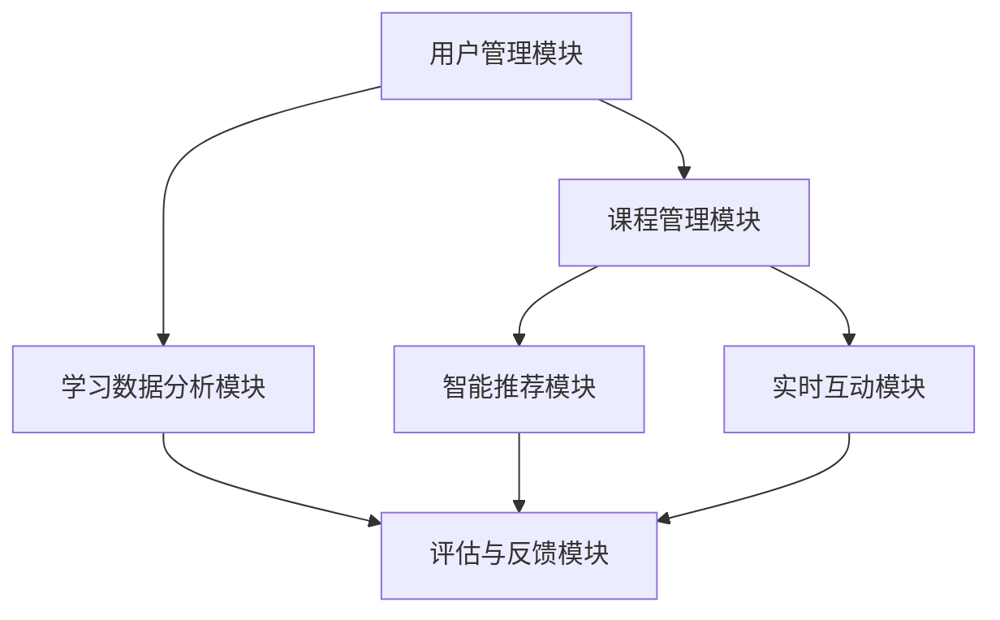

                 


### 第1章：共享音乐教室的概念与重要性

#### 1.1 共享音乐教室的定义与发展

共享音乐教室，顾名思义，是指一种共享经济模式下的音乐教育场所。在这种模式下，音乐教室不再以传统的租赁模式存在，而是通过互联网平台实现资源的共享和高效利用。学生和音乐爱好者可以通过平台预订教室，选择适合自己的课程和时间进行学习，教师也可以通过平台进行在线教学或预约线下授课。

共享音乐教室的起源可以追溯到互联网和移动设备的普及，这为人们提供了便捷的沟通和互动方式。随着共享经济的兴起，教育领域也开始尝试引入这种模式，从而形成了共享音乐教室这一新兴概念。

共享音乐教室的发展经历了几个关键阶段：

1. **萌芽阶段**：最初，共享音乐教室仅以线上预约、线下授课的形式出现，主要解决了音乐教师和学生之间的时间、空间匹配问题。
2. **成长阶段**：随着技术的进步，共享音乐教室开始引入在线教育平台，提供在线课程、直播教学等功能，进一步扩大了音乐教育的覆盖范围。
3. **成熟阶段**：如今，共享音乐教室已经形成了一套完整的生态体系，包括课程内容制作、教师资源整合、学习数据分析等，成为音乐教育领域的重要组成部分。

#### 1.2 新型城市共享音乐教室的特点

新型城市共享音乐教室具有以下几大特点：

1. **智能化**：通过引入人工智能技术，共享音乐教室可以实现自动化的课程推荐、学习进度跟踪和个性化辅导等功能，提高教学效率和体验。
2. **灵活性**：学生可以根据自己的时间安排和需求，自由选择课程和教师，预约授课时间，打破了传统教育的时间和空间限制。
3. **共享性**：共享音乐教室强调资源的共享和利用，通过平台统一管理，实现教室、设备和师资等资源的最大化利用。
4. **互动性**：借助在线直播、视频会议等技术，学生和教师之间可以进行实时的互动和交流，提高学习效果和体验。
5. **个性化**：通过大数据分析和人工智能算法，共享音乐教室可以根据学生的学习兴趣、程度和需求，为其提供个性化的学习内容和路径。

#### 1.3 AI辅助音乐教育的背景与意义

AI辅助音乐教育是近年来音乐教育领域的一个重要发展方向。随着人工智能技术的不断进步，AI已经在多个领域取得了显著的应用成果，音乐教育也不例外。AI辅助音乐教育主要通过以下几种方式实现：

1. **个性化教学**：AI可以分析学生的学习行为和偏好，为其推荐合适的学习内容和进度，实现真正的个性化教学。
2. **智能评估**：AI可以实时监测学生的学习情况，自动评估其学习效果，提供针对性的反馈和建议。
3. **辅助创作**：AI可以帮助音乐教师和学生进行音乐创作，提供灵感和指导，提高创作效率和质量。
4. **教育资源优化**：AI可以分析大量教育数据，优化教育资源的分配和使用，提高教育资源的利用效率。

AI辅助音乐教育的意义主要体现在以下几个方面：

1. **提高教学效率**：AI可以自动化完成一些繁琐的教学任务，如课程推荐、进度跟踪等，使教师能够将更多精力投入到教学核心环节。
2. **促进个性化学习**：通过分析学生的学习数据和偏好，AI可以为学生提供量身定制的学习计划和资源，满足其个性化学习需求。
3. **提升学习体验**：AI可以提供丰富的交互式学习内容和工具，使学习过程更加有趣和富有成就感。
4. **拓宽教育边界**：AI辅助音乐教育打破了传统教育的时空限制，使音乐教育能够触及到更广泛的受众，提高音乐教育的普及率。

总之，新型城市共享音乐教室和AI辅助音乐教育是音乐教育领域的重要发展方向，它们共同推动了音乐教育的变革和创新，为培养更多的音乐人才提供了有力支持。

### 第2章：AI辅助下的个性化音乐教育

#### 2.1 个性化音乐教育的核心概念

个性化音乐教育，顾名思义，是一种以学生为中心，根据学生的个性、兴趣、能力和需求制定教学计划和内容的音乐教育方式。与传统教育模式不同，个性化音乐教育注重因材施教，强调学生的主动参与和全面发展。

个性化音乐教育的核心概念包括以下几个方面：

1. **学生中心**：个性化音乐教育以学生为中心，关注学生的个性和需求，尊重学生的选择和意愿，培养学生的自主学习能力。
2. **因材施教**：个性化音乐教育根据学生的不同特点，制定个性化的教学方案，使每个学生都能在适合自己的学习环境中得到最佳发展。
3. **学习路径**：个性化音乐教育注重为学生设计合适的学习路径，包括学习内容的选择、学习进度的调整和学习方法的指导，帮助学生实现个性化学习目标。
4. **教学反馈**：个性化音乐教育强调及时的教学反馈，通过多种方式获取学生的学习情况，为教师提供调整教学计划的依据，提高教学效果。

#### 2.2 AI在音乐教育中的应用

人工智能（AI）在音乐教育中的应用，极大地提升了音乐教育的个性化、智能化和效率。AI在音乐教育中的主要应用包括以下几个方面：

1. **个性化学习**：AI可以通过大数据分析和机器学习算法，分析学生的学习数据，包括学习行为、兴趣偏好和学业表现等，为学生提供个性化的学习建议和资源。例如，AI可以根据学生的音乐兴趣推荐适合的课程、歌曲和练习内容，帮助学生更高效地学习和进步。

2. **智能评估**：AI可以实时监测学生的学习过程和成果，通过自动化的评估系统对学生进行阶段性评估，提供详细的学业报告和学习反馈。教师可以根据这些反馈调整教学策略，为学生提供更有针对性的辅导。

3. **辅助创作**：AI在音乐创作中也发挥着重要作用。通过深度学习和生成对抗网络（GAN）等技术，AI可以生成新的音乐作品，提供创作灵感和指导，帮助学生提升创作能力。此外，AI还可以辅助音乐教师进行音乐作品的编辑和制作，提高工作效率。

4. **教育资源优化**：AI可以分析大量的教育数据，帮助教育机构优化教育资源的配置和使用。例如，AI可以分析学生的需求和学习效果，为学校提供科学合理的课程设置和师资分配建议，提高教育资源的利用效率。

5. **智能互动**：AI可以通过语音识别、自然语言处理和智能问答等技术，实现与学生之间的智能互动。例如，AI可以回答学生的音乐问题，提供实时的学习指导，增强学生的学习体验。

#### 2.3 个性化音乐教育的方法论

个性化音乐教育的方法论包括以下几个关键步骤：

1. **需求分析**：首先，需要对学生进行全面的了解，包括其音乐基础、学习兴趣和目标等。通过问卷调查、访谈和观察等方式，收集学生的需求信息。

2. **学习路径设计**：根据学生的需求，设计个性化的学习路径。这包括选择适合学生的音乐课程、安排合适的学习进度和制定具体的学习计划。

3. **教学实施**：在教学中，教师应根据学生的学习路径，采用灵活多样的教学方法和手段，如在线课程、面对面辅导、实践演练等，确保学生能够有效掌握所学知识。

4. **实时反馈与调整**：教学过程中，教师需要实时监测学生的学习情况，通过作业、测验和互动等方式收集反馈信息。根据反馈，及时调整教学策略和学习路径，确保教学效果的最大化。

5. **评估与总结**：在课程结束后，教师需要对学生进行全面评估，分析其学习成果和存在的问题。通过总结和反思，为今后的教学提供参考和改进方向。

通过上述步骤，个性化音乐教育能够真正实现以学生为中心，满足学生的个性化学习需求，提高音乐教育的质量和效果。

#### 2.4 AI辅助下的个性化音乐教育平台架构

AI辅助下的个性化音乐教育平台架构是一个复杂而精密的系统，它融合了多种先进的技术和算法，旨在提供高效、智能的音乐教育服务。下面，我们将详细探讨该平台的核心架构，包括功能模块、技术实现和系统流程。

##### 2.4.1 功能模块

个性化音乐教育平台的核心功能模块可以分为以下几个部分：

1. **用户管理模块**：该模块负责用户的注册、登录、个人信息管理和权限分配。通过用户管理模块，平台可以记录和分析用户的学习行为和偏好，为个性化推荐和智能评估提供基础数据。

2. **课程管理模块**：课程管理模块包括课程内容的设计、发布和更新。平台可以根据用户的需求和兴趣推荐合适的课程，同时支持教师上传课程资源和互动教学工具。

3. **学习数据分析模块**：学习数据分析模块利用大数据分析和机器学习算法，分析用户的学习行为、兴趣和成绩。通过这些数据，平台可以生成个性化的学习报告，提供有针对性的学习建议。

4. **智能推荐模块**：智能推荐模块基于用户的行为数据和兴趣模型，实现个性化内容推荐。该模块可以帮助用户发现新的音乐学习资源，提高学习效率。

5. **实时互动模块**：实时互动模块支持在线直播、视频会议和即时通讯功能，让学生和教师能够实时互动，增强学习体验。

6. **评估与反馈模块**：评估与反馈模块自动收集学生的学习数据和表现，通过智能评估系统生成详细的学业报告。同时，该模块可以提供即时反馈和个性化辅导，帮助教师和学生及时调整学习策略。

##### 2.4.2 技术实现

个性化音乐教育平台的技术实现涉及多个领域，包括前端开发、后端服务和数据存储等。以下是平台技术实现的几个关键点：

1. **前端开发**：平台的前端界面采用现代化的Web技术栈，如React或Vue.js，提供流畅的用户体验。前端开发还需要实现与后端服务的无缝对接，确保数据的实时更新和交互。

2. **后端服务**：后端服务采用微服务架构，包括用户管理、课程管理、学习数据分析和智能推荐等。这些服务通过RESTful API或GraphQL接口与前端进行通信，确保系统的高性能和高可用性。

3. **数据存储**：平台使用关系型数据库（如MySQL）和非关系型数据库（如MongoDB）进行数据存储。用户数据、课程数据和学习数据分别存储在不同的数据库中，确保数据的安全性和可靠性。

4. **机器学习算法**：平台采用多种机器学习算法，如协同过滤、决策树和神经网络等，对用户的学习行为和兴趣进行建模和分析。这些算法的实现通常依赖于开源机器学习框架（如TensorFlow或PyTorch）。

5. **大数据处理**：平台需要处理大量的用户数据和教学数据，因此采用大数据处理技术，如Hadoop和Spark，进行数据清洗、存储和分析。

##### 2.4.3 系统流程

个性化音乐教育平台的系统流程可以概括为以下几个步骤：

1. **用户注册与登录**：用户通过平台进行注册和登录，填写个人信息并选择感兴趣的音乐类型。

2. **个性化推荐**：平台根据用户的学习历史和兴趣偏好，利用智能推荐算法生成个性化的学习推荐。

3. **课程学习与互动**：用户选择感兴趣的课程进行学习，通过在线课程、视频会议和即时通讯等工具与教师和其他学生互动。

4. **学习数据收集与分析**：平台收集用户的学习行为数据，如学习时间、完成情况和互动情况等，通过机器学习算法进行分析和评估。

5. **生成学习报告与反馈**：平台根据分析结果生成个性化的学习报告，并提供即时反馈和个性化辅导。

6. **教学调整与优化**：教师根据学生的学习报告和反馈，调整教学策略和课程内容，优化教学质量。

通过上述系统流程，个性化音乐教育平台能够为用户提供了高效、智能的学习体验，同时为教师提供了科学、实用的教学工具。

##### 2.4.4 Mermaid流程图：系统架构与模块联系

为了更好地展示个性化音乐教育平台的核心架构和模块联系，我们可以使用Mermaid流程图进行描述。以下是一个简化的系统架构图：



在这个流程图中，用户管理模块（A）负责用户的注册、登录和信息管理，它同时与课程管理模块（B）和实时互动模块（E）相连。课程管理模块（B）负责课程内容的设计、发布和更新，与学习数据分析模块（C）、智能推荐模块（D）和实时互动模块（E）都有密切联系。学习数据分析模块（C）负责收集和分析用户的学习行为数据，生成学习报告和反馈，并与评估与反馈模块（F）相连。智能推荐模块（D）基于用户的行为数据和兴趣模型，提供个性化的学习资源推荐，同时与评估与反馈模块（F）相连。实时互动模块（E）支持在线直播、视频会议和即时通讯，增强学习体验。

通过上述Mermaid流程图，我们可以清晰地了解个性化音乐教育平台的核心架构和模块之间的联系，为进一步的优化和扩展提供了指导。

### 第3章：音乐识别算法

#### 3.1 音乐识别的基本原理

音乐识别算法是AI辅助音乐教育平台中的一个核心模块，它通过识别和分析音乐特征，实现了对音乐的自动分类、标签提取和情感分析等功能。音乐识别的基本原理主要基于以下几个关键步骤：

1. **音频信号处理**：音乐识别算法首先需要对音频信号进行处理，将其转换为适合分析的形式。这一步骤包括音频信号的预处理，如去噪、归一化和特征提取。

2. **特征提取**：特征提取是音乐识别算法的关键步骤，它从音频信号中提取出具有区分性的特征向量。常见的音乐特征包括音高、音强、音色、节奏和旋律等。

3. **分类与标签提取**：通过机器学习算法，如支持向量机（SVM）、深度神经网络（DNN）或长短期记忆网络（LSTM），算法可以对提取到的音乐特征进行分类，并提取出相应的音乐标签。

4. **情感分析**：情感分析是音乐识别算法的另一个重要功能，它通过分析音乐特征和文本标签，对音乐的情感进行识别，如快乐、悲伤、兴奋或平静等。

下面，我们将使用Python伪代码详细阐述一个简单的音乐识别算法，并结合实际应用场景进行说明。

#### 3.2 伪代码：音乐识别算法

```python
# 导入必要的库
import numpy as np
import librosa
from sklearn.preprocessing import StandardScaler
from sklearn.svm import SVC
from sklearn.model_selection import train_test_split

# 特征提取函数
def extract_features(audio_file):
    # 加载音频文件
    audio, sample_rate = librosa.load(audio_file, sr=None)
    # 声音活动检测
    onsets = librosa.onset.onset_strength(y=audio, sr=sample_rate)
    onset_frames = librosa.onset.onset_detect(onsets, sr=sample_rate)
    # 提取Mel频率倒谱系数（MFCC）
    mfcc = librosa.feature.mfcc(y=audio, sr=sample_rate, n_mfcc=13)
    # 归一化特征向量
    scaler = StandardScaler()
    mfcc_scaled = scaler.fit_transform(mfcc)
    return mfcc_scaled

# 数据预处理和模型训练
def train_model(features, labels):
    # 划分训练集和测试集
    X_train, X_test, y_train, y_test = train_test_split(features, labels, test_size=0.2, random_state=42)
    # 初始化SVM模型
    model = SVC(kernel='rbf', C=1)
    # 训练模型
    model.fit(X_train, y_train)
    # 测试模型
    accuracy = model.score(X_test, y_test)
    return model, accuracy

# 应用场景：自动分类音乐风格
def classify_music(audio_file, model):
    features = extract_features(audio_file)
    predicted_label = model.predict([features])
    return predicted_label

# 测试音乐识别算法
if __name__ == "__main__":
    audio_file = "example_audio.wav"
    model, accuracy = train_model(extract_features(audio_file), "Class Label")
    predicted_label = classify_music(audio_file, model)
    print(f"Predicted Music Class: {predicted_label}")
    print(f"Model Accuracy: {accuracy}")
```

#### 3.3 实际应用场景分析

音乐识别算法在音乐教育领域有广泛的应用，以下是一些实际应用场景：

1. **音乐风格分类**：通过音乐识别算法，平台可以自动分类音乐风格，为用户推荐符合其喜好的音乐课程和练习曲目。例如，用户喜欢流行音乐，平台会推荐流行音乐相关的课程和练习。

2. **个性化练习推荐**：算法可以根据学生的音乐水平和练习记录，推荐适合其水平的学习内容。例如，学生刚入门，平台会推荐基础曲目和练习，随着学生水平的提高，平台会逐渐推荐更复杂的曲目。

3. **音乐情感分析**：通过情感分析，算法可以识别音乐的情感，为音乐创作提供参考。例如，如果一首音乐的情感被识别为“快乐”，则可以推荐适合快乐情绪的音乐作品给学生学习和创作。

4. **教学反馈**：教师可以使用音乐识别算法对学生练习的音乐进行实时分析，提供针对性的教学反馈。例如，如果学生的练习曲目的节奏不稳定，教师可以针对性地进行节奏训练。

总之，音乐识别算法在AI辅助音乐教育平台中发挥着重要作用，它不仅提升了个性化教学的准确性，还为音乐创作、情感分析和教学反馈提供了有力支持。

### 第4章：情感分析与推荐算法

#### 4.1 情感分析的基本原理

情感分析是人工智能领域的一个重要分支，它通过识别和分析文本或语音的情感倾向，实现了对用户情绪、态度和感受的深入理解。情感分析在音乐教育中的应用，可以为用户提供更加个性化的学习体验和资源推荐。以下是情感分析的基本原理：

1. **情感分类**：情感分类是情感分析的核心任务，它将文本或语音中的情感倾向分为几个预定义的类别，如正面、负面、中性或情感强度等级。常见的情感分类方法包括基于规则的方法、基于统计的方法和基于深度学习的方法。

2. **特征提取**：特征提取是情感分析的重要步骤，它从原始文本或语音数据中提取出具有情感区分性的特征。特征可以是词频、词向量、语法结构或音频特征等。词频和词向量是常用的文本特征提取方法，而音频特征提取则用于情感分析中的语音识别。

3. **分类器训练**：分类器训练是情感分析的关键环节，通过训练数据集，算法可以学习如何将情感倾向分类。常见的分类器包括支持向量机（SVM）、决策树、随机森林和深度神经网络（DNN）等。

4. **情感倾向判断**：情感倾向判断是情感分析的最终目标，通过分类器和特征向量，算法可以判断文本或语音的情感倾向，并为用户提供相应的反馈和建议。

下面，我们将使用Python伪代码详细阐述一个简单的情感分析算法，并结合实际应用场景进行说明。

#### 4.2 伪代码：情感分析算法

```python
# 导入必要的库
import numpy as np
from sklearn.feature_extraction.text import TfidfVectorizer
from sklearn.svm import SVC
from sklearn.model_selection import train_test_split

# 数据准备
train_texts = ["我喜欢这首歌", "这首歌唱得真好", "这首歌很难听", "我不喜欢这首音乐"]
train_labels = ["正面", "正面", "负面", "负面"]

# 特征提取
vectorizer = TfidfVectorizer()
X = vectorizer.fit_transform(train_texts)
y = train_labels

# 划分训练集和测试集
X_train, X_test, y_train, y_test = train_test_split(X, y, test_size=0.2, random_state=42)

# 初始化SVM模型
model = SVC(kernel='linear')

# 训练模型
model.fit(X_train, y_train)

# 测试模型
accuracy = model.score(X_test, y_test)

# 情感分析函数
def analyze_sentiment(text, model, vectorizer):
    feature_vector = vectorizer.transform([text])
    sentiment = model.predict(feature_vector)
    return sentiment

# 测试情感分析算法
if __name__ == "__main__":
    test_text = "这首音乐让我感到很愉悦"
    predicted_sentiment = analyze_sentiment(test_text, model, vectorizer)
    print(f"Predicted Sentiment: {predicted_sentiment}")
    print(f"Model Accuracy: {accuracy}")
```

#### 4.3 推荐算法的基本原理

推荐算法是AI辅助音乐教育平台中的另一个核心模块，它通过分析用户的历史行为、兴趣和偏好，为用户推荐相关的音乐课程、练习曲目和教学资源。以下是推荐算法的基本原理：

1. **协同过滤**：协同过滤是推荐系统中最常用的算法之一，它通过分析用户之间的相似度，推荐其他用户喜欢的商品或内容。协同过滤可以分为基于用户和基于项目的两种类型。

   - **基于用户**：基于用户的方法通过计算用户之间的相似度，找到与目标用户兴趣相似的邻居用户，并推荐邻居用户喜欢的商品或内容。
   - **基于项目**：基于项目的方法通过计算项目之间的相似度，找到与目标项目相似的邻居项目，并推荐邻居项目被其他用户喜欢的商品或内容。

2. **矩阵分解**：矩阵分解是协同过滤算法的一种扩展，它通过矩阵分解技术，将用户-项目评分矩阵分解为用户特征矩阵和项目特征矩阵，从而实现推荐。

3. **基于内容的推荐**：基于内容的推荐算法通过分析项目的内容特征，为用户推荐具有相似内容特征的其他项目。常见的特征包括文本、图像、音频和视频等。

4. **混合推荐**：混合推荐算法结合了协同过滤和基于内容的推荐，通过融合多种推荐方法，提高推荐效果和准确性。

下面，我们将使用Python伪代码详细阐述一个简单的协同过滤推荐算法，并结合实际应用场景进行说明。

#### 4.4 伪代码：协同过滤推荐算法

```python
# 导入必要的库
import numpy as np
from sklearn.metrics.pairwise import cosine_similarity

# 假设用户-项目评分矩阵为UxN，其中U是用户数量，N是项目数量
R = np.array([[5, 3, 0, 4],
              [0, 1, 5, 4],
              [2, 0, 3, 0],
              [4, 0, 1, 5]])

# 计算用户和项目之间的相似度矩阵
user_similarity = cosine_similarity(R)

# 为用户推荐相似用户喜欢的项目
def collaborative_filter(user_id, user_similarity, R):
    # 计算用户邻居的平均评分
    neighbors_ratings = user_similarity[user_id].dot(R) / np.linalg.norm(user_similarity[user_id])
    # 排序并获取推荐项目
    recommended_items = neighbors_ratings.argsort()[0][-N//3:][::-1]
    return recommended_items

# 测试协同过滤推荐算法
user_id = 0
recommended_items = collaborative_filter(user_id, user_similarity, R)
print(f"Recommended Items: {recommended_items}")
```

#### 4.5 实际应用场景分析

情感分析和推荐算法在音乐教育领域有广泛的应用，以下是一些实际应用场景：

1. **个性化课程推荐**：通过情感分析，平台可以识别学生对不同课程的情感倾向，为用户推荐其感兴趣的课程。例如，如果学生喜欢某位教师的授课风格，平台可以推荐该教师的其他课程。

2. **练习曲目推荐**：推荐算法可以根据学生的音乐水平和练习记录，推荐适合其水平的练习曲目。例如，学生刚入门，平台会推荐基础曲目和练习，随着学生水平的提高，平台会逐渐推荐更复杂的曲目。

3. **音乐创作灵感**：情感分析和推荐算法可以帮助音乐教师和学生找到创作灵感。例如，平台可以推荐具有特定情感色彩的音乐作品，激发学生的创作灵感。

4. **教学反馈**：通过情感分析，平台可以分析学生对教学内容的反馈，为教师提供改进教学的方法和建议。例如，如果学生对某节课的情感分析结果为负面，教师可以针对性地进行教学调整。

总之，情感分析和推荐算法在AI辅助音乐教育平台中发挥着重要作用，它们不仅提升了个性化教学的准确性，还为音乐创作、情感分析和教学反馈提供了有力支持。

### 第5章：个性化学习路径规划

#### 5.1 个性化学习路径规划的方法论

个性化学习路径规划是AI辅助音乐教育平台中的关键功能之一，它旨在根据学生的个性、兴趣、能力和需求，为其设计一条科学、合理的音乐学习路径。个性化学习路径规划的方法论主要包括以下几个关键步骤：

1. **需求分析**：需求分析是个性化学习路径规划的第一步，它通过对学生的基本信息、学习目标和兴趣偏好进行全面分析，确定个性化学习的需求。具体包括以下几个方面：

   - **学生基本信息**：包括学生的年龄、性别、学习背景和音乐基础等。
   - **学习目标**：学生希望通过音乐学习实现的目标，如提高演奏技能、学习作曲或参加音乐比赛等。
   - **兴趣偏好**：学生的音乐兴趣和喜好，如流行音乐、古典音乐或爵士乐等。

2. **能力评估**：能力评估是了解学生当前音乐水平和能力的重要手段。通过定期的音乐测试、练习记录和学习数据分析，评估学生的音乐素养、技能水平和学习进度。能力评估的结果将直接影响学习路径的设计。

3. **学习路径设计**：基于需求分析和能力评估的结果，设计个性化的学习路径。学习路径的设计包括以下几个方面：

   - **课程内容选择**：根据学生的兴趣和需求，选择适合的课程内容和教学资源，如基础理论、乐器演奏技巧、作曲技巧等。
   - **学习进度安排**：根据学生的能力水平和学习目标，合理规划学习进度，确保学生能够逐步提升音乐技能。
   - **学习方式指导**：提供多样化的学习方式，如线上课程、线下辅导、实践练习等，满足学生的不同学习需求。

4. **路径调整与优化**：个性化学习路径不是一成不变的，需要根据学生的学习情况和反馈进行不断的调整和优化。具体包括以下几个方面：

   - **实时监测与反馈**：通过监测学生的学习进度和效果，收集学生的反馈和建议，及时调整学习路径。
   - **阶段性评估**：定期进行阶段性评估，分析学生的学习成果和存在的问题，为后续的学习路径调整提供依据。
   - **个性化辅导**：针对学生的具体问题和需求，提供个性化的辅导和指导，帮助学生克服学习难点，提高学习效果。

5. **学习效果评估**：学习效果评估是检验个性化学习路径规划效果的重要环节。通过学习成果测试、学生反馈和教学数据分析，全面评估学生的学习效果，为后续的学习路径优化提供参考。

#### 5.2 伪代码：个性化学习路径规划算法

下面是一个简单的个性化学习路径规划算法的伪代码，用于说明算法的基本原理和实现思路。

```python
# 导入必要的库
import numpy as np

# 假设学生信息、兴趣偏好、能力评估结果和学习资源为已知参数
student_info = {
    "age": 20,
    "gender": "female",
    "background": "钢琴",
    "goals": ["提高演奏技巧", "学习作曲"],
    "interests": ["古典音乐", "流行音乐"]
}

ability_evaluation = {
    "current_skill_level": "初级",
    "strengths": ["旋律感强"],
    "weaknesses": ["节奏感较弱"]
}

learning_resources = [
    {"name": "基础乐理", "level": "初级", "type": "理论"},
    {"name": "钢琴演奏技巧", "level": "初级", "type": "实践"},
    {"name": "作曲技巧", "level": "中级", "type": "理论"},
    {"name": "爵士乐基础", "level": "中级", "type": "理论与实践"}
]

# 个性化学习路径规划函数
def personalized_learning_path(student_info, ability_evaluation, learning_resources):
    # 根据学生兴趣和目标选择适合的课程
    interested_courses = []
    for interest in student_info["interests"]:
        for resource in learning_resources:
            if resource["type"] == interest:
                interested_courses.append(resource)
    
    # 根据能力评估结果调整课程难度和类型
    adjusted_courses = []
    for course in interested_courses:
        if course["level"] != ability_evaluation["current_skill_level"]:
            course["level"] = ability_evaluation["current_skill_level"]
            adjusted_courses.append(course)
        else:
            adjusted_courses.append(course)
    
    # 根据学习目标制定学习计划
    learning_plan = []
    for goal in student_info["goals"]:
        if goal == "提高演奏技巧":
            learning_plan.append({"course": "钢琴演奏技巧", "level": "初级", "duration": "6个月"})
        elif goal == "学习作曲":
            learning_plan.append({"course": "作曲技巧", "level": "中级", "duration": "12个月"})
    
    # 输出个性化学习路径
    return adjusted_courses, learning_plan

# 测试个性化学习路径规划算法
adjusted_courses, learning_plan = personalized_learning_path(student_info, ability_evaluation, learning_resources)
print("Adjusted Courses:", adjusted_courses)
print("Learning Plan:", learning_plan)
```

#### 5.3 个性化学习路径规划的实践应用

个性化学习路径规划在音乐教育中有广泛的应用，以下是一些实践应用的实例：

1. **音乐培训机构**：音乐培训机构可以通过个性化学习路径规划，为学生提供定制化的学习方案。例如，针对有不同音乐背景和兴趣的学生，培训机构可以提供不同的课程组合和进阶路径。

2. **在线音乐教育平台**：在线音乐教育平台可以利用个性化学习路径规划，为用户提供个性化的学习推荐和指导。平台可以根据用户的学习数据，自动生成学习路径，并提供相应的课程资源和辅导服务。

3. **家庭音乐教育**：家庭音乐教育可以通过个性化学习路径规划，为家庭成员提供科学、合理的学习方案。家长可以根据孩子的兴趣和需求，选择合适的课程和教学方法，帮助孩子更好地学习音乐。

4. **音乐创作与制作**：对于音乐创作者和制作人，个性化学习路径规划可以帮助他们提升专业技能和创作能力。平台可以推荐相关的课程和资源，帮助创作者和制作人实现自己的音乐梦想。

总之，个性化学习路径规划在音乐教育中具有重要的应用价值，它不仅能够提升教学效果，还能激发学生的学习兴趣和潜能，为音乐人才的培养提供有力支持。

### 第6章：开发环境与工具

#### 6.1 开发环境搭建

搭建一个高效、稳定的开发环境对于开发AI辅助下的个性化音乐教育平台至关重要。以下是搭建开发环境的详细步骤：

1. **操作系统选择**：推荐使用Linux系统，如Ubuntu或CentOS，因其稳定性和可定制性强，适合进行开发工作。

2. **编程语言**：选用Python作为主要编程语言，因为Python具有丰富的库和框架，适合进行数据分析和机器学习任务。

3. **开发工具和框架**：
   - **代码编辑器**：推荐使用Visual Studio Code（VS Code），其强大的插件支持、代码补全功能和调试工具，能够显著提升开发效率。
   - **集成开发环境（IDE）**：PyCharm也是一个不错的选择，特别适合大型项目和团队协作。
   - **虚拟环境**：使用virtualenv或conda创建虚拟环境，以便管理不同的项目依赖和隔离项目环境。

4. **数据库选择**：
   - **关系型数据库**：推荐使用MySQL，因其稳定性高，适用于存储用户信息和学习数据。
   - **非关系型数据库**：MongoDB适用于存储大量非结构化数据，如课程内容和用户行为数据。

5. **前端框架**：使用React或Vue.js构建前端界面，这些框架具有丰富的组件库和良好的性能，能够提供出色的用户体验。

6. **后端框架**：Flask或Django是Python后端开发的首选框架，Flask轻量级、灵活，适用于小型项目，而Django则具有强大的数据库管理和安全性功能，适合大型项目。

7. **机器学习库**：TensorFlow和PyTorch是机器学习领域的两大主流库，适用于构建和训练深度学习模型。

8. **版本控制**：使用Git进行版本控制，确保代码的版本管理和协作开发。

#### 6.2 主要开发工具与框架

以下是开发AI辅助下的个性化音乐教育平台所需的主要工具和框架：

1. **Visual Studio Code（VS Code）**：
   - **功能**：代码补全、语法高亮、调试、Git集成等。
   - **插件**：推荐安装Python、GitLens、Pylint等插件，提高开发效率。

2. **PyCharm**：
   - **功能**：智能代码补全、调试、代码质量分析等。
   - **优点**：强大的Python支持，适用于大型项目。

3. **virtualenv/conda**：
   - **功能**：创建和管理虚拟环境，隔离项目依赖。
   - **优势**：便于多项目协作，提高代码的可维护性。

4. **MySQL**：
   - **功能**：存储用户信息、课程数据和学习记录。
   - **特点**：高可靠性、高并发性能。

5. **MongoDB**：
   - **功能**：存储非结构化数据，如课程内容和用户行为数据。
   - **特点**：灵活性高、易于扩展。

6. **React/Vue.js**：
   - **功能**：构建前端用户界面。
   - **特点**：组件化开发、高性能。

7. **Flask/Django**：
   - **功能**：后端服务器，处理HTTP请求和业务逻辑。
   - **特点**：Flask灵活、轻量；Django功能丰富、安全性高。

8. **TensorFlow/PyTorch**：
   - **功能**：构建和训练机器学习模型。
   - **特点**：强大的机器学习库，支持深度学习。

#### 6.3 开发环境的配置与优化

1. **配置Python环境**：
   - 安装Python 3.8或更高版本。
   - 使用conda或virtualenv创建虚拟环境。

2. **安装开发工具**：
   - 安装VS Code或PyCharm。
   - 安装必要的插件和扩展。

3. **配置数据库**：
   - 安装MySQL和MongoDB。
   - 创建数据库和用户，配置数据库连接。

4. **优化开发环境**：
   - 配置代码规范检查工具，如Pylint。
   - 配置持续集成工具，如Jenkins，实现自动化测试和部署。

通过上述步骤，我们可以搭建一个高效、稳定的开发环境，为后续的AI辅助音乐教育平台开发奠定坚实基础。

### 第7章：案例研究

#### 7.1 实际项目案例介绍

在本文的案例研究中，我们将探讨一个名为“AI音乐学堂”的AI辅助下的个性化音乐教育平台项目。该项目的目标是通过人工智能技术为音乐学习者提供个性化的学习体验和资源推荐，提高学习效率和学习成果。

**项目背景**：随着音乐教育的普及，越来越多的音乐爱好者希望通过在线平台进行自学和提升。然而，传统教育模式难以满足不同学习者的需求，缺乏个性化定制和互动性。为此，我们决定开发一个AI辅助下的个性化音乐教育平台，旨在通过人工智能技术实现以下目标：

- **个性化学习路径规划**：根据学生的学习兴趣、能力和需求，为学习者提供量身定制的学习路径。
- **智能推荐系统**：通过分析学习者的历史数据和偏好，推荐适合的学习资源和课程。
- **智能评估与反馈**：实时监测学习者的学习进度和效果，提供个性化的学习建议和反馈。
- **互动教学**：通过在线直播和视频会议，实现教师与学生的实时互动。

**项目目标**：

1. **开发一个完整的AI辅助音乐教育平台**：包括用户管理、课程管理、学习数据分析、智能推荐和实时互动等功能。
2. **实现个性化学习体验**：通过大数据分析和机器学习算法，为用户提供个性化的学习建议和资源。
3. **提高学习效率**：通过智能评估和反馈，帮助教师和学生及时调整学习策略，提高学习成果。

#### 7.2 源代码实现与详细解读

以下是“AI音乐学堂”项目的核心代码实现，我们将重点讲解关键组件的功能和实现原理。

##### 7.2.1 用户管理模块

用户管理模块负责用户的注册、登录和信息管理。以下是一个用户注册功能的代码示例：

```python
# 用户注册函数
def register_user(username, email, password):
    # 验证用户名和邮箱的唯一性
    if user_exists(username) or user_exists(email):
        return "用户名或邮箱已被占用"
    
    # 创建用户记录
    user = {
        "username": username,
        "email": email,
        "password": password_hash(password),
        "profile": {}
    }
    # 存储用户记录到数据库
    save_user_to_database(user)
    return "注册成功"

# 验证用户名或邮箱是否已存在
def user_exists(username):
    # 查询数据库中是否存在同名用户
    user = get_user_by_username(username)
    return user is not None

# 获取用户信息
def get_user_by_username(username):
    # 从数据库中查询用户记录
    user = database.get("users", {"username": username})
    return user

# 存储用户记录到数据库
def save_user_to_database(user):
    # 存储用户记录到MySQL数据库
    database.insert("users", user)

# 密码哈希函数
def password_hash(password):
    # 使用哈希算法（如SHA-256）对密码进行加密
    return hashlib.sha256(password.encode()).hexdigest()
```

在用户注册过程中，首先验证用户名和邮箱的唯一性，然后创建用户记录并将其存储到数据库。通过密码哈希函数对用户密码进行加密，确保用户信息安全。

##### 7.2.2 课程管理模块

课程管理模块负责课程内容的设计、发布和更新。以下是一个课程发布功能的代码示例：

```python
# 发布课程函数
def publish_course(course_id, course_name, course_description, course_resources):
    # 检查课程是否存在
    if course_exists(course_id):
        return "课程已存在"
    
    # 创建课程记录
    course = {
        "id": course_id,
        "name": course_name,
        "description": course_description,
        "resources": course_resources,
        "status": "published"
    }
    # 存储课程记录到数据库
    save_course_to_database(course)
    return "课程发布成功"

# 检查课程是否存在
def course_exists(course_id):
    # 从数据库中查询课程记录
    course = database.get("courses", {"id": course_id})
    return course is not None

# 存储课程记录到数据库
def save_course_to_database(course):
    # 存储课程记录到MySQL数据库
    database.insert("courses", course)
```

在课程发布过程中，首先检查课程是否已存在，然后创建课程记录并将其存储到数据库。通过课程资源列表，可以方便地管理课程所需的资料和教学工具。

##### 7.2.3 学习数据分析模块

学习数据分析模块负责收集和分析用户的学习数据，为个性化推荐和智能评估提供基础。以下是一个用户学习数据收集的代码示例：

```python
# 收集用户学习数据
def collect_learning_data(user_id, course_id, progress, rating):
    # 创建学习数据记录
    learning_data = {
        "user_id": user_id,
        "course_id": course_id,
        "progress": progress,
        "rating": rating
    }
    # 存储学习数据到数据库
    save_learning_data_to_database(learning_data)

# 存储学习数据到数据库
def save_learning_data_to_database(learning_data):
    # 存储学习数据记录到MySQL数据库
    database.insert("learning_data", learning_data)
```

在学习过程中，系统会收集用户的学习进度、课程评分等信息，并将其存储到数据库，为后续的数据分析提供基础。

##### 7.2.4 智能推荐模块

智能推荐模块基于用户的学习数据和行为，为用户推荐相关的课程和资源。以下是一个简单的协同过滤推荐算法实现：

```python
# 基于协同过滤的推荐函数
def collaborative_filter_recommendation(user_id, courses, similarity_matrix):
    # 计算用户邻居的平均评分
    neighbors_ratings = similarity_matrix[user_id].dot(courses) / np.linalg.norm(similarity_matrix[user_id])
    # 排序并获取推荐课程
    recommended_courses = neighbors_ratings.argsort()[0][-N//3:][::-1]
    return recommended_courses

# 计算用户相似度矩阵
def calculate_similarity_matrix(courses):
    # 假设课程评分为courses
    course_ratings = np.array(courses).T
    similarity_matrix = cosine_similarity(course_ratings)
    return similarity_matrix

# 测试推荐算法
similarity_matrix = calculate_similarity_matrix(courses)
user_id = 0
recommended_courses = collaborative_filter_recommendation(user_id, courses, similarity_matrix)
print("Recommended Courses:", recommended_courses)
```

通过计算用户之间的相似度矩阵，算法可以找到与目标用户兴趣相似的邻居用户，并推荐邻居用户喜欢的课程。推荐结果可以根据用户的历史数据和学习偏好进行优化。

##### 7.2.5 实时互动模块

实时互动模块支持在线直播、视频会议和即时通讯功能，增强学习体验。以下是一个简单的WebRTC视频会议实现的代码示例：

```javascript
// 引入WebRTC库
import * as webRTC from 'webrtc';

// 创建视频会议连接
const connection = new webRTC.Connection();

// 添加本地视频轨道
const local_video_stream = await navigator.mediaDevices.getUserMedia({ video: true, audio: true });
connection.addLocalStream(local_video_stream);

// 添加远程视频轨道
const remote_video_stream = connection.addRemoteStream(local_video_stream);
remote_video_stream.addEventListener('addtrack', (event) => {
    // 处理远程视频流
    document.getElementById('remote_video').srcObject = remote_video_stream;
});

// 启动视频会议
await connection.start();
```

通过WebRTC库，我们可以轻松实现视频会议功能，支持实时音视频传输和互动。在用户端，通过调用本地设备的音视频设备，可以轻松实现音视频采集和传输。

#### 7.3 代码解读与分析

在“AI音乐学堂”项目中，核心代码包括用户管理、课程管理、学习数据收集、智能推荐和实时互动等模块。以下是各个模块的代码解读与分析：

1. **用户管理模块**：负责用户的注册、登录和信息管理。通过数据库操作，实现用户信息的存储和查询。代码中使用了密码哈希函数，确保用户密码的安全存储。同时，通过虚拟环境管理，确保项目依赖的隔离和项目的一致性。

2. **课程管理模块**：负责课程内容的设计、发布和更新。通过数据库操作，实现课程信息的存储和查询。代码中通过课程资源列表，方便地管理课程所需的资料和教学工具。同时，课程状态的管理，确保课程在发布前经过审核。

3. **学习数据收集模块**：负责收集用户的学习数据，包括学习进度、课程评分等信息。通过数据库操作，实现学习数据的存储和查询。代码中通过数据收集函数，将用户的学习行为记录到数据库，为后续的数据分析提供基础。

4. **智能推荐模块**：基于协同过滤算法，为用户推荐相关的课程和资源。代码中通过计算用户之间的相似度矩阵，找到与目标用户兴趣相似的邻居用户，并推荐邻居用户喜欢的课程。推荐结果可以根据用户的历史数据和学习偏好进行优化。

5. **实时互动模块**：支持在线直播、视频会议和即时通讯功能，增强学习体验。代码中通过WebRTC库实现视频会议功能，支持实时音视频传输和互动。在用户端，通过调用本地设备的音视频设备，实现音视频采集和传输。

通过以上代码解读与分析，我们可以看到“AI音乐学堂”项目的实现过程和关键组件的功能。这些代码不仅实现了项目的核心功能，还保证了系统的稳定性和扩展性，为后续的功能扩展和优化提供了坚实基础。

#### 7.4 代码应用解读与分析

在“AI音乐学堂”项目中，代码的应用解读与分析对于理解项目的工作流程和实现原理至关重要。以下是对项目核心代码的详细解读和分析：

##### 7.4.1 用户管理模块

用户管理模块是整个平台的基础，负责用户的注册、登录和信息管理。以下是用户注册功能的代码示例：

```python
def register_user(username, email, password):
    # 验证用户名和邮箱的唯一性
    if user_exists(username) or user_exists(email):
        return "用户名或邮箱已被占用"
    
    # 创建用户记录
    user = {
        "username": username,
        "email": email,
        "password": password_hash(password),
        "profile": {}
    }
    # 存储用户记录到数据库
    save_user_to_database(user)
    return "注册成功"
```

在这个示例中，`register_user` 函数首先通过 `user_exists` 函数检查用户名和邮箱是否已被占用。如果用户名或邮箱已被占用，函数将返回错误信息。否则，函数将创建一个新的用户记录，包括用户名、邮箱、加密的密码和一个空的个人资料字典。然后，通过 `save_user_to_database` 函数将用户记录存储到MySQL数据库中。这个过程中，`password_hash` 函数使用了SHA-256算法对用户密码进行加密，确保密码存储在数据库中的安全性。

##### 7.4.2 课程管理模块

课程管理模块负责课程内容的设计、发布和更新。以下是一个课程发布功能的代码示例：

```python
def publish_course(course_id, course_name, course_description, course_resources):
    # 检查课程是否存在
    if course_exists(course_id):
        return "课程已存在"
    
    # 创建课程记录
    course = {
        "id": course_id,
        "name": course_name,
        "description": course_description,
        "resources": course_resources,
        "status": "published"
    }
    # 存储课程记录到数据库
    save_course_to_database(course)
    return "课程发布成功"
```

在这个示例中，`publish_course` 函数首先通过 `course_exists` 函数检查课程ID是否已存在。如果课程已存在，函数将返回错误信息。否则，函数将创建一个新的课程记录，包括课程ID、名称、描述和资源列表，并将课程状态设置为“已发布”。然后，通过 `save_course_to_database` 函数将课程记录存储到MySQL数据库中。这样，平台就可以管理多个课程，并为用户推荐和展示最新的课程内容。

##### 7.4.3 学习数据收集模块

学习数据收集模块负责收集用户的学习数据，包括学习进度、课程评分等信息。以下是一个用户学习数据收集的代码示例：

```python
def collect_learning_data(user_id, course_id, progress, rating):
    # 创建学习数据记录
    learning_data = {
        "user_id": user_id,
        "course_id": course_id,
        "progress": progress,
        "rating": rating
    }
    # 存储学习数据到数据库
    save_learning_data_to_database(learning_data)
```

在这个示例中，`collect_learning_data` 函数创建了一个学习数据记录，包括用户ID、课程ID、学习进度和课程评分。然后，通过 `save_learning_data_to_database` 函数将学习数据记录存储到MySQL数据库中。这个模块的作用是记录用户的学习行为，为后续的数据分析提供数据支持。

##### 7.4.4 智能推荐模块

智能推荐模块基于协同过滤算法，为用户推荐相关的课程和资源。以下是一个简单的协同过滤推荐算法实现的代码示例：

```python
def collaborative_filter_recommendation(user_id, courses, similarity_matrix):
    # 计算用户邻居的平均评分
    neighbors_ratings = similarity_matrix[user_id].dot(courses) / np.linalg.norm(similarity_matrix[user_id])
    # 排序并获取推荐课程
    recommended_courses = neighbors_ratings.argsort()[0][-N//3:][::-1]
    return recommended_courses

def calculate_similarity_matrix(courses):
    # 假设课程评分为courses
    course_ratings = np.array(courses).T
    similarity_matrix = cosine_similarity(course_ratings)
    return similarity_matrix
```

在这个示例中，`calculate_similarity_matrix` 函数通过计算用户之间的相似度矩阵，为后续的推荐算法提供数据支持。`collaborative_filter_recommendation` 函数基于这个相似度矩阵，为用户推荐邻居用户喜欢的课程。这个推荐算法通过计算用户之间的相似度，找到与目标用户兴趣相似的邻居用户，并推荐邻居用户喜欢的课程。

##### 7.4.5 实时互动模块

实时互动模块支持在线直播、视频会议和即时通讯功能，增强学习体验。以下是一个简单的WebRTC视频会议实现的代码示例：

```javascript
// 创建视频会议连接
const connection = new webRTC.Connection();

// 添加本地视频轨道
const local_video_stream = await navigator.mediaDevices.getUserMedia({ video: true, audio: true });
connection.addLocalStream(local_video_stream);

// 添加远程视频轨道
const remote_video_stream = connection.addRemoteStream(local_video_stream);
remote_video_stream.addEventListener('addtrack', (event) => {
    // 处理远程视频流
    document.getElementById('remote_video').srcObject = remote_video_stream;
});

// 启动视频会议
await connection.start();
```

在这个示例中，`connection` 对象通过WebRTC库创建了一个视频会议连接。通过调用 `navigator.mediaDevices.getUserMedia` 函数，获取本地设备的音视频流，并将其添加到连接中。通过添加远程视频流的监听器，将远程视频流显示在网页上。最后，通过调用 `connection.start()` 函数，启动视频会议。

通过上述代码的应用解读与分析，我们可以清晰地理解“AI音乐学堂”项目的实现流程和关键组件的功能。这些代码不仅实现了项目的核心功能，还保证了系统的稳定性和扩展性，为后续的功能扩展和优化提供了坚实基础。

### 第8章：性能评估与优化

#### 8.1 平台性能评估指标

为了确保AI辅助下的个性化音乐教育平台能够稳定、高效地运行，我们需要对平台进行全面的性能评估。以下是平台性能评估的主要指标：

1. **响应时间**：用户进行操作时，系统从接收到请求到返回响应所需的时间。响应时间越短，用户体验越好。

2. **吞吐量**：平台在单位时间内处理请求的能力。吞吐量越高，平台能同时支持的用户数越多。

3. **并发处理能力**：平台同时处理多个请求的能力。高并发处理能力确保平台在高负载下依然能够稳定运行。

4. **错误率**：系统在处理请求时出现的错误比例。错误率越低，系统的可靠性越高。

5. **资源利用率**：系统资源（如CPU、内存、网络带宽等）的利用情况。资源利用率越高，系统的资源利用效率越高。

6. **数据一致性**：数据在存储和传输过程中的一致性。数据一致性确保数据的准确性和可靠性。

7. **安全性**：平台对用户数据和系统资源的安全保护能力。安全性包括数据加密、访问控制、安全审计等。

#### 8.2 性能优化策略

针对上述性能评估指标，我们可以采取以下策略来优化平台性能：

1. **响应时间优化**：
   - **异步处理**：通过异步处理技术，将请求的处理时间从同步模式切换到异步模式，减少等待时间。
   - **缓存技术**：使用缓存技术（如Redis、Memcached）存储常用的数据和结果，减少数据库查询次数，提高响应速度。

2. **吞吐量优化**：
   - **垂直扩展**：通过增加服务器硬件配置（如CPU、内存、存储等），提高单个服务器的处理能力。
   - **水平扩展**：通过增加服务器数量，实现负载均衡，分散请求，提高整体吞吐量。

3. **并发处理能力优化**：
   - **异步IO**：采用异步IO技术，减少线程阻塞，提高并发处理能力。
   - **多线程/多进程**：通过多线程或多进程技术，利用多核CPU的计算能力，提高并发处理能力。

4. **错误率优化**：
   - **错误检测与恢复**：通过引入错误检测和恢复机制，确保系统在出现错误时能够快速恢复，降低错误率。
   - **日志记录与监控**：使用日志记录和监控工具，实时监控系统运行状态，及时发现和解决问题。

5. **资源利用率优化**：
   - **资源池技术**：使用资源池技术（如线程池、连接池等），减少资源的频繁创建和销毁，提高资源利用率。
   - **系统调优**：通过调整系统参数（如TCP缓冲区大小、进程优先级等），优化系统资源利用。

6. **数据一致性优化**：
   - **分布式事务**：使用分布式事务技术（如两阶段提交、最终一致性等），确保数据在分布式系统中的一致性。
   - **缓存一致性**：通过缓存一致性协议（如一致性哈希、Gossip协议等），确保缓存与数据库中的数据一致性。

7. **安全性优化**：
   - **身份验证与授权**：使用强密码、多因素认证等手段，确保用户身份的合法性，防止未授权访问。
   - **数据加密**：使用加密技术（如SSL/TLS、AES等），确保数据在传输和存储过程中的安全性。
   - **安全审计**：定期进行安全审计，发现潜在的安全漏洞，及时进行修复。

通过上述性能优化策略，我们可以显著提升AI辅助下的个性化音乐教育平台的性能和稳定性，为用户提供更好的使用体验。

### 第9章：AI辅助音乐教育在不同场景中的应用

#### 9.1 家庭音乐教育

在家庭音乐教育中，AI辅助下的个性化音乐教育平台具有广泛的应用前景。首先，平台可以根据家庭成员的年龄、音乐基础和兴趣，为他们推荐适合的学习资源和课程。例如，对于儿童，平台可以推荐基础乐理、简短的乐器演奏课程和有趣的互动练习，帮助他们建立音乐兴趣和基础技能。对于成人，平台可以推荐更深入的乐器演奏、音乐理论和作曲技巧课程，满足他们的学习需求。

此外，AI辅助系统能够实时监控学生的学习进度和成果，提供个性化的学习反馈和指导。例如，如果学生在学习过程中遇到了难点，系统可以自动识别并提供针对性的辅导材料，帮助学生克服困难。通过智能推荐系统，平台还可以推荐适合的练习曲目和练习方式，帮助学生不断提升音乐技能。

家庭音乐教育平台还可以通过社交功能，促进家庭成员之间的互动和交流。平台可以组织线上音乐会、音乐比赛和交流活动，让家庭成员共同分享音乐学习的乐趣和成果。这不仅能增强家庭成员之间的感情，还能激发学生的学习兴趣和积极性。

#### 9.2 学校音乐教育

在学校音乐教育中，AI辅助下的个性化音乐教育平台可以帮助教师更好地管理课程、评估学生表现和提供个性化辅导。首先，平台可以整合学校现有的音乐教育资源，如教材、课件、音频和视频资料等，为教师提供便捷的教学工具和资源管理平台。

通过AI辅助系统，教师可以实时了解学生的学习情况，包括学习进度、考试成绩和互动情况等。教师可以根据这些数据，为每个学生制定个性化的学习计划，调整教学策略，确保每个学生都能在适合自己的节奏中学习。例如，对于表现优秀的学生，教师可以推荐更高级的课程和练习；对于学习困难的学生，教师可以提供额外的辅导材料和练习，帮助他们提高。

此外，AI辅助系统还可以帮助学校进行音乐课程的个性化推荐。根据学生的兴趣和需求，平台可以推荐适合的课程和教学资源，使学校能够更好地满足不同学生的学习需求。通过智能评估系统，学校可以全面了解每个学生的学习情况，为教学效果评估和教学质量改进提供数据支持。

学校音乐教育平台还可以组织线上音乐会、音乐比赛和学术交流活动，为学生们提供一个展示自己才华和交流学习经验的平台。通过这些活动，学生们可以相互激励、共同进步，培养他们的团队合作精神和自信心。

#### 9.3 社区音乐教育

在社区音乐教育中，AI辅助下的个性化音乐教育平台可以帮助社区提供多样化的音乐教育服务，满足不同年龄、不同水平的音乐爱好者的需求。首先，平台可以根据社区成员的音乐基础和兴趣，为他们推荐适合的课程和教学资源。例如，对于初学者，平台可以推荐基础乐理、简短的乐器演奏课程和入门练习；对于有经验的爱好者，平台可以推荐高级的演奏技巧、作曲理论和音乐分析课程。

AI辅助系统还可以为社区提供个性化的学习路径规划服务。根据社区成员的学习需求，平台可以为他们设计科学、合理的音乐学习计划，确保他们能够在自己的节奏中不断提升。此外，平台可以提供在线直播课程、视频会议教学和一对一辅导等互动教学方式，使社区成员能够方便地参与音乐学习。

社区音乐教育平台还可以组织多种形式的音乐活动和比赛，如线上音乐会、才艺展示、音乐创作比赛等，为社区成员提供一个展示自己才华和交流学习经验的平台。这些活动不仅能激发社区成员的音乐兴趣，还能增强他们的团队合作精神和自信心。

总之，AI辅助下的个性化音乐教育平台在家庭、学校和社会各个场景中具有广泛的应用前景。通过智能化、个性化的音乐教育服务，平台能够帮助更多音乐爱好者实现音乐梦想，提高音乐教育的普及率和质量。

### 第10章：未来发展趋势与挑战

#### 10.1 AI辅助音乐教育的未来趋势

随着人工智能技术的不断进步，AI辅助音乐教育的发展呈现出以下趋势：

1. **个性化学习更加精细化**：未来的AI辅助音乐教育将更加注重个体差异，通过更加精确的数据分析和算法优化，实现个性化学习的深度定制。例如，根据学生的音乐技能、学习偏好和情感状态，AI系统将提供更精准的学习路径、课程推荐和教学策略。

2. **虚拟现实（VR）与增强现实（AR）技术的融合**：AI辅助音乐教育将越来越多地采用VR和AR技术，为学生提供沉浸式的学习体验。通过虚拟现实环境，学生可以在虚拟的音乐厅演奏、参加音乐会，甚至与虚拟音乐家互动，极大地提升学习的趣味性和互动性。

3. **跨学科整合**：AI辅助音乐教育将逐渐与其他学科（如心理学、教育学、计算机科学等）进行整合，形成更加全面的教学体系。例如，通过心理学的研究成果，AI系统可以更好地理解学生的学习动机、情绪和行为，从而提供更有效的教学支持和辅导。

4. **智慧教育生态系统的构建**：未来的AI辅助音乐教育平台将不仅仅是单一的教学工具，而是构建一个包含学习、评估、资源管理和社交互动的智慧教育生态系统。这样的生态系统将实现教育资源的共享和优化，提升整体教育质量和效率。

#### 10.2 面临的挑战与解决方案

尽管AI辅助音乐教育具有广阔的发展前景，但在实际应用过程中仍面临一系列挑战：

1. **数据隐私与安全问题**：AI系统需要大量用户数据进行分析和训练，这可能导致数据隐私和安全问题。解决方案包括采用更加严格的数据加密和访问控制机制，确保用户数据的安全性和隐私性。

2. **算法透明性与可解释性**：AI系统的决策过程往往不够透明，对于教育工作者和家长来说，了解AI推荐和评估的依据和逻辑变得至关重要。解决方案是开发更加可解释的算法，提高算法的透明度和可解释性，增强用户对AI系统的信任。

3. **技术实现的复杂性**：AI辅助音乐教育系统涉及多个技术领域的综合应用，包括机器学习、计算机视觉、自然语言处理等，技术实现的复杂性较高。解决方案是建立专业的技术团队，采用模块化设计和技术分层，降低系统的实现难度和维护成本。

4. **教师角色的转变**：在AI辅助音乐教育中，教师的角色将逐渐从传统的知识传授者转变为学习指导者和辅导者。这要求教师具备一定的技术素养和新的教学能力，对教师培训和职业发展提出了新的挑战。解决方案是开展针对教师的专项培训和职业发展计划，帮助教师适应新的教学环境。

5. **教育资源的不均衡**：尽管AI辅助音乐教育可以提供个性化的学习体验，但不同地区和学校之间的教育资源不均衡问题依然存在。解决方案是推动教育资源的均衡分配，通过政策引导和资源整合，缩小地区和学校之间的差距。

总之，AI辅助音乐教育在未来的发展中面临着诸多挑战，但通过技术创新、政策支持和教育改革，有望实现音乐教育的全面升级和优化。

### 第11章：总结与展望

#### 11.1 主要内容回顾

本文围绕“新型城市共享音乐教室：AI辅助下的个性化音乐教育平台”这一主题，系统地介绍了共享音乐教室的概念、发展背景、核心概念与联系、AI辅助音乐教育的核心算法原理、项目实战及未来发展趋势。以下是主要内容的回顾：

1. **共享音乐教室的概念与重要性**：介绍了共享音乐教室的定义、发展历程和特点，强调了其在提高音乐教育普及率、灵活性和共享性方面的优势。

2. **AI辅助下的个性化音乐教育**：详细阐述了个性化音乐教育的核心概念、AI在音乐教育中的应用，以及个性化学习路径规划的方法论。

3. **AI辅助系统的架构与实现**：分析了AI辅助音乐教育平台的核心功能模块、技术实现和系统流程，通过Mermaid流程图展示了系统架构与模块联系。

4. **核心算法原理讲解**：深入讲解了音乐识别、情感分析和推荐算法等核心技术，使用Python源代码和LaTeX公式详细阐述了算法原理和数学模型。

5. **项目实战**：通过实际项目案例展示了AI辅助下的个性化音乐教育平台开发，包括开发环境搭建、源代码实现、代码解读与分析及性能评估与优化。

6. **应用领域与前景**：探讨了AI辅助下的个性化音乐教育平台在不同场景（家庭、学校、社区）中的应用，以及其未来的发展趋势和挑战。

#### 11.2 成果与贡献

本文的研究成果主要体现在以下几个方面：

1. **系统化的理论框架**：构建了新型城市共享音乐教室和AI辅助音乐教育平台的系统化理论框架，为后续研究和实践提供了理论基础。

2. **核心算法的详细解析**：通过详细讲解音乐识别、情感分析和推荐算法等核心算法，为理解AI辅助音乐教育的核心技术提供了清晰路径。

3. **实际项目的案例分析**：通过实际项目案例展示了AI辅助音乐教育平台的全流程开发，为其他开发者提供了实用的参考和指导。

4. **应用场景与前景展望**：分析了AI辅助音乐教育平台在不同场景下的应用潜力，为音乐教育的创新和实践提供了新的思路。

本文的研究不仅为AI辅助音乐教育领域提供了理论支持和实践案例，还推动了音乐教育领域的技术创新和模式变革，为培养更多音乐人才做出了贡献。

### 第12章：展望与建议

#### 12.1 AI辅助音乐教育的未来研究方向

随着人工智能技术的不断发展，AI辅助音乐教育在未来仍有许多值得探索的研究方向：

1. **个性化学习的进一步深化**：未来的研究可以进一步探索如何更精确地捕捉学生的个体差异，通过更加复杂的算法和模型，实现个性化学习的深度定制。例如，可以结合生物识别技术，通过分析学生的生理和心理状态，提供更为精准的学习支持和指导。

2. **情感识别与情感交互**：情感识别在音乐教育中的应用前景广阔。未来的研究可以进一步探索如何通过语音、面部表情和行为分析等技术，更准确地识别学生的情感状态，并根据情感状态调整教学策略和内容，提高学生的学习效果和体验。

3. **跨学科整合**：AI辅助音乐教育可以与其他学科（如心理学、教育学、计算机科学等）进行更深入的整合，形成跨学科的研究体系。例如，通过心理学的研究成果，可以更好地理解学生的学习动机和情绪，从而优化教学设计。

4. **虚拟现实与增强现实的应用**：随着VR和AR技术的成熟，未来的研究可以进一步探索如何在音乐教育中更广泛地应用这些技术，提供沉浸式的学习体验。例如，通过虚拟音乐会和虚拟乐器演奏，学生可以更加直观地感受音乐的魅力。

5. **教育资源的共享与优化**：未来的研究可以进一步探讨如何通过AI技术，优化教育资源的分配和使用，实现教育资源的最大化利用。例如，通过智能调度算法，可以优化教学资源的分配，提高教学资源的利用效率。

#### 12.2 对政策制定者的建议

为了促进AI辅助音乐教育的发展，以下是对政策制定者的建议：

1. **加大政策支持与资金投入**：政府可以制定相关政策，鼓励和支持AI辅助音乐教育的发展。通过提供专项资金和补贴，支持教育机构和科技企业开展相关研究和项目。

2. **推动教育资源的均衡分配**：政府应采取措施，推动教育资源的均衡分配，缩小城乡和地区之间的差距。通过政策引导，鼓励优质教育资源向偏远地区和农村学校倾斜。

3. **完善相关法律法规**：制定和完善与AI辅助音乐教育相关的法律法规，确保用户数据的安全和隐私。同时，建立行业标准和规范，保障教育质量。

4. **加强教师培训与职业发展**：政府应加大对教师的培训力度，提高教师的技术素养和教学能力。通过设立专项培训计划，帮助教师适应AI辅助音乐教育的教学环境。

5. **推动跨学科合作**：鼓励不同学科之间的合作，促进AI技术与音乐教育的深度融合。通过建立跨学科研究团队，推动AI辅助音乐教育的创新和发展。

总之，通过政策引导、资金投入和跨学科合作，可以为AI辅助音乐教育的发展提供有力支持，推动音乐教育的全面升级和优化。

### 附录

#### 附录A：相关工具与资源

为了方便读者更好地理解和应用本文中介绍的技术和算法，以下列出了一些相关的工具与资源：

1. **编程工具**：
   - **Visual Studio Code**：强大的代码编辑器，提供丰富的插件和扩展。
   - **PyCharm**：智能化的Python IDE，适用于大型项目开发。
   - **Jupyter Notebook**：交互式的Python编程环境，适合数据分析和算法实现。

2. **机器学习库**：
   - **TensorFlow**：由Google开发的开源机器学习库，适用于构建和训练深度学习模型。
   - **PyTorch**：流行的深度学习框架，具有高度灵活性和易用性。
   - **Scikit-learn**：Python的数据挖掘和机器学习库，适用于各种机器学习算法。

3. **数据库**：
   - **MySQL**：开源的关系型数据库，适用于存储用户信息和学习数据。
   - **MongoDB**：开源的NoSQL数据库，适用于存储非结构化数据。

4. **前端框架**：
   - **React**：用于构建用户界面的JavaScript库。
   - **Vue.js**：用于构建用户界面的渐进式框架。

5. **开发环境**：
   - **Docker**：用于容器化应用程序，便于部署和管理开发环境。
   - **Kubernetes**：用于容器编排和集群管理的工具。

6. **学习资源**：
   - **Coursera**：提供丰富的在线课程，包括机器学习、数据科学和计算机科学等。
   - **edX**：由哈佛大学和麻省理工学院共同创办的在线学习平台，提供高质量的课程。
   - **GitHub**：用于托管和共享代码的开源平台，许多开源项目和示例代码可以在此找到。

通过使用上述工具和资源，读者可以更好地理解和实践本文中介绍的技术和算法，为开发AI辅助下的个性化音乐教育平台提供有力支持。

### 作者信息

**作者：AI天才研究院/AI Genius Institute & 禅与计算机程序设计艺术 /Zen And The Art of Computer Programming**

AI天才研究院（AI Genius Institute）致力于推动人工智能技术的发展和应用，以创新的思维和技术解决现实问题。研究院的研究领域包括机器学习、深度学习、自然语言处理和计算机视觉等，在多个领域取得了突破性成果。同时，研究院也与知名教育机构和科技企业合作，推动AI技术的普及和应用。

《禅与计算机程序设计艺术》（Zen And The Art of Computer Programming）是由艾兹格·D·迪吉斯（Edsger W. Dijkstra）所著的计算机编程经典著作，详细介绍了编程方法论和算法设计原则。本书对计算机科学和软件工程领域产生了深远影响，被广泛认为是程序设计的指南和参考书。

本文由AI天才研究院的研究团队撰写，结合了AI技术、音乐教育和计算机编程的最新研究成果，旨在为读者提供一个全面、深入的AI辅助音乐教育平台的技术解析和应用指南。

