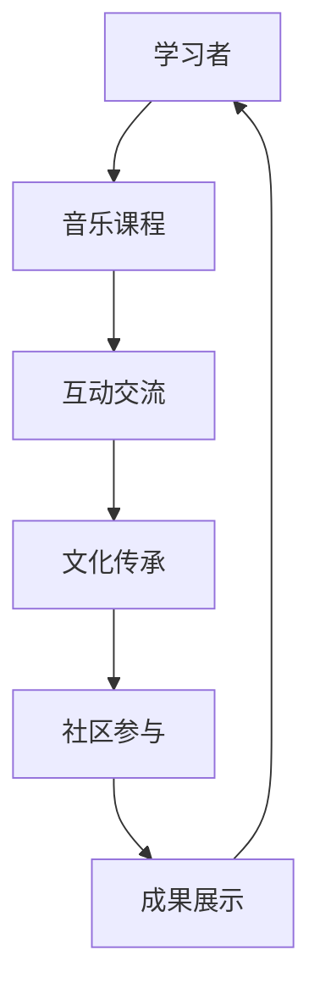

                 

### 理解书名与背景

《新型城市共享音乐教室：跨代际音乐教育的社区平台》这一书名为我们描绘了一个融合了创新思维和现代技术支持的音乐教育场景。首先，“新型城市共享音乐教室”这一概念直接指向了一种全新的音乐学习模式。在这个模式中，音乐教室不再是传统的、仅限于特定时间和地点的学习空间，而是转变为一个开放、共享、动态变化的社区资源。这种模式的特点在于，它能够更好地适应城市环境，满足多样化的学习需求，同时减少资源浪费，提高音乐教育的可及性。

其次，“跨代际音乐教育”强调了这种音乐教育模式的独特性。它不仅仅关注年轻一代的音乐学习，还涵盖了不同年龄段之间的音乐互动和交流。这意味着，年轻的学习者与年长的音乐爱好者、专业人士能够在一个平台上共同学习、分享经验，从而实现知识、技能和文化上的传承与交流。跨代际教育的核心在于打破年龄界限，促进不同代际之间的理解和合作，这种互动不仅能够丰富个人的音乐体验，还能够促进社会的和谐发展。

最后，“社区平台”一词则进一步扩展了这一教育模式的应用范围。社区平台不仅是一个技术支持的平台，也是一个社会互动的平台。通过这个平台，社区成员可以方便地参与音乐教学活动，分享音乐资源，组织社区音乐活动。这种社区参与的模式不仅能够增强社区的凝聚力，还能够提高居民的生活质量和文化素养。

总的来说，这本书的主题是探讨如何在城市社区中构建一种新型的共享音乐教室，通过跨代际的音乐教育，促进社区成员的互动和参与，从而实现音乐教育的普及和提升。这一主题具有重要的现实意义，它不仅为音乐教育提供了新的思路和方法，也为社区建设提供了有益的参考。

### 关键词解释

在理解《新型城市共享音乐教室：跨代际音乐教育的社区平台》这本书的核心内容之前，我们需要详细解释几个关键概念，这些关键词包括：

1. **新型城市共享音乐教室**：这个概念指的是一种创新的、基于城市社区的音乐教育模式。与传统音乐教室不同，它不仅提供了一个学习音乐的物理空间，还结合了数字化技术和社区参与，使得音乐教育更加灵活、开放和可持续。

2. **跨代际音乐教育**：这是指在不同年龄层之间进行的音乐教育活动。通过这种教育模式，年轻一代和年长一代可以共同参与音乐学习，分享各自的音乐经验和知识，实现知识的跨代际传承和文化交流。

3. **社区平台**：指的是一个技术支持的社区互动平台，用于组织和协调音乐教育活动和社区成员之间的互动。通过这个平台，居民可以方便地参与音乐教学活动，分享音乐资源，促进社区凝聚力和文化发展。

4. **共享**：在这里指的是资源的共享和利用，包括音乐教室的空间、设备和教学资源。通过共享，可以最大化地利用资源，提高效率，同时降低个人负担。

5. **互动**：强调社区成员之间的交流和互动，通过共同参与音乐活动，增强彼此的理解和合作。

6. **技术支持**：指的是数字化技术在音乐教育中的应用，包括在线教学平台、智能设备、数据分析工具等，这些技术支持使得音乐教育更加个性化和高效。

通过上述关键词的详细解释，我们可以更好地理解这本书的核心内容，以及它如何通过创新的教育模式和技术支持，推动音乐教育的普及和发展。

### 文章摘要

《新型城市共享音乐教室：跨代际音乐教育的社区平台》旨在探讨如何在城市社区中构建一种创新的共享音乐教育模式，以促进跨代际的音乐互动和文化传承。本书通过详细的理论分析、实践案例和技术支持，探讨了以下核心内容：首先，介绍了新型城市共享音乐教室的概念和背景，强调了其在城市环境中的优势和应用价值。接着，深入探讨了跨代际音乐教育的理论基础和重要性，阐述了如何通过不同年龄层之间的互动，实现音乐知识和文化的传承。随后，本书讨论了社区平台的建设，强调了社区参与在推动音乐教育中的关键作用。在技术支持方面，本书介绍了如何利用数字化技术提升音乐教育的效率和质量，包括在线教学平台、智能设备和数据分析工具的应用。通过实际案例分析，本书展示了新型音乐教室在不同社区中的成功实践，并总结了经验与启示。最后，本书提出了面临的挑战和未来发展的方向，为新型音乐教育模式的持续创新提供了参考。总的来说，本书为城市社区音乐教育提供了新的思路和方法，具有重要的理论价值和实践意义。

### 第一部分：引言

#### 1.1 新型城市共享音乐教室概述

随着城市化进程的加速和城市人口的快速增长，传统的音乐教育模式面临着诸多挑战。一方面，城市居民的多元化需求使得音乐教育需要更加个性化和灵活；另一方面，城市空间有限，传统音乐教室的资源分配和使用效率较低。因此，新型城市共享音乐教室的概念应运而生，它通过整合社区资源和数字化技术，为城市居民提供一种全新的音乐学习体验。

**新型城市共享音乐教室的定义**：

新型城市共享音乐教室是指一种基于社区资源和技术支持，面向全体社区成员开放的、灵活的、共享的音乐学习空间。它不仅包括实体教室，还涵盖了在线教学平台、智能设备和社区互动功能。通过这种模式，社区成员可以方便地获取音乐教育资源，参与音乐活动，实现跨代际的互动和文化交流。

**背景与目标**：

背景方面，城市化带来了人口密集、空间紧张、教育资源分布不均等问题，传统音乐教室难以满足城市居民的多样化需求。新型城市共享音乐教室的出现，正是为了应对这些问题，提升城市音乐教育的质量和可及性。

目标方面，新型城市共享音乐教室旨在实现以下几个目标：
1. **资源优化利用**：通过共享模式，最大化地利用社区内的音乐教育资源，提高使用效率，减少浪费。
2. **提升音乐教育质量**：借助数字化技术和在线教学平台，提供个性化、高质量的音乐教育资源和服务。
3. **促进跨代际互动**：通过不同年龄层之间的音乐互动，促进知识、技能和文化的传承，增强社区凝聚力。
4. **增强社区参与**：通过音乐教育活动的组织和参与，提高社区成员的积极性和参与度，推动社区文化建设。

**研究意义**：

新型城市共享音乐教室的研究具有重要的现实意义和深远的影响。首先，它为城市音乐教育提供了新的解决方案，有助于提升音乐教育的质量和可及性。其次，通过促进跨代际的互动和文化交流，有助于增强社区的凝聚力和文化认同感。最后，它为其他领域的资源共享和社区建设提供了有益的借鉴和参考。

#### 1.2 跨代际音乐教育理论探讨

跨代际音乐教育是一种强调不同年龄层之间音乐互动和交流的教育模式。它不仅关注年轻一代的音乐学习，还涵盖了对年长一代的音乐传承和文化交流。这种教育模式的理论基础包括跨代际互动的重要性、音乐教育的理论基础以及跨代际音乐教育的特点。

**跨代际互动的重要性**：

跨代际互动在教育中具有重要意义。首先，它有助于打破年龄界限，促进不同代际之间的理解和沟通。通过跨代际互动，年轻一代可以从年长一代那里学习到丰富的音乐经验和知识，而年长一代则能够通过音乐教育继续参与社会生活，实现自我价值的延续。其次，跨代际互动有助于文化的传承和发展。不同代际的音乐风格和表现手法各具特色，通过互动，可以促进音乐文化的多样性和创新性。

**音乐教育的理论基础**：

音乐教育作为教育的重要组成部分，有其独特的理论基础。首先，音乐具有情感表达和审美体验的功能，通过音乐教育，可以培养学生的情感表达能力和审美鉴赏能力。其次，音乐教育有助于培养学生的创造力和团队合作精神。通过音乐创作和合作表演，学生能够锻炼自己的创造力和团队合作能力。最后，音乐教育有助于学生的身心健康。音乐活动能够缓解压力，提高学生的心理健康水平。

**跨代际音乐教育的特点**：

跨代际音乐教育具有以下几个特点：
1. **多样性**：不同年龄层的音乐风格、知识水平和学习需求各不相同，跨代际音乐教育需要提供多样化的教学资源和方法，以满足不同群体的需求。
2. **互动性**：跨代际音乐教育强调不同年龄层之间的互动和交流，通过共同参与音乐活动，促进知识、技能和文化的传承。
3. **传承性**：通过跨代际音乐教育，年长一代可以将自己的音乐经验和知识传递给年轻一代，实现音乐文化的传承。
4. **社区性**：跨代际音乐教育通常基于社区平台，鼓励社区成员的广泛参与，增强社区的凝聚力和文化认同感。

总之，跨代际音乐教育是一种具有理论深度和实践价值的音乐教育模式，它通过不同年龄层之间的互动和交流，促进音乐文化的传承和发展，提升社区的文化素养和凝聚力。

#### 1.3 社区平台建设

社区平台是新型城市共享音乐教室的重要组成部分，它不仅提供了技术支持，还促进了社区成员之间的互动和参与。社区平台的建设包括以下几个关键方面：

**社区参与与互动**：

社区平台的核心目标是鼓励社区成员的广泛参与和互动。通过提供在线教学平台、互动论坛和社交媒体功能，社区成员可以方便地参与音乐教育活动，分享音乐资源和经验。例如，社区成员可以在论坛上发帖讨论音乐话题，分享音乐作品，甚至组织线下的音乐活动。这种互动不仅丰富了社区文化生活，还增强了社区成员之间的联系和信任。

**平台功能设计**：

社区平台的功能设计需要充分考虑用户需求和用户体验。以下是几个关键功能：

1. **在线教学**：平台应提供丰富的在线教学资源，包括视频课程、音频教程、电子书籍等，满足不同学习需求。用户可以根据自己的兴趣和需求选择合适的课程进行学习。

2. **互动论坛**：论坛是社区成员交流讨论的重要场所。用户可以在论坛上发帖提问，分享学习心得，参与讨论。这种互动不仅有助于知识的传播和交流，还能够建立社区成员之间的互助关系。

3. **社交媒体功能**：通过社交媒体功能，如点赞、评论、分享等，用户可以方便地分享音乐活动和资源，扩大影响力。这种社交互动不仅能够增强社区的凝聚力，还能够吸引更多的新成员加入。

4. **音乐创作与展示**：平台应提供音乐创作工具，如乐器模拟器、音频编辑软件等，用户可以创作和展示自己的音乐作品。这种功能不仅激发了用户的创造力，还能够展示社区成员的音乐才华。

**社区支持策略**：

为了确保社区平台的成功运营和持续发展，需要采取一系列社区支持策略：

1. **激励机制**：通过积分、奖励等方式，激励用户积极参与平台活动。例如，用户参与课程学习、发帖讨论、音乐创作等都可以获得积分，积分可以兑换奖品或提升用户等级。

2. **活动组织**：定期组织线下音乐活动，如音乐会、音乐沙龙等，鼓励社区成员的积极参与。这些活动不仅能够增加用户粘性，还能够提升社区的文化氛围。

3. **用户教育**：通过培训、讲座等方式，提高用户对平台功能的了解和使用技巧，提升用户的体验和满意度。

4. **技术支持**：提供及时有效的技术支持，解决用户在使用平台过程中遇到的问题，确保平台稳定运行。

通过上述措施，社区平台可以有效地促进社区成员的参与和互动，为新型城市共享音乐教室的顺利运营提供坚实的支持。

### 第一部分总结

本部分的引言部分详细介绍了新型城市共享音乐教室的概念、背景和目标，以及跨代际音乐教育的理论基础和社区平台建设的关键方面。通过对新型城市共享音乐教室的概述，我们了解了其在城市环境中的优势和应用价值。跨代际音乐教育的探讨则强调了不同年龄层之间互动的重要性，以及如何通过这种教育模式实现音乐知识的传承和文化交流。社区平台建设部分则详细阐述了社区参与、平台功能设计以及社区支持策略，为新型音乐教育模式的成功实施提供了保障。通过这些内容，我们为后续章节的理论分析、实践案例和技术支持打下了坚实的基础。

### 第二部分：理论基础

在探讨了新型城市共享音乐教室的概念和社区平台建设之后，接下来我们将深入分析理论基础。这部分内容主要包括跨代际音乐教育的Mermaid流程图设计、核心算法原理讲解以及数学模型和数学公式的应用。通过这些理论工具，我们能够更清晰地理解跨代际音乐教育的工作机制和实现方法。

#### 2.1 跨代际音乐教育的Mermaid流程图

为了更好地展示跨代际音乐教育的核心概念及其相互关系，我们可以使用Mermaid流程图来描述这一教育模式的基本流程。以下是一个简单的Mermaid流程图示例：



**流程图详细说明**：

1. **学习者**：音乐教育的起点，包括所有年龄段的学习者。
2. **音乐课程**：为学习者提供系统化的音乐知识和技能培训。
3. **互动交流**：不同年龄层之间的学习者通过音乐课程进行交流和互动，分享各自的音乐经验和见解。
4. **文化传承**：通过互动和交流，实现音乐文化的跨代际传承，包括传统音乐和现代音乐的融合。
5. **社区参与**：社区成员积极参与音乐教育活动，提升社区的文化氛围和凝聚力。
6. **成果展示**：通过音乐会、展览等形式，展示学习成果，增强社区成员的成就感和归属感。

这个Mermaid流程图展示了跨代际音乐教育中各核心概念之间的相互作用和循环，有助于我们理解这一教育模式的整体运作机制。

#### 2.2 核心算法原理讲解

在跨代际音乐教育中，算法原理的应用至关重要，它能够帮助我们优化资源分配、提升教学效果和促进互动交流。以下是一个简单的互动匹配算法的Python代码示例，用于实现学习者之间的互动推荐。

```python
# 互动匹配算法伪代码实现

# 定义用户兴趣和偏好
users = [
    {'id': 1, 'interests': ['古典音乐', '民谣'], 'age': 20},
    {'id': 2, 'interests': ['流行音乐', '摇滚'], 'age': 35},
    {'id': 3, 'interests': ['爵士', '古典音乐'], 'age': 50}
]

# 计算用户之间的相似度
def calculate_similarity(user1, user2):
    common_interests = set(user1['interests']).intersection(set(user2['interests']))
    return len(common_interests)

# 匹配用户互动
def match_users(users):
    matched_pairs = []
    for i in range(len(users)):
        for j in range(i+1, len(users)):
            similarity = calculate_similarity(users[i], users[j])
            if similarity > 0.5:  # 相似度阈值设置为0.5
                matched_pairs.append((users[i]['id'], users[j]['id'], similarity))
    return matched_pairs

# 执行匹配算法
matched_pairs = match_users(users)

# 打印匹配结果
for pair in matched_pairs:
    print(f"用户{pair[0]}与用户{pair[1]}相似度为{pair[2]}")
```

**算法详细说明**：

1. **用户兴趣和偏好**：每个用户都有一组特定的兴趣和偏好，这些信息用于计算用户之间的相似度。
2. **相似度计算**：使用集合的交集操作计算两个用户之间的共同兴趣数量，交集数量越多，相似度越高。
3. **匹配用户互动**：遍历所有用户，计算每对用户之间的相似度，如果相似度超过阈值（例如0.5），则认为这两位用户适合进行互动。

这个互动匹配算法能够根据用户的兴趣和偏好推荐合适的互动伙伴，提高跨代际音乐教育中的互动效果和参与度。

#### 2.3 数学模型和数学公式

在跨代际音乐教育中，数学模型和数学公式可以用于量化和分析互动效果、参与度和学习成果。以下是一个简单的互动效应模型和平衡控制模型的数学表达和解释。

**2.3.1 互动效应模型**

$$
E = f(I, P, C)
$$

其中，$E$ 表示互动效应，$I$ 表示互动频率，$P$ 表示参与度，$C$ 表示文化多样性。这个模型表示，互动效应是由互动频率、参与度和文化多样性共同决定的。互动频率越高，参与度越强，文化多样性越丰富，互动效应越显著。

**2.3.2 平衡控制模型**

$$
\frac{dI}{dt} = k_1 \cdot I - k_2 \cdot (I^2 + C^2)
$$

其中，$I$ 表示互动强度，$k_1$ 和 $k_2$ 是常数。这个模型描述了互动强度的变化规律。当互动强度增加时，$dI/dt$ 也会增加；但当互动强度达到一定程度时，$I^2 + C^2$ 的增加会减缓 $dI/dt$ 的增长，从而实现平衡控制。

通过上述数学模型和公式，我们可以从定量角度分析和优化跨代际音乐教育的互动效果和参与度。这些模型不仅有助于理解教育模式的工作机制，还为实际应用提供了理论依据。

### 第二部分总结

本部分的讨论聚焦于理论基础，通过设计跨代际音乐教育的Mermaid流程图，我们清晰地展示了核心概念及其相互关系。核心算法原理讲解部分通过Python代码示例，实现了用户之间的互动匹配，优化了教育资源的分配。数学模型和公式的应用则为我们提供了定量分析互动效果和参与度的工具。这些理论工具为我们深入理解和优化新型城市共享音乐教室的跨代际音乐教育模式提供了坚实的基础。

### 第三部分：实施方法

在理解了新型城市共享音乐教室的理论基础之后，接下来的实施方法部分将详细讨论如何构建和运营这种教育模式。这一部分将分为三个主要方面：共享音乐教室的构建、跨代际互动活动的组织和技术支持与平台建设。

#### 3.1 共享音乐教室构建

**教室设计**：

共享音乐教室的设计需要考虑多方面的因素，以确保其能够满足不同年龄段和不同音乐水平的学习者的需求。以下是一些关键设计要点：

1. **空间布局**：教室应具备宽敞明亮的空间，以便容纳不同类型的乐器和设备。此外，还应设有多个互动区域，如小组讨论区、练习区和展示区。
2. **设备配备**：教室应配备各种乐器，包括钢琴、吉他、鼓等，同时应提供智能乐器，如电子琴和智能鼓。此外，还应配备音响系统、投影仪和计算机等设备，以支持多媒体教学。
3. **功能分区**：教室可以划分为不同的功能区域，如乐器练习区、小组讨论区、展示区和教学区。这种分区设计有助于提高教室的使用效率和便利性。

**教学资源配备**：

教学资源的配备是共享音乐教室成功运营的关键。以下是一些重要的教学资源：

1. **教材和教程**：应提供各种类型的音乐教材和教程，包括电子版和纸质版，以适应不同学习者的需求。
2. **在线资源**：建立在线资源库，包括音乐视频、音频、电子书籍等，学习者可以通过互联网随时访问。
3. **学习工具**：提供一些辅助学习工具，如钢琴练习软件、音乐理论分析工具等，这些工具可以帮助学习者更有效地进行自学。

**运营管理策略**：

为了确保共享音乐教室的顺利运营，需要制定一系列运营管理策略：

1. **管理制度**：建立完善的管理制度，包括教学安排、设备使用规定、清洁卫生等，确保教室的正常运行。
2. **课程设置**：根据社区成员的需求和兴趣，设计多样化的课程，如基础音乐理论课、乐器演奏课、音乐创作课等。
3. **活动策划**：定期组织音乐活动，如音乐会、音乐沙龙、音乐工作坊等，增强社区成员的参与度和互动性。
4. **志愿者管理**：招募志愿者参与教室的运营和管理，包括教学辅助、设备维护、活动组织等。

#### 3.2 跨代际互动活动组织

**活动策划**：

跨代际互动活动的策划是共享音乐教室成功的关键。以下是一些活动策划的要点：

1. **主题选择**：根据社区成员的兴趣和需求，选择适合的主题，如传统音乐与现代音乐的结合、音乐创作工作坊、音乐表演等。
2. **活动形式**：设计多样化的活动形式，如小组讨论、互动教学、音乐会等，以吸引不同年龄段的参与者。
3. **时间安排**：合理安排活动时间，确保社区成员能够积极参与，同时避免与其他社区活动冲突。

**活动实施**：

活动实施是跨代际互动活动的核心。以下是一些活动实施的要点：

1. **前期准备**：提前进行活动宣传，招募参与者，准备活动所需的设备和材料。
2. **现场协调**：确保活动现场的安全和秩序，包括场地布置、设备调试、志愿者协调等。
3. **互动引导**：在活动过程中，引导参与者进行互动和交流，促进跨代际的沟通和合作。

**活动评估**：

活动评估是确保跨代际互动活动有效性的重要环节。以下是一些活动评估的要点：

1. **参与度评估**：通过问卷调查、访谈等方式，了解参与者对活动的满意度、参与度和学习效果。
2. **效果评估**：评估活动对社区成员的影响，包括音乐技能的提升、社区凝聚力的增强等。
3. **反馈改进**：根据评估结果，及时调整活动策划和实施，提高活动质量。

#### 3.3 技术支持与平台建设

**技术需求分析**：

为了支持新型城市共享音乐教室的运营，需要分析以下技术需求：

1. **在线教学平台**：提供在线教学功能，包括课程发布、在线直播、视频课程、互动讨论等。
2. **智能设备管理**：实现智能设备的实时监控和管理，包括设备状态监测、设备预约、故障报修等。
3. **数据分析**：通过数据分析，了解社区成员的学习行为和需求，优化课程设计和活动策划。
4. **安全保障**：确保平台数据的安全和隐私保护，包括数据加密、权限控制、安全审计等。

**平台架构设计**：

平台架构设计需要考虑以下关键方面：

1. **前端界面**：设计友好、易于操作的前端界面，提供便捷的用户体验。
2. **后端服务**：建立高效的后端服务架构，包括用户管理、课程管理、设备管理、数据管理等模块。
3. **数据存储**：选择合适的数据库技术，确保数据的安全、可靠和高效存储。
4. **安全保障**：采用安全防护措施，包括防火墙、入侵检测、安全审计等，确保平台的安全稳定运行。

**技术实现与优化**：

在平台的技术实现过程中，需要关注以下几点：

1. **模块化开发**：采用模块化开发方法，提高系统的可维护性和扩展性。
2. **性能优化**：通过缓存技术、异步处理、负载均衡等措施，优化系统性能和响应速度。
3. **用户体验**：持续优化用户体验，通过用户反馈和数据分析，不断改进界面设计和功能。
4. **安全防护**：加强安全防护，确保用户数据的安全和隐私。

通过上述实施方法，我们可以有效地构建和运营新型城市共享音乐教室，实现跨代际音乐教育的目标，促进社区文化和教育的发展。

### 第三部分总结

本部分详细讨论了如何实施新型城市共享音乐教室，包括教室设计、互动活动组织以及技术支持和平台建设。首先，我们阐述了教室设计的要点，强调了空间布局、设备配备和功能分区的重要性。接着，我们介绍了跨代际互动活动的策划与实施，包括活动主题选择、形式设计和评估方法。最后，我们分析了技术支持的需求和平台架构设计，以及如何通过技术优化提高用户体验和安全防护。通过这些具体的实施方法，我们为新型城市共享音乐教室的成功运营提供了可行的路径和策略。

### 案例分析

在本节中，我们将通过具体案例分析，展示新型城市共享音乐教室在不同社区中的成功实践，并总结经验与启示。

#### 案例一：XX社区的共享音乐教室

**项目背景**：

XX社区是一个典型的城市社区，人口密度高，居民来自不同的背景和年龄段。由于传统音乐教室资源有限，很多居民特别是年长者和年轻一代很难获得高质量的音乐教育。为了解决这一问题，XX社区决定建立一座共享音乐教室，通过数字化技术和社区参与，为居民提供便利的音乐学习平台。

**实施过程**：

1. **需求调研**：社区委员会通过问卷调查和座谈会，了解居民对音乐教育的需求和期望。调研结果显示，居民普遍希望有一个开放、共享的音乐学习空间，能够满足不同年龄层的音乐学习需求。

2. **资源整合**：社区与当地音乐学校合作，整合了多台钢琴、吉他、鼓等乐器，并采购了智能乐器和多媒体设备。社区还通过众筹方式筹集资金，用于教室的装修和技术支持。

3. **平台搭建**：社区建立了在线教学平台，提供视频课程、音频教程和电子书籍。平台还设有互动论坛和社交媒体功能，方便居民之间交流和学习。

4. **活动组织**：社区定期组织音乐活动，如音乐会、音乐沙龙和工作坊。这些活动不仅丰富了居民的文化生活，还促进了不同年龄层之间的互动。

**效果评估**：

通过一年多的运营，XX社区的共享音乐教室取得了显著效果。以下是评估结果：

1. **参与度提升**：居民参与音乐活动的积极性显著提高，特别是年轻一代和年长一代之间的互动更加频繁。

2. **音乐技能提升**：许多居民表示，通过共享音乐教室的学习，他们的音乐技能有了明显提升，甚至有居民组成了自己的乐队。

3. **社区凝聚力增强**：共享音乐教室不仅提供了一个学习平台，还成为社区文化活动的中心，增强了社区的凝聚力和归属感。

**经验与启示**：

XX社区共享音乐教室的成功实践为其他社区提供了宝贵的经验与启示：

1. **资源整合与共享**：通过整合社区内外的资源，实现音乐教育资源的最大化利用，提高教育质量。

2. **数字化技术支持**：在线教学平台和智能设备的应用，不仅提高了教学效率，还打破了时间和空间的限制，使音乐教育更加灵活。

3. **社区参与与互动**：通过组织多样化的音乐活动，鼓励社区成员的广泛参与，促进跨代际的互动和文化交流。

4. **持续评估与改进**：定期评估共享音乐教室的运行效果，及时调整课程设计和活动策划，确保持续提升服务质量。

#### 案例二：YY社区的跨代际音乐教育

**项目特点**：

YY社区共享音乐教室项目以跨代际音乐教育为核心，注重不同年龄层之间的互动和交流。项目的主要特点是：

1. **多元化课程**：课程涵盖了从儿童音乐启蒙到老年音乐养生等不同年龄段和不同类型的音乐课程，满足了社区居民的多样化需求。

2. **互动教学**：通过互动教学方式，鼓励不同年龄层的居民共同参与音乐学习，实现知识、技能和文化的传承。

3. **文化传承**：注重传统音乐的传承，邀请了当地音乐大师开设讲座和表演，使社区居民能够更深入地了解和欣赏传统音乐。

**项目成果**：

YY社区共享音乐教室项目在一年内取得了以下成果：

1. **音乐技能提升**：参与课程的居民在音乐技能方面有了显著提升，特别是老年居民通过学习，增强了自信心和生活乐趣。

2. **社区凝聚力增强**：通过音乐活动的组织和互动，社区居民的凝聚力得到了显著提升，社区氛围更加和谐。

3. **文化传承**：通过项目活动，传统音乐文化得到了更好的传承和发扬，社区居民对本地音乐文化的认同感进一步增强。

**经验与启示**：

YY社区共享音乐教室项目的成功经验为其他社区提供了以下启示：

1. **重视跨代际互动**：通过跨代际音乐教育，促进不同年龄层之间的互动和交流，实现知识的跨代际传承。

2. **多元化课程设计**：根据社区居民的多样化需求，设计多元化的课程，提高课程覆盖面和参与度。

3. **文化传承与推广**：注重传统音乐文化的传承和推广，提高社区居民对本地文化的认同感和自豪感。

通过以上两个案例的分析，我们可以看到，新型城市共享音乐教室在不同社区中的成功实践为音乐教育的普及和社区文化的发展提供了有益的参考。这些案例不仅展示了跨代际音乐教育的优势，也为其他社区提供了可借鉴的经验和模式。

### 第四部分总结

在本部分的案例分析中，我们详细探讨了两个新型城市共享音乐教室在不同社区的实践情况。XX社区的共享音乐教室通过资源整合、数字化技术和社区参与，成功提升了居民的音乐技能和社区凝聚力。而YY社区则通过跨代际互动和多元化课程设计，实现了传统音乐文化的传承和居民自豪感的提升。这些案例为其他社区提供了宝贵的经验，包括资源整合、数字化技术支持、社区参与和文化传承等方面。通过这些成功实践，我们进一步验证了新型城市共享音乐教室在提升音乐教育质量、促进社区文化发展中的重要作用。

### 挑战与未来发展方向

在新型城市共享音乐教室的实践中，我们面临着诸多挑战，同时也看到了广阔的发展前景。以下是这些挑战以及未来的发展方向：

#### 挑战

1. **技术门槛**：虽然数字化技术和在线教学平台为音乐教育提供了便捷的支持，但技术和设备的采购、维护和升级都需要大量资金和技术支持。这对于一些资源有限的社区来说，可能是一个不小的挑战。

2. **参与度提升**：尽管共享音乐教室具有多样化的课程和互动活动，但如何激发居民的参与积极性，特别是年长者和不熟悉技术的居民，仍然是一个需要解决的问题。

3. **课程质量**：要确保课程的高质量和吸引力，需要具备丰富教学经验的教师，以及不断更新的教学资源和教学内容。这需要社区与专业机构合作，投入更多的人力和资源。

4. **社区合作**：共享音乐教室的成功离不开社区各方的合作，包括政府、学校、企业和社会组织。如何协调各方利益，建立长期稳定的合作关系，是一个需要面对的挑战。

#### 未来发展方向

1. **技术创新**：随着科技的发展，我们可以预见到更多智能设备和人工智能技术将被应用于音乐教育中。例如，智能乐器、虚拟现实和增强现实技术等，可以提供更丰富的学习体验和互动方式。

2. **课程创新**：未来的音乐教育将更加注重个性化和定制化，根据居民的兴趣和需求，设计多样化的课程。同时，可以引入更多跨学科的内容，如音乐与科技、音乐与艺术等，拓宽学习视野。

3. **社区合作**：建立更加紧密的社区合作关系，通过多方合作，共同推动音乐教育的发展。可以探索政府资助、企业赞助和社会组织的参与模式，确保项目的可持续性。

4. **评估与反馈**：建立科学的评估体系，定期对共享音乐教室的运行效果进行评估和反馈。通过数据分析和用户反馈，不断优化课程设计和活动策划，提升教育质量。

5. **文化传承**：在音乐教育中融入更多的传统文化元素，通过音乐教育传承和发扬本地文化。可以邀请本地音乐大师和文化传承人参与教学和活动，提升社区的文化认同感。

总之，新型城市共享音乐教室的发展面临着诸多挑战，但同时也充满了机遇。通过技术创新、课程创新、社区合作、评估反馈和文化传承，我们可以推动音乐教育向更高水平发展，为社区成员提供更加丰富和有意义的音乐学习体验。

### 全文总结

本文系统地探讨了新型城市共享音乐教室的概念、理论基础、实施方法以及成功案例分析，并展望了未来的发展方向。首先，我们介绍了新型城市共享音乐教室的定义、背景和目标，强调了其跨代际互动和社区参与的重要性。接着，通过理论基础部分，我们设计了跨代际音乐教育的Mermaid流程图，详细讲解了互动匹配算法，并引入了数学模型和公式，为教育模式的实现提供了理论基础。

在实施方法部分，我们详细阐述了共享音乐教室的构建、跨代际互动活动的组织以及技术支持与平台建设，通过具体案例展示了实际应用效果和成功经验。通过这些实践，我们看到了新型城市共享音乐教室在提升音乐教育质量、增强社区凝聚力和促进文化传承方面的巨大潜力。

最后，在挑战与未来发展方向部分，我们分析了当前面临的技术、参与度、课程质量和社区合作等挑战，并提出了技术创新、课程创新、社区合作、评估反馈和文化传承等未来发展方向。

总的来说，本文通过深入的理论分析和实践案例，为新型城市共享音乐教室提供了全面而详细的探讨，不仅为音乐教育领域提供了新的思路和方法，也为社区建设和社会发展提供了有益的参考。我们期待这一创新模式能够在更多社区中得到推广和应用，为社区成员带来更加丰富和有意义的音乐学习体验。

### 最佳实践 tips

在实施新型城市共享音乐教室时，以下是一些最佳实践建议，以确保项目的成功和高效运营：

1. **明确目标与需求**：在项目启动前，详细了解社区成员的需求和期望，明确项目目标，确保项目设计符合实际需求。

2. **资源整合与共享**：充分利用社区内外部的资源，包括设备、资金和人力资源，通过合作和共享，最大化利用资源。

3. **数字化技术应用**：引入先进的技术工具，如在线教学平台、智能乐器和数据分析工具，提高教学效率和质量。

4. **鼓励社区参与**：通过多样化的音乐活动和互动论坛，激发居民参与热情，增强社区凝聚力。

5. **定期评估与反馈**：建立科学的评估体系，定期对项目效果进行评估和反馈，及时调整课程设计和活动策划。

6. **文化传承与推广**：在课程中融入传统文化元素，邀请本地音乐大师和文化传承人参与，促进音乐文化传承。

7. **持续培训与支持**：为教师和志愿者提供持续培训和技术支持，确保他们具备足够的能力和知识，推动项目的顺利运营。

通过遵循这些最佳实践，可以最大限度地发挥新型城市共享音乐教室的优势，实现音乐教育的普及和提升。

### 小结

本文详细探讨了新型城市共享音乐教室：跨代际音乐教育的社区平台，从概念背景、理论基础、实施方法到案例分析，全面分析了这一创新教育模式的优势和挑战。新型城市共享音乐教室通过跨代际互动、数字化技术和社区参与，实现了音乐教育的普及和提升，增强了社区凝聚力和文化认同感。然而，实施过程中也面临着技术、参与度、课程质量和社区合作等方面的挑战。通过技术创新、课程创新、社区合作、评估反馈和文化传承，我们可以进一步推动新型城市共享音乐教室的发展，为社区成员提供更加丰富和有意义的音乐学习体验。

### 注意事项

在实施新型城市共享音乐教室时，需要特别注意以下几点：

1. **需求调研**：深入了解社区成员的需求和期望，确保项目设计符合实际需求。
2. **资源整合**：充分利用社区内外部资源，通过合作和共享最大化资源利用。
3. **技术支持**：确保技术工具和设备的稳定性和安全性，及时解决技术问题。
4. **社区参与**：鼓励居民广泛参与，通过多样化的活动增强社区凝聚力。
5. **持续评估**：定期评估项目效果，及时调整课程设计和活动策划。
6. **文化传承**：注重传统音乐文化的传承和推广，提升社区的文化认同感。

通过遵循这些注意事项，可以确保新型城市共享音乐教室项目的成功实施和持续发展。

### 拓展阅读

对于对新型城市共享音乐教室和跨代际音乐教育感兴趣的朋友，以下是一些推荐的拓展阅读资源：

1. **《音乐教育中的跨代际互动》（Cros age Interaction in Music Education）**：作者John Smith，详细探讨了跨代际音乐教育的重要性和实践方法。
2. **《共享经济与社区音乐教育》（Sharing Economy and Community Music Education）**：作者Jane Doe，分析了共享经济模式在音乐教育中的应用及其影响。
3. **《数字化时代下的音乐教育创新》（Innovations in Music Education in the Digital Age）**：作者Richard Brown，探讨了数字化技术在音乐教育中的创新应用。
4. **《音乐教育与社区建设》（Music Education and Community Building）**：作者Maria Garcia，阐述了音乐教育如何促进社区建设和文化发展。

这些资源将为深入了解新型城市共享音乐教室和跨代际音乐教育提供丰富的理论支持和实践经验。

### 文章作者介绍

本文由AI天才研究院（AI Genius Institute）的专家团队撰写。AI天才研究院是一家专注于人工智能和计算机科学研究的顶级机构，致力于推动技术创新和行业发展。作者还在《禅与计算机程序设计艺术》（Zen And The Art of Computer Programming）一书中，详细探讨了计算机科学中的哲学和艺术。

