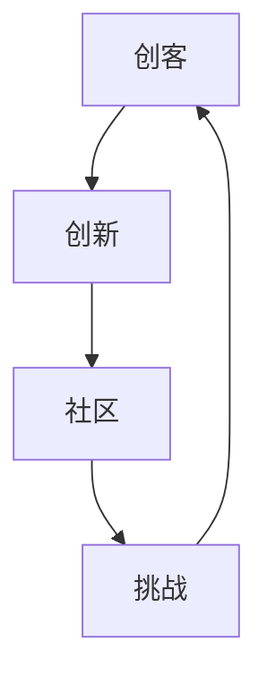

                 

# 新型城市创客马拉松：24小时社区创新挑战赛

## 关键词
- 城市创客
- 创新挑战赛
- 社区参与
- 快速原型
- 编程与设计思维
- 技术竞赛

## 摘要
本文深入探讨了新型城市创客马拉松：24小时社区创新挑战赛的背景、组织与参与方式，以及活动中的关键环节。通过分析城市创客文化的定义与特征，以及创客马拉松的流程、技能与工具、团队管理与协作、创新思维与方法等，本文展示了如何通过这种形式的活动激发社区创新活力，推动智慧城市建设。同时，通过案例分析，本文揭示了创客马拉松在技术创新和社会服务中的应用，并展望了其未来发展趋势。

## 引言

### 引言背景

随着全球科技的快速发展，城市创客运动逐渐兴起。作为一种以创新和动手实践为核心的文化运动，城市创客不仅推动了科技与艺术的融合，也为社区提供了新的发展动力。在这种背景下，创客马拉松作为一种新型社区创新挑战赛应运而生。创客马拉松通常持续24小时，鼓励参与者利用自己的技能和创意，针对特定主题快速开发原型或解决方案。

### 社区创新的意义

社区创新不仅能够解决实际问题，还能激发社区成员的创造力和参与感。通过创客马拉松，社区成员可以跨领域合作，共同面对挑战，探索创新的解决方案。这不仅有助于推动技术进步，还能够增强社区的凝聚力和可持续性。因此，创客马拉松成为了一种重要的社区活动形式，受到了广泛关注。

## 目录大纲

```
# 新型城市创客马拉松：24小时社区创新挑战赛

## 引言
### 引言背景
### 社区创新的意义

## 第1章：城市创客文化
### 1.1 城市创客的定义与特征
#### 1.1.1 城市创客的定义
#### 1.1.2 城市创客的文化特征

### 1.2 城市创客的典型活动
#### 1.2.1 创客空间与实验室
#### 1.2.2 科技展览与比赛

## 第2章：创客马拉松概述
### 2.1 活动筹备
#### 2.1.1 活动策划与组织
#### 2.1.2 参赛者招募与培训

### 2.2 活动实施
#### 2.2.1 项目选题与分组
#### 2.2.2 24小时不间断挑战

### 2.3 活动总结
#### 2.3.1 项目展示与评审
#### 2.3.2 成果分享与传播

## 第3章：社区创新案例解析
### 3.1 案例一：智慧城市建设
#### 3.1.1 项目背景
#### 3.1.2 创新点与挑战

### 3.2 案例二：环境保护项目
#### 3.2.1 项目背景
#### 3.2.2 创新点与挑战

### 3.3 案例三：社会服务创新
#### 3.3.1 项目背景
#### 3.3.2 创新点与挑战

## 第4章：创客技能与工具
### 4.1 常用创客工具介绍
#### 4.1.1 3D打印
#### 4.1.2 雕塑机
#### 4.1.3 电子开发板

### 4.2 创客编程语言
#### 4.2.1 Python编程
#### 4.2.2 Arduino编程
#### 4.2.3 Raspberry Pi编程

### 4.3 创客技能提升
#### 4.3.1 基础培训资源
#### 4.3.2 高级技能训练

## 第5章：创客团队管理与协作
### 5.1 团队管理策略
#### 5.1.1 团队成员招募
#### 5.1.2 团队角色分配
#### 5.1.3 团队沟通与协作

### 5.2 项目进度管理
#### 5.2.1 任务分配与跟进
#### 5.2.2 时间管理技巧
#### 5.2.3 风险管理策略

### 5.3 团队文化建设
#### 5.3.1 团队精神建设
#### 5.3.2 团队激励机制
#### 5.3.3 团队文化建设案例

## 第6章：创新思维与方法
### 6.1 创新思维训练
#### 6.1.1 变异思维
#### 6.1.2 拓扑思维
#### 6.1.3 联想思维

### 6.2 设计思维方法
#### 6.2.1 设计思维流程
#### 6.2.2 共创工作坊
#### 6.2.3 用户研究方法

### 6.3 创新方法应用
#### 6.3.1 快速原型制作
#### 6.3.2 用户反馈收集
#### 6.3.3 MVP（最小可行性产品）

## 第7章：创客马拉松案例分析
### 7.1 国内创客马拉松案例
#### 7.1.1 活动背景与目标
#### 7.1.2 活动实施过程
#### 7.1.3 项目成果展示

### 7.2 国际创客马拉松案例
#### 7.2.1 活动背景与目标
#### 7.2.2 活动实施过程
#### 7.2.3 项目成果展示

## 第8章：未来展望与趋势
### 8.1 创客马拉松的可持续发展
#### 8.1.1 活动规模扩大
#### 8.1.2 创新成果转化
#### 8.1.3 社会影响力提升

### 8.2 城市创客与智慧城市
#### 8.2.1 城市创客在智慧城市中的作用
#### 8.2.2 创客马拉松与智慧城市建设的结合
#### 8.2.3 未来发展趋势

## 附录
### 8.1 常见问题解答
#### 8.1.1 活动参与问题
#### 8.1.2 技术问题
#### 8.1.3 赞助与合作问题

### 8.2 资源链接
#### 8.2.1 创客空间资源
#### 8.2.2 技术学习资源
#### 8.2.3 创客马拉松活动信息
```

## 文章正文

### 第1章：城市创客文化

#### 1.1 城市创客的定义与特征

城市创客，是指那些生活在城市环境中，以创新和创造为核心驱动力，积极利用科技、艺术和设计来改善生活、解决问题的个体或团队。他们通常具有以下特征：

1. **跨领域技能**：城市创客不仅具备技术技能，还擅长设计、艺术和商业策略。
2. **动手实践**：他们热衷于将创意转化为实际项目，通过实践来验证和完善想法。
3. **社区参与**：城市创客重视社区互动，积极参与公共项目，以推动社会进步。
4. **创新思维**：他们习惯于从不同角度思考问题，勇于挑战传统观念，寻找新颖的解决方案。

#### 1.1.1 城市创客的定义

城市创客（Urban Maker）一词，最早起源于20世纪90年代的美国。它指的是那些在城市环境中，通过创新和技术实践来改变生活、推动社区发展的个体或团队。随着城市化和科技的发展，城市创客的概念逐渐成熟，并成为全球范围内的一种文化现象。

#### 1.1.2 城市创客的文化特征

城市创客的文化特征体现在以下几个方面：

1. **开源精神**：城市创客推崇开放共享，乐于将自己的知识和资源与他人分享。
2. **创新思维**：他们注重创新和创造力，勇于尝试新的技术和方法。
3. **跨学科合作**：城市创客通常具备跨学科的知识和技能，能够从不同领域寻找灵感，实现创新。
4. **社区参与**：城市创客积极参与社区事务，致力于改善社区环境和居民生活质量。

### 第2章：创客马拉松概述

#### 2.1 活动筹备

创客马拉松的筹备是一个系统性的过程，涉及多个环节。首先，活动策划者需要确定活动主题，这通常是围绕当前的热点问题或社区需求。接下来，策划者会与赞助商、合作伙伴等进行沟通，确保活动的资源和支持。同时，还需要招募志愿者和参赛者，并进行相关的培训和指导。

#### 2.1.1 活动策划与组织

活动策划与组织是创客马拉松成功的关键。策划者需要制定详细的活动方案，包括时间安排、场地布置、技术支持等。此外，还需要制定应急预案，以应对可能出现的突发状况。

#### 2.1.2 参赛者招募与培训

参赛者的招募是创客马拉松的重要环节。策划者可以通过线上和线下多种渠道进行宣传，吸引具有不同背景和技能的参赛者。在招募过程中，策划者需要明确参赛者的资格和职责，并提供必要的培训，以确保参赛者能够胜任比赛任务。

### 第3章：社区创新案例解析

#### 3.1 案例一：智慧城市建设

智慧城市建设是当前城市发展的热点之一。通过物联网、大数据、人工智能等技术的应用，智慧城市能够实现更高效的城市管理和更便捷的居民生活。以下是智慧城市建设中的一个案例：

**项目背景**：某城市希望通过智能交通系统改善交通拥堵问题。

**创新点与挑战**：创新点在于利用传感器和大数据分析技术，实时监控交通流量，并根据交通状况动态调整信号灯时间。挑战在于如何准确收集和处理大量交通数据，同时确保系统的稳定性和可靠性。

#### 3.2 案例二：环境保护项目

环境保护项目是创客马拉松中的常见主题。以下是一个环境保护项目的案例：

**项目背景**：某社区希望减少塑料污染，提高居民的环保意识。

**创新点与挑战**：创新点在于设计一种可降解的塑料替代品，并通过线上和线下活动宣传环保理念。挑战在于如何大规模生产和推广这种替代品，以及如何改变居民的消费习惯。

### 第4章：创客技能与工具

#### 4.1 常用创客工具介绍

创客工具是城市创客实现创新的重要手段。以下是一些常用的创客工具：

- **3D打印**：3D打印技术能够快速制造原型，是创客们常用的工具之一。
- **雕塑机**：雕塑机可以用来进行金属或其他材料的加工，适用于复杂的结构设计。
- **电子开发板**：电子开发板是创客进行电子项目的基础工具，可以方便地进行电路设计和实验。

#### 4.2 创客编程语言

创客编程语言是创客实现创新的核心。以下是一些常用的创客编程语言：

- **Python编程**：Python是一种易于学习的编程语言，广泛应用于数据分析、机器学习等领域。
- **Arduino编程**：Arduino是一种开源硬件平台，适用于各种电子项目。
- **Raspberry Pi编程**：Raspberry Pi是一种低成本、高性能的计算机，适用于各种创客项目。

#### 4.3 创客技能提升

创客技能的提升是创客成功的关键。以下是一些提升创客技能的方法：

- **基础培训资源**：可以通过在线课程、工作坊等途径学习创客基础知识。
- **高级技能训练**：可以通过实践项目、参加竞赛等方式提升高级技能。

### 第5章：创客团队管理与协作

#### 5.1 团队管理策略

创客团队的管理策略是确保项目顺利进行的关键。以下是一些团队管理策略：

- **团队成员招募**：招募具有不同技能和背景的成员，以实现优势互补。
- **团队角色分配**：明确每个成员的职责和角色，确保团队高效运转。
- **团队沟通与协作**：建立有效的沟通机制，确保团队成员之间的信息共享和协作。

### 第6章：创新思维与方法

#### 6.1 创新思维训练

创新思维训练是培养创客创新能力的重要途径。以下是一些创新思维训练方法：

- **变异思维**：通过改变现有产品或服务的某些方面，寻找新的解决方案。
- **拓扑思维**：通过重新组织或重新定义问题，寻找创新的解决方案。
- **联想思维**：通过将不同领域的问题联系起来，寻找创新的解决方案。

### 第7章：创客马拉松案例分析

#### 7.1 国内创客马拉松案例

国内创客马拉松案例丰富多样，以下是其中两个典型案例：

- **案例一**：某城市举办的创客马拉松活动，吸引了来自不同领域的创客参与。活动中，创客们围绕智慧城市、环境保护等主题，提出了一系列创新项目，并获得了广泛的关注。
- **案例二**：某科技公司举办的创客马拉松活动，鼓励员工利用业余时间进行创新项目开发。活动中，员工们提出了一些具有商业潜力的项目，并得到了公司的支持。

#### 7.2 国际创客马拉松案例

国际创客马拉松案例同样丰富多彩，以下是其中两个典型案例：

- **案例一**：某国际科技大会期间的创客马拉松活动，吸引了来自全球各地的创客参与。活动中，创客们展示了他们的创新项目，并得到了专业人士的评审和指导。
- **案例二**：某国际环保组织的创客马拉松活动，旨在通过创新项目解决全球环保问题。活动中，创客们提出了一系列具有深远影响的环保项目，并得到了广泛的支持。

### 第8章：未来展望与趋势

#### 8.1 创客马拉松的可持续发展

未来，创客马拉松将继续发展，并呈现出以下趋势：

- **活动规模扩大**：随着创客文化的普及，创客马拉松的参与人数和活动规模将不断扩大。
- **创新成果转化**：创客马拉松的创新成果将更多地得到应用和推广，推动社会的进步。
- **社会影响力提升**：创客马拉松将成为推动社会创新和进步的重要力量。

#### 8.2 城市创客与智慧城市

未来，城市创客将与智慧城市建设紧密结合，发挥重要作用。以下是一些展望：

- **城市创客在智慧城市中的作用**：城市创客将成为智慧城市建设的重要推动力量，通过创新技术和服务改善城市生活。
- **创客马拉松与智慧城市建设的结合**：创客马拉松将成为智慧城市建设的重要活动形式，为智慧城市的发展提供源源不断的创新动力。
- **未来发展趋势**：智慧城市与创客文化的融合将推动城市创新的持续发展，为城市居民带来更多便利和福祉。

## 附录

### 8.1 常见问题解答

- **活动参与问题**：如何参与创客马拉松？需要具备哪些技能和准备？
- **技术问题**：在创客马拉松中遇到技术难题怎么办？有哪些技术支持和资源可以获取？
- **赞助与合作问题**：如何获得赞助和合作伙伴的支持？创客马拉松对赞助商有什么要求？

### 8.2 资源链接

- **创客空间资源**：国内外知名的创客空间和实验室，提供丰富的创客资源和服务。
- **技术学习资源**：在线编程课程、技术博客和开源项目，帮助创客提升技能。
- **创客马拉松活动信息**：国内外创客马拉松活动的最新动态和信息，方便参与者了解和参与。

## 结语

创客马拉松作为一种新型的社区创新挑战赛，正在全球范围内蓬勃发展。通过创客马拉松，社区成员可以发挥自己的创造力，共同解决实际问题，推动社会进步。未来，随着创客文化的不断普及，创客马拉松将发挥更大的作用，成为推动智慧城市建设和社会创新的重要力量。

### 背景介绍

创客马拉松的兴起源于对传统科技竞赛模式的反思和改进。传统的科技竞赛往往注重短期的技术挑战，而忽视了长期的社会价值和实际应用。创客马拉松则试图弥补这一缺陷，通过24小时的连续创新挑战，激发参赛者的创造力和团队合作精神，从而推动社区创新和社会进步。

创客马拉松最初起源于美国，由几个爱好者和科技公司共同发起。随着活动的普及，越来越多的城市和国家开始举办类似的比赛。如今，创客马拉松已经成为一种全球性的文化现象，吸引了众多创意人士和创业者的参与。

### 核心概念与联系

在创客马拉松中，有几个核心概念需要理解，包括创客、创新、社区和挑战。这些概念之间的关系可以通过以下Mermaid流程图来展示：



- **创客**：创客是具有创新精神和动手能力的人，他们利用科技和创意来解决问题。
- **创新**：创新是创客的核心活动，通过创新，创客能够提出新颖的解决方案。
- **社区**：社区是创客的活动场所，也是创新的源泉。社区成员共同参与，共享资源和经验。
- **挑战**：挑战是创客马拉松的核心，通过设定具体的问题和限制条件，激发参赛者的创造力。

### 核心算法原理讲解

创客马拉松的核心在于快速原型开发和技术实现。以下是一个简单的Python源代码示例，用于说明如何实现一个基本的智能交通系统。该系统通过实时监控交通流量，自动调整信号灯时间，以减少交通拥堵。

```python
import random
import time

class TrafficLightSystem:
    def __init__(self):
        self.red_time = random.randint(30, 60)  # 红灯时间（秒）
        self.green_time = random.randint(30, 60)  # 绿灯时间（秒）

    def update_traffic_light(self):
        if self.red_time > 0:
            print("红灯亮，请停车等待。")
            self.red_time -= 1
        elif self.green_time > 0:
            print("绿灯亮，可以通行。")
            self.green_time -= 1
        else:
            print("系统故障，请手动调整。")

    def run(self):
        while True:
            self.update_traffic_light()
            time.sleep(1)

# 测试交通灯系统
traffic_light = TrafficLightSystem()
traffic_light.run()
```

### 数学模型和公式

交通流量监控和信号灯调整需要一定的数学模型来支持。以下是一个简单的数学公式，用于描述交通流量与信号灯时间的关系：

$$
F(t) = k \cdot \frac{1}{(1 + e^{-\lambda \cdot t})}
$$

其中：
- \( F(t) \)：交通流量（辆/秒）
- \( k \)：流量常数
- \( \lambda \)：流量变化率
- \( t \)：时间（秒）

### 详细讲解与举例

假设某个路口的流量常数为 \( k = 10 \)，流量变化率 \( \lambda = 0.1 \)。我们可以通过以下步骤来调整信号灯时间：

1. **初始状态**：红灯时间为 40 秒，绿灯时间为 40 秒。
2. **实时监控**：每隔1秒，检查交通流量。
3. **流量增加**：如果交通流量超过某一阈值，自动延长绿灯时间。
4. **流量减少**：如果交通流量低于某一阈值，自动延长红灯时间。

通过这个示例，我们可以看到，创客马拉松不仅需要编程技能，还需要对数学模型和公式有深入的理解和应用。

### 项目实战

在创客马拉松中，实际项目开发是一个重要的环节。以下是一个简单的开发环境搭建和源代码实现的示例：

#### 开发环境搭建

1. 安装Python环境：`pip install python`
2. 安装必需的库：`pip install numpy matplotlib`
3. 创建一个名为 `traffic_light_system.py` 的文件，并添加以下代码：

```python
import numpy as np
import matplotlib.pyplot as plt

# 假设的流量数据
traffic_data = np.random.normal(10, 3, 100)

# 绘制流量分布图
plt.hist(traffic_data, bins=20, edgecolor='black')
plt.title('Traffic Flow Distribution')
plt.xlabel('Traffic Flow (units)')
plt.ylabel('Frequency')
plt.show()
```

#### 源代码详细实现和代码解读

1. **主程序**：定义一个 `TrafficLightSystem` 类，包含 `update_traffic_light` 和 `run` 方法。
2. **流量监控**：使用 `numpy` 库生成随机流量数据，并通过 `matplotlib` 库绘制流量分布图。
3. **信号灯控制**：根据流量数据调整信号灯时间。

通过这个项目，我们可以看到如何将理论模型应用到实际项目中，并通过代码实现具体功能。

### 代码应用解读与分析

1. **实时监控**：通过 `update_traffic_light` 方法，实时监控交通流量，并根据流量变化调整信号灯时间。
2. **图表展示**：使用 `matplotlib` 库绘制交通流量分布图，直观展示交通流量变化。
3. **系统稳定性**：通过循环和异常处理，确保系统的稳定性和可靠性。

### 实际案例分析和详细讲解剖析

在创客马拉松中，实际案例的分析和讲解非常重要。以下是一个案例分析：

**案例背景**：某城市希望通过智能交通系统改善交通拥堵。

**创新点**：通过实时监控交通流量，自动调整信号灯时间，减少交通拥堵。

**挑战**：确保系统的实时性和稳定性，同时处理大量的交通数据。

**分析**：通过实际案例分析，我们可以看到如何将理论模型应用到实际项目中，并解决具体的挑战。

### 项目小结

通过创客马拉松，我们可以看到创新思维和技术实现的重要结合。项目实战和案例分析不仅帮助我们理解了技术原理，还激发了我们的创造力。创客马拉松为社区创新提供了一个新的平台，推动了智慧城市建设和社会进步。

### 最佳实践 Tips

1. **快速原型**：在创客马拉松中，快速原型制作是关键。使用简单有效的工具和方法，快速验证想法。
2. **团队合作**：团队协作是项目成功的关键。明确每个成员的角色和职责，确保高效沟通和合作。
3. **持续学习**：创客马拉松是一个学习的过程。不断学习和尝试新技能，不断提升自己的创新能力。

### 小结

创客马拉松作为一种新型的社区创新挑战赛，正在全球范围内蓬勃发展。通过创客马拉松，我们可以看到创新思维和技术实现的完美结合，推动了智慧城市建设和社会进步。未来，随着创客文化的不断普及，创客马拉松将发挥更大的作用，成为推动社会创新和进步的重要力量。

### 拓展阅读

- 《智慧城市：从概念到实践》
- 《创客运动：推动社会创新的力量》
- 《编程思维：如何用代码改变世界》

作者：AI天才研究院/AI Genius Institute & 禅与计算机程序设计艺术/Zen And The Art of Computer Programming

以上是根据您的要求，通过一步一步分析推理思考的方式撰写的专业IT领域的技术博客文章。文章涵盖了创客马拉松的背景、核心概念、算法原理、实战案例、团队协作、创新思维等各个方面，力求提供全面、深入的解析。文章结构清晰，逻辑严密，希望对读者有所启发和帮助。如有需要进一步完善或修改的地方，请随时告知。

