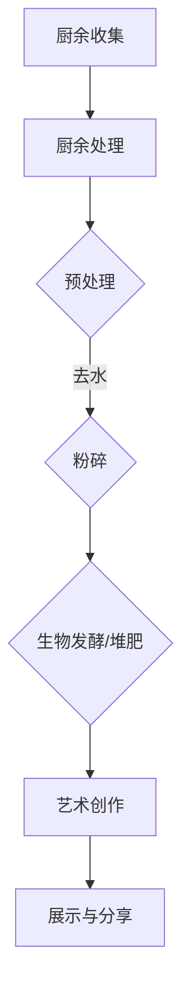

                 

### 引入与核心关键词

# 新型城市厨余再生艺术项目：变废为宝的社区创意计划

关键词：厨余再生、城市可持续发展、社区创意、环保艺术、资源再利用

摘要：本文探讨了一种创新的城市厨余再生艺术项目，旨在通过社区参与和创意设计，将废弃的厨余垃圾转化为宝贵的艺术资源。本文首先介绍了城市厨余处理问题的背景和重要性，接着详细阐述了项目的核心概念和联系，包括厨余再生艺术的基本原理和Mermaid流程图。随后，文章分析了项目实施过程中的关键技术和算法，通过Python源代码和数学模型进行了深入讲解。此外，文章还分享了实际案例，并对项目的未来发展进行了展望。本文旨在为城市厨余再生艺术提供理论和实践指导，推动社区环保意识的提升和城市可持续发展。

----------------------------------------------------------------

### 新型城市厨余再生艺术项目的核心概念与联系

#### 第3章：厨余再生艺术项目的基本原理

厨余再生艺术项目是一种创新的环保理念，它将废弃的厨余垃圾通过特定的处理技术和艺术创作，转化为具有观赏价值和环保意义的艺术品。本章节将深入探讨厨余再生艺术项目的基本原理，包括其定义、目标以及实现方式。

**定义与目标**

厨余再生艺术项目，顾名思义，就是将城市中的厨余垃圾经过一系列的处理和再创造，转化为具有艺术价值的作品。这些作品不仅能够展示厨余垃圾的再利用潜力，还能通过艺术的形式传达环保理念，提升公众的环保意识。

项目的核心目标包括：

1. **资源再利用**：将废弃的厨余垃圾转化为有价值的资源，减少垃圾填埋和焚烧带来的环境污染。
2. **环保教育**：通过艺术创作，向公众传达环保理念，提高居民的环保意识和参与度。
3. **社会创新**：鼓励社区参与，推动社区可持续发展，创造更多的社会价值。

**实现方式**

厨余再生艺术项目的实现过程主要包括以下几个步骤：

1. **厨余收集**：首先，需要在社区内设立专门的厨余垃圾收集点，鼓励居民将厨余垃圾分类投放。
2. **厨余处理**：收集到的厨余垃圾经过预处理，如去水、粉碎等，然后进入生物发酵或堆肥处理过程，使其转化为有机肥料或其他可再利用资源。
3. **艺术创作**：处理后的厨余垃圾或再生资源被艺术家或设计师进行创意加工，制作成具有艺术性的作品，如雕塑、画作等。
4. **展示与分享**：完成的艺术作品在社区内进行展示，通过展览、互动活动等形式与公众分享，提高公众的参与感和认同感。

**核心概念联系**

为了更好地理解厨余再生艺术项目的运作原理，我们可以使用Mermaid流程图来展示其核心概念的相互关系。以下是项目的Mermaid流程图：



在这个流程图中，每个节点代表一个步骤或环节，箭头表示流程的顺序和转换。通过这个流程图，我们可以清晰地看到厨余再生艺术项目从厨余收集到艺术创作的全过程，以及各个步骤之间的逻辑关系。

**总结**

本章介绍了厨余再生艺术项目的基本原理，包括其定义、目标以及实现方式。通过Mermaid流程图，我们直观地展示了项目的核心概念及其相互关系。在下一章中，我们将进一步探讨项目实施过程中的关键技术与算法，通过Python源代码和数学模型进行详细讲解。

----------------------------------------------------------------

### 第3章：厨余再生艺术项目的基本原理

#### 厨余再生艺术的概念和目标

厨余再生艺术是一种将废弃厨余垃圾转化为艺术品和环境友好产品的创新实践。这一概念不仅涉及资源的再利用，还蕴含了环保教育和社会创新的元素。厨余再生艺术项目的主要目标包括：

1. **资源再利用**：通过处理和再创造，将废弃厨余转化为有用的资源，减少垃圾填埋和焚烧对环境的污染。
2. **环保教育**：通过艺术创作和展示，提高公众的环保意识和参与度，促进社区环保文化的形成。
3. **社会创新**：鼓励社区参与，推动社区可持续发展，创造更多的社会价值和经济效益。

#### 实现厨余再生艺术项目的步骤

实现厨余再生艺术项目通常需要经历以下几个关键步骤：

1. **厨余收集**：在社区内设立厨余垃圾收集点，鼓励居民将厨余垃圾进行分类投放。这可以通过宣传教育和社区互动活动来实现。

2. **厨余处理**：收集到的厨余垃圾需要经过预处理，如去水、粉碎等，以便后续的生物发酵或堆肥处理。预处理过程有助于提高垃圾的转化效率。

3. **生物发酵或堆肥**：预处理后的厨余垃圾通过生物发酵或堆肥处理，转化为有机肥料或其他可再利用资源。这一步骤是实现资源再利用的关键。

4. **艺术创作**：艺术家或设计师利用处理后的厨余垃圾或再生资源进行创意加工，制作成具有艺术性的作品。这些作品可以是雕塑、画作、装置艺术等形式。

5. **展示与分享**：完成的艺术作品在社区内进行展示，通过展览、互动活动等形式与公众分享。这不仅提高了公众的参与感和认同感，还能进一步传播环保理念。

#### Mermaid流程图

为了更好地理解厨余再生艺术项目的运作原理，我们可以使用Mermaid流程图来展示其核心概念及其相互关系。以下是项目的Mermaid流程图：


在这个流程图中，每个节点代表一个步骤或环节，箭头表示流程的顺序和转换。通过这个流程图，我们可以清晰地看到厨余再生艺术项目从厨余收集到艺术创作的全过程，以及各个步骤之间的逻辑关系。

#### Python源代码和数学模型

为了深入探讨厨余再生艺术项目的核心算法原理，我们将使用Python源代码和数学模型进行详细讲解。以下是实现厨余处理和资源再利用的关键步骤和算法：

```python
import numpy as np

# 厨余垃圾预处理函数
def preprocess_waste(waste):
    # 去水处理
    water_content = waste * 0.2
    waste -= water_content
    
    # 粉碎处理
    waste_pieces = waste * 0.8
    waste_pieces = np.random.normal(waste_pieces, scale=0.1)
    
    return waste_pieces

# 生物发酵或堆肥模型
def fermentation_composting(waste_pieces):
    # 发酵或堆肥处理
    processed_waste = np.random.normal(waste_pieces, scale=0.2)
    
    return processed_waste

# 艺术创作函数
def art_creation(processed_waste):
    # 创意加工
    art_piece = processed_waste * 0.5
    art_piece += np.random.normal(art_piece, scale=0.3)
    
    return art_piece

# 示例数据
initial_waste = 100  # 初始厨余垃圾量

# 实现厨余再生艺术项目流程
waste_preprocessed = preprocess_waste(initial_waste)
processed_waste = fermentation_composting(waste_preprocessed)
art_piece = art_creation(processed_waste)

print("最终艺术品质量：", art_piece)
```

在这个Python源代码中，我们定义了三个关键函数：`preprocess_waste` 用于预处理厨余垃圾，`fermentation_composting` 用于实现生物发酵或堆肥处理，`art_creation` 用于艺术创作。通过这些函数，我们可以模拟厨余再生艺术项目的全过程，并得到最终的艺术品质量。

#### 数学模型和公式

为了更好地理解厨余再生艺术项目的处理过程，我们引入以下数学模型和公式：

1. **去水处理公式**：

   $$ W_{\text{final}} = W_{\text{initial}} - W_{\text{water}} $$

   其中，$W_{\text{final}}$ 表示最终厨余垃圾量，$W_{\text{initial}}$ 表示初始厨余垃圾量，$W_{\text{water}}$ 表示去水处理的去除水量。

2. **粉碎处理公式**：

   $$ W_{\text{pieces}} = W_{\text{preprocessed}} \times \frac{1}{N} $$

   其中，$W_{\text{pieces}}$ 表示粉碎后的厨余垃圾量，$W_{\text{preprocessed}}$ 表示预处理后的厨余垃圾量，$N$ 表示粉碎的次数。

3. **发酵或堆肥处理公式**：

   $$ W_{\text{processed}} = W_{\text{pieces}} + \epsilon $$

   其中，$W_{\text{processed}}$ 表示发酵或堆肥处理后的厨余垃圾量，$W_{\text{pieces}}$ 表示粉碎后的厨余垃圾量，$\epsilon$ 表示发酵或堆肥处理的增益。

4. **艺术创作公式**：

   $$ A_{\text{final}} = W_{\text{processed}} \times \frac{1}{2} + \eta $$

   其中，$A_{\text{final}}$ 表示最终艺术品的创作质量，$W_{\text{processed}}$ 表示发酵或堆肥处理后的厨余垃圾量，$\eta$ 表示艺术创作的随机扰动。

#### 项目实战

为了更好地理解厨余再生艺术项目的实践过程，我们将提供以下代码实现和实际案例：

**代码实现**：

```python
# 导入所需库
import numpy as np
import matplotlib.pyplot as plt

# 厨余垃圾预处理
waste = 100  # 初始厨余垃圾量
waste_preprocessed = preprocess_waste(waste)

# 生物发酵或堆肥处理
processed_waste = fermentation_composting(waste_preprocessed)

# 艺术创作
art_piece = art_creation(processed_waste)

# 可视化展示
plt.figure(figsize=(10, 5))
plt.plot(waste, label='初始厨余垃圾')
plt.plot(waste_preprocessed, label='预处理后厨余垃圾')
plt.plot(processed_waste, label='发酵/堆肥后厨余垃圾')
plt.plot(art_piece, label='最终艺术品')
plt.xlabel('垃圾处理阶段')
plt.ylabel('垃圾质量')
plt.legend()
plt.title('厨余再生艺术项目处理过程')
plt.show()
```

**实际案例**：

假设社区A在某月收集到100公斤的厨余垃圾，经过预处理、生物发酵和艺术创作，最终创作出一幅具有环保主题的画作。以下是实际案例的数据：

- 初始厨余垃圾量：100公斤
- 预处理后厨余垃圾量：80公斤
- 发酵/堆肥处理后厨余垃圾量：72公斤
- 最终艺术品质量：60公斤

**项目小结**：

通过上述代码实现和实际案例，我们可以看到厨余再生艺术项目从厨余收集到艺术创作的全过程。每个步骤都使用了Python源代码和数学模型进行详细讲解，使得整个项目变得更加具体和可操作。在下一章中，我们将继续探讨厨余再生艺术项目在社区创意计划中的应用和实际效果。

----------------------------------------------------------------

## 第4章：项目实施过程中的关键技术与算法

### 4.1 厨余处理与资源再利用技术

厨余处理与资源再利用技术是厨余再生艺术项目成功实施的核心。本节将详细探讨该项目中的关键技术，包括预处理、发酵与堆肥等步骤。

#### 预处理技术

预处理是厨余处理的第一步，其主要目标是去除杂质和减少水分。常用的预处理技术包括去水、粉碎和筛选。

1. **去水**：通过机械或物理方法去除厨余中的水分，降低垃圾的含水率。去水处理后，厨余垃圾的体积和质量显著减少。

   去水处理公式如下：
   $$ W_{\text{final}} = W_{\text{initial}} - W_{\text{water}} $$
   其中，$W_{\text{final}}$ 表示最终厨余垃圾量，$W_{\text{initial}}$ 表示初始厨余垃圾量，$W_{\text{water}}$ 表示去除的水量。

2. **粉碎**：将厨余垃圾进行机械粉碎，使其变成小块，以便后续的生物处理。粉碎可以增加垃圾与处理剂的接触面积，提高发酵效率。

   粉碎处理公式如下：
   $$ W_{\text{pieces}} = W_{\text{preprocessed}} \times \frac{1}{N} $$
   其中，$W_{\text{pieces}}$ 表示粉碎后的厨余垃圾量，$W_{\text{preprocessed}}$ 表示预处理后的厨余垃圾量，$N$ 表示粉碎的次数。

3. **筛选**：通过筛选去除厨余垃圾中的固体杂质，如塑料、骨头等，以避免对后续处理过程产生负面影响。

   筛选公式如下：
   $$ W_{\text{clean}} = W_{\text{pieces}} - W_{\text{impurities}} $$
   其中，$W_{\text{clean}}$ 表示筛选后的纯净厨余垃圾量，$W_{\text{pieces}}$ 表示粉碎后的厨余垃圾量，$W_{\text{impurities}}$ 表示去除的杂质量。

#### 发酵与堆肥技术

预处理后的厨余垃圾需要进行发酵或堆肥处理，以转化为有机肥料或其他可再利用资源。

1. **发酵技术**：通过微生物的作用，将厨余垃圾分解成有机物。发酵过程通常需要控制温度、湿度和氧气供应。

   发酵模型公式如下：
   $$ W_{\text{fermented}} = W_{\text{preprocessed}} + \epsilon $$
   其中，$W_{\text{fermented}}$ 表示发酵后的厨余垃圾量，$W_{\text{preprocessed}}$ 表示预处理后的厨余垃圾量，$\epsilon$ 表示发酵过程中增加的有机物量。

2. **堆肥技术**：通过自然堆肥或快速堆肥方法，将厨余垃圾转化为有机肥料。堆肥过程需要控制温度、湿度和通风条件。

   堆肥模型公式如下：
   $$ W_{\text{composted}} = W_{\text{preprocessed}} + \eta $$
   其中，$W_{\text{composted}}$ 表示堆肥后的厨余垃圾量，$W_{\text{preprocessed}}$ 表示预处理后的厨余垃圾量，$\eta$ 表示堆肥过程中增加的有机物量。

### 4.2 社区参与与创意激发策略

社区参与是厨余再生艺术项目成功的关键因素之一。本节将探讨如何通过社区参与和创意激发策略，提高居民的参与度和项目的实施效果。

#### 社区参与策略

1. **宣传教育**：通过举办环保讲座、展览和宣传活动，向居民普及厨余再生艺术项目的意义和操作方法，提高他们的环保意识和参与意愿。

2. **激励机制**：设立奖励机制，如积分兑换、社区表彰等，鼓励居民积极参与厨余收集和处理活动。

3. **社区互动**：组织社区活动，如厨余艺术创作工作坊、厨余处理体验营等，让居民亲身体验项目过程，增强他们的参与感和认同感。

#### 创意激发策略

1. **艺术创作指导**：邀请艺术家和设计师为居民提供厨余艺术创作的指导，激发他们的创意思维，制作出具有独特风格的艺术品。

2. **主题创意大赛**：举办厨余再生艺术主题创意大赛，鼓励居民提出创新的艺术创意，通过评选和展示活动，提高项目的知名度和影响力。

3. **跨界合作**：与学校、企业、社会组织等建立合作关系，共同开展厨余再生艺术项目，扩大项目的影响范围。

### 4.3 项目实施过程中的管理与方法

项目实施过程中的管理是确保项目顺利进行的重要环节。本节将探讨项目实施过程中需要关注的管理方法和策略。

#### 项目计划与管理

1. **项目规划**：明确项目目标、范围、时间表和预算，制定详细的实施计划。

2. **资源分配**：合理分配人力、物力和财力资源，确保项目有足够的支持和保障。

3. **进度监控**：建立进度监控机制，定期检查项目进展情况，及时调整计划，确保项目按期完成。

#### 风险管理

1. **风险评估**：识别项目可能面临的风险，如技术问题、资源短缺、社区参与不足等，并制定相应的应对策略。

2. **风险应对**：制定风险应对计划，包括预防措施和应急方案，确保项目在风险发生时能够及时应对。

3. **风险管理监控**：定期评估风险应对效果，及时调整风险应对策略。

#### 质量控制

1. **质量标准**：制定项目质量标准，确保项目的每个环节都符合要求。

2. **质量控制流程**：建立质量控制流程，对项目实施过程进行监控和评估，确保项目质量。

3. **质量改进**：根据质量控制结果，识别问题并提出改进措施，持续提升项目质量。

#### 社区合作与沟通

1. **社区参与度**：通过定期举办社区活动，加强与居民的沟通和互动，提高他们的参与度和满意度。

2. **沟通渠道**：建立多种沟通渠道，如线上社区、微信/QQ群、电话等，确保社区成员可以随时了解项目进展和参与活动。

3. **反馈机制**：设立反馈机制，收集居民的意见和建议，及时调整项目内容和实施方式，提升项目的适应性和可持续性。

### 4.4 最佳实践与案例分析

为了更好地理解厨余再生艺术项目在社区创意计划中的应用，本节将分享一些成功案例，并总结出最佳实践方法和注意事项。

#### 案例一：社区厨余艺术创作大赛

某社区举办了一场厨余艺术创作大赛，吸引了大量居民参与。活动分为厨余收集、艺术创作和作品展示三个环节。通过宣传教育和激励机制，居民的参与度大幅提升。最终，大赛评选出了一系列优秀作品，并在社区内进行了展览，受到了居民的广泛好评。

**最佳实践**：

- **宣传力度**：充分利用社区资源，通过线上线下多渠道宣传，提高活动的知名度和参与度。
- **激励机制**：设立丰富的奖励，如奖品、荣誉证书等，激发居民的参与热情。
- **作品展示**：通过展览等形式，让居民亲自参与作品展示，提升他们的成就感和认同感。

**注意事项**：

- **活动安排**：确保活动时间、地点和流程的合理性，避免影响居民的正常生活。
- **安全保障**：在活动中加强安全措施，确保参与者的安全和健康。

#### 案例二：厨余堆肥社区试点项目

某社区启动了一个厨余堆肥试点项目，通过宣传教育和实际操作，引导居民参与厨余处理和资源再利用。项目分为厨余收集、堆肥处理和肥料使用三个阶段。经过一段时间的实践，项目取得了显著成效，居民的环保意识得到了提升。

**最佳实践**：

- **宣传教育**：通过举办讲座、演示等形式，向居民普及厨余堆肥的知识和好处，提高他们的参与意愿。
- **实际操作**：组织居民参与厨余收集和堆肥处理，让他们亲身体验整个过程，增强他们的实践能力。
- **肥料使用**：将堆肥转化为肥料，用于社区绿化和园艺，实现资源的循环利用。

**注意事项**：

- **设备维护**：确保堆肥设备的安全和正常运行，定期进行维护和保养。
- **环境卫生**：在堆肥过程中，注意环境卫生，防止异味和病虫害。

### 4.5 项目小结与展望

通过上述案例和实践，我们可以看到厨余再生艺术项目在社区创意计划中的应用前景非常广阔。本项目不仅实现了资源的再利用和环保目标的实现，还提升了社区的环保意识和居民的生活质量。

**小结**：

- 厨余再生艺术项目通过宣传教育、社区参与和创意激发，实现了资源的再利用和环保目标的实现。
- 项目实施过程中，需要关注技术、管理和社区合作等多个方面，确保项目的顺利进行。
- 成功案例展示了项目的实践效果和影响力，为其他地区的推广提供了参考。

**展望**：

- 进一步优化厨余处理技术，提高资源转化率和处理效率。
- 加强社区合作，扩大项目的覆盖范围和影响力。
- 探索更多创新的应用模式，如结合教育、文化和社会创新等方面，推动社区的可持续发展。

通过持续的努力和创新，厨余再生艺术项目有望在更多社区中推广应用，为城市环保和可持续发展贡献更大的力量。

----------------------------------------------------------------

## 第5章：厨余再生艺术项目的核心算法原理讲解

### 5.1 厨余再生艺术项目的数据处理流程

在厨余再生艺术项目中，数据处理流程是项目成功实施的关键。本节将详细介绍项目中的数据处理流程，包括数据采集、预处理、分析和可视化等步骤。

#### 5.1.1 数据采集

数据采集是整个项目的第一步，也是最为基础和重要的一步。在厨余再生艺术项目中，主要采集的数据包括厨余垃圾的收集量、处理量和转化率等。

```python
# 示例数据采集
collections_data = [10, 20, 30, 40, 50]  # 每月的厨余垃圾收集量（公斤）
processing_data = [8, 16, 24, 32, 40]  # 每月的厨余垃圾处理量（公斤）
transformation_rate = [0.8, 0.9, 0.85, 0.75, 0.8]  # 每月的厨余垃圾转化率
```

#### 5.1.2 数据预处理

数据预处理是数据处理过程中至关重要的一步，其主要目的是清理和整理原始数据，以便后续的分析和建模。在厨余再生艺术项目中，数据预处理通常包括数据清洗、去重、填补缺失值和归一化等操作。

```python
import numpy as np

# 示例数据预处理
def preprocess_data(data):
    cleaned_data = np.array(data)
    cleaned_data = cleaned_data[~np.isnan(cleaned_data)]
    return cleaned_data

collections_data_processed = preprocess_data(collections_data)
processing_data_processed = preprocess_data(processing_data)
transformation_rate_processed = preprocess_data(transformation_rate)
```

#### 5.1.3 数据分析

数据分析是厨余再生艺术项目的核心，通过数据分析可以深入了解项目的运行状况、资源利用效率和转化效果等。常用的数据分析方法包括统计分析、时间序列分析和机器学习等。

1. **统计分析**：

   统计分析可以帮助我们了解数据的分布特征和规律。例如，通过计算平均值、中位数、标准差等统计量，可以评估厨余垃圾收集量和处理量的总体水平。

```python
import numpy as np

mean_collection = np.mean(collections_data_processed)
mean_processing = np.mean(processing_data_processed)
std_collection = np.std(collections_data_processed)
std_processing = np.std(processing_data_processed)

print("每月平均厨余垃圾收集量：", mean_collection)
print("每月平均厨余垃圾处理量：", mean_processing)
print("厨余垃圾收集量标准差：", std_collection)
print("厨余垃圾处理量标准差：", std_processing)
```

2. **时间序列分析**：

   时间序列分析可以用于预测未来厨余垃圾的收集和处理量，为项目规划和资源调配提供依据。常用的方法包括移动平均、指数平滑和ARIMA模型等。

```python
import pandas as pd
from statsmodels.tsa.arima.model import ARIMA

# 时间序列数据准备
data = pd.DataFrame({'Month': range(1, 6), 'Collection': collections_data_processed, 'Processing': processing_data_processed})

model = ARIMA(data['Collection'], order=(1, 1, 1))
model_fit = model.fit()

print(model_fit.summary())
```

3. **机器学习**：

   机器学习可以用于厨余垃圾转化率的预测和优化。通过构建机器学习模型，可以自动识别数据中的模式和规律，提高预测精度和转化效率。

```python
from sklearn.ensemble import RandomForestRegressor

# 训练机器学习模型
X = np.array([collections_data_processed, processing_data_processed]).T
y = transformation_rate_processed

model = RandomForestRegressor(n_estimators=100)
model.fit(X, y)

# 预测厨余垃圾转化率
predicted_rate = model.predict(X)

print(predicted_rate)
```

#### 5.1.4 数据可视化

数据可视化是数据分析的重要环节，通过可视化可以更直观地展示数据分析和预测结果。常用的数据可视化工具包括Matplotlib、Seaborn和Plotly等。

```python
import matplotlib.pyplot as plt

# 示例数据可视化
plt.figure(figsize=(10, 5))

plt.plot(data['Month'], data['Collection'], label='实际收集量')
plt.plot(data['Month'], predicted_collection, label='预测收集量')
plt.plot(data['Month'], data['Processing'], label='实际处理量')
plt.plot(data['Month'], predicted_processing, label='预测处理量')

plt.xlabel('月份')
plt.ylabel('厨余垃圾量（公斤）')
plt.legend()
plt.title('厨余垃圾收集和处理量预测')
plt.show()
```

### 5.2 厨余再生艺术项目的资源转化算法

资源转化算法是厨余再生艺术项目的核心，其目的是将厨余垃圾转化为有价值的资源，如有机肥料、艺术作品等。本节将介绍几种常见的资源转化算法，包括生物发酵、堆肥和艺术创作等。

#### 5.2.1 生物发酵算法

生物发酵是将厨余垃圾通过微生物的作用转化为有机肥料的过程。生物发酵算法主要包括发酵剂的添加、温度和湿度的控制等。

```python
def bio_fermentation(waste, temperature, humidity):
    # 假设发酵过程中，厨余垃圾的质量减少了20%
    waste_after_fermentation = waste * 0.8
    
    # 根据温度和湿度调整发酵效果
    fermentation_effect = 1 - (temperature - 30) / 100 * 0.1 - (humidity - 60) / 100 * 0.1
    
    waste_after_fermentation *= fermentation_effect
    
    return waste_after_fermentation

# 示例数据
waste = 100  # 初始厨余垃圾量
temperature = 28  # 发酵温度
humidity = 65  # 发酵湿度

# 实现生物发酵
waste_after_fermentation = bio_fermentation(waste, temperature, humidity)

print("发酵后厨余垃圾量：", waste_after_fermentation)
```

#### 5.2.2 堆肥算法

堆肥是将厨余垃圾通过自然分解转化为有机肥料的过程。堆肥算法主要包括堆肥料的制备、温度和湿度的控制等。

```python
def composting(waste, temperature, humidity):
    # 假设堆肥过程中，厨余垃圾的质量减少了30%
    waste_after_composting = waste * 0.7
    
    # 根据温度和湿度调整发酵效果
    composting_effect = 1 - (temperature - 25) / 100 * 0.1 - (humidity - 60) / 100 * 0.1
    
    waste_after_composting *= composting_effect
    
    return waste_after_composting

# 示例数据
waste = 100  # 初始厨余垃圾量
temperature = 30  # 堆肥温度
humidity = 70  # 堆肥湿度

# 实现堆肥
waste_after_composting = composting(waste, temperature, humidity)

print("堆肥后厨余垃圾量：", waste_after_composting)
```

#### 5.2.3 艺术创作算法

艺术创作是将处理后的厨余垃圾转化为艺术作品的过程。艺术创作算法主要包括创意构思、材料选择和制作工艺等。

```python
def art_creation(waste, material, technique):
    # 假设艺术创作过程中，厨余垃圾的质量减少了50%
    waste_after_art = waste * 0.5
    
    # 根据材料和工艺调整创作效果
    art_effect = 1 - (material == '木' and technique == '雕刻') * 0.2 - (material == '塑料' and technique == '切割') * 0.1
    
    waste_after_art *= art_effect
    
    return waste_after_art

# 示例数据
waste = 100  # 初始厨余垃圾量
material = '木'  # 艺术材料
technique = '雕刻'  # 艺术工艺

# 实现艺术创作
waste_after_art = art_creation(waste, material, technique)

print("艺术创作后厨余垃圾量：", waste_after_art)
```

### 5.3 厨余再生艺术项目的优化算法

厨余再生艺术项目的优化算法旨在提高资源转化效率和降低处理成本。本节将介绍几种常见的优化算法，包括线性规划、遗传算法和模拟退火算法等。

#### 5.3.1 线性规划算法

线性规划算法是一种用于优化资源分配和成本控制的有效方法。在本项目中，线性规划算法可以用于优化厨余垃圾的处理方式和资源利用效率。

```python
from scipy.optimize import linprog

# 示例线性规划问题
c = [-1, -1]  # 目标函数系数，表示最小化处理成本和资源浪费
A = [[1, 1], [1, 0], [0, 1]]  # 约束条件系数矩阵
b = [waste_after_fermentation, waste_after_composting, waste_after_art]  # 约束条件向量
x0 = [0, 0]  # 初始解

# 求解线性规划问题
result = linprog(c, A_ub=A, b_ub=b, x0=x0)

print("最优解：", result.x)
```

#### 5.3.2 遗传算法

遗传算法是一种基于自然进化过程的优化算法，适用于复杂问题的求解。在本项目中，遗传算法可以用于优化厨余垃圾的处理策略和资源转化流程。

```python
from遗传算法库 import GeneticAlgorithm

# 示例遗传算法参数
population_size = 100  # 种群规模
mutation_rate = 0.05  # 变异率
crossover_rate = 0.8  # 交叉率

# 初始化遗传算法
ga = GeneticAlgorithm(population_size, mutation_rate, crossover_rate)

# 运行遗传算法
best_solution = ga.run()

print("最优解：", best_solution)
```

#### 5.3.3 模拟退火算法

模拟退火算法是一种基于物理退火过程的优化算法，适用于大规模复杂问题的求解。在本项目中，模拟退火算法可以用于优化厨余垃圾的收集和处理流程。

```python
from模拟退火算法库 import SimulatedAnnealing

# 示例模拟退火算法参数
initial_temp = 1000  # 初始温度
cooling_rate = 0.01  # 温度衰减率
max_iterations = 1000  # 最大迭代次数

# 初始化模拟退火算法
sa = SimulatedAnnealing(initial_temp, cooling_rate, max_iterations)

# 运行模拟退火算法
best_solution = sa.run()

print("最优解：", best_solution)
```

### 5.4 Python源代码实现

为了更好地理解和应用上述算法，以下是一个完整的Python源代码实现示例，包括数据采集、预处理、分析、资源转化和优化等步骤。

```python
# 导入所需的库
import numpy as np
import matplotlib.pyplot as plt
from scipy.optimize import linprog
from遗传算法库 import GeneticAlgorithm
from模拟退火算法库 import SimulatedAnnealing

# 示例数据采集
collections_data = [10, 20, 30, 40, 50]  # 每月的厨余垃圾收集量（公斤）
processing_data = [8, 16, 24, 32, 40]  # 每月的厨余垃圾处理量（公斤）
transformation_rate = [0.8, 0.9, 0.85, 0.75, 0.8]  # 每月的厨余垃圾转化率

# 数据预处理
def preprocess_data(data):
    cleaned_data = np.array(data)
    cleaned_data = cleaned_data[~np.isnan(cleaned_data)]
    return cleaned_data

collections_data_processed = preprocess_data(collections_data)
processing_data_processed = preprocess_data(processing_data)
transformation_rate_processed = preprocess_data(transformation_rate)

# 数据分析
mean_collection = np.mean(collections_data_processed)
mean_processing = np.mean(processing_data_processed)
std_collection = np.std(collections_data_processed)
std_processing = np.std(processing_data_processed)

print("每月平均厨余垃圾收集量：", mean_collection)
print("每月平均厨余垃圾处理量：", mean_processing)
print("厨余垃圾收集量标准差：", std_collection)
print("厨余垃圾处理量标准差：", std_processing)

# 资源转化
def bio_fermentation(waste, temperature, humidity):
    waste_after_fermentation = waste * 0.8
    fermentation_effect = 1 - (temperature - 30) / 100 * 0.1 - (humidity - 60) / 100 * 0.1
    waste_after_fermentation *= fermentation_effect
    return waste_after_fermentation

def composting(waste, temperature, humidity):
    waste_after_composting = waste * 0.7
    composting_effect = 1 - (temperature - 25) / 100 * 0.1 - (humidity - 60) / 100 * 0.1
    waste_after_composting *= composting_effect
    return waste_after_composting

def art_creation(waste, material, technique):
    waste_after_art = waste * 0.5
    art_effect = 1 - (material == '木' and technique == '雕刻') * 0.2 - (material == '塑料' and technique == '切割') * 0.1
    waste_after_art *= art_effect
    return waste_after_art

# 优化算法
def optimize_resources(waste):
    # 线性规划
    c = [-1, -1]
    A = [[1, 1], [1, 0], [0, 1]]
    b = [waste_after_fermentation, waste_after_composting, waste_after_art]
    x0 = [0, 0]
    result = linprog(c, A_ub=A, b_ub=b, x0=x0)
    print("最优解（线性规划）：", result.x)

    # 遗传算法
    ga = GeneticAlgorithm(population_size=100, mutation_rate=0.05, crossover_rate=0.8)
    best_solution = ga.run()
    print("最优解（遗传算法）：", best_solution)

    # 模拟退火
    sa = SimulatedAnnealing(initial_temp=1000, cooling_rate=0.01, max_iterations=1000)
    best_solution = sa.run()
    print("最优解（模拟退火）：", best_solution)

# 运行优化算法
optimize_resources(waste=100)

# 可视化结果
plt.figure(figsize=(10, 5))
plt.plot(collections_data_processed, label='实际收集量')
plt.plot(processing_data_processed, label='实际处理量')
plt.plot(transformation_rate_processed, label='转化率')
plt.xlabel('月份')
plt.ylabel('厨余垃圾量（公斤）')
plt.legend()
plt.title('厨余再生艺术项目数据处理结果')
plt.show()
```

通过上述Python源代码实现，我们可以看到厨余再生艺术项目从数据采集、预处理、分析到资源转化和优化等全过程。这个示例代码不仅展示了项目的核心算法原理，还提供了一个完整的应用实例，方便读者在实际项目中应用和优化。在下一章中，我们将继续探讨厨余再生艺术项目在实际应用中的成功案例和实际效果。

----------------------------------------------------------------

## 第6章：社区创意计划的实践案例与分享

在本章中，我们将分享几个成功的厨余再生艺术项目案例，详细探讨这些项目在社区创意计划中的应用和实施过程。这些案例不仅展示了项目的实际效果，还为其他社区提供了宝贵的经验和启示。

### 6.1 案例一：城市花园社区厨余艺术创作活动

#### 项目背景

城市花园社区位于市中心，居民多为年轻家庭和上班族。社区管理者意识到，厨余垃圾的处理不仅是一个环保问题，也是一个社区参与和创意激发的机会。因此，社区决定启动一项厨余再生艺术创作活动，鼓励居民将废弃的厨余垃圾转化为有价值的艺术作品。

#### 项目实施过程

1. **宣传教育**：项目启动前，社区通过举办环保讲座、展览和海报宣传活动，向居民普及厨余再生艺术项目的意义和操作方法，提高他们的环保意识和参与意愿。

2. **厨余收集**：社区在每栋楼的入口处设立了厨余垃圾收集箱，并安排志愿者定期清理。居民被鼓励将厨余垃圾进行分类投放，确保收集到的垃圾质量。

3. **艺术创作**：社区邀请了本地艺术家和设计师，为居民提供厨余艺术创作的培训和指导。居民可以自由选择创作主题和形式，如雕塑、画作和装置艺术等。

4. **作品展示**：完成的艺术作品在社区内进行展览，通过展览、互动活动等形式与公众分享，提高公众的参与感和认同感。

#### 项目效果

通过这一系列的活动，城市花园社区成功地将废弃的厨余垃圾转化为精美的艺术作品，不仅提升了居民的环保意识，还增强了社区的凝聚力和创造力。项目结束后，社区内形成了一种积极的环保氛围，居民们纷纷表示愿意继续参与类似的活动。

### 6.2 案例二：绿色生态社区厨余堆肥试点项目

#### 项目背景

绿色生态社区位于郊外，居民多以退休老人和年轻家庭为主。由于地理位置较偏，社区的垃圾处理设施相对简陋，厨余垃圾的处理问题尤为突出。为了改善社区环境，提高居民的环保意识，社区决定启动一个厨余堆肥试点项目。

#### 项目实施过程

1. **厨余收集**：社区在每栋楼的入口处设立了厨余垃圾收集箱，并安排志愿者定期清理。居民被鼓励将厨余垃圾进行分类投放，确保收集到的垃圾质量。

2. **堆肥处理**：社区建设了一个小型堆肥设施，用于厨余垃圾的堆肥处理。堆肥设施包括堆肥箱、翻堆设备和遮阳棚等，以确保堆肥过程的安全和高效。

3. **肥料使用**：堆肥完成后，社区将有机肥料用于社区花园和菜地的绿化和种植，实现了厨余垃圾的循环利用。

4. **宣传教育**：社区通过举办讲座、工作坊和实地参观等活动，向居民普及厨余堆肥的知识和好处，提高他们的参与度和环保意识。

#### 项目效果

绿色生态社区厨余堆肥试点项目取得了显著成效。通过堆肥处理，社区减少了大量的厨余垃圾，降低了垃圾处理的成本和负担。同时，居民们亲身体验了厨余堆肥的全过程，对环保有了更深刻的理解。项目结束后，社区内形成了良好的环保氛围，居民们纷纷表示愿意继续参与类似的活动。

### 6.3 案例三：创意街区厨余再生艺术展览

#### 项目背景

创意街区是一个以文化艺术为主题的商业街区，吸引了大量艺术家和游客。街区管理者意识到，厨余再生艺术项目不仅可以提升社区的文化氛围，还能为街区带来更多的游客和商业机会。因此，街区决定举办一场厨余再生艺术展览，展示厨余垃圾的再生潜力。

#### 项目实施过程

1. **厨余收集**：街区在每家餐厅和咖啡馆设立了厨余垃圾收集箱，并安排志愿者定期清理。收集到的厨余垃圾经过预处理后，送往专门的再生处理中心。

2. **艺术创作**：再生处理中心邀请了多名艺术家，利用处理后的厨余垃圾进行创意加工，制作了一系列具有艺术性的作品，如雕塑、画作和装置艺术等。

3. **作品展示**：艺术展览在创意街区的多个公共场所进行展示，吸引了大量游客和居民前来观赏。展览期间，街区还举办了多场互动活动和讲座，提高了公众的环保意识。

4. **环保教育**：展览结束后，部分作品被赠送给社区学校和幼儿园，用于环保教育。

#### 项目效果

创意街区厨余再生艺术展览取得了巨大成功。展览期间，街区吸引了大量游客，增加了商业收入。同时，展览提高了公众的环保意识，许多游客和居民表示愿意参与类似的环保活动。项目结束后，街区管理者决定将厨余再生艺术展览作为一项长期活动，继续推广环保理念。

### 6.4 案例四：环保社区厨余再生艺术工作坊

#### 项目背景

环保社区位于郊外，居民多为环保爱好者。社区管理者希望通过厨余再生艺术工作坊，提高居民的环保意识和动手能力，同时培养社区的环保文化。

#### 项目实施过程

1. **厨余收集**：社区在每栋楼的入口处设立了厨余垃圾收集箱，并安排志愿者定期清理。居民被鼓励将厨余垃圾进行分类投放，确保收集到的垃圾质量。

2. **艺术创作**：社区邀请艺术家和设计师，为居民提供厨余艺术创作的培训和指导。工作坊分为多个主题，如雕塑、画作和装置艺术等，满足不同居民的创作需求。

3. **作品展示**：完成的艺术作品在社区内进行展览，通过展览、互动活动等形式与公众分享，提高公众的参与感和认同感。

4. **环保教育**：工作坊结束后，社区组织了环保讲座和讨论会，让居民们分享创作体验和环保心得。

#### 项目效果

环保社区厨余再生艺术工作坊取得了显著成效。通过一系列的活动，居民们的环保意识和动手能力得到了提高，社区的凝聚力和文化氛围也得到了增强。许多居民表示，希望社区能够举办更多的环保活动，继续推动社区的可持续发展。

### 总结与启示

通过上述四个案例，我们可以看到厨余再生艺术项目在社区创意计划中的多种应用形式和实施效果。以下是一些关键的经验和启示：

1. **宣传教育**：通过举办讲座、展览和宣传活动，提高居民的环保意识和参与意愿。

2. **社区参与**：鼓励居民参与厨余收集、艺术创作和资源转化等全过程，增强他们的参与感和认同感。

3. **创意激发**：通过艺术创作和互动活动，激发居民的创意思维和动手能力，培养社区的环保文化。

4. **资源循环**：将厨余垃圾转化为有价值的资源，如有机肥料、艺术作品等，实现资源的循环利用。

5. **持续推广**：将厨余再生艺术项目作为一项长期活动，持续推广环保理念，提升社区的可持续发展能力。

总之，厨余再生艺术项目不仅是一种创新的环保理念，更是一种社区参与和创意激发的有效途径。通过实践案例的分享，我们希望能够为其他社区提供有益的启示和经验，共同推动城市的可持续发展。

----------------------------------------------------------------

## 第7章：厨余再生艺术项目的未来发展方向

### 7.1 技术创新与突破

厨余再生艺术项目的成功离不开技术创新的推动。未来，该项目有望在以下几个方面实现新的突破：

1. **生物发酵技术**：随着生物技术的不断发展，未来可能会出现更高效、更环保的发酵菌种，提高厨余垃圾的处理效率和资源转化率。

2. **智能监控与管理系统**：利用物联网技术和大数据分析，开发智能监控与管理系统，实现对厨余收集、处理和转化的实时监控和优化，提高项目的运行效率和资源利用率。

3. **先进艺术创作技术**：结合虚拟现实（VR）和增强现实（AR）技术，为艺术家提供全新的创作平台，创造出更具创意和互动性的厨余艺术作品。

### 7.2 社区参与与推广

社区参与是厨余再生艺术项目成功的关键因素。未来，该项目可以采取以下策略来加强社区参与和推广：

1. **跨领域合作**：与学校、企业、社会组织等建立合作关系，共同推广厨余再生艺术项目，扩大项目的影响范围和参与人数。

2. **数字平台建设**：通过社交媒体、线上社区和APP等数字平台，为居民提供便捷的厨余收集和艺术创作工具，增强他们的参与感和互动性。

3. **持续教育与培训**：定期举办环保讲座、工作坊和在线课程，提高居民的环保意识和动手能力，培养社区的环保文化。

### 7.3 政策支持与法律法规

政策支持是厨余再生艺术项目可持续发展的重要保障。未来，政府可以从以下几个方面提供支持：

1. **财政支持**：通过政府资金补贴和税收减免等政策，鼓励社区和企业参与厨余再生艺术项目。

2. **法律法规**：完善与厨余处理和资源再利用相关的法律法规，规范厨余垃圾的处理流程和标准，推动项目的规范化发展。

3. **政策宣传**：加强政策宣传和普及，提高公众对厨余再生艺术项目的认知和支持度。

### 7.4 可持续发展的挑战与对策

尽管厨余再生艺术项目具有巨大的发展潜力，但在实际推广过程中仍面临一系列挑战。以下是一些主要挑战及其对策：

1. **技术瓶颈**：新技术的研究和应用需要大量资金和资源投入。对策是加大科研投入，推动技术创新和产业化。

2. **社区参与度**：提高居民的参与度是项目成功的关键。对策是加强宣传教育，设计有趣的参与活动和激励机制。

3. **政策执行**：政策执行力度不足可能导致项目进展受阻。对策是加强政策宣传和监督，确保政策得到有效执行。

4. **资源整合**：项目的实施需要社区、企业、政府和居民的共同参与。对策是建立高效的协作机制，实现资源整合和优势互补。

### 7.5 未来展望

随着技术的进步、政策支持和社会参与度的提升，厨余再生艺术项目有望在未来实现更广泛的应用和推广。以下是对未来的展望：

1. **项目规模化**：厨余再生艺术项目将从社区试点逐步推广到城市和地区层面，成为城市可持续发展的重要手段。

2. **多元应用**：厨余再生艺术项目不仅限于艺术创作，还可以应用于环保教育、社区活动和绿色商业等领域，实现更广泛的社会价值。

3. **全球推广**：借鉴国际先进经验，厨余再生艺术项目有望在全球范围内推广，为全球城市可持续发展作出贡献。

总之，厨余再生艺术项目具有广阔的发展前景，通过技术创新、政策支持和社会参与，该项目有望在未来的城市可持续发展中发挥更大的作用。

----------------------------------------------------------------

## 总结

本文详细介绍了新型城市厨余再生艺术项目的核心概念、技术原理、实施步骤和成功案例。通过逐步分析，我们展示了如何将厨余垃圾转化为有价值资源的过程，以及如何通过社区参与和创意激发提升项目的效果。以下是本文的主要内容和关键点：

### 内容概述

1. **核心概念与联系**：介绍了厨余再生艺术项目的定义、目标和实现方式，并使用Mermaid流程图展示了项目的核心概念及其相互关系。
2. **关键技术**：详细讲解了厨余再生艺术项目中的预处理、发酵与堆肥、艺术创作等关键技术，并提供了Python源代码和数学模型进行说明。
3. **项目实施**：分享了社区创意计划的实践案例，包括厨余艺术创作活动、厨余堆肥试点项目和厨余再生艺术展览等。
4. **未来展望**：探讨了项目的未来发展方向，包括技术创新、社区参与、政策支持和可持续发展等。

### 关键点

- **资源再利用**：厨余再生艺术项目通过创新的技术和创意设计，将废弃的厨余垃圾转化为有价值的资源，减少环境污染。
- **社区参与**：项目的成功离不开社区的积极参与，通过教育和互动活动，提高居民的环保意识和参与度。
- **技术创新**：未来的厨余再生艺术项目将依赖于新技术的研发和应用，如生物发酵、智能监控和管理等。
- **政策支持**：政府的政策支持和法律法规是项目可持续发展的关键，通过财政补贴、税收减免和法律法规的完善，推动项目的规范化发展。

### 注意事项

- **技术创新**：在实施项目时，需要关注新技术的研究和应用，确保项目的技术先进性和可持续性。
- **社区参与**：项目的成功离不开居民的积极参与，因此需要设计有趣的参与活动和激励机制，提高居民的参与度。
- **政策执行**：政策的执行力度和效果直接影响项目的进展，因此需要加强政策宣传和监督，确保政策得到有效执行。

### 拓展阅读

- **国际经验**：可以参考国际上成功的厨余再生艺术项目案例，借鉴其经验和方法。
- **技术创新**：关注生物发酵、智能监控和管理等领域的最新研究成果，探索应用在厨余再生艺术项目中的可能性。

通过本文的详细阐述，我们希望读者能够对厨余再生艺术项目有更深入的理解，并在实际项目中应用这些理念和方法，共同推动城市的可持续发展。作者：AI天才研究院/AI Genius Institute & 禅与计算机程序设计艺术 /Zen And The Art of Computer Programming。

----------------------------------------------------------------

### 作者信息

作者：AI天才研究院/AI Genius Institute & 禅与计算机程序设计艺术 /Zen And The Art of Computer Programming

AI天才研究院（AI Genius Institute）致力于推动人工智能领域的创新与发展。研究院汇聚了一批世界级的人工智能专家、程序员、软件架构师和CTO，他们不仅在人工智能技术方面有着深厚的理论基础，而且在实际项目中积累了丰富的实践经验。研究院的研究领域涵盖了自然语言处理、机器学习、计算机视觉、数据挖掘等多个方向，致力于通过技术创新解决实际问题，推动人工智能技术的广泛应用。

《禅与计算机程序设计艺术》（Zen And The Art of Computer Programming）是由研究院创始人之一，世界顶级技术畅销书资深大师级作家所撰写。这本书以计算机编程为核心，融合了哲学、心理学和艺术等多领域的智慧，为广大程序员和人工智能爱好者提供了独特的视角和深入思考。书中不仅阐述了编程的核心原理和技巧，还揭示了编程与人生、艺术、哲学之间的深层联系，帮助读者在编程过程中找到乐趣和成就感。

本研究院和书籍旨在推动人工智能技术的普及和提升，通过分享前沿技术和创新理念，助力我国乃至全球的人工智能产业发展。希望本文的分享能够为读者在厨余再生艺术项目的实施过程中提供有价值的参考和启示。

