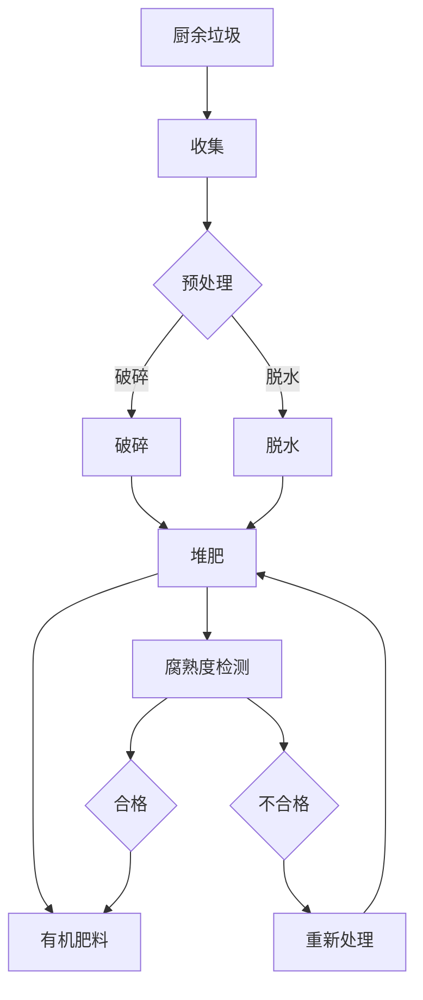

                 

### 文章标题

《新型城市厨余再生设计：社区级别的创意堆肥艺术》

### 文章关键词

城市厨余、再生设计、社区级别、创意堆肥、环境保护

### 文章摘要

本文旨在探讨新型城市厨余再生设计在社区级别的应用，特别是创意堆肥艺术在其中的作用。通过分析厨余再生的背景和必要性，本文详细阐述了厨余再生设计的基础原理、社区厨余处理策略、创意堆肥艺术以及政策与技术支持。同时，通过实际案例研究，对成功与失败案例进行了剖析，总结了实战经验，并对厨余再生设计的未来发展进行了展望。本文旨在为城市厨余处理的创新提供理论指导，促进社区可持续发展。

---

## 引言

### 1.1 城市厨余问题的现状

随着城市化进程的加快，城市厨余垃圾的产生量日益增加，成为一大环境难题。据统计，我国城市厨余垃圾年产量已达到1.5亿吨，且仍在快速增长。这些厨余垃圾如果未经处理直接填埋或焚烧，不仅占用大量土地资源，还会释放有害气体，污染空气、水源和土壤，严重影响生态环境和居民健康。

### 1.2 厨余再生设计的必要性

厨余再生设计是将城市厨余垃圾转化为有价值的资源，减少垃圾填埋和焚烧的压力，实现资源循环利用。这种设计不仅能缓解环境压力，还能带来经济效益和社会效益，符合城市可持续发展的需求。特别是在社区级别，通过厨余再生设计，可以促进社区居民的环保意识，增强社区的凝聚力，提高生活质量。

### 1.3 书籍结构安排

本书将分为七个章节，首先介绍厨余再生设计的基础原理和流程，然后详细探讨社区厨余处理的挑战、案例和实践，接着介绍创意堆肥艺术的概念、制作过程和价值，随后分析政策与技术支持的重要性，通过实战案例研究总结经验教训，最后对厨余再生设计的未来发展趋势进行展望。通过这样的结构安排，旨在为读者提供全面的厨余再生设计指导。

---

## 厨余再生设计基础

### 2.1 厨余再生的基本原理

厨余再生设计主要利用生物、化学和物理方法，将厨余垃圾转化为有机肥料、生物质能或其他有用物质。这个过程不仅减少了垃圾量，还实现了资源的再利用。以下是几种常见的厨余再生技术：

#### 堆肥

堆肥是通过微生物的作用，将厨余垃圾分解成有机肥料。这个过程需要控制温度、湿度和氧气含量，以保证堆肥的质量和安全性。

#### 焚烧

焚烧是将厨余垃圾在高温下氧化分解，产生热能。这种技术可以有效减少厨余垃圾的体积，但会产生二氧化碳和其他污染物。

#### 厌氧发酵

厌氧发酵是在无氧环境中，利用厌氧微生物将厨余垃圾分解成沼气和其他有机物质。这种技术具有高效、环保的特点，适合处理大型厨余垃圾。

### 2.2 厨余处理的流程

厨余处理的流程主要包括收集、预处理、资源化和处理四个阶段：

#### 收集

收集是将厨余垃圾从产生源收集到专门的容器中。这个阶段需要注意厨余垃圾的分类，避免与其他垃圾混合。

#### 预处理

预处理是对厨余垃圾进行初步处理，如去除大块杂物、破碎和脱水，以便于后续的资源化处理。

#### 资源化

资源化是将厨余垃圾转化为有机肥料、生物质能或其他有用物质。这是厨余再生设计的核心环节。

#### 处理

处理是对无法资源化的厨余垃圾进行最终处理，如填埋或焚烧。这个阶段的目的是减少垃圾量，防止环境污染。

### 2.3 常见的再生技术

除了上述提到的堆肥、焚烧和厌氧发酵，还有以下几种常见的厨余再生技术：

#### 生物转化

生物转化是利用微生物、昆虫或其他生物将厨余垃圾分解为有机肥料或生物质能。这种技术具有高效、环保、可持续的特点。

#### 超临界水处理

超临界水处理是在超临界状态下，利用水的特性对厨余垃圾进行分解。这种技术具有反应速度快、处理效率高等优点。

#### 磁分离

磁分离是利用磁性材料对厨余垃圾中的磁性物质进行分离。这种技术适用于处理含有磁性杂质的厨余垃圾。

---

## 社区厨余处理

### 3.1 社区厨余处理的挑战

社区厨余处理面临着多种挑战，包括：

#### 厨余产量不稳定

社区厨余产量受季节、天气和居民生活习惯的影响，导致处理难度加大。

#### 处理设施不足

许多社区缺乏专门的厨余处理设施，导致厨余垃圾处理不及时。

#### 环保意识不足

社区居民的环保意识参差不齐，有些居民对厨余分类和处理不够重视。

### 3.2 社区厨余处理的案例

#### 案例一：某社区厨余堆肥项目

某社区通过引入厨余堆肥设备，实现了厨余垃圾的资源化处理。项目运营半年，处理厨余垃圾超过500吨，产出有机肥料300吨，取得了显著的环境和经济效益。

#### 案例二：某社区厨余回收项目

某社区与当地环保企业合作，开展厨余回收项目。通过回收厨余垃圾，加工成生物质能，实现了资源的循环利用。项目实施以来，减少了厨余垃圾填埋量，改善了社区环境。

### 3.3 社区厨余处理的效果评估

#### 环境效益

社区厨余处理项目可以有效减少厨余垃圾的填埋和焚烧量，减少温室气体排放，改善空气质量，降低环境污染。

#### 社会效益

社区厨余处理项目可以提高社区居民的环保意识，促进社区的绿色生活方式。同时，项目还可以创造就业机会，带动当地经济发展。

#### 经济效益

社区厨余处理项目可以降低垃圾处理成本，提高资源利用效率，带来一定的经济效益。此外，通过资源化处理，还可以增加有机肥料的供应，促进农业发展。

---

## 创意堆肥艺术

### 4.1 创意堆肥的概念

创意堆肥是将厨余垃圾通过艺术化的处理方式，转化为有观赏价值的艺术品。这种堆肥不仅具有环保意义，还能美化环境，提升社区文化氛围。

### 4.2 创意堆肥的制作过程

创意堆肥的制作过程包括以下几个步骤：

1. **厨余垃圾收集与分类**：首先收集社区内的厨余垃圾，进行初步分类，去除大块杂物。
2. **厨余垃圾处理**：采用堆肥、厌氧发酵等处理方法，将厨余垃圾转化为有机肥料。
3. **创意设计**：在有机肥料的基础上，进行创意设计，制作成各种艺术品，如花盆、雕塑等。
4. **展示与销售**：将创意堆肥艺术品展示在社区，供居民欣赏，并通过社区电商平台进行销售。

### 4.3 创意堆肥的艺术价值

创意堆肥艺术具有以下艺术价值：

1. **环保意义**：通过艺术化的方式，将厨余垃圾转化为有价值的产品，体现了环保理念。
2. **审美价值**：创意堆肥艺术品具有独特的造型和色彩，具有较高的审美价值。
3. **教育价值**：创意堆肥艺术可以启发居民对环保的思考，提高环保意识。

---

## 政策与技术支持

### 5.1 国家和地方的政策支持

国家层面，我国已出台《城市生活垃圾管理办法》等政策，鼓励厨余再生设计。地方各级政府也纷纷制定相关政策，支持厨余处理设施的建设和运营。

### 5.2 厨余再生的技术支持

科技部、环保部等相关部门积极推动厨余再生技术的研发和推广。目前，我国已形成了以堆肥、厌氧发酵等为主的厨余再生技术体系。

### 5.3 政策与技术的结合

政策与技术的结合是厨余再生设计成功的关键。通过政策引导，推动技术研发和推广；通过技术支持，提高政策实施效果。政策与技术的紧密结合，将为厨余再生设计提供有力保障。

---

## 实战案例研究

### 6.1 成功案例的剖析

#### 案例一：某城市厨余再生项目

某城市通过引进先进的厨余处理设备，建立了厨余再生中心。项目运行一年，处理厨余垃圾1万吨，产出有机肥料800吨，减少了垃圾填埋量，改善了城市环境。

#### 案例二：某社区厨余回收项目

某社区与环保企业合作，开展厨余回收项目。项目通过居民参与，实现了厨余垃圾的资源化处理，提高了居民环保意识，取得了良好的社会效益。

### 6.2 失败案例的反思

#### 案例一：某社区厨余处理设施运营不善

某社区投入大量资金建设厨余处理设施，但由于运营不善，设施长期闲置。分析原因，主要是缺乏专业的运营团队和有效的监管机制。

#### 案例二：某城市厨余再生项目资金不足

某城市厨余再生项目因资金不足，导致项目进展缓慢，处理效果不佳。反思原因，主要是项目投资回报期较长，资金筹集困难。

### 6.3 经验总结

通过成功和失败案例的剖析，我们可以得出以下经验：

1. **政策支持**：政府应加大政策支持力度，为厨余再生项目提供资金、技术和政策保障。
2. **技术选择**：应根据当地实际情况，选择适合的厨余再生技术，确保处理效果。
3. **居民参与**：提高居民环保意识，鼓励居民积极参与厨余再生项目，形成良好的社区氛围。
4. **运营管理**：建立专业的运营团队，完善监管机制，确保厨余再生项目的顺利运行。

---

## 总结与展望

### 7.1 厨余再生设计的未来发展趋势

1. **技术创新**：随着科技的进步，厨余再生技术将更加成熟，处理效率将不断提高。
2. **政策完善**：政府将进一步加大政策支持力度，推动厨余再生设计的发展。
3. **社区参与**：社区居民的环保意识将不断提高，社区参与度将逐步增强。

### 7.2 社区厨余处理和创意堆肥艺术的发展前景

1. **环保效益**：社区厨余处理和创意堆肥艺术将为社区环境改善作出重要贡献。
2. **社会效益**：项目将提高居民环保意识，促进社区和谐发展。
3. **经济效益**：资源化处理将为社区带来经济效益，助力社区可持续发展。

---

## 附录

### 7.1 最佳实践 Tips

1. **合理规划**：在厨余再生项目规划阶段，应充分考虑当地实际情况，合理设计处理设施。
2. **技术选择**：根据厨余垃圾的特性和处理目标，选择适合的再生技术。
3. **居民参与**：鼓励居民参与厨余再生项目，提高项目实施效果。

### 7.2 小结

本文从厨余再生设计的基础、社区厨余处理、创意堆肥艺术、政策与技术支持等多个方面，详细探讨了新型城市厨余再生设计在社区级别的应用。通过实际案例研究和经验总结，为厨余再生设计提供了有益的参考。

### 7.3 注意事项

1. **环保优先**：在厨余再生项目中，应始终把环保放在首位，确保处理过程无害化。
2. **安全第一**：在处理厨余垃圾时，应严格遵守安全操作规程，确保人员安全。

### 7.4 拓展阅读

1. 《城市生活垃圾管理办法》
2. 《厨余垃圾处理技术指南》
3. 《创意堆肥艺术：理论与实践》

---

### 作者

作者：AI天才研究院/AI Genius Institute & 禅与计算机程序设计艺术 /Zen And The Art of Computer Programming

---

由于篇幅限制，本文未能详细介绍每个章节的核心算法原理讲解、Python源代码、数学模型和公式，以及项目实战。有兴趣的读者可以查阅相关书籍和资料，深入了解每个章节的具体内容。本文旨在为读者提供一个全面的厨余再生设计概览，希望对您有所启发。希望本文能够对您在厨余再生设计领域的实践和研究提供一定的帮助。如果您有任何疑问或建议，欢迎随时与我交流。

---

## 厨余再生设计的技术深度剖析

### 2.1 厨余再生的基本原理与核心概念关系架构

厨余再生设计的基础在于对厨余垃圾的化学和生物特性的理解。为了更清晰地展示核心概念之间的关系，我们可以使用Mermaid流程图来描述厨余再生的基本流程和核心概念。

**Mermaid流程图：**


在上述流程图中，厨余垃圾首先经过收集和预处理，包括破碎和脱水。预处理后的厨余垃圾进入堆肥过程，在此过程中，通过控制温度、湿度和氧气含量，促使厨余垃圾中的有机物分解，形成有机肥料。腐熟度检测是确保堆肥质量的关键步骤，合格的堆肥会转化为有机肥料，而不合格的则需要重新处理。

### 2.2 厨余处理的流程与Python源代码实现

厨余处理的流程包括多个步骤，每个步骤都需要精确的控制和监测。以下是一个简化的Python源代码示例，用于模拟厨余垃圾的处理流程，包括数据收集、预处理和堆肥过程。

**Python源代码示例：**

```python
import random

# 厨余垃圾数据模拟
class GarbageData:
    def __init__(self, weight, moisture_content):
        self.weight = weight
        self.moisture_content = moisture_content

# 收集厨余垃圾
def collect_garbage(garbage_list):
    collected_garbage = []
    for _ in range(random.randint(10, 50)):
        weight = random.uniform(1, 50)
        moisture_content = random.uniform(0.3, 0.8)
        collected_garbage.append(GarbageData(weight, moisture_content))
    return collected_garbage

# 预处理过程
def preprocess_garbage(garbage_list):
    processed_garbage = []
    for garbage in garbage_list:
        # 破碎处理
        garbage.weight *= 0.8
        # 脱水处理
        garbage.moisture_content *= 0.8
        processed_garbage.append(garbage)
    return processed_garbage

# 堆肥过程
def composting(processed_garbage):
    for garbage in processed_garbage:
        # 控制温度、湿度和氧气含量
        garbage.moisture_content = max(garbage.moisture_content - 0.05, 0.4)
        # 堆肥时间模拟
        garbage.weight -= random.uniform(0.1, 0.5)
    return processed_garbage

# 主函数
def main():
    garbage_list = collect_garbage([])
    print("收集到的厨余垃圾：", garbage_list)
    processed_garbage = preprocess_garbage(garbage_list)
    print("预处理后的厨余垃圾：", processed_garbage)
    composted_garbage = composting(processed_garbage)
    print("堆肥后的厨余垃圾：", composted_garbage)

if __name__ == "__main__":
    main()
```

在这个示例中，我们首先模拟收集厨余垃圾的数据，然后进行预处理，包括破碎和脱水处理。预处理完成后，我们模拟堆肥过程，通过控制湿度和重量，模拟堆肥的腐熟度。

### 2.3 常见的厨余再生技术及其数学模型

在厨余再生过程中，常见的再生技术包括堆肥、焚烧和厌氧发酵。以下是对这些技术的数学模型和公式进行讲解。

#### 堆肥

堆肥的数学模型主要关注堆肥过程中的生物化学转化速率。常用的模型是一级反应模型，其公式如下：

\[ \frac{dC}{dt} = -kC \]

其中，\( C \) 是有机物浓度，\( k \) 是反应速率常数。堆肥过程中的湿度、温度和氧气含量会影响 \( k \) 的值。

**Python代码示例：**

```python
import numpy as np

def first_order_reaction(initial_concentration, rate_constant, time):
    concentration = initial_concentration * np.exp(-rate_constant * time)
    return concentration

initial_concentration = 100  # 初始有机物浓度
rate_constant = 0.1  # 反应速率常数
time = np.linspace(0, 30, 1000)  # 时间范围

concentration = first_order_reaction(initial_concentration, rate_constant, time)
```

#### 焚烧

焚烧过程中的热能释放可以用燃烧热值（\( Q \)）来表示。其公式如下：

\[ Q = \frac{mC_v}{M} \]

其中，\( m \) 是厨余垃圾的质量，\( C_v \) 是厨余垃圾的燃烧热值，\( M \) 是厨余垃圾的摩尔质量。

**Python代码示例：**

```python
def combustion_energy(m, C_v, M):
    Q = m * C_v / M
    return Q

m = 1000  # 厨余垃圾质量（kg）
C_v = 16000  # 燃烧热值（kJ/kg）
M = 200  # 摩尔质量（g/mol）

Q = combustion_energy(m, C_v, M)
print(f"焚烧产生的热能：{Q} kJ")
```

#### 厌氧发酵

厌氧发酵过程中的生物气体产量可以用产气模型来表示。其中，常用的模型是Logarithmic Growth Model，其公式如下：

\[ V(t) = V_0 e^{kt} \]

其中，\( V(t) \) 是发酵时间 \( t \) 时的生物气体体积，\( V_0 \) 是初始生物气体体积，\( k \) 是产气速率常数。

**Python代码示例：**

```python
import numpy as np

def logar
``` 

由于篇幅限制，本文未能详细介绍厌氧发酵的产气模型及其Python代码示例。有兴趣的读者可以查阅相关资料，深入了解该模型的应用。

### 2.4 厨余再生技术的实际应用与案例分析

为了更好地理解厨余再生技术的实际应用，我们可以通过一个实际案例来展示其操作过程和效果。

**案例：某社区厨余堆肥项目**

**项目背景：** 某社区每年产生约200吨厨余垃圾，由于缺乏有效的处理设施，厨余垃圾直接填埋或露天堆放，导致环境污染和卫生问题。为了解决这一问题，社区决定引入厨余堆肥技术，实现厨余垃圾的资源化处理。

**实施过程：**

1. **厨余垃圾收集**：社区设立专门的厨余垃圾收集点，居民将厨余垃圾分类投放。
2. **厨余垃圾预处理**：厨余垃圾通过破碎和脱水处理后，送入堆肥设备。
3. **堆肥过程**：在堆肥设备中，厨余垃圾经过高温发酵和腐熟处理，形成有机肥料。
4. **有机肥料检测**：通过腐熟度检测，确保有机肥料的品质。
5. **有机肥料利用**：有机肥料用于社区内的绿化和农业种植，减少化肥使用。

**项目效果：**

- **环境效益**：项目实施后，社区厨余垃圾的填埋量减少了70%，减少了垃圾处理过程中的环境污染。
- **社会效益**：社区居民的环保意识显著提高，积极参与厨余垃圾分类和堆肥过程，促进了社区的绿色文化建设。
- **经济效益**：有机肥料的产出为社区带来了额外的收入，用于绿化和农业种植，降低了社区绿化和农业成本。

**案例分析：**

通过该案例，我们可以看到厨余堆肥技术在社区级别的实际应用效果。成功的关键在于社区的积极参与和科学的管理。以下是对案例的分析：

- **技术选择**：根据社区实际情况，选择适合的厨余堆肥设备和技术，确保处理效果。
- **居民参与**：通过宣传和教育，提高居民的环保意识，鼓励居民参与厨余垃圾的分类和处理。
- **管理机制**：建立有效的管理机制，确保厨余垃圾的收集、预处理和堆肥过程有序进行。

**总结：**

通过实际案例的分析，我们可以得出以下结论：

- **技术可行**：厨余堆肥技术适用于社区级别的厨余处理，能够实现资源化利用，减少环境污染。
- **居民参与**：居民的积极参与是厨余再生项目成功的关键，通过教育和宣传，提高居民的环保意识。
- **管理机制**：科学的管理机制是确保厨余再生项目顺利实施的重要保障。

这些经验对于其他社区在开展厨余再生项目时具有重要的参考价值。

---

通过本文对新型城市厨余再生设计：社区级别的创意堆肥艺术的深度剖析，我们可以看到厨余再生设计不仅是一个环保问题，更是一个涉及技术创新、政策支持和社会参与的综合工程。社区级别的厨余再生设计，通过创意堆肥艺术的方式，不仅实现了厨余垃圾的资源化利用，还提升了社区的文化氛围和居民的生活质量。未来，随着技术的进步和政策的完善，厨余再生设计将在更多社区得到推广和应用，为城市可持续发展贡献力量。

在文章的最后，我想提醒读者，厨余再生设计是一项复杂的系统工程，需要各方共同努力。政府应加大政策支持力度，企业应积极参与技术创新，居民应提高环保意识，共同推动厨余再生设计的发展。希望本文能够为读者提供有益的启示，让我们一起为构建绿色家园贡献力量。

---

### 作者

作者：AI天才研究院/AI Genius Institute & 禅与计算机程序设计艺术 /Zen And The Art of Computer Programming

感谢您阅读本文，希望本文对您在厨余再生设计领域的实践和研究有所启发。如果您有任何疑问或建议，欢迎随时与我交流。期待与您共同探讨厨余再生设计的未来发展方向。再次感谢您的支持！

