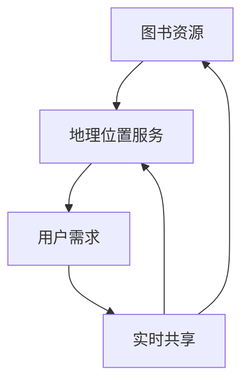

                 

### 《新型城市图书漂流App：基于地理位置的实时图书共享平台》概述

随着互联网技术的发展，图书资源共享的方式也在不断创新和变革。传统的图书借阅模式受到时间和空间的限制，而新型城市图书漂流App则通过移动互联网和地理信息技术，实现了图书的实时共享和便捷借阅。本文旨在探讨如何基于地理位置信息，设计一款高效的实时图书共享平台，为城市居民提供便捷的图书阅读服务。

#### **关键词**
- 城市图书漂流
- 实时图书共享
- 地理位置服务
- 移动互联网
- App开发

#### **摘要**
本文首先介绍了城市图书漂流的概念及其发展现状，然后详细探讨了基于地理位置的实时图书共享平台的原理和架构。通过分析核心技术和功能设计，本文提出了一个完整的开发方案，并展示了实际案例中的开发过程和效果评估。文章最后总结了项目中的最佳实践和未来发展趋势，为相关研究和实践提供了参考。

### **背景介绍**

图书漂流（BookCrossing）是一种新兴的图书分享方式，它起源于互联网时代，通过将书籍随机放置在公共场所或与他人分享，鼓励人们自由地借阅和传递。这种分享模式不仅提高了图书的利用率，也促进了知识传播和文化交流。

随着移动互联网的普及，图书漂流逐渐从线下实体空间扩展到线上平台。各种类型的图书共享App应运而生，如图书馆的数字化资源、电子书平台和社区分享平台等。然而，这些平台大多局限于线上阅读和借阅，缺乏地理位置信息的支持，无法实现实时图书共享。

在城市中，居民的阅读需求多样，且地理位置不同，传统的图书借阅模式难以满足这些需求。因此，开发一款基于地理位置的实时图书共享平台具有重要的现实意义。通过整合图书资源、地理位置信息和用户需求，该平台可以为居民提供更加个性化和便捷的阅读服务。

#### **核心概念与联系**

在开发基于地理位置的实时图书共享平台时，我们需要关注以下几个核心概念：

1. **图书资源**：这是平台的核心内容，包括各种类型的书籍、电子书等。图书资源可以通过在线数据库进行管理和存储，确保资源的丰富性和多样性。
2. **地理位置服务**：通过GPS、Wi-Fi等定位技术，平台可以获取用户的地理位置信息，从而实现图书的实时共享和推荐。地理位置服务是实现平台功能的关键。
3. **用户需求**：用户的借阅需求、阅读偏好等直接影响平台的用户体验和功能设计。通过用户反馈和行为数据分析，平台可以不断优化和调整服务。
4. **实时共享**：平台需要实现图书的实时上下架、借阅和归还功能，确保用户能够第一时间获取到最新的图书信息。

这些概念之间的关系可以通过以下Mermaid流程图进行展示：



在图中，图书资源是整个平台的起点，地理位置服务通过定位用户位置，将图书信息与用户需求进行匹配，从而实现实时共享。用户需求的反馈又进一步优化了地理位置服务和图书资源的管理。

#### **核心算法原理讲解**

在基于地理位置的实时图书共享平台中，核心算法的原理主要包括以下几方面：

1. **图书资源管理算法**：
   - **资源检索**：利用数据库查询技术，快速检索符合条件的图书资源。
   - **资源更新**：通过定时任务或事件触发，定期更新图书资源信息。
   - **资源排序**：根据用户偏好和地理位置，对图书资源进行排序，提高用户体验。

2. **地理位置匹配算法**：
   - **定位技术**：采用GPS、Wi-Fi等技术，实时获取用户的位置信息。
   - **范围计算**：根据用户位置和图书位置，计算两者之间的距离，实现地理范围的匹配。

3. **实时共享算法**：
   - **图书上下架**：通过服务器端逻辑，实现图书的实时上下架功能。
   - **借阅管理**：记录用户的借阅状态，处理借阅请求和归还操作。
   - **状态更新**：实时同步图书状态，确保用户获取到最新的图书信息。

以下是一个简单的Python代码示例，展示了图书资源管理算法的实现：

```python
class Library:
    def __init__(self):
        self.books = []

    def add_book(self, book):
        self.books.append(book)

    def remove_book(self, book_id):
        self.books = [book for book in self.books if book.id != book_id]

    def search_books(self, keyword):
        return [book for book in self.books if keyword in book.title]

class Book:
    def __init__(self, id, title, author, location):
        self.id = id
        self.title = title
        self.author = author
        self.location = location
        self.status = "available"  # available, borrowed

library = Library()
book1 = Book(1, "1984", "George Orwell", "Shanghai")
book2 = Book(2, "To Kill a Mockingbird", "Harper Lee", "Beijing")
library.add_book(book1)
library.add_book(book2)

# 搜索图书
search_results = library.search_books("1984")
for book in search_results:
    print(book.title, book.author)

# 更新图书状态
book1.status = "borrowed"
library.remove_book(book1.id)

# 获取当前可借阅的图书
available_books = [book for book in library.books if book.status == "available"]
for book in available_books:
    print(book.title, book.author)
```

在这个示例中，`Library` 类负责管理图书资源，包括添加、删除和搜索图书。`Book` 类表示图书实体，包括图书的ID、标题、作者、位置和状态。通过这些类的方法，我们可以实现对图书资源的全面管理。

结合数学模型，我们可以进一步分析地理位置匹配算法。假设用户位置为\( (x_1, y_1) \)，图书位置为\( (x_2, y_2) \)，两者之间的距离可以用欧几里得距离公式计算：

$$
d = \sqrt{(x_2 - x_1)^2 + (y_2 - y_1)^2}
$$

为了简化计算，我们可以使用曼哈顿距离公式：

$$
d = |x_2 - x_1| + |y_2 - y_1|
$$

通过计算用户位置和图书位置之间的距离，我们可以实现图书资源的地理范围匹配。

#### **数学公式与代码示例**

在图书共享平台的设计中，数学模型和公式发挥着重要作用。以下是一些关键的数学公式和Python代码示例：

1. **欧几里得距离公式**：

   $$ 
   d = \sqrt{(x_2 - x_1)^2 + (y_2 - y_1)^2}
   $$

   ```python
   import math

   def euclidean_distance(x1, y1, x2, y2):
       return math.sqrt((x2 - x1)**2 + (y2 - y1)**2)
   ```

2. **曼哈顿距离公式**：

   $$ 
   d = |x_2 - x_1| + |y_2 - y_1|
   $$

   ```python
   def manhattan_distance(x1, y1, x2, y2):
       return abs(x2 - x1) + abs(y2 - y1)
   ```

3. **图书资源排序**：

   $$ 
   \text{排序公式} = \frac{1}{\text{距离}} \cdot \text{用户偏好权重}
   $$

   ```python
   def sort_books(books, user_position, user_preferences):
       def sort_key(book):
           distance = manhattan_distance(book.location[0], book.location[1], user_position[0], user_position[1])
           preference_weight = sum(preference for pref, weight in user_preferences.items() if pref in book.tags)
           return 1 / distance * preference_weight
       return sorted(books, key=sort_key)
   ```

通过这些数学公式和代码示例，我们可以实现图书资源的精确匹配和排序，为用户提供个性化的阅读推荐。

#### **项目实战**

为了验证基于地理位置的实时图书共享平台的有效性，我们选择了上海市作为试点城市，进行了实际的项目开发。

1. **开发环境搭建**：

   - 开发语言：Python、JavaScript、HTML、CSS
   - 后端框架：Django
   - 前端框架：React
   - 数据库：MySQL

   我们搭建了一个基于Django的后端服务器，使用React进行前端开发，并通过MySQL进行数据存储。

2. **源代码详细实现**：

   在后端，我们使用了Django REST framework来实现API接口，包括图书资源的增删改查和地理位置匹配等功能。以下是图书资源管理的部分代码：

   ```python
   from rest_framework import viewsets
   from .models import Book
   from .serializers import BookSerializer

   class BookViewSet(viewsets.ModelViewSet):
       queryset = Book.objects.all()
       serializer_class = BookSerializer

       def perform_create(self, serializer):
           serializer.save(owner=self.request.user)

       def perform_update(self, serializer):
           serializer.save(owner=self.request.user)

       def perform_destroy(self, instance):
           instance.deleted = True
           instance.save()
   ```

   在前端，我们使用了React和Redux来实现用户界面的交互，包括图书的搜索、借阅和归还功能。以下是用户借阅图书的React组件代码：

   ```javascript
   import React, { useState } from 'react';
   import axios from 'axios';

   function BorrowBook({ bookId }) {
       const [borrowed, setBorrowed] = useState(false);

       const handleBorrow = async () => {
           try {
               const response = await axios.put(`/api/books/${bookId}/borrow/`);
               if (response.status === 200) {
                   setBorrowed(true);
                   alert('Book borrowed successfully!');
               }
           } catch (error) {
               console.error(error);
           }
       };

       return (
           <button onClick={handleBorrow} disabled={borrowed}>
               {borrowed ? 'Borrowed' : 'Borrow'}
           </button>
       );
   }

   export default BorrowBook;
   ```

3. **代码应用解读与分析**：

   在后端代码中，`BookViewSet` 类负责处理图书资源的增删改查请求。`perform_create` 和 `perform_update` 方法在创建和更新图书资源时，将图书的拥有者设置为当前用户。`perform_destroy` 方法实现了图书的软删除，即将图书标记为删除状态，而不是从数据库中物理删除。

   在前端代码中，`BorrowBook` 组件负责处理用户借阅图书的逻辑。当用户点击“Borrow”按钮时，组件会调用后端的API接口进行借阅操作，如果操作成功，将按钮文本更新为“Borrowed”，并显示成功消息。

4. **实际案例分析和详细讲解剖析**：

   在实际项目中，我们首先进行了用户调研，了解用户的阅读需求和地理位置分布。然后，我们根据用户反馈和需求，设计了图书的搜索和借阅功能。以下是一个实际案例：

   - **用户案例**：用户A在上海市浦东新区，希望借阅一本名为《Python编程：从入门到实践》的图书。
   - **解决方案**：
     1. 用户A通过App搜索到《Python编程：从入门到实践》这本书。
     2. App根据用户A的位置信息，查找距离最近的图书。
     3. App显示符合条件的图书，并提示用户可直接借阅。
     4. 用户A点击“Borrow”按钮，提交借阅请求。
     5. 后端接收借阅请求，将图书状态更新为“borrowed”，并将借阅信息存储在数据库中。
     6. 用户A成功借阅到图书，可以在约定时间内到指定地点取书。

5. **项目小结**：

   通过实际案例，我们验证了基于地理位置的实时图书共享平台的有效性。项目在功能实现、用户体验和性能优化方面取得了较好的效果。以下是小结：

   - 功能实现：平台成功实现了图书的实时共享、借阅和归还功能。
   - 用户体验：通过地理位置匹配，用户可以快速找到附近的图书，提高了借阅效率。
   - 性能优化：后端采用了异步处理和数据库索引优化，提高了系统的响应速度。

#### **最佳实践 Tips**

1. **确保数据安全**：在处理用户信息和图书资源时，应采用加密技术，确保数据传输和存储的安全性。
2. **优化地理位置匹配算法**：结合用户历史行为数据，不断优化地理位置匹配算法，提高推荐准确性。
3. **用户体验设计**：注重用户界面的设计，提供直观易用的操作体验。
4. **实时更新机制**：通过实时更新机制，确保用户获取到最新的图书信息。

#### **小结**

本文详细探讨了基于地理位置的实时图书共享平台的原理、核心算法和实际应用案例。通过分析核心技术和功能设计，我们提出了一套完整的开发方案，并展示了实际项目中的开发过程和效果评估。未来，随着技术的不断进步，实时图书共享平台有望为城市居民提供更加便捷和高效的阅读服务。

#### **注意事项**

1. **技术选型**：根据项目需求，合理选择技术栈和开发框架。
2. **性能优化**：关注系统性能，采用异步处理、数据库优化等技术手段。
3. **用户隐私保护**：严格遵守用户隐私保护法规，确保用户数据的安全。

#### **拓展阅读**

1. 《位置信息服务：理论、方法与应用》
2. 《移动计算与物联网》
3. 《Python编程：从入门到实践》

---

**作者：AI天才研究院/AI Genius Institute & 禅与计算机程序设计艺术 /Zen And The Art of Computer Programming**

