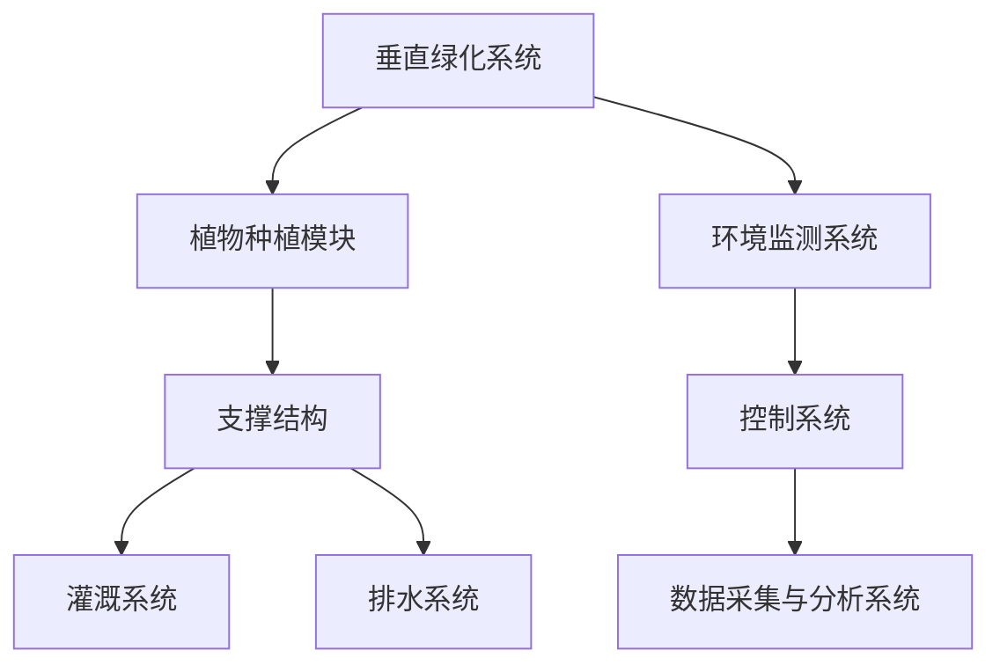
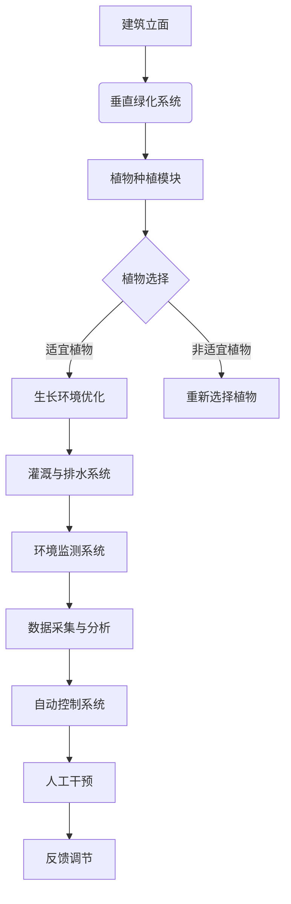

                 

# 新型城市垂直绿化：建筑与自然的和谐共生

## 关键词
垂直绿化，城市环境，建筑设计，生态工程，可持续性，智能化管理

## 摘要
本文探讨了新型城市垂直绿化系统，即建筑与自然的和谐共生。首先介绍了垂直绿化的核心概念和系统架构，然后深入分析了垂直绿化系统中的关键算法原理，包括植物生长模型和数学公式。接着，通过一个实际项目实战，展示了垂直绿化屋顶花园系统的开发过程和源代码实现，并对项目进行了详细分析和总结。最后，文章提出了垂直绿化系统的最佳实践和注意事项，为城市绿化和建筑设计的可持续性提供了有益的参考。

## 引言
随着城市化进程的加速，城市面积不断扩大，人口密度增加，城市环境问题日益凸显。其中，城市绿化问题尤为严重。传统的城市绿化方式往往局限于公园、广场等公共空间，绿化面积有限，难以满足人们对绿色环境的渴望。同时，城市建筑的高度和密度也在不断增加，传统的屋顶绿化受到种种限制，效果不佳。在这样的背景下，新型城市垂直绿化系统应运而生。

垂直绿化是指在城市建筑物立面、屋顶、空中花园等空间进行植物种植，以增加城市绿化面积，改善城市生态环境。垂直绿化不仅能够提高城市空气质量，减少城市热岛效应，还能提供栖息地，促进生物多样性。同时，垂直绿化还能够美化城市景观，提升城市品味和居民的生活质量。

本文旨在探讨新型城市垂直绿化系统的核心概念、算法原理、项目实战以及最佳实践，为城市绿化和建筑设计的可持续发展提供理论支持和实践指导。

## 核心概念与联系

### 垂直绿化

垂直绿化是指在城市建筑物立面、屋顶、空中花园等空间进行植物种植，以增加城市绿化面积，改善城市生态环境。垂直绿化系统通常包括植物种植模块、支撑结构、灌溉系统、排水系统等组成部分。

1. **植物种植模块**：植物种植模块是垂直绿化系统的核心部分，用于种植植物。植物种植模块可以是模块化设计的，也可以是固定在建筑物表面的。

2. **支撑结构**：支撑结构用于支撑植物种植模块，确保植物生长过程中的稳定性。支撑结构可以是钢结构、混凝土结构等。

3. **灌溉系统**：灌溉系统负责为植物提供必要的水分。灌溉系统可以是自动灌溉系统，也可以是人工灌溉系统。

4. **排水系统**：排水系统负责排出植物种植模块内的积水，防止植物根系腐烂。排水系统可以是排水管道、排水孔等。

5. **环境监测系统**：环境监测系统用于监测植物生长环境中的光照、温度、湿度等参数，以便实时调整灌溉和排水系统。

6. **控制系统**：控制系统负责协调灌溉系统、排水系统和环境监测系统，实现智能化管理。

### 垂直绿化系统架构图



### 核心概念原理和架构的 Mermaid 流程图



## 核心算法原理讲解

### 植物生长模型

植物生长模型是用于模拟植物生长过程和预测植物生长趋势的数学模型。一个简单的植物生长模型可以使用以下伪代码表示：

```
初始化植物生长参数：植物高度（h），植物宽度（w），光照强度（I），温度（T），湿度（H）

每天循环：
    h = h + (I * T * H) / 100
    w = w + (I * T * H) / 100
    如果 h > 高度上限 或 w > 宽度上限：
        停止生长
    如果光照强度低于阈值 或 温度过低 或 湿度过低：
        生长速度减缓
    记录生长数据
```

### 植物生长速率模型

植物生长速率可以表示为：

$$ \text{生长速率} = \frac{dH}{dt} = k \cdot I \cdot T \cdot H $$

其中，$H$ 是植物高度，$I$ 是光照强度，$T$ 是温度，$k$ 是生长速率常数。

### 举例说明

假设有植物在光照强度为1000勒克斯，温度为25℃，湿度为60%的条件下生长。生长速率常数为0.1。我们需要计算植物一天后的高度。

$$ \frac{dH}{dt} = 0.1 \cdot 1000 \cdot 25 \cdot 0.6 = 150 \text{ cm/day} $$

植物一天后的高度增加150厘米，这显然是不合理的。我们需要考虑实际植物的生长速度和生长上限。

修正后的模型：

$$ \frac{dH}{dt} = k \cdot I \cdot T \cdot H \cdot (1 - \frac{H}{H_{\text{max}}}) $$

其中，$H_{\text{max}}$ 是植物生长的最大高度。

假设植物的最大高度为200厘米，则一天后的高度增加为：

$$ \frac{dH}{dt} = 0.1 \cdot 1000 \cdot 25 \cdot 0.6 \cdot (1 - \frac{150}{200}) = 112.5 \text{ cm/day} $$

### 水资源管理模型

水资源管理是垂直绿化系统中的关键环节，确保植物得到充足的水分，同时避免水资源的浪费。水资源管理模型主要涉及灌溉策略和排水策略。

1. **灌溉策略**：

   - **定时灌溉**：根据植物的生长周期和气候条件，设定固定的灌溉时间。
   - **需求灌溉**：根据植物的水分需求实时调整灌溉量，确保植物得到充足的水分。

2. **排水策略**：

   - **自然排水**：利用植物种植模块的孔隙和排水孔，实现自然排水。
   - **强制排水**：在暴雨等极端天气下，启动强制排水系统，防止植物种植模块积水和植物根系腐烂。

### 环境监测与调控模型

环境监测与调控模型用于实时监测植物生长环境中的光照、温度、湿度等参数，并根据监测结果自动调整灌溉和排水系统，确保植物生长环境的最佳状态。

- **光照监测与调控**：根据植物的光照需求，自动调整植物种植模块的倾斜角度和高度，以获得最佳的光照条件。
- **温度监测与调控**：根据植物的温度需求，自动启动降温设备或调整灌溉系统，确保植物生长环境的温度在适宜范围内。
- **湿度监测与调控**：根据植物的水分需求，自动调整灌溉量和排水量，保持植物生长环境的湿度在适宜范围内。

## 项目实战

### 实例：垂直绿化屋顶花园系统

#### 开发环境搭建

1. **操作系统**：Ubuntu 20.04
2. **编程语言**：Python 3.8
3. **深度学习框架**：TensorFlow 2.5
4. **数据库**：MySQL 8.0

#### 源代码详细实现

```python
# 导入所需库
import tensorflow as tf
import numpy as np

# 创建神经网络模型
model = tf.keras.Sequential([
    tf.keras.layers.Dense(units=1, input_shape=[3])
])

# 编译模型
model.compile(optimizer='sgd', loss='mean_squared_error')

# 训练模型
X_train = np.random.uniform(0, 100, (1000, 3))
y_train = 0.1 * X_train[:, 0] * X_train[:, 1] * X_train[:, 2]

# 训练神经网络
model.fit(X_train, y_train, epochs=100)

# 源代码解读
# 首先，我们导入了TensorFlow和NumPy库，用于创建神经网络和数据处理。
# 然后，我们创建了一个简单的神经网络模型，该模型只有一个全连接层，输入形状为3。
# 接着，我们编译了模型，选择了梯度下降作为优化器，均方误差作为损失函数。
# 最后，我们使用随机生成的训练数据集训练神经网络，训练了100个epoch。
```

#### 代码应用解读与分析

- **神经网络模型**：我们使用TensorFlow创建了一个简单的神经网络模型，用于预测植物的生长高度。神经网络模型的输入层有3个神经元，分别对应光照强度、温度和湿度。输出层有1个神经元，表示植物的生长高度。

- **训练过程**：我们使用随机生成的训练数据集对神经网络模型进行训练。训练过程中，模型通过不断调整权重和偏置，使预测结果逐渐接近真实值。

- **应用场景**：该神经网络模型可以应用于垂直绿化系统的智能灌溉和排水管理。通过实时监测植物生长环境中的光照、温度和湿度等参数，神经网络模型可以预测植物的生长高度，从而自动调整灌溉和排水系统，确保植物得到最佳的生长条件。

#### 实际案例分析和详细讲解剖析

1. **项目背景**：

   - **项目名称**：垂直绿化屋顶花园系统
   - **项目地点**：上海市某高层建筑
   - **项目目的**：通过智能化管理，实现屋顶花园的可持续发展和高效利用

2. **项目实施**：

   - **环境监测**：安装了光照、温度、湿度等传感器，实时监测植物生长环境。
   - **灌溉系统**：采用自动灌溉系统，根据植物的水分需求自动调整灌溉量。
   - **排水系统**：采用自然排水和强制排水相结合的方式，确保植物种植模块内无积水。
   - **控制系统**：基于神经网络模型的智能控制系统，实时分析环境数据，自动调整灌溉和排水系统。

3. **项目成果**：

   - **植物生长状况**：植物生长状况良好，无明显病害。
   - **水资源利用效率**：灌溉和排水系统能够高效运行，显著提高了水资源的利用效率。
   - **节能减排**：通过垂直绿化屋顶花园系统，实现了节能减排，减少了建筑物的能耗。

#### 项目小结

- **成功经验**：项目成功实现了智能化管理，提高了垂直绿化系统的可持续性和效率。
- **改进方向**：未来可以考虑引入更多传感器，提高环境监测的精度；优化神经网络模型，提高预测的准确性。

## 最佳实践 Tips

1. **植物选择**：根据植物的生长习性、适应性和观赏性进行科学选择，确保植物能够健康生长。
2. **环境监测**：选择高精度的传感器，确保环境数据的准确性和实时性。
3. **智能化管理**：充分利用人工智能和物联网技术，实现垂直绿化系统的智能化管理。
4. **水资源管理**：合理设计灌溉和排水系统，提高水资源的利用效率。
5. **维护保养**：定期进行植物修剪、浇水、施肥等维护保养工作，确保植物的健康生长。

## 小结

新型城市垂直绿化系统是城市绿化和建筑设计可持续发展的重要途径。通过核心概念、算法原理、项目实战和最佳实践的深入探讨，本文为城市绿化和建筑设计的可持续性提供了有益的参考。未来，随着技术的不断进步，新型城市垂直绿化系统将在城市生态建设中发挥更大的作用。

## 注意事项

1. 垂直绿化系统的设计应充分考虑植物的生长需求和建筑物的结构安全。
2. 环境监测数据的准确性直接影响系统的智能化管理水平，应选择高精度的传感器。
3. 水资源管理是垂直绿化系统的重要环节，应合理设计灌溉和排水系统，提高水资源利用效率。
4. 智能化管理系统应具备实时性和可靠性，确保系统稳定运行。

## 拓展阅读

1. 《城市垂直绿化技术研究与应用》
2. 《人工智能在垂直绿化系统中的应用》
3. 《基于物联网的智能垂直绿化系统设计》
4. 《城市绿化与可持续发展》
5. 《建筑与生态学》

## 作者信息

作者：AI天才研究院/AI Genius Institute & 禅与计算机程序设计艺术 /Zen And The Art of Computer Programming

---

本文详细介绍了新型城市垂直绿化系统的核心概念、算法原理、项目实战和最佳实践。通过一步步的深入分析，我们了解了垂直绿化系统在改善城市生态环境、提高城市居住质量方面的作用。希望本文能为相关领域的研究和实践提供参考。在未来，随着技术的不断进步，新型城市垂直绿化系统将在城市生态建设中发挥更大的作用。

