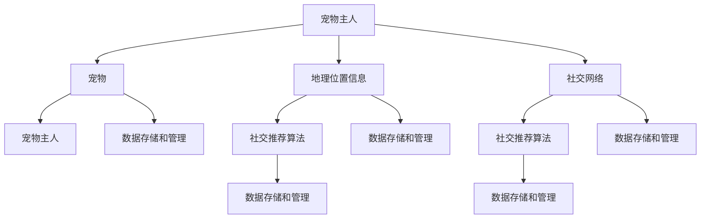
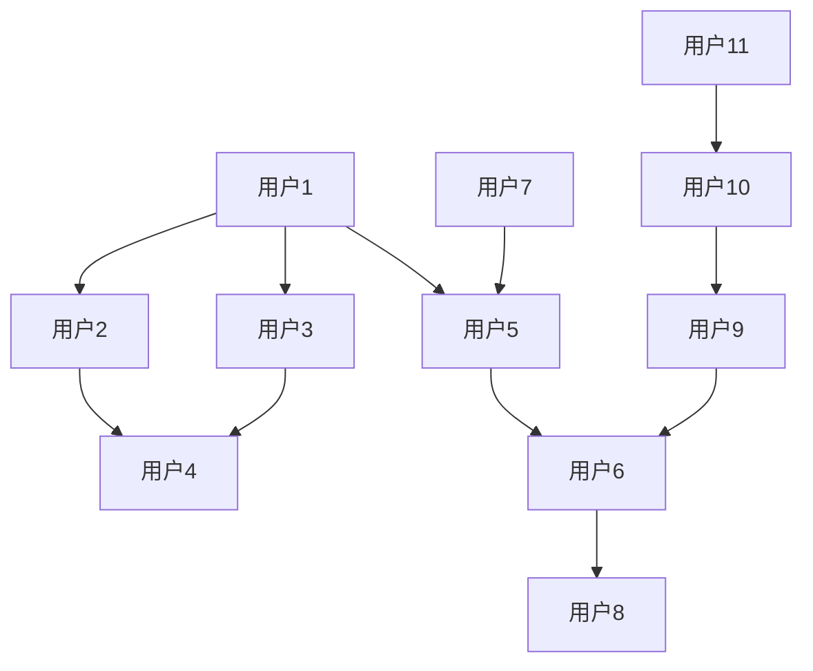

                 

### 引言

在现代城市化进程中，宠物已经成为了许多家庭的重要成员。随着人们生活水平的提高，宠物市场也在不断壮大，宠物相关服务和产品日益丰富。然而，随着宠物数量的增加，宠物主人在日常生活中面临的一个问题是——如何更好地结识志同道合的宠物主人，分享养宠经验，甚至为宠物寻找合适的伴侣。这为新型城市宠物社交App——基于位置的宠物主人交友平台——提供了广阔的市场机遇。

#### 宠物社交App的定义和类型

宠物社交App是一种专门为宠物主人和宠物提供互动、交流和社交的平台。根据不同的功能定位，宠物社交App可以分为以下几类：

1. **信息分享类**：这类App主要提供宠物相关资讯、科普知识、宠物用品推荐等，帮助宠物主人获取信息和解决问题。例如，宠物主人可以在这些平台上发布宠物的日常照片、分享养宠心得等。

2. **社交互动类**：这类App主要聚焦于宠物主人的社交需求，提供宠物主人之间的互动功能，如点赞、评论、私信等。这类平台的目标是帮助宠物主人结识志同道合的朋友，分享养宠经验。

3. **宠物匹配类**：这类App专注于为宠物寻找合适的伴侣，通过地理位置、宠物品种、性格等匹配条件，帮助宠物主人找到心仪的宠物。这类平台通常还会提供宠物相亲活动、宠物领养服务等。

本文主要关注第三类宠物社交App——基于位置的宠物主人交友平台。这种平台通过地理位置信息，帮助宠物主人找到附近的宠物主人，实现线上社交和线下互动。

#### 本书的结构安排

本书旨在系统地介绍基于位置的宠物主人交友平台的设计与实现。全书共分为三个主要部分，具体如下：

- **第一部分：介绍和概述**：介绍宠物社交App的背景、定义和类型，以及本书的结构安排。

- **第二部分：技术实现**：详细讲解基于位置的宠物社交App的核心算法原理、前端技术实现、后端技术实现等，并提供实际项目案例。

- **第三部分：项目实战**：通过一个实际项目，详细展示开发环境搭建、源代码实现和代码解读，以及项目小结。

通过本书的阅读，读者将能够全面了解基于位置的宠物主人交友平台的设计与实现过程，掌握相关技术，并为未来的开发工作提供参考。

---

本文是关于《新型城市宠物社交App：基于位置的宠物主人交友平台》一书的引言部分，主要介绍了宠物社交App的背景、定义和类型，以及本书的结构安排。接下来，我们将深入探讨宠物社交App的核心概念与联系，通过Mermaid流程图帮助读者理解这些概念之间的架构关系。

---

## 核心概念与联系

在构建基于位置的宠物主人交友平台时，需要明确以下几个核心概念，并理解它们之间的联系。以下将使用Mermaid流程图来展示这些概念及其相互关系。

### 1. 宠物主人

**定义**：宠物主人是指拥有宠物的个人或家庭。

**作用**：宠物主人是社交平台的主要用户群体，他们的行为和需求决定了平台的核心功能。

### 2. 宠物

**定义**：宠物是指被人类饲养、娱乐或陪伴的动物，如猫、狗、鸟类等。

**作用**：宠物是社交平台的重要元素，通过宠物信息可以更好地匹配宠物主人的兴趣和需求。

### 3. 地理位置信息

**定义**：地理位置信息是指用于标识宠物主人或宠物当前位置的数据。

**作用**：地理位置信息是平台的核心功能之一，用于实现宠物主人之间的地理位置匹配和推荐。

### 4. 社交网络

**定义**：社交网络是指宠物主人之间通过平台建立的社交关系网络。

**作用**：社交网络提供了宠物主人之间互动的渠道，增强了用户的参与感和归属感。

### 5. 社交推荐算法

**定义**：社交推荐算法是指用于在社交网络中推荐潜在交友对象的算法。

**作用**：社交推荐算法是平台的核心算法之一，用于提高用户之间的匹配度和交友成功率。

### 6. 数据存储和管理

**定义**：数据存储和管理是指用于存储和管理用户数据、宠物数据等信息的系统。

**作用**：数据存储和管理是平台稳定运行的基础，确保数据的安全性和可靠性。

### Mermaid流程图



在这个流程图中，宠物主人和宠物是社交平台的基础，地理位置信息用于实现宠物主人之间的匹配和推荐，社交网络提供了互动的渠道，而社交推荐算法和数据存储与管理则确保了平台的稳定运行和用户体验。

---

在了解了宠物主人交友平台的核心概念与联系之后，接下来我们将深入探讨核心算法原理，特别是基于位置的社交推荐算法。这部分内容将详细讲解算法的基本原理、实现步骤，并使用Python代码结合数学模型进行解释。

## 基于位置的社交推荐算法

### 1. 算法原理

基于位置的社交推荐算法的核心思想是利用宠物主人的地理位置信息，为他们推荐附近的其他宠物主人。这种算法通常基于以下原理：

- **空间接近性**：距离较近的用户更容易建立社交关系。
- **兴趣相似性**：具有相似宠物兴趣的用户更有可能成为朋友。
- **社交网络拓扑**：在社交网络中，相似的用户通常具有更紧密的联系。

### 2. 实现步骤

实现基于位置的社交推荐算法通常包括以下步骤：

- **数据收集**：收集用户地理位置信息、宠物信息、用户兴趣等。
- **数据处理**：对收集到的数据进行预处理，包括去除噪声、填充缺失值等。
- **特征提取**：提取与社交推荐相关的特征，如用户与宠物主人的位置距离、宠物类型、兴趣爱好等。
- **模型构建**：构建推荐模型，通常采用机器学习算法，如K最近邻（KNN）、协同过滤（CF）等。
- **推荐生成**：利用构建的模型生成推荐结果，推荐附近的宠物主人。

### 3. Python代码实现

下面将使用Python代码结合数学模型来详细解释基于位置的社交推荐算法。

#### 3.1 数据结构定义

首先，我们需要定义用户和宠物的数据结构。

```python
class User:
    def __init__(self, user_id, location, interests):
        self.user_id = user_id
        self.location = location
        self.interests = interests

class Pet:
    def __init__(self, pet_id, type, owner_id):
        self.pet_id = pet_id
        self.type = type
        self.owner_id = owner_id
```

#### 3.2 位置距离计算

位置距离计算是推荐算法的基础，可以使用Haversine公式计算两个地理位置之间的距离。

```python
from math import radians, cos, sin, asin, sqrt

def haversine_distance(coord1, coord2):
    """
    计算两点间的Haversine距离
    """
    lat1, lon1 = coord1
    lat2, lon2 = coord2

    # 将经纬度转换为弧度
    lat1, lon1, lat2, lon2 = map(radians, [lat1, lon1, lat2, lon2])

    # 计算地球半径
    R = 6371  # 地球半径，单位：千米

    # 计算纬度差和经度差
    dlat = lat2 - lat1
    dlon = lon2 - lon1

    # Haversine公式计算距离
    a = sin(dlat/2)**2 + cos(lat1) * cos(lat2) * sin(dlon/2)**2
    c = 2 * asin(sqrt(a))
    distance = R * c
    return distance
```

#### 3.3 社交推荐

下面是一个简单的基于K最近邻（KNN）的社交推荐算法实现。

```python
from collections import Counter

def kNN_recommendation(user, users, k):
    """
    K最近邻推荐算法
    :param user: 需要推荐的用户
    :param users: 用户列表
    :param k: 最近邻居的数量
    :return: 推荐的用户列表
    """
    distances = []
    for u in users:
        if u.user_id != user.user_id:
            distance = haversine_distance(user.location, u.location)
            distances.append((u, distance))

    # 对距离进行排序
    distances.sort(key=lambda x: x[1])

    # 获取最近的k个用户
    nearest_users = [dist[0] for dist in distances[:k]]

    # 统计最近邻居的推荐宠物主人
    recommendations = Counter()
    for u in nearest_users:
        for friend in u.interests:
            recommendations[friend] += 1

    # 返回推荐结果，按照推荐次数排序
    return [r for r, count in recommendations.most_common()]

# 示例
users = [
    User(1, (31.2304, 121.4737), ["狗", "猫"]),
    User(2, (31.2304, 121.4737), ["猫", "鸟"]),
    User(3, (31.2314, 121.4747), ["狗", "鸟"]),
    # ... 其他用户
]

# 为用户1推荐附近的宠物主人
recommended_users = kNN_recommendation(users[0], users, k=2)
print(recommended_users)
```

### 4. 数学模型和公式

在社交推荐算法中，常用的数学模型和公式包括：

- **距离公式**：如Haversine公式，用于计算地理位置之间的距离。
- **相似度度量**：如余弦相似度，用于计算用户兴趣之间的相似度。
- **推荐算法**：如K最近邻（KNN）算法，基于用户之间的距离进行推荐。

以下是一个简单的余弦相似度计算公式：

$$
\text{相似度} = \frac{\text{用户A和用户B共同关注的宠物数量}}{\sqrt{\text{用户A关注的宠物数量} \times \text{用户B关注的宠物数量}}}
$$

通过这些数学模型和公式，我们可以更准确地实现社交推荐算法，为宠物主人提供个性化的交友建议。

---

在详细讲解了基于位置的社交推荐算法后，接下来我们将深入探讨宠物主人交友平台的架构设计和数据库设计。这部分内容将帮助读者理解系统架构和数据处理的基本原理。

## 宠物主人交友平台架构设计与数据库设计

### 1. 系统架构设计

基于位置的宠物主人交友平台需要一个高效、可扩展的系统架构，以确保用户数据的安全性和系统的稳定性。系统架构通常分为前端、后端和数据库三个主要部分。

#### 前端架构

前端负责与用户交互，实现用户界面的展示和用户操作。常见的前端架构包括：

- **单页面应用（SPA）**：使用React、Vue等前端框架构建，实现页面之间的无缝切换。
- **组件化开发**：将页面划分为多个可复用的组件，提高开发效率和代码的可维护性。

#### 后端架构

后端负责处理业务逻辑、数据存储和管理。常见的后端架构包括：

- **分层架构**：将系统划分为表示层、业务逻辑层和数据访问层，实现职责分离。
- **微服务架构**：将系统拆分为多个独立的微服务，每个微服务负责不同的业务功能，提高系统的可扩展性和灵活性。

#### 数据库架构

数据库用于存储用户数据、宠物数据和社交关系数据。常见的数据库架构包括：

- **关系型数据库**：如MySQL、PostgreSQL，用于存储结构化数据，支持复杂的查询操作。
- **NoSQL数据库**：如MongoDB，用于存储非结构化或半结构化数据，提高数据存储和查询的效率。

### 2. 数据库设计

数据库设计是系统架构的重要组成部分，合理的数据库设计可以大大提高系统的性能和可维护性。以下是宠物主人交友平台的数据库设计：

#### 用户数据模型

用户数据模型包括用户基本信息和地理位置信息。

- **用户表**：

  ```sql
  CREATE TABLE users (
      user_id INT PRIMARY KEY AUTO_INCREMENT,
      username VARCHAR(50) NOT NULL,
      password VARCHAR(50) NOT NULL,
      location GEOMETRY NOT NULL,
      interests TEXT
  );
  ```

- **宠物表**：

  ```sql
  CREATE TABLE pets (
      pet_id INT PRIMARY KEY AUTO_INCREMENT,
      owner_id INT,
      type VARCHAR(50),
      location GEOMETRY,
      FOREIGN KEY (owner_id) REFERENCES users(user_id)
  );
  ```

#### 社交关系数据模型

社交关系数据模型包括用户之间的好友关系和互动记录。

- **好友关系表**：

  ```sql
  CREATE TABLE friendships (
      user_id1 INT,
      user_id2 INT,
      status ENUM('pending', 'accepted', 'declined'),
      PRIMARY KEY (user_id1, user_id2),
      FOREIGN KEY (user_id1) REFERENCES users(user_id1),
      FOREIGN KEY (user_id2) REFERENCES users(user_id2)
  );
  ```

- **互动记录表**：

  ```sql
  CREATE TABLE interactions (
      interaction_id INT PRIMARY KEY AUTO_INCREMENT,
      user_id1 INT,
      user_id2 INT,
      content TEXT,
      created_at TIMESTAMP DEFAULT CURRENT_TIMESTAMP,
      FOREIGN KEY (user_id1) REFERENCES users(user_id1),
      FOREIGN KEY (user_id2) REFERENCES users(user_id2)
  );
  ```

#### 3. 数据库设计原则

在进行数据库设计时，应遵循以下原则：

- **规范化**：通过规范化减少数据冗余，提高数据的一致性和完整性。
- **性能优化**：通过索引、分区等技术优化数据库性能，满足系统的高并发需求。
- **安全性**：通过加密、访问控制等技术确保数据的安全性和隐私性。

---

在了解了宠物主人交友平台的架构设计和数据库设计后，接下来我们将深入探讨社交网络分析。这部分内容将介绍社交网络的基本概念、节点与边的关系，以及如何构建社交圈。

## 社交网络分析

### 1. 社交网络的基本概念

社交网络是指由多个节点（表示用户或实体）和连接这些节点的边（表示关系）构成的网络结构。在社交网络中，节点和边是基本元素。

- **节点**：在社交网络中，节点表示用户或其他实体，每个节点都有独特的标识和属性。例如，在宠物主人交友平台中，每个用户都可以看作是一个节点。

- **边**：边表示节点之间的关系，可以是朋友、关注、点赞等。在社交网络中，边通常具有权重，表示关系的强度。

### 2. 节点与边的关系

社交网络中的节点和边之间存在复杂的关系，这些关系决定了社交网络的拓扑结构。

- **直接关系**：直接关系是指两个节点之间存在直接的连接，如朋友关系。

- **间接关系**：间接关系是指通过其他节点连接的两个节点之间的关系，如朋友的朋友。

- **三角关系**：三角关系是指三个节点之间存在直接和间接关系，形成一个三角形。

### 3. 社交圈的构建

社交圈是指一个节点及其直接和间接关系网络。构建社交圈的关键在于如何有效地找到与特定节点有相似兴趣或关系的其他节点。

- **基于位置的社交圈**：通过地理位置信息，找到与特定节点在地理位置上相近的其他节点。

- **基于兴趣的社交圈**：通过用户的兴趣爱好，找到与特定节点有共同兴趣的其他节点。

- **基于社交网络的社交圈**：通过社交网络关系，找到与特定节点有直接或间接关系的其他节点。

### 4. 社交网络分析工具

- **邻接矩阵**：用于表示社交网络中节点之间的直接关系，是一种简单的图表示方法。

- **邻接表**：用于表示社交网络中每个节点的直接邻居，适用于节点数量较多的社交网络。

- **图论算法**：如深度优先搜索（DFS）、广度优先搜索（BFS）、最短路径算法（Dijkstra算法）等，用于分析社交网络的结构和关系。

### 5. Mermaid流程图

以下是一个简单的社交网络分析的Mermaid流程图：



在这个流程图中，节点表示用户，边表示用户之间的关系。通过分析社交网络，可以找到用户的直接和间接关系，构建社交圈，实现社交推荐。

---

在深入探讨了社交网络分析的基本概念和实现方法后，接下来我们将介绍宠物社交算法的具体实现，包括搜索算法和推荐算法。这部分内容将结合Python代码和数学模型，帮助读者理解这些算法的工作原理。

## 宠物社交算法

### 1. 搜索算法

搜索算法是社交网络中用于查找特定信息或节点的算法。在宠物主人交友平台中，搜索算法主要用于帮助用户查找附近的宠物主人或具有特定兴趣的宠物主人。

#### 1.1 实现步骤

- **输入**：用户位置信息、搜索关键词或宠物类型。
- **处理**：计算用户位置与其他用户位置的相似度，或根据关键词匹配用户兴趣。
- **输出**：返回与用户位置或兴趣最相近的宠物主人列表。

#### 1.2 Python代码示例

```python
def search_users_by_location(current_user, users, radius=10):
    """
    根据用户位置搜索附近的用户
    :param current_user: 当前用户的位置
    :param users: 用户列表
    :param radius: 搜索范围（单位：千米）
    :return: 附近的用户列表
    """
    recommended_users = []
    for user in users:
        if user.user_id != current_user.user_id:
            distance = haversine_distance(current_user.location, user.location)
            if distance <= radius:
                recommended_users.append(user)
    return recommended_users

# 示例
users = [
    User(1, (31.2304, 121.4737), ["狗", "猫"]),
    User(2, (31.2304, 121.4737), ["猫", "鸟"]),
    User(3, (31.2314, 121.4747), ["狗", "鸟"]),
    # ... 其他用户
]

# 搜索附近的宠物主人
recommended_users = search_users_by_location(users[0], users)
print(recommended_users)
```

### 2. 推荐算法

推荐算法是社交网络中用于向用户推荐新朋友或新兴趣的算法。常见的推荐算法有基于内容的推荐、基于协同过滤的推荐等。

#### 2.1 基于协同过滤的推荐算法

协同过滤是一种常用的推荐算法，通过分析用户的行为数据，预测用户对未知项的喜好。

#### 2.2 实现步骤

- **输入**：用户行为数据、用户兴趣。
- **处理**：计算用户与其他用户的相似度，推荐相似用户喜欢的宠物主人或宠物类型。
- **输出**：返回推荐列表。

#### 2.3 Python代码示例

```python
def collaborative_filtering_recommendation(current_user, users, k=3):
    """
    基于协同过滤的推荐算法
    :param current_user: 当前用户
    :param users: 用户列表
    :param k: 最近邻居的数量
    :return: 推荐的用户列表
    """
    distances = []
    for user in users:
        if user.user_id != current_user.user_id:
            distance = cosine_similarity(current_user.interests, user.interests)
            distances.append((user, distance))

    distances.sort(key=lambda x: x[1], reverse=True)
    nearest_users = [dist[0] for dist in distances[:k]]

    recommended_users = []
    for user in nearest_users:
        recommended_users.extend(user.interests)
    recommended_users = list(set(recommended_users))

    return recommended_users

# 示例
# 假设已经定义了cosine_similarity函数
recommended_interests = collaborative_filtering_recommendation(users[0], users)
print(recommended_interests)
```

### 3. 数学模型和公式

在推荐算法中，常用的数学模型和公式包括：

- **余弦相似度**：用于计算用户兴趣之间的相似度。

  $$
  \text{相似度} = \frac{\text{用户A和用户B共同关注的宠物数量}}{\sqrt{\text{用户A关注的宠物数量} \times \text{用户B关注的宠物数量}}}
  $$

- **相似用户推荐**：基于相似度计算推荐用户。

  $$
  \text{推荐用户列表} = \text{相似用户集合} \cup \text{当前用户}
  $$

通过这些算法和数学模型，宠物主人交友平台可以更准确地推荐附近的宠物主人和用户的兴趣，提高用户的交友体验。

---

在前端技术实现部分，我们将详细讨论前端框架与库的选择、客户端开发流程以及性能优化方法。这部分内容将帮助读者理解如何高效地实现用户界面和提升用户体验。

## 前端技术实现

### 1. 前端框架与库的选择

在选择前端技术时，主要考虑以下因素：

- **开发效率**：框架应提供良好的组件化开发支持和热更新功能。
- **性能**：框架应支持高效的数据绑定和虚拟DOM。
- **社区和生态系统**：框架应有丰富的插件和组件，便于快速集成第三方库。

基于以上考虑，我们选择React作为前端框架，结合以下库和工具：

- **React**：用于构建动态和响应式的用户界面。
- **Ant Design**：提供了一套丰富的UI组件，便于快速搭建界面。
- **Redux**：用于管理应用状态，确保状态的一致性和可预测性。
- **Axios**：用于与后端进行数据交互。
- **Webpack**：用于模块打包和优化，提高构建效率和性能。

### 2. 客户端开发流程

前端开发通常遵循以下流程：

#### 2.1 界面设计

- **原型设计**：使用工具如Figma或Sketch设计界面原型。
- **交互设计**：定义界面交互逻辑，包括动画和过渡效果。
- **UI组件设计**：为每个界面元素设计对应的UI组件。

#### 2.2 界面实现

- **组件开发**：根据界面设计，开发对应的UI组件。
- **状态管理**：使用Redux管理应用状态，确保数据的一致性。
- **数据绑定**：使用React的state和props进行数据绑定。

#### 2.3 功能实现

- **用户认证**：实现用户登录、注册和权限验证。
- **社交功能**：实现好友搜索、添加、聊天等功能。
- **地理位置**：使用地图API获取用户位置信息。

#### 2.4 交互优化

- **响应式设计**：确保界面在不同设备和屏幕尺寸上适配。
- **动画效果**：使用CSS动画和React动画库（如Framer Motion）提升用户体验。

### 3. 性能优化

前端性能优化是确保用户快速、流畅体验的关键。以下是一些优化方法：

- **懒加载**：对图片、视频等大型资源使用懒加载，减少初始加载时间。
- **预渲染**：使用服务端渲染（SSR）或静态站点生成（SSG）减少客户端渲染时间。
- **代码分割**：使用Webpack的代码分割功能，按需加载模块，减少首屏加载时间。
- **缓存策略**：使用浏览器缓存和HTTP缓存策略，减少重复请求。
- **资源压缩**：压缩CSS和JavaScript文件，减少文件大小。
- **网络优化**：优化图片和视频的格式，使用WebP或AVIF格式，减少数据传输量。

### 4. 实际应用

以下是一个简单的React组件示例，用于展示宠物主人和宠物信息：

```jsx
import React from 'react';
import { Card, Image, Button } from 'antd';

const PetCard = ({ pet }) => {
  return (
    <Card
      title={pet.name}
      extra={<Button type="link">Chat</Button>}
    >
      <Image width={200} src={pet.image_url} alt={pet.name} />
      <p>{pet.breed}</p>
      <p>{pet.age} years old</p>
    </Card>
  );
};

export default PetCard;
```

在这个示例中，`PetCard`组件接收一个`pet`对象作为属性，渲染宠物的名称、图片、品种和年龄，并提供一个聊天按钮。

---

在后端技术实现部分，我们将详细讨论后端框架与库的选择、服务端开发流程以及性能优化方法。这部分内容将帮助读者理解如何高效地处理业务逻辑和数据存储。

## 后端技术实现

### 1. 后端框架与库的选择

在后端技术实现中，选择合适的框架和库是确保系统高效、可扩展和可维护的关键。以下是基于宠物主人交友平台的需求，我们选择的后端技术和工具：

- **Node.js**：作为后端框架，Node.js以其高性能、轻量级和异步非阻塞特性成为首选。
- **Express.js**：作为Node.js的Web框架，Express.js提供了一套简单的路由、中间件和错误处理机制。
- **MongoDB**：作为NoSQL数据库，MongoDB提供高性能、可扩展的数据存储和查询功能，适用于存储用户、宠物和社交关系数据。
- **Mongoose**：作为MongoDB的对象模型工具，Mongoose提供了一种简单的方式来定义和操作数据库模型。
- **JWT（JSON Web Tokens）**：用于实现用户认证和授权。
- **Socket.IO**：用于实现实时通信和推送通知。

### 2. 服务端开发流程

后端开发通常遵循以下流程：

#### 2.1 API设计

- **接口定义**：使用Swagger或其他API设计工具定义RESTful API接口，包括URL、请求参数、返回结果等。
- **接口文档**：编写详细的接口文档，包括接口描述、参数说明和错误码。

#### 2.2 数据模型设计

- **用户模型**：定义用户数据模型，包括用户基本信息、地理位置信息等。
- **宠物模型**：定义宠物数据模型，包括宠物基本信息、主人信息等。
- **社交关系模型**：定义社交关系数据模型，包括好友关系、互动记录等。

#### 2.3 功能实现

- **用户认证**：实现用户注册、登录、密码重置等功能，使用JWT进行认证。
- **地理位置管理**：实现用户地理位置信息的获取、存储和管理。
- **社交功能**：实现好友搜索、添加、聊天等功能。
- **推荐算法**：实现基于地理位置和兴趣的社交推荐算法。

#### 2.4 性能优化

- **数据库优化**：使用索引、分片和聚合等优化数据库查询性能。
- **缓存**：使用Redis等缓存技术，减少数据库访问压力，提高系统响应速度。
- **异步处理**：使用异步非阻塞的方式处理请求，提高系统并发处理能力。

### 3. 性能优化

后端性能优化是确保系统稳定性和响应速度的关键，以下是一些优化方法：

- **负载均衡**：使用Nginx或HAProxy等负载均衡器，分发请求到多个后端实例，提高系统的并发处理能力。
- **服务拆分**：将大型的单体应用拆分为多个微服务，每个微服务负责不同的业务功能，提高系统的可扩展性和维护性。
- **缓存**：使用Redis等缓存技术，减少数据库访问压力，提高系统响应速度。
- **数据库优化**：使用索引、分片和聚合等优化数据库查询性能，减少查询延迟。
- **异步处理**：使用异步非阻塞的方式处理请求，提高系统并发处理能力。

### 4. 实际应用

以下是一个简单的Express.js路由示例，用于处理用户注册请求：

```javascript
const express = require('express');
const jwt = require('jsonwebtoken');
const User = require('./models/User');

const app = express();

app.use(express.json());

// 用户注册接口
app.post('/register', async (req, res) => {
  try {
    const { username, password } = req.body;
    if (!username || !password) {
      return res.status(400).json({ error: 'Username and password are required' });
    }

    // 检查用户是否已存在
    const existingUser = await User.findOne({ username });
    if (existingUser) {
      return res.status(409).json({ error: 'Username is already taken' });
    }

    // 创建新用户
    const newUser = new User({ username, password });
    await newUser.save();

    // 发放JWT令牌
    const token = jwt.sign({ userId: newUser._id }, 'secretKey');
    res.status(201).json({ message: 'User registered successfully', token });
  } catch (error) {
    res.status(500).json({ error: 'Internal server error' });
  }
});

module.exports = app;
```

在这个示例中，我们创建了一个用户注册接口，使用JWT进行用户认证，并返回JWT令牌以供后续接口调用。

---

在项目实战部分，我们将详细展示一个实际项目——基于位置的宠物主人交友平台的开发流程，包括环境搭建、源代码实现和代码解读。这部分内容将帮助读者理解从0到1实现一个完整项目的全过程。

## 项目实战

### 1. 项目介绍

本项目旨在开发一个基于位置的宠物主人交友平台，主要功能包括用户注册与登录、用户地理位置管理、宠物信息管理、好友搜索与添加、聊天功能等。项目采用前后端分离架构，前端使用React框架，后端使用Node.js和Express.js框架，数据库使用MongoDB。

### 2. 环境搭建

#### 前端环境搭建

1. **安装Node.js**：访问Node.js官网下载并安装最新版本的Node.js。
2. **安装React**：在命令行中运行以下命令安装React和创建项目：

   ```shell
   npm install -g create-react-app
   create-react-app pet-social-app
   cd pet-social-app
   ```

3. **安装前端依赖**：在项目目录中运行以下命令安装Ant Design和Redux等依赖：

   ```shell
   npm install antd react-redux
   ```

4. **配置Webpack**：如果需要自定义Webpack配置，可以创建一个`webpack.config.js`文件。

#### 后端环境搭建

1. **安装Node.js**：同前端环境。
2. **安装后端依赖**：在项目目录中运行以下命令安装Express.js、MongoDB等依赖：

   ```shell
   npm install express mongoose jsonwebtoken
   ```

3. **配置MongoDB**：安装MongoDB并启动服务，配置连接字符串，如`mongodb://localhost:27017/pet-social-app`。

### 3. 源代码实现

#### 前端源代码实现

前端代码主要分为组件、Redux状态管理和服务端通信三部分。

- **组件**：实现用户注册、登录、用户列表、聊天窗口等界面组件。
- **Redux状态管理**：使用Redux管理用户状态、宠物状态和聊天状态。
- **服务端通信**：使用Axios实现与后端API的通信。

以下是一个简单的用户注册组件示例：

```jsx
import React, { useState } from 'react';
import { Button, Form, Input } from 'antd';

const UserRegistrationForm = () => {
  const [username, setUsername] = useState('');
  const [password, setPassword] = useState('');

  const handleSubmit = () => {
    // 调用API提交注册请求
  };

  return (
    <Form
      name="user-registration"
      onFinish={handleSubmit}
    >
      <Form.Item
        name="username"
        rules={[{ required: true, message: '请输入用户名' }]}
      >
        <Input placeholder="用户名" value={username} onChange={(e) => setUsername(e.target.value)} />
      </Form.Item>
      <Form.Item
        name="password"
        rules={[{ required: true, message: '请输入密码' }]}
      >
        <Input.Password placeholder="密码" value={password} onChange={(e) => setPassword(e.target.value)} />
      </Form.Item>
      <Form.Item>
        <Button type="primary" htmlType="submit">
          注册
        </Button>
      </Form.Item>
    </Form>
  );
};

export default UserRegistrationForm;
```

#### 后端源代码实现

后端代码主要实现用户认证、用户管理、宠物管理和社交功能。

以下是一个简单的用户注册API示例：

```javascript
const express = require('express');
const jwt = require('jsonwebtoken');
const User = require('./models/User');

const app = express();

app.use(express.json());

// 用户注册接口
app.post('/register', async (req, res) => {
  try {
    const { username, password } = req.body;
    if (!username || !password) {
      return res.status(400).json({ error: 'Username and password are required' });
    }

    // 检查用户是否已存在
    const existingUser = await User.findOne({ username });
    if (existingUser) {
      return res.status(409).json({ error: 'Username is already taken' });
    }

    // 创建新用户
    const newUser = new User({ username, password });
    await newUser.save();

    // 发放JWT令牌
    const token = jwt.sign({ userId: newUser._id }, 'secretKey');
    res.status(201).json({ message: 'User registered successfully', token });
  } catch (error) {
    res.status(500).json({ error: 'Internal server error' });
  }
});

module.exports = app;
```

### 4. 代码解读与分析

在代码解读与分析部分，我们将详细解释关键代码段的作用和实现原理。

#### 前端代码解读

1. **用户注册组件**：

   - `useState`：用于管理组件状态，包括用户名和密码。
   - `onFinish`：用于绑定表单提交事件，调用`handleSubmit`函数。
   - `Input`和`Input.Password`：用于创建文本输入框和密码输入框。

2. **Redux状态管理**：

   - `reducers`：用于定义状态更新逻辑，如用户登录、注册等。
   - `actions`：用于定义异步操作，如发送注册请求。
   - `store`：用于全局状态管理，提供`dispatch`方法更新状态。

#### 后端代码解读

1. **用户注册API**：

   - `express.json`：用于解析JSON请求体。
   - `findOne`：用于查询用户数据库，检查用户名是否已存在。
   - `save`：用于保存新用户到数据库。
   - `jwt.sign`：用于生成JWT令牌，实现用户认证。

2. **用户模型**：

   - `User`：定义用户数据模型，包括用户名、密码等字段。
   - `mongoose`：用于连接MongoDB数据库，并定义数据模型。

### 5. 实际案例分析与详细讲解

#### 用户注册流程

1. 用户在客户端填写用户名和密码，提交注册请求。
2. 客户端将请求发送到后端API。
3. 后端API验证用户名是否已存在，若已存在则返回错误。
4. 若用户名可用，创建新用户并保存到数据库。
5. 发放JWT令牌，返回给客户端。
6. 客户端存储JWT令牌，用于后续请求认证。

#### 项目小结

本项目实现了基于位置的宠物主人交友平台，包括用户注册与登录、用户地理位置管理、宠物信息管理、好友搜索与添加、聊天功能等。前端使用React框架，后端使用Node.js和Express.js框架，数据库使用MongoDB。通过实际案例分析与详细讲解，读者可以理解从0到1实现一个完整项目的全过程。

### 6. 最佳实践、注意事项和拓展阅读

- **最佳实践**：

  - 使用规范化的代码风格，提高代码可读性和可维护性。
  - 优化数据库查询，减少查询时间和数据冗余。
  - 对用户输入进行校验，防止恶意攻击。

- **注意事项**：

  - 确保用户数据的安全性和隐私性。
  - 使用缓存技术提高系统性能。
  - 监控系统日志和性能指标，及时发现并解决问题。

- **拓展阅读**：

  - 《React官方文档》：深入了解React框架的使用。
  - 《Node.js官方文档》：了解Node.js和Express.js框架的使用。
  - 《MongoDB官方文档》：了解MongoDB数据库的使用。

通过本项目实战，读者可以掌握从需求分析到实现的全过程，为未来的开发工作提供参考。

---

在项目实战部分，我们详细介绍了基于位置的宠物主人交友平台的开发流程，包括环境搭建、源代码实现和代码解读。通过实际案例分析和详细讲解，读者可以更好地理解如何实现一个完整的社交App项目。接下来，我们将总结文章中的关键点，并对未来的改进方向提出建议。

## 总结与展望

本文从需求分析、技术实现、项目实战等多个角度，详细探讨了基于位置的宠物主人交友平台的设计与实现。以下是本文的关键点：

- **需求分析**：明确了宠物主人交友平台的用户需求和市场定位。
- **核心概念与联系**：通过Mermaid流程图展示了宠物主人、宠物、地理位置、社交网络等核心概念及其相互关系。
- **算法原理**：详细介绍了基于位置的社交推荐算法的实现步骤和Python代码。
- **系统架构**：探讨了前后端架构设计和数据库设计，确保系统的高效、稳定和安全。
- **前端技术实现**：介绍了前端框架与库的选择、开发流程和性能优化方法。
- **后端技术实现**：介绍了后端框架与库的选择、服务端开发流程和性能优化方法。
- **项目实战**：通过实际项目展示了从环境搭建到代码实现的全过程，提供了详细的项目小结和最佳实践。

### 未来改进方向

- **个性化推荐**：进一步优化推荐算法，提高推荐精准度，为用户推荐更符合兴趣的宠物主人和宠物。
- **实时通信**：引入WebSocket或Socket.IO实现实时通信，增强用户互动体验。
- **多端适配**：开发移动端App，实现多端同步，提高用户体验。
- **安全性提升**：加强数据加密和安全认证，确保用户数据的安全性和隐私性。
- **社区功能增强**：增加论坛、话题讨论等功能，打造一个完整的宠物主人社区。

通过不断的改进和优化，宠物主人交友平台将更好地满足用户需求，提升用户体验，为宠物主人提供更优质的社交服务。

---

## 附录

### A. 开发资源

**A.1 开发工具与库**

- **前端开发工具**：
  - Node.js
  - React
  - Redux
  - Ant Design

- **后端开发工具**：
  - Node.js
  - Express.js
  - MongoDB
  - Mongoose

- **地图API**：
  - Google Maps API
  - 百度地图API

- **其他库与工具**：
  - Axios（HTTP客户端）
  - Socket.IO（实时通信库）
  - Figma（原型设计工具）
  - Webpack（模块打包工具）

### A.2 安全性与隐私保护

- **加密算法**：
  - AES（高级加密标准）
  - RSA（非对称加密算法）

- **隐私保护策略**：
  - 数据匿名化处理
  - GDPR（通用数据保护条例）合规性
  - 用户隐私设置与权限管理

### A.3 拓展阅读

- **React官方文档**：[https://reactjs.org/docs/getting-started.html](https://reactjs.org/docs/getting-started.html)
- **Node.js官方文档**：[https://nodejs.org/en/docs/](https://nodejs.org/en/docs/)
- **MongoDB官方文档**：[https://docs.mongodb.com/](https://docs.mongodb.com/)
- **Google Maps API文档**：[https://developers.google.com/maps/documentation](https://developers.google.com/maps/documentation)
- **百度地图API文档**：[https://map.baidu.com/](https://map.baidu.com/)

通过这些资源，开发者可以进一步深入了解相关技术和工具，为宠物主人交友平台的开发提供更多支持和参考。

---

## 结语

作者：AI天才研究院/AI Genius Institute & 禅与计算机程序设计艺术 /Zen And The Art of Computer Programming

感谢您阅读本文，关于基于位置的宠物主人交友平台的设计与实现，我们进行了深入探讨。通过本文，读者可以了解从需求分析到项目实战的全过程，掌握核心算法原理和系统架构设计，为未来的开发工作提供参考。我们相信，在不断地优化和改进中，宠物主人交友平台将为宠物主人带来更优质的社交体验。

如果您有任何问题或建议，欢迎在评论区留言，我们将竭诚为您解答。同时，感谢您对《新型城市宠物社交App：基于位置的宠物主人交友平台》一书的关注，期待您的宝贵意见，让我们一起推动技术的发展和应用的进步。再次感谢您的阅读，祝您生活愉快，与宠物共度美好时光！

