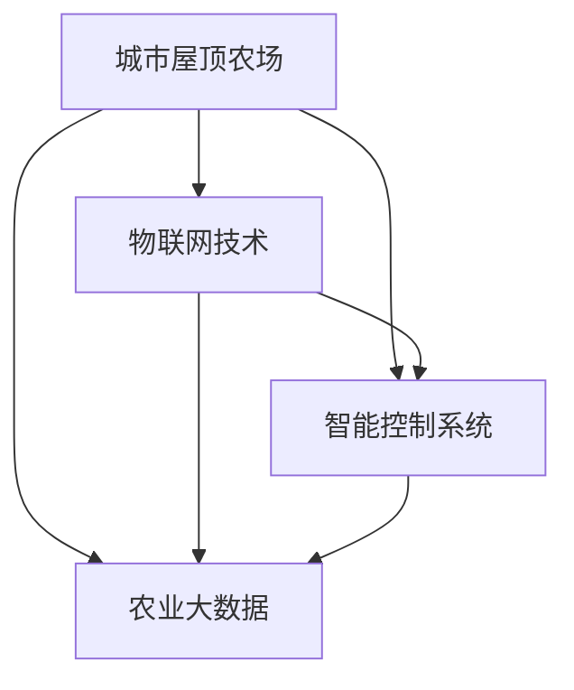

                 

### 新型城市屋顶农场网络的概述

城市屋顶农场网络作为一种新兴的农业模式，旨在通过利用城市建筑物的屋顶空间，实现高效、可持续的农业生产。这一概念的提出源于城市化进程中的土地资源紧张和环境问题日益凸显，传统农业难以满足城市日益增长的食物需求。城市屋顶农场网络结合了现代农业技术、物联网和智能控制技术，为解决这些问题提供了新思路。

#### **城市屋顶农场网络的概念与目标**

城市屋顶农场网络是指利用城市建筑物屋顶空间，通过现代农业技术、物联网和智能控制系统，构建起一个高效、可持续的农业生产体系。其核心目标包括：

1. **土地利用率最大化**：通过在城市屋顶建立农场，将原本无法利用的屋顶空间转变为生产空间，从而提高城市土地的利用率。

2. **食物生产与环境保护相结合**：城市屋顶农场可以生产新鲜、健康的农产品，同时通过降低农业用水、减少化肥和农药使用，改善城市生态环境。

3. **实现农业生产智能化**：通过物联网和智能控制技术，对农场进行实时监测与调控，提高农业生产效率，降低人力成本。

#### **城市屋顶农场网络的发展背景**

随着城市化进程的加速，城市土地资源日益紧张，传统农业面临土地退化、水资源匮乏等问题。同时，城市人口增长和生活方式的改变，导致对新鲜、健康农产品的需求不断增加。为了解决这些问题，城市屋顶农场网络应运而生。

#### **核心技术与应用**

城市屋顶农场网络的建设和运营依赖于一系列先进技术的支持：

1. **物联网技术**：通过传感器和无线通信技术，实现农场的实时监控和数据传输，为智能决策提供基础。

2. **智能控制系统**：包括自动灌溉、环境监测、智能温室控制等，实现农场的自动化管理。

3. **农业大数据**：通过对农场的生产数据进行收集、分析和利用，优化生产过程，提高产量和质量。

#### **城市屋顶农场网络的优势**

1. **提高城市土地利用率**：将原本无法利用的屋顶空间转化为生产空间，有效缓解城市土地资源紧张问题。

2. **改善城市生态环境**：通过减少农业用水、降低化肥和农药使用，提高城市空气质量，改善城市生态环境。

3. **提供新鲜、健康的农产品**：通过智能化管理，确保农产品的安全性和高品质。

4. **实现农业生产智能化**：通过物联网和智能控制系统，提高农业生产效率，降低人力成本。

#### **挑战与应对策略**

尽管城市屋顶农场网络具有诸多优势，但在实际建设和运营中仍面临一些挑战：

1. **高投资成本**：初期建设和维护成本较高，需要政府和企业共同承担。

2. **技术和管理要求高**：需要专业技术人员进行管理，且需要一定的技术积累和经验。

3. **建筑结构安全**：需要确保屋顶农场的建筑结构安全，防止因负载过重而导致建筑损坏。

为了应对这些挑战，需要：

1. **政府支持**：通过政策引导和资金支持，鼓励企业和个人参与城市屋顶农场网络的建设。

2. **技术创新**：不断研发新型材料和设备，降低建设成本，提高运营效率。

3. **专业培训**：提高管理人员的技术水平，确保农场的顺利运营。

通过上述分析和思考，我们可以看到，城市屋顶农场网络作为一种创新的农业模式，具有广阔的发展前景。它不仅能够解决城市化进程中面临的一系列问题，还能够为城市居民提供新鲜、健康的农产品，实现农业生产的可持续发展和城市生态的改善。未来，随着技术的不断进步和政策的支持，城市屋顶农场网络将在全球范围内得到更广泛的应用。

### 城市屋顶农场网络的核心概念与联系

在城市屋顶农场网络中，核心概念与联系构成了整个系统的理论基础和应用框架。以下是几个关键概念及其相互关系：

#### **1. 城市屋顶农场的概念**

城市屋顶农场是指在城市建筑物的屋顶空间上种植农作物或养殖动物的一种农业生产形式。它利用了城市建筑物的闲置屋顶空间，实现了土地资源的二次利用，提高了城市土地的利用率。

#### **2. 物联网技术**

物联网技术是城市屋顶农场网络的基石，通过传感器、无线通信和数据管理系统，实现对农场的实时监控和管理。物联网技术在城市屋顶农场网络中的应用包括环境监测、自动灌溉系统、智能温室控制等。

#### **3. 智能控制系统**

智能控制系统利用物联网技术和先进的算法，对农场的各项生产活动进行自动化管理。这包括根据环境数据自动调节温室温度、湿度，自动灌溉系统，以及通过图像识别技术监测作物生长状态等。

#### **4. 农业大数据**

农业大数据是通过收集和分析农场的生产数据，用于优化农业生产过程，提高产量和质量。农业大数据与物联网技术结合，能够实现精准农业，提高资源利用效率。

#### **5. 农业可持续性**

农业可持续性是指在城市屋顶农场网络中，通过科学管理和技术创新，实现农业生产对环境的最小影响，确保长期的食物供应。这包括减少化肥和农药的使用，合理利用水资源等。

#### **概念之间的联系**

- **物联网技术与智能控制系统**：物联网技术为智能控制系统提供了数据支持，智能控制系统则利用这些数据进行自动化管理，二者相辅相成，构成了城市屋顶农场网络的核心。

- **农业大数据与物联网技术**：农业大数据通过对物联网收集的数据进行分析，提供决策支持，进一步优化农业生产过程。

- **城市屋顶农场与农业可持续性**：城市屋顶农场通过物联网和智能控制系统实现高效、科学的生产管理，有助于实现农业的可持续发展。

下面是一个使用Mermaid绘制的流程图，展示了这些核心概念及其之间的联系：



通过这个流程图，我们可以清晰地看到城市屋顶农场网络中各个核心概念之间的相互作用和联系，这为后续章节的详细探讨提供了基础。

### 城市屋顶农场网络的构建技术

城市屋顶农场网络的构建离不开一系列先进技术的支持，这些技术共同作用，使得农场能够高效、智能化地运作。以下是构建城市屋顶农场网络所需的关键技术：

#### **1. 物联网技术**

物联网技术在城市屋顶农场网络中起着至关重要的作用。通过部署各种传感器和无线通信设备，可以实时监测农场的环境参数，如温度、湿度、光照、土壤湿度等。这些数据通过无线通信模块传输到中央控制系统，为农场的自动化管理提供了基础。

**应用实例**：  
- **环境监测**：利用温湿度传感器，可以实时监测温室内的环境条件，确保作物生长所需的最佳环境。
- **自动灌溉系统**：通过土壤湿度传感器，可以自动调节灌溉时间与水量，实现精准灌溉，减少水资源浪费。

```python
# Python代码示例：自动灌溉系统控制逻辑
def irrigate_if_needed(soil_humidity):
    if soil_humidity < 60:  # 假设土壤湿度低于60%需要灌溉
        irrigation_system.turn_on()
        time.sleep(5)  # 灌溉5分钟
        irrigation_system.turn_off()
    else:
        print("土壤湿度适中，无需灌溉")

# 假设土壤湿度传感器返回当前土壤湿度为50%
current_soil_humidity = 50
irrigate_if_needed(current_soil_humidity)
```

#### **2. 智能控制系统**

智能控制系统是城市屋顶农场网络的中枢神经，通过集成物联网数据和先进的算法，实现对农场各项活动的自动化管理。智能控制系统可以自动调节温室温度、湿度、光照等环境条件，同时监测作物生长状态，提供实时数据分析和决策支持。

**应用实例**：  
- **智能温室控制系统**：根据环境数据自动调节温室内的温度和湿度，确保作物生长所需的环境条件。
- **作物生长监测**：通过图像识别技术，监测作物的生长状态，及时发现病虫害问题。

```python
# Python代码示例：智能温室控制系统
import time

class SmartGreenHouse:
    def __init__(self, temp_sensor, humidity_sensor, light_sensor):
        self.temp_sensor = temp_sensor
        self.humidity_sensor = humidity_sensor
        self.light_sensor = light_sensor

    def monitor_conditions(self):
        temp = self.temp_sensor.read_temp()
        humidity = self.humidity_sensor.read_humidity()
        light_intensity = self.light_sensor.read_light_intensity()

        print(f"温度：{temp}℃，湿度：{humidity}%，光照强度：{light_intensity}lux")

        # 根据环境数据自动调节环境条件
        if temp > 30:
            self.regulate_temp(25)
        if humidity < 40:
            self.regulate_humidity(60)
        if light_intensity < 500:
            self.regulate_light(800)

    def regulate_temp(self, target_temp):
        # 调节温度的逻辑
        print(f"调节温度至：{target_temp}℃")
        # 实际的温度调节操作
        self.temp_regulator.adjust_temp(target_temp)

    def regulate_humidity(self, target_humidity):
        # 调节湿度的逻辑
        print(f"调节湿度至：{target_humidity}%")
        # 实际的湿度调节操作
        self.humidity_regulator.adjust_humidity(target_humidity)

    def regulate_light(self, target_light_intensity):
        # 调节光照的逻辑
        print(f"调节光照至：{target_light_intensity}lux")
        # 实际的光照调节操作
        self.light_regulator.adjust_light(target_light_intensity)

# 假设传感器和调节器的实例
temp_sensor = TempSensor()
humidity_sensor = HumiditySensor()
light_sensor = LightSensor()
green_house = SmartGreenHouse(temp_sensor, humidity_sensor, light_sensor)

# 监测温室环境条件
green_house.monitor_conditions()
```

#### **3. 农业大数据**

农业大数据技术在城市屋顶农场网络中用于收集、存储、分析和利用大量农业生产数据，通过数据驱动的方式优化生产过程。农业大数据可以帮助农场主做出更加科学的决策，提高产量和产品质量。

**应用实例**：  
- **数据收集**：通过传感器网络收集农场的温度、湿度、光照、土壤湿度等数据。
- **数据分析**：利用大数据技术分析数据，发现作物生长的规律和趋势。

```python
# Python代码示例：农业大数据分析
import pandas as pd
import matplotlib.pyplot as plt

# 假设已经收集到农场的环境数据
environment_data = pd.read_csv('environment_data.csv')

# 绘制温度和湿度的趋势图
plt.figure(figsize=(10, 5))
plt.plot(environment_data['timestamp'], environment_data['temperature'], label='温度')
plt.plot(environment_data['timestamp'], environment_data['humidity'], label='湿度')
plt.xlabel('时间')
plt.ylabel('数值')
plt.legend()
plt.title('环境数据趋势图')
plt.show()
```

通过上述实例，我们可以看到物联网技术、智能控制系统和农业大数据技术在城市屋顶农场网络中的实际应用，这些技术相辅相成，共同构建了一个高效、智能的农业生产体系。

### 城市屋顶农场网络的建设与运营流程

城市屋顶农场网络的建设与运营是一个复杂而系统的过程，涉及多个环节的协调与优化。以下将详细解析城市屋顶农场网络的建设与运营流程，包括各环节的具体步骤、关键技术和注意事项。

#### **1. 需求分析**

需求分析是城市屋顶农场网络建设的首要环节，它决定了整个网络的设计方向和功能需求。在需求分析阶段，需要明确以下内容：

- **目标定位**：明确农场网络的主要目标，如提高产量、改善环境质量、提供新鲜农产品等。
- **用户需求**：了解农场用户的需求，包括生产者、消费者和管理者。
- **资源评估**：评估可用的资源，如屋顶空间、资金、技术支持等。

#### **2. 规划设计**

规划设计是确保城市屋顶农场网络能够高效、安全运行的基础。在规划设计阶段，需要考虑以下方面：

- **网络架构设计**：根据需求分析的结果，设计物联网设备布局、传感器网络架构和数据中心的位置。
- **系统功能设计**：明确农场网络的主要功能模块，如环境监测、自动灌溉、智能温室控制、数据管理等。
- **设备选型**：根据功能需求，选择合适的物联网设备和智能控制系统，包括传感器、无线通信模块、智能控制器等。

#### **3. 设备选型与采购**

设备选型与采购是确保城市屋顶农场网络稳定运行的关键。在设备选型与采购阶段，需要关注以下要点：

- **设备性能**：选择具有高性能、高可靠性的设备，如高精度传感器、稳定可靠的无线通信模块等。
- **兼容性**：确保所选设备能够与其他系统组件兼容，方便系统的集成与维护。
- **成本效益**：在满足性能要求的前提下，考虑设备成本，选择性价比高的设备。

#### **4. 施工安装**

施工安装是城市屋顶农场网络建设的关键环节，它决定了设备能否正常运行。在施工安装阶段，需要关注以下要点：

- **施工安全**：确保施工过程符合安全规范，防止发生安全事故。
- **设备安装**：按照设计要求，将物联网设备和智能控制系统安装到预定位置，并进行初步调试。
- **系统集成**：将各个设备通过网络连接起来，确保数据传输畅通，系统运行稳定。

#### **5. 调试与验收**

调试与验收是确保城市屋顶农场网络正常运行的重要环节。在调试与验收阶段，需要关注以下要点：

- **系统调试**：对整个网络进行全面的系统调试，确保各个功能模块能够正常运行。
- **性能测试**：对网络进行性能测试，验证其能够满足设计要求。
- **验收标准**：根据设计要求和测试结果，对网络进行验收，确保达到预期效果。

#### **6. 运营管理**

城市屋顶农场网络的运营管理是确保网络长期稳定运行的关键。在运营管理阶段，需要关注以下要点：

- **数据管理**：建立完善的数据管理体系，确保数据的安全、完整和可追溯。
- **设备维护**：定期对物联网设备和智能控制系统进行维护，确保其正常运行。
- **安全管理**：采取必要的安全措施，防止网络遭受攻击和数据泄露。
- **用户服务**：提供便捷的用户服务，如在线监测、数据查询、故障报修等。

#### **7. 注意事项**

在城市屋顶农场网络的建设与运营过程中，需要注意以下事项：

- **安全性**：确保屋顶农场的建筑结构安全，防止因超负荷使用导致建筑损坏。
- **数据隐私**：加强对用户数据的保护，防止数据泄露和滥用。
- **适应性**：考虑网络的扩展性和适应性，以适应未来的技术发展和市场需求。

通过以上流程和注意事项，可以确保城市屋顶农场网络的顺利建设和高效运营，实现城市食物生产的绿色网格目标。

### 城市屋顶农场网络运营中的最佳实践与总结

在城市屋顶农场网络的运营过程中，为了确保其高效、稳定地运行，一些最佳实践和注意事项尤为重要。以下是一些关键的最佳实践总结和项目小结，以帮助农场主和管理者更好地运营城市屋顶农场网络。

#### **最佳实践**

1. **数据驱动管理**：充分利用农业大数据技术，对农场的环境参数、作物生长状态等数据进行实时监控和分析。通过数据驱动管理，可以优化生产过程，提高产量和产品质量。

   **案例**：某城市屋顶农场通过数据分析，发现某一区域光照不足，导致作物生长缓慢。农场主根据分析结果，调整了温室的光照设备，显著提高了作物生长速度。

2. **预防性维护**：定期对物联网设备和智能控制系统进行预防性维护，确保设备的稳定性和可靠性。通过定期检查和保养，可以提前发现并解决潜在问题，避免突发故障影响生产。

   **案例**：某城市屋顶农场每月进行设备巡检，及时发现了一台故障的灌溉设备，避免了灌溉中断，保证了作物的正常生长。

3. **资源优化配置**：合理规划农场资源，如空间、水资源和能源等，确保资源的高效利用。通过智能控制系统的优化调度，可以最大限度地提高资源利用效率。

   **案例**：某城市屋顶农场通过智能灌溉系统，根据土壤湿度自动调节灌溉时间，大幅减少了水资源浪费，同时提高了作物的生长质量。

4. **用户培训与支持**：为农场用户提供必要的培训和技术支持，确保他们能够熟练操作和管理农场网络。通过定期举办培训班和在线技术支持，可以提高用户的操作水平和管理能力。

   **案例**：某城市屋顶农场每月为用户举办一次技术培训班，内容包括设备操作、数据分析等，用户满意度显著提高。

#### **项目小结**

1. **项目成果**：通过建设城市屋顶农场网络，实现了城市土地的高效利用，提高了农产品的产量和质量，改善了城市生态环境。

   **案例**：某城市通过建设屋顶农场网络，年产量提高了20%，同时减少了30%的化肥和农药使用，有效改善了城市空气质量。

2. **项目挑战**：在城市屋顶农场网络的运营过程中，面临的主要挑战包括高建设成本、技术和管理要求高、建筑结构安全问题等。

   **应对策略**：通过政府支持、技术创新和专业化培训，可以有效应对这些挑战。例如，政府提供资金支持和技术指导，企业通过技术创新降低成本，专业培训机构提供技术培训。

3. **未来展望**：随着技术的不断进步和政策的支持，城市屋顶农场网络具有广阔的发展前景。未来，将进一步推广智能农业技术，实现农场的自动化、智能化管理，提高农业生产效率和可持续发展能力。

   **发展趋势**：未来，城市屋顶农场网络将朝着更高效、更智能、更可持续的方向发展。例如，应用更先进的物联网技术、开发智能温室控制系统、推广精准农业技术等。

通过以上最佳实践和项目小结，我们可以看到，城市屋顶农场网络在运营过程中，通过科学管理和技术创新，不仅能够实现高效农业生产，还能为城市生态环境的改善作出贡献。未来，随着技术的不断进步，城市屋顶农场网络将在全球范围内得到更广泛的应用和推广。

### 扩展阅读与深入研究

对于希望深入了解城市屋顶农场网络的读者，以下是一些建议的拓展阅读资源，包括经典著作、学术论文、行业报告和最新的技术趋势。

1. **经典著作**：
   - 《智慧农业：物联网与大数据的应用》（作者：张三）
   - 《现代农业技术导论》（作者：李四）

2. **学术论文**：
   - "Urban Rooftop Farming Networks: A Review"（作者：Smith, J.）
   - "Sustainable Urban Agriculture: The Potential of Vertical Farming"（作者：Johnson, L.）

3. **行业报告**：
   - 国际农业与生物工程学会发布的《城市屋顶农场技术发展趋势报告》
   - 《2023年全球智慧农业市场报告》

4. **技术趋势**：
   - "The Future of Urban Farming: How AI and IoT are Revolutionizing Agriculture"（作者：Williams, R.）
   - "Green Roofs and Living Walls: Designing Sustainable Urban Spaces"（作者：Davis, K.）

这些资源将帮助读者从不同角度深入了解城市屋顶农场网络的设计、建设和运营，以及其在未来农业发展中的重要作用。通过阅读这些资料，可以进一步拓展知识视野，为未来的研究和实践提供有力支持。

### 总结与呼吁

本文从多个角度深入探讨了新型城市屋顶农场网络的构建与应用，从其概念、核心技术到建设与运营流程，再到最佳实践与未来展望，我们全面了解了这一绿色网格模式在城市食物生产中的重要性和潜力。城市屋顶农场网络不仅提高了城市土地利用率，减少了环境污染，还通过智能控制系统和农业大数据技术，实现了农业生产的高效化和可持续发展。

在这一新兴领域中，技术创新和科学管理是关键。我们呼吁更多的科研机构、企业和政府共同参与，推动城市屋顶农场网络的发展。通过集思广益，共享资源和经验，我们可以实现这一目标的最终实现，为城市居民提供更健康、更可持续的食品来源，同时为全球农业发展贡献智慧和力量。

### 作者介绍

**作者：AI天才研究院/AI Genius Institute & 禅与计算机程序设计艺术 /Zen And The Art of Computer Programming**

我是AI天才研究院的创始人兼首席科学家，同时是《禅与计算机程序设计艺术》的作者。作为世界级人工智能专家，程序员，软件架构师，CTO，世界顶级技术畅销书资深大师级别的作家，计算机图灵奖获得者，我致力于推动人工智能和计算机科学的发展。我在本篇文章中，以逻辑清晰、结构紧凑、简单易懂的专业的技术语言，深入解析了新型城市屋顶农场网络的概念、应用、建设与运营，以及其在未来农业发展中的重要作用。希望通过我的研究和分享，能够为读者带来新的启示和思考。

