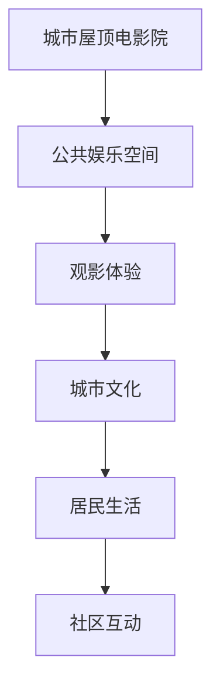

                 

### 《新型城市屋顶电影院：公共娱乐空间的创新》

---

#### 关键词
新型城市屋顶电影院、公共娱乐空间、设计原则、技术实现、智能管理、案例分析

#### 摘要
本文探讨了新型城市屋顶电影院的概念、设计原则、技术实现、智能管理和实际案例，旨在为城市公共娱乐空间提供创新的解决方案。通过详细的原理讲解、算法实现和案例研究，本文揭示了城市屋顶电影院在提升城市生活品质和居民娱乐体验方面的巨大潜力。

---

## 引言

随着城市化进程的加快，城市公共空间的重要性日益凸显。公共娱乐空间作为城市生活的重要组成部分，不仅能够提升居民的生活品质，还能促进社区互动和文化交流。在城市有限的空间资源中，如何创造更多功能丰富的公共娱乐空间成为了一个亟待解决的问题。

近年来，一种新型公共娱乐空间——城市屋顶电影院逐渐引起了人们的关注。城市屋顶电影院利用城市建筑的屋顶空间，将电影院与城市景观相结合，为居民提供了一种独特而富有吸引力的娱乐体验。本文将从背景介绍、核心概念、设计原则、技术实现、智能管理和案例分析等方面，对新型城市屋顶电影院进行深入探讨。

## 核心概念与联系

### 1. 城市屋顶电影院的概念

城市屋顶电影院指的是利用城市建筑物的屋顶空间建造的露天电影院。它不仅具备传统电影院的功能，还能将城市景观和自然元素融入观影体验中，为观众提供独特的视觉和听觉享受。

### 2. 公共娱乐空间的概念

公共娱乐空间是指供城市居民共同使用的、用于娱乐、休闲和社交活动的场所。这种空间通常具有开放性、共享性和多功能性，能够满足不同人群的娱乐需求。

### 3. 城市屋顶电影院与公共娱乐空间的联系

城市屋顶电影院作为一种新型公共娱乐空间，不仅满足了居民对观影娱乐的需求，还因其独特的设计和体验，成为城市文化的新地标。它将电影文化与城市生活紧密结合，为城市居民提供了一个新的社交和休闲场所。

### 4. Mermaid流程图

以下是城市屋顶电影院与公共娱乐空间关系的Mermaid流程图：

通过这个流程图，我们可以清晰地看到城市屋顶电影院作为公共娱乐空间的核心角色，以及它对城市文化、居民生活和社区互动的深远影响。

## 设计原则

### 1. 功能性与美观性的平衡

城市屋顶电影院的设计需要在功能性上满足观影需求，同时追求美观性，使其成为城市的一道亮丽风景。设计原则包括：

- **空间布局**：合理规划观影区和观众席，确保观影舒适性和视野开阔。
- **照明设计**：采用柔和的灯光设计，增强观影氛围。
- **结构安全**：确保屋顶结构的稳固性，防止意外事故发生。

### 2. 环境保护与可持续性

在城市屋顶电影院的设计中，环境保护和可持续性是至关重要的。设计原则包括：

- **绿色屋顶**：采用植被覆盖屋顶，减少城市热岛效应，提供自然氧吧。
- **能源利用**：利用太阳能等可再生能源，降低能耗。
- **水资源管理**：采用雨水收集系统，用于植物灌溉和屋顶清洗。

### 3. 安全性考虑

城市屋顶电影院的安全设计至关重要。设计原则包括：

- **防风设计**：考虑屋顶结构在强风条件下的稳定性。
- **防水设计**：确保屋顶防水层完整，防止雨水渗漏。
- **应急逃生**：设置明显的逃生指示和紧急出口。

## 技术实现

### 1. 屋顶结构设计

城市屋顶电影院的屋顶结构需要具备足够的承载能力和稳定性。设计原则包括：

- **材料选择**：选择轻质高强度的建筑材料，如预制混凝土板或轻钢结构。
- **结构计算**：进行精确的结构计算，确保屋顶能够承受风荷载和重力荷载。

### 2. 音响与视频技术

为了提供优质的观影体验，城市屋顶电影院需要采用先进的音响和视频技术。技术实现包括：

- **音响系统**：配置高保真音响设备，确保声音清晰响亮。
- **投影系统**：采用大型高分辨率投影屏幕，提供高质量的图像。

### 3. 观影体验技术

观影体验是城市屋顶电影院的核心，设计原则包括：

- **座位设计**：采用可调节的座位，确保观众舒适。
- **视线优化**：通过科学布局，确保每个观众都能获得良好的观影视线。

## 智能化管理与运营

### 1. 智能灯光与音响系统

智能灯光和音响系统可以提升观影体验，实现个性化服务。技术实现包括：

- **灯光控制系统**：采用智能灯光控制系统，实现自动调节和场景切换。
- **音响控制系统**：采用无线音响系统，实现灵活布置和音效优化。

### 2. 智能观众管理

智能观众管理可以提高运营效率，减少人工成本。技术实现包括：

- **电子票务系统**：采用电子票务系统，实现线上购票和自动入场。
- **观众行为分析**：利用大数据和人工智能技术，分析观众行为，优化运营策略。

## 案例研究

### 1. 国内外城市屋顶电影院的案例介绍

为了更好地了解城市屋顶电影院的实际应用，本文将介绍国内外的一些成功案例。

- **北京城市副中心屋顶电影院**：位于北京市通州区，利用建筑屋顶空间建造，提供了独特的观影体验。
- **新加坡滨海湾屋顶电影院**：位于新加坡滨海湾地区，结合绿色屋顶设计和智能音响系统，成为当地的新兴文化地标。

### 2. 案例分析与评估

通过对这些案例的分析，可以发现城市屋顶电影院在提升城市文化氛围、促进社区互动和推动旅游业发展方面具有显著作用。同时，案例中也存在一些问题和挑战，如屋顶结构的稳定性和防水问题等。

### 3. 案例启示与未来趋势

这些案例为新型城市屋顶电影院的设计和运营提供了有益的启示。未来，随着技术的不断进步，城市屋顶电影院将在设计理念、技术实现和运营模式方面不断创新，为城市公共娱乐空间带来更多可能性。

## 项目实施与运营

### 1. 项目立项与规划

项目立项与规划是城市屋顶电影院成功的关键。这一阶段需要明确项目目标、预算和时间表，并制定详细的规划方案。

### 2. 施工过程与质量控制

施工过程需要严格按照规划方案进行，确保工程质量。质量控制包括对建筑材料、施工工艺和设备安装的严格检查。

### 3. 运营管理与营销策略

运营管理包括票务、观众服务、设备维护等方面。营销策略需要结合目标受众，制定个性化的宣传推广方案。

## 总结与展望

新型城市屋顶电影院作为公共娱乐空间的一种创新形式，具有广阔的发展前景。未来，随着技术的不断进步和设计理念的更新，城市屋顶电影院将在提升城市生活品质、促进文化传承和推动旅游业发展方面发挥更加重要的作用。

### 最佳实践 Tips

- **设计初期要充分考虑屋顶结构的安全性**。
- **智能管理系统要注重数据安全和隐私保护**。
- **运营过程中要定期进行设备维护和检查**。

### 小结

本文详细介绍了新型城市屋顶电影院的设计原则、技术实现、智能管理和实际案例，揭示了其在城市公共娱乐空间中的巨大潜力。通过深入分析和案例研究，我们为新型城市屋顶电影院的发展提供了有益的思考和借鉴。

### 注意事项

- 城市屋顶电影院的设计和施工需要严格遵守相关法律法规。
- 智能管理系统的开发和部署要充分考虑用户需求和用户体验。

### 拓展阅读

- 《城市公共空间设计原理》
- 《智能建筑与物联网技术》
- 《城市文化产业发展报告》

---

## 作者信息

作者：AI天才研究院/AI Genius Institute & 禅与计算机程序设计艺术 /Zen And The Art of Computer Programming

