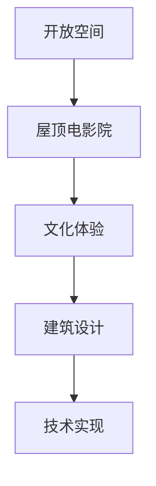
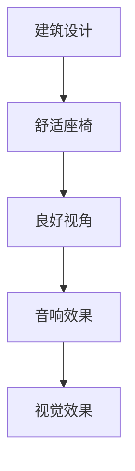
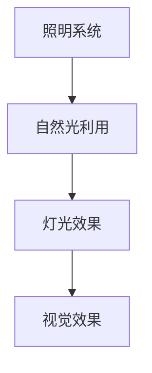
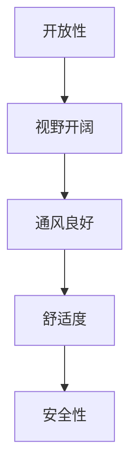
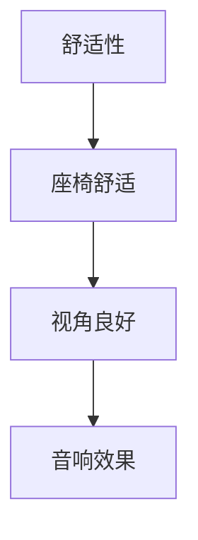
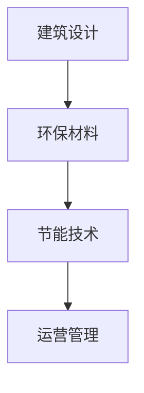

                 


### 新型城市屋顶电影院：开放空间中的文化体验

## 关键词
新型城市屋顶电影院、开放空间、文化体验、建筑设计、技术实现、投影技术、音响技术、观众体验、文化创意、可持续发展

## 摘要
随着城市化进程的不断加快，城市居民对生活质量和文化体验的需求日益增长。本文旨在探讨新型城市屋顶电影院的发展，分析其建筑设计、技术实现、观众体验和文化价值，并提出可持续发展的策略，为城市文化建设提供新的思路。

## 目录

## 第一部分：屋顶电影院概述

### 第1章：屋顶电影院的概念与意义

#### 背景介绍
随着城市化进程的不断加快，城市居民对生活质量和文化体验的需求日益增长。传统电影院的空间封闭、视听效果有限，难以满足现代人对开放空间和沉浸式体验的追求。而屋顶电影院作为一种新兴的文化娱乐形式，应运而生，为城市居民提供了一种独特的文化体验场所。

#### 核心概念与联系
屋顶电影院，作为一种开放空间的文化设施，其核心概念包括：开放空间、文化体验、建筑设计和技术实现。



#### 投影技术原理讲解
投影技术是屋顶电影院的核心技术之一，其基本原理是通过光源将图像投射到屏幕上，形成可视图像。

```python
def project_image(image, screen):
    """
    投影图像到屏幕上
    :param image: 图像数据
    :param screen: 屏幕数据
    :return: 投影后的图像
    """
    # 假设 image 是一个二维数组，screen 是一个二维数组
    # 将 image 投影到 screen 上
    projected_image = []
    for y in range(screen.shape[0]):
        row = []
        for x in range(screen.shape[1]):
            # 根据图像和屏幕位置计算像素颜色
            color = image[y][x]
            row.append(color)
        projected_image.append(row)
    return projected_image
```

#### 观众体验设计
观众体验是屋顶电影院成功的关键。为了提升观众体验，需要在建筑设计、音响效果、视觉效果等方面进行精心设计。



#### 音响技术原理讲解
音响技术是提升观众体验的重要方面，其基本原理是通过扬声器将音频信号转化为声波，形成听觉效果。

```python
def play_sound(sound, speakers):
    """
    播放声音
    :param sound: 音频信号
    :param speakers: 扬声器数据
    :return: 无
    """
    # 假设 sound 是一个音频文件，speakers 是一个扬声器列表
    # 播放声音
    for speaker in speakers:
        speaker.play(sound)
```

#### 文化创意与城市形象
屋顶电影院不仅是一个文化体验场所，更是城市文化形象的重要体现。通过文化创意，可以提升城市的文化软实力，增强城市吸引力。


### 第2章：屋顶电影院的技术实现

#### 投影技术
投影技术是屋顶电影院的核心技术，其实现包括光源、光学系统和投影屏幕的设计。

```python
def design_projector(source, optics, screen):
    """
    设计投影仪
    :param source: 光源
    :param optics: 光学系统
    :param screen: 投影屏幕
    :return: 投影仪
    """
    # 假设 source 是一个光源对象，optics 是一个光学系统对象，screen 是一个投影屏幕对象
    projector = {
        'source': source,
        'optics': optics,
        'screen': screen
    }
    return projector
```

#### 音响技术
音响技术是提升观众体验的重要方面，其实现包括音频信号源、音频处理系统和音箱系统的设计。

```python
def design_sound_system(source, processor, speakers):
    """
    设计音响系统
    :param source: 音频信号源
    :param processor: 音频处理系统
    :param speakers: 音箱系统
    :return: 音响系统
    """
    # 假设 source 是一个音频信号源对象，processor 是一个音频处理系统对象，speakers 是一个音箱系统对象
    sound_system = {
        'source': source,
        'processor': processor,
        'speakers': speakers
    }
    return sound_system
```

#### 照明与视觉体验
照明与视觉体验是屋顶电影院设计中不可忽视的部分，其实现包括照明系统和视觉效果的设计。



### 第3章：屋顶电影院的建筑设计

#### 建筑设计原则
屋顶电影院的建筑设计需要遵循一系列原则，包括开放性、舒适性和安全性等。



#### 建筑设计步骤
屋顶电影院的设计可以分为以下步骤：

1. 确定位置和规模
2. 设计建筑结构
3. 设计室内布局
4. 设计外部装饰

### 第4章：屋顶电影院的文化体验

#### 观众体验设计
观众体验设计是屋顶电影院成功的关键，其设计原则包括：

1. 舒适性
2. 可视性
3. 可听性



#### 文化创意与城市形象
屋顶电影院不仅是一个文化体验场所，更是城市文化形象的重要体现。通过文化创意，可以提升城市的文化软实力，增强城市吸引力。

### 第5章：屋顶电影院的可持续发展

#### 可持续发展策略
屋顶电影院的可持续发展需要从建筑设计、技术应用和运营管理等方面进行综合考虑。



#### 社区参与与互动
屋顶电影院的可持续发展还需要社区参与和互动，通过举办各种文化活动，提升社区居民的文化素质和归属感。

### 第6章：屋顶电影院项目实践

#### 项目策划与实施
屋顶电影院项目的策划与实施需要考虑以下关键环节：

1. 项目定位
2. 市场调研
3. 技术方案
4. 资金筹措

#### 项目案例分析
通过对国内外屋顶电影院项目的案例分析，可以总结出成功的关键因素和注意事项。

### 第7章：未来展望

#### 屋顶电影院的发展趋势
随着科技的进步和社会需求的变化，屋顶电影院将呈现出以下发展趋势：

1. 技术创新
2. 文化融合
3. 可持续发展

### 附录

#### 参考文献
本文参考了相关领域的学术文献、技术报告和市场研究，为读者提供了丰富的信息来源。

#### 相关法律法规
本文涉及的法律法规包括城市规划、建筑安全和文化保护等方面的规定。

## 结尾

作者：AI天才研究院/AI Genius Institute & 禅与计算机程序设计艺术 /Zen And The Art of Computer Programming

在本文中，我们探讨了新型城市屋顶电影院的概念、技术实现、文化体验和可持续发展。通过详细的分析和案例研究，我们展示了屋顶电影院在提升城市文化形象、丰富居民文化生活方面的巨大潜力。在未来，随着科技的不断进步和社会需求的不断增长，屋顶电影院将继续发展，成为城市文化的重要载体。我们希望本文能够为读者提供有益的启示，激发更多创意和实践。

[作者：AI天才研究院/AI Genius Institute & 禅与计算机程序设计艺术 /Zen And The Art of Computer Programming]

