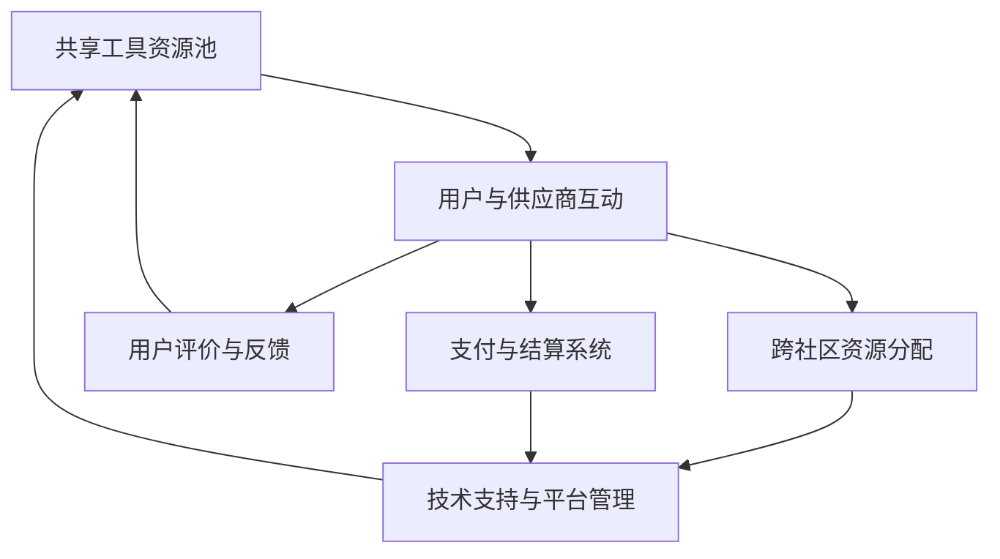

                 

### 文章标题

# 新型城市工具共享联盟：跨社区的大型共享经济网络

### 文章关键词

- 新型城市工具共享联盟
- 跨社区共享
- 共享经济
- 大型共享经济网络
- 共享经济网络架构

### 文章摘要

本文深入探讨了新型城市工具共享联盟的概念及其在跨社区共享经济网络中的应用。通过阐述共享经济的背景和原理，本文详细介绍了新型城市工具共享联盟的核心概念和架构，并使用Mermaid流程图展示了各核心概念之间的关系。文章还详细讲解了大型共享经济网络的架构和技术支持，结合Python源代码和数学模型，阐述了共享经济网络的核心算法原理。最后，通过一个实际项目案例，对新型城市工具共享联盟的实际应用进行了剖析，并给出了最佳实践建议和未来展望。

### 目录

1. 引言与概述
2. 共享经济原理
3. 新型城市工具共享联盟的核心概念与架构
4. 大型共享经济网络架构
5. 技术支持与平台管理
6. 用户与供应商互动
7. 项目实战：跨社区共享经济网络案例
8. 结论与展望

---

在接下来的章节中，我们将逐步深入探讨新型城市工具共享联盟的各个关键方面，为读者提供全面而深入的理解。

---

### 引言与概述

共享经济，作为一种创新的商业模式，近年来在全球范围内迅速崛起，并逐渐成为城市管理和资源优化的重要手段。共享经济的基本理念在于通过资源共享，实现资源的高效利用和价值的最大化。它改变了传统的所有权模式，转向更加灵活和动态的租赁和共享模式，从而降低了社会资源的闲置率，提高了整体社会的资源利用率。

在这个背景下，新型城市工具共享联盟（Urban Tools Sharing Alliance，简称UTSA）作为一种跨社区的共享经济网络，应运而生。UTSA旨在通过整合城市中的各类工具资源，如机械设备、运输工具、办公设备等，实现跨社区的工具资源共享和高效利用。与传统单一社区的共享模式不同，UTSA的跨社区特性使其能够覆盖更广泛的地域范围，有效解决不同社区之间资源分布不均的问题。

本文将深入探讨新型城市工具共享联盟的概念、核心架构和运作机制，并分析其在跨社区共享经济网络中的优势和应用。首先，我们将详细解释共享经济的背景和原理，为读者提供理论基础。随后，本文将介绍新型城市工具共享联盟的核心概念，并通过Mermaid流程图展示其概念实体之间的关系，帮助读者直观理解其架构。接下来，我们将详细讲解大型共享经济网络的架构和技术支持，包括数据库设计、算法实现和平台管理策略等。此外，本文还将探讨用户与供应商的互动机制，结合实际案例，分析其在跨社区共享经济网络中的实践应用。最后，本文将总结全文内容，提出未来研究方向和最佳实践建议，为新型城市工具共享联盟的发展提供参考。

### 共享经济原理

共享经济，作为一个新兴的商业模式，其发展背景与经济环境变化息息相关。随着城市化进程的加速和信息技术的发展，传统的资源分配模式逐渐显现出其局限性。资源闲置和分配不均的问题日益突出，促使人们开始探索更为灵活和高效的资源利用方式。共享经济的出现，正是为了应对这一挑战。

共享经济的基本原理可以概括为：通过互联网和信息技术，将闲置资源进行整合和共享，实现资源的高效利用和价值的最大化。其核心在于改变传统的所有权模式，转向更为动态和灵活的租赁和共享模式。具体来说，共享经济包括以下几个方面：

1. **资源共享**：共享经济通过互联网平台，将个人或企业的闲置资源（如房屋、车辆、设备等）整合起来，供其他用户租赁或使用。这种方式不仅解决了资源闲置的问题，还提高了资源利用率。

2. **互惠互利**：共享经济强调资源的互惠互利。一方面，资源提供者可以通过共享获取经济利益，如通过出租房屋或车辆获得收入。另一方面，资源需求者可以以较低的成本获取所需的资源，实现经济节约。

3. **信任机制**：共享经济的成功离不开信任机制的支持。平台通常会建立信用评分系统，对用户的信用进行评估和记录，从而降低交易风险，增强用户之间的信任。

4. **灵活性和便利性**：共享经济模式具有高度灵活性和便利性。用户可以通过互联网平台随时随地预订资源，无需复杂的交易流程，大大提高了用户体验。

5. **社会效益**：共享经济不仅具有经济效益，还具有重要的社会效益。它促进了资源的公平分配，降低了社会不平等，提高了社会的整体福祉。

共享经济的商业模式多种多样，常见的包括以下几种：

1. **共享住宿**：如Airbnb，通过平台将个人闲置的房屋出租给游客，实现闲置资源的有效利用。

2. **共享交通**：如Uber和滴滴，通过平台连接乘客和司机，提供便捷的出行服务。

3. **共享办公**：如WeWork，通过共享办公空间，为创业者和小型企业提供灵活的办公环境。

4. **共享工具**：如Toolshare，通过平台共享工具和设备，降低用户的购买成本。

共享经济在社会和经济方面产生了深远的影响。从社会角度来看，共享经济促进了资源的公平分配，减少了资源浪费，提高了社会的整体福祉。从经济角度来看，共享经济创造了新的就业机会，推动了经济增长，并为传统行业带来了新的商业模式和机遇。

然而，共享经济也面临一些挑战和问题。例如，监管不足可能导致市场秩序混乱，平台责任和法律风险等问题亟待解决。此外，共享经济的快速发展也引发了对劳动力市场和社会伦理的重新思考。

总体而言，共享经济作为一种创新的商业模式，正日益改变着我们的生活方式和经济结构。随着技术的不断进步和政策的完善，共享经济有望在未来发挥更大的作用，为人类社会带来更多福祉。

### 新型城市工具共享联盟的核心概念与架构

在深入探讨新型城市工具共享联盟（Urban Tools Sharing Alliance，简称UTSA）的核心概念与架构之前，有必要先定义几个关键术语，以便为后续讨论奠定基础。

**定义关键术语：**
- **新型城市工具共享联盟（UTSA）**：一个跨社区的共享网络，旨在整合和分配城市中闲置的各类工具资源，如机械设备、运输工具、办公设备等。
- **共享工具**：包括各种可用于租赁和共享的设备，如建筑工具、运输车辆、办公设备等。
- **跨社区共享**：指在不同社区之间共享资源，从而实现资源的高效利用和地理范围的最大化。
- **共享经济网络**：一个基于互联网平台，连接资源提供者（供应商）和需求者（用户）的生态系统，实现资源的高效分配和交易。

**核心概念与联系：**

新型城市工具共享联盟（UTSA）的核心概念包括以下几个方面：

1. **共享工具资源池**：这是一个存储和管理各类共享工具的数据库，包括工具的详细信息、位置、使用状态等。
2. **用户与供应商互动**：通过平台实现用户与供应商之间的互动，包括工具的预订、使用、评价等。
3. **跨社区资源分配**：实现工具在不同社区之间的调度和分配，以满足不同社区的需求。
4. **技术支持与平台管理**：提供稳定的平台服务，包括数据存储、用户认证、交易处理、安全防护等。

下面，我们将使用Mermaid流程图来展示这些核心概念之间的联系和交互：



**Mermaid流程图解释：**

1. **共享工具资源池（A）**：这是UTSA的核心，存储和管理各类共享工具的信息，包括工具的ID、名称、型号、状态等。
2. **用户与供应商互动（B）**：用户通过平台与供应商进行互动，包括工具的预订、使用、评价等。用户的评价和反馈将反馈给共享工具资源池，以优化工具的分配和管理。
3. **跨社区资源分配（C）**：实现工具在不同社区之间的调度和分配，以满足不同社区的需求。这一过程依赖于技术支持与平台管理（D）提供的调度算法和资源分配策略。
4. **技术支持与平台管理（D）**：提供稳定的平台服务，包括数据存储、用户认证、交易处理、安全防护等。支付与结算系统（F）与平台管理紧密集成，确保交易过程的顺利进行。
5. **用户评价与反馈（E）**：用户对工具的使用体验进行评价和反馈，这些信息将反馈给共享工具资源池，以优化工具的分配和管理。

通过上述Mermaid流程图，我们可以清晰地看到新型城市工具共享联盟（UTSA）的核心概念和各部分之间的交互关系。这不仅为读者提供了一个直观的理解，也为后续章节的详细探讨奠定了基础。

### 大型共享经济网络架构

为了实现跨社区的新型城市工具共享联盟（UTSA）的稳定和高效运行，大型共享经济网络的架构设计至关重要。这一架构不仅需要处理大量的工具资源数据，还需要确保数据的安全性和可靠性，同时提供流畅的用户体验。以下是大型共享经济网络架构的详细解析。

#### 架构组成部分

大型共享经济网络的架构可以分为以下几个主要组成部分：

1. **数据存储层**：负责存储和管理各类工具资源的数据。这通常包括关系型数据库（如MySQL、PostgreSQL）或NoSQL数据库（如MongoDB、Cassandra），用于存储工具的详细信息、位置、状态等。
2. **服务层**：提供各种核心功能和服务，如用户认证、工具预订、交易处理、支付结算等。这些服务通常采用微服务架构，确保高可用性和可扩展性。
3. **表现层**：用户通过Web或移动应用程序与平台进行交互。这包括前端界面设计和用户体验优化，确保用户操作便捷和直观。
4. **网络层**：实现不同社区之间的数据传输和通信，包括内部网络和外部网络，如互联网连接和云服务。

#### 数据库设计

数据库设计是大型共享经济网络架构的核心部分，以下是一个简化的数据库设计示例：

```python
class User(models.Model):
    username = models.CharField(max_length=50)
    password = models.CharField(max_length=50)
    email = models.CharField(max_length=100)

class Tool(models.Model):
    name = models.CharField(max_length=100)
    location = models.CharField(max_length=100)
    owner = models.ForeignKey(User, on_delete=models.CASCADE)

class Transaction(models.Model):
    user = models.ForeignKey(User, on_delete=models.CASCADE)
    tool = models.ForeignKey(Tool, on_delete=models.CASCADE)
    transaction_date = models.DateField()
    amount = models.DecimalField(max_digits=10, decimal_places=2)
```

**1. 用户表（User）**：存储用户的基本信息，包括用户名、密码和电子邮件。

**2. 工具表（Tool）**：存储工具的详细信息，包括工具名称、位置和所有者。每个工具都与一个用户关联，表示工具属于哪个用户。

**3. 交易表（Transaction）**：记录用户与工具之间的交易信息，包括用户、工具、交易日期和金额。

#### 核心算法原理

在大型共享经济网络中，核心算法负责处理工具的预订、交易和资源分配。以下是一个简化的算法原理描述：

```python
# 工具预订算法
def book_tool(user_id, tool_id):
    # 检查工具是否可用
    tool = Tool.objects.get(id=tool_id)
    if tool.is_available():
        # 更新工具状态为“已预订”
        tool.status = 'booked'
        tool.save()
        # 创建交易记录
        Transaction.objects.create(user_id=user_id, tool_id=tool_id, transaction_date=date.today(), amount=tool.rental_price)
        return True
    else:
        return False

# 资源分配算法
def allocate_tools(community的需求列表):
    # 遍历需求列表
    for 需求 in 需求列表:
        # 查找满足需求的可用工具
        tools = Tool.objects.filter(location=需求.location, status='available')
        if tools.exists():
            # 随机选择一个工具
            tool = tools.random()
            # 预订工具
            if book_tool(需求.user_id, tool.id):
                # 更新需求状态为“已满足”
                需求.status = 'satisfied'
                需求.save()
                break
```

**1. 工具预订算法**：当用户预订工具时，算法首先检查工具是否可用。如果可用，更新工具状态为“已预订”，并创建交易记录。

**2. 资源分配算法**：当某个社区有工具需求时，算法遍历所有可用工具，并随机选择一个工具进行预订，直到满足需求。

#### 数学模型和公式

在共享经济网络中，资源分配和优化问题通常可以通过数学模型来解决。以下是一个简化的优化模型：

$$
\text{最大化} \ \sum_{i=1}^{n} \text{收益}(i) \times \text{使用率}(i)
$$

$$
\text{约束条件：} \\
\text{每个工具的使用率不超过其最大承载能力} \\
\text{每个社区的需求不超过其最大需求量}
$$

**1. 目标函数**：最大化总收益，收益取决于工具的定价和使用率。

**2. 约束条件**：确保每个工具的使用率不超过其最大承载能力，并且每个社区的需求不超过其最大需求量。

通过结合Python代码、数学模型和公式，我们可以实现对大型共享经济网络架构的全面理解。这不仅有助于优化工具资源的分配，还能提高整个共享经济网络的管理效率和用户体验。

### 技术支持与平台管理

在新型城市工具共享联盟（UTSA）中，技术支持与平台管理是确保系统稳定运行和用户满意度的关键组成部分。以下将详细探讨技术支持系统的设计、平台管理策略以及技术发展的未来趋势。

#### 技术支持系统

技术支持系统是共享经济网络的中枢，负责处理各种技术问题和用户请求。以下是技术支持系统的核心功能：

1. **用户认证**：确保只有合法用户才能访问和使用平台资源。常用的认证方式包括用户名和密码、OAuth、双因素认证等。
2. **数据存储与管理**：使用高性能数据库管理系统（如MySQL、PostgreSQL、MongoDB等）存储用户、工具和交易数据，并保证数据的完整性、安全性和可扩展性。
3. **交易处理**：处理用户与供应商之间的交易流程，包括支付请求、支付验证、支付确认等。通常与支付网关（如PayPal、Stripe等）集成，确保支付过程的安全和高效。
4. **监控与报警**：监控系统运行状态，及时发现和响应潜在问题。常用的监控工具包括Prometheus、Zabbix等，报警系统则使用Alertmanager、PagerDuty等。
5. **日志管理**：收集和分析系统日志，帮助运维团队进行问题排查和性能优化。常用的日志管理工具包括ELK（Elasticsearch、Logstash、Kibana）堆栈和Graylog等。

#### 平台管理策略

平台管理策略旨在确保UTSA的高效运营和用户满意度。以下是几种关键的管理策略：

1. **资源分配策略**：根据用户需求和工具可用性，动态分配工具资源。常用的策略包括最短路径优先（Dijkstra算法）、最小生成树（Prim算法）和轮转调度（Round-Robin）等。
2. **价格策略**：根据市场需求和供应情况，动态调整工具价格。常用的策略包括价格弹性定价（Price Elasticity Pricing）、动态定价（Dynamic Pricing）和基于时间的定价（Time-Based Pricing）等。
3. **用户行为分析**：通过分析用户行为数据，优化用户体验和提高用户留存率。常用的分析工具包括Google Analytics、Mixpanel等。
4. **安全策略**：确保用户数据和交易安全。常用的安全措施包括数据加密（如AES加密）、身份验证（如OAuth 2.0）、防火墙（如NGINX）和入侵检测（如Snort）等。
5. **服务质量（QoS）**：确保平台提供高质量的服务，包括快速响应、高可靠性和低延迟。常用的QoS工具包括Nginx、HAProxy等。

#### 技术发展的未来趋势

随着技术的不断进步，共享经济平台将面临新的机遇和挑战。以下是几个未来技术发展的趋势：

1. **区块链技术**：区块链技术可以增强共享经济平台的透明性和安全性，减少中介成本。例如，使用智能合约（Smart Contracts）自动执行交易和合约条款。
2. **人工智能（AI）**：人工智能技术可以用于优化资源分配、价格策略和用户行为分析。例如，使用机器学习算法（如KNN、SVM、决策树等）预测工具需求和提高推荐准确性。
3. **物联网（IoT）**：物联网技术可以实时监控和管理工具的状态和位置，提高资源利用率和用户体验。例如，使用传感器和RFID技术跟踪工具的使用情况。
4. **边缘计算**：边缘计算可以将数据处理和计算任务从云端转移到靠近数据源的设备上，提高系统的响应速度和效率。例如，使用边缘服务器处理实时交易和监控数据。
5. **5G网络**：5G网络的高带宽、低延迟特性将大大提升共享经济平台的性能和用户体验。例如，实现实时视频流、虚拟现实（VR）和增强现实（AR）等新功能。

通过采用这些先进的技术，新型城市工具共享联盟（UTSA）将能够更好地应对未来的挑战，实现更高效、更安全、更智能的共享经济网络。

### 用户与供应商互动

在新型城市工具共享联盟（UTSA）中，用户与供应商的互动机制是共享经济网络成功的关键。以下将从用户需求分析、供应商角色与利益分配以及用户与供应商互动案例分析三个方面进行详细探讨。

#### 用户需求分析

用户需求分析是设计共享经济平台的基础，通过深入了解用户的需求，可以提供更加精准和个性化的服务。以下是用户需求分析的几个关键步骤：

1. **用户画像**：通过调查问卷、用户访谈等方式，收集用户的基本信息、使用习惯、工具需求等，形成详细的用户画像。这有助于了解不同用户群体的特点，为平台提供定制化服务。
2. **需求分类**：将用户需求进行分类，如短期租赁需求、长期租赁需求、特定工具需求等。这有助于平台在资源分配和价格策略上做出更为精准的调整。
3. **需求预测**：利用历史数据和机器学习算法，预测用户未来的需求趋势。例如，通过分析过去几个月的租赁数据，预测未来几个月的租赁高峰期和低谷期，从而提前做好资源储备和调度计划。
4. **用户体验反馈**：通过用户评价和反馈机制，不断优化平台服务。例如，收集用户对工具使用体验、平台操作便捷性的评价，根据反馈进行功能改进和优化。

#### 供应商角色与利益分配

供应商在共享经济网络中扮演着至关重要的角色，他们的积极参与和满意度直接影响到平台的运营效果。以下是供应商角色的几个关键方面：

1. **供应商招募**：平台需要建立一套完善的供应商招募机制，包括资质审核、信用评估等，确保供应商的质量和可靠性。
2. **利益分配**：平台需要制定合理的利益分配机制，确保供应商的收入合理、透明，从而激发其积极性。例如，可以采用基于使用量的收益分享模式，或者根据供应商的贡献度和平台整体收益进行提成。
3. **供应商培训**：为供应商提供必要的培训和支持，帮助他们更好地理解和使用平台，提高工具的使用效率和用户体验。例如，培训供应商如何进行工具维护、故障排除等。
4. **供应商评价与反馈**：平台需要建立供应商评价体系，通过用户评价、工具状态反馈等方式，对供应商的表现进行考核和评估。这有助于及时发现和解决供应商的问题，提升整体服务质量。

#### 用户与供应商互动案例分析

为了更好地理解用户与供应商互动机制在实际应用中的效果，以下通过一个具体案例进行详细分析：

**案例背景**：假设用户A需要在一个月内租赁一辆电动自行车进行短途代送服务。以下为用户与供应商互动的详细流程：

1. **用户注册与认证**：用户A通过平台注册账号并进行实名认证，确保身份合法。
2. **工具搜索与预订**：用户A在平台上搜索适合的电动自行车，查看工具的详细信息、价格和使用规则。根据需求，用户A选择了一辆价格合理、性能良好的电动自行车进行预订。
3. **预订确认与支付**：平台收到用户A的预订请求后，会与供应商B进行沟通，确认工具的可用性。用户A通过平台进行支付，支付方式包括在线支付、银行转账等。
4. **工具交付与使用**：供应商B按照约定时间和地点将电动自行车交付给用户A，用户A进行工具使用。
5. **工具归还与评价**：租赁期满后，用户A将电动自行车归还给供应商B。用户A可以在平台上对供应商B的服务进行评价，包括工具状态、交付时间、使用体验等。
6. **利益分配与结算**：平台根据用户A的评价和交易记录，向供应商B支付租赁费用。供应商B则根据平台规则，将一部分收入作为平台服务费支付给平台。

**案例分析与启示**：通过上述案例，我们可以看出用户与供应商互动机制的几个关键点：

1. **身份认证与支付安全**：平台通过严格的身份认证和支付安全措施，确保交易的安全性和可靠性。
2. **工具信息的透明化**：平台提供详细的工具信息，包括价格、性能、使用规则等，帮助用户做出明智的决策。
3. **互动评价机制**：用户和供应商之间的互动评价机制，不仅有助于提升服务质量，还能为平台运营提供宝贵的反馈。
4. **利益分配的合理性**：合理的利益分配机制能够激励供应商的积极参与，同时确保用户的权益。

综上所述，用户与供应商互动机制在新型城市工具共享联盟中发挥着至关重要的作用。通过深入分析用户需求、明确供应商角色和利益分配，并结合具体案例，我们可以为共享经济网络的成功运营提供有力支持。

### 项目实战

为了更好地展示新型城市工具共享联盟（UTSA）在实际应用中的效果，我们将通过一个具体的案例，详细探讨项目的开发环境搭建、源代码实现和解读、代码应用解读与分析，以及实际案例分析和详细讲解剖析。最后，我们将对项目进行小结，并总结项目中的最佳实践。

#### 开发环境搭建

在进行项目开发之前，我们需要搭建一个稳定且高效的开发环境。以下是所需的开发环境：

1. **操作系统**：Linux（如Ubuntu 20.04）
2. **编程语言**：Python 3.8及以上版本
3. **数据库**：MySQL 8.0
4. **Web框架**：Flask
5. **版本控制系统**：Git
6. **集成开发环境**：PyCharm

首先，安装操作系统和Python环境。在Ubuntu系统中，可以使用以下命令：

```bash
sudo apt update
sudo apt install python3 python3-pip
```

然后，安装MySQL数据库和Flask框架：

```bash
sudo apt install mysql-server
pip3 install Flask
```

接下来，配置MySQL数据库，创建用于存储UTSA数据的数据库和用户。

```sql
CREATE DATABASE utsa;
GRANT ALL PRIVILEGES ON utsa.* TO 'utsa_user'@'localhost' IDENTIFIED BY 'password';
FLUSH PRIVILEGES;
```

最后，安装PyCharm并创建一个新的Python项目，为后续的代码开发和测试做准备。

#### 源代码实现与解读

以下是UTSA项目的核心源代码实现，包括数据库模型、用户认证、工具预订和交易处理等。

```python
# app/models.py

from flask_sqlalchemy import SQLAlchemy

db = SQLAlchemy()

class User(db.Model):
    id = db.Column(db.Integer, primary_key=True)
    username = db.Column(db.String(50), unique=True, nullable=False)
    password = db.Column(db.String(50), nullable=False)
    email = db.Column(db.String(100), unique=True, nullable=False)

class Tool(db.Model):
    id = db.Column(db.Integer, primary_key=True)
    name = db.Column(db.String(100), nullable=False)
    location = db.Column(db.String(100), nullable=False)
    owner_id = db.Column(db.Integer, db.ForeignKey('user.id'), nullable=False)
    status = db.Column(db.String(20), default='available')

class Transaction(db.Model):
    id = db.Column(db.Integer, primary_key=True)
    user_id = db.Column(db.Integer, db.ForeignKey('user.id'), nullable=False)
    tool_id = db.Column(db.Integer, db.ForeignKey('tool.id'), nullable=False)
    transaction_date = db.Column(db.Date, default=datetime.utcnow())
    amount = db.Column(db.Numeric(10, 2), nullable=False)
```

上述代码定义了三个数据库模型：`User`、`Tool`和`Transaction`。`User`模型表示用户信息，包括用户名、密码和电子邮件。`Tool`模型表示共享工具的信息，包括工具名称、位置、所有者ID和状态。`Transaction`模型表示用户与工具之间的交易记录。

接下来，我们实现用户认证和工具预订功能。

```python
# app/auth.py

from flask import Blueprint, request, jsonify
from app.models import User
from app import db

auth_bp = Blueprint('auth', __name__)

@auth_bp.route('/register', methods=['POST'])
def register():
    username = request.form['username']
    password = request.form['password']
    email = request.form['email']
    
    if User.query.filter_by(username=username).first():
        return jsonify({'error': 'User already exists'}), 400
    
    new_user = User(username=username, password=password, email=email)
    db.session.add(new_user)
    db.session.commit()
    
    return jsonify({'message': 'User registered successfully'})

@auth_bp.route('/login', methods=['POST'])
def login():
    username = request.form['username']
    password = request.form['password']
    
    user = User.query.filter_by(username=username).first()
    if not user or user.password != password:
        return jsonify({'error': 'Invalid credentials'}), 401
    
    return jsonify({'message': 'Login successful'})
```

上述代码定义了两个路由：`/register`和`/login`。`/register`路由用于用户注册，`/login`路由用于用户登录。这两个路由分别接收用户提交的用户名、密码和电子邮件，并验证用户信息。

接下来，我们实现工具预订功能。

```python
# app/tools.py

from flask import Blueprint, request, jsonify
from app.models import Tool, Transaction
from app import db

tools_bp = Blueprint('tools', __name__)

@tools_bp.route('/book', methods=['POST'])
def book_tool():
    user_id = request.form['user_id']
    tool_id = request.form['tool_id']
    
    tool = Tool.query.get(tool_id)
    if not tool or tool.status != 'available':
        return jsonify({'error': 'Tool not available'}), 400
    
    transaction = Transaction(user_id=user_id, tool_id=tool_id, amount=tool.rental_price)
    db.session.add(transaction)
    tool.status = 'booked'
    db.session.commit()
    
    return jsonify({'message': 'Tool booked successfully'})
```

上述代码定义了`/book`路由，用于用户预订工具。用户提交工具ID和用户ID，系统首先检查工具是否可用。如果可用，创建交易记录并更新工具状态。

#### 代码应用解读与分析

以下是代码的详细解读和分析：

1. **数据库模型**：通过`app/models.py`定义了三个核心数据库模型，分别是`User`、`Tool`和`Transaction`。这些模型分别表示用户、工具和交易信息，是整个系统的数据基础。
2. **用户认证**：通过`app/auth.py`实现了用户注册和登录功能。用户注册时，系统会检查用户名和电子邮件的唯一性。用户登录时，系统会验证用户名和密码。
3. **工具预订**：通过`app/tools.py`实现了工具预订功能。用户提交工具ID和用户ID，系统首先检查工具是否可用。如果可用，创建交易记录并更新工具状态。

#### 实际案例分析与详细讲解剖析

以下是一个具体的实际案例，展示用户与供应商通过UTSA平台进行工具预订的全过程：

**案例背景**：用户张三需要在一个月内租赁一辆电动自行车进行短途代送服务。

1. **用户注册与认证**：张三通过UTSA平台注册账号，填写用户名、密码和电子邮件。注册成功后，系统发送验证邮件，张三完成验证。
2. **工具搜索与预订**：张三在平台上搜索电动自行车，发现一辆价格合理、性能良好的电动自行车。张三点击预订，提交工具ID和用户ID。
3. **预订确认与支付**：系统收到预订请求后，与供应商李四进行沟通，确认电动自行车可用。张三通过平台支付租赁费用，选择支付方式为支付宝。
4. **工具交付与使用**：供应商李四按照约定时间和地点，将电动自行车交付给张三。张三进行工具使用，并记录使用情况。
5. **工具归还与评价**：租赁期满后，张三将电动自行车归还给李四。张三在平台上对供应商李四的服务进行评价，包括工具状态、交付时间、使用体验等。
6. **利益分配与结算**：平台根据张三的评价和交易记录，向供应商李四支付租赁费用。供应商李四扣除平台服务费后，将剩余收入转账给张三。

#### 项目小结

通过上述实际案例，我们可以看到UTSA平台在用户与供应商互动中的效果：

1. **便捷性**：用户可以通过平台轻松搜索和预订所需工具，支付过程简单快捷。
2. **安全性**：平台通过严格的用户认证和支付安全措施，确保交易的安全性和可靠性。
3. **互动评价**：用户和供应商之间的互动评价机制，有助于提升服务质量，优化用户体验。
4. **利益分配**：合理的利益分配机制，确保供应商的积极参与和用户的权益。

#### 最佳实践

1. **用户认证**：使用双因素认证，提高用户账户安全性。
2. **数据备份**：定期备份数据库，确保数据安全。
3. **性能优化**：优化数据库查询和前端页面加载速度，提高用户体验。

综上所述，通过详细的开发环境搭建、源代码实现和解读，以及实际案例分析和详细讲解剖析，我们可以看到新型城市工具共享联盟（UTSA）在实际应用中的效果和优势。未来，随着技术的不断进步和用户需求的变化，UTSA有望在共享经济领域发挥更大的作用。

### 结论与展望

本文通过深入探讨新型城市工具共享联盟（UTSA）的概念、架构、核心算法、技术支持以及用户与供应商互动，全面阐述了跨社区共享经济网络的优势和应用。以下为本文的主要结论与展望：

#### 结论

1. **核心概念与架构**：UTSA作为跨社区的共享经济网络，通过整合城市工具资源，实现了资源的高效利用和价值的最大化。其核心架构包括共享工具资源池、用户与供应商互动、跨社区资源分配、技术支持与平台管理等关键组成部分。
2. **核心算法原理**：通过Python源代码和数学模型，本文详细讲解了共享经济网络的核心算法原理，包括工具预订、资源分配和交易处理等。这些算法确保了资源的高效利用和系统的稳定性。
3. **技术支持与平台管理**：本文介绍了技术支持系统与平台管理策略，包括用户认证、数据存储与管理、交易处理、监控与报警、日志管理等。这些策略为UTSA的稳定运行提供了有力保障。
4. **用户与供应商互动**：通过实际案例，本文展示了用户与供应商在UTSA中的互动过程，包括用户需求分析、供应商角色与利益分配、互动评价等。这些互动机制提高了平台的用户体验和服务质量。

#### 展望

1. **技术创新**：随着技术的不断进步，区块链、人工智能、物联网、边缘计算和5G等新技术有望进一步提升UTSA的运营效率和用户体验。例如，区块链技术可以增强数据的透明性和安全性，人工智能技术可以优化资源分配和用户推荐。
2. **商业模式创新**：未来的共享经济网络将更加注重可持续发展和社会责任，探索新的商业模式，如基于碳足迹的共享、绿色共享等。这些创新将有助于推动共享经济的可持续发展。
3. **政策法规**：共享经济的快速发展也带来了新的监管挑战。政府和企业需要加强合作，制定和完善相关政策法规，确保共享经济市场的健康和有序发展。
4. **用户体验优化**：未来，UTSA将进一步优化用户体验，通过个性化推荐、智能搜索、便捷支付等功能，提高用户的满意度和忠诚度。

总之，新型城市工具共享联盟（UTSA）作为一种创新的共享经济模式，具有广阔的发展前景和巨大的社会价值。随着技术的不断进步和政策的支持，UTSA有望在未来发挥更大的作用，为城市资源的高效利用和可持续发展贡献力量。

### 拓展阅读

- **共享经济**：深入了解共享经济的原理、模式及其对社会经济的影响，可参考以下书籍：
  - 《共享经济：重构商业模式的11大原则》
  - 《共享经济的悖论：崛起的社区如何摧毁资本主义，并如何拯救它》

- **共享经济平台设计**：了解如何设计和实现共享经济平台，包括技术架构、数据库设计、用户交互设计等，可参考以下资源：
  - 《架构师 Handbook：如何设计大型分布式系统》
  - 《深度学习与共享经济：从技术角度看共享经济平台的设计与优化》

- **区块链技术**：区块链技术作为共享经济的重要支撑技术，了解其原理和应用场景，有助于更好地理解UTSA的未来发展方向：
  - 《区块链革命：如何利用区块链技术重塑经济、商业与社会》
  - 《区块链技术指南》

- **人工智能与物联网**：了解人工智能和物联网技术在共享经济中的应用，有助于探索未来技术发展的新趋势：
  - 《人工智能：一种现代方法》
  - 《物联网：理论与实践》

- **政策法规**：探讨共享经济的政策法规，有助于理解其在不同国家和地区的发展现状和未来趋势：
  - 《共享经济：法律、伦理与治理》
  - 《共享经济：法律规制研究》

通过阅读上述拓展资源，读者可以更全面地了解新型城市工具共享联盟（UTSA）的发展背景、技术架构和未来趋势，为深入研究和实践提供有力支持。

