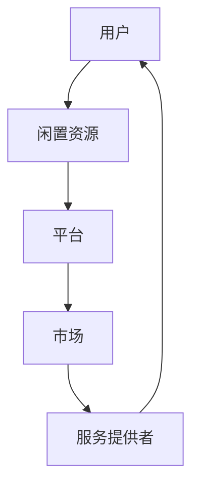
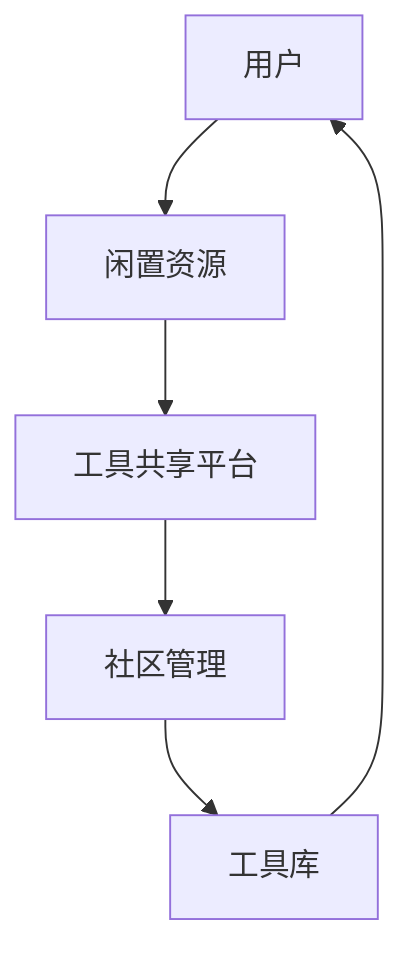
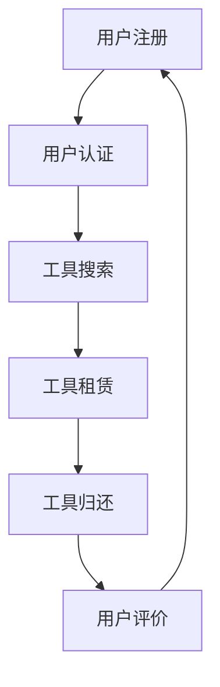

                 

### 文章标题：新型城市工具共享联盟：跨社区的大型共享经济网络

在当今快速发展的城市化进程中，共享经济模式逐渐成为解决资源短缺和环境问题的有效途径。本文旨在探讨一种新型城市工具共享联盟，即一种跨社区的大型共享经济网络，分析其概念、技术实现、运营管理及其未来的发展趋势。通过详细的案例分析，揭示这一模式如何促进城市资源的高效利用和可持续发展。

### 文章关键词

- **共享经济**
- **城市工具共享**
- **跨社区网络**
- **大型共享经济网络**
- **可持续发展**

### 文章摘要

本文首先介绍了共享经济的定义和背景，然后详细阐述了新型城市工具共享联盟的概念及其与共享经济的联系。接着，文章分析了跨社区共享网络的技术实现，包括构建原则和算法原理。随后，通过案例分析，展示了新型城市工具共享联盟在实践中的应用和效果。最后，文章探讨了该模式的发展趋势和未来挑战，提出了相关建议。

---

### 第一部分：共享经济的理论基础与历史发展

#### 第1章：共享经济的起源与发展

共享经济作为一种新型的经济模式，起源于对闲置资源的再利用。其核心在于通过平台将闲置资源与需求者匹配，实现资源的最大化利用。以下是共享经济的核心概念和联系：



共享经济的历史发展可以追溯到20世纪90年代末，最早的共享经济实践包括共享汽车和共享房屋。进入21世纪后，随着互联网技术的发展，共享经济模式迅速扩展到更多领域，如共享办公、共享医疗、共享物流等。以下是历史发展的简单伪代码展示：

```python
for decade in [2000s, 2010s, 2020s]:
    print("共享经济在" + decade + "的发展状况")
```

#### 第2章：共享经济模式分类与案例分析

共享经济模式可以根据其服务类型、运营方式和目标用户等进行分类。以下是几种常见的共享经济模式：

1. **C2C（消费者对消费者）模式**：以消费者之间的直接交易为主，如Airbnb和eBay。
2. **B2C（企业对消费者）模式**：企业作为服务提供者，向消费者提供服务，如Uber和亚马逊。
3. **B2B（企业对企业）模式**：企业之间通过平台进行资源交换和合作，如Sharetribe和Splitting.Fees。

案例分析部分将讨论几个典型的共享经济模式，如Airbnb与Uber，分析其成功的原因和面临的挑战。

---

### 第二部分：新型城市工具共享联盟的构建与实践

#### 第3章：新型城市工具共享联盟概述

新型城市工具共享联盟是一种跨社区的共享经济模式，旨在通过共享工具和设备来提高城市资源利用效率。以下是新型城市工具共享联盟的定义与特点：

- **定义**：一种基于社区、以工具和设备共享为核心的共享经济模式。
- **特点**：
  - **社区驱动**：由社区居民共同参与和管理。
  - **工具多样化**：包括各类工具和设备，如电动工具、健身器材等。
  - **高效利用**：通过共享，减少闲置资源，提高工具利用率。

新型城市工具共享联盟的重要性在于：
1. **提高资源利用效率**：通过共享，减少资源的闲置和浪费。
2. **促进社区参与**：提高居民的社区归属感和参与感。
3. **推动可持续发展**：减少资源消耗，降低环境污染。

以下是新型城市工具共享联盟的基本架构图：



#### 第4章：跨社区共享网络技术实现

跨社区共享网络是实现新型城市工具共享联盟的关键技术。以下是构建跨社区共享网络的几个原则：

1. **互操作性**：不同社区的平台和工具应该能够无缝集成和交互。
2. **可扩展性**：网络应能够支持越来越多的社区和工具加入。
3. **安全性**：保护用户数据和交易安全。

以下是跨社区共享网络的构建算法伪代码：

```python
# 社区接入算法
def join_community(community_id):
    # 检查社区身份
    if is_valid_community(community_id):
        # 注册社区
        register_community(community_id)
        # 集成工具库
        integrate_tool_library(community_id)
    else:
        print("Invalid community ID")

# 工具共享算法
def share_tool(tool_id, community_id):
    if is_valid_tool(tool_id) and is_valid_community(community_id):
        # 记录工具共享信息
        record_tool_sharing(tool_id, community_id)
        # 更新工具状态
        update_tool_status(tool_id, "共享中")
    else:
        print("Invalid tool or community")
```

#### 第5章：大型共享经济网络的运营与管理

大型共享经济网络的运营和管理是确保其高效运行和可持续发展的关键。以下是几个重要的方面：

1. **运营管理**：包括用户管理、工具维护和日常运营。
2. **挑战应对策略**：如应对供需不平衡、工具损坏和维护等问题。
3. **社区参与**：鼓励居民积极参与，提高社区活力。

以下是共享经济网络运营管理流程图：



#### 第6章：新型城市工具共享联盟的成功案例

本章节将分析几个新型城市工具共享联盟的成功案例，探讨其运作模式、效果和经验。

1. **案例一**：某城市的社区工具共享计划，通过社区参与和工具共享，提高了社区资源利用率。
2. **案例二**：某社区共享自行车项目，通过智能锁和GPS技术，实现了高效便捷的共享服务。

#### 第7章：新型城市工具共享联盟的未来展望

新型城市工具共享联盟作为一种创新的共享经济模式，具有广阔的发展前景。以下是未来发展的几个趋势：

1. **智能化**：通过物联网和人工智能技术，提高共享工具的智能化水平。
2. **可持续发展**：注重环保和可持续发展，推广绿色共享理念。
3. **社区互动**：加强社区互动，提高居民的参与度和满意度。

同时，新型城市工具共享联盟也面临一些挑战，如技术瓶颈、安全问题和法律监管等。需要通过技术创新和政策支持，来解决这些问题，推动共享经济模式的可持续发展。

---

以上是本文的主要内容和结构。接下来，我们将详细讨论每个章节的核心内容，并通过代码、公式和案例，深入解析新型城市工具共享联盟的技术实现和运营管理。

---

### 文章正文详细解析

#### 第1章：共享经济的起源与发展

共享经济的概念起源于对闲置资源的再利用。在传统的经济模式中，资源往往被集中管理和使用，导致资源利用率低下。共享经济则通过互联网平台，将闲置资源与需求者直接匹配，实现资源的高效利用。这一模式的核心概念可以简化为一个循环：


在这个模型中，用户将闲置资源（如房屋、车辆、工具等）发布到平台，平台根据市场需求将资源分配给需求者，服务提供者提供相应的服务，最终用户再次利用平台发布资源或需求。

历史发展方面，共享经济起源于20世纪90年代末，最早的实践包括共享汽车和共享房屋。随着互联网技术的发展，共享经济模式迅速扩展到更多领域，如共享办公、共享医疗、共享物流等。以下是历史发展的简单伪代码展示：

```python
for decade in [2000s, 2010s, 2020s]:
    print("共享经济在" + decade + "的发展状况")
```

在21世纪初，共享经济的代表公司如Uber和Airbnb崭露头角，它们的成功不仅改变了传统的出行和住宿方式，也为共享经济模式的发展提供了新的方向。随着技术的进步，共享经济的应用领域不断扩大，模式也不断丰富。

#### 第2章：共享经济模式分类与案例分析

共享经济模式可以根据其服务类型、运营方式和目标用户等进行分类。以下是几种常见的共享经济模式：

1. **C2C（消费者对消费者）模式**：这种模式以消费者之间的直接交易为主，典型的例子有Airbnb和eBay。Airbnb允许用户将自己的房屋出租给其他用户，eBay则是一个在线拍卖和购物平台，用户可以在上面买卖商品。

2. **B2C（企业对消费者）模式**：企业作为服务提供者，向消费者提供服务。Uber和亚马逊是这种模式的代表。Uber通过提供打车服务改变了人们的出行方式，亚马逊则通过电商平台提供广泛的商品服务。

3. **B2B（企业对企业）模式**：企业之间通过平台进行资源交换和合作。Sharetribe是一个开源的在线市场平台，帮助企业和组织建立自己的在线市场，而Splitting.Fees则是一个用于朋友之间共享账单的应用。

以下是对Airbnb和Uber两个典型共享经济模式的案例分析：

**Airbnb**：作为C2C模式的代表，Airbnb通过提供一个平台，让房主能够将闲置的房间出租给旅行者。Airbnb的成功主要得益于以下几点：

- **用户体验**：Airbnb提供了详细的房屋描述和用户评价系统，提高了用户的信任和满意度。
- **技术创新**：通过大数据分析和推荐算法，Airbnb能够更好地匹配房主和旅行者的需求。
- **社区建设**：Airbnb通过举办社区活动，增强用户之间的互动和连接。

**Uber**：作为B2C模式的代表，Uber通过移动应用连接乘客和司机，提供便捷的出行服务。Uber的成功因素包括：

- **高效服务**：Uber的移动应用使得用户可以快速下单，司机可以实时定位和导航。
- **灵活定价**：Uber的动态定价策略能够根据需求和时间调整价格，提高服务效率。
- **品牌建设**：Uber通过强大的品牌营销和用户体验，建立了强大的市场地位。

尽管Airbnb和Uber取得了巨大的成功，但也面临一些挑战，如法律合规性、用户隐私保护和司机权益等问题。通过不断优化和创新，这些公司正在努力解决这些问题，推动共享经济的可持续发展。

#### 第3章：新型城市工具共享联盟概述

新型城市工具共享联盟是一种基于社区的共享经济模式，旨在通过共享工具和设备来提高城市资源利用效率。以下是新型城市工具共享联盟的定义与特点：

- **定义**：新型城市工具共享联盟是一种由社区居民共同参与，以工具和设备共享为核心的共享经济模式。
- **特点**：
  - **社区驱动**：社区成员是共享联盟的主要参与者和管理者，他们负责工具的维护和共享。
  - **工具多样化**：共享联盟涵盖各种类型的工具和设备，如电动工具、健身器材、园艺工具等，满足居民的多种需求。
  - **高效利用**：通过共享，减少工具的闲置时间，提高工具的利用率，降低居民的个人成本。

新型城市工具共享联盟的重要性体现在以下几个方面：

1. **提高资源利用效率**：通过共享工具，居民可以避免购买不需要的设备，从而减少资源的浪费。
2. **促进社区参与**：共享联盟鼓励居民参与社区活动，增强社区的凝聚力和归属感。
3. **推动可持续发展**：减少资源消耗，降低环境污染，符合可持续发展的理念。

以下是新型城市工具共享联盟的基本架构图：


在这个架构中，用户通过工具共享平台发布和查找所需的工具，社区管理负责协调和维护工具的共享，工具库则存储和管理所有的共享工具。

#### 第4章：跨社区共享网络技术实现

跨社区共享网络的构建是实现新型城市工具共享联盟的关键。以下是其构建原则、技术实现和算法原理。

**构建原则**：

1. **互操作性**：不同社区的平台和工具应该能够无缝集成和交互，确保资源共享的流畅性。
2. **可扩展性**：网络应能够支持越来越多的社区和工具加入，保持系统的稳定性和灵活性。
3. **安全性**：保护用户数据和交易安全，确保系统的可靠性和隐私性。

**技术实现**：

跨社区共享网络的技术实现主要包括以下几个方面：

1. **平台搭建**：使用云计算和大数据技术搭建共享平台，提供工具的发布、查询和管理功能。
2. **数据存储**：使用分布式数据库存储工具信息、用户数据和交易记录，确保数据的可靠性和一致性。
3. **通信协议**：采用标准的通信协议（如HTTP/HTTPS、MQTT等），确保社区之间能够高效、安全地传输数据。

**算法原理**：

跨社区共享网络的算法设计旨在实现工具的高效分配和资源共享。以下是几种核心算法的原理：

1. **工具匹配算法**：根据用户的工具需求和社区的工具供应，实现最优的匹配。算法可使用基于距离、评分、需求优先级等因素进行匹配。

```python
def match_tool(user, communities):
    # 检索所有可用工具
    available_tools = search_available_tools(communities)
    # 根据需求匹配工具
    matched_tools = []
    for tool in available_tools:
        if is_tool_match(tool, user):
            matched_tools.append(tool)
    return matched_tools

def is_tool_match(tool, user):
    # 检查工具是否满足用户需求
    return (tool['type'] == user['need'] and
            tool['status'] == '可用' and
            tool['community_id'] in user['allowed_communities'])
```

2. **供需平衡算法**：根据社区的供需情况，动态调整工具的分配，避免供需失衡。

```python
def balance_supply_demand(communities):
    # 检查每个社区的供需情况
    for community in communities:
        supply = len(search_available_tools(community))
        demand = calculate_demand(community)
        if supply < demand:
            # 从其他社区调配工具
            transfer_tools(community, source_community)
        elif supply > demand:
            # 向其他社区调配工具
            transfer_tools(source_community, community)

def transfer_tools(source_community, target_community):
    # 调配工具从source_community到target_community
    tool = get_available_tool(source_community)
    update_tool_status(tool, '共享中', target_community)
```

3. **风险评估算法**：对工具共享过程中可能出现的风险进行评估，并采取相应的预防措施。

```python
def assess_risk(tool):
    # 评估工具的风险
    risk_score = 0
    if tool['age'] > risk_threshold:
        risk_score += 1
    if tool['maintenance_status'] != '良好':
        risk_score += 1
    return risk_score

def risk_threshold:
    # 风险阈值设置
    return 2
```

#### 第5章：大型共享经济网络的运营与管理

大型共享经济网络的运营与管理是确保其高效运行和可持续发展的关键。以下是几个重要的方面：

**运营管理**：

1. **用户管理**：包括用户注册、认证、资料更新和权限管理。确保用户信息的准确性和安全性。

2. **工具维护**：定期检查和维护共享工具，确保其处于良好的使用状态。对于损坏或丢失的工具，及时进行更换或赔偿。

3. **日常运营**：包括工具的发布与下架、订单处理、资金结算等日常业务操作。

**挑战应对策略**：

1. **供需不平衡**：通过供需平衡算法和动态调配工具，确保供需的动态平衡。同时，建立应急预案，应对突发情况。

2. **工具损坏和维护**：制定详细的维护计划和损坏赔偿制度，确保工具的完好率和使用安全性。

3. **社区互动**：鼓励社区成员积极参与，提高社区活力。通过举办线下活动、用户论坛等方式，增强社区成员的互动和联系。

**社区参与**：

社区参与是大型共享经济网络成功的关键因素。以下是几种促进社区参与的方法：

1. **激励机制**：设立积分系统、优惠券等激励机制，鼓励用户参与共享和社区活动。

2. **用户反馈**：定期收集用户反馈，及时处理用户问题，提高用户满意度。

3. **社区自治**：赋予社区成员一定的管理权限，让他们参与社区规则的制定和执行，增强社区的自治能力。

以下是大型共享经济网络的运营管理流程图：


#### 第6章：新型城市工具共享联盟的成功案例

本章节将分析几个新型城市工具共享联盟的成功案例，探讨其运作模式、效果和经验。

**案例一**：某城市的社区工具共享计划

某城市的一个社区推出了工具共享计划，居民可以将闲置的电动工具、健身器材等工具存放在共享工具站，其他居民需要时可以借用。以下是该案例的运作模式：

1. **工具登记**：居民将工具信息登记在共享平台，包括工具类型、状态和借用规则。
2. **工具借用**：居民通过共享平台查询和借用工具，系统会自动记录借用记录。
3. **工具归还**：借用工具的居民在指定时间内归还工具，系统会自动更新工具状态。

效果方面，该工具共享计划显著提高了社区资源的利用率，减少了居民的购买负担，同时也增强了社区的凝聚力和互动性。

**案例二**：某社区共享自行车项目

某社区推出了一项共享自行车项目，居民可以通过移动应用扫码租借和归还自行车。以下是该项目的运作模式：

1. **站点建设**：在社区内设置多个自行车租赁站点，确保居民方便借用和归还自行车。
2. **智能锁和GPS**：每个自行车配备智能锁和GPS，确保自行车的安全和定位。
3. **移动应用**：居民通过移动应用扫描二维码即可租借自行车，系统会自动计费。

该共享自行车项目不仅解决了居民短途出行的问题，还减少了汽车使用，降低了交通拥堵和环境污染。

**案例三**：某城市的共享电动滑板车项目

某城市推出了一项共享电动滑板车项目，居民可以在指定区域租借和归还电动滑板车。以下是该项目的运作模式：

1. **站点规划**：在社区内规划多个电动滑板车租赁站点，确保居民方便借用和归还。
2. **智能锁和充电站**：电动滑板车配备智能锁和充电站，确保电动滑板车的安全和续航。
3. **移动应用**：居民通过移动应用扫描二维码即可租借电动滑板车，系统会自动计费。

该共享电动滑板车项目不仅满足了居民的短途出行需求，还提高了城市交通的可持续性，减少了碳排放。

#### 第7章：新型城市工具共享联盟的未来展望

新型城市工具共享联盟作为一种创新的共享经济模式，具有广阔的发展前景。以下是未来发展的几个趋势：

1. **智能化**：随着物联网和人工智能技术的发展，共享工具将变得更加智能化，提供更加便捷和个性化的服务。
2. **可持续发展**：新型城市工具共享联盟将更加注重环保和可持续发展，推广绿色共享理念。
3. **社区互动**：加强社区互动，提高居民的参与度和满意度，构建更加紧密的社区关系。

同时，新型城市工具共享联盟也面临一些挑战，如技术瓶颈、安全问题和法律监管等。以下是未来发展的几点建议：

1. **技术创新**：加大对技术研发的投入，推动共享工具的智能化和高效化。
2. **政策支持**：制定相关政策和法规，为新型城市工具共享联盟提供良好的发展环境。
3. **社区参与**：鼓励居民积极参与，共同维护共享联盟的运营和发展。

通过技术创新、政策支持和社区参与，新型城市工具共享联盟有望在未来实现更加广泛的应用和可持续发展。

---

### 小结

本文详细探讨了新型城市工具共享联盟的概念、技术实现、运营管理以及成功案例，并对未来的发展进行了展望。共享经济作为一种解决资源短缺和环境问题的有效途径，正逐渐改变我们的生活方式。新型城市工具共享联盟通过跨社区的共享网络，提高了城市资源利用效率，促进了社区参与和可持续发展。未来，随着技术的进步和政策的支持，新型城市工具共享联盟有望实现更加广泛的应用和深远的影响。

### 注意事项

1. **技术安全性**：在构建和运营新型城市工具共享联盟时，必须高度重视数据安全和用户隐私保护，采取有效的安全措施。
2. **社区协作**：社区成员的积极参与和协作是共享联盟成功的关键，需建立有效的激励机制和沟通渠道。
3. **法律合规性**：遵守相关法律法规，确保共享联盟的合法运营，避免法律风险。

### 拓展阅读

- **相关书籍**：《共享经济：重构未来商业模式》、《共享：改变经济模式的力量》
- **研究论文**：《城市工具共享联盟的运作机制研究》、《基于大数据的新型城市工具共享模式分析》
- **在线资源**：共享经济领域的权威网站和论坛，如共享经济研究协会（Shareable）和共享经济论坛（Sharing Economy Forum）。

### 作者信息

- 作者：AI天才研究院/AI Genius Institute & 禅与计算机程序设计艺术 /Zen And The Art of Computer Programming

