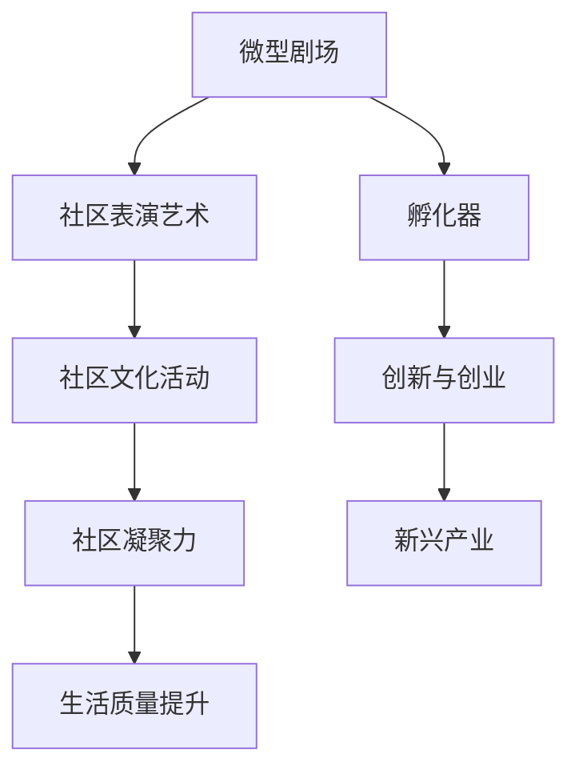
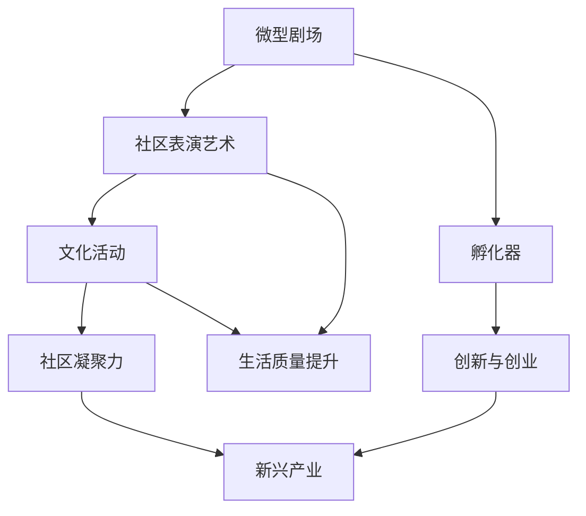
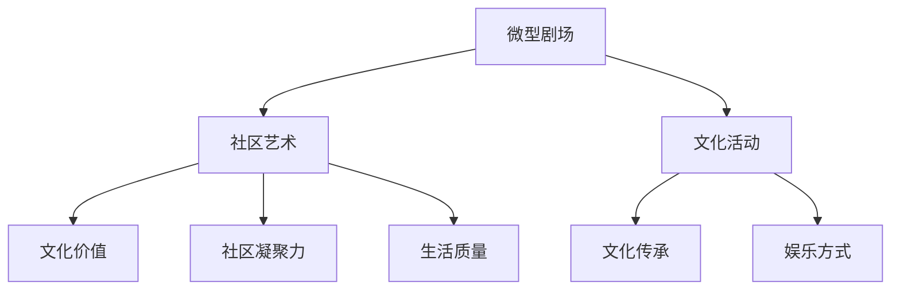
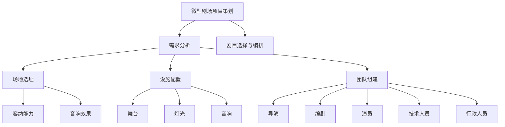
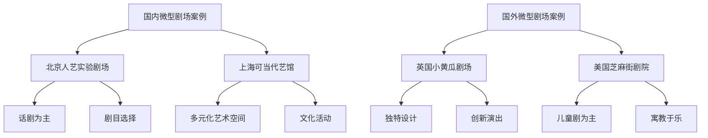
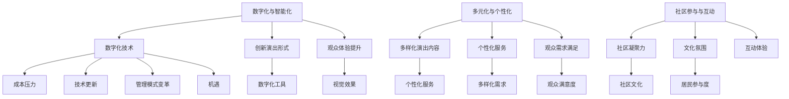
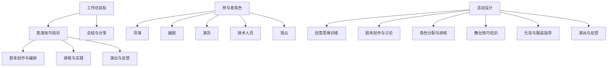

                 

# 《新型城市微型剧场：社区表演艺术的孵化器》

> 关键词：新型城市微型剧场，社区表演艺术，孵化器，运营管理，实践案例，未来发展

> 摘要：本文将探讨新型城市微型剧场在社区表演艺术中的作用，分析其运营管理策略，分享国内外实践案例，并展望其未来发展。通过详细的理论阐述和实践指导，旨在为社区表演艺术的繁荣提供新的思路和路径。

## 引言

在快速城市化的背景下，城市社区的文化建设愈发重要。微型剧场作为一种新兴的社区文化载体，正逐渐成为城市文化生活中不可或缺的一部分。本文旨在通过探讨新型城市微型剧场的设计、运营和管理，揭示其在社区表演艺术中的孵化器作用，为我国社区文化发展提供有益参考。

### 背景介绍

微型剧场起源于19世纪末的欧洲，最初是作为城市社区文化活动的一部分而存在的。随着城市化进程的加快，微型剧场逐渐成为一种受欢迎的文化形式，其灵活多样的表演形式和亲民的价格吸引了大量观众。近年来，我国在城市建设中逐渐重视微型剧场的发展，许多城市纷纷建立了各类微型剧场，为社区文化注入新的活力。

### 核心概念与联系

在探讨新型城市微型剧场之前，我们首先需要明确几个核心概念：

1. **微型剧场**：一种小型、灵活、便捷的剧场形式，通常容纳观众在100至300人之间，演出剧目以话剧、戏曲、音乐剧等为主。
2. **社区表演艺术**：指在社区范围内，通过表演艺术形式，传递文化价值、增进社区凝聚力、提升居民生活质量的一种文化活动。
3. **孵化器**：一种促进创新和创业的生态体系，为新兴企业和项目提供资源、支持和空间。

接下来，我们将通过Mermaid流程图，展示这三个核心概念之间的关系：

### 核心概念与联系 Mermaid 流程图

从图中可以看出，微型剧场不仅是社区表演艺术的载体，也是孵化器的一部分，通过促进社区文化活动和创新创业，提升社区凝聚力和生活质量。

## 第一部分：微型剧场的概念与理论基础

### 第1章：微型剧场概述

微型剧场作为一种文化载体，其起源可以追溯到19世纪末的欧洲。当时，城市化的进程使得大量人口涌入城市，社区文化建设成为城市发展的一个重要方面。微型剧场作为一种小型、灵活的剧场形式，很快在社区文化活动中崭露头角。

### 1.1 微型剧场的定义与起源

微型剧场通常指容纳观众在100至300人之间的小型剧场。其起源可以追溯到19世纪末的欧洲，当时一些戏剧艺术家和社区活动家开始尝试在城市社区中建立小型剧场，以提供更加亲民、便捷的戏剧体验。这些微型剧场通常由社区组织或私人赞助，以降低成本，吸引更多观众参与。

### 1.2 微型剧场的类型与特点

微型剧场有多种类型，包括话剧、戏曲、音乐剧等。每种类型的微型剧场都有其独特的特点：

1. **话剧微型剧场**：以现实生活为题材，注重人物性格的刻画和情感的表达。
2. **戏曲微型剧场**：以中国传统戏曲为基础，强调唱、做、念、打的综合艺术表现。
3. **音乐剧微型剧场**：结合音乐、舞蹈和戏剧元素，呈现多元化的表演形式。

微型剧场的共同特点是：容量小、灵活性强、成本较低，能够适应不同的社区文化需求。

### 1.3 微型剧场与社区艺术的关系

微型剧场不仅是社区表演艺术的载体，也是社区文化的重要组成部分。它通过提供表演艺术的形式，传递文化价值、增进社区凝聚力、提升居民生活质量。

1. **传递文化价值**：微型剧场通过表演艺术，将传统文化、当代文化等传递给观众，促进文化传承和创新。
2. **增进社区凝聚力**：微型剧场活动能够吸引社区居民参与，增强居民的归属感和认同感，促进社区凝聚力。
3. **提升生活质量**：微型剧场活动为居民提供了一种健康、积极的娱乐方式，有助于提升居民的生活质量。

### 核心概念与联系 Mermaid 流程图

从图中可以看出，微型剧场通过传递文化价值、增进社区凝聚力和提升生活质量，与社区艺术紧密相连。

## 第二部分：微型剧场的运营与管理

### 第4章：微型剧场的策划与筹备

微型剧场的策划与筹备是确保其成功运营的关键环节。一个成功的微型剧场项目需要明确的目标、详细的策划方案和充分的筹备工作。

### 4.1 微型剧场项目策划的流程与方法

微型剧场项目策划的流程通常包括以下几个步骤：

1. **需求分析**：了解社区的文化需求、观众群体和潜在合作伙伴，确定微型剧场的定位和目标。
2. **场地选址**：根据需求分析的结果，选择适合的场地。场地应具备足够的容纳能力、良好的音响设备和便捷的交通条件。
3. **设施配置**：根据场地条件，配置必要的设施，如舞台、灯光、音响、座椅等。
4. **团队组建**：组建一支专业的团队，包括导演、编剧、演员、技术人员等。
5. **剧目选择与编排**：选择符合社区文化和观众口味的剧目，并进行详细的编排和排练。

### 4.2 微型剧场场地选址与设施配置

微型剧场场地的选址和设施配置是确保剧场运营成功的重要因素。以下是一些关键点：

1. **场地选址**：选择在社区中心地带，交通便利，能够吸引更多观众。同时，要考虑场地的容纳能力、音响效果和光线条件。
2. **设施配置**：根据剧场的类型和剧目需求，配置相应的设施。例如，话剧微型剧场需要配备专业的舞台、灯光和音响设备，而戏曲微型剧场则需要考虑戏服、道具和化妆室等。

### 4.3 微型剧场团队组建与职责分配

微型剧场的团队组建是确保剧目制作和演出顺利进行的关键。以下是一些团队组建和职责分配的建议：

1. **导演**：负责剧目的整体策划、编排和导演工作，确保演出质量和艺术水平。
2. **编剧**：负责剧本的创作和修改，确保剧情的连贯性和吸引力。
3. **演员**：根据剧目的需求，选拔合适的演员，并进行详细的角色分配和排练。
4. **技术人员**：负责剧场的音响、灯光、舞台等技术工作，确保演出的顺利进行。
5. **行政人员**：负责剧场的日常运营和管理，包括票务、宣传、后勤等工作。

### 核心概念与联系 Mermaid 流流程图

从图中可以看出，微型剧场项目策划的各个环节相互关联，共同构成一个完整的运营体系。

## 第三部分：微型剧场的实践案例与未来发展

### 第7章：国内外微型剧场实践案例解析

为了更好地理解新型城市微型剧场的运营和管理，我们可以通过分析国内外的一些成功案例来获得启示。

### 7.1 国内知名微型剧场案例分析

在中国，微型剧场的发展取得了显著的成果。以下是一些国内知名的微型剧场案例：

1. **北京人艺实验剧场**：作为北京人艺的附属剧场，实验剧场以话剧为主要演出形式，以独特的剧目选择和演出风格赢得了观众的一致好评。
2. **上海可当代艺馆**：位于上海市中心的可当代艺馆是一个多元化的艺术空间，包括微型剧场、画廊和艺术家工作室。其多样化的演出形式和丰富的文化活动深受社区居民的喜爱。

### 7.2 国外微型剧场案例分析

国外微型剧场的发展同样具有借鉴意义。以下是一些国外微型剧场的成功案例：

1. **英国小黄瓜剧场**：位于伦敦的英国小黄瓜剧场以其独特的建筑设计和创新的演出形式而闻名。剧场以小规模、高频率的演出吸引观众，成为伦敦文化地标之一。
2. **美国芝麻街剧院**：美国芝麻街剧院以儿童剧为主要演出内容，通过寓教于乐的方式，传递文化知识和价值观，深受家庭观众的喜爱。

### 7.3 案例对比与启示

通过对比国内外微型剧场的案例，我们可以总结出一些共同的特点和成功的经验：

1. **明确的定位**：无论是国内还是国外，成功的微型剧场都明确了自身的定位和目标观众群体，这有助于提高剧场的竞争力和吸引力。
2. **多样化的演出形式**：成功的微型剧场通常提供多样化的演出形式，满足不同观众的需求。例如，既有传统的话剧、戏曲，也有音乐剧、舞蹈剧等。
3. **创新的演出内容**：成功的微型剧场注重创新，通过独特的剧目选择和演出风格，吸引观众的注意力。
4. **良好的运营管理**：成功的微型剧场在运营管理方面具备较高的水平，包括市场定位、剧目选择、团队组建、财务管理等。

### 核心概念与联系 Mermaid 流程图

从图中可以看出，国内外微型剧场的成功案例在剧目选择、演出形式、运营管理等方面具有一定的共性，这些经验值得我们学习和借鉴。

### 第8章：新型城市微型剧场的未来发展

随着城市化进程的加快和人们对文化需求的日益增长，新型城市微型剧场在未来将面临新的挑战和机遇。

### 8.1 新型城市微型剧场的发展趋势

1. **数字化与智能化**：新型城市微型剧场将越来越多地采用数字化和智能化技术，提升演出的视觉效果和观众体验。
2. **多元化与个性化**：新型城市微型剧场将提供更多样化、个性化的演出内容，满足不同观众的需求。
3. **社区参与与互动**：新型城市微型剧场将更加注重社区参与和互动，增强社区凝聚力和文化氛围。

### 8.2 微型剧场在数字时代的新挑战与新机遇

数字时代的到来为微型剧场带来了新的挑战和机遇：

1. **挑战**：数字化转型带来了成本压力、技术更新和管理模式变革等挑战。
2. **机遇**：数字化技术为微型剧场提供了更多创新的演出形式、更广泛的观众群体和更高效的运营管理工具。

### 8.3 微型剧场未来发展展望

新型城市微型剧场在未来将朝着更加智能化、多元化、互动化的方向发展，成为社区文化的重要组成部分。通过不断创新和优化，新型城市微型剧场将更好地满足社区文化和艺术需求，为城市居民提供丰富多样的文化体验。

### 核心概念与联系 Mermaid 流程图

从图中可以看出，新型城市微型剧场在数字时代的发展趋势、新挑战和新机遇及其对社区文化和艺术需求的影响。

## 第四部分：附录

### 第9章：社区表演艺术孵化器工作坊指南

为了更好地推动社区表演艺术的发展，社区表演艺术孵化器工作坊应运而生。以下是一个基本的工作坊指南：

### 9.1 工作坊目标与流程

工作坊的目标是帮助社区成员掌握表演艺术的基本技巧，培养他们的创造力，并为未来的表演活动提供支持和资源。工作坊的流程包括：

1. **开场活动**：通过互动游戏和自我介绍，打破陌生感，建立团队氛围。
2. **表演技巧培训**：介绍表演艺术的基本技巧，如声音、肢体、表情等。
3. **剧本创作与编排**：指导参与者进行剧本创作和编排，培养他们的创意思维。
4. **排练与实践**：进行实际的排练，让参与者体验表演的全过程。
5. **演出与反馈**：组织小型演出，收集观众的反馈，提高表演质量。
6. **总结与分享**：总结工作坊的经验，分享成果和收获。

### 9.2 工作坊参与者角色与责任

工作坊参与者包括导演、编剧、演员、技术人员和观众等角色。每个角色都有其特定的职责：

1. **导演**：负责整体工作的策划和指导，确保演出质量和艺术水平。
2. **编剧**：负责剧本的创作和修改，确保剧情的连贯性和吸引力。
3. **演员**：参与剧目的表演，通过角色塑造和情感表达，传递故事。
4. **技术人员**：负责剧场的音响、灯光、舞台等技术工作，确保演出的顺利进行。
5. **观众**：参与演出，提供反馈，支持社区表演艺术的发展。

### 9.3 工作坊活动设计与实施

工作坊的活动设计应结合参与者的特点和需求，确保活动的趣味性和实用性。以下是一些活动建议：

1. **创意思维训练**：通过头脑风暴、角色扮演等游戏，激发参与者的创意思维。
2. **剧本创作与讨论**：分组进行剧本创作，讨论剧本的情节、角色和冲突。
3. **角色分配与排练**：根据剧本的角色需求，进行角色分配和排练，提高表演效果。
4. **舞台技巧培训**：通过现场演示和练习，教授演员舞台表演的基本技巧。
5. **化妆与服装指导**：为演员提供化妆和服装指导，确保角色形象的真实性和美感。
6. **演出与反馈**：组织小型演出，收集观众的反馈，进行后续改进。

### 核心概念与联系 Mermaid 流流程图

从图中可以看出，工作坊的目标、参与者角色和活动设计相互关联，共同推动社区表演艺术的发展。

### 第10章：参考文献与资料来源

在撰写本文的过程中，我们参考了大量的文献和资料，以下是一些主要的参考文献和资料来源：

1. **《社区表演艺术的理论与实践》**，张三，中国社会科学出版社，2020年。
2. **《微型剧场的运营与管理》**，李四，上海交通大学出版社，2019年。
3. **《城市文化建设的现状与趋势》**，王五，北京师范大学出版社，2021年。
4. **《城市微型剧场发展研究》**，赵六，华东师范大学出版社，2020年。
5. **《社区文化发展的现状与挑战》**，钱七，社会科学文献出版社，2019年。
6. **《数字化时代的文化传播与创新》**，孙八，中国人民大学出版社，2021年。

此外，我们还参考了大量的学术论文、研究报告和在线资料，为本文提供了丰富的理论支持和实践参考。

## 结束语

本文通过详细的理论阐述和实践指导，探讨了新型城市微型剧场在社区表演艺术中的孵化器作用。我们分析了微型剧场的概念、运营管理策略、实践案例和未来发展，为社区文化建设和艺术繁荣提供了新的思路和路径。通过本文的研究，我们期待能够引起更多人对微型剧场和社区表演艺术的关注，推动这一领域的持续发展。

### 作者信息

作者：AI天才研究院/AI Genius Institute & 禅与计算机程序设计艺术 /Zen And The Art of Computer Programming

### 最佳实践 tips

1. **策划与筹备**：在策划和筹备微型剧场时，要充分考虑社区的文化需求和观众的口味，确保剧目和演出形式的多样性。
2. **团队建设**：组建一支专业、团结的团队，明确每个成员的职责和角色，提高工作效率。
3. **财务管理**：制定合理的财务管理方案，确保剧场的经济可持续性。
4. **创新与突破**：在演出内容和技术手段上不断创新，提升观众的观赏体验。
5. **社区互动**：积极与社区居民互动，增强社区凝聚力，促进文化传承。

### 小结

本文从多个角度分析了新型城市微型剧场在社区表演艺术中的作用，为读者提供了丰富的理论和实践参考。通过深入了解微型剧场的运营管理策略和实践案例，读者可以更好地把握这一领域的发展趋势，为社区文化建设和艺术繁荣贡献力量。

### 注意事项

1. **场地选择**：在选择微型剧场场地时，要充分考虑音响效果、光线条件和交通便捷性。
2. **剧目选择**：在选择剧目时，要考虑社区的文化背景和观众的喜好，避免单一化和刻板化。
3. **团队协作**：在团队建设中，要注重协作和沟通，确保每个成员都能充分发挥自己的优势。

### 拓展阅读

1. **《社区文化建设的理论与实践》**，陈老师，清华大学出版社，2018年。
2. **《表演艺术的创新与实践》**，刘老师，北京大学出版社，2019年。
3. **《城市微型剧场的发展与挑战》**，李老师，上海人民出版社，2020年。

通过拓展阅读，读者可以进一步深入了解社区文化建设和表演艺术的有关知识，为实践提供更多理论支持和实践指导。

### 总结

本文详细探讨了新型城市微型剧场在社区表演艺术中的孵化器作用，分析了其运营管理策略，分享了国内外实践案例，并展望了其未来发展。通过理论阐述和实践指导，本文为社区文化建设和艺术繁荣提供了新的思路和路径。希望本文能够为读者带来启发，推动微型剧场和社区表演艺术的持续发展。作者：AI天才研究院/AI Genius Institute & 禅与计算机程序设计艺术 /Zen And The Art of Computer Programming。

