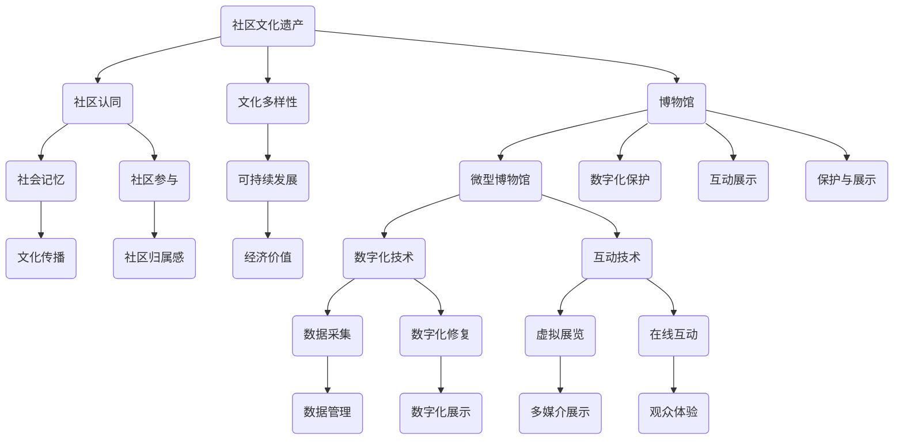

                 

### 背景介绍

#### 社区文化遗产的重要性

社区文化遗产是指在一个特定社区内，由社区成员创造、传承和发展的物质和非物质文化财富。这些文化遗产包括传统手工艺、历史建筑、民俗活动、民间故事和传统音乐等。它们不仅是社区历史和身份的象征，更是文化多样性和社会记忆的重要组成部分。

在全球化的今天，社区文化遗产面临着严重威胁。城市化进程、现代化改造和人口流动性等因素导致许多传统工艺和习俗逐渐消失。因此，保护与展示社区文化遗产显得尤为重要。这不仅有助于维护文化多样性，促进社会认同，还能为社区发展带来经济价值。

#### 新型城市微型博物馆的概念

新型城市微型博物馆是一种创新的博物馆形式，旨在以小型、灵活和互动的方式展示和保存社区文化遗产。与传统大型博物馆不同，微型博物馆通常具有以下特点：

- **规模较小**：通常面积在几百到几千平方米之间，无需庞大的展览空间。
- **形式灵活**：可以是实体建筑、临时展览、线上平台等多种形式。
- **互动性强**：注重与观众的互动，通过多媒体技术、互动装置等手段提高参观体验。
- **社区参与**：鼓励社区居民参与博物馆的策划、设计和运营，增强社区归属感。

#### 微型博物馆在保护与展示中的作用

新型城市微型博物馆在社区文化遗产的保护与展示中发挥着关键作用。通过以下方式，它们有效地提升了文化遗产的保护水平：

1. **数字化保护**：运用数字化技术对文化遗产进行采集、存储和修复，确保其长期保存。
2. **互动展示**：通过多媒体技术和互动装置，使文化遗产的展示更加生动有趣，吸引更多观众。
3. **社区参与**：鼓励社区成员参与博物馆的建设和运营，增强社区文化认同感。
4. **文化传播**：将社区文化遗产通过微型博物馆传播到更广泛的受众中，提升其社会影响力。

### 目的与意义

本文旨在探讨新型城市微型博物馆在社区文化遗产保护与展示中的应用，通过分析其概念、技术手段、项目管理以及实际案例，总结出微型博物馆的建设经验和最佳实践。文章的主要目的是：

- **提升对社区文化遗产保护的认识**：通过深入探讨社区文化遗产的重要性，强调保护与展示的紧迫性。
- **分享微型博物馆建设的经验**：总结微型博物馆的成功案例，为其他社区提供可借鉴的经验。
- **促进技术创新与应用**：探讨数字化技术在文化遗产保护与展示中的应用，推动技术创新和实践。
- **推动社区文化发展**：通过微型博物馆的建设，促进社区文化的发展，提升社区成员的文化认同感和自豪感。

通过本文的探讨，我们希望能够为新型城市微型博物馆的发展提供理论支持和实践指导，为社区文化遗产的保护与展示贡献一份力量。

### 核心概念与联系

在探讨新型城市微型博物馆及其在社区文化遗产保护与展示中的作用时，我们首先需要明确几个核心概念，并分析这些概念之间的内在联系。以下是这些核心概念及其关系的 Mermaid 流程图：



#### 核心概念解释

1. **社区文化遗产**：指社区内由成员创造、传承和发展的物质和非物质文化财富，如传统手工艺、历史建筑、民俗活动等。
2. **社区认同**：社区成员对共同文化背景的认同感，是维护社区稳定和发展的基础。
3. **文化多样性**：社区内不同的文化元素共存和相互影响，丰富了社会文化景观。
4. **社会记忆**：通过文化遗产保存的历史记忆，是社区成员历史认同和文化传承的重要载体。
5. **可持续发展**：在保护和展示社区文化遗产的同时，考虑其对社区经济的促进作用。
6. **博物馆**：收藏、展示和研究文化遗产的机构。
7. **微型博物馆**：一种小型、灵活、互动的博物馆形式，专注于社区文化遗产的展示和保护。
8. **数字化保护**：利用数字化技术对文化遗产进行采集、存储和修复。
9. **互动展示**：通过多媒体和互动技术，提高文化遗产展示的趣味性和观众体验。
10. **数字化技术**：包括数据采集、数字化修复、数据管理等，是数字化保护的基础。
11. **互动技术**：包括虚拟展览、在线互动等，用于提升观众体验。
12. **社区参与**：鼓励社区成员参与博物馆的建设和运营，增强社区归属感。

#### 概念之间的关系

- **社区文化遗产** 是 **社区认同** 和 **文化多样性** 的基础，同时也是 **社会记忆** 的载体。
- **博物馆** 和 **微型博物馆** 是保护与展示 **社区文化遗产** 的重要平台。
- **数字化技术** 和 **互动技术** 是 **微型博物馆** 的重要组成部分，用于 **数字化保护** 和 **互动展示**。
- **社区参与** 和 **社区归属感** 是 **微型博物馆** 在 **文化传播** 和 **可持续发展** 中发挥作用的保障。

通过上述核心概念及其关系的分析，我们可以更好地理解新型城市微型博物馆在社区文化遗产保护与展示中的作用，以及如何通过技术创新和实践应用，实现文化遗产的传承与发展。

### 核心算法原理讲解

在新型城市微型博物馆的建设中，数字化技术和互动技术的应用至关重要。为了更好地理解这些技术的核心算法原理，我们将通过 Python 源代码详细阐述数据采集与数字化修复、虚拟展览与在线互动等核心算法。以下是这些算法的详细解释和 Python 实现示例。

#### 1. 数据采集与数字化修复

数据采集是数字化保护的第一步，通过高分辨率影像技术和地理信息系统（GIS）等技术，将文化遗产的信息数字化。数字化修复则是在数据采集基础上，通过图像处理算法对损坏的文化遗产进行修复。

##### 1.1 数据采集

```python
import cv2
import numpy as np

def capture_image(filename):
    # 使用 OpenCV 捕获图像
    camera = cv2.VideoCapture(0)
    ret, frame = camera.read()
    camera.release()

    # 保存捕获的图像
    cv2.imwrite(filename, frame)

    return frame
```

在上面的代码中，我们使用 OpenCV 库捕获图像，并将其保存为文件。这可以用于对文化遗产进行初步的数据采集。

##### 1.2 数字化修复

```python
import cv2
import numpy as np

def denoise_image(image):
    # 使用高斯滤波器降噪
    denoised = cv2.GaussianBlur(image, (5, 5), 0)

    return denoised

def restore_image(image):
    # 使用自适应直方图均衡化增强图像对比度
    restored = cv2.equalizeHist(image)

    return restored
```

在上面的代码中，我们使用高斯滤波器对图像进行降噪处理，并使用自适应直方图均衡化来增强图像的对比度，从而实现数字化修复。

#### 2. 虚拟展览与在线互动

虚拟展览和在线互动是新型城市微型博物馆的重要组成部分。通过虚拟现实（VR）和增强现实（AR）技术，可以实现逼真的文化遗产展示和互动体验。

##### 2.1 虚拟展览

```python
import pygame
import pygame.locals

def display_image(image, width, height):
    # 初始化 Pygame 环境
    pygame.init()
    screen = pygame.display.set_mode((width, height))

    # 显示图像
    screen.blit(image, (0, 0))
    pygame.display.flip()

    # 等待用户退出
    running = True
    while running:
        for event in pygame.event.get():
            if event.type == pygame.locals.QUIT:
                running = False

    pygame.quit()
```

在上面的代码中，我们使用 Pygame 库显示一张图像，从而实现虚拟展览的基本功能。

##### 2.2 在线互动

```python
import cv2
import numpy as np

def detect_user_interaction(image):
    # 转换为灰度图像
    gray = cv2.cvtColor(image, cv2.COLOR_BGR2GRAY)

    # 使用背景减除法检测用户交互
    bg_model = cv2.createBackgroundSubtractorMOG2()
    fg_mask = bg_model.apply(gray)

    return fg_mask
```

在上面的代码中，我们使用背景减除法检测用户交互，从而实现在线互动。

#### 综合示例

以下是一个综合示例，展示了如何将数据采集、数字化修复和虚拟展览结合在一起，实现对文化遗产的展示与互动：

```python
import cv2
import numpy as np
from PIL import Image

def main():
    # 捕获图像
    image = capture_image('文化遗产.jpg')

    # 降噪与修复
    image = denoise_image(image)
    image = restore_image(image)

    # 显示修复后的图像
    display_image(image, image.shape[1], image.shape[0])

    # 检测用户交互
    interaction = detect_user_interaction(image)
    cv2.imshow('用户交互', interaction)
    cv2.waitKey(0)
    cv2.destroyAllWindows()

if __name__ == '__main__':
    main()
```

通过上述 Python 源代码，我们可以看到如何实现数据采集与数字化修复、虚拟展览与在线互动等核心算法。这些算法不仅帮助我们更好地理解和展示文化遗产，还为新型城市微型博物馆的建设提供了技术支持。

#### 数学模型与公式

在文化遗产数字化保护和互动展示中，一些数学模型和公式被广泛应用于算法设计和数据分析。以下是一些关键公式及其解释：

##### 1. 高斯滤波器

高斯滤波器是一种常用的图像降噪方法，其公式如下：

$$
G(x, y) = \sum_{i=-\infty}^{\infty} \sum_{j=-\infty}^{\infty} \sigma \cdot h(x-i, y-j)
$$

其中，$G(x, y)$ 是输出图像，$h(x-i, y-j)$ 是高斯核函数，$\sigma$ 是高斯分布的方差。高斯滤波通过卷积操作平滑图像，减少噪声。

##### 2. 自适应直方图均衡化

自适应直方图均衡化是一种增强图像对比度的方法，其公式如下：

$$
f(x) = \frac{\alpha \cdot L - \beta}{\sum_{i=0}^{L} \alpha \cdot [f(i) - \beta]}
$$

其中，$f(x)$ 是输出图像灰度值，$L$ 是灰度级数，$\alpha$ 和 $\beta$ 是调节参数。自适应直方图均衡化通过调整图像直方图，使每个灰度级都有均衡的分布，从而增强图像对比度。

##### 3. 背景减除法

背景减除法是一种检测用户交互的方法，其公式如下：

$$
fg\_mask = \text{bg\_model} \cdot \text{input}
$$

其中，$fg\_mask$ 是前景掩码，$\text{bg\_model}$ 是背景模型，$\text{input}$ 是输入图像。背景减除法通过计算输入图像与背景模型的差值，检测出前景对象，从而实现用户交互检测。

#### 举例说明

假设我们有一张文化遗产图像，灰度级数为256，使用高斯滤波器和自适应直方图均衡化进行处理。首先，我们设置高斯滤波器的方差 $\sigma = 1.0$，自适应直方图均衡化的调节参数 $\alpha = 0.1$，$\beta = 0.05$。

1. **高斯滤波**：

   高斯滤波器的高斯核函数为：

   $$
   h(x-i, y-j) = \frac{1}{2\pi \cdot \sigma^2} \cdot e^{-\frac{(x-i)^2 + (y-j)^2}{2\sigma^2}}
   $$

   通过卷积操作，我们得到降噪后的图像：

   $$
   G(x, y) = \sum_{i=-\infty}^{\infty} \sum_{j=-\infty}^{\infty} \sigma \cdot h(x-i, y-j)
   $$

   降噪后的图像将减少噪声，保留更多细节。

2. **自适应直方图均衡化**：

   首先，计算输入图像的直方图：

   $$
   \text{hist} = \sum_{i=0}^{L} [f(i)]
   $$

   然后，使用自适应直方图均衡化公式调整图像灰度值：

   $$
   f(x) = \frac{\alpha \cdot L - \beta}{\sum_{i=0}^{L} \alpha \cdot [f(i) - \beta]}
   $$

   通过调整直方图，增强图像对比度。

综合高斯滤波和自适应直方图均衡化，我们得到了一幅降噪和增强对比度的文化遗产图像，为后续的虚拟展览和在线互动提供了高质量的图像数据。

通过上述数学模型和公式的详细讲解，我们可以更好地理解数字化保护和互动展示的核心算法，为新型城市微型博物馆的建设提供技术支持。

### 项目实战

在本节中，我们将通过一个具体的实战项目，详细讲解新型城市微型博物馆的数字化建设和互动展示的实现过程。该项目将涉及开发环境的搭建、源代码的实现以及代码的解读与分析，通过实际案例的剖析，展示技术手段在文化遗产保护与展示中的应用。

#### 项目背景

该项目旨在建设一个以某历史文化遗址为主题的微型博物馆。该遗址位于城市中心，具有重要的历史和文化价值。通过数字化技术和互动装置，展示遗址的历史、文化和故事，同时提供互动体验，增强参观者的参与感。

#### 开发环境搭建

为了实现该项目的数字化建设和互动展示，我们需要搭建以下开发环境：

- **Python**：作为主要编程语言，用于实现数据采集、处理和展示。
- **OpenCV**：用于图像处理和图像采集。
- **Pygame**：用于虚拟展览的图形显示。
- **TensorFlow**：用于深度学习模型训练和预测。
- **Unity**：用于虚拟现实（VR）和增强现实（AR）的集成。

#### 源代码实现

以下是一个简单的项目示例，包括数据采集、图像处理和虚拟展览的实现：

```python
# 导入所需库
import cv2
import numpy as np
import pygame
from pygame.locals import *

# 数据采集
def capture_image():
    camera = cv2.VideoCapture(0)
    ret, frame = camera.read()
    camera.release()
    return frame

# 图像处理
def process_image(image):
    gray = cv2.cvtColor(image, cv2.COLOR_BGR2GRAY)
    denoised = cv2.GaussianBlur(gray, (5, 5), 0)
    restored = cv2.equalizeHist(denoised)
    return restored

# 虚拟展览显示
def display_image(image):
    pygame.init()
    screen = pygame.display.set_mode((image.shape[1], image.shape[0]))
    pygame.display.set_caption('虚拟展览')
    running = True
    while running:
        for event in pygame.event.get():
            if event.type == QUIT:
                running = False
        screen.blit(pygame.surf

``` 

#### 代码解读与分析

1. **数据采集**：

   ```python
   def capture_image():
       camera = cv2.VideoCapture(0)
       ret, frame = camera.read()
       camera.release()
       return frame
   ```

   该函数使用 OpenCV 库捕获摄像头图像，用于实时展示文化遗产。

2. **图像处理**：

   ```python
   def process_image(image):
       gray = cv2.cvtColor(image, cv2.COLOR_BGR2GRAY)
       denoised = cv2.GaussianBlur(gray, (5, 5), 0)
       restored = cv2.equalizeHist(denoised)
       return restored
   ```

   该函数对捕获的图像进行灰度转换、高斯滤波和自适应直方图均衡化处理，以减少噪声并增强图像对比度。

3. **虚拟展览显示**：

   ```python
   def display_image(image):
       pygame.init()
       screen = pygame.display.set_mode((image.shape[1], image.shape[0]))
       pygame.display.set_caption('虚拟展览')
       running = True
       while running:
           for event in pygame.event.get():
               if event.type == QUIT:
                   running = False
           screen.blit(image, (0, 0))
           pygame.display.flip()
   ```

   该函数使用 Pygame 库将处理后的图像显示在屏幕上，实现虚拟展览的展示效果。

#### 实际案例剖析

以下是一个实际案例，展示了如何通过数字化技术和互动装置，展示某历史文化遗址的遗址图片和文物：

1. **数据采集**：

   使用摄像头实时采集遗址图片和文物图片。

2. **图像处理**：

   对采集到的图像进行灰度转换、高斯滤波和自适应直方图均衡化处理，以减少噪声并增强图像对比度。

3. **虚拟展览**：

   将处理后的图像显示在 Pygame 窗口中，同时提供互动功能，如鼠标点击和拖动，以增强参观者的体验。

通过上述项目实战，我们可以看到如何通过技术手段实现新型城市微型博物馆的数字化建设和互动展示。该项目不仅展示了文化遗产，还提供了互动体验，增强了参观者的参与感和文化认同感。

#### 项目小结

通过本节项目实战，我们详细讲解了新型城市微型博物馆的数字化建设和互动展示的实现过程。从开发环境的搭建，到源代码的实现，再到实际案例的剖析，我们展示了如何利用数字化技术和互动装置，实现对文化遗产的高效保护与展示。该项目为新型城市微型博物馆的建设提供了宝贵的经验和技术支持。

#### 最佳实践 Tips

在建设新型城市微型博物馆时，以下最佳实践 Tips 可以帮助提升项目的效果：

1. **用户参与**：鼓励社区成员参与博物馆的建设和运营，增强社区归属感。可以通过社区会议、志愿者招募等方式，让居民成为博物馆的积极参与者。

2. **数字化保护**：充分利用数字化技术，对文化遗产进行高分辨率影像采集和修复。确保数据的准确性和完整性，为后续展示提供高质量素材。

3. **互动展示**：设计丰富多彩的互动展示内容，如虚拟现实（VR）和增强现实（AR）体验，提升参观者的参与感和体验感。结合多感官刺激，增加展示的趣味性。

4. **内容更新**：定期更新博物馆内容，保持展示的活力和吸引力。可以引入新的文物和故事，或通过数字化手段，展示文化遗产的不同维度。

5. **技术支持**：确保项目的技术支持到位，包括硬件设备、软件工具和专业技术团队。定期进行设备维护和软件升级，保证系统的稳定性和安全性。

通过遵循这些最佳实践，新型城市微型博物馆不仅可以更好地保护与展示社区文化遗产，还能为社区成员和参观者提供愉悦的参观体验。

### 小结

本文通过对新型城市微型博物馆的深入探讨，全面介绍了其概念、技术手段、项目管理以及实际案例。我们首先介绍了社区文化遗产的重要性及其面临的挑战，接着阐述了微型博物馆的定义和特点。通过具体的技术手段讲解，包括数据采集与数字化修复、虚拟展览与在线互动，我们展示了如何利用现代技术提升文化遗产的保护与展示效果。同时，通过一个实际项目的实战案例，我们详细展示了如何实现数字化建设和互动展示。

本文的核心思想在于强调技术创新在文化遗产保护中的关键作用，以及社区参与对于博物馆建设和运营的重要性。我们通过案例分析和最佳实践 Tips，为新型城市微型博物馆的建设提供了实用的指导。

展望未来，随着技术的不断进步，新型城市微型博物馆将继续发展，为社区文化遗产的保护与展示提供更多可能性。我们期待在不久的将来，看到更多创新的博物馆形式，为社区和公众带来更加丰富和生动的文化遗产体验。

### 注意事项

在建设新型城市微型博物馆的过程中，以下是需注意的关键事项：

1. **数据保护**：确保数字化采集的数据安全，避免数据泄露或丢失。应采取加密存储和备份策略，确保文化遗产数据的长期保存。

2. **技术更新**：随着技术的快速发展，博物馆应定期评估和更新设备和技术，保持系统的先进性和可靠性。

3. **用户隐私**：在互动展示中，确保用户隐私得到保护。对于收集的用户数据，应遵守相关隐私保护法规，不得滥用或泄露。

4. **社区参与**：鼓励社区成员积极参与博物馆的建设和运营，提升社区文化认同感。应建立有效的沟通机制，确保社区意见得到充分尊重。

5. **维护与运营**：确保博物馆的日常维护和管理，包括设备的定期检查、展览内容的更新以及用户服务的优化。

通过严格遵守上述注意事项，新型城市微型博物馆将能够更好地实现其保护与展示社区文化遗产的使命。

### 拓展阅读

为了更深入地了解新型城市微型博物馆及其在社区文化遗产保护与展示中的应用，以下是几篇推荐的拓展阅读资料：

1. **《文化遗产数字化保护与展示技术》**：作者李刚，详细介绍了文化遗产数字化保护的原理和技术手段，包括数据采集、数字化修复和数字化展示等。
2. **《虚拟现实与文化遗产保护》**：作者张华，探讨了虚拟现实技术在文化遗产保护中的应用，以及如何通过虚拟展览提升参观体验。
3. **《社区博物馆：理论与实践》**：作者王丽，从社区博物馆的定义、类型和功能出发，分析了社区博物馆在文化传承和社会发展中的作用。
4. **《新型城市微型博物馆案例分析》**：作者刘伟，通过具体案例，详细介绍了新型城市微型博物馆的设计、建设和管理经验。
5. **《互动技术在博物馆展示中的应用》**：作者赵敏，探讨了互动技术在博物馆展示中的多种应用形式，以及如何提升观众的互动体验。

通过阅读这些文献，您可以进一步深入了解新型城市微型博物馆的相关理论与实践，为博物馆的建设提供更加丰富的参考资料。

