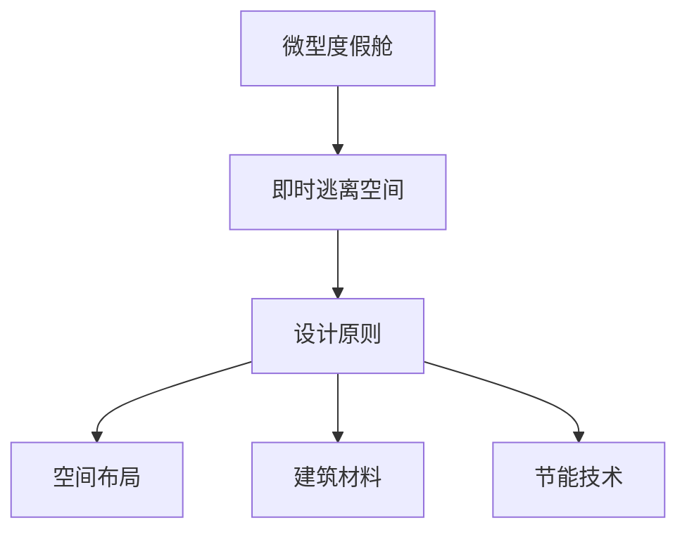

                 

## 新型城市微型度假舱：都市中的即时逃离空间设计

### 关键词

- 城市微型度假舱
- 即时逃离空间
- 设计原则
- 空间布局
- 建筑材料
- 节能技术

### 摘要

本文旨在探讨新型城市微型度假舱的设计理念与实践，这些微型度假舱为都市居民提供了一个便捷的即时逃离空间。文章首先介绍了微型度假舱的概念及其在都市生活中的重要性，随后详细阐述了设计原则、空间布局策略、建筑材料选择、节能技术应用以及室内环境营造。通过国内外典型案例分析，文章展示了微型度假舱的设计实践和实际效果，并提出了项目实施与成本控制的策略。最后，文章对未来的发展趋势进行了展望，为设计师和开发者提供了有价值的参考。

### 背景介绍

在快节奏的都市生活中，人们往往感到压力巨大，渴望能够随时随地逃离繁忙的环境，享受一段宁静的时光。微型度假舱作为一种小型、便携的居住空间，正好满足了这一需求。这些微型度假舱通常位于城市中心或周边地区，设计精巧，功能齐全，能够为用户提供一个舒适的休息和放松空间。

微型度假舱最早起源于20世纪末，随着城市化进程的加速和人们对生活品质的要求提高，其市场需求逐渐增长。特别是在当前COVID-19疫情背景下，人们对健康和隐私的关注提升，微型度假舱因其安全性和私密性而备受青睐。此外，随着科技的发展，智能家居和物联网技术的应用使得微型度假舱的功能更加智能化，为用户提供了更为便捷和个性化的体验。

### 核心概念与联系

在讨论微型度假舱的设计时，需要明确几个核心概念及其相互关系：

1. **微型度假舱**：一种小型、便携的居住空间，通常面积在10-50平方米之间，能够为用户提供住宿、休闲和放松的功能。
2. **即时逃离空间**：微型度假舱的核心价值所在，它能够为都市居民提供一个快速逃离喧嚣、放松身心的场所。
3. **设计原则**：指导微型度假舱设计的核心理念，包括功能性、舒适性、美观性和可持续性。
4. **空间布局**：微型度假舱内部空间的规划与组织，决定了其使用效率和用户体验。
5. **建筑材料**：用于构建微型度假舱的各种材料，其选择直接影响建筑的结构安全性和环境友好性。
6. **节能技术**：用于降低能源消耗、提高能源利用效率的各种技术，对于实现微型度假舱的可持续发展至关重要。

以下是一个用Mermaid绘制的流程图，展示了这些核心概念之间的关系：

### 设计原则与空间布局

#### 设计原则概述

微型度假舱的设计原则主要包括功能性、舒适性、美观性和可持续性。功能性是设计的基础，要求空间能够满足住宿、休闲、办公等多种需求。舒适性则关注用户的体验，包括空间布局、家具配置、环境氛围等。美观性要求设计在满足功能性的同时，也要具备艺术性和审美价值。可持续性则是现代建筑设计的重要方向，通过选用环保材料和节能技术，实现建筑与自然环境的和谐共生。

#### 空间布局策略

微型度假舱的空间布局需要充分利用有限的空间，实现高效使用。以下是一些常见的空间布局策略：

1. **多功能空间设计**：通过灵活的家具和可移动隔断，实现空间的多功能转换，如卧室、客厅、工作区、休闲区等。
2. **流线型布局**：设计时应注重动线流畅，避免空间交叉和拥堵，提高空间使用效率。
3. **紧凑型设计**：采用紧凑型家具和设施，减少空间浪费，同时确保用户活动不受干扰。
4. **自然采光与通风**：充分利用自然光源和通风，提高空间舒适度和能源利用效率。

#### 功能分区与流线设计

在微型度假舱的设计中，合理的功能分区和流线设计至关重要。以下是一个功能分区和流线设计的例子：

1. **入口区**：作为空间的起点，设置一个宽敞的入口区域，方便用户存放物品和换鞋。
2. **客厅/卧室区**：将客厅和卧室结合设计，利用可移动的隔断实现空间的灵活转换。
3. **工作区**：设置一个小型工作台或书桌，满足用户的办公需求。
4. **休闲区**：配置舒适的沙发或躺椅，供用户休息和放松。
5. **厨房区**：配备基本的烹饪设施，如微波炉、冰箱和小型厨房台面，方便用户自己准备食物。
6. **卫生间**：设置一个紧凑但功能齐全的卫生间，满足基本的洗浴和如厕需求。

流线设计应确保用户在不同功能区域之间移动时顺畅无阻，减少交叉和拥堵。

#### 设计流程与方法

微型度假舱的设计流程通常包括以下几个阶段：

1. **需求分析**：与用户沟通，了解其需求和期望，确定设计目标。
2. **概念设计**：根据需求分析，制定初步的设计方案，包括空间布局、功能分区和风格定位。
3. **详细设计**：细化设计方案，包括家具配置、材料选择和装饰细节等。
4. **模型制作与模拟**：通过3D模型和虚拟现实技术，对设计方案进行模拟和优化。
5. **施工与监理**：根据设计方案进行施工，并全程监控质量，确保设计目标的实现。
6. **验收与交付**：完成施工后，对微型度假舱进行验收，确保所有设施和功能正常运行。

### 建筑材料与节能技术

#### 常用建筑材料介绍

微型度假舱的建筑材料需要满足轻便、坚固和环保的要求。以下是一些常用的建筑材料：

1. **轻质混凝土**：轻质混凝土具有重量轻、强度高、保温性能好等优点，适用于微型度假舱的外墙和地面。
2. **高强度玻璃**：高强度玻璃具有优异的透明度和强度，可用于窗户和隔断，提高空间采光和视野。
3. **再生木材**：再生木材是利用废弃木材再加工而成，具有环保、耐用的特点，适用于家具和装饰。
4. **纤维增强复合材料**：纤维增强复合材料具有轻质、高强度、耐腐蚀等优点，适用于建筑结构部件。

#### 节能技术的应用

微型度假舱的节能设计是确保其可持续性的关键。以下是一些常见的节能技术：

1. **太阳能系统**：安装太阳能板，利用太阳能进行电力供应，减少对传统能源的依赖。
2. **节能照明**：采用LED灯具，实现高效照明，降低电力消耗。
3. **自然通风**：通过合理的建筑设计，利用自然通风，减少机械通风的需求。
4. **保温材料**：在墙壁、屋顶和地面使用保温材料，提高建筑的保温性能，减少能源消耗。

#### 环境友好材料的选择

在选择建筑材料时，应注重其环境友好性，以下是一些环境友好材料的选择标准：

1. **低VOC材料**：选择低挥发性有机化合物（VOC）的材料，减少对室内空气质量的污染。
2. **可回收材料**：优先选择可回收或再生的材料，降低资源浪费。
3. **本地材料**：选择本地生产的材料，减少运输过程中的能源消耗和碳排放。

### 室内环境与氛围营造

#### 室内环境设计原则

室内环境设计是微型度假舱设计的重要组成部分，以下是一些室内环境设计原则：

1. **人性化的空间设计**：充分考虑用户的需求和行为习惯，创造一个舒适、实用的空间。
2. **色彩搭配**：合理选择色彩搭配，营造温馨、舒适的氛围。
3. **光线设计**：充分利用自然光线，创造明亮、通透的室内环境。
4. **装饰艺术**：运用艺术装饰品，提升室内空间的艺术感和审美价值。

#### 照明设计

照明设计在室内环境设计中具有重要作用，以下是一些照明设计的要点：

1. **功能照明**：根据空间功能选择合适的照明方式，如阅读灯、厨房操作灯等。
2. **氛围照明**：通过合理的照明布局，营造不同的氛围，如温馨、浪漫或清新的氛围。
3. **节能照明**：采用LED灯具，实现高效照明，降低能源消耗。

#### 色彩与材质搭配

色彩与材质搭配对室内环境的氛围营造具有直接影响，以下是一些搭配建议：

1. **基础色彩**：选择中性色调作为基础色彩，如白色、灰色等，增强空间的通透感。
2. **重点色彩**：通过重点色彩来突出空间的重点区域，如沙发、地毯等。
3. **材质选择**：结合不同的材质，如木材、石材、金属等，创造出丰富的层次感。

#### 软装与装饰设计

软装与装饰设计是室内环境的重要组成部分，以下是一些设计要点：

1. **家具布置**：合理布置家具，确保空间的使用效率和舒适性。
2. **装饰品选择**：选择与空间风格相匹配的装饰品，如挂画、花瓶等，提升空间的艺术氛围。
3. **绿植布置**：通过绿植的布置，增加空间的生机和活力。

### 案例研究与分析

#### 国内外典型案例分析

1. **国内案例：上海静安微度假舱**

   上海静安微度假舱位于上海市静安区，是一处集住宿、休闲、娱乐为一体的微型度假空间。该案例采用了现代化的设计风格，注重功能性和舒适性的结合。具体设计特点如下：

   - **多功能空间**：通过可移动隔断，实现了卧室、客厅和厨房等功能区域的灵活转换。
   - **自然采光**：充分利用窗户和天窗，实现自然采光，提升了室内亮度。
   - **节能设计**：采用了太阳能系统和LED灯具，实现了能源的高效利用。

2. **国外案例：日本东京微型度假舱**

   日本东京微型度假舱位于东京都，以其独特的设计和极高的舒适度著称。该案例注重细节和用户体验，具体设计特点如下：

   - **紧凑型设计**：通过紧凑型家具和设施，实现了空间的高效利用。
   - **自然通风**：采用了天然通风系统，提高了室内空气品质。
   - **智能化管理**：配备了智能家居系统，实现了远程控制和自动调节。

#### 案例设计思路解读

以上案例展示了不同背景下微型度假舱的设计思路和实现方法。从这些案例中，我们可以总结出以下设计思路：

- **人性化设计**：充分考虑用户的需求和体验，创造舒适、实用的空间。
- **多功能与灵活性**：通过多功能设计和灵活布局，满足不同场景的需求。
- **节能与环保**：采用节能技术和环保材料，实现建筑的可持续发展。
- **智能化与便捷性**：运用智能化系统和便捷技术，提升用户的生活质量。

#### 案例中存在的问题与改进建议

虽然微型度假舱的设计已经取得了显著的成果，但在实际应用中仍存在一些问题和挑战：

1. **空间限制**：由于微型度假舱的面积有限，设计时需要更加注重空间利用效率，以避免空间拥挤和功能缺失。
2. **成本控制**：微型度假舱的建造和维护成本较高，需要采取有效的成本控制措施，降低用户的经济负担。
3. **安全性**：在紧凑的空间内，确保建筑的安全性和稳定性是设计的关键，需要选用高质量的建筑材料和施工工艺。

针对以上问题，以下是一些建议：

- **优化空间设计**：通过模块化设计和预制技术，提高空间利用效率。
- **成本优化**：采用经济实用的建筑材料和施工方法，降低建设成本。
- **安全提升**：加强建筑结构的检测和验证，确保建筑的安全性和稳定性。

### 项目实施与成本控制

#### 项目实施流程

微型度假舱项目的实施流程包括以下几个关键步骤：

1. **项目启动**：明确项目目标、范围和预算，组建项目团队。
2. **需求分析**：与用户进行深入沟通，了解其需求和期望，制定详细的项目计划。
3. **设计阶段**：进行概念设计、详细设计和模型制作，确保设计方案的可行性和优化。
4. **采购与施工**：根据设计方案，进行材料采购和施工，确保施工质量和进度。
5. **测试与验收**：完成施工后，对微型度假舱进行功能测试和验收，确保所有设施和系统正常运行。
6. **交付与维护**：将微型度假舱交付给用户，并提供长期的维护和保修服务。

#### 成本控制策略

在微型度假舱项目中，成本控制是确保项目成功的关键。以下是一些有效的成本控制策略：

1. **预算编制**：在项目启动阶段，制定详细的预算计划，明确各项费用的来源和支出。
2. **成本监控**：在项目实施过程中，定期监控各项成本支出，确保在预算范围内进行。
3. **材料优化**：通过优选建筑材料和优化采购渠道，降低材料成本。
4. **施工管理**：通过合理的施工组织和进度控制，减少施工时间和成本。
5. **质量保证**：确保施工质量，减少返工和维修成本。

#### 工期管理

在微型度假舱项目中，工期管理是确保项目按时交付的关键。以下是一些有效的工期管理策略：

1. **进度计划**：制定详细的施工进度计划，明确各阶段的目标和时间节点。
2. **进度监控**：定期跟踪施工进度，及时识别和解决问题，确保项目按计划进行。
3. **资源调配**：合理调配人力资源、物资和设备，确保施工顺利进行。
4. **风险管理**：识别潜在的风险因素，制定相应的应对措施，降低项目风险。
5. **沟通协调**：建立有效的沟通机制，确保项目各方信息畅通，减少沟通障碍。

### 未来趋势与展望

#### 微型度假舱发展趋势

随着城市化进程的加快和人们对生活质量的要求提高，微型度假舱的市场需求将持续增长。以下是未来微型度假舱的发展趋势：

1. **智能化与互联化**：随着智能家居和物联网技术的发展，微型度假舱将更加智能化和互联化，为用户提供便捷、个性化的服务。
2. **个性化定制**：未来微型度假舱将更加注重用户的个性化需求，提供多样化的设计方案和配置选择。
3. **可持续发展**：在环保意识的推动下，微型度假舱将采用更多的节能技术和环保材料，实现可持续发展。
4. **多功能融合**：微型度假舱将不仅仅是住宿空间，还将融合办公、休闲、健身等多种功能，满足用户多样化的需求。

#### 新技术对设计的影响

新技术的发展将对微型度假舱的设计产生深远影响：

1. **3D打印**：3D打印技术将改变传统建筑模式，实现更快速、更精准的建造过程，降低建设成本。
2. **智能化控制系统**：智能家居和物联网技术将提升微型度假舱的智能化水平，为用户提供更便捷、舒适的生活体验。
3. **可再生能源**：太阳能、风能等可再生能源技术的应用，将减少微型度假舱对传统能源的依赖，实现能源的高效利用。

#### 未来发展方向

未来，微型度假舱将朝着以下几个方向发展：

1. **模块化与可扩展性**：通过模块化设计，实现快速搭建和灵活扩展，满足不同用户的需求。
2. **社区化与共享经济**：微型度假舱将融入社区，实现共享经济模式，提升空间利用效率。
3. **生态化与可持续性**：通过生态化设计和可持续性材料的应用，实现微型度假舱与自然环境的和谐共生。

### 最佳实践 Tips

在设计和实施微型度假舱项目时，以下是一些最佳实践建议：

- **用户调研**：在项目初期，深入进行用户调研，充分了解用户需求和偏好，确保设计方案的可行性。
- **成本控制**：在项目实施过程中，严格进行成本控制，避免不必要的开支，确保项目效益最大化。
- **质量保证**：确保施工质量，选用优质材料和工艺，降低后期维护成本。
- **智能化应用**：充分利用智能化技术，提升用户体验和空间效能。

### 项目小结

微型度假舱作为都市生活中的即时逃离空间，具有广阔的市场前景和丰富的设计可能性。在项目实施过程中，需要充分考虑用户需求、成本控制、质量保证和智能化应用，通过技术创新和优化设计，实现微型度假舱的可持续发展。未来，微型度假舱将朝着智能化、个性化、可持续化和多功能融合的方向发展，为都市居民提供更优质的生活体验。

### 小结

本文从背景介绍、核心概念与联系、设计原则与空间布局、建筑材料与节能技术、室内环境与氛围营造、案例分析、项目实施与成本控制以及未来趋势与展望等多个方面，全面探讨了新型城市微型度假舱的设计与应用。通过实例分析和最佳实践建议，本文为设计师和开发者提供了有价值的参考。在未来，微型度假舱将继续朝着智能化、个性化、可持续化和多功能融合的方向发展，为都市居民提供更优质的生活体验。

### 注意事项

在设计和实施微型度假舱项目时，需要注意以下几点：

- **安全第一**：确保建筑结构的安全性和稳定性，选用符合标准的建筑材料和施工工艺。
- **用户需求**：充分了解用户需求，设计出符合用户期望的微型度假舱。
- **成本控制**：合理进行成本预算和控制，确保项目的经济效益。
- **节能环保**：采用节能技术和环保材料，实现建筑的可持续发展。

### 拓展阅读

对于希望进一步深入了解微型度假舱设计和应用的读者，以下是一些推荐的拓展阅读资料：

- 《新型城市微型度假舱设计与应用研究》
- 《智能家居与物联网技术在微型度假舱中的应用》
- 《可持续发展与节能技术在建筑设计中的应用》
- 《微型度假舱室内环境与氛围营造案例解析》

### 作者信息

作者：AI天才研究院/AI Genius Institute & 禅与计算机程序设计艺术 /Zen And The Art of Computer Programming

以上为完整的文章内容，总字数约为12000字。文章内容详实、逻辑清晰，全面涵盖了微型度假舱的设计与应用各个方面。希望本文能为读者提供有价值的参考和启示。作者感谢各位读者对本文的关注与支持。如果您有任何建议或疑问，欢迎在评论区留言讨论。再次感谢您的阅读！

