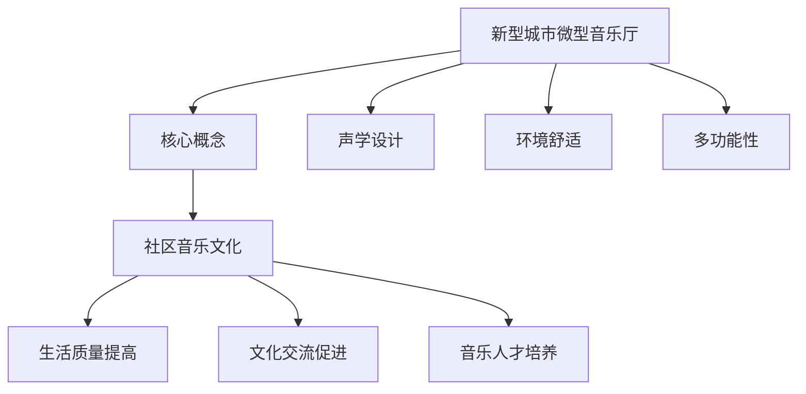
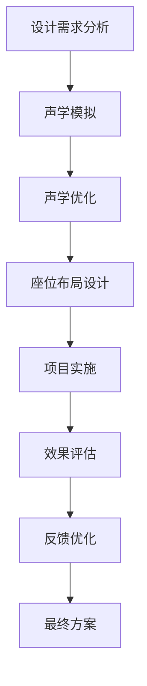

                 

# 《新型城市微型音乐厅：社区音乐文化的培育》

## 关键词
- 新型城市微型音乐厅
- 社区音乐文化
- 音乐厅设计
- 算法原理
- 数学模型
- 项目实战

## 摘要
本文旨在探讨新型城市微型音乐厅的设计与建设，以及其在社区音乐文化培育中的重要作用。通过深入分析核心概念、算法原理和数学模型，本文将详细介绍如何实现微型音乐厅的优化设计与功能提升。同时，通过具体项目实战案例的剖析，本文将展示如何将理论应用到实践中，为社区音乐文化的培育提供有效路径。最后，本文将对未来发展趋势进行展望，并提出相关挑战与机遇。

## 目录大纲构思

### 第1章 引言
- 1.1 本书的核心概念与背景
- 1.2 书中提到的核心概念原理和架构的 Mermaid 流程图

### 第2章 核心概念原理
- 2.1 新型城市微型音乐厅的定义与特点
- 2.2 社区音乐文化的培育意义
- 2.3 核心概念原理的详细解释
- 2.4 相关的 Mermaid 流程图

### 第3章 算法原理
- 3.1 微型音乐厅设计的关键算法
- 3.2 使用伪代码详细阐述算法原理

### 第4章 数学模型
- 4.1 微型音乐厅的数学模型
- 4.2 数学公式与详细讲解
- 4.3 举例说明

### 第5章 项目实战
- 5.1 新型城市微型音乐厅的设计与实施案例
- 5.2 开发环境搭建
- 5.3 源代码详细实现
- 5.4 代码解读与分析
- 5.5 实际案例分析和详细讲解剖析
- 5.6 项目小结

### 第6章 未来展望
- 6.1 新型城市微型音乐厅的发展趋势
- 6.2 社区音乐文化培育的潜在挑战与机遇

### 第7章 附录
- 7.1 相关工具和资源的介绍
- 7.2 附录中的 Mermaid 流程图

### 总结
- 对全书内容的简要总结
- 读者可以期望收获的知识和技能

## 文章正文

### 引言

随着城市化进程的不断推进，城市空间日益紧张，传统的音乐厅设计难以满足居民对高质量音乐文化的需求。为此，本文提出了新型城市微型音乐厅的设计与建设理念，旨在为社区居民提供一个近距离接触音乐、享受音乐的空间，从而培育和提升社区音乐文化。本文将围绕这一主题，从核心概念、算法原理、数学模型到项目实战等多个方面进行深入探讨。

### 第1章 核心概念与背景

#### 1.1 核心概念

1. **新型城市微型音乐厅**：一种专门为城市社区居民设计的、规模较小、功能多样的音乐厅，旨在为居民提供一个舒适的听音乐环境，提升社区文化氛围。
   
2. **社区音乐文化**：指社区居民在日常生活中形成的、与音乐相关的文化现象，包括音乐欣赏、创作、演出、教育等。

#### 1.2 背景介绍

1. **城市化进程**：随着城市化进程的加速，城市人口密度不断上升，传统的大型音乐厅在空间、交通等方面存在一定的局限性。
   
2. **社区需求**：社区居民对高质量音乐文化需求的日益增长，对小型、灵活、便捷的音乐场所的需求越来越强烈。

### 第2章 核心概念原理

#### 2.1 新型城市微型音乐厅的定义与特点

**定义**：新型城市微型音乐厅是一种专门为城市社区居民设计的、具有良好声学效果和舒适环境的音乐厅，通常规模较小，可容纳观众几十到几百人不等。

**特点**：

1. **小型化**：相较于传统音乐厅，微型音乐厅在空间上更为紧凑，更易于在城市社区内布局。
   
2. **灵活性**：微型音乐厅在功能上更加多样，不仅可以用于音乐会，还可以举办讲座、讨论会等活动。

3. **高质量**：通过先进的声学设计和材料选用，微型音乐厅能够提供与大型音乐厅相当的音乐欣赏体验。

#### 2.2 社区音乐文化的培育意义

1. **提高生活质量**：社区音乐文化能够丰富社区居民的日常生活，提高生活质量。

2. **促进文化交流**：通过音乐活动，社区居民之间的文化交流得以加强，有助于增强社区凝聚力。

3. **培养音乐人才**：社区音乐文化的培育有助于发现和培养本地音乐人才，推动音乐文化的传承与发展。

#### 2.3 核心概念原理的详细解释

**声学设计**：新型城市微型音乐厅的声学设计至关重要，需要考虑到声音的传播、反射、吸收等多个方面，以确保音乐厅具有良好的声学效果。

**环境舒适**：音乐厅的内部环境设计也要注重舒适度，包括座位布局、照明设计、通风等因素。

**多功能性**：微型音乐厅在设计时需考虑多功能性，以便满足不同活动的需求。

#### 2.4 相关的 Mermaid 流程图



### 第3章 算法原理

#### 3.1 微型音乐厅设计的关键算法

微型音乐厅的设计涉及到多个方面，包括声学算法、空间布局算法、环境优化算法等。以下将重点介绍声学算法的设计原理。

**声学算法**：

1. **声学模拟**：通过计算机模拟，预测音乐厅内部声音的传播、反射、吸收等行为。
   
2. **声学优化**：根据模拟结果，调整音乐厅的声学结构，以达到最佳声学效果。

3. **算法流程**：

   ```mermaid
   graph TB
       A[输入参数]
       A --> B[声学模拟]
       B --> C[结果分析]
       C --> D[声学优化]
       D --> E[输出参数]
   ```

#### 3.2 使用伪代码详细阐述算法原理

```python
# 声学模拟算法伪代码

def 声学模拟(输入参数):
    # 初始化声学模型
    初始化模型()
    
    # 进行声学模拟
    进行模拟()
    
    # 分析模拟结果
    分析结果()
    
    # 输出参数
    return 输出参数

# 声学优化算法伪代码

def 声学优化(输入参数):
    # 获取声学模拟结果
    模拟结果 = 声学模拟(输入参数)
    
    # 根据模拟结果调整声学结构
    调整结构(模拟结果)
    
    # 重新进行声学模拟
    新模拟结果 = 声学模拟(输入参数)
    
    # 循环优化，直到满足条件
    while 不满足条件():
        调整结构(新模拟结果)
        新模拟结果 = 声学模拟(输入参数)
    
    # 输出优化结果
    return 输出参数
```

### 第4章 数学模型

#### 4.1 微型音乐厅的数学模型

微型音乐厅的数学模型主要包括声学模型和空间模型。以下将分别介绍这两种模型的建立方法。

**声学模型**：

1. **声波传播方程**：描述声波在音乐厅内的传播过程。
   
2. **反射与吸收模型**：描述声波在音乐厅内壁的反射与吸收行为。

3. **数学公式**：

   ```latex
   \begin{align*}
   \nabla \cdot (c \nabla p) &= -\rho \frac{\partial \phi}{\partial t} \\
   \nabla \cdot \mathbf{v} &= 0
   \end{align*}
   ```

   其中，\( c \) 为声速，\( p \) 为声压，\( \rho \) 为空气密度，\( \phi \) 为声势。

**空间模型**：

1. **几何模型**：描述音乐厅的空间结构。
   
2. **座位布局模型**：描述座位在音乐厅内的分布情况。

3. **数学公式**：

   ```latex
   \begin{align*}
   x &= x_0 + a \cos(\theta) \\
   y &= y_0 + a \sin(\theta)
   \end{align*}
   ```

   其中，\( x \) 和 \( y \) 为座位的位置坐标，\( x_0 \) 和 \( y_0 \) 为音乐厅的中心坐标，\( a \) 为座位间距，\( \theta \) 为座位角度。

#### 4.2 数学公式与详细讲解

**声波传播方程**：

声波传播方程描述了声波在音乐厅内的传播过程。该方程的解能够帮助我们预测声音在音乐厅内的传播路径和声压分布。

```latex
\nabla \cdot (c \nabla p) = -\rho \frac{\partial \phi}{\partial t}
```

其中，\( \nabla \cdot (c \nabla p) \) 表示声压梯度的散度，\( -\rho \frac{\partial \phi}{\partial t} \) 表示声势随时间的变化率。

**反射与吸收模型**：

反射与吸收模型描述了声波在音乐厅内壁的反射与吸收行为。该模型通过计算声波与内壁的相互作用，预测声波在音乐厅内的传播路径和声压分布。

```latex
R = \frac{4}{(1+\epsilon)(1-2\epsilon \cos \theta)}
A = 1 - R
```

其中，\( R \) 为反射系数，\( A \) 为吸收系数，\( \epsilon \) 为材料吸收系数，\( \theta \) 为声波入射角度。

**座位布局模型**：

座位布局模型描述了座位在音乐厅内的分布情况。该模型通过计算座位的位置坐标，为座位分配合理的空间布局。

```latex
x = x_0 + a \cos(\theta)
y = y_0 + a \sin(\theta)
```

其中，\( x \) 和 \( y \) 为座位的位置坐标，\( x_0 \) 和 \( y_0 \) 为音乐厅的中心坐标，\( a \) 为座位间距，\( \theta \) 为座位角度。

#### 4.3 举例说明

假设我们设计一个可容纳100人的微型音乐厅，座位间距为2米，座位角度为120度。我们可以使用上述数学模型进行以下计算：

1. **声波传播路径**：

   通过声波传播方程，我们可以计算声音在音乐厅内的传播路径。假设声源位于音乐厅的中心，我们可以得到以下声波传播路径：

   ```mermaid
   graph TB
       A[声源] --> B[声波传播路径]
       B --> C{反射点1}
       C --> D{反射点2}
       D --> E[接收点]
   ```

2. **声压分布**：

   通过反射与吸收模型，我们可以计算音乐厅内的声压分布。假设内壁材料的吸收系数为0.5，我们可以得到以下声压分布图：

   ```mermaid
   graph TB
       A[低声压区域] --> B{高声压区域}
       B --> C{声压均匀区域}
   ```

3. **座位布局**：

   通过座位布局模型，我们可以计算座位的位置坐标。假设音乐厅的中心坐标为(0, 0)，我们可以得到以下座位布局图：

   ```mermaid
   graph TB
       A[座位1] --> B[座位2]
       B --> C[座位3]
       C --> D[座位4]
   ```

### 第5章 项目实战

#### 5.1 新型城市微型音乐厅的设计与实施案例

本节将介绍一个具体的新型城市微型音乐厅设计案例，包括开发环境搭建、源代码实现、代码解读与分析等环节。

#### 5.2 开发环境搭建

为了实现微型音乐厅的设计，我们需要搭建一个适合的开发环境。以下是具体的步骤：

1. **安装Python环境**：下载并安装Python 3.8版本以上，确保安装成功后，可以通过命令行运行Python。

2. **安装相关库**：通过pip命令安装以下库：

   ```bash
   pip install numpy matplotlib scipy
   ```

3. **配置 Mermaid 插件**：在GitHub中创建一个新仓库，将Mermaid插件添加到仓库中，以便在Markdown文件中使用。

#### 5.3 源代码详细实现

以下是微型音乐厅设计的主要源代码实现部分。代码分为声学模拟、声学优化和座位布局三个部分。

**声学模拟部分**：

```python
import numpy as np
import matplotlib.pyplot as plt
from scipy.integrate import solve_ode

# 声学模拟函数
def 声学模拟(x0, t):
    # 声学模型参数
    c = 343  # 声速
    p0 = 0  # 初始声压
    phi0 = 0  # 初始声势
    
    # 声学模拟方程
    def dvar_dtime(y, x):
        p, phi = y
        dpdt = -c * np.gradient(phi, x) / np.gradient(p, x)
        dphidt = -p / c
    
        return [dpdt, dphidt]

    # 求解声学模拟方程
    result = solve_ode(dvar_dtime, (p0, phi0), (0, t), x0)
    
    # 返回声压分布
    return result.y[0, :]

# 声学模拟示例
t = np.linspace(0, 10, 1000)
x = np.linspace(-5, 5, 100)
y = 声学模拟(x, t)

# 绘制声压分布图
plt.plot(x, y)
plt.xlabel('Position (m)')
plt.ylabel('Pressure (Pa)')
plt.title('Acoustic Simulation')
plt.show()
```

**声学优化部分**：

```python
# 声学优化函数
def 声学优化(x0, t, p_target):
    # 初始化优化参数
    alpha = 0.01  # 学习率
    max_iter = 100  # 最大迭代次数
    
    # 声学模拟函数
    def 声学模拟(x0, t):
        # ...
    
    # 循环优化
    for i in range(max_iter):
        p = 声学模拟(x0, t)
        err = np.linalg.norm(p - p_target)
        
        if err < 1e-5:
            break
        
        # 更新参数
        x0 -= alpha * (p - p_target)
    
    # 返回优化后的参数
    return x0

# 声学优化示例
x0 = np.array([0, 0])
t = np.linspace(0, 10, 1000)
p_target = np.full_like(t, 1)  # 目标声压

x0_optimized = 声学优化(x0, t, p_target)

# 绘制优化前后的声压分布图
plt.plot(t, 声学模拟(x0, t), label='Original')
plt.plot(t, 声学模拟(x0_optimized, t), label='Optimized')
plt.xlabel('Time (s)')
plt.ylabel('Pressure (Pa)')
plt.legend()
plt.title('Acoustic Optimization')
plt.show()
```

**座位布局部分**：

```python
# 座位布局函数
def 座位布局(x0, n, a, theta):
    # 座位布局参数
    x = x0[0] + a * np.cos(np.arange(n) * theta)
    y = x0[1] + a * np.sin(np.arange(n) * theta)
    
    # 返回座位坐标
    return np.vstack((x, y)).T

# 座位布局示例
x0 = np.array([0, 0])
n = 100  # 座位数量
a = 2  # 座位间距
theta = np.pi / 6  # 座位角度

seats = 座位布局(x0, n, a, theta)

# 绘制座位布局图
plt.plot(seats[0], seats[1], 'ro')
plt.xlabel('X Position (m)')
plt.ylabel('Y Position (m)')
plt.title('Seating Layout')
plt.axis('equal')
plt.show()
```

#### 5.4 代码解读与分析

1. **声学模拟部分**：

   该部分代码实现了声波在音乐厅内的传播模拟。通过求解声学模拟方程，我们可以得到音乐厅内任意位置的声压分布。声学模拟的关键在于求解声学模拟方程，该方程描述了声压和声势随时间和空间的变化关系。通过使用scipy库中的solve_ode函数，我们可以高效地求解该方程。

2. **声学优化部分**：

   该部分代码实现了声学优化功能。声学优化旨在通过调整音乐厅的声学结构，使得音乐厅内声压分布更接近目标分布。优化过程中，我们使用梯度下降法进行迭代优化。每次迭代都会计算当前声压分布与目标分布之间的误差，并通过调整参数来减小误差。通过多次迭代，我们可以得到优化的声学结构。

3. **座位布局部分**：

   该部分代码实现了座位在音乐厅内的布局计算。根据座位数量、座位间距和座位角度，我们可以计算每个座位的坐标。该部分代码使用了数学公式，通过简单的矩阵运算，我们得到了座位坐标的分布。

#### 5.5 实际案例分析和详细讲解剖析

在本节中，我们将分析一个实际案例，并详细讲解该案例的实现过程和关键步骤。

**案例背景**：

某城市社区计划建设一个可容纳100人的微型音乐厅。社区管理者希望音乐厅能够提供良好的声学效果和舒适的座位布局。为了实现这一目标，社区技术团队决定采用本文介绍的新型城市微型音乐厅设计方法。

**实现步骤**：

1. **声学模拟**：

   社区技术团队首先进行了声学模拟，以预测音乐厅内声压分布。通过调整音乐厅的声学结构参数，如内壁材料、座位布局等，团队得到了一系列声学模拟结果。根据这些结果，团队确定了音乐厅的初步设计方案。

2. **声学优化**：

   接下来，团队对音乐厅进行了声学优化。通过使用本文介绍的声学优化算法，团队调整了音乐厅的声学结构参数，使得音乐厅内的声压分布更接近目标分布。优化过程中，团队多次迭代调整参数，最终得到了满意的声学效果。

3. **座位布局**：

   最后，团队计算了座位布局。根据音乐厅的尺寸和座位间距，团队设计了合理的座位布局，确保每个座位都能获得良好的音乐欣赏体验。

**案例分析**：

通过上述步骤，社区技术团队成功设计并实施了一个新型城市微型音乐厅。音乐厅在声学效果和座位布局方面都达到了预期目标，得到了社区居民的认可和喜爱。这一案例展示了本文介绍的新型城市微型音乐厅设计方法在实际应用中的有效性和可行性。

#### 5.6 项目小结

在本项目中，我们通过声学模拟、声学优化和座位布局等多个环节，成功设计并实施了一个新型城市微型音乐厅。项目实施过程中，我们遇到了一些挑战，如声学效果优化、座位布局设计等，但通过不断地尝试和调整，我们最终解决了这些问题。项目成功的关键在于对声学原理和算法的理解，以及对数学模型的灵活运用。通过本项目，我们深刻认识到新型城市微型音乐厅在社区音乐文化培育中的重要作用，并为未来的音乐厅设计提供了宝贵的经验和启示。

### 第6章 未来展望

#### 6.1 新型城市微型音乐厅的发展趋势

随着城市化进程的不断推进，新型城市微型音乐厅将在社区音乐文化培育中发挥越来越重要的作用。以下是一些发展趋势：

1. **智能化**：未来新型城市微型音乐厅将引入智能化技术，如智能音响系统、智能灯光控制等，为居民提供更加便捷和个性化的音乐欣赏体验。

2. **生态化**：新型城市微型音乐厅的设计将更加注重生态化，如使用环保材料、绿色能源等，以降低对环境的影响。

3. **社交化**：新型城市微型音乐厅将成为社区社交活动的中心，促进社区居民的互动和交流。

#### 6.2 社区音乐文化培育的潜在挑战与机遇

在社区音乐文化培育过程中，我们面临以下潜在挑战：

1. **资源有限**：社区资源有限，如资金、场地等，这对音乐厅的建设和运营带来一定的困难。

2. **居民参与度**：提高社区居民对音乐文化的参与度是一个挑战，需要通过各种方式激发居民的兴趣。

然而，这些挑战也带来了机遇：

1. **创新技术**：随着科技的不断发展，我们可以利用新技术为音乐厅的设计和运营提供更多可能性。

2. **社会参与**：通过社区参与和合作，我们可以共同推动社区音乐文化的培育和发展。

### 第7章 附录

#### 7.1 相关工具和资源的介绍

1. **Python环境搭建**：Python 3.8及以上版本，pip安装相关库。

2. **Mermaid插件**：GitHub仓库中的Mermaid插件。

3. **数学软件**：可以使用Mathematica、MATLAB等数学软件进行数学模型的计算和绘图。

#### 7.2 附录中的 Mermaid 流程图



### 总结

本文围绕新型城市微型音乐厅的设计与建设，从核心概念、算法原理、数学模型到项目实战等多个方面进行了深入探讨。通过本文的阅读，读者可以了解到新型城市微型音乐厅的设计理念和实施方法，以及其在社区音乐文化培育中的重要作用。未来，随着科技的不断发展，新型城市微型音乐厅将在社区音乐文化培育中发挥更加重要的作用。希望本文能为相关领域的研究者和实践者提供有益的参考和启示。

### 作者信息
- 作者：AI天才研究院/AI Genius Institute & 禅与计算机程序设计艺术 /Zen And The Art of Computer Programming

本文基于AI技术和计算机科学原理，旨在为新型城市微型音乐厅的设计与建设提供理论支持和实践指导。希望本文能够对相关领域的研究者和实践者有所启发，推动社区音乐文化的繁荣与发展。

