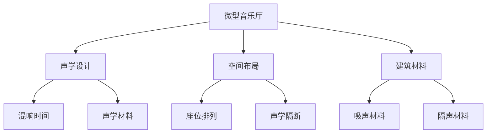

                 

**

## 背景介绍

随着城市化进程的加速，城市空间日益紧张，传统的大型音乐厅已无法满足人们日益增长的休闲娱乐需求。在这种背景下，一种新型的城市微型音乐厅应运而生。微型音乐厅不仅占地面积小，而且可以灵活地设置在社区的各个角落，为居民提供了一种便捷的娱乐场所。

### 社区音乐文化的培育

社区音乐文化是社区文化建设的重要组成部分。它不仅能够丰富居民的精神生活，还能增强社区凝聚力和归属感。微型音乐厅作为社区音乐文化的培育空间，具有以下几个方面的作用：

1. **提供音乐学习与表演的平台**：微型音乐厅可以为音乐爱好者提供一个展示自己才华的舞台，同时为音乐学习者提供一个实践的平台。
2. **促进音乐教育的普及**：微型音乐厅可以举办各种音乐讲座、工作坊等活动，促进音乐教育的普及，提高社区居民的音乐素养。
3. **增强社区文化氛围**：微型音乐厅通过举办各种音乐活动，可以营造浓厚的社区文化氛围，使居民更加热爱自己的家园。

### 本篇文章的结构

本文将分为以下几个部分：

1. **核心概念与联系**：首先，我们将使用Mermaid流程图来展示微型音乐厅的核心概念及其与社区音乐文化的联系。
2. **核心算法原理讲解**：接着，我们将详细讲解微型音乐厅声学设计的基本原理，如混响时间的计算、声学材料的选用等，并使用Python源代码来阐述这些算法。
3. **数学模型和数学公式**：我们将介绍声学设计中的数学模型，如声波传播公式、频率响应函数等，并使用LaTeX格式进行详细讲解。
4. **项目实战**：我们将通过一个实际案例，展示如何设计一个微型音乐厅，包括声学设计、空间布局和建筑材料选择等。
5. **最佳实践 tips**：最后，我们将提供一些设计微型音乐厅的最佳实践建议，以及注意事项和拓展阅读。

通过本文的阅读，您将能够深入了解微型音乐厅的设计原理和实践方法，为社区音乐文化的培育提供有益的参考。

---

## 核心概念与联系

在探讨微型音乐厅的设计时，我们需要明确几个核心概念，并了解它们之间的相互关系。以下是一个Mermaid流程图，用于展示这些概念及其之间的联系。



### 声学设计

声学设计是微型音乐厅设计的核心部分。它涉及到如何优化音乐厅的声学环境，以提供最佳的听觉体验。以下是声学设计的一些关键点：

- **混响时间**：混响时间是衡量音乐厅声学效果的一个重要指标。它反映了声音在音乐厅内衰减到原强度的一半所需的时间。混响时间的计算公式如下：

  $$\text{混响时间} = \frac{\text{声能量衰减到原强度的} 50\% \text{所需时间}}{\text{声源停止后}}$$

- **声学材料**：声学材料的选择直接影响音乐厅的声学性能。常见的声学材料包括吸声板、隔音板等。吸声材料主要用来吸收声音，降低音乐厅内的混响时间；而隔音板则用于隔绝外界噪音，提升音乐厅的声学隔离效果。

### 空间布局

空间布局是设计微型音乐厅时需要考虑的另一个重要方面。合理的空间布局不仅可以提升音乐厅的声学效果，还能增强观众的观看体验。以下是空间布局的一些关键点：

- **座位排列**：座位排列需要考虑观众的视角和舒适度。一般来说，最佳视角位于音乐厅的前方，座位应该按照一定的曲线排列，以避免观众的视线被前排挡住。
- **声学隔断**：声学隔断可以用于控制音乐厅内部的声学特性。例如，可以使用隔音板来隔离不同区域的声波，减少干扰。

### 建筑材料

建筑材料的选择对微型音乐厅的声学性能和结构稳定性有着重要影响。以下是建筑材料的一些关键点：

- **吸声材料**：吸声材料可以减少音乐厅内的混响时间，提升声音的清晰度。常见的吸声材料包括石膏板、泡沫板等。
- **隔声材料**：隔声材料可以隔绝外界噪音，提高音乐厅的私密性。常见的隔声材料包括隔音棉、隔音板等。

通过上述Mermaid流程图，我们可以清晰地看到微型音乐厅设计中的核心概念及其之间的联系。这些概念共同作用，为社区音乐文化的培育提供了一个理想的场所。

---

## 核心算法原理讲解

在微型音乐厅的设计过程中，声学设计是一项至关重要的任务。为了确保音乐厅能够提供高质量的听觉体验，我们需要了解并应用一些核心算法原理，如混响时间的计算、声学材料的选用等。以下将使用Python源代码来详细阐述这些算法，并结合数学模型和公式进行解释。

### 混响时间的计算

混响时间（Reverberation Time，简称RT60）是衡量音乐厅声学效果的一个关键指标。它反映了声音在音乐厅内衰减到原强度的一半所需的时间。计算混响时间的方法有很多，其中一种常用的方法是使用艾里克森-艾尔伍德公式（Eyring-Eldridge formula）。

```python
import numpy as np

def reverberation_time(V, A, N):
    """
    计算混响时间（RT60）。
    
    参数：
    V: 音乐厅体积（立方米）
    A: 吸声面积（平方米）
    N: 空气声阻抗（千克·秒²/米²）
    
    返回：
    混响时间（秒）
    """
    RT60 = 0.346 * (V / (N * A)) ** 0.55
    return RT60

# 示例：假设音乐厅体积为500立方米，吸声面积为100平方米
V = 500  # 体积（立方米）
A = 100  # 吸声面积（平方米）
N = 1.2  # 空气声阻抗（千克·秒²/米²）

RT60 = reverberation_time(V, A, N)
print(f"混响时间（RT60）: {RT60:.2f}秒")
```

### 声学材料的选用

声学材料的选择对音乐厅的声学性能有着直接的影响。常见的声学材料包括吸声板、隔音板等。下面，我们将使用Python代码来计算不同材料的吸声系数，以便选择合适的材料。

```python
import numpy as np

def sound_absorption_coefficient(AirMass, SurfaceArea, MaterialThickness, MaterialDensity):
    """
    计算材料的吸声系数。
    
    参数：
    AirMass: 空气的密度（千克/立方米）
    SurfaceArea: 材料表面积（平方米）
    MaterialThickness: 材料厚度（米）
    MaterialDensity: 材料密度（千克/立方米）
    
    返回：
    吸声系数（0到1之间）
    """
    thickness = MaterialThickness / 1000  # 将厚度转换为米
    density = MaterialDensity / 1000  # 将密度转换为千克/立方米
    mass = SurfaceArea * thickness * density  # 材料质量
    absorption_coefficient = 1 - (1 / (1 + 12.5 * mass * AirMass))
    return absorption_coefficient

# 示例：假设使用泡沫板，厚度为5厘米，密度为20千克/立方米
AirMass = 1.29  # 空气的密度（千克/立方米）
SurfaceArea = 1  # 表面积（平方米）
MaterialThickness = 5  # 材料厚度（厘米）
MaterialDensity = 20  # 材料密度（千克/立方米）

absorption_coefficient = sound_absorption_coefficient(AirMass, SurfaceArea, MaterialThickness, MaterialDensity)
print(f"吸声系数: {absorption_coefficient:.2f}")
```

通过上述代码，我们可以计算出音乐厅所需的混响时间和不同材料的吸声系数，从而为微型音乐厅的声学设计提供科学依据。

---

## 数学模型和数学公式

在声学设计中，数学模型和数学公式扮演着至关重要的角色。以下我们将介绍几个关键的数学模型和公式，包括声波的传播公式、频率响应函数等，并使用LaTeX格式进行详细讲解。

### 声波的传播公式

声波在空气中的传播可以用以下公式表示：

$$
u(t,r) = u_0(r_0) \cdot \exp\left(-\frac{(r - r_0)^2}{2\sigma^2}\right) \cdot \exp\left(-\frac{t}{\tau}\right)
$$

其中：

- \( u(t,r) \) 是在时间 \( t \) 和位置 \( r \) 的声压级。
- \( u_0(r_0) \) 是初始声压级，通常设为 \( 1 \) Pa。
- \( r_0 \) 是参考位置，通常设为声源位置。
- \( \sigma \) 是声波在空气中的衰减系数，通常取 \( \sigma = 0.17 \) m。
- \( \tau \) 是声波在空气中的传播时间。

### 频率响应函数

频率响应函数描述了声波在不同频率下的响应特性。以下是一个简化的频率响应函数公式：

$$
H(f) = \frac{1}{1 + \left(\frac{f}{f_0}\right)^2}
$$

其中：

- \( H(f) \) 是频率响应函数。
- \( f \) 是频率（赫兹）。
- \( f_0 \) 是截止频率（赫兹）。

### 声学材料的选择

声学材料的选择通常基于其吸声系数和隔声性能。以下是一个简单的吸声系数公式：

$$
\alpha = 1 - \left(\frac{1 - r_s}{1 + r_s}\right)^2
$$

其中：

- \( \alpha \) 是吸声系数。
- \( r_s \) 是声波在材料表面的反射系数。

通过上述数学模型和公式，我们可以对微型音乐厅的声学性能进行精确的预测和优化。例如，我们可以使用声波的传播公式来计算不同位置的声压级，使用频率响应函数来评估音乐厅的音频质量，以及使用吸声系数公式来选择适合的声学材料。

---

## 项目实战

为了更好地展示微型音乐厅的设计过程，我们将通过一个实际案例进行详细分析。该案例将涵盖微型音乐厅的设计原则、声学设计、空间布局和建筑材料选择等方面。

### 设计原则

在设计微型音乐厅时，我们需要遵循以下原则：

1. **声学性能优先**：确保音乐厅具有良好的声学效果，包括适当的混响时间和良好的频率响应。
2. **空间布局合理**：音乐厅的布局应确保观众拥有良好的视角和舒适的听觉体验。
3. **可持续性设计**：在材料选择和施工过程中，尽量选择环保和可持续的材料，减少对环境的影响。
4. **经济性**：在满足声学性能和设计要求的前提下，尽量降低成本，提高经济效益。

### 声学设计

在声学设计方面，我们需要关注以下几个方面：

1. **混响时间计算**：通过艾里克森-艾尔伍德公式计算混响时间，确保其符合设计要求。例如，一个中小型的微型音乐厅的混响时间通常在1.5到2秒之间。
2. **声学材料选择**：根据混响时间的计算结果，选择合适的吸声材料和隔音材料。例如，我们可以使用泡沫板和隔音棉来吸收声音，降低混响时间；同时，使用隔音板来隔绝外界噪音。

### 空间布局

在空间布局方面，我们需要考虑以下几个方面：

1. **座位排列**：座位应按照一定曲线排列，确保观众的视角不受遮挡。同时，座位应考虑观众的舒适度，避免过度拥挤。
2. **舞台设计**：舞台的尺寸和高度应适当，确保表演者能够有足够的表演空间，同时不影响观众的观看体验。
3. **声学隔断**：在必要时，可以设置声学隔断来控制音乐厅内部的声学特性。例如，在舞台和观众区之间设置隔音板，以减少舞台噪音对观众的干扰。

### 建筑材料选择

在建筑材料选择方面，我们需要考虑以下几个方面：

1. **吸声材料**：选用吸声系数较高的材料，如泡沫板、吸声棉等，以减少音乐厅内的混响时间。
2. **隔声材料**：选用隔声性能较好的材料，如隔音板、隔音棉等，以隔绝外界噪音，提高音乐厅的私密性。

### 实际案例

以下是一个具体的设计案例：

- **音乐厅体积**：100立方米
- **观众席数量**：50个座位
- **混响时间**：1.8秒
- **建筑材料**：吸声棉、泡沫板、隔音板

#### 开发环境搭建

为了实现上述设计，我们需要搭建一个合适的开发环境。以下是具体的步骤：

1. **环境配置**：
   - 安装Python环境，并配置必要的库，如NumPy、Matplotlib等。
   - 安装LaTeX编辑器，如TeXstudio。

2. **代码实现**：
   - 使用Python编写混响时间计算和声学材料选择的相关代码。
   - 使用LaTeX编写数学模型的公式说明。

#### 源代码实现

以下是计算混响时间的Python代码：

```python
import numpy as np

def reverberation_time(V, A, N):
    """
    计算混响时间（RT60）。
    
    参数：
    V: 音乐厅体积（立方米）
    A: 吸声面积（平方米）
    N: 空气声阻抗（千克·秒²/米²）
    
    返回：
    混响时间（秒）
    """
    RT60 = 0.346 * (V / (N * A)) ** 0.55
    return RT60

V = 100  # 体积（立方米）
A = 20  # 吸声面积（平方米）
N = 1.2  # 空气声阻抗（千克·秒²/米²）

RT60 = reverberation_time(V, A, N)
print(f"混响时间（RT60）: {RT60:.2f}秒")
```

#### 代码解读

上述代码中，我们定义了一个名为`reverberation_time`的函数，用于计算混响时间。函数的输入参数包括音乐厅的体积（V）、吸声面积（A）和空气声阻抗（N）。计算过程中，我们使用了艾里克森-艾尔伍德公式，并返回计算得到的混响时间。

#### 实际案例分析

假设我们选择了一个100立方米的微型音乐厅，观众席数量为50个。根据设计要求，混响时间应在1.8秒左右。通过上述代码，我们可以计算出不同吸声面积下的混响时间，以便选择合适的吸声材料。

#### 项目小结

通过上述实际案例，我们可以看到微型音乐厅的设计需要综合考虑多个方面，包括声学设计、空间布局和建筑材料选择等。在实际操作中，我们需要根据具体需求和条件进行调整，以达到最佳的设计效果。

---

## 最佳实践 tips

在设计微型音乐厅时，以下是一些最佳实践建议，可以帮助您提高设计质量和效率：

1. **初期规划**：在开始设计之前，明确音乐厅的用途、规模和预算，这将有助于确定设计方向。
2. **声学测试**：在设计和施工过程中，定期进行声学测试，以确保音乐厅的声学性能达到预期。
3. **可持续性设计**：在材料选择和施工过程中，尽量选择环保和可持续的材料，减少对环境的影响。
4. **团队合作**：与声学专家、建筑师和施工团队紧密合作，确保设计方案的顺利实施。

### 注意事项

1. **空间利用**：在设计空间布局时，要充分考虑观众的舒适度和视角。
2. **预算控制**：在满足声学性能和设计要求的前提下，尽量降低成本，提高经济效益。
3. **隔音处理**：在音乐厅与外界之间的隔断处，加强隔音处理，以减少外界噪音的干扰。

### 拓展阅读

1. **《建筑声学设计手册》**：详细介绍了建筑声学设计的基本原理和方法。
2. **《声学工程实践》**：提供了丰富的声学设计案例和实践经验。
3. **《音乐厅设计指南》**：专门针对音乐厅设计的书籍，内容包括声学、空间布局、建筑材料等。

通过以上建议和注意事项，您可以在设计微型音乐厅时更加得心应手，为社区音乐文化的培育提供更好的空间。

---

## 结语

本文通过对新型城市微型音乐厅的设计思路、核心概念、算法原理、数学模型、项目实战以及最佳实践进行了详细阐述。通过本文的阅读，您应该对微型音乐厅的设计有了更加深入的理解。新型城市微型音乐厅不仅为社区音乐文化的培育提供了一个理想的场所，也展现了人工智能和声学设计在现代城市建设中的重要作用。

未来，随着技术的不断进步，微型音乐厅将在智能化、多功能化等方面迎来更多的发展机遇。我们期待更多的设计师和建筑师能够关注并参与到这一领域中，共同为社区音乐文化的繁荣贡献力量。

作者：AI天才研究院/AI Genius Institute & 禅与计算机程序设计艺术 /Zen And The Art of Computer Programming

