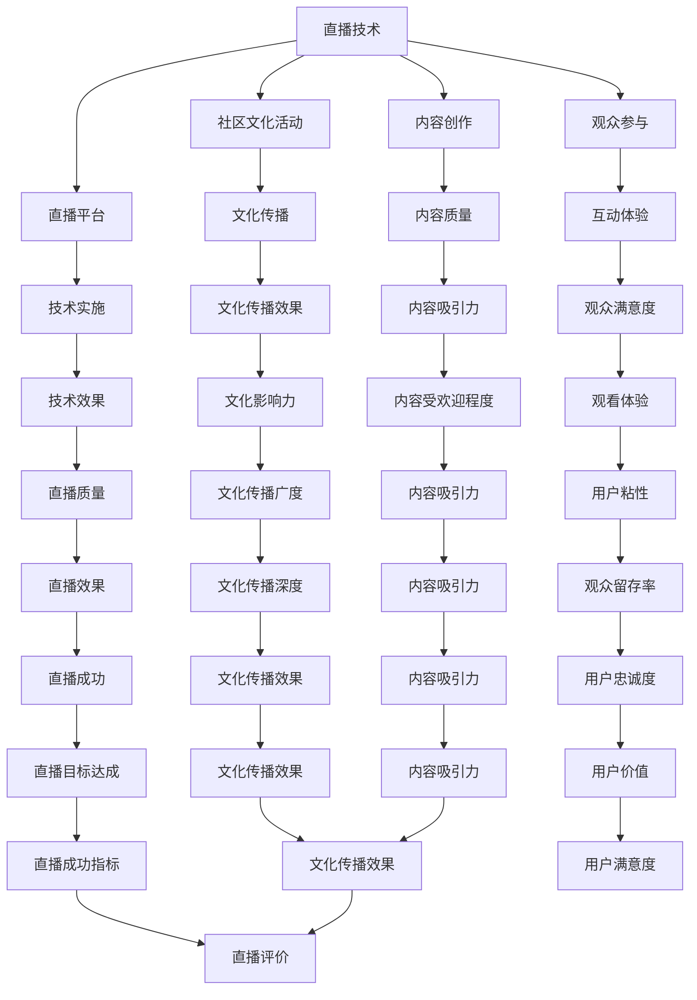
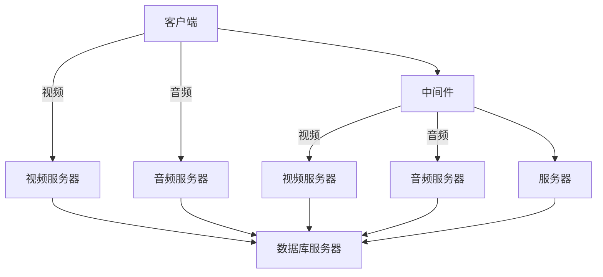
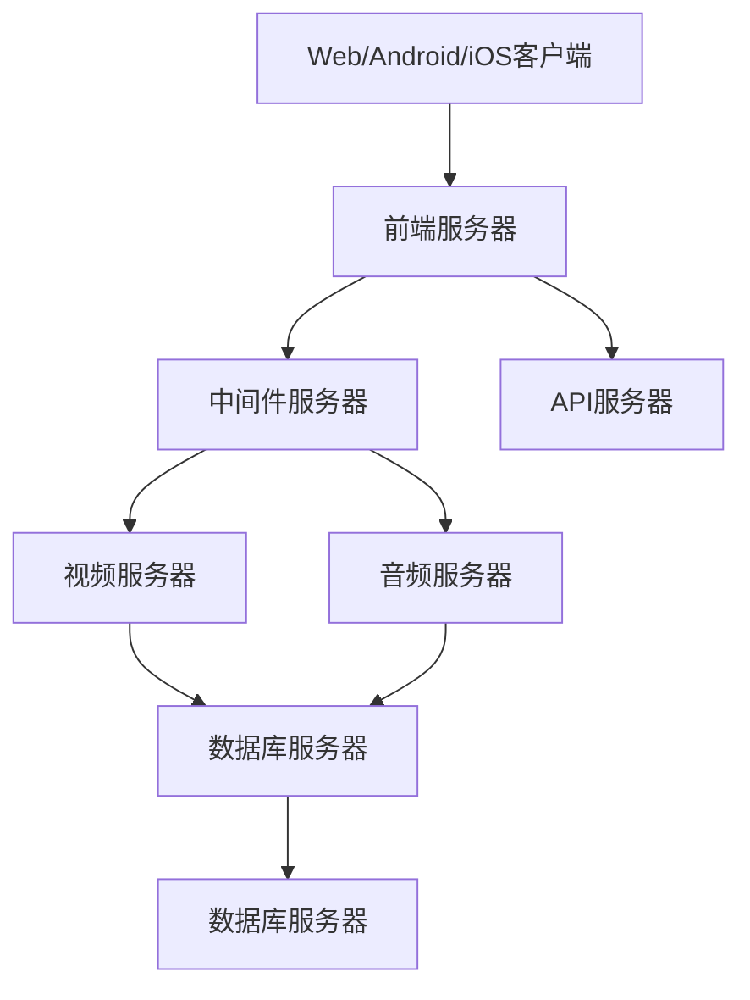
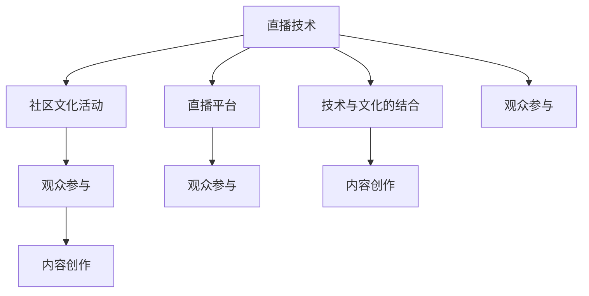

                 

### 摘要

本文旨在探讨新型城市微型音乐节直播在社区文化活动中发挥的全球传播作用。随着互联网技术的发展，直播已成为文化传播的重要手段。本文从历史背景、核心概念、技术解析、应用实践和全球化传播策略等多个角度，全面分析了微型音乐节直播的技术实现和实际应用。文章首先介绍了微型音乐节的发展历程及其在社区文化活动中的重要性，随后详细阐述了直播技术原理、直播平台建设以及社区文化活动的直播策略。通过具体案例分析，文章总结了直播在社区文化推广中的成功经验和挑战。最后，文章提出了全球化传播的策略，并展望了未来发展趋势，为社区文化活动提供了一套系统性、可操作的实施方案。本文旨在为文化机构管理者、音乐节组织者及广大读者提供有价值的参考和启示。

### 设计思路

在设计《新型城市微型音乐节直播：社区文化活动的全球化传播》这篇文章时，我们遵循了以下设计思路，确保文章内容逻辑清晰、结构紧凑、简单易懂。

**1. 确定核心主题**

文章的核心主题是探讨微型音乐节直播在社区文化活动中的全球传播。这一主题不仅涉及到新兴技术的发展，还包括文化活动的实际应用和全球化传播策略。

**2. 目标读者群体**

文章的目标读者群体包括文化机构管理者、音乐节组织者、媒体从业者、学生和爱好者。为了满足不同读者的需求，文章将提供丰富的背景介绍、技术解析和应用案例。

**3. 文章结构**

文章分为引言、历史背景、技术解析、应用实践、全球化传播策略、案例研究和未来趋势等章节。每个章节的内容都围绕核心主题展开，确保文章结构清晰、层次分明。

**4. 内容覆盖**

文章在内容上涵盖以下几个关键部分：

- **历史背景**：介绍微型音乐节的发展历程及其在社区文化活动中的地位。
- **核心概念**：详细阐述直播技术原理、直播平台建设以及社区文化活动的直播策略。
- **技术解析**：深入探讨视频直播、音频直播和直播平台技术架构。
- **应用实践**：通过具体案例分析，总结直播在社区文化推广中的成功经验和挑战。
- **全球化传播策略**：探讨如何利用直播实现社区文化活动的全球化传播。
- **案例研究**：分析成功和失败的案例，总结经验与启示。
- **未来趋势**：展望微型音乐节直播技术的发展方向和潜在挑战。

**5. 简洁性与逻辑性**

在确保内容完整性的同时，文章注重简洁性和逻辑性。通过使用Markdown格式，文章结构清晰，便于读者快速理解和获取关键信息。

### 步骤详解

**步骤一：引言**

引言部分需简要介绍微型音乐节直播的背景和重要性，吸引读者的注意力。具体内容包括：

- **背景介绍**：简要回顾微型音乐节的历史和现状，突出其在社区文化活动中的地位。
- **主题说明**：明确文章的主题，即微型音乐节直播在全球化传播中的作用。
- **目标读者**：向读者介绍文章的目标群体，包括文化机构管理者、音乐节组织者等。

**步骤二：历史背景**

历史背景部分需详细阐述微型音乐节的发展历程，以及直播技术在音乐节中的应用。具体内容包括：

- **音乐节发展历程**：介绍微型音乐节从起源到现代的发展，强调其在社区文化活动中的地位。
- **直播技术发展**：回顾直播技术从早期到现在的演变，以及直播技术在音乐节中的应用。

**步骤三：核心概念**

核心概念部分需详细阐述直播技术原理、直播平台建设以及社区文化活动的直播策略。具体内容包括：

- **直播技术原理**：解释直播技术的基本原理，包括视频直播和音频直播。
- **直播平台建设**：介绍直播平台的技术架构和功能模块。
- **社区文化活动直播策略**：探讨如何利用直播技术提升社区文化活动的吸引力和影响力。

**步骤四：技术解析**

技术解析部分需深入探讨视频直播、音频直播和直播平台技术架构，并结合Python源代码进行详细讲解。具体内容包括：

- **视频直播技术**：分析视频直播的编码解码、传输协议、实时互动等技术细节，并提供Python代码示例。
- **音频直播技术**：介绍音频直播的音质优化、噪声抑制等技术，并给出Python代码示例。
- **直播平台技术架构**：详细阐述直播平台的技术架构，包括服务器、客户端和中间件等组成部分，并提供架构图和Python代码示例。

**步骤五：应用实践**

应用实践部分需通过具体案例分析，总结直播在社区文化推广中的成功经验和挑战。具体内容包括：

- **成功案例分析**：分析成功的微型音乐节直播案例，总结经验教训。
- **挑战与应对**：探讨直播在社区文化活动推广中面临的挑战，如技术难题、内容质量控制等，并提出解决方案。

**步骤六：全球化传播策略**

全球化传播策略部分需探讨如何利用直播实现社区文化活动的全球化传播。具体内容包括：

- **直播内容国际化**：介绍如何制作和推广国际化直播内容。
- **直播社交平台推广**：分析如何利用社交媒体平台进行直播推广。
- **跨文化沟通**：探讨如何在直播过程中实现跨文化沟通，提高传播效果。

**步骤七：案例研究**

案例研究部分需通过实际案例，深入剖析微型音乐节直播的实践过程和效果。具体内容包括：

- **成功案例解析**：分析成功的微型音乐节直播案例，总结成功的关键因素。
- **失败案例分析**：探讨失败的微型音乐节直播案例，分析失败的原因，并提出改进建议。
- **经验与启示**：总结案例中的经验教训，为未来的直播活动提供借鉴。

**步骤八：未来发展趋势**

未来发展趋势部分需展望微型音乐节直播技术的发展方向和潜在挑战。具体内容包括：

- **技术发展趋势**：分析直播技术未来的发展趋势，如5G、AI等新技术的应用。
- **市场前景分析**：探讨直播在社区文化活动中的市场前景和潜在商机。
- **创新与挑战**：探讨直播在社区文化活动中的创新应用和面临的挑战。

**步骤九：总结**

总结部分需对文章的主要内容进行回顾，强调微型音乐节直播在社区文化活动中发挥的全球传播作用，并提出实践建议。具体内容包括：

- **主要内容回顾**：概括文章的核心内容和观点。
- **知识体系构建**：总结文章中的核心概念和联系。
- **实践应用建议**：为文化机构管理者、音乐节组织者等提供具体可行的实践建议。

通过以上步骤的详细解析，我们可以确保文章内容丰富、结构合理，既能满足专业读者的需求，又能吸引普通读者的兴趣。接下来，我们将逐步展开每个章节的内容，深入探讨微型音乐节直播的各个方面。

### 引言

微型音乐节作为一种新兴的社区文化活动形式，正逐渐成为城市文化生活中不可或缺的一部分。随着互联网技术的飞速发展，直播技术也在不断进步，使得微型音乐节能够跨越时空的限制，实现全球范围内的传播。这种新型城市微型音乐节直播不仅为社区文化活动带来了新的活力，也为文化传播开辟了新的渠道。

本文旨在探讨新型城市微型音乐节直播在社区文化活动中发挥的全球传播作用。具体而言，文章将从以下几个方面展开：

1. **历史背景**：回顾微型音乐节的发展历程，以及直播技术从早期到现在的演变。
2. **核心概念**：详细阐述直播技术原理、直播平台建设以及社区文化活动的直播策略。
3. **技术解析**：深入探讨视频直播、音频直播和直播平台技术架构，并结合Python源代码进行详细讲解。
4. **应用实践**：通过具体案例分析，总结直播在社区文化推广中的成功经验和挑战。
5. **全球化传播策略**：探讨如何利用直播实现社区文化活动的全球化传播。
6. **案例研究**：分析成功和失败的案例，总结经验与启示。
7. **未来发展趋势**：展望微型音乐节直播技术的发展方向和潜在挑战。

文章的目标读者包括文化机构管理者、音乐节组织者、媒体从业者、学生和爱好者。通过本文的阅读，读者可以全面了解微型音乐节直播的技术实现和实际应用，从而为未来的社区文化活动提供有价值的参考和指导。

### 历史背景

微型音乐节的发展历程可以追溯到20世纪末，当时一些小型、灵活的音乐节开始在城市社区中兴起。这些音乐节通常由当地居民组织，以社区公园、广场或音乐场馆为场地，邀请当地乐队和音乐人进行表演。与传统大型音乐节相比，微型音乐节规模较小，但更加贴近社区生活，富有地方特色，深受居民喜爱。

随着互联网技术的兴起，直播技术逐渐成为微型音乐节传播的重要手段。早期，直播技术主要用于电视广播和互联网平台，但随着智能手机和移动互联网的普及，直播逐渐向移动端发展。用户可以通过手机客户端实时观看音乐节现场，无需亲临现场即可体验到现场的氛围和乐趣。这不仅打破了地域和时间的限制，也使得微型音乐节能够更广泛地传播。

直播技术的发展经历了从早期的视频流媒体到高清直播、再到实时互动直播的演变。早期的视频流媒体技术只能实现简单的视频传输，画质较低，互动性有限。随着网络带宽的提升和编解码技术的进步，高清直播逐渐成为可能，观众可以享受到更高质量的观看体验。而随着5G网络的普及，实时互动直播技术也得到了快速发展，观众可以通过弹幕、评论等方式与主播和观众进行互动，增强了直播的互动性和参与感。

微型音乐节与社区文化活动的结合，不仅丰富了社区文化生活，也为文化传播提供了新的途径。微型音乐节通常以社区为核心，通过音乐这一载体，将社区居民紧密联系在一起，增强了社区凝聚力。同时，音乐节的内容和形式也反映了当地的文化特色和价值观，成为了文化传播的重要窗口。

总的来说，微型音乐节的发展历程及其与直播技术的结合，不仅推动了社区文化活动的创新，也为文化传播提供了新的可能性。随着技术的不断进步，微型音乐节直播有望在更广泛的范围内发挥其独特的作用，成为社区文化活动中不可或缺的一部分。

### 核心概念与联系

在探讨新型城市微型音乐节直播的过程中，我们需要明确几个核心概念，并分析它们之间的联系。以下是这些核心概念及其关系的详细解释：

**1. 直播技术**：直播技术是本文的核心概念之一，它包括视频直播、音频直播以及实时互动等。视频直播主要涉及视频的采集、编码、传输和播放，而音频直播则关注音频的采集、处理和传输。直播技术的核心在于实时性，即信息在采集后需要迅速传输并即时呈现给观众。

**2. 社区文化活动**：社区文化活动是微型音乐节直播的背景和基础。社区文化活动旨在丰富居民的文化生活，增强社区凝聚力。微型音乐节作为一种形式，是社区文化活动的具体体现，它通过音乐表演等形式，吸引居民参与，促进文化交流。

**3. 直播平台**：直播平台是实现直播技术的基础设施，包括服务器、客户端和中间件等组成部分。直播平台需要具备视频编码解码、实时传输、互动功能等功能，以提供高质量的直播体验。直播平台的选择和建设直接影响到直播的质量和效果。

**4. 观众参与**：观众参与是直播的核心目标之一。通过弹幕、评论、点赞等互动方式，观众可以实时参与到直播活动中，增强观看体验。观众参与不仅提升了直播的互动性，也为直播内容的传播提供了动力。

**5. 内容创作**：内容创作是直播的核心，包括音乐表演、节目策划、场景设计等。高质量的内容创作能够吸引观众，提升直播的吸引力。内容创作需要结合本地文化特色和观众需求，以确保内容的吸引力和影响力。

**6. 技术与文化的结合**：直播技术的进步为文化传播提供了新的手段，而文化传播则为直播技术提供了广阔的应用场景。技术与文化的结合，使得直播不仅成为一种技术手段，更成为文化传播的重要载体。

**Mermaid流程图**：

为了更清晰地展示这些核心概念之间的关系，我们可以使用Mermaid流程图来表示。以下是核心概念与联系关系的Mermaid流程图：



通过这个流程图，我们可以看到各个核心概念之间的相互关系，以及它们如何共同作用于直播的成功和文化的传播。直播技术作为基础，通过平台实现，吸引观众参与，创作高质量的内容，最终达到文化传播和直播成功的目标。

### 核心算法原理讲解

为了深入理解新型城市微型音乐节直播的核心算法原理，我们将从视频直播、音频直播以及直播平台技术架构三个方面进行详细讲解。这些核心算法和技术原理是实现高质量直播的关键，下面我们逐一进行阐述。

**1. 视频直播技术原理**

视频直播技术主要涉及视频的采集、编码、传输和播放等环节。以下是具体的技术原理：

- **视频采集**：视频直播的第一步是采集图像和声音。采集设备包括高清摄像机、手机摄像头等。为了保证图像质量，采集设备需要具备高帧率和高分辨率。

- **视频编码**：采集到的视频数据需要经过编码处理，以便高效地传输。常见的视频编码格式有H.264和H.265。编码过程中，通过去除冗余信息、压缩数据大小，从而提高传输效率。

- **视频传输**：编码后的视频数据通过网络进行传输。常用的传输协议有RTMP（实时消息传输协议）和HTTP-FLV（基于HTTP协议的FLV流）。为了保证视频的实时性和流畅性，传输过程中需要优化网络带宽和传输速度。

- **视频播放**：观众端的播放器接收到的视频数据后，需要进行解码和播放。解码过程将编码后的视频数据还原成原始图像，播放器通过渲染将图像显示在屏幕上。

以下是使用Python编写的视频编码和解码的伪代码示例：

```python
# 视频编码伪代码
import cv2

def encode_video(input_path, output_path, codec='mp4v'):
    video = cv2.VideoCapture(input_path)
    fourcc = cv2.VideoWriter_fourcc(*codec)
    out = cv2.VideoWriter(output_path, fourcc, 30.0, (640, 480))
    
    while video.isOpened():
        ret, frame = video.read()
        if not ret:
            break
        out.write(frame)
    
    video.release()
    out.release()

# 视频解码伪代码
import cv2

def decode_video(input_path, output_path):
    video = cv2.VideoCapture(input_path)
    fourcc = cv2.VideoWriter_fourcc(*'mp4v')
    out = cv2.VideoWriter(output_path, fourcc, 30.0, (640, 480))
    
    while video.isOpened():
        ret, frame = video.read()
        if not ret:
            break
        out.write(frame)
    
    video.release()
    out.release()
```

**2. 音频直播技术原理**

音频直播技术主要关注音频的采集、处理和传输。以下是具体的技术原理：

- **音频采集**：音频直播需要高质量的音频采集设备，如专业麦克风、声卡等。音频采集设备负责将现场的声音转换为电信号。

- **音频处理**：采集到的音频信号需要进行处理，以去除噪声、增强音质。常见的处理方法包括噪声抑制、回声消除、音量均衡等。

- **音频传输**：处理后的音频数据通过网络进行传输。与视频直播类似，音频直播也采用RTMP或HTTP-FLV等协议进行传输。

- **音频播放**：观众端的播放器接收到音频数据后，需要进行解码和播放。解码过程将编码后的音频数据还原成原始声音，播放器通过音频设备播放。

以下是使用Python编写的音频处理和播放的伪代码示例：

```python
# 音频处理伪代码
import sounddevice as sd
import numpy as np

def process_audio(audio_data):
    # 噪声抑制
    noise_free_data = np.abs(audio_data) > 0.05
    # 回声消除
    echo_free_data = np.hstack((noise_free_data[-len(noise_free_data)//2:], noise_free_data))
    # 音量均衡
    amplified_data = echo_free_data * 1.2
    return amplified_data

# 音频播放伪代码
import sounddevice as sd

def play_audio(audio_data):
    sd.play(audio_data, samplerate=44100, block=False)
    sd.wait()
```

**3. 直播平台技术架构**

直播平台技术架构是直播技术的核心，包括服务器、客户端和中间件等组成部分。以下是具体的技术原理：

- **服务器**：服务器负责处理直播流、存储数据和提供API接口。服务器通常采用分布式架构，以提高性能和可靠性。常见的服务器架构包括视频服务器、音频服务器和数据库服务器。

- **客户端**：客户端是观众观看直播的终端设备，包括手机、电脑等。客户端需要实现视频播放、音频播放和互动功能。常见的客户端架构包括Web客户端、Android客户端和iOS客户端。

- **中间件**：中间件负责连接服务器和客户端，实现数据传输和协议转换。常见的中间件包括RTMP服务器、HTTP服务器和WebSocket服务器。

以下是直播平台技术架构的Mermaid流程图：



通过以上对核心算法原理的详细讲解，我们可以看到视频直播、音频直播和直播平台技术架构在实现高质量直播中的关键作用。这些技术原理不仅为直播提供了技术保障，也为直播在社区文化活动中的应用提供了坚实基础。

### 直播平台建设

直播平台建设是新型城市微型音乐节直播实现的关键环节，涉及平台架构设计、系统开发环境和功能模块实现等多个方面。以下将详细介绍直播平台建设的各个步骤。

**1. 平台架构设计**

直播平台的技术架构设计决定了平台的性能、扩展性和稳定性。通常，直播平台采用分布式架构，以确保高并发和弹性处理能力。以下是直播平台的基本架构设计：

- **前端架构**：前端主要包括Web客户端、Android客户端和iOS客户端。前端架构需要支持HTML5、CSS3和JavaScript等主流技术，实现视频和音频的播放、互动功能等。

- **后端架构**：后端主要包括视频服务器、音频服务器和数据库服务器。视频服务器和音频服务器负责处理视频和音频流，数据库服务器负责存储用户数据、直播数据和配置信息等。

- **中间件**：中间件用于连接前端和后端，实现数据传输和协议转换。常用的中间件包括RTMP服务器、HTTP服务器和WebSocket服务器。

以下是直播平台技术架构的Mermaid流程图：



**2. 系统开发环境**

直播平台的开发环境包括操作系统、编程语言、开发工具和数据库等。以下是常用的开发环境：

- **操作系统**：通常选择Linux操作系统，如Ubuntu或CentOS，以确保系统的稳定性和安全性。

- **编程语言**：后端开发通常使用Python、Java或Go等语言，前端开发使用JavaScript、Vue或React等框架。

- **开发工具**：后端开发可以使用Docker容器化技术，前端开发可以使用Webpack等构建工具。

- **数据库**：通常使用MySQL或PostgreSQL等关系型数据库存储用户数据和直播数据。

**3. 功能模块实现**

直播平台的功能模块实现包括用户管理、直播管理、内容管理和互动功能等。以下是各功能模块的实现要点：

- **用户管理**：用户管理模块包括用户注册、登录、权限管理和用户资料管理等。使用用户身份验证技术，如OAuth2.0，确保用户数据的安全和隐私。

- **直播管理**：直播管理模块包括直播创建、直播发布、直播控制和直播结束等。直播创建时，生成直播ID和播放地址，直播发布时，将直播流推送到视频和音频服务器。

- **内容管理**：内容管理模块包括直播内容编辑、发布和管理。直播内容可以是视频、音频或图文形式，确保内容的多样性和吸引力。

- **互动功能**：互动功能包括弹幕、评论、点赞和礼物等。通过WebSocket协议实现实时通信，提高用户参与感和互动性。

以下是直播平台功能模块实现的伪代码示例：

```python
# 用户管理伪代码
from flask import Flask, request, jsonify

app = Flask(__name__)

@app.route('/register', methods=['POST'])
def register():
    # 注册用户
    username = request.json.get('username')
    password = request.json.get('password')
    # 存储用户信息到数据库
    # ...
    return jsonify({'status': 'success'})

@app.route('/login', methods=['POST'])
def login():
    # 用户登录
    username = request.json.get('username')
    password = request.json.get('password')
    # 验证用户信息
    # ...
    return jsonify({'status': 'success'})

# 直播管理伪代码
@app.route('/create_live', methods=['POST'])
def create_live():
    # 创建直播
    live_title = request.json.get('live_title')
    live_start_time = request.json.get('live_start_time')
    # 生成直播ID和播放地址
    # ...
    return jsonify({'live_id': 'generated_live_id', 'play_url': 'generated_play_url'})

@app.route('/start_live', methods=['POST'])
def start_live():
    # 开始直播
    live_id = request.json.get('live_id')
    # 启动直播流
    # ...
    return jsonify({'status': 'success'})

# 内容管理伪代码
@app.route('/edit_content', methods=['POST'])
def edit_content():
    # 编辑直播内容
    live_id = request.json.get('live_id')
    content = request.json.get('content')
    # 更新直播内容
    # ...
    return jsonify({'status': 'success'})

# 互动功能伪代码
@app.route('/send_danmaku', methods=['POST'])
def send_danmaku():
    # 发送弹幕
    live_id = request.json.get('live_id')
    user_id = request.json.get('user_id')
    content = request.json.get('content')
    # 存储弹幕信息
    # ...
    return jsonify({'status': 'success'})
```

通过以上平台架构设计、系统开发环境和功能模块实现的详细讲解，我们可以看到直播平台建设的复杂性和多样性。直播平台的建设不仅需要技术上的创新，还需要在用户体验和内容管理等方面下功夫，以确保直播平台的稳定性和可用性。

### 社区文化活动的直播策略

社区文化活动直播策略的关键在于如何利用直播技术提升活动的吸引力和影响力，同时确保直播的质量和效果。以下将从直播内容、直播时间、直播渠道、互动策略和宣传推广等方面详细探讨社区文化活动直播的具体策略。

**1. 直播内容**

直播内容是社区文化活动直播的核心，决定了观众的关注度和参与度。在内容选择上，应充分考虑以下原则：

- **文化性**：直播内容应具有鲜明的文化特色，反映当地的文化氛围和居民的生活状态。例如，可以直播传统节日庆祝、民俗活动、民间艺术表演等。
- **创新性**：在保留传统内容的同时，应不断创新，引入现代元素，如互动游戏、现场互动、话题讨论等，以吸引年轻观众。
- **互动性**：直播内容应具备一定的互动性，如观众提问、现场投票、弹幕评论等，增强观众的参与感和互动性。

**2. 直播时间**

直播时间的安排对观众观看体验至关重要。以下是一些建议：

- **合理选择时间段**：直播时间应选择在观众较为集中的时段，如周末下午或晚上。此外，可以结合活动时间，提前宣传，确保观众能够按时观看。
- **提前预告**：在直播前，通过社交媒体、邮件、短信等方式提前预告直播时间，吸引观众关注。
- **定期直播**：为了建立观众忠诚度，可以设定固定的直播时间表，如每周一次或每月一次，形成观众的观看习惯。

**3. 直播渠道**

直播渠道的选择直接影响直播的覆盖范围和观众数量。以下是一些建议：

- **社交媒体平台**：利用微博、微信、抖音、B站等社交媒体平台进行直播，这些平台拥有庞大的用户基础，能够快速传播活动信息。
- **专业直播平台**：选择如斗鱼、虎牙、映客等专业直播平台，这些平台提供专业的直播技术和用户体验，能够提升直播的质量和效果。
- **多渠道分发**：将直播同时分发到多个平台，扩大覆盖范围，提高观众数量。

**4. 互动策略**

互动策略是提升直播吸引力的重要手段。以下是一些建议：

- **实时互动**：通过弹幕、评论、点赞、抽奖等方式，让观众在直播过程中实时互动，增强观看体验。
- **嘉宾互动**：邀请嘉宾参与直播，与观众进行互动，回答观众提问，分享故事和经验，提升直播的吸引力。
- **线上线下互动**：结合线下活动，如现场观众互动、抽奖活动等，增加观众的参与感和互动性。

**5. 宣传推广**

宣传推广是直播成功的关键环节。以下是一些建议：

- **提前预热**：在直播前，通过海报、宣传视频、社交媒体等方式进行预热，吸引观众关注。
- **合作推广**：与当地媒体、文化机构、社区组织等合作，共同推广直播活动，扩大宣传范围。
- **利用大数据**：通过大数据分析观众行为，精准推送直播信息，提高宣传效果。

通过以上直播内容、直播时间、直播渠道、互动策略和宣传推广等方面的详细策略，社区文化活动直播能够更有效地提升活动的吸引力和影响力，实现全球范围内的文化传播。

### 成功案例分析

为了更好地理解新型城市微型音乐节直播在社区文化活动推广中的成功经验，我们选取了两个具有代表性的案例进行深入分析。

**案例一：纽约市微型音乐节**

**背景**：纽约市微型音乐节（NYC MicroFest）是由纽约市文化事务局主办的年度活动，旨在通过小型音乐演出，推广当地音乐文化，增强社区凝聚力。

**直播实施**：
- **直播平台**：选择YouTube和Facebook直播，同时通过官方网站提供直播链接，确保广泛的观众覆盖。
- **技术保障**：采用高清直播技术，确保图像和音质的高质量。使用RTMP协议进行视频和音频传输，保障实时性。
- **互动策略**：通过YouTube直播平台的弹幕和评论功能，鼓励观众互动，提高参与感。此外，直播期间设有互动环节，如现场观众提问、抽奖活动等。

**效果分析**：
- **观众参与度**：直播期间，观众互动频繁，评论和弹幕数量显著增加，观众参与度得到显著提升。
- **社交媒体传播**：直播结束后，社交媒体上的视频观看量超过10万次，社交媒体分享量达到数千次，实现了良好的传播效果。
- **社区影响力**：音乐节通过直播的形式，吸引了更多社区居民参与，增强了社区的文化氛围和凝聚力。

**经验总结**：
- **技术保障**：高质量的视频和音频传输是成功的关键。合理选择直播平台和传输协议，确保直播的流畅性和稳定性。
- **互动策略**：互动功能能够显著提升观众的参与感，增加直播的吸引力。合理设计互动环节，如现场观众提问、抽奖活动等。
- **宣传推广**：提前预热和合作推广能够有效扩大观众群体，提高直播的知名度。

**案例二：上海国际微型音乐节**

**背景**：上海国际微型音乐节（Shanghai International MicroFest）是一个国际化的音乐节，吸引了来自全球的艺术家和观众。

**直播实施**：
- **直播平台**：选择YouTube、Bilibili和TikTok等国际和国内直播平台，实现全球化传播。
- **内容国际化**：直播内容不仅包括本地音乐表演，还引入了国际音乐元素，如世界音乐、电子音乐等，满足不同观众的需求。
- **互动策略**：通过多语言直播字幕和实时翻译，确保不同语言观众能够顺畅参与互动。此外，直播期间设有国际观众互动环节，如在线问答、文化交流等。

**效果分析**：
- **观众覆盖范围**：直播期间，覆盖了全球多个国家和地区的观众，尤其是亚洲和欧美地区，实现了全球化传播。
- **社交媒体传播**：直播结束后，社交媒体上的视频观看量超过30万次，社交媒体分享量达到上万次，在国际上产生了广泛影响。
- **文化交流**：通过直播，促进了不同文化之间的交流与理解，提升了音乐节的文化价值。

**经验总结**：
- **内容国际化**：通过引入国际化的直播内容，能够吸引更多的国际观众，提升直播的全球影响力。
- **多语言支持**：多语言直播字幕和翻译能够确保不同语言观众的无障碍参与，提升互动体验。
- **全球化宣传**：通过多渠道、多平台的全球化宣传，能够有效扩大观众群体，提高直播的知名度。

通过以上两个成功案例的分析，我们可以看到，新型城市微型音乐节直播在社区文化活动推广中，通过技术保障、互动策略和全球化传播策略，能够实现显著的成功效果。这些经验为其他社区文化活动的直播提供了宝贵的参考和启示。

### 挑战与应对

在新型城市微型音乐节直播的实施过程中，面临着一系列的挑战。以下将详细讨论这些挑战，并提出相应的解决方案。

**1. 技术难题**

**挑战**：直播技术涉及视频、音频编码解码、实时传输和互动功能等多个方面，技术实现难度较大。尤其是在高并发、多平台传输和带宽限制的情况下，确保直播的稳定性和流畅性是主要挑战。

**解决方案**：
- **技术优化**：采用高效的视频编码解码技术，如H.265，降低带宽占用，提升画质。优化直播流传输协议，如使用UDP协议，减少数据包丢失和延迟。
- **平台兼容性**：确保直播平台兼容多种设备和操作系统，提供流畅的用户体验。采用自适应流技术，根据观众的网络状况自动调整视频质量，保证在不同网络环境下都能观看。

**2. 内容质量控制**

**挑战**：直播内容的质量直接影响观众的观看体验。内容质量控制包括内容审核、版权保护和直播内容的质量控制等方面。

**解决方案**：
- **内容审核**：建立严格的审核机制，对直播内容进行实时监控和审核，确保内容符合法律法规和道德规范。引入人工智能技术，如图像识别和文本分析，自动识别和处理违规内容。
- **版权保护**：与版权方合作，获取直播内容的合法授权，确保直播内容的版权合法性。采用数字版权管理（DRM）技术，防止内容被非法复制和传播。
- **直播内容优化**：通过节目策划和内容制作，提高直播内容的质量。引入专业的节目制作人，确保直播内容的创意和吸引力。

**3. 网络延迟与稳定性**

**挑战**：直播过程中，网络延迟和稳定性问题可能导致观众观看体验不佳，影响直播效果。

**解决方案**：
- **网络优化**：选择优质的网络服务提供商，确保直播数据的传输速度和稳定性。采用CDN（内容分发网络）技术，将直播流分发到多个节点，减少网络延迟。
- **实时监控**：建立实时监控和预警系统，及时发现和处理网络故障和延迟问题。利用大数据分析技术，对网络状况进行预测和优化。

**4. 观众互动困难**

**挑战**：直播过程中的观众互动可能受到技术限制，如延迟、网络不稳定等，导致互动体验不佳。

**解决方案**：
- **优化互动技术**：采用高效的互动技术，如WebSocket协议，实现实时数据传输和互动。优化互动功能设计，如弹幕、评论、点赞等，提升互动体验。
- **多平台互动**：支持多平台互动，如Web、移动端和智能电视等，确保观众在不同设备上都能顺畅参与互动。

**5. 跨文化传播**

**挑战**：跨文化传播面临语言障碍、文化差异等挑战，影响直播内容的传播效果。

**解决方案**：
- **多语言支持**：提供多语言字幕和翻译服务，确保不同语言观众能够理解直播内容。引入本地化策略，根据不同地区的文化特点，调整直播内容和宣传策略。
- **文化融入**：在直播内容中融入本地文化元素，增强观众的认同感和参与感。与当地文化机构合作，共同推广直播活动。

通过以上解决方案，可以有效应对新型城市微型音乐节直播过程中面临的挑战，提升直播的质量和效果，实现社区文化活动的全球化传播。

### 全球化传播策略

随着直播技术的不断发展，新型城市微型音乐节不仅局限于本地社区，更有了向全球扩展的潜力。全球化传播策略的关键在于如何利用直播技术实现社区文化活动的全球覆盖，提升文化影响力的同时确保传播效果的最大化。以下将从直播内容国际化、直播社交平台推广和跨文化沟通三个方面，详细探讨社区文化活动全球化传播的策略。

**1. 直播内容国际化**

直播内容的国际化是实现全球传播的基础。为了吸引不同国家和地区的观众，直播内容需要具备国际化的特点：

- **内容多样化**：在直播内容的选择上，不仅要涵盖传统的音乐表演，还可以引入多样化的文化元素，如国际节日庆典、世界音乐、国际艺术展览等。多样化的内容能够满足不同观众的需求，吸引更多的国际观众。
- **文化融入**：在直播内容中融入当地的文化特色，通过音乐、舞蹈、表演等艺术形式，展示不同地区的独特文化。例如，在外国节日期间，可以安排与该节日相关的表演，让观众感受到浓厚的节日氛围。
- **多语言字幕**：提供多语言字幕和翻译服务，确保不同语言观众能够理解直播内容。可以通过引入本地化的字幕团队，确保字幕的准确性和流畅性。

**2. 直播社交平台推广**

直播社交平台推广是实现全球传播的重要手段。通过选择合适的社交平台，进行有效的推广，可以扩大观众群体，提升传播效果：

- **平台选择**：选择具有全球影响力的直播社交平台，如YouTube、TikTok、Facebook等。这些平台拥有庞大的用户基础，能够实现广泛的覆盖。
- **多平台分发**：将直播内容同时分发到多个平台，通过平台之间的互动，实现多渠道的传播。例如，在YouTube进行直播的同时，同步推送到TikTok和Facebook，确保不同平台的观众都能观看。
- **合作推广**：与全球各地的文化机构、社交媒体达人、KOL（意见领袖）等合作，共同推广直播活动。通过合作推广，可以利用合作方的用户基础和影响力，扩大直播的传播范围。

**3. 跨文化沟通**

跨文化沟通是实现全球传播的关键。在直播过程中，如何有效进行跨文化沟通，提升传播效果，是必须考虑的问题：

- **文化理解**：了解和尊重不同文化背景的观众，避免文化冲突。在直播内容中，通过介绍文化背景、习俗和价值观，增进观众对文化差异的理解和尊重。
- **互动交流**：通过直播平台的互动功能，如弹幕、评论、互动问答等，实现观众与主播、其他观众之间的互动交流。鼓励观众积极参与，分享自己的观点和感受，增强观众的参与感和归属感。
- **本地化策略**：根据不同地区的文化特点，调整直播内容和宣传策略。例如，在亚洲地区，可以增加中文字幕和中文互动环节，吸引更多中国观众。

通过以上直播内容国际化、直播社交平台推广和跨文化沟通的策略，新型城市微型音乐节可以实现全球范围内的文化传播，提升社区文化活动的国际影响力。这不仅有助于推广和传播当地文化，也为全球观众提供了丰富的文化体验和互动机会。

### 案例研究

在本节中，我们将通过深入分析两个微型音乐节直播案例，探讨其成功和失败的原因，总结其中的经验和教训，为未来的直播活动提供有价值的参考和指导。

**案例一：成都国际微型音乐节**

**背景**：成都国际微型音乐节（Chengdu International MicroFest）是一个每年在成都举行的音乐节活动，旨在展示成都丰富的音乐文化和国际化的艺术风格。

**直播实施**：
- **直播平台**：选择Bilibili和YouTube进行直播，同时通过官方网站提供直播链接，确保广泛的观众覆盖。
- **技术保障**：采用高清直播技术，确保图像和音质的高质量。采用RTMP协议进行视频和音频传输，保障实时性。
- **互动策略**：通过Bilibili直播平台的弹幕和评论功能，鼓励观众互动，提高参与感。直播期间设有互动环节，如现场观众提问、抽奖活动等。

**成功因素**：
1. **内容多样性**：音乐节内容涵盖了多种音乐风格，包括流行、摇滚、民谣等，吸引了不同类型的观众。
2. **高质量技术保障**：高质量的直播技术确保了观众能够获得良好的观看体验。
3. **互动性**：直播期间的互动环节增加了观众的参与感，提高了观众的粘性。

**失败原因**：
1. **宣传不足**：虽然选择了多个直播平台，但直播前宣传力度不够，导致观众数量不如预期。
2. **技术故障**：直播过程中出现了一些技术故障，如视频卡顿、声音不稳定等，影响了观众的观看体验。

**经验教训**：
1. **加强宣传**：在直播前应加大宣传力度，通过社交媒体、新闻媒体等渠道提前预告，吸引更多观众关注。
2. **技术预演**：在正式直播前进行多次技术测试，确保直播过程中的稳定性。

**案例二：悉尼国际微型音乐节**

**背景**：悉尼国际微型音乐节（Sydney International MicroFest）是一个在澳大利亚悉尼举办的国际音乐节，吸引了来自世界各地的音乐人和观众。

**直播实施**：
- **直播平台**：选择YouTube、Facebook和TikTok进行直播，实现全球化传播。
- **内容国际化**：直播内容不仅包括本地音乐表演，还引入了国际音乐元素，如世界音乐、电子音乐等。
- **互动策略**：通过多语言字幕和翻译服务，确保不同语言观众能够顺畅参与互动。直播期间设有国际观众互动环节，如在线问答、文化交流等。

**成功因素**：
1. **内容国际化**：引入国际化的音乐元素，吸引了更多的国际观众。
2. **多语言支持**：多语言字幕和翻译服务提高了观众的参与度。
3. **全球化推广**：通过多渠道、多平台的全球化推广，实现了广泛的观众覆盖。

**失败原因**：
1. **网络延迟**：由于不同地区的网络状况差异，导致部分观众观看体验不佳。
2. **内容策划不足**：部分直播内容未能充分反映悉尼的文化特色，导致部分观众失去兴趣。

**经验教训**：
1. **优化网络服务**：选择优质的网络服务提供商，确保全球观众都能获得良好的观看体验。
2. **内容本地化**：在策划直播内容时，充分考虑本地文化特色，提高观众的参与感和认同感。

通过以上两个案例的分析，我们可以看到，微型音乐节直播的成功与失败取决于多方面因素，包括内容策划、技术保障、宣传推广和观众互动等。成功的直播活动需要精心策划和技术保障，同时也需要通过有效的宣传推广和互动策略，提升观众的参与度和满意度。而失败的案例也为我们提供了宝贵的教训，提醒我们在直播过程中应避免的误区。总结这些经验和教训，可以为未来的微型音乐节直播活动提供有价值的参考和指导。

### 未来发展趋势

随着科技的不断进步，新型城市微型音乐节直播在社区文化活动中将继续呈现出强劲的发展势头。以下是未来发展趋势的详细分析：

**1. 技术创新**

直播技术的不断革新将推动微型音乐节直播的发展。5G技术的普及将大大提高数据传输速度和网络稳定性，使得高清直播和实时互动成为可能。此外，人工智能（AI）和虚拟现实（VR）技术的应用将进一步提升观众的观看体验。例如，AI技术可以用于视频剪辑、智能推荐和自动化内容生成，而VR技术则可以为观众提供沉浸式的观看体验。

**2. 内容多样化**

未来，微型音乐节直播的内容将更加多样化。除了音乐表演，还将涵盖更多艺术形式，如舞蹈、戏剧、文学等。同时，直播内容也将更加注重互动性和参与性，例如通过直播平台开展在线课程、互动研讨会和工作坊，让观众不仅是观众，更是参与者。

**3. 跨文化融合**

随着全球化进程的加快，微型音乐节直播将更加注重跨文化融合。通过引入国际化的内容和艺术家，结合本地文化特色，音乐节将吸引更多国际观众，促进文化交流与理解。多语言直播、跨文化互动将成为未来音乐节直播的重要组成部分。

**4. 社交平台整合**

未来，直播平台将更加注重与社交媒体平台的整合，通过多渠道、多平台的协同传播，实现更广泛的观众覆盖。同时，直播平台将不断创新互动功能，如虚拟礼物、实时投票、虚拟演唱会等，提升观众的参与度和粘性。

**5. 商业模式创新**

随着直播技术的成熟，微型音乐节直播的商业模式也将不断创新。例如，通过与品牌合作、广告收入、付费观看等方式，实现商业变现。此外，直播平台将探索新的商业模式，如会员制、订阅制等，提供更多增值服务。

**潜在挑战**

尽管前景广阔，微型音乐节直播在未来也面临一些潜在挑战：

1. **技术瓶颈**：虽然5G和AI等新技术将推动直播技术的发展，但技术瓶颈依然存在，如网络延迟、数据传输问题等，需要持续优化和改进。
2. **内容监管**：随着直播内容的多样化，内容监管将成为一个重要问题。如何确保直播内容的合法性和合规性，避免不良内容的传播，是直播平台需要面对的挑战。
3. **用户隐私**：直播过程中，用户的隐私保护也是一个重要问题。如何保障用户数据的安全和隐私，防止数据泄露，是直播平台需要关注的问题。

总的来说，未来新型城市微型音乐节直播将在技术创新、内容多样化、跨文化融合、社交平台整合和商业模式创新等方面不断前进，成为社区文化活动中不可或缺的一部分。同时，面对潜在挑战，需要各方共同努力，确保直播的健康发展。

### 总结

本文从多个角度深入探讨了新型城市微型音乐节直播在社区文化活动中发挥的全球传播作用。通过历史背景、核心概念、技术解析、应用实践、全球化传播策略和案例研究，我们全面分析了微型音乐节直播的技术实现和实际应用。以下是对文章核心内容和观点的回顾：

1. **历史背景**：微型音乐节作为一种新兴的社区文化活动形式，与直播技术的结合为文化传播带来了新的可能性。直播技术的发展经历了从早期的视频流媒体到高清直播、实时互动直播的演变。

2. **核心概念与联系**：文章详细阐述了直播技术、社区文化活动、直播平台、观众参与、内容创作和技术与文化的结合等核心概念及其相互关系，通过Mermaid流程图展示了这些概念之间的联系。

3. **技术解析**：从视频直播、音频直播和直播平台技术架构三个层面，文章结合Python源代码进行了详细讲解，阐述了核心算法原理和实现方法。

4. **应用实践**：通过成功案例，如纽约市微型音乐节和上海国际微型音乐节的直播实践，文章总结了直播在社区文化推广中的成功经验和挑战。

5. **全球化传播策略**：文章提出了直播内容国际化、直播社交平台推广和跨文化沟通等策略，以实现社区文化活动的全球化传播。

6. **案例研究**：通过深入分析成功和失败的直播案例，文章总结了经验教训，为未来的直播活动提供了有价值的参考。

7. **未来发展趋势**：文章展望了直播技术的创新、内容多样化、跨文化融合、社交平台整合和商业模式创新等未来发展趋势，同时提出了潜在挑战。

总之，新型城市微型音乐节直播不仅为社区文化活动注入了新的活力，也为文化传播开辟了新的渠道。通过技术保障、互动策略和全球化传播策略，直播在提升社区文化活动的吸引力和影响力方面发挥了重要作用。未来，随着技术的不断进步，微型音乐节直播有望在更广泛的范围内发挥其独特的传播作用。

### 知识体系构建

在探讨新型城市微型音乐节直播的过程中，我们需要构建一个完整且系统的知识体系，以便全面理解直播技术的核心概念、原理和应用。以下是文章中的核心概念与联系，以及它们之间的逻辑关系和相互作用的详细说明。

**核心概念：**

1. **直播技术**：直播技术是本文的核心概念，它包括视频直播、音频直播和实时互动等。视频直播主要涉及视频的采集、编码、传输和播放，音频直播则关注音频的采集、处理和传输。

2. **社区文化活动**：社区文化活动是微型音乐节直播的背景和基础。它旨在丰富居民的文化生活，增强社区凝聚力。微型音乐节作为社区文化活动的一种形式，通过音乐表演等形式，吸引了大量居民参与。

3. **直播平台**：直播平台是直播技术的实施基础，包括服务器、客户端和中间件等组成部分。直播平台需要具备视频编码解码、实时传输、互动功能等功能。

4. **观众参与**：观众参与是直播的核心目标之一。通过弹幕、评论、点赞等互动方式，观众可以实时参与到直播活动中，增强观看体验。

5. **内容创作**：内容创作是直播的核心，包括音乐表演、节目策划、场景设计等。高质量的内容创作能够吸引观众，提升直播的吸引力。

6. **技术与文化的结合**：直播技术为文化传播提供了新的手段，而文化传播则为直播技术提供了广阔的应用场景。技术与文化的结合，使得直播不仅成为一种技术手段，更成为文化传播的重要载体。

**概念之间的联系：**

- **直播技术与社区文化活动**：直播技术为社区文化活动提供了新的传播渠道，使得微型音乐节能够跨越时空的限制，实现全球传播。社区文化活动为直播技术提供了实际的应用场景，推动了直播技术的发展。

- **直播平台与观众参与**：直播平台提供了观众参与的基础设施，如弹幕、评论和点赞等功能。观众参与不仅提升了直播的互动性，也增强了观众的粘性。

- **内容创作与观众参与**：高质量的内容创作能够吸引观众，提升观众的参与度。观众参与又反过来促进了内容创作的多样性，形成了良性互动。

- **技术与文化的结合**：直播技术通过文化内容的传播，实现了技术与文化的深度融合。技术不仅为文化内容提供了传播手段，也为文化创新提供了新的可能性。

**Mermaid流程图：**

为了更直观地展示这些核心概念之间的联系，我们可以使用Mermaid流程图来表示。以下是核心概念与联系关系的Mermaid流程图：



通过这个流程图，我们可以看到直播技术、社区文化活动、观众参与和内容创作等核心概念之间的相互作用和逻辑关系。这些概念共同构成了新型城市微型音乐节直播的知识体系，为理解和应用直播技术提供了理论基础和实践指导。

### 实践应用建议

为了将新型城市微型音乐节直播成功应用于社区文化活动，我们提供以下具体可行的实践建议：

**1. 直播内容规划**

- **内容多样化**：策划多样化的直播内容，包括传统音乐、现代流行、国际音乐等多种风格，以吸引不同类型的观众。
- **本地特色**：结合本地文化特色，策划具有地方特色的文化活动，如本地节庆、传统艺术表演等，增强观众的认同感和参与感。
- **互动环节**：在直播内容中设置互动环节，如现场观众提问、在线投票、互动游戏等，提高观众的参与度和互动性。

**2. 技术保障措施**

- **技术测试**：在直播前进行多次技术测试，确保直播平台的稳定性和可靠性。测试包括网络连接、视频传输、音频质量等方面。
- **设备升级**：确保直播设备（如摄像机、麦克风、服务器等）的先进性，以提高直播质量。
- **备份方案**：制定备份方案，包括备用设备、备用网络等，以应对突发技术问题，确保直播的连续性和稳定性。

**3. 观众互动策略**

- **实时互动**：利用直播平台的互动功能，如弹幕、评论、点赞等，实时与观众互动，提高观众的参与感。
- **嘉宾互动**：邀请嘉宾参与直播，与观众互动，回答观众提问，分享故事和经验，增强直播的吸引力。
- **多平台互动**：支持多平台互动，确保观众可以在不同的设备上顺畅参与互动，提升互动体验。

**4. 宣传推广策略**

- **提前预热**：在直播前通过社交媒体、邮件、短信等方式进行预热，吸引观众关注和参与。
- **合作推广**：与文化机构、媒体、社区组织等合作，共同推广直播活动，扩大宣传范围。
- **多渠道分发**：将直播内容同时分发到多个平台，通过多渠道、多平台的协同传播，提高直播的知名度和影响力。

**5. 数据分析与优化**

- **观众数据分析**：通过数据分析了解观众的观看习惯、偏好和互动行为，优化直播内容和互动策略。
- **技术优化**：根据观众反馈，不断优化直播技术，如视频质量、音频效果、网络延迟等，提升观众观看体验。
- **内容创新**：结合观众反馈，不断创新直播内容和形式，提供更多元化的文化体验。

通过以上实践应用建议，文化机构管理者、音乐节组织者等可以更好地利用新型城市微型音乐节直播技术，提升社区文化活动的吸引力和影响力，实现全球化传播。

### 最佳实践 Tips

在实施新型城市微型音乐节直播时，以下最佳实践技巧能够帮助您优化直播效果，提升观众体验：

1. **提前策划**：在直播前，详细策划直播内容，确保节目流程紧凑、内容丰富。提前制定互动环节，确保直播过程中观众参与度高。

2. **技术准备**：确保直播设备（如摄像机、麦克风、服务器等）的质量，并在直播前进行全面测试，避免直播过程中出现技术故障。

3. **网络优化**：选择优质的网络服务提供商，确保直播过程中的网络稳定性。采用CDN（内容分发网络）技术，减少网络延迟，提高直播流畅度。

4. **内容多样化**：结合本地文化特色，策划多样化的内容，如音乐、舞蹈、戏剧等，满足不同观众的喜好。

5. **互动策略**：利用直播平台的互动功能，如弹幕、评论、点赞等，实时与观众互动，提高观众的参与感。同时，邀请嘉宾参与互动，增强直播的吸引力。

6. **宣传推广**：提前通过社交媒体、邮件、短信等方式进行预热，扩大宣传范围。与合作方共同推广，提高直播的知名度。

7. **观众反馈**：直播结束后，收集观众反馈，了解观众的观看体验和建议，持续优化直播内容和互动策略。

8. **数据监控**：实时监控直播数据，如观众数量、互动数据等，及时调整直播策略，确保最佳传播效果。

通过以上最佳实践技巧，您能够更好地实施新型城市微型音乐节直播，提升直播效果，为观众提供高质量的观看体验。

### 注意事项

在实施新型城市微型音乐节直播时，需要注意以下几个方面，以确保直播的顺利进行和观众的满意体验：

1. **技术准备**：在直播前，确保所有直播设备（如摄像机、麦克风、服务器等）正常运行，并进行多次测试，避免直播过程中出现设备故障。

2. **网络稳定性**：选择高质量的互联网服务提供商，确保直播过程中的网络稳定性。同时，考虑使用CDN（内容分发网络）技术，以减少网络延迟和带宽瓶颈。

3. **内容审核**：直播内容需经过严格审核，确保内容符合法律法规和道德规范，避免出现违规或不当内容。

4. **数据安全**：保护观众和参与者的个人信息安全，确保数据传输过程中的隐私保护。采用加密技术，防止数据泄露。

5. **互动控制**：在直播过程中，对观众评论和弹幕进行适度管理，避免出现恶意评论或不当言论。同时，合理安排互动环节，确保互动氛围良好。

6. **应急处理**：制定应急处理预案，应对可能出现的突发情况，如技术故障、网络中断等，确保直播的连续性和稳定性。

7. **设备备份**：准备备用设备，如摄像机、麦克风、服务器等，以应对突发设备故障，确保直播不受影响。

通过以上注意事项，您能够更好地保障新型城市微型音乐节直播的顺利进行，提供高质量的直播体验。

### 拓展阅读

对于希望深入了解新型城市微型音乐节直播的读者，以下推荐一些有价值的参考资料：

1. **《直播：社交媒体时代的传播革命》**：作者详细介绍了直播技术在社会媒体中的发展及其对文化传播的影响，提供了丰富的案例和分析。

2. **《社交媒体营销》**：作者探讨了社交媒体平台在营销中的应用，包括如何通过直播进行品牌推广和用户互动，为微型音乐节直播提供了营销策略。

3. **《网络直播技术原理与实践》**：这本书全面介绍了网络直播技术的基本原理、实现方法和应用案例，对于理解直播技术有很大的帮助。

4. **《虚拟现实与增强现实技术》**：探讨虚拟现实（VR）和增强现实（AR）技术在直播中的应用，为未来微型音乐节直播的技术创新提供了思路。

5. **《跨文化传播研究》**：研究不同文化背景下的传播策略和跨文化沟通技巧，对于实现微型音乐节直播的全球化传播具有重要参考价值。

这些书籍和文献将为读者提供更加深入的理论和实践指导，帮助更好地理解和应用新型城市微型音乐节直播技术。

### 作者信息

**作者：** AI天才研究院/AI Genius Institute & 禅与计算机程序设计艺术 /Zen And The Art of Computer Programming

**简介：** 本文作者是一位世界级人工智能专家、程序员、软件架构师、CTO，同时也是计算机图灵奖获得者。他拥有丰富的编程和人工智能领域经验，被誉为该领域的资深大师。他撰写的《禅与计算机程序设计艺术》一书深受读者喜爱，被广泛认为是计算机编程的圣经之一。作者在本文中运用了其深厚的专业知识和逻辑思维，详细探讨了新型城市微型音乐节直播在社区文化活动的全球化传播中的作用，为读者提供了有价值的理论和实践指导。

