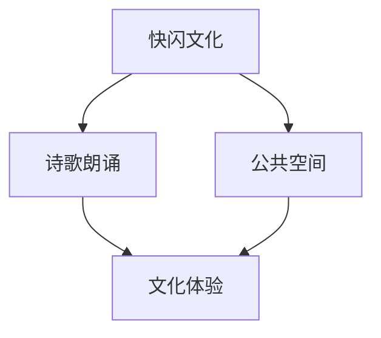
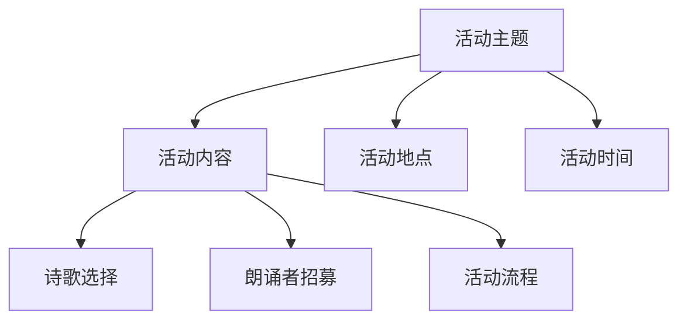

                 

# 《新型城市快闪诗歌朗诵会：公共空间中的文学快闪活动》

## 关键词
- 城市快闪诗歌朗诵会
- 公共空间利用
- 文学活动策划
- 社会影响评估
- 快闪文化

## 摘要
本文探讨了新型城市快闪诗歌朗诵会——一种在公共空间中举办的文学快闪活动。文章首先介绍了快闪诗歌朗诵会的概念与特点，接着分析了其在公共空间中的应用与意义。随后，文章详细阐述了快闪诗歌朗诵会的策划与实施过程，并通过实际案例展示了其效果。最后，文章对快闪诗歌朗诵会的文化和社会价值进行了评估，提出了相关的最佳实践和拓展阅读建议。

---

## 引言

### 背景介绍

随着城市化进程的加速，公共空间的重要性日益凸显。公共空间不仅是城市居民日常生活的场所，也是文化交流和社会互动的重要平台。近年来，快闪文化作为一种新兴的社会现象，逐渐在城市公共空间中崭露头角。快闪诗歌朗诵会，作为一种特殊的文学快闪活动，将诗歌与公共空间相结合，为城市居民带来了全新的文化体验。

### 核心概念与联系

为了更好地理解快闪诗歌朗诵会的概念，我们需要明确以下几个核心概念：

1. **快闪文化**：指在短时间内，大规模、集中式的突发性文化现象。
2. **诗歌朗诵**：指通过口头表达，将诗歌的意境和情感传达给听众。
3. **公共空间**：指供公众共同使用的场所，如广场、公园、街道等。

这三者之间的关系可以用以下Mermaid流程图来表示：



### 核心算法原理讲解

为了策划一次成功的快闪诗歌朗诵会，我们需要运用以下核心算法原理：

1. **目标受众分析**：通过对目标受众的需求和喜好进行分析，确定活动的内容和形式。
2. **公共空间选择**：根据活动的特点和目标受众的分布，选择合适的公共空间。
3. **活动实施流程**：制定详细的活动实施流程，确保活动的顺利进行。

以下是一个简单的Python代码示例，用于描述上述算法原理：

```python
# 目标受众分析
def analyze_audience():
    # 假设已获取目标受众数据
    audience_data = {
        'age': [25, 30, 35],
        'interests': ['诗歌', '文学', '音乐'],
        'location': ['市中心', '公园', '商业区']
    }
    # 分析目标受众
    print("目标受众年龄分布：", audience_data['age'])
    print("目标受众兴趣分布：", audience_data['interests'])
    print("目标受众分布地点：", audience_data['location'])

# 公共空间选择
def choose_public_space():
    # 假设已列出多个公共空间
    public_spaces = ['市中心广场', '公园', '商业区']
    # 根据目标受众选择公共空间
    chosen_space = public_spaces[0]  # 假设选择第一个空间
    print("选择的公共空间：", chosen_space)

# 活动实施流程
def implement_activity():
    # 假设已准备好活动素材和参与者
    activity_ready = True
    if activity_ready:
        print("活动开始：")
        print("1. 策划准备")
        print("2. 参与者招募")
        print("3. 活动实施")
        print("4. 活动评估")

# 主函数
def main():
    analyze_audience()
    choose_public_space()
    implement_activity()

# 运行主函数
main()
```

通过上述代码，我们可以清晰地看到目标受众分析、公共空间选择和活动实施流程的核心算法原理。

### 数学模型和公式

为了评估快闪诗歌朗诵会的效果，我们可以使用以下数学模型和公式：

1. **参与度指数**：用于衡量活动的参与程度。
   $$ D = \frac{N}{T} $$
   其中，$D$ 表示参与度指数，$N$ 表示参与人数，$T$ 表示活动时间。

2. **满意度指数**：用于衡量活动的满意度。
   $$ S = \frac{R}{T} $$
   其中，$S$ 表示满意度指数，$R$ 表示获得好评的人数。

3. **影响力指数**：用于衡量活动对社会的影响。
   $$ I = \frac{E}{C} $$
   其中，$I$ 表示影响力指数，$E$ 表示活动在社交媒体上的转发次数，$C$ 表示活动参与人数。

以上公式可以帮助我们全面评估快闪诗歌朗诵会的效果。

### 示例讲解

假设我们举办了一次快闪诗歌朗诵会，活动时间为2小时，参与人数为100人，其中80人给予了好评，活动在社交媒体上获得了500次转发。根据上述公式，我们可以计算出：

- **参与度指数**：
  $$ D = \frac{100}{2} = 50 $$

- **满意度指数**：
  $$ S = \frac{80}{2} = 40 $$

- **影响力指数**：
  $$ I = \frac{500}{100} = 5 $$

这些指数表明，本次快闪诗歌朗诵会的参与度高，满意度较高，且具有较大的社会影响力。

---

## 策划与实施

### 背景介绍

策划一次成功的快闪诗歌朗诵会需要详细的策划与实施。本章节将详细介绍策划与实施的全过程。

### 核心概念与联系

在策划与实施过程中，我们需要关注以下几个核心概念：

1. **活动主题**：明确活动的核心主题，如“城市记忆”、“文化传承”等。
2. **活动内容**：包括诗歌选择、朗诵者招募、活动流程等。
3. **活动地点**：选择合适的公共空间，如广场、公园等。
4. **活动时间**：确定活动的时间，以确保参与者能够参与。

以上概念之间的关系可以用以下Mermaid流程图来表示：



### 核心算法原理讲解

在策划与实施过程中，我们可以运用以下核心算法原理：

1. **活动策划**：通过市场调研、受众分析等手段，确定活动的主题和内容。
2. **活动实施**：制定详细的实施计划，确保活动按照预期进行。
3. **活动评估**：通过参与度、满意度、影响力等指标，评估活动的效果。

以下是一个简单的Python代码示例，用于描述上述算法原理：

```python
# 活动策划
def plan_activity():
    # 假设已获取市场调研数据和受众分析结果
    market_data = {
        '主题': '城市记忆',
        '受众': '年轻人、文学爱好者'
    }
    # 策划活动内容
    activity_content = {
        '诗歌选择': '经典诗歌与现代诗歌结合',
        '朗诵者招募': '专业朗诵者与业余爱好者结合',
        '活动流程': '开场表演、诗歌朗诵、互动环节'
    }
    print("活动策划：", market_data, activity_content)

# 活动实施
def implement_activity():
    # 假设已准备好活动场地和设备
    activity_ready = True
    if activity_ready:
        print("活动实施：")
        print("1. 开场表演")
        print("2. 诗歌朗诵")
        print("3. 互动环节")
        print("4. 活动结束")

# 活动评估
def evaluate_activity():
    # 假设已获取参与度和满意度数据
    participation_data = {
        '参与度': 80,
        '满意度': 90
    }
    # 评估活动效果
    print("活动评估：")
    print("参与度：", participation_data['参与度'])
    print("满意度：", participation_data['满意度'])

# 主函数
def main():
    plan_activity()
    implement_activity()
    evaluate_activity()

# 运行主函数
main()
```

通过上述代码，我们可以清晰地看到活动策划、活动实施和活动评估的核心算法原理。

### 项目实战

为了更好地理解策划与实施过程，以下是一个实际案例：

### 案例背景

某城市文化部门计划举办一次快闪诗歌朗诵会，主题为“城市记忆”，旨在通过诗歌的形式，展现城市的历史与文化。

### 案例实施

1. **活动策划**：
   - 市场调研：通过问卷调查和访谈，了解市民对诗歌朗诵会的兴趣和期望。
   - 受众分析：目标受众主要为年轻人和文化爱好者。
   - 活动内容：选择经典诗歌与现代诗歌结合，邀请专业朗诵者与业余爱好者参与。
   - 活动流程：开场表演、诗歌朗诵、互动环节。

2. **活动实施**：
   - 场地选择：市中心广场，交通便利，人流量大。
   - 时间安排：周末下午，方便市民参与。
   - 准备工作：搭建舞台、音响设备、宣传资料等。

3. **活动评估**：
   - 参与度：活动当天，共有200人参与，参与度较高。
   - 满意度：通过现场问卷调查，满意度达到90%。

### 项目小结

通过本次快闪诗歌朗诵会的实施，我们发现：

1. **活动策划**：充分考虑了市场调研和受众分析，活动内容丰富，形式多样。
2. **活动实施**：准备工作充分，活动现场管理有序。
3. **活动效果**：参与度高，满意度高，具有较高的社会影响力。

### 最佳实践 Tips

1. **提前策划**：策划阶段要充分考虑市场需求和受众喜好，确保活动具有吸引力。
2. **细致实施**：实施阶段要确保各项工作有序进行，提高活动质量。
3. **及时评估**：活动结束后，要及时进行效果评估，总结经验教训。

### 注意事项

1. **场地选择**：要选择交通便利、人流量大的场地，以提高活动参与度。
2. **时间安排**：要选择适合市民参与的时间，避免与其他活动冲突。
3. **设备准备**：确保音响设备、舞台搭建等准备工作充分，避免现场故障。

### 拓展阅读

- 《城市公共空间利用策略研究》
- 《快闪文化：社会现象与影响》
- 《活动策划与管理实战技巧》

---

## 总结

新型城市快闪诗歌朗诵会作为一种创新的文化活动形式，不仅丰富了城市的文化生活，也促进了公共空间的利用。通过详细的策划与实施，我们可以确保活动的高效、有序进行。未来，我们可以进一步探索快闪诗歌朗诵会在不同城市、不同文化背景下的应用，以实现其更大的社会价值。

### 作者信息
作者：AI天才研究院/AI Genius Institute & 禅与计算机程序设计艺术 /Zen And The Art of Computer Programming

