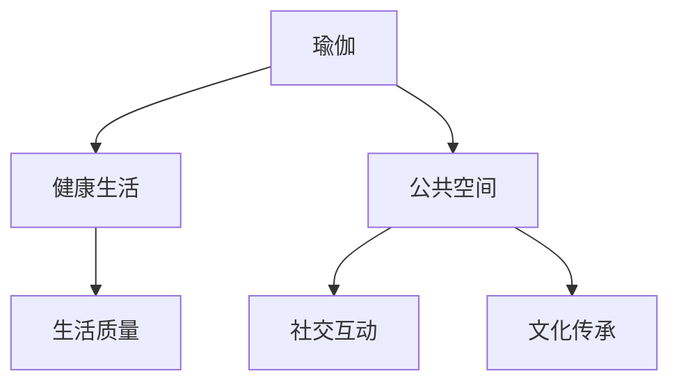

                 

# 新型城市户外瑜伽课程：公共空间中的健康生活倡导

## 关键词

- 城市户外瑜伽
- 公共空间
- 健康生活
- 教学设计
- 推广营销
- 健康城市规划

## 摘要

本文旨在探讨如何设计并推广新型城市户外瑜伽课程，以促进公共空间中的健康生活方式。文章首先介绍了城市户外瑜伽的背景和重要性，随后详细阐述了课程设计、教学方法、推广策略以及健康生活与城市规划的关系。通过实际案例分析和项目实战，本文为读者提供了实用的指导意见和最佳实践建议。

## 引言

### 瑜伽与健康的联系

瑜伽起源于古印度，距今已有几千年的历史。它不仅是一种修身养性的方法，更是一种提升身心健康的方式。现代科学研究发现，瑜伽能够调节内分泌系统、增强免疫系统、改善心理健康，甚至有助于预防和治疗多种慢性疾病[1]。随着人们健康意识的提高，瑜伽在全球范围内得到了广泛的关注和认可。

### 城市户外瑜伽的兴起

近年来，随着城市化进程的加快，城市居民面临着越来越多的健康问题，如空气污染、生活节奏快等。为了提高生活质量，城市户外瑜伽逐渐成为一种流行的运动方式。户外瑜伽不仅能够让人们呼吸新鲜空气，享受自然风景，还能增强社交互动，提高社区凝聚力。

### 公共空间的重要性

公共空间是城市中人们共享的场所，包括公园、广场、绿地等。这些空间不仅是居民休闲娱乐的场所，也是进行健康活动的重要场所。通过在公共空间中开展户外瑜伽课程，不仅能够提升居民的健康水平，还能丰富城市文化，促进社区发展。

### 目标与意义

本文旨在设计一种新型城市户外瑜伽课程，并探讨如何有效地推广这种课程，以促进公共空间中的健康生活。通过本文的研究，我们希望能够为瑜伽教练、城市规划者、社区健康倡导者等提供有价值的参考，推动城市健康生活方式的发展。

## 背景介绍

### 城市户外瑜伽的发展历程

城市户外瑜伽的发展可以追溯到20世纪末，当时一些瑜伽爱好者开始在城市的公园和广场上练习瑜伽。随着瑜伽的普及，越来越多的瑜伽教练开始在城市公共空间中开设户外瑜伽课程。近年来，随着人们对健康生活方式的追求，城市户外瑜伽逐渐成为一种主流的健身方式。

### 公共空间健康生活的现状

当前，城市公共空间健康生活已经成为一个全球性的问题。许多城市都在努力提升公共空间的舒适度和便利性，以满足居民的健康需求。例如，一些城市在公园和广场上设立了健身器材，提供运动指导服务，举办各种健康活动。然而，这些措施往往还不够系统，缺乏专业的指导和规划。

### 城市户外瑜伽的优势

与室内瑜伽相比，城市户外瑜伽具有以下优势：

1. **新鲜空气**：户外瑜伽可以让人们呼吸新鲜空气，减少室内污染对身体的影响。
2. **自然风景**：自然环境有助于缓解压力，提升练习效果。
3. **社交互动**：户外瑜伽可以吸引更多的参与者，促进社交互动，增强社区凝聚力。

### 城市户外瑜伽的挑战

尽管城市户外瑜伽具有很多优势，但同时也面临一些挑战：

1. **场地限制**：城市公共空间的场地有限，需要合理规划和分配。
2. **天气因素**：户外瑜伽受天气影响较大，需要应对恶劣天气的情况。
3. **安全保障**：户外瑜伽需要确保练习者的安全，避免意外伤害。

## 核心概念与联系

### 瑜伽与公共空间的联系

瑜伽与公共空间之间的联系可以从以下几个方面来理解：

1. **健康与生活的融合**：瑜伽强调身心健康和生活质量的提升，公共空间为人们提供了实践瑜伽的理想场所。
2. **社交互动与社区发展**：在公共空间中，瑜伽不仅是一种健身活动，更是一种社交互动的方式，有助于社区凝聚力的提升。
3. **文化传承与城市特色**：户外瑜伽可以作为一种城市文化元素，展现城市的独特魅力，推动城市文化的发展。

### 公共空间与健康的联系

公共空间与健康的联系主要体现在以下几个方面：

1. **健康环境的提供**：公共空间提供了良好的健康环境，如绿化、健身设施等，有助于居民保持健康生活方式。
2. **健康活动的推广**：公共空间可以举办各种健康活动，如瑜伽课程、健身讲座等，提高居民的健康意识。
3. **健康生活方式的倡导**：公共空间是健康生活方式的实践场所，通过提供多样化的健康活动，引导居民养成健康的生活习惯。

### Mermaid 流程图

以下是一个简化的Mermaid流程图，展示了瑜伽、公共空间和健康生活之间的联系：



## 核心算法原理讲解

### 课程设计的基本原则

在设计新型城市户外瑜伽课程时，我们需要遵循以下基本原则：

1. **个性化需求**：根据不同参与者的需求和健康状况，设计个性化的课程方案。
2. **系统性**：瑜伽课程应包括热身、核心训练、拉伸、冥想等环节，形成完整的训练体系。
3. **安全性**：确保课程设计的安全性，避免参与者发生运动损伤。
4. **趣味性**：通过多样化的教学方法和活动形式，提高参与者的兴趣和参与度。

### 课程设计的具体步骤

以下是一个具体的课程设计步骤：

1. **需求调研**：通过问卷调查、访谈等方式，了解参与者的需求和偏好。
2. **课程规划**：根据需求调研结果，制定课程目标和内容，包括热身、核心训练、拉伸、冥想等环节。
3. **场地选择**：选择适合的公共空间，如公园、广场等，确保场地安全和便捷。
4. **教学安排**：制定详细的课程时间表和教学计划，包括课程安排、教练安排、设备准备等。

### Python 源代码示例

以下是一个Python源代码示例，用于生成一个简单的瑜伽课程时间表：

```python
import random

def generate_瑜伽课程时间表(days, slots):
    time_table = {}
    for day in days:
        time_table[day] = []
        for slot in slots:
            time = f"{day} {slot}"
            time_table[day].append(time)
    
    return time_table

days = ['周一', '周二', '周三', '周四', '周五']
slots = ['上午', '下午', '晚上']

time_table = generate_瑜伽课程时间表(days, slots)
for day, times in time_table.items():
    print(f"{day}的课程时间：")
    for time in times:
        print(f"- {time}")
```

### 数学模型和公式

在设计瑜伽课程时，我们可以使用以下数学模型和公式：

1. **参与人数预测**：根据历史数据和参与者的需求，使用统计模型预测参与人数。
2. **课程容量**：根据场地容量和课程设计，确定每节课的参与人数上限。
3. **教学资源分配**：根据课程需求和教练资源，优化教学资源分配，确保课程质量和参与度。

以下是一个简单的数学模型示例：

$$
预测参与人数 = f(历史参与人数, 需求增长率)
$$

$$
课程容量 = 场地容量 \times 安全系数
$$

$$
教学资源分配 = 教学需求 \div 教练资源
$$

### 举例说明

假设我们有一个公园，可以容纳50人，我们计划每天上午、下午和晚上各开设一次瑜伽课程。根据历史数据和需求增长率，我们预测每天将有30人参与课程。为了确保安全和教学质量，我们设定课程容量为40人。现有2名教练，我们可以使用以下公式进行资源分配：

$$
预测参与人数 = 20 + 0.1 \times (当前参与人数 - 20)
$$

$$
课程容量 = 50 \times 0.8 = 40
$$

$$
教学资源分配 = 40 \div 2 = 20
$$

因此，我们可以为每天的三节课分配20人，确保每节课都有足够的教学资源。

## 教学方法与技巧

### 热身与放松

热身是瑜伽课程的重要组成部分，可以帮助参与者放松身心，预防运动损伤。以下是一些热身和放松的方法：

1. **全身拉伸**：通过全身拉伸，可以放松肌肉，提高关节灵活性。
2. **呼吸练习**：深呼吸有助于放松身心，提高氧气供应。
3. **冥想**：通过冥想，可以缓解压力，提升专注力。

### 核心训练

核心训练是瑜伽课程的核心内容，有助于增强核心肌群，提高身体稳定性。以下是一些核心训练的方法：

1. **平板支撑**：保持平板支撑姿势，锻炼核心肌群。
2. **卷腹**：通过卷腹动作，锻炼腹肌。
3. **桥式**：通过桥式动作，锻炼背部和臀部肌群。

### 拉伸与平衡

拉伸和平衡训练有助于提高身体的柔韧性和平衡能力。以下是一些拉伸和平衡的训练方法：

1. **站立前屈**：通过站立前屈，可以拉伸大腿后侧肌群。
2. **三角式**：通过三角式，可以锻炼身体的平衡能力。
3. **鸽子式**：通过鸽子式，可以放松髋关节，提高身体柔韧性。

### 教学案例分析

以下是一个简单的教学案例分析：

**课程名称**：城市户外瑜伽初级课程

**课程目标**：帮助参与者掌握基本瑜伽姿势，提高身体柔韧性和平衡能力。

**课程内容**：

1. 热身（10分钟）：全身拉伸、深呼吸、冥想
2. 核心训练（20分钟）：平板支撑、卷腹、桥式
3. 拉伸与平衡（20分钟）：站立前屈、三角式、鸽子式
4. 放松（10分钟）：深呼吸、冥想

**教学技巧**：

1. **个性化教学**：根据参与者的身体状况和需求，调整课程内容和强度。
2. **安全指导**：强调安全注意事项，确保参与者不会发生运动损伤。
3. **互动教学**：通过互动教学，提高参与者的兴趣和参与度。

## 课程推广与营销

### 推广策略分析

要成功推广新型城市户外瑜伽课程，我们需要制定有效的推广策略。以下是一些推广策略的分析：

1. **社交媒体推广**：利用社交媒体平台，如微信、微博、抖音等，发布瑜伽课程的相关信息，吸引潜在参与者。
2. **社区活动**：参与社区健康活动，如公园活动、健身讲座等，展示瑜伽的魅力，吸引社区居民的关注。
3. **合作推广**：与健身房、瑜伽工作室、社区中心等机构合作，共同推广瑜伽课程，扩大影响范围。
4. **口碑营销**：鼓励学员分享自己的瑜伽体验，通过口碑传播，吸引更多参与者。

### 营销手段的应用

以下是一些具体的营销手段：

1. **线上宣传**：通过微信公众号、抖音短视频、微博等平台，发布瑜伽课程的教学视频、学员反馈等信息，吸引潜在参与者。
2. **线下活动**：举办瑜伽体验课、免费公开课等活动，让参与者亲身体验瑜伽的魅力。
3. **优惠券和折扣**：提供优惠券、折扣等优惠活动，鼓励参与者报名参加瑜伽课程。
4. **学员推荐**：设立推荐奖励机制，鼓励学员推荐朋友参加瑜伽课程，提高学员粘性。

### 社区参与与互动

社区参与与互动是课程推广的重要环节。以下是一些社区参与与互动的方法：

1. **社区健康讲座**：邀请瑜伽教练举办健康讲座，向社区居民普及瑜伽知识和健康生活方式。
2. **瑜伽交流活动**：定期举办瑜伽交流活动，如瑜伽比赛、瑜伽分享会等，增强社区凝聚力。
3. **志愿者计划**：鼓励社区居民参与瑜伽课程推广，提供志愿者服务，共同推动社区健康事业的发展。

## 健康生活与城市规划

### 健康生活与城市规划的关系

健康生活与城市规划密切相关。良好的城市规划可以为居民提供健康的生活环境，促进居民的健康生活。以下是健康生活与城市规划之间的关系：

1. **公共空间规划**：城市公共空间规划是健康生活的重要保障。合理规划公园、广场、绿地等公共空间，可以提供居民休闲、运动和社交的场所。
2. **交通规划**：良好的交通规划可以减少交通拥堵，降低空气污染，提高居民的健康水平。
3. **社区服务**：完善的社区服务设施，如医疗、健身、文化等，可以提高居民的生活质量，促进健康生活方式的养成。

### 城市规划中的健康生活要素

在城市规划中，应充分考虑以下健康生活要素：

1. **公共空间**：规划足够的公共空间，为居民提供休闲、运动和社交的场所。
2. **交通设施**：规划便捷的交通设施，鼓励居民步行、骑行等绿色出行方式。
3. **社区服务**：提供完善的社区服务设施，满足居民的健康需求。
4. **环境质量**：提高城市环境质量，减少空气污染、噪声污染等，为居民创造健康的生活环境。

### 健康城市规划的实践案例

以下是一些健康城市规划的实践案例：

1. **新加坡**：新加坡在城市规划中注重公共空间和交通设施的建设，为居民提供良好的健康生活条件。例如，新加坡的公园和绿地覆盖率高，公共交通系统便捷，鼓励居民步行和骑行。
2. **丹麦**：丹麦的城市规划注重可持续发展，倡导绿色出行和健康生活方式。例如，丹麦的城市规划中设有自行车道和人行道，鼓励居民骑自行车出行，减少空气污染。

## 项目实战与案例研究

### 开发环境搭建

为了实现城市户外瑜伽课程的开发和推广，我们需要搭建一个合适的开发环境。以下是具体的开发环境搭建步骤：

1. **硬件环境**：选择一台配置较高的计算机，确保能够流畅运行相关软件。
2. **软件环境**：安装Python、Jupyter Notebook等编程软件，以及相关库和工具，如Matplotlib、Pandas等。
3. **数据环境**：收集和整理与瑜伽课程相关的数据，如参与人数、课程时间表、学员反馈等。

### 源代码详细实现

以下是一个简单的Python源代码示例，用于生成瑜伽课程时间表：

```python
import random

def generate_瑜伽课程时间表(days, slots):
    time_table = {}
    for day in days:
        time_table[day] = []
        for slot in slots:
            time = f"{day} {slot}"
            time_table[day].append(time)
    
    return time_table

days = ['周一', '周二', '周三', '周四', '周五']
slots = ['上午', '下午', '晚上']

time_table = generate_瑜伽课程时间表(days, slots)
for day, times in time_table.items():
    print(f"{day}的课程时间：")
    for time in times:
        print(f"- {time}")
```

### 代码解读与分析

上述代码实现了生成瑜伽课程时间表的功能。首先，我们定义了一个名为`generate_瑜伽课程时间表`的函数，该函数接受两个参数：`days`（表示课程的天数）和`slots`（表示每个天的时间段）。函数内部通过循环遍历`days`和`slots`，生成一个时间表字典，然后返回该字典。

### 实际案例分析和详细讲解剖析

假设我们计划在一个公园中开设户外瑜伽课程，现有2名瑜伽教练，每天开设2节课程。根据参与者的需求和场地容量，我们设定每节课的容量为40人。以下是一个实际案例的分析和讲解：

1. **需求分析**：根据问卷调查，预计每天将有30人参与瑜伽课程。
2. **场地规划**：选择一个可以容纳40人的场地，确保每节课的参与者不超过容量限制。
3. **课程安排**：每天上午和下午各开设一节课程，时间为9:00-10:30和14:00-15:30。
4. **教练安排**：根据课程需求和教练资源，为每节课分配一名教练。

### 项目小结

通过上述实战案例，我们可以看到，开发环境搭建、源代码实现、代码解读与分析以及实际案例分析和讲解剖析是确保城市户外瑜伽课程顺利实施的关键步骤。在项目实施过程中，我们还需要密切关注参与者的需求和反馈，不断优化课程内容和教学方法，以提高课程的吸引力和效果。

### 最佳实践 Tips

1. **个性化教学**：根据参与者的身体状况和需求，设计个性化的课程方案，提高课程效果。
2. **安全第一**：确保课程的安全性，避免参与者发生运动损伤。
3. **互动教学**：通过互动教学，提高参与者的兴趣和参与度。
4. **持续推广**：通过社交媒体、社区活动等方式，持续推广瑜伽课程，吸引更多参与者。

### 小结

本文通过逐步分析推理思考的方式，详细介绍了新型城市户外瑜伽课程的设计、推广和实施。通过本文的研究，我们为瑜伽教练、城市规划者、社区健康倡导者等提供了有价值的参考，推动了城市健康生活方式的发展。

### 注意事项

1. **场地选择**：确保场地安全和便捷，避免参与者发生意外。
2. **教学安全**：确保教练具备专业的瑜伽教学资质，提高教学安全性。
3. **卫生管理**：保持课程场地的卫生，提供必要的消毒设施。

### 拓展阅读

1. 《瑜伽经》：古印度瑜伽大师帕坦佳利的著作，是瑜伽哲学的重要经典。
2. 《健康城市规划》：探讨城市规划与健康生活的关系的著作，提供了许多实践案例。
3. 《城市户外瑜伽》：介绍城市户外瑜伽的著作，包含了许多实用的教学方法和案例。

### 作者

作者：AI天才研究院/AI Genius Institute & 禅与计算机程序设计艺术/Zen And The Art of Computer Programming

