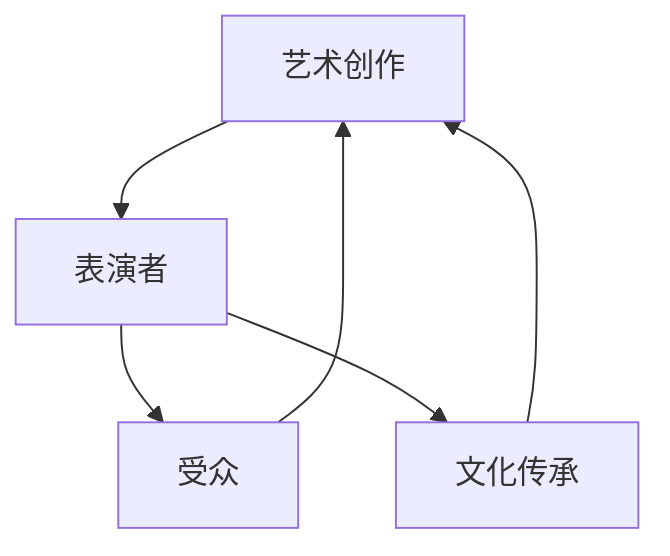

                 

### 《新型城市社区剧场：草根艺术表演的复兴》

> 关键词：新型城市社区剧场、草根艺术表演、文化复兴、社区参与、艺术创新

> 摘要：本文探讨了新型城市社区剧场中草根艺术表演的复兴现象。通过分析草根艺术表演的历史与现状，探讨其在社区剧场中的角色和重要性，本文提出了构建新型城市社区剧场的方法，并分享了草根艺术表演者的培养与实践经验。最后，对草根艺术表演与社区剧场未来的发展趋势进行了展望。

## 引言与概述

在快速城市化的背景下，新型城市社区剧场作为一种文化复兴的载体，正日益受到广泛关注。草根艺术表演，作为城市文化的重要组成部分，不仅是社区文化多样性的体现，也是社区居民情感交流和社会整合的重要途径。本文旨在探讨新型城市社区剧场中草根艺术表演的复兴现象，分析其历史与现状，探讨其在社区剧场中的角色和重要性，并提出构建新型城市社区剧场的方法。

草根艺术表演通常指的是非专业或非职业的艺术创作和表演活动，这些活动往往源于民间传统，反映了普通居民的生活经验和文化价值观。随着城市化的进程，草根艺术表演逐渐被边缘化，但在新型城市社区剧场中，它们正重新获得关注和重视。

社区剧场则是指在城市社区内建立和运营的剧场，旨在为社区居民提供文化娱乐和社交互动的场所。社区剧场不仅提供了表演空间，也成为了社区文化建设和社区参与的载体。在社区剧场中，草根艺术表演作为一种重要的艺术形式，承担着促进社区文化多样性和增强社区凝聚力的角色。

本文将分为以下几个部分进行探讨：

1. **草根艺术表演的定义与意义**：明确草根艺术表演的核心概念，阐述其在城市文化中的地位和作用。
2. **社区剧场的历史与现状**：回顾社区剧场的发展历程，分析其现状和面临的挑战。
3. **新型城市社区剧场的发展趋势**：探讨新型城市社区剧场的发展路径和特点。
4. **草根艺术表演在社区剧场中的角色**：分析草根艺术表演在社区剧场中的意义和作用。
5. **新型城市社区剧场的构建与实践**：提出构建新型城市社区剧场的具体方法和实践案例。
6. **草根艺术表演者的培养与成长**：探讨草根艺术表演者的培养体系和发展路径。
7. **案例研究与实践经验分享**：分享草根艺术表演与社区剧场成功的实践案例和经验。
8. **结论与展望**：总结草根艺术表演复兴对新型城市社区剧场的影响，并对未来发展趋势进行展望。

通过上述分析，本文旨在为新型城市社区剧场中草根艺术表演的复兴提供理论支持和实践指导。

### 草根艺术表演的定义与意义

草根艺术表演，通常指的是非职业或非专业群体的艺术创作和表演活动。这些表演者没有接受过正规的艺术训练，其艺术创作和表演源于对生活的直接体验和情感表达。草根艺术表演的形式多样，包括民间音乐、戏曲、舞蹈、戏剧、杂技等，它们往往具有浓厚的地域特色和民俗风情，是民间文化的重要组成部分。

草根艺术表演的核心概念可以概括为三个方面：即艺术创作、表演者和受众。首先，艺术创作是草根艺术表演的基础，它反映了表演者的生活经验和情感表达。这些艺术作品通常没有经过复杂的艺术加工，更加自然、质朴，因此更具有真实性和感染力。其次，表演者是草根艺术表演的主体，他们通过艺术表演传达自己的情感和价值观，同时也是社区文化的传承者和传播者。最后，受众是草根艺术表演的重要参与者，他们不仅是表演的观众，也是文化体验的共享者。通过观看和参与草根艺术表演，受众可以更好地理解和感受社区文化的内涵。

为了更直观地理解草根艺术表演的核心概念，我们可以使用Mermaid流程图来展示其基本架构：

在上图中，艺术创作是整个草根艺术表演的起点，表演者通过创作和表演将文化传承给受众，同时受众的反馈和参与又进一步丰富了艺术创作的内容。这种互动关系构成了草根艺术表演的基本框架。

草根艺术表演在社区文化中的地位和作用不可忽视。首先，它是社区文化多样性的体现。草根艺术表演形式多样，反映了不同地域、不同民族的文化特色，丰富了城市文化的内涵。其次，它是社区文化认同的重要载体。草根艺术表演通过展现社区居民的生活经验和情感表达，增强了社区成员的文化认同感和归属感。最后，它是社区文化活力的重要标志。草根艺术表演的活跃度反映了社区文化的繁荣程度，也预示着社区文化的发展潜力。

总之，草根艺术表演作为一种重要的文化形式，不仅丰富了城市文化的多样性，也增强了社区文化的凝聚力和活力。通过明确其核心概念和基本架构，我们可以更好地理解草根艺术表演在社区文化中的地位和作用。

### 社区剧场的历史与现状

社区剧场作为一种文化载体，其发展历程可以追溯到19世纪末的西方国家。当时，随着工业革命的推进和城市化进程的加速，城市居民的生活质量逐渐提高，对文化娱乐的需求也随之增加。在这样的背景下，社区剧场应运而生。最早的社区剧场通常是由居民自发组织，利用公共设施如学校或教堂的礼堂进行演出，目的是为社区居民提供一种文化娱乐活动，同时增强社区凝聚力。

进入20世纪，社区剧场的发展迎来了一个重要的阶段。许多国家和地区开始建立正式的社区剧场，将其视为社区文化建设的重要组成部分。例如，美国的“社区剧场运动”（Community Theatre Movement）在20世纪30年代兴起，推动了社区剧场在全国范围内的普及和发展。在英国，社区剧场也得到了政府和社会各界的广泛支持，许多社区剧场成为文化教育和社区参与的重要场所。

在社区剧场的发展历程中，不同国家和地区根据自身的文化背景和社会需求，形成了具有特色的社区剧场模式。例如，美国的社区剧场注重商业化运作，鼓励社区居民参与剧本创作、表演和制作过程；而英国的社区剧场则更加注重文化教育和社会参与，强调社区居民的自主性和参与感。这种多元化的模式为社区剧场的持续发展提供了丰富的经验和借鉴。

然而，随着现代社会的发展，社区剧场也面临着一些挑战。首先，城市化的加速和人口流动的加剧，使得社区剧场的受众群体发生了变化。许多年轻人更倾向于选择更加便捷和现代化的娱乐方式，对传统社区剧场的需求有所下降。其次，社区剧场在资金和资源方面也存在一定的困难。由于社区剧场通常由非营利组织或志愿者运营，资金和资源的不足限制了其发展规模和水平。最后，社区剧场的可持续性问题也备受关注。如何在保证文化传承和社区参与的同时，实现剧场的长期稳定运营，是社区剧场管理者需要认真思考的问题。

尽管面临挑战，社区剧场依然具有巨大的发展潜力。首先，随着人们对文化需求和社区参与意识的提升，社区剧场有望迎来新的发展机遇。其次，通过引入新技术和新模式，如数字媒体和线上演出，社区剧场可以更好地适应现代社会的需求，吸引更多的观众参与。此外，政府和社会各界的支持也是社区剧场持续发展的重要保障。

社区剧场在不同地区的发展情况也有所不同。以中国为例，近年来，社区剧场在城市化进程中得到了快速的发展。许多城市建立了社区文化活动中心，为社区居民提供表演和创作空间。同时，政府也通过政策支持和文化项目推动，鼓励社区剧场的发展。然而，由于地域差异和文化背景的不同，社区剧场在中国的发展还存在不平衡现象。一些经济发达地区的社区剧场发展较为成熟，而一些经济欠发达地区的社区剧场则面临更多挑战。

总之，社区剧场作为一种重要的文化形式，其历史与现状反映了城市文化发展的脉络和趋势。在面临挑战的同时，社区剧场也拥有巨大的发展潜力。通过不断创新和发展，社区剧场将在未来继续发挥其在社区文化建设和社区参与中的重要作用。

### 新型城市社区剧场的发展趋势

新型城市社区剧场的发展趋势体现在多个方面，主要包括技术进步、社会变迁和文化复兴等。这些趋势不仅影响了社区剧场的形式和内容，也为其未来发展提供了新的机遇和挑战。

首先，技术进步是推动新型城市社区剧场发展的关键因素之一。随着数字媒体和互联网技术的普及，社区剧场开始探索线上演出的可能性。例如，通过直播平台和社交媒体，社区剧场可以突破地理限制，将演出传播到更广泛的受众群体。此外，虚拟现实（VR）和增强现实（AR）技术的应用也为社区剧场带来了全新的体验方式。观众可以通过VR设备沉浸式地体验演出，感受到前所未有的互动和参与感。这些技术的进步不仅提高了社区剧场的传播效果，也为其创新和发展提供了新的思路。

其次，社会变迁对新型城市社区剧场的发展产生了深远的影响。城市化进程的加速和人口流动的加剧，使得社区居民的结构和需求发生了变化。年轻一代更倾向于参与多样化的文化活动，这为社区剧场提供了新的受众群体。同时，社会对文化多样性和社区参与的重视，也为社区剧场的发展提供了良好的社会环境。社区剧场开始更加注重与社区居民的互动和参与，通过多样化的表演形式和内容，满足不同群体的文化需求。

最后，文化复兴是新型城市社区剧场发展的核心驱动力。在全球化背景下，传统文化面临着传承和发展的挑战。新型城市社区剧场通过挖掘和传承本地文化，推动了文化复兴。例如，一些社区剧场将传统戏曲、舞蹈和音乐等艺术形式融入现代创作，使传统文化在新的时代背景下焕发出新的生命力。同时，社区剧场也通过举办文化展览、讲座和工作坊等活动，促进社区居民对本地文化的认识和认同，增强了社区的文化凝聚力。

具体来说，新型城市社区剧场的发展趋势包括：

1. **数字化与智能化**：通过数字化技术和智能化设备，提高社区剧场的运营效率和服务质量。例如，利用数据分析技术优化演出排期和宣传策略，利用智能音响和灯光系统提升观众的观影体验。
2. **社区参与与互动**：鼓励社区居民积极参与剧场的演出、制作和运营过程，增强社区归属感和参与感。例如，通过社区论坛、在线投票和互动游戏等形式，增加观众与剧场的互动。
3. **文化传承与创新**：在传承本地文化的基础上，通过创新表演形式和内容，满足现代观众的多元化需求。例如，将传统文化元素与现代艺术形式结合，创作出具有时代特色的新剧目。
4. **跨界合作与资源共享**：与其他文化机构、教育机构和公益组织合作，实现资源共享和优势互补，共同推动社区文化的发展。

总之，新型城市社区剧场的发展趋势反映了城市文化发展的新动向。通过技术进步、社会变迁和文化复兴，社区剧场将在未来继续发挥其在社区文化建设、文化传承和社会整合中的重要作用。

### 草根艺术表演的历史与现状

草根艺术表演作为一种源于民间的艺术形式，其历史可以追溯到古代社会的各种民俗活动。在古代，草根艺术表演主要表现为民间音乐、舞蹈、戏剧等形式，这些艺术形式不仅是人们日常生活的娱乐活动，更是文化传承和社会交流的重要载体。随着历史的发展，草根艺术表演逐渐形成了独特的文化风格和地域特色，成为各个民族文化的重要组成部分。

在中国，草根艺术表演有着悠久的历史。例如，京剧、评剧、豫剧等戏曲形式，都是经过长期演变和发展的草根艺术。这些戏曲形式不仅有着丰富的表演技巧和独特的艺术风格，还蕴含了深厚的文化内涵，反映了中国人民的生活哲学和价值观念。此外，民歌、民间舞蹈、皮影戏等也是草根艺术表演的重要形式，它们通过口头传唱、身体动作和道具展示，生动地传递了民间故事和传统习俗。

然而，随着现代化和城市化的进程，草根艺术表演逐渐面临着挑战。一方面，城市生活的快节奏和现代娱乐方式的多样化，使得草根艺术表演的观众群体逐渐减少。许多年轻人更倾向于选择更加便捷和现代的娱乐方式，如电影、音乐、网络直播等。另一方面，草根艺术表演本身也面临着传承和发展的困境。由于缺乏专业的训练和指导，草根艺术表演者的艺术水平难以得到提升，许多传统艺术形式甚至面临着失传的风险。

在国际上，草根艺术表演也有着广泛的影响。例如，非洲的部落舞蹈、拉丁美洲的民间音乐、印度的古典舞蹈等，都是草根艺术表演的典范。这些艺术形式不仅丰富了各地的文化多样性，也成为了世界各地文化交流的桥梁。然而，与中国的草根艺术表演相似，国际上的草根艺术表演也面临着观众减少和传承困难的挑战。

草根艺术表演的现状可以从以下几个方面进行分析：

1. **生存环境**：随着现代化和城市化的进程，草根艺术表演的生存环境逐渐恶化。许多传统表演场所被拆除或改造，导致草根艺术表演失去了原有的表演空间。此外，由于经济利益的驱动，一些地方政府和企业更倾向于投资高回报的产业，对草根艺术表演的支持和投入减少。

2. **观众群体**：草根艺术表演的观众群体逐渐老龄化，年轻观众较少。这主要是因为现代娱乐方式的多样化，年轻人更倾向于选择流行文化和数字娱乐。此外，草根艺术表演的形式和内容相对单一，难以满足现代观众的多元化需求。

3. **传承与发展**：草根艺术表演的传承和发展面临着巨大挑战。一方面，传统艺术形式缺乏系统的教育和培训体系，许多传统技艺和表演技巧难以得到传承。另一方面，草根艺术表演的市场化程度较低，表演者的经济收入有限，难以吸引年轻一代投身于草根艺术表演。

然而，尽管面临诸多挑战，草根艺术表演依然具有一定的活力。在许多社区和乡村地区，草根艺术表演依然保持着一定的活跃度。一些地方政府和文化机构也开始重视草根艺术表演的传承和发展，通过政策支持和资金投入，为草根艺术表演提供一定的支持和保障。

总的来说，草根艺术表演在历史上有着重要的地位，但在现代社会中面临着诸多挑战。如何传承和发展草根艺术表演，是当前文化领域需要深入探讨和解决的问题。通过加强政策支持、提高市场化程度、培养新一代表演者等方式，草根艺术表演有望在新时代焕发出新的生命力。

### 社区剧场的概念与定义

社区剧场，作为一个特定于城市社区的文化场所，具有其独特的概念和定义。社区剧场是指在城市社区内部设立和运营的剧场，旨在为社区居民提供文化娱乐和社交互动的平台。与传统的专业剧场不同，社区剧场强调的是社区参与和地方文化特色，其运营和管理通常由社区居民或社区组织负责。

社区剧场的概念可以追溯到19世纪末的西方社区文化运动，当时社区剧场被视为社区文化建设的重要组成部分。社区剧场不仅提供了一个表演空间，更成为社区文化活动和社区参与的载体。其主要目的是通过艺术表演和文化活动，增强社区居民的文化认同感和社区凝聚力。

社区剧场的特征主要体现在以下几个方面：

1. **社区参与性**：社区剧场鼓励社区居民的广泛参与，包括剧本创作、演出排练、舞台设计和观众互动等。这种参与性不仅增加了社区居民的归属感，也促进了社区的凝聚力和文化多样性。

2. **文化多样性**：社区剧场通常展示多种形式的艺术表演，包括传统艺术、现代艺术、戏剧、音乐、舞蹈等。这种多样性反映了社区文化的丰富性和多样性，也为社区居民提供了多样化的文化体验。

3. **文化教育功能**：社区剧场不仅是文化娱乐的场所，还承担着文化教育和传承的功能。通过举办各种文化讲座、工作坊和培训课程，社区剧场为社区居民提供了学习和交流的机会，促进了文化的传承和创新。

4. **公共空间属性**：社区剧场通常位于社区中心地带，对公众开放，成为社区公共空间的重要组成部分。这种公共空间属性使得社区剧场不仅服务于特定群体，也服务于更广泛的社会公众。

社区剧场的发展历程可以分为几个阶段。19世纪末至20世纪初，社区剧场在欧洲和北美地区开始兴起，成为社区文化建设的重要组成部分。20世纪中叶，社区剧场在全球范围内得到了进一步的发展，许多国家和地区建立了大量的社区剧场，推动了社区文化的发展。随着城市化进程的加快和人们对社区文化需求的增加，21世纪的社区剧场发展迎来了新的机遇，特别是在数字化和互联网技术的推动下，社区剧场开始探索线上演出和多媒体互动的新模式。

在社区剧场的发展历程中，不同国家和地区形成了各自的特色。例如，美国的社区剧场强调商业化和市场化，许多社区剧场通过票房收入和文化项目推广实现了自主运营。而英国的社区剧场则更注重文化教育和社会参与，通过政府和社会各界的支持，推动了社区剧场的持续发展。

总之，社区剧场作为一种重要的文化形式，其概念和特征反映了社区文化的多样性和活力。通过强调社区参与、文化多样性和公共空间属性，社区剧场不仅为社区居民提供了文化娱乐和社交互动的场所，也成为了社区文化建设和社会整合的重要载体。在未来的发展中，社区剧场将继续发挥其在文化传承和社会发展中的重要作用。

### 社区剧场的发展历程

社区剧场的发展历程可以追溯到19世纪末和20世纪初，这一时期是社区剧场起源和初步发展的阶段。在西方国家，特别是欧美国家，社区剧场作为一种新型的文化形式逐渐兴起。最早的社区剧场往往是由居民自发组织，利用公共设施如学校、教堂的礼堂进行演出。这些演出活动不仅丰富了社区居民的业余生活，也成为了社区文化建设和社区参与的载体。

20世纪中叶，社区剧场进入了一个快速发展的阶段。这个时期，社区剧场得到了政府和社会各界的广泛支持，许多国家和地区纷纷建立了社区剧场。在美国，社区剧场运动在20世纪30年代兴起，推动了社区剧场在全国范围内的普及和发展。社区剧场不仅成为城市居民文化娱乐的重要场所，也成为了社区文化建设和社会参与的重要平台。许多社区剧场通过商业化运作，实现了自主运营和可持续发展。

与此同时，欧洲的社区剧场也在快速发展。以英国为例，社区剧场得到了政府和社会各界的重视和支持，许多社区剧场成为文化教育和社区参与的重要场所。社区剧场不仅展示了多种形式的艺术表演，还通过举办各种文化活动和工作坊，促进了社区居民的文化认同和社区凝聚力。

进入21世纪，社区剧场的发展迎来了新的机遇和挑战。随着城市化进程的加快和人们对文化需求的提升，社区剧场逐渐向多元化、数字化和智能化方向发展。数字化技术的普及使得线上演出和多媒体互动成为可能，社区剧场开始探索新的表演形式和运营模式。例如，通过直播平台和社交媒体，社区剧场可以将演出传播到更广泛的受众群体，提高了文化传播的效率和影响力。

此外，社区剧场也在积极探索与教育、科技和艺术等领域的跨界合作。例如，一些社区剧场与学校合作，开展文化教育和艺术培训项目，培养年轻一代对艺术和文化的兴趣。同时，社区剧场也借助科技手段，如虚拟现实（VR）和增强现实（AR），提升观众的观影体验，使演出更加生动和互动。

总体来说，社区剧场的发展历程反映了城市化进程中社区文化建设的演变和趋势。从最初的居民自发组织到政府和社会各界的支持，再到数字化和智能化的探索，社区剧场在不断地适应和变革中，为社区居民提供了丰富多彩的文化体验，并在社区文化建设和社区参与中发挥了重要作用。在未来的发展中，社区剧场将继续以创新和多元为动力，为城市文化的发展贡献更多力量。

### 社区剧场的特点与优势

社区剧场作为一种特殊的文化场所，具有诸多独特的特点和优势。首先，社区剧场的社区参与性是其最显著的特点之一。社区剧场鼓励社区居民的广泛参与，从剧本创作、演出排练到舞台设计和观众互动，每个环节都力求让居民成为主角。这种参与性不仅增强了居民的文化认同感和社区凝聚力，也使社区剧场成为了社区文化建设和社区活动的重要平台。

其次，文化多样性是社区剧场的另一大优势。社区剧场通常展示多种形式的艺术表演，包括传统艺术、现代艺术、戏剧、音乐、舞蹈等。这种多样性不仅反映了社区文化的丰富性，也满足了社区居民多样化的文化需求。通过多样化的艺术形式，社区剧场为居民提供了更多的文化选择，使他们在日常生活中能够接触到丰富多彩的文化体验。

再次，社区剧场具有强烈的文化教育功能。社区剧场不仅提供文化娱乐，还通过举办各种文化讲座、工作坊和培训课程，促进社区居民的文化教育和知识传播。例如，社区剧场可以邀请文化专家和艺术家进行讲座和指导，帮助居民了解和欣赏各种艺术形式，提高他们的文化素养。此外，社区剧场还可以组织儿童和青少年的艺术培训，培养他们对艺术和文化的兴趣和爱好。

此外，社区剧场还具有公共空间属性。社区剧场通常位于社区中心地带，对公众开放，成为社区公共空间的重要组成部分。这种公共空间属性使得社区剧场不仅服务于特定群体，也服务于更广泛的社会公众。居民可以在社区剧场内进行各种社交活动和文化交流，增强了社区的活力和凝聚力。

社区剧场相比专业剧场还具有一些独特的优势。首先，社区剧场运营成本较低，通常由社区居民或社区组织负责，不依赖于商业投资，这使得社区剧场能够更灵活地适应社区居民的需求。其次，社区剧场更加注重社区参与和互动，使居民在文化活动中获得更多的参与感和满足感。此外，社区剧场通常以社区文化和地方特色为主题，更贴近居民的生活，具有更强的共鸣和吸引力。

综上所述，社区剧场的特点与优势使其在城市社区文化建设和社区参与中发挥了重要作用。通过强调社区参与性、文化多样性和公共空间属性，社区剧场不仅为居民提供了文化娱乐和社交互动的场所，也促进了社区文化的繁荣和社区凝聚力的发展。在未来的发展中，社区剧场将继续以其独特的特点和优势，为城市文化的发展贡献更多力量。

### 草根艺术表演与社区剧场的关系

草根艺术表演与社区剧场之间的关系紧密而复杂，二者相互依存、相互促进，共同构成了社区文化的重要组成部分。草根艺术表演作为社区剧场的重要内容之一，不仅丰富了剧场的艺术形式和内容，也为社区剧场注入了活力和多样性。

首先，草根艺术表演为社区剧场提供了丰富的艺术资源。草根艺术表演通常源自民间传统，具有浓厚的地域特色和民俗风情。这些表演形式不仅反映了普通居民的生活经验和情感表达，也展示了社区的多样性和独特性。社区剧场通过展示这些草根艺术表演，不仅能够吸引更多的观众，也能够让更多人了解和欣赏到本地文化的魅力。例如，一些社区剧场会定期举办“草根艺术节”，邀请社区居民展示各种民间艺术，使剧场成为本地文化的重要展示平台。

其次，社区剧场为草根艺术表演提供了表演空间和观众群体。草根艺术表演者通常缺乏专业的表演场所和观众资源，而社区剧场恰好为这些表演者提供了一个展示自己才华的舞台。通过社区剧场，草根艺术表演者不仅能够获得更多的表演机会，还能够通过观众的反馈和互动不断提升自己的表演水平。例如，一些社区剧场会定期举办“草根艺术之夜”，为草根艺术表演者提供免费的表演场地，并邀请观众观看和参与，使表演者和观众之间形成了良好的互动和交流。

此外，草根艺术表演与社区剧场的互动还体现在文化传承和社区参与方面。草根艺术表演作为一种传统艺术形式，其传承和发展需要广泛的社区参与和支持。社区剧场通过举办各种文化活动和艺术培训，不仅帮助草根艺术表演者提升表演水平，也培养了更多的艺术爱好者和表演者。这种文化传承和社区参与的过程，不仅增强了社区的文化认同感，也促进了社区的文化繁荣和可持续发展。

最后，草根艺术表演与社区剧场之间的互动还对社会整合和社区凝聚力具有重要作用。草根艺术表演通常具有较强的情感共鸣和社区认同感，能够有效地连接社区居民，促进社会整合和社区凝聚力。社区剧场通过展示和推广草根艺术表演，不仅为社区居民提供了一个文化交流的平台，也增强了社区的归属感和凝聚力。例如，一些社区剧场会定期组织社区居民参与演出和制作，使居民在共同的文化活动中建立联系和互动，促进了社区的和谐发展。

总之，草根艺术表演与社区剧场之间的关系是相互依存、相互促进的。通过展示和推广草根艺术表演，社区剧场不仅丰富了自身的艺术形式和内容，也为社区居民提供了一个展示和交流的平台。同时，草根艺术表演通过社区剧场的支持和推广，不仅实现了自身的传承和发展，也增强了社区的文化认同感和凝聚力。在未来的发展中，草根艺术表演与社区剧场的互动将继续发挥其重要作用，共同推动社区文化的繁荣和可持续发展。

### 草根艺术表演在社区剧场中的应用

草根艺术表演在社区剧场中的应用不仅丰富了剧场的艺术形式和内容，也增强了社区的凝聚力和文化活力。通过具体的舞台形式、剧目选择和表演者培养，草根艺术表演在社区剧场中发挥着独特而重要的作用。

首先，舞台形式是草根艺术表演在社区剧场中应用的重要方面之一。社区剧场通常利用现有的公共设施，如学校的礼堂、社区的广场等，搭建临时舞台。这种灵活的舞台形式不仅降低了成本，也使得草根艺术表演能够更加贴近社区居民的生活。例如，一些社区剧场会在节假日期间在社区广场搭建舞台，举办“草根艺术汇演”，通过丰富多彩的表演形式，如歌舞、戏曲、小品等，吸引社区居民前来观看和参与。

其次，剧目选择是草根艺术表演在社区剧场中应用的关键。社区剧场在选择剧目时，通常会优先考虑那些具有本地特色和传统文化价值的作品。这些剧目不仅能够展示社区居民的生活经验和情感表达，也能够传承和弘扬本地文化。例如，一些社区剧场会邀请当地民间艺术家创作以本地故事为主题的戏剧作品，通过戏剧的形式，让社区居民在观看演出的同时，加深对本地文化的认识和了解。此外，社区剧场也会选择一些反映现代社会问题和人际关系的剧目，通过艺术表演的形式，引导社区居民思考和讨论现实生活中的问题，增强社区的凝聚力和归属感。

第三，草根艺术表演者的培养也是社区剧场中不可或缺的一部分。社区剧场通过组织各种艺术培训和表演工作坊，帮助草根艺术表演者提升表演技巧和艺术水平。这些培训和工坊不仅为草根艺术表演者提供了一个学习和交流的平台，也促进了社区的互助和合作。例如，一些社区剧场会定期邀请专业的艺术指导教师，为草根艺术表演者提供系统的培训，帮助他们掌握各种表演技巧和舞台经验。同时，社区剧场还会组织表演者之间的交流和合作，通过小组排练和联合演出，提升整体表演水平。

此外，社区剧场还通过举办各种文化活动和艺术比赛，激发草根艺术表演者的创造力和表现欲。这些活动不仅为表演者提供了展示自己才华的机会，也增强了社区的互动和参与。例如，一些社区剧场会定期举办“草根艺术大赛”，邀请社区居民报名参赛，通过比赛的形式，评选出优秀的草根艺术作品和表演者。这种活动不仅丰富了社区文化生活，也激发了更多居民对艺术和文化的兴趣和参与。

总的来说，草根艺术表演在社区剧场中的应用，不仅丰富了剧场的艺术形式和内容，也增强了社区的凝聚力和文化活力。通过灵活的舞台形式、具有本地特色的剧目选择和系统化的表演者培养，社区剧场为草根艺术表演提供了广阔的舞台，同时也为社区居民提供了一个展示和交流的平台。在未来的发展中，社区剧场将继续发挥其在草根艺术表演中的重要作用，推动社区文化的繁荣和可持续发展。

### 草根艺术表演者的培养与成长

草根艺术表演者的培养与成长是一个复杂而系统的过程，涉及多个关键环节。首先，系统化的培训是草根艺术表演者成长的基础。社区剧场和相关文化机构通常会定期举办各种艺术培训课程，邀请专业的艺术指导教师，为草根艺术表演者提供系统的学习和实践机会。这些课程涵盖了表演技巧、舞台表演、戏剧创作等多个方面，帮助表演者全面提升自己的艺术水平。

其次，表演实践是草根艺术表演者成长的重要途径。社区剧场为表演者提供了丰富的表演机会，通过参与各种演出和活动，表演者能够不断积累舞台经验，提高自己的表演能力和自信心。此外，社区剧场还会组织内部排练和联合演出，通过这些实践机会，表演者能够更好地理解剧目的内涵，提升整体表演水平。

第三，交流与合作是草根艺术表演者成长的重要保障。社区剧场通过组织各种艺术交流和合作活动，促进表演者之间的互动和学习。例如，一些社区剧场会邀请其他地区的表演者进行交流演出，通过观摩和学习他人的表演，表演者能够开阔视野，提升自己的艺术素养。此外，社区剧场还会组织表演者参加各种艺术比赛和研讨会，为他们提供展示自己才华和交流学习的机会。

第四，个人发展和职业规划也是草根艺术表演者成长的重要方面。社区剧场和相关文化机构会为表演者提供职业规划指导，帮助他们明确自己的发展目标和方向。例如，一些社区剧场会邀请职业规划师为表演者提供咨询服务，帮助他们制定个性化的职业发展规划，提升自己的职业竞争力。

总的来说，草根艺术表演者的培养与成长需要系统的培训、丰富的表演实践、广泛的交流与合作以及明确的个人发展和职业规划。通过这些措施，社区剧场不仅能够培养出优秀的草根艺术表演者，也为社区文化的繁荣和可持续发展提供了有力的支持。

### 新型城市社区剧场的构建理念与实践

新型城市社区剧场的构建理念与实践旨在通过创新和多样化的方法，打造一个充满活力和吸引力的文化场所，为社区居民提供高质量的文化体验和社交互动平台。以下将从构建理念、建设流程和运营模式三个方面详细阐述新型城市社区剧场的构建与实践。

#### 构建理念

新型城市社区剧场的构建理念主要包括以下几点：

1. **社区参与性**：强调社区居民的广泛参与，从剧本创作、演出排练到舞台设计和观众互动，每一个环节都鼓励居民参与，增强他们的文化认同感和归属感。

2. **文化多样性**：通过展示多种形式的艺术表演，包括传统艺术、现代艺术、戏剧、音乐、舞蹈等，反映社区文化的丰富性和多样性，满足不同居民的文化需求。

3. **公共空间属性**：社区剧场不仅是艺术表演的场所，也是社区公共空间的重要组成部分。它应该对公众开放，成为社区居民进行文化交流和社交活动的重要场所。

4. **可持续性**：在构建新型城市社区剧场时，要注重资源的合理利用和环保，确保剧场的长期稳定运营。

#### 建设流程

新型城市社区剧场的建设流程通常包括以下几个步骤：

1. **需求分析**：在开始建设之前，需要了解社区居民的文化需求和偏好，以及社区的文化资源和现有设施。这一步骤可以通过问卷调查、访谈和研讨会等形式进行。

2. **规划和设计**：根据需求分析的结果，制定剧场的整体规划和设计方案。规划应考虑剧场的功能布局、设施配置、观众容量和环保要求等。设计方案可以通过专业团队的设计和建议进行优化。

3. **建设实施**：根据规划和设计方案，进行具体的建设实施。这包括基础设施建设、舞台设备安装、音响灯光系统配置等。建设过程中需要严格遵循施工标准和规范，确保施工质量和安全。

4. **验收与调试**：在建设完成后，进行剧场验收和调试工作。验收包括对剧场的功能、设备、安全等进行全面检查，确保符合设计和建设标准。调试则是对音响灯光、舞台机械等进行精细调整，确保演出的顺利进行。

5. **运营准备**：在剧场建设完成后，进行运营准备工作，包括制定运营方案、培训工作人员、引进剧目等。

#### 运营模式

新型城市社区剧场的运营模式通常包括以下几个方面：

1. **自主运营**：社区剧场由社区居民或社区组织自主运营，通过会员制度、票房收入和政府资助等方式实现自主运营和可持续发展。

2. **多元化活动**：社区剧场通过举办各种文化活动，如戏剧演出、音乐会、艺术展览、工作坊等，吸引不同群体的观众参与，提高剧场的活跃度和知名度。

3. **社会合作**：社区剧场与社会各界的合作是运营成功的关键。通过与教育机构、文化机构、企业和公益组织等合作，实现资源共享和优势互补，共同推动社区文化的发展。

4. **数字化与智能化**：利用数字化技术和智能化设备，提高社区剧场的运营效率和服务质量。例如，通过在线票务系统、社交媒体互动和智能音响灯光系统，提升观众的观影体验。

5. **观众参与**：鼓励观众参与剧场的运营和管理，例如通过观众论坛、在线投票和互动游戏等形式，增加观众的参与感和归属感。

#### 实践案例

以下是一个新型城市社区剧场的实际建设案例：

**案例**：北京市朝阳区某社区剧场

- **需求分析**：通过问卷调查和访谈，发现社区居民对戏剧、音乐和艺术展览有较高的需求，同时希望剧场能够成为社区活动的中心。
- **规划和设计**：根据需求分析，规划设计了多功能剧场，包括主舞台、侧舞台、观众席和艺术展览区。剧场采用环保材料和智能灯光音响系统，确保演出的质量和观众体验。
- **建设实施**：在建设过程中，注重环保和节能，使用可再生材料和高效能源设备。同时，严格遵循施工标准和规范，确保建设质量和安全。
- **验收与调试**：剧场建设完成后，进行了全面的验收和调试，确保所有设施和设备正常运行。
- **运营准备**：制定运营方案，包括演出安排、票务管理和活动策划。同时，招聘专业运营团队，进行培训和指导。

通过以上步骤，北京市朝阳区某社区剧场成功建成并投入运营。剧场通过举办各种文化活动和艺术展览，吸引了大量社区居民参与，成为了社区文化的重要载体和社区活动的重要场所。

总之，新型城市社区剧场的构建理念与实践强调社区参与、文化多样性和可持续性。通过科学规划和精心实施，新型城市社区剧场不仅为社区居民提供了一个高质量的文化体验平台，也为社区文化建设和社区发展做出了积极贡献。

### 草根艺术表演者的培养与成长

草根艺术表演者的培养与成长是社区剧场可持续发展的重要环节。一个成熟的培养体系不仅能够提高表演者的艺术水平，还能激发他们的创造力，从而为社区剧场注入源源不断的活力。

首先，系统化的培训是草根艺术表演者成长的基础。社区剧场和相关文化机构通常会定期举办各种艺术培训课程，邀请专业的艺术指导教师为表演者提供系统的学习和实践机会。这些课程涵盖表演技巧、舞台表演、戏剧创作等多个方面，帮助表演者全面提升自己的艺术水平。例如，表演者可以学习不同的表演风格、角色的塑造技巧以及舞台表达的要点，通过这些系统化的培训，表演者能够更好地理解和掌握艺术表演的核心要素。

其次，表演实践是草根艺术表演者成长的重要途径。社区剧场为表演者提供了丰富的表演机会，通过参与各种演出和活动，表演者能够不断积累舞台经验，提高自己的表演能力和自信心。例如，社区剧场可以定期举办内部排练、社区演出和公开演出，通过这些实践活动，表演者不仅能够提高自己的表演技巧，还能更好地理解剧目的内涵和情感表达，从而提升整体表演水平。

第三，交流与合作是草根艺术表演者成长的重要保障。社区剧场通过组织各种艺术交流和合作活动，促进表演者之间的互动和学习。例如，社区剧场可以邀请其他地区的表演者进行交流演出，通过观摩和学习他人的表演，表演者能够开阔视野，提升自己的艺术素养。此外，社区剧场还可以组织表演者参加各种艺术比赛和研讨会，为他们提供展示自己才华和交流学习的机会，从而不断提高表演者的专业水平。

第四，个人发展和职业规划也是草根艺术表演者成长的重要方面。社区剧场和相关文化机构会为表演者提供职业规划指导，帮助他们明确自己的发展目标和方向。例如，一些社区剧场会邀请职业规划师为表演者提供咨询服务，帮助他们制定个性化的职业发展规划，提升自己的职业竞争力。同时，社区剧场还可以为表演者提供各种职业发展机会，如演出经纪、艺术创作等，帮助他们实现职业目标。

第五，社区剧场还可以通过以下几种方式促进草根艺术表演者的成长：

1. **艺术培训课程**：定期举办不同类型的艺术培训课程，如声乐、舞蹈、戏剧表演等，提高表演者的专业技能和综合素质。
2. **艺术工作坊**：邀请知名艺术家和表演者举办艺术工作坊，分享他们的经验和技巧，为表演者提供学习和交流的机会。
3. **艺术比赛**：定期举办艺术比赛，鼓励表演者展示自己的才华，提升他们的表演水平和自信心。
4. **交流互动**：组织表演者参加各种艺术交流活动，如艺术节、戏剧节等，促进他们与其他表演者之间的互动和学习。
5. **职业指导**：为表演者提供职业规划指导，帮助他们制定职业发展计划，提升职业竞争力。

总之，草根艺术表演者的培养与成长需要系统化的培训、丰富的表演实践、广泛的交流与合作以及明确的个人发展和职业规划。通过这些措施，社区剧场不仅能够培养出优秀的草根艺术表演者，也为社区文化的繁荣和可持续发展提供了有力的支持。在未来的发展中，社区剧场将继续发挥其在草根艺术表演者培养中的重要作用，推动社区文化的繁荣和可持续发展。

### 案例研究与实践经验分享

为了更好地理解草根艺术表演在社区剧场中的实际应用和影响，下面将分享几个具体的案例，通过分析这些案例中的建设、运营和艺术表演实践，探讨草根艺术表演与社区剧场之间的互动关系及其带来的实际效果。

#### 案例一：北京市东城区某社区剧场

**背景**：北京市东城区某社区剧场成立于2010年，旨在通过艺术表演活动，丰富社区居民的文化生活，增强社区凝聚力。该社区剧场由社区居民自发组织，得到了当地政府和社区组织的支持。

**建设过程**：
- **需求分析**：通过社区居民问卷调查，发现他们对戏剧、音乐和艺术展览有较高的兴趣和需求。
- **规划和设计**：社区剧场选址在社区中心，规划设计了多功能表演空间，包括主舞台、侧舞台和观众席，同时配备了专业的音响灯光设备。
- **运营准备**：制定运营方案，包括演出安排、票务管理和活动策划，同时成立了由社区居民组成的运营团队。

**实践经验**：
- **艺术表演**：社区剧场定期举办各种艺术表演，包括戏剧、音乐和舞蹈，邀请了本地和外地知名艺术家参与，同时也为社区居民提供表演平台。
- **观众互动**：通过观众问卷调查和互动环节，收集观众反馈，不断优化演出内容和形式，提高观众的满意度和参与度。
- **社区参与**：社区居民积极参与剧场的演出制作和运营管理，通过志愿者的形式，增加了社区的凝聚力和归属感。

**效果**：社区剧场不仅丰富了社区居民的文化生活，也增强了社区的凝聚力，成为社区文化的一个重要载体。演出门票收入和政府资助使得剧场能够实现自主运营，为社区文化活动的持续开展提供了保障。

#### 案例二：上海市浦东新区某社区剧场

**背景**：上海市浦东新区某社区剧场成立于2015年，位于一个新建的现代化社区。该社区剧场以“文化传承与创新”为主题，致力于将本地传统文化与现代艺术相结合。

**建设过程**：
- **需求分析**：通过社区活动和问卷调查，发现居民对本地传统文化的保护和传承有强烈需求。
- **规划和设计**：社区剧场在设计和建设过程中，注重本地文化元素的应用，如利用传统建筑材料和装饰风格，同时配备了现代化演出设备。
- **运营准备**：制定了以文化传承为主题的演出计划和教育活动，吸引了大量社区居民参与。

**实践经验**：
- **文化传承**：社区剧场定期举办以本地传统文化为主题的演出，如沪剧、越剧和民俗舞蹈，邀请当地文化传承人进行指导。
- **艺术创作**：鼓励社区居民参与剧目的创作和编排，通过艺术工作坊和培训课程，提升居民的艺术创作能力。
- **教育推广**：社区剧场通过举办文化讲座和工作坊，推广本地传统文化知识，吸引更多居民参与文化传承活动。

**效果**：社区剧场不仅成功传承了本地传统文化，也提升了居民的文化认同感和参与度。演出和文化活动吸引了大量观众，增强了社区的凝聚力。

#### 案例三：广州市天河区某社区剧场

**背景**：广州市天河区某社区剧场成立于2018年，位于一个新兴的都市社区。该社区剧场以“社区参与与互动”为主题，致力于通过艺术表演促进社区成员之间的互动和交流。

**建设过程**：
- **需求分析**：通过问卷调查和社区访谈，发现居民对多元化艺术表演和社区互动活动有较高的需求。
- **规划和设计**：社区剧场在设计上注重互动性和参与性，设置了多个表演区域和互动空间，同时配备了智能音响灯光系统。
- **运营准备**：制定了多样化的演出计划和互动活动，包括戏剧、音乐、舞蹈和社区节庆活动。

**实践经验**：
- **互动表演**：社区剧场通过互动表演和观众参与环节，鼓励观众与表演者互动，提高观众的参与感和体验。
- **艺术培训**：定期举办艺术培训课程，鼓励社区居民参与，提升他们的表演技能和艺术素养。
- **社区活动**：社区剧场还举办了各种社区活动，如艺术展览、文化讲座和亲子活动，增强了社区居民的互动和交流。

**效果**：社区剧场成功促进了社区居民之间的互动和交流，提升了社区的凝聚力。演出和文化活动吸引了大量观众，丰富了社区文化生活。

总之，这些案例展示了草根艺术表演在社区剧场中的成功实践，通过具体的建设、运营和艺术表演实践，社区剧场不仅丰富了社区居民的文化生活，也增强了社区的凝聚力和文化认同感。草根艺术表演在社区剧场中的应用，不仅为社区居民提供了一个展示和交流的平台，也为社区文化的发展和繁荣做出了重要贡献。

### 结论与展望

通过本文的探讨，我们可以看到，草根艺术表演在新型城市社区剧场中扮演着重要的角色。草根艺术表演不仅是社区文化多样性的体现，也是社区居民情感交流和社区凝聚力的重要载体。新型城市社区剧场通过为草根艺术表演提供展示和发展的平台，不仅丰富了城市文化的内涵，也为社区文化建设和居民参与提供了有力支持。

首先，草根艺术表演在社区剧场中具有重要的文化价值。草根艺术表演源自民间，反映了普通居民的生活经验和情感表达，具有深厚的文化底蕴。在新型城市社区剧场中，草根艺术表演不仅为观众提供了丰富的文化体验，也促进了传统文化的传承和发展。通过展示和推广草根艺术表演，社区剧场不仅丰富了城市文化的多样性，也增强了社区居民的文化认同感和自豪感。

其次，草根艺术表演在社区剧场中的发展具有重要意义。新型城市社区剧场通过多样化的演出形式和内容，为草根艺术表演提供了广阔的舞台。这不仅为草根艺术表演者提供了展示自己才华的机会，也激发了他们的创造力和表演热情。同时，社区剧场通过系统的培训和交流合作，帮助草根艺术表演者提升表演水平，促进了他们的职业发展。这种培养与成长机制，不仅提高了草根艺术表演的整体质量，也为社区剧场的可持续发展提供了有力保障。

展望未来，草根艺术表演与新型城市社区剧场的发展趋势充满希望。随着数字化和智能化技术的普及，社区剧场将探索更多创新形式和互动模式，为观众提供更丰富的文化体验。例如，通过虚拟现实（VR）和增强现实（AR）技术，观众可以更沉浸地体验草根艺术表演。此外，跨界合作将成为社区剧场发展的新趋势，通过与教育机构、科技企业和文化机构的合作，社区剧场将进一步拓展其功能和影响力。

政策支持也是草根艺术表演和新型城市社区剧场未来发展的重要保障。政府和社会各界应加大对社区文化建设的投入，提供资金和政策支持，为草根艺术表演和社区剧场的发展创造良好的环境。例如，设立专项基金，用于支持草根艺术表演的创作和演出，提供艺术培训和教育资源，提升草根艺术表演者的艺术水平和职业素养。

在拓展研究领域和方向方面，未来的研究可以集中在以下几个方面：

1. **文化传承与创新**：探讨如何更好地在新型城市社区剧场中传承和弘扬传统文化，同时推动文化创新，满足现代观众的多元化需求。

2. **社区参与与互动**：研究如何通过多元化的活动和互动模式，增强社区居民的参与感和归属感，提升社区凝聚力。

3. **数字化与智能化**：探索数字化和智能化技术在社区剧场中的应用，如虚拟现实（VR）、增强现实（AR）和人工智能（AI），提升观众的体验和互动性。

4. **跨界合作与资源共享**：研究如何通过跨界合作，实现资源整合和优势互补，推动社区文化建设的可持续发展。

总之，草根艺术表演在新型城市社区剧场中的复兴，不仅丰富了城市文化，也为社区文化建设和社会整合提供了重要支持。在未来的发展中，通过政策支持、技术创新和跨界合作，草根艺术表演和新型城市社区剧场将继续发挥其重要作用，推动城市文化的繁荣和可持续发展。

### 政策建议与实施路径

为了促进草根艺术表演在新型城市社区剧场的复兴，政府和社会各界应共同努力，制定并实施一系列有效的政策和措施。以下是一些具体的政策建议与实施路径：

1. **政策支持**：
   - **设立专项基金**：政府应设立专项基金，用于支持草根艺术表演的创作和演出。基金可以用于资助剧目的创作、排练、宣传和演出，为草根艺术表演者提供经济保障。
   - **财政补贴**：为新型城市社区剧场提供财政补贴，减轻剧场的运营成本。特别是对那些地处偏远或经济条件较差的社区剧场，政府应给予更多的政策倾斜，确保这些剧场能够正常运营。
   - **税收优惠**：对参与草根艺术表演的社区剧场和相关机构提供税收优惠，鼓励更多的社会组织和个人投入到社区文化事业中。

2. **人才培养**：
   - **建立培训体系**：政府和文化机构应共同建立系统的草根艺术表演培训体系，包括基础课程、高级培训和职业培训。培训内容应涵盖表演技巧、剧目创作、舞台设计等方面，提高草根艺术表演者的专业水平。
   - **设立艺术院校**：在高等院校中设立草根艺术表演专业，培养具有专业素养和创新能力的人才。同时，鼓励职业学校和社区教育中心开设相关课程，为草根艺术表演者提供更多的学习机会。
   - **鼓励跨界合作**：支持草根艺术表演者与其他艺术形式和专业艺术家的合作，通过跨界合作，提升表演质量和艺术水平。

3. **文化传播**：
   - **推广宣传**：利用媒体、网络和社区活动等多种渠道，加大对草根艺术表演的宣传力度。通过举办艺术展览、艺术节和文化讲座等活动，提高公众对草根艺术表演的认知和兴趣。
   - **文化下乡**：鼓励草根艺术表演者走进农村和偏远地区，开展文化下乡活动。通过这种方式，不仅能够丰富农村文化生活，也能够让更多观众接触到优秀的草根艺术表演。

4. **社区参与**：
   - **促进社区互动**：通过社区剧场举办各种文化活动，鼓励社区居民广泛参与。例如，可以设立“社区艺术日”，让居民参与表演和制作，增强社区凝聚力和归属感。
   - **建立社区文化中心**：在社区内建立文化中心，作为草根艺术表演的基地。文化中心可以提供表演场地、培训和展示空间，为草根艺术表演者提供便利。
   - **社区教育**：在社区内开展艺术教育和文化普及活动，培养居民对草根艺术表演的兴趣和爱好，提高社区文化素养。

5. **技术创新**：
   - **数字化推广**：利用数字化技术和互联网平台，推广草根艺术表演。例如，通过在线直播、社交媒体宣传和虚拟演出，扩大草根艺术表演的影响力和覆盖面。
   - **智能剧场建设**：推动社区剧场的数字化和智能化建设，提高演出质量和观众的体验。例如，引入虚拟现实（VR）和增强现实（AR）技术，创造沉浸式的观赏体验。

通过上述政策建议与实施路径，政府和社会各界可以共同推动草根艺术表演在新型城市社区剧场的复兴，为城市文化的繁荣和社区的可持续发展贡献力量。

### 拓展研究领域与方向

在草根艺术表演与新型城市社区剧场的研究领域，未来的发展潜力巨大，值得进一步深入探索。以下是一些潜在的拓展研究领域与方向：

1. **数字化艺术表演**：随着数字技术的快速发展，如何将数字媒体与艺术表演相结合，是未来的一个重要研究方向。通过虚拟现实（VR）、增强现实（AR）、人工智能（AI）等先进技术，可以创造出更加丰富和互动的艺术体验，为观众提供全新的观赏感受。

2. **跨文化融合**：草根艺术表演在新型城市社区剧场中的跨文化融合是一个值得探讨的课题。通过融合不同文化背景的表演元素，可以创造出具有独特魅力的艺术形式，促进文化多样性的发展和文化交流。

3. **社会影响力评估**：评估草根艺术表演和新型城市社区剧场对社区社会影响的效果，是研究中的一个重要方向。通过定量和定性的研究方法，可以测量这些文化活动对社区凝聚力、居民参与度和文化认同感的影响，为政策制定提供依据。

4. **艺术教育与培训**：探讨如何通过系统的艺术教育和培训，提高草根艺术表演者的专业水平。特别是对于非专业艺术表演者的培训，研究如何通过有效的教学方法和课程设计，培养他们的表演技巧和创作能力。

5. **社区参与机制**：研究如何设计更加有效的社区参与机制，鼓励更多居民参与草根艺术表演和新型城市社区剧场活动。通过社区参与机制的创新，可以增强社区居民的归属感和参与感，提升社区的文化活力。

6. **可持续性发展**：探讨新型城市社区剧场在资源利用、环境保护和经济效益等方面的可持续性发展路径。通过优化运营模式、降低成本和提高效率，实现社区剧场的可持续发展。

7. **技术应用与升级**：研究新型城市社区剧场中应用的新技术和新设备，如智能音响灯光系统、多媒体互动平台等，如何提升艺术表演的效果和观众的体验。

通过这些拓展研究领域与方向的探索，草根艺术表演与新型城市社区剧场将在未来继续发挥其重要作用，为城市文化的繁荣和社区的可持续发展做出更大的贡献。

