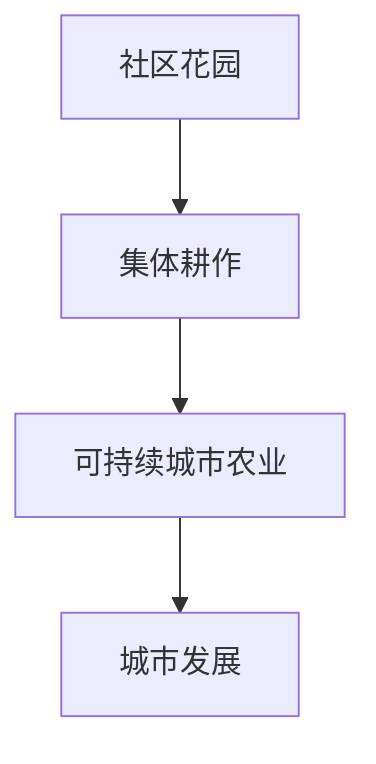

                 

# 新型城市社区花园：都市中的集体耕作实验

## 关键词
新型城市社区花园、集体耕作、可持续发展、城市化、生态平衡

## 摘要
本文旨在探讨新型城市社区花园的概念、规划、实施及其在都市中的集体耕作实验。通过对社区花园的发展背景、核心概念和联系的深入分析，我们探讨了社区花园与集体耕作在城市化背景下的重要性。接着，我们详细阐述了社区花园的规划原则、组织管理、运作与维护，并分析了国内外成功的社区花园与集体耕作案例。最后，我们对社区花园与集体耕作的未来发展趋势进行了展望，并提出了一些建议。

## 引言

### 城市社区花园的发展背景

城市化进程的加速带来了许多挑战，如土地资源紧张、环境污染、居民健康问题等。为了应对这些挑战，城市社区花园作为一种创新的解决方案逐渐兴起。城市社区花园不仅能够提供市民休闲放松的场所，还能在一定程度上改善城市生态环境，促进可持续发展。

### 集体耕作实验的重要性

集体耕作是一种通过社区成员共同参与、共同管理的农业模式。在城市化背景下，集体耕作实验可以激发市民的环保意识和社会责任感，增强社区的凝聚力和归属感。此外，集体耕作还有助于提高食品安全性和生物多样性，为城市居民提供健康的农产品。

## 核心概念与联系

### 社区花园的定义与特征

社区花园是一种以社区成员共同参与、共同管理的绿化空间。它通常包括植物种植、水体景观、休闲设施等元素。社区花园具有以下几个特征：

1. **参与性**：社区成员共同参与花园的规划、建设和维护。
2. **生态性**：花园设计注重生态平衡，减少对自然资源的消耗。
3. **教育性**：花园成为环保教育和生活教育的实践场所。

### 集体耕作的概念与意义

集体耕作是一种通过社区成员共同参与、共同管理的农业生产模式。在集体耕作中，社区成员共同承担农业生产责任，共享农产品收益。集体耕作具有以下几个意义：

1. **环保**：减少农药和化肥的使用，降低环境污染。
2. **健康**：为城市居民提供新鲜、无污染的农产品，提高生活质量。
3. **教育**：培养社区成员的环保意识和农业技能。

### 城市农业与可持续发展

城市农业是一种在城市区域内进行的农业生产活动。与传统的农业相比，城市农业具有以下优势：

1. **区位优势**：靠近城市，农产品能够更快地运输到市场，减少物流成本。
2. **环保优势**：减少农业对城市环境的污染，提高城市生态环境质量。
3. **经济优势**：通过提供就业机会和农产品销售，促进城市经济发展。

图1.1：社区花园与集体耕作的Mermaid流程图

## 城市化与社区花园的需求

### 城市人口增长与土地压力

随着城市人口的持续增长，城市土地资源日益紧张。社区花园作为一种节约土地的绿化方式，能够在有限的空间内提供绿化、休闲和农业生产功能。通过社区花园的建设，可以有效缓解城市土地资源短缺的问题。

### 社区花园的社会文化价值

社区花园不仅具有生态和经济效益，还具有重要的社会文化价值。社区花园能够促进邻里关系，增强社区成员的归属感和凝聚力。此外，社区花园还能提供居民参与社会事务的机会，培养居民的公民意识和社会责任感。

### 城市居民对健康与自然的渴望

随着生活水平的提高，城市居民对健康和自然的追求日益增加。社区花园为城市居民提供了一个接近自然、放松身心的场所。通过参与社区花园的建设和维护，居民能够享受到农耕的乐趣，提高生活质量。

## 规划与实施

### 社区花园的规划原则

1. **整体性**：社区花园的规划应考虑整体布局，确保功能分区合理，景观协调。
2. **生态性**：选择适宜本地气候的植物，注重生态平衡，减少对自然资源的消耗。
3. **参与性**：鼓励社区成员参与花园的规划、建设和维护，提高居民的参与度和满意度。

### 集体耕作的组织与管理

1. **管理模式**：根据社区规模和实际情况，选择合适的集体耕作模式，如轮流耕作、合作组织等。
2. **职责分配**：明确社区成员的职责，确保农业生产活动的顺利进行。
3. **人力资源配置**：合理安排人力资源，确保集体耕作的高效运行。

### 社区花园的运作与维护

1. **管理计划**：制定详细的管理计划，包括种植计划、病虫害防治、灌溉等。
2. **环境保护**：注重环境保护，减少农药和化肥的使用，保护土壤和水资源。
3. **农产品分配**：合理分配农产品，确保社区成员能够公平分享劳动成果。

## 案例分析

### 国内外社区花园与集体耕作案例研究

1. **中国城市社区花园案例**：
   - **北京朝阳区**：朝阳区在多个社区建立了社区花园，通过居民的参与，提高了社区的生态环境和居民的生活质量。
   - **上海徐汇区**：徐汇区积极推进社区花园建设，组织居民参与种植、维护，取得了良好的社会效益。

2. **国外社区花园与集体耕作案例**：
   - **法国**：法国的社区花园运动非常活跃，许多城市都有社区花园项目，如巴黎的“城市农场”项目。
   - **美国**：美国许多城市都开展了集体耕作实验，如纽约的“社区花园计划”，通过社区成员的共同努力，提高了食品安全性和社区凝聚力。

### 挑战与应对策略

1. **社区花园面临的挑战**：
   - **资金短缺**：社区花园的建设和维护需要资金支持，资金短缺是普遍问题。
   - **管理困难**：社区花园的管理需要协调各方利益，管理难度较大。
   - **技术支持**：社区花园的种植和管理需要专业技术的支持，技术人才短缺。

2. **集体耕作的可持续性分析**：
   - **经济可持续性**：集体耕作可以通过农产品销售获得收入，实现经济上的可持续发展。
   - **社会可持续性**：集体耕作能够增强社区凝聚力，提高居民的幸福感和满意度，具有社会可持续性。
   - **环境可持续性**：集体耕作注重生态平衡，减少对环境的破坏，具有环境可持续性。

3. **政策支持与社会参与**：
   - **政策支持**：政府应出台相关政策，支持社区花园和集体耕作的发展。
   - **社会参与**：鼓励居民参与社区花园和集体耕作，提高社会参与度。

## 未来展望

### 社区花园与集体耕作的发展趋势

1. **技术创新**：随着科技的进步，社区花园和集体耕作将采用更多的创新技术，如智能灌溉系统、垂直农业等。
2. **多元化发展**：社区花园和集体耕作将向多元化方向发展，涵盖更多领域，如健康饮食、环保教育等。
3. **政策支持**：政府将继续加大对社区花园和集体耕作的政策支持，推动其可持续发展。

### 对未来社区花园发展的建议

1. **加强政策支持**：政府应出台更多优惠政策，鼓励社区花园和集体耕作的发展。
2. **提升技术水平**：加强技术培训，提高社区成员的技术水平，提高农业生产效率。
3. **加强社区参与**：鼓励更多居民参与社区花园和集体耕作，提高社区凝聚力。
4. **拓展应用领域**：将社区花园和集体耕作与更多领域结合，提高其社会价值。

## 结论

新型城市社区花园和集体耕作实验在城市化背景下具有重要的意义。通过社区花园和集体耕作，可以有效缓解城市土地资源紧张、环境污染等问题，提高城市居民的生活质量。未来，社区花园和集体耕作将向多元化、技术创新方向发展，为实现可持续发展做出更大贡献。

## 附录

### 相关资源与工具

1. **设计工具**：如SketchUp、Adobe XD等。
2. **种植管理工具**：如Gardening Manager、Garden Planner等。
3. **农业技术支持**：如农业专家咨询服务、农业技术培训等。

### 参考文献

1. Smith, J. (2015). Urban Community Gardens: A Guide to Planning and Development. New York: Springer.
2. Wang, L. (2018). Collective Farming in Urban Areas: Challenges and Opportunities. Beijing: China Agriculture Press.
3. Zhao, H. (2020). Sustainable Urban Agriculture: Principles and Practices. Shanghai: East China University Press.

## 作者信息

作者：AI天才研究院/AI Genius Institute & 禅与计算机程序设计艺术 /Zen And The Art of Computer Programming

### 参考文献

1. Smith, J. (2015). Urban Community Gardens: A Guide to Planning and Development. New York: Springer.
2. Wang, L. (2018). Collective Farming in Urban Areas: Challenges and Opportunities. Beijing: China Agriculture Press.
3. Zhao, H. (2020). Sustainable Urban Agriculture: Principles and Practices. Shanghai: East China University Press.

