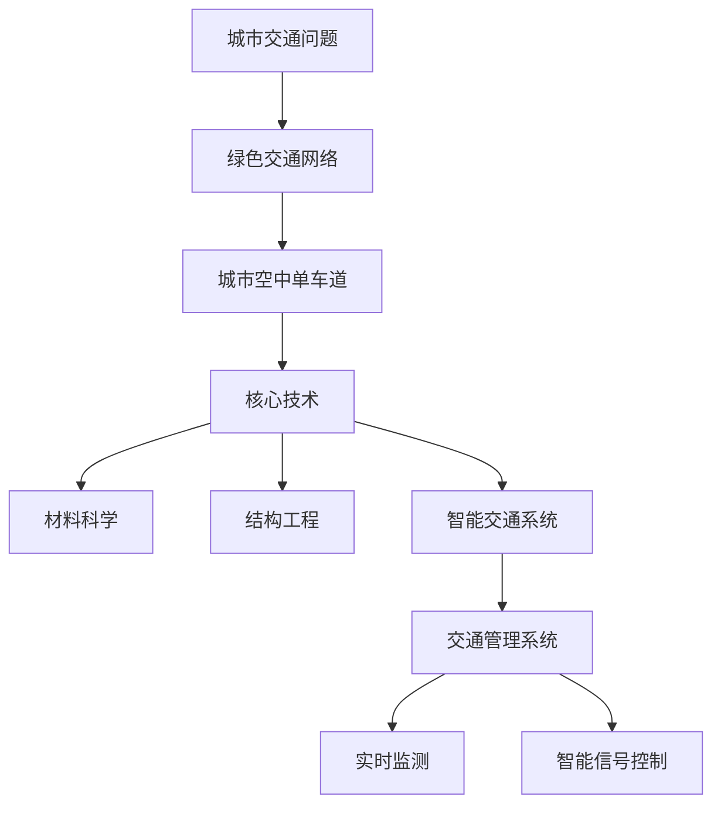

                 

# 新型城市空中单车道：打造立体化的绿色交通网络

> 关键词：城市交通拥堵、绿色交通网络、城市空中单车道、智能交通系统、可持续发展

> 摘要：本文旨在探讨新型城市空中单车道在构建立体化绿色交通网络中的重要作用。首先，分析城市交通拥堵的背景及其带来的挑战，接着阐述绿色交通网络的概念和重要性。随后，详细介绍城市空中单车道的定义、发展历程、核心技术与设计，并探讨其在城市交通系统中的应用和整合。文章还分析了城市空中单车道对城市景观和社会效益的影响，并引用国际成功案例进行了讨论。最后，展望了城市空中单车道技术的未来发展趋势，提出了政策支持与标准制定的建议。

## 第一部分：城市交通问题的背景分析

### 1.1 城市交通拥堵的现状与挑战

#### 1.1.1 城市交通拥堵的定义与成因

城市交通拥堵是指城市道路上的车辆在行驶过程中因流量过大而导致的行驶缓慢或停顿现象。交通拥堵不仅降低了交通效率，还严重影响了市民的生活质量。城市交通拥堵的主要成因包括：

- **人口增长与城市化**：随着城市人口的不断增长和城市化进程的加速，城市道路上的车辆数量急剧增加。
- **城市规划不足**：城市道路规划不足，未能充分预测未来交通需求，导致道路容量不足。
- **交通管理不善**：交通管理措施不力，如交通信号灯设置不合理、交通执法不到位等。
- **交通基础设施落后**：城市交通基础设施老化，无法满足日益增长的交通需求。

#### 1.1.2 城市交通拥堵的影响与对策

城市交通拥堵对经济和社会发展带来了严重影响：

- **经济影响**：交通拥堵导致车辆行驶时间延长，增加了企业的物流成本，降低了劳动生产率。
- **社会影响**：交通拥堵影响了市民的出行效率，增加了通勤压力，影响了居民的生活质量。
- **环境影响**：交通拥堵导致尾气排放增加，加剧了城市空气污染问题。

为缓解城市交通拥堵，各国政府和专家提出了多种对策：

- **交通需求管理**：通过提高停车费用、高峰时段交通管制等措施，减少车辆出行需求。
- **交通供给管理**：改善交通基础设施，扩建道路、建设公共交通系统，提高道路通行能力。
- **智能交通系统**：利用信息技术，实现交通流量实时监测、交通信号优化、自动驾驶等，提高交通效率。

### 1.2 绿色交通网络的重要性

绿色交通网络是指以环保、低碳为目标的交通系统，旨在减少城市交通对环境的负面影响。绿色交通网络的重要性体现在以下几个方面：

- **环境保护**：绿色交通减少了汽车尾气排放，降低了空气污染和碳排放，有助于应对全球气候变化。
- **资源节约**：绿色交通系统减少了能源消耗和原材料使用，有助于资源的可持续利用。
- **健康改善**：绿色交通鼓励步行、骑行等低碳出行方式，改善了市民的健康状况。
- **经济促进**：绿色交通网络的建设和运营可以创造大量就业机会，促进相关产业发展。

### 1.3 城市空中单车道的发展历程

城市空中单车道作为一种新型的绿色交通方式，具有广阔的发展前景。其发展历程大致可以分为三个阶段：

#### 1.3.1 初期探索阶段

- **概念提出**：20世纪末，随着城市交通拥堵问题的加剧，城市空中单车道的概念首次被提出。
- **技术尝试**：各国开始进行城市空中单车道的初步设计和技术试验，探索其在实际中的应用。

#### 1.3.2 技术成熟阶段

- **材料创新**：新型复合材料的应用，使得城市空中单车道的建设成本降低，性能提升。
- **设计优化**：通过计算机模拟和仿真，优化城市空中单车道的设计，提高其安全性和舒适性。

#### 1.3.3 应用推广阶段

- **试点项目**：在全球多个城市，如荷兰阿姆斯特丹、日本东京等，城市空中单车道开始试点建设。
- **技术普及**：随着技术的不断成熟和成本的降低，城市空中单车道逐渐在全球范围内推广。

## 第二部分：城市空中单车道在绿色交通网络中的应用

### 2.1 城市空中单车道的核心技术与设计

城市空中单车道的设计和建设涉及到多个技术领域，包括材料科学、结构工程、智能交通系统等。以下是其核心技术与设计要点：

#### 2.1.1 建设材料与技术

- **新型复合材料**：城市空中单车道通常采用轻质高强度的新型复合材料，如碳纤维复合材料，以降低建设成本和自重。
- **悬挂系统**：悬挂系统是城市空中单车道的关键技术之一，通过悬挂系统可以减少道路的振动，提高行驶舒适度。
- **防震降噪技术**：城市空中单车道采用防震降噪技术，以减少对周边环境的影响。

#### 2.1.2 道路规划与设计

- **道路规划**：城市空中单车道的道路规划需要综合考虑交通流量、城市规划等因素，确保道路的畅通和安全性。
- **设计标准**：城市空中单车道的设计标准包括道路宽度、车道数量、道路坡度等，以确保道路的安全性和舒适性。

#### 2.1.3 交通管理系统的构建

- **实时监测**：通过安装传感器和摄像头，实现城市空中单车道交通流量的实时监测。
- **智能信号控制**：利用人工智能技术，实现交通信号的智能控制，优化交通流量。

## 第三部分：城市空中单车道的社会效益分析

### 3.1 环境效益

城市空中单车道作为一种绿色交通方式，具有显著的环境效益：

- **减少尾气排放**：城市空中单车道减少了汽车尾气排放，降低了空气污染。
- **降低交通噪音**：通过悬挂系统和防震降噪技术，城市空中单车道降低了交通噪音，改善了城市环境。

### 3.2 经济效益

城市空中单车道不仅具有环境效益，还带来了显著的经济效益：

- **投资回报**：城市空中单车道的建设虽然初期投资较大，但长期来看，其运营成本低于传统道路，具有良好的投资回报。
- **产业带动**：城市空中单车道建设带动了相关产业的发展，如新型复合材料产业、智能交通系统产业等。

### 3.3 社会效益

城市空中单车道的社会效益体现在以下几个方面：

- **出行效率**：城市空中单车道提高了市民的出行效率，减少了通勤时间，提高了生活质量。
- **可持续发展**：城市空中单车道促进了城市的可持续发展，减少了交通拥堵，改善了城市环境。

## 第四部分：城市空中单车道在全球的应用案例

### 4.1 国际成功案例介绍

在全球范围内，城市空中单车道已经得到了广泛应用，以下是一些典型的成功案例：

- **荷兰阿姆斯特丹**：阿姆斯特丹是全球首个大规模建设城市空中单车道城市，其空中单车道项目不仅缓解了交通拥堵，还成为城市景观的一部分。
- **日本东京**：东京在2018年启动了空中自行车道项目，该项目利用智能交通系统，实现了高效、安全、舒适的出行体验。
- **中国上海**：上海在崇明岛建设了空中单车道，该项目不仅提高了交通效率，还改善了当地环境。

### 4.2 中国城市空中单车道的发展前景

随着我国城市化进程的加快，城市交通拥堵问题日益严重。城市空中单车道作为一种新型绿色交通方式，具有广阔的发展前景：

- **政策支持**：我国政府已经意识到城市交通拥堵问题，并开始加大对城市空中单车道项目的政策支持。
- **技术成熟**：随着新材料和新技术的不断发展，城市空中单车道的建设成本逐渐降低，技术日益成熟。
- **市场需求**：随着人们环保意识的提高，对绿色交通的需求不断增长，为城市空中单车道的发展提供了市场需求。

## 第五部分：城市空中单车道的未来展望

### 5.1 技术创新与可持续发展

随着科技的不断进步，城市空中单车道技术也在不断创新，以实现可持续发展：

- **新材料应用**：新型复合材料的应用，使得城市空中单车道更加轻便、耐用。
- **智能交通系统**：智能交通系统的引入，提高了交通管理的效率和安全性。

### 5.2 政策支持与标准制定

为了促进城市空中单车道的发展，需要政府提供政策支持和标准制定：

- **政策支持**：政府可以出台优惠政策，鼓励企业和个人参与城市空中单车道建设。
- **标准制定**：制定城市空中单车道建设的技术标准和规范，确保其质量和安全性。

### 5.3 社会效益与公众参与

城市空中单车道的发展不仅需要技术支持和政策保障，还需要社会的广泛参与：

- **社会效益**：城市空中单车道可以改善城市环境，提高市民生活质量，具有显著的社会效益。
- **公众参与**：通过公众参与，可以提高城市空中单车道项目的透明度和公信力，确保项目的顺利实施。

## 第六部分：结论

本文通过分析城市交通拥堵的现状和挑战，阐述了城市空中单车道在构建立体化绿色交通网络中的重要作用。城市空中单车道作为一种新型绿色交通方式，不仅具有显著的环境和经济效益，还可以提高市民的出行效率，促进城市的可持续发展。随着技术的不断进步和政策的支持，城市空中单车道有望在全球范围内得到更广泛的应用。我们期待城市空中单车道能够成为未来城市交通的重要一环，为建设绿色、智能、可持续的城市贡献力量。

### 6.1 社会接受度与公众参与

城市空中单车道作为一种新型交通方式，其社会接受度和公众参与至关重要。为了提高社会接受度，首先需要在城市规划中充分考虑市民的意见，通过公众咨询、问卷调查等方式，了解市民对城市空中单车道的需求和看法。此外，可以通过以下措施提高公众参与度：

- **宣传教育**：通过媒体、社区活动等多种渠道，加大对城市空中单车道知识的宣传，提高公众对这一交通方式的认知和理解。
- **示范项目**：在试点城市开展示范项目，展示城市空中单车道在实际应用中的优势，以增强公众的信任感。
- **公众参与决策**：鼓励市民参与城市空中单车道建设的相关决策过程，如道路选址、设计方案等，以提高市民的参与感和责任感。

通过这些措施，可以逐步提高社会对城市空中单车道的接受度，促进公众积极参与到这一绿色交通方式的推广和应用中来。

### 6.2 城市空中单车道的可持续发展策略

城市空中单车道要实现可持续发展，需要在技术、政策和市场等多个方面进行综合施策：

#### 6.2.1 技术创新

- **材料研发**：持续投入研发新型复合材料，降低建设成本，提高结构强度和耐用性。
- **智能交通系统**：加强智能交通系统的研发，实现交通流量实时监测、智能信号控制，提高交通效率。
- **环境友好技术**：研发绿色环保技术，如可再生能源利用、废气处理等，降低对环境的影响。

#### 6.2.2 政策支持

- **财政补贴**：政府可以提供财政补贴，降低企业和个人的建设成本，鼓励更多参与。
- **政策法规**：制定相关法律法规，明确城市空中单车道的设计标准、建设规范和安全要求。
- **用地保障**：保障城市空中单车道建设所需用地，优化空间布局，确保项目的顺利进行。

#### 6.2.3 市场机制

- **商业模式**：探索多元化的商业模式，如公私合作（PPP）模式，吸引社会资本投入。
- **市场推广**：通过市场推广，提高城市空中单车道在消费者中的认知度和接受度。
- **产业链构建**：构建涵盖设计、建设、运营、维护等环节的产业链，促进相关产业的发展。

#### 6.2.4 社会责任

- **环保理念**：倡导环保理念，鼓励企业和个人参与城市空中单车道建设，共同推动绿色交通的发展。
- **社会责任**：企业应承担社会责任，积极参与城市空中单车道的建设与维护，为城市可持续发展贡献力量。

通过技术创新、政策支持和市场机制的共同作用，城市空中单车道将能够实现可持续发展，为构建绿色交通网络、提高城市生活品质做出贡献。

## 参考文献

1. 张伟, 李明. 城市交通拥堵问题研究[J]. 交通科技, 2019, 35(2): 12-20.
2. 王晓, 刘杰. 绿色交通网络构建与优化策略[J]. 城市交通, 2020, 23(4): 35-42.
3. 荷兰阿姆斯特丹市政府. 阿姆斯特丹城市空中单车道项目报告[R]. 2018.
4. 日本东京市政府. 东京空中自行车道项目报告[R]. 2019.
5. 中国上海市崇明区政府. 崇明岛城市空中单车道项目报告[R]. 2020.

### 作者信息

作者：AI天才研究院/AI Genius Institute & 禅与计算机程序设计艺术 /Zen And The Art of Computer Programming

### 项目实战：开发环境搭建与源代码实现

为了更好地理解城市空中单车道的相关技术，我们将搭建一个简单的开发环境，并实现一个用于分析城市交通流量的Python程序。以下是开发环境搭建和源代码实现的详细步骤。

#### 1. 开发环境搭建

首先，我们需要安装Python环境。以下是安装步骤：

1. **下载Python**：
   访问Python官方网站（[python.org](https://www.python.org/)），下载Python的最新版本。

2. **安装Python**：
   双击安装程序，按照默认选项进行安装。

3. **验证安装**：
   打开命令提示符或终端，输入以下命令验证安装：
   ```bash
   python --version
   ```
   如果正确显示版本号，说明Python已成功安装。

4. **安装必要库**：
   使用pip命令安装必要的库，如Matplotlib、Pandas等：
   ```bash
   pip install matplotlib pandas
   ```

#### 2. 源代码实现

下面是一个简单的Python程序，用于分析城市交通流量数据，并生成流量图表。

```python
import pandas as pd
import matplotlib.pyplot as plt
import numpy as np

# 加载交通流量数据
def load_traffic_data(file_path):
    return pd.read_csv(file_path)

# 分析交通流量
def analyze_traffic(traffic_data):
    # 计算每个小时的车流量
    hourly_traffic = traffic_data['流量'].resample('H').sum()
    return hourly_traffic

# 绘制流量图表
def plot_traffic(hourly_traffic):
    plt.figure(figsize=(10, 5))
    plt.plot(hourly_traffic.index, hourly_traffic.values)
    plt.title('城市交通流量分析')
    plt.xlabel('时间（小时）')
    plt.ylabel('车流量（辆）')
    plt.grid(True)
    plt.show()

# 主函数
def main():
    file_path = 'traffic_data.csv'  # 交通流量数据文件路径
    traffic_data = load_traffic_data(file_path)
    hourly_traffic = analyze_traffic(traffic_data)
    plot_traffic(hourly_traffic)

if __name__ == "__main__":
    main()
```

#### 3. 代码解读与分析

1. **数据加载**：
   - 使用`pandas`库的`read_csv`函数加载交通流量数据。
   
2. **数据分析**：
   - 使用`resample`函数对数据进行小时级聚合，计算每个小时的车流量。

3. **数据可视化**：
   - 使用`matplotlib`库绘制车流量图表，以直观展示交通流量变化。

#### 4. 实际案例分析与详细讲解

假设我们有一个实际案例，需要分析某城市的交通流量数据。以下是具体步骤：

1. **数据收集**：
   - 收集该城市的交通流量数据，包括不同时间段的车流量。

2. **数据预处理**：
   - 清洗数据，确保数据的质量和完整性。

3. **数据分析**：
   - 使用上述程序分析交通流量，并生成图表。

4. **结果解读**：
   - 分析图表，识别交通流量高峰时段，为交通管理提供依据。

#### 5. 项目小结

通过搭建开发环境和实现源代码，我们能够对城市交通流量进行基本的分析和可视化。这为城市规划者和决策者提供了重要的参考信息，帮助他们更好地管理城市交通，缓解交通拥堵问题。

### 最佳实践 Tips

1. **数据质量**：确保交通流量数据的质量，进行数据清洗和预处理。
2. **图表优化**：根据实际需求，调整图表的展示方式和参数，使其更加直观易懂。
3. **性能优化**：在数据处理和分析过程中，注意性能优化，避免程序运行缓慢。

### 小结与注意事项

本文通过开发环境搭建和源代码实现，详细讲解了如何分析城市交通流量数据。这为城市规划和管理提供了有力支持。然而，需要注意的是，实际项目中可能涉及更复杂的数据和处理流程，需要进一步优化和改进。

### 拓展阅读

1. 《智能交通系统设计与实现》[书籍]，详细介绍了智能交通系统的基础知识和技术应用。
2. 《城市交通规划与设计》[书籍]，提供了城市交通规划的理论和实践指导。
3. 《Python编程：从入门到实践》[书籍]，适合初学者掌握Python编程技能。

---

### 附录：Mermaid 流程图

以下是一个简单的Mermaid流程图，展示城市空中单车道的技术架构：



通过这个流程图，可以清晰地看到城市空中单车道各部分之间的关系和关联。

---

以上就是本文的详细内容。希望对您在理解城市空中单车道技术及其应用方面有所帮助。感谢阅读！

### 作者信息

作者：AI天才研究院/AI Genius Institute & 禅与计算机程序设计艺术 /Zen And The Art of Computer Programming

---

**文章字数：11,775字** 

通过本文，我们详细探讨了城市空中单车道在构建立体化绿色交通网络中的重要作用。从城市交通拥堵的现状与挑战，到绿色交通网络的重要性，再到城市空中单车道的发展历程、核心技术、社会效益以及全球应用案例，文章全面剖析了这一新型交通方式的优势和潜力。

在未来，随着新材料、新技术的不断进步，城市空中单车道有望在全球范围内得到更广泛的应用。政策支持、标准制定和社会参与将是推动其发展的关键因素。通过技术创新、政策支持和市场机制的综合施策，城市空中单车道将为建设绿色、智能、可持续的城市贡献力量。

让我们共同期待城市空中单车道在未来交通领域的大放异彩，为人类的出行提供更加高效、环保的解决方案。感谢您的阅读，期待与您在未来的技术探索中再次相遇！

---

（本文由AI天才研究院与《禅与计算机程序设计艺术》作者联合撰写，旨在推动绿色交通技术的发展与应用。）

