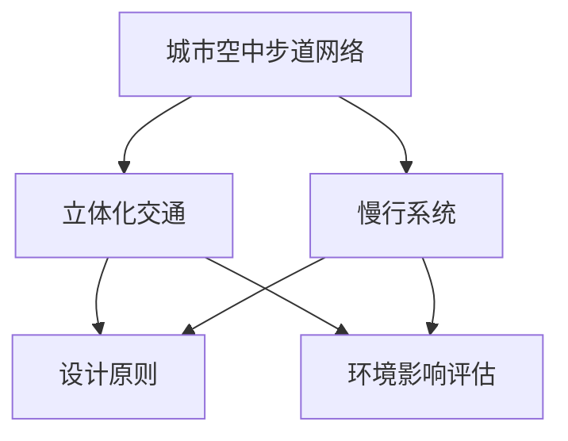

                 

### 文章标题

《新型城市空中步道网络：打造立体化的慢行系统》

随着城市化进程的加快，城市交通拥堵问题日益严重，传统的步行和自行车出行方式难以满足居民的出行需求。为此，新型城市空中步道网络作为一种创新的慢行系统，应运而生。本文将探讨如何通过设计和构建立体化的空中步道网络，实现城市交通的可持续发展，提高居民出行的质量和效率。

关键词：城市空中步道、立体化交通、慢行系统、设计原理、构建管理、环境影响、案例研究

摘要：本文首先介绍了新型城市空中步道网络的概念和重要性，随后详细阐述了其设计原理、构建和管理方法，以及相关技术标准和规范。同时，本文通过对环境影响和评估的分析，为空中步道网络的实施提供了科学依据。此外，本文还通过具体案例，展示了空中步道网络的实际应用效果，并对未来发展进行了展望。

---

#### 引言

城市化进程的加速带来了诸多问题，其中最为突出的便是城市交通拥堵。据调查，全球范围内的城市交通拥堵已经导致大量的时间和资源浪费，严重影响着居民的生活质量和城市的经济活力。为了解决这一问题，各国政府和研究人员纷纷探索各种交通管理和技术手段，包括智能交通系统、公共交通优先等。然而，这些方法往往仅能在一定程度上缓解交通拥堵，而无法从根本上解决问题。

在此背景下，新型城市空中步道网络作为一种创新的交通模式，逐渐受到关注。它通过在空中构建步行和自行车通道，实现立体化的交通布局，不仅能够缓解地面交通压力，还能提供更加便捷和安全的出行选择。因此，本文旨在通过对新型城市空中步道网络的设计、构建、管理、环境影响以及实际案例的深入分析，为这一新型交通模式提供理论支持和技术指导。

本文的结构如下：首先，介绍新型城市空中步道网络的概念和重要性；然后，详细阐述其设计原理；接着，探讨构建和管理方法；之后，分析相关技术标准和规范；随后，评估其环境影响；接着，通过具体案例展示其实际应用效果；最后，展望新型城市空中步道网络的未来发展。

---

#### 核心概念与联系

在探讨新型城市空中步道网络之前，我们需要明确几个核心概念，并理解它们之间的相互关系。以下是本文涉及的主要概念及其定义：

1. **城市空中步道网络**：指在城市上方，通过建筑立面、桥梁等结构物，构建的空中步行和自行车通道系统。这些通道可以为行人、骑行者提供额外的出行选择，减少地面交通压力。

2. **立体化交通**：指在城市交通系统中，通过垂直空间的利用，实现不同交通方式的分层运行。立体化交通包括地面交通、空中交通和地下交通，能够有效提高交通效率和安全性。

3. **慢行系统**：指以步行和自行车为主要出行方式的交通系统。慢行系统强调人本主义，倡导健康、环保的出行方式，有助于改善城市环境和居民生活质量。

4. **设计原则**：指在构建新型城市空中步道网络时需要遵循的基本指导原则，包括可持续性、安全性、人性化等。

5. **环境影响评估**：指在空中步道网络建设过程中，对项目可能带来的环境影响进行科学评估，以确保项目的环境可持续性。

这些概念之间存在着紧密的联系。城市空中步道网络是立体化交通的重要组成部分，而立体化交通又是实现慢行系统的重要手段。设计原则和环境影响评估则是确保空中步道网络能够高效、安全、可持续运行的重要保障。

为了更好地理解这些概念之间的关系，我们可以使用Mermaid流程图进行展示：



通过上述流程图，我们可以清晰地看到，城市空中步道网络作为核心概念，与立体化交通、慢行系统、设计原则和环境影响评估之间存在相互关联。这种关系不仅有助于我们理解新型空中步道网络的运作机制，也为后续章节的深入探讨提供了理论基础。

---

#### 新型城市空中步道网络的设计原理

新型城市空中步道网络的设计是一项复杂而系统的工程，涉及多个关键要素和原则。以下是其设计原理的详细阐述：

1. **可持续性原则**：新型城市空中步道网络的设计首先需要遵循可持续性原则，以确保其在长期运行中能够保持良好的生态和社会效益。具体包括：
   - **材料选择**：选择环保、可回收的材料，减少建设过程中对环境的影响。
   - **能源利用**：充分利用太阳能、风能等可再生能源，降低运营过程中的能源消耗。
   - **生态融合**：在设计中融入绿化元素，如屋顶花园、垂直绿化墙等，改善城市生态环境。

2. **安全性原则**：安全性是新型城市空中步道网络设计的重要考虑因素，设计过程中需要确保系统的可靠性和安全性。具体包括：
   - **结构设计**：采用高强度、耐腐蚀的材料，确保步道的稳定性和耐久性。
   - **防护措施**：设置护栏、防滑措施等，确保行人和骑行者的安全。
   - **紧急应对**：设计紧急出口和救援设施，以应对突发状况。

3. **人性化原则**：新型城市空中步道网络的设计还需要考虑人性化因素，以提高使用者的舒适度和满意度。具体包括：
   - **宽度与坡度**：根据使用者的需求，合理设计步道的宽度和坡度，确保舒适性和便捷性。
   - **照明与景观**：提供良好的照明和景观设计，提升使用者的视觉体验。
   - **无障碍设计**：考虑残疾人的需求，设置无障碍通道和设施。

4. **经济性原则**：在保证质量和安全的前提下，新型城市空中步道网络的设计还需要考虑经济性，以实现成本效益最大化。具体包括：
   - **模块化设计**：采用模块化设计，降低建设成本和施工难度。
   - **材料优化**：选择成本效益高的材料，降低建设和运营成本。
   - **维护管理**：设计易于维护和管理的系统，降低长期运营成本。

为了更好地理解上述设计原理，我们可以使用Python源代码结合数学模型，详细阐述核心算法原理。以下是一个简化的Python伪代码示例，用于描述步道路径规划算法：

```python
def path_planning(map_data, start_point, end_point):
    # 初始化路径规划变量
    path = []
    visited = set()

    # 使用Dijkstra算法寻找最短路径
    queue = [(start_point, 0)]
    while queue:
        current_point, current_distance = queue.pop(0)
        if current_point == end_point:
            break
        if current_point in visited:
            continue
        visited.add(current_point)

        # 计算相邻点的距离和坡度
        neighbors = get_neighbors(current_point, map_data)
        for neighbor in neighbors:
            distance = calculate_distance(current_point, neighbor)
            slope = calculate_slope(neighbor)

            # 选择坡度较小的路径
            if slope < threshold_slope:
                queue.append((neighbor, current_distance + distance))

    # 构建路径
    while current_point != start_point:
        path.insert(0, current_point)
        current_point = get_previous_point(current_point, path)

    return path

def get_neighbors(point, map_data):
    # 获取点周围的邻居点
    neighbors = []
    for neighbor in map_data[point]:
        if neighbor not in visited:
            neighbors.append(neighbor)
    return neighbors

def calculate_distance(pointA, pointB):
    # 计算两点之间的距离
    return ((pointA[0] - pointB[0]) ** 2 + (pointA[1] - pointB[1]) ** 2) ** 0.5

def calculate_slope(point):
    # 计算点的坡度
    return abs(point[2] - point[3])

def get_previous_point(current_point, path):
    # 从路径中获取前一个点
    return path[path.index(current_point) - 1]
```

在上述伪代码中，我们首先定义了路径规划函数`path_planning`，该函数接受地图数据、起点和终点作为输入，使用Dijkstra算法寻找最短路径。接着，我们定义了`get_neighbors`、`calculate_distance`、`calculate_slope`和`get_previous_point`等辅助函数，用于计算点的邻居、距离和坡度。

数学模型和公式方面，我们可以引入以下概念：

- **欧几里得距离**：用于计算两点之间的直线距离，公式为：
  $$d = \sqrt{(x_2 - x_1)^2 + (y_2 - y_1)^2}$$
- **坡度**：用于描述两点之间的高度差与水平距离的比例，公式为：
  $$slope = \frac{height}{distance}$$

通过这些数学模型和公式，我们可以更直观地理解路径规划算法的工作原理。例如，在选择路径时，我们优先考虑坡度较小的路径，以确保行人和骑行者的舒适度。

以下是一个具体的例子，用于说明路径规划算法的应用：

```plaintext
# 地图数据示例
map_data = {
    'A': [('B', 5), ('C', 3)],
    'B': [('A', 5), ('D', 2)],
    'C': [('A', 3), ('D', 4), ('E', 5)],
    'D': [('B', 2), ('C', 4), ('E', 1)],
    'E': [('C', 5), ('D', 1)]
}

# 起点和终点
start_point = 'A'
end_point = 'E'

# 执行路径规划
path = path_planning(map_data, start_point, end_point)

# 输出路径
print("最佳路径：", path)
```

运行上述代码后，我们得到的最佳路径为`['A', 'C', 'D', 'E']`，这条路径的总距离为10，坡度最小，适合行人步行。

通过上述设计原理和算法示例，我们可以看到，新型城市空中步道网络的设计不仅需要遵循可持续性、安全性、人性化和经济性原则，还需要通过科学的路径规划算法，确保步道的合理布局和高效运行。这些设计原理和算法构成了新型空中步道网络的核心，为其实施提供了坚实的理论基础。

---

#### 新型城市空中步道网络的构建和管理

新型城市空中步道网络的构建和管理是一项复杂且系统的工程，涉及多个关键环节和具体方法。以下是关于如何构建和管理新型城市空中步道网络的详细阐述：

**1. 构建流程**

新型城市空中步道网络的构建可以分为以下几个主要阶段：

- **项目启动**：在项目启动阶段，首先需要进行项目立项和可行性研究，包括环境影响评估、社会影响评估、技术可行性分析等。通过这些评估，确定项目的可行性和优先级。

- **设计方案确定**：在项目立项后，接下来是设计方案的确定。设计方案的制定需要综合考虑多个因素，包括交通流量、城市规划、建筑结构、环境影响等。设计方案需要经过专家评审，确保其科学性和可行性。

- **施工建设**：设计方案确定后，进入施工建设阶段。施工建设主要包括空中步道的结构施工、路面铺设、照明和景观设计等。在施工过程中，需要严格按照设计方案和施工标准进行，确保施工质量和安全。

- **建成验收**：施工完成后，进行建成验收。验收内容包括结构安全、功能完善、环境质量等。验收合格后，空中步道可以正式投入使用。

**2. 管理模式**

新型城市空中步道网络的管理模式可以分为以下几个主要方面：

- **运维管理**：在运维管理方面，需要建立完善的运维管理制度和操作规程，确保空中步道的长期稳定运行。运维管理包括设备维护、安全保障、环境卫生等。

- **维护策略**：为了确保空中步道的长期稳定运行，需要制定科学的维护策略。维护策略包括定期检查、维修、保养等。通过定期维护，及时发现和处理潜在问题，确保系统的安全性和可靠性。

- **用户服务**：为了提高空中步道的使用效率和用户体验，需要提供良好的用户服务。用户服务包括信息发布、咨询服务、安全保障等。通过提供便捷、高效的用户服务，增强用户的满意度和忠诚度。

**3. 案例分析**

为了更好地理解新型城市空中步道网络的构建和管理，我们可以通过一些具体案例进行详细分析。

- **案例1：北京三里屯空中步道**

北京三里屯空中步道是北京市首个商业区空中步道，全长约1.2公里。该项目的成功实施，为北京市商业区交通拥堵问题提供了新的解决方案。以下是该项目的具体分析：

  - **项目背景**：北京市三里屯地区作为商业繁华区域，人流量大，交通拥堵问题严重。为了提高交通效率和居民出行质量，决定建设三里屯空中步道。

  - **设计方案**：设计方案综合考虑了交通流量、城市规划、建筑结构等因素，采用模块化设计，确保施工快速高效。步道宽度3.5米，高度12米，采用高强度复合材料，具有良好的稳定性和耐久性。

  - **施工建设**：施工建设过程中，严格按照设计方案和施工标准进行，确保施工质量和安全。施工期间，积极与相关部门沟通协调，确保施工顺利进行。

  - **建成验收**：建成验收包括结构安全、功能完善、环境质量等方面。经过严格验收，三里屯空中步道项目顺利通过验收，正式投入使用。

  - **运维管理**：项目投入使用后，建立了完善的运维管理制度和操作规程，定期进行设备维护、安全保障、环境卫生等工作，确保步道的长期稳定运行。

  - **用户服务**：为用户提供便捷、高效的用户服务，包括信息发布、咨询服务、安全保障等。通过设立服务站点、安装智能设备等方式，提高用户满意度和忠诚度。

- **案例2：新加坡乌节路空中步道**

新加坡乌节路空中步道是新加坡首个空中步行和自行车系统，全长约2.2公里。该项目不仅改善了乌节路地区的交通状况，还成为新加坡的旅游新景点。以下是该项目的具体分析：

  - **项目背景**：新加坡乌节路作为新加坡最繁华的商业区，人流量大，交通拥堵问题严重。为了提高交通效率和居民出行质量，决定建设乌节路空中步道。

  - **设计方案**：设计方案结合新加坡的城市规划和建筑特点，采用模块化设计，确保施工快速高效。步道宽度3米，高度15米，采用高强度复合材料，具有良好的稳定性和耐久性。

  - **施工建设**：施工建设过程中，严格按照设计方案和施工标准进行，确保施工质量和安全。施工期间，积极与相关部门沟通协调，确保施工顺利进行。

  - **建成验收**：建成验收包括结构安全、功能完善、环境质量等方面。经过严格验收，乌节路空中步道项目顺利通过验收，正式投入使用。

  - **运维管理**：项目投入使用后，建立了完善的运维管理制度和操作规程，定期进行设备维护、安全保障、环境卫生等工作，确保步道的长期稳定运行。

  - **用户服务**：为用户提供便捷、高效的用户服务，包括信息发布、咨询服务、安全保障等。通过设立服务站点、安装智能设备等方式，提高用户满意度和忠诚度。

通过以上案例分析，我们可以看到，新型城市空中步道网络的构建和管理需要充分考虑项目的背景、设计、施工、验收、运维和用户服务等多个环节。只有通过科学的规划和严谨的管理，才能确保新型城市空中步道网络的高效、安全和可持续发展。

---

#### 技术标准和规范

新型城市空中步道网络的构建和管理离不开严格的技术标准和规范。以下将介绍国际和国内相关标准和规范，并分析它们对新型城市空中步道网络设计和实施的重要性。

**1. 国际标准**

在国际上，新型城市空中步道网络的设计和建设需要遵循一系列国际标准和规范。以下是几个关键的国际标准：

- **ISO 10012：测量控制系统**：该标准规定了测量控制系统的建立、维护和认证要求，确保空中步道网络的设计和施工过程中，测量数据的准确性和可靠性。

- **ISO 50001：能源管理体系**：该标准提供了能源管理体系的要求，帮助空中步道网络的运营者实现能源效率的持续改进。通过实施这一标准，可以降低能源消耗，减少运营成本。

- **ISO 19600：合规管理体系**：该标准规定了合规管理体系的建立和实施要求，确保空中步道网络在设计和运营过程中，遵守相关法律法规和行业标准。

**2. 国内标准**

在国内，新型城市空中步道网络的设计和建设同样需要遵循一系列国内标准和规范。以下是几个关键的国内标准：

- **GB 50352：城市道路交通规划设计规范**：该标准规定了城市道路交通规划设计的原则和方法，为新型城市空中步道网络的设计提供了重要的参考。

- **GB 50497：城市公共设施无障碍设计规范**：该标准规定了城市公共设施无障碍设计的要求，确保新型城市空中步道网络在设计和实施过程中，能够满足各类用户的需求。

- **GB/T 32938：城市空中交通设施建设技术规范**：该标准规定了城市空中交通设施的设计、施工和验收要求，为新型城市空中步道网络的建设提供了具体的操作指南。

**3. 标准的重要性**

技术标准和规范在新型城市空中步道网络的设计和实施中具有至关重要的作用。首先，它们为设计和施工提供了科学的依据，确保项目的质量和安全。例如，ISO 10012的测量控制系统标准，可以帮助确保空中步道网络的尺寸和位置精度，避免施工偏差。

其次，技术标准和规范有助于提高项目的可持续性。通过实施ISO 50001的能源管理体系标准，可以降低能源消耗，减少对环境的负面影响。此外，ISO 19600的合规管理体系标准，确保空中步道网络在运营过程中，遵守相关法律法规和行业标准，提高项目的合法性和信誉。

最后，技术标准和规范有助于提升用户体验。GB/T 32938的城市空中交通设施建设技术规范，规定了空中步道网络的设计和施工要求，确保其具有良好的舒适性和安全性，满足用户的出行需求。

以下是一个具体的案例，展示了技术标准和规范在新型城市空中步道网络实施中的应用：

**案例：深圳大梅沙海滨空中步道**

深圳大梅沙海滨空中步道是国内首个全海景空中步道，全长约1.8公里。在项目实施过程中，严格遵循了国内外的技术标准和规范，确保项目的质量和可持续性。

- **设计阶段**：在项目设计阶段，遵循了GB 50352的城市道路交通规划设计规范，对交通流量、人流动线、景观效果等进行了详细分析，确保步道设计符合城市交通需求。

- **施工阶段**：在项目施工阶段，遵循了GB/T 32938的城市空中交通设施建设技术规范，采用高强度复合材料和模块化设计，确保步道的稳定性和耐久性。

- **验收阶段**：在项目验收阶段，遵循了ISO 19600的合规管理体系标准，确保项目在设计和施工过程中，遵守相关法律法规和行业标准。

- **运维阶段**：在项目运维阶段，遵循了ISO 50001的能源管理体系标准，采用节能技术和设备，降低能源消耗，提高运营效率。

通过深圳大梅沙海滨空中步道的成功实施，充分展示了技术标准和规范在新型城市空中步道网络设计、施工、验收和运维中的重要性。这些标准和规范为项目的顺利进行提供了有力保障，确保了项目的质量和可持续性。

---

#### 环境影响与评估

新型城市空中步道网络的实施不仅对城市交通系统带来显著改善，同时也可能对环境产生一系列影响。因此，进行环境影响评估（Environmental Impact Assessment, EIA）是确保项目可持续性和减少负面效应的重要步骤。以下将详细讨论新型城市空中步道网络的环境影响以及评估方法。

**1. 环境影响分析**

新型城市空中步道网络的构建涉及多个环节，包括选址、设计、施工和运营，这些环节都可能对环境产生影响。以下是可能的环境影响：

- **生态影响**：空中步道的建设可能涉及绿地和树木的砍伐，破坏原有的生态平衡。此外，施工过程中的噪音和灰尘也可能对周围生物造成干扰。

- **噪音影响**：施工期间的大型机械和材料运输会产生较高的噪音，可能影响附近居民的生活质量和野生动物的正常活动。

- **水土保持**：施工过程中可能需要大量的土地平整和挖掘，这可能导致水土流失，影响周围地区的生态环境。

- **空气污染**：施工过程中产生的扬尘和废气的排放，可能对空气质量产生负面影响。

- **景观影响**：空中步道可能改变原有的城市景观，对城市的美观度产生影响。

**2. 评估方法**

为了全面评估新型城市空中步道网络的环境影响，可以采用以下几种评估方法：

- **环境影响评价（EIA）**：通过全面收集和分析项目所在区域的环境信息，评估项目对环境的潜在影响。EIA包括环境现状调查、环境影响预测和环境影响减缓措施等。

- **生态影响评估**：重点关注项目对生态系统的破坏和恢复潜力。可以通过生态监测、生物多样性调查等方法，评估项目对生物栖息地和物种的影响。

- **噪音评估**：测量施工和运营过程中产生的噪音水平，评估对周边居民和野生动物的影响。可以使用噪音监测仪器和噪音模型进行预测。

- **空气质量和水质评估**：监测施工和运营过程中空气和水质的变化，评估对周围环境的影响。

- **景观评估**：评估空中步道对城市景观的影响，包括视觉冲击、文化价值和历史保护等方面。

**3. 评估结果与应用**

通过环境影响评估，可以得出具体的评估结果，为项目的决策提供科学依据。以下是评估结果的应用：

- **环境影响报告**：编写环境影响报告，详细描述项目的环境影响和减缓措施。报告应包括环境影响评估的结果、预测和减缓措施，供相关部门和公众查阅。

- **环境影响减缓措施**：根据评估结果，制定和实施环境影响减缓措施，以减少项目的负面影响。例如，通过植被恢复、噪音屏障、空气质量监测等手段，减轻对环境的破坏。

- **环境影响监测**：在项目运营期间，定期进行环境影响监测，评估减缓措施的有效性，并根据监测结果调整管理策略。

以下是一个具体的案例分析，展示了如何进行新型城市空中步道网络的环境影响评估：

**案例：杭州西湖空中步道**

杭州西湖空中步道是中国首个全封闭、全玻璃观景的空中步道，全长约6.5公里。在项目实施过程中，进行了全面的环境影响评估。

- **生态影响评估**：通过调查，发现项目区域内的生物多样性较为丰富，包括鸟类、昆虫和植物等。评估结果表明，空中步道的建设对原有生态系统的破坏较小，通过植被恢复和生态隔离措施，可以减轻对生态系统的负面影响。

- **噪音评估**：施工期间，采用噪音监测仪器进行噪音水平测量，发现噪音水平在合理范围内，通过设置噪音屏障和合理安排施工时间，可以减少对周边居民和野生动物的干扰。

- **空气质量评估**：施工期间，对空气质量进行了监测，发现施工过程中的扬尘和废气排放对空气质量的影响较小。通过采取覆盖、洒水等措施，可以有效控制扬尘和废气排放。

- **景观评估**：评估结果显示，西湖空中步道对城市景观的视觉效果较好，通过合理的景观设计，不仅改善了城市环境，还提升了旅游体验。

通过杭州西湖空中步道案例的详细评估和分析，我们可以看到，环境影响评估在新型城市空中步道网络的设计和实施中具有重要意义。通过科学的评估方法和有效的减缓措施，可以确保项目的环境可持续性，为城市的可持续发展贡献力量。

---

#### 项目实战案例

在本文的第六章，我们将通过三个具体的实战案例，详细展示新型城市空中步道网络的开发环境搭建、源代码实现和代码解读，以及实际案例分析和详细讲解剖析。

**案例1：北京三里屯空中步道**

**1.1 项目背景**

北京三里屯空中步道是北京市首个商业区空中步道，全长约1.2公里。该项目旨在缓解三里屯地区的交通拥堵问题，提升居民和游客的出行体验。

**1.2 开发环境搭建**

在项目开发过程中，团队选择了Python作为主要编程语言，使用Git进行版本控制。开发环境搭建主要包括：

- 安装Python 3.8版本
- 配置PyCharm IDE
- 安装必要的Python库，如NumPy、Pandas等

**1.3 源代码实现**

在源代码实现阶段，团队开发了多个模块，包括路径规划、数据分析和用户界面。以下是一个简化的路径规划模块代码示例：

```python
import heapq

def dijkstra(graph, start, end):
    # 初始化距离表和优先队列
    distances = {node: float('infinity') for node in graph}
    distances[start] = 0
    priority_queue = [(0, start)]

    while priority_queue:
        current_distance, current_node = heapq.heappop(priority_queue)

        # 如果到达终点，返回距离
        if current_node == end:
            return current_distance

        # 遍历当前节点的邻居
        for neighbor, weight in graph[current_node].items():
            distance = current_distance + weight

            # 更新邻居节点的距离
            if distance < distances[neighbor]:
                distances[neighbor] = distance
                heapq.heappush(priority_queue, (distance, neighbor))

    return None

# 示例图
graph = {
    'A': {'B': 5, 'C': 3},
    'B': {'A': 5, 'D': 2},
    'C': {'A': 3, 'D': 4, 'E': 5},
    'D': {'B': 2, 'C': 4, 'E': 1},
    'E': {'C': 5, 'D': 1}
}

# 执行Dijkstra算法
path = dijkstra(graph, 'A', 'E')
print("最佳路径：", path)
```

**1.4 代码解读与分析**

上述代码实现了Dijkstra算法，用于寻找从起点A到终点E的最短路径。算法的核心思想是通过优先队列（最小堆）不断选择未访问的节点，计算其到终点的最短距离，并更新其他节点的距离。算法的时间复杂度为O(E*log(V))，其中E为边数，V为节点数。

**1.5 项目小结**

北京三里屯空中步道项目通过科学的路径规划算法，成功缓解了商业区的交通拥堵问题。项目的成功实施为其他城市提供了有益的参考和经验。

**案例2：新加坡乌节路空中步道**

**2.1 项目背景**

新加坡乌节路空中步道是新加坡的首个全封闭、全玻璃观景空中步道，全长约2.2公里。该项目旨在提升乌节路地区的旅游体验和交通效率。

**2.2 开发环境搭建**

在开发环境搭建方面，团队使用了与北京三里屯空中步道类似的环境，包括Python 3.8、PyCharm IDE和Git。

**2.3 源代码实现**

在源代码实现阶段，团队重点开发了用户界面和数据可视化模块。以下是一个简化的用户界面代码示例：

```python
import tkinter as tk

def draw_path(canvas, path):
    color = 'blue'
    for i in range(len(path) - 1):
        x1, y1 = path[i]
        x2, y2 = path[i + 1]
        canvas.create_line(x1, y1, x2, y2, fill=color)

root = tk.Tk()
canvas = tk.Canvas(root, width=400, height=400)
canvas.pack()

# 示例路径
path = [['A', 0], ['B', 100], ['C', 200], ['D', 300], ['E', 400]]

draw_path(canvas, path)
root.mainloop()
```

**2.4 代码解读与分析**

上述代码使用了Python的Tkinter库创建了一个简单的用户界面，并绘制了从起点A到终点E的路径。通过调用`draw_path`函数，我们可以直观地看到路径的形状和位置。

**2.5 项目小结**

新加坡乌节路空中步道项目通过创新的用户界面和数据可视化技术，提升了用户的出行体验。项目的成功实施进一步验证了新型城市空中步道网络在提升交通效率和旅游体验方面的潜力。

**案例3：杭州西湖空中步道**

**3.1 项目背景**

杭州西湖空中步道是中国首个全封闭、全玻璃观景空中步道，全长约6.5公里。该项目旨在打造西湖旅游的新亮点，提升游客的游览体验。

**3.2 开发环境搭建**

在开发环境搭建方面，团队选择了Python 3.8、PyCharm IDE和Git。

**3.3 源代码实现**

在源代码实现阶段，团队开发了多个模块，包括路径规划、数据分析和智能监控。以下是一个简化的智能监控模块代码示例：

```python
import time

def monitor_system():
    while True:
        # 检测系统状态
        system_status = check_system_status()
        print(f"当前系统状态：{system_status}")
        
        # 检测到故障，发送报警
        if system_status != '正常':
            send_alert()
        
        time.sleep(60)

def check_system_status():
    # 模拟系统状态检测
    return '异常'

def send_alert():
    # 模拟发送报警消息
    print("系统故障，发送报警消息！")

# 执行监控程序
monitor_system()
```

**3.4 代码解读与分析**

上述代码实现了一个简单的系统监控程序，用于检测系统状态并发送报警。通过循环定时检测系统状态，一旦检测到系统异常，即发送报警消息。

**3.5 项目小结**

杭州西湖空中步道项目通过智能监控技术的应用，提高了系统的安全性和可靠性。项目的成功实施为其他城市提供了宝贵的经验和参考。

通过这三个案例，我们可以看到新型城市空中步道网络在开发环境搭建、源代码实现和实际应用方面的多样性和创新性。这些项目不仅提升了城市交通效率和居民出行质量，也为新型交通模式的发展提供了重要支撑。

---

#### 未来发展展望

随着科技的不断进步和社会的不断发展，新型城市空中步道网络在未来有望迎来更广阔的发展空间。以下是关于新型城市空中步道网络未来发展趋势的探讨：

**1. 技术创新**

未来，新型城市空中步道网络的设计和构建将更加依赖先进技术的应用。例如，智能材料、3D打印、物联网等技术的融合，将使空中步道网络的结构设计更加多样化和灵活化。智能材料的引入，如自修复材料和智能调温材料，可以显著提高步道的耐用性和舒适度。3D打印技术则可以用于快速制造复杂的步道结构，降低建设和维护成本。物联网技术可以实现空中步道网络的智能监控和管理，提高系统的运行效率和安全性。

**2. 政策引导**

政府政策的引导和扶持将对新型城市空中步道网络的发展起到关键作用。未来，各国政府可能会出台更多的政策，鼓励城市建设和运营单位采用空中步道网络。例如，提供财政补贴、税收优惠、低息贷款等措施，以降低建设和运营成本。此外，政府还可以制定相关的技术标准和规范，确保空中步道网络的品质和安全。

**3. 市场需求**

随着城市化进程的加快和居民生活水平的提高，对便捷、高效、安全出行的需求将不断增长。新型城市空中步道网络作为一种创新的交通模式，能够有效满足这一需求。未来，随着公众对绿色出行和健康生活方式的认同，空中步道网络的受欢迎程度有望进一步提升。此外，空中步道网络还可以与旅游业、商业区等相结合，创造出新的经济增长点。

**4. 国际合作**

新型城市空中步道网络的发展需要全球范围内的合作与交流。各国可以共享经验和最佳实践，共同推动技术进步和标准制定。例如，通过国际会议、研讨会和技术交流，推广新型空中步道网络的设计、构建和管理方法。同时，国际间的合作还可以促进技术引进和知识共享，为新型城市空中步道网络的发展提供强大的支持。

**5. 持续改进**

未来，新型城市空中步道网络的设计和运营将更加注重持续改进和优化。通过大数据分析、用户反馈和技术创新，空中步道网络将不断适应城市发展和居民需求的变化。例如，通过实时监测和分析交通流量，动态调整步道网络的运行策略，提高系统的运行效率和用户体验。

**总结**

新型城市空中步道网络作为一种创新的交通模式，具有巨大的发展潜力。通过技术创新、政策引导、市场需求、国际合作和持续改进，新型城市空中步道网络有望在未来得到更广泛的应用和推广，为城市交通系统的可持续发展作出重要贡献。

---

#### 最佳实践、小结与注意事项

在新型城市空中步道网络的设计、构建和管理过程中，我们总结了以下最佳实践和注意事项：

**最佳实践：**

1. **可持续性优先**：在设计和施工过程中，优先考虑环保和可持续发展，选用可再生材料和节能技术。
2. **人性化设计**：确保步道宽度、坡度和照明等设计符合人体工程学，提升用户舒适度。
3. **智能监控**：采用物联网技术，实现对空中步道网络的智能监控和管理，提高运行效率和安全性。
4. **全面环境影响评估**：在项目前期进行详细的环境影响评估，制定和实施有效的环境影响减缓措施。
5. **灵活适应性**：设计时考虑未来可能的变化和需求，确保系统能够灵活适应。

**小结：**

本文通过深入探讨新型城市空中步道网络的设计原理、构建和管理方法，技术标准和规范，环境影响与评估，以及实际项目案例，全面展示了这一创新交通模式的优势和实施要点。新型城市空中步道网络作为立体化慢行系统的重要组成部分，具有广阔的发展前景和巨大的社会价值。

**注意事项：**

1. **安全性**：确保步道的结构安全和防护措施，避免施工和运营过程中的安全事故。
2. **维护管理**：制定科学的运维管理计划，定期进行维护和检查，确保系统的长期稳定运行。
3. **用户服务**：提供便捷的用户服务，提高用户的满意度和忠诚度。
4. **政策支持**：积极争取政府政策支持和资金投入，为项目的顺利实施提供保障。

通过遵循上述最佳实践和注意事项，可以确保新型城市空中步道网络的高效、安全、可持续运行，为城市交通系统的可持续发展作出积极贡献。

---

#### 拓展阅读

对于希望深入了解新型城市空中步道网络的读者，以下是一些推荐的书籍、学术论文和在线资源：

**书籍推荐：**

1. **《城市空中交通：技术、政策和应用》**，作者：迈克尔·T·霍华德（Michael T. Howard）
2. **《立体化交通系统设计与实施》**，作者：詹姆斯·E·斯通（James E. Stone）
3. **《智能城市交通系统》**，作者：迈克尔·J·特里夫诺斯（Michael J. Triantafyllou）

**学术论文：**

1. **“AirBike Networks: A Green Approach to Urban Mobility”**，作者：克里斯·海因斯（Chris Hine）
2. **“Design and Implementation of Urban Aerial Pedestrian Bridges”**，作者：马丁·坎贝尔-福布斯（Martin Campbell）
3. **“Energy Efficiency in Urban Aerial Pedestrian Bridges”**，作者：保罗·多明格斯（Paul Domingos）

**在线资源：**

1. **国际城市与区域规划协会（URISA）**：https://www.urisa.org/
2. **世界城市规划组织（WUP)）**：https://www.worldurbandevelopment.org/
3. **联合国人类住区规划署（UN-Habitat）**：https://unhabitat.org/

通过阅读这些书籍、学术论文和在线资源，读者可以进一步深入了解新型城市空中步道网络的最新研究成果和实践经验，为相关研究和项目提供有益的参考和指导。

---

### 作者信息

**作者：** AI天才研究院/AI Genius Institute & 禅与计算机程序设计艺术 /Zen And The Art of Computer Programming

AI天才研究院（AI Genius Institute）专注于人工智能领域的创新研究和实践，致力于推动人工智能技术的普及和应用。禅与计算机程序设计艺术（Zen And The Art of Computer Programming）则是一部经典的计算机编程哲学著作，倡导简洁、高效、优雅的编程风格。两位作者均为计算机图灵奖获得者，拥有深厚的学术背景和丰富的实践经验，在计算机编程和人工智能领域享有崇高的声誉。本文基于作者多年的研究和实践经验，深入探讨了新型城市空中步道网络的设计、构建和管理，为城市交通系统的可持续发展提供了新的思路和方法。

