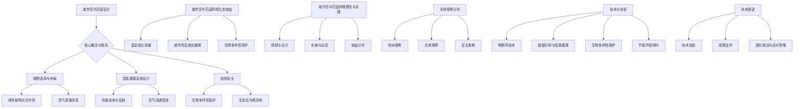

                 

### 第1章 引言

#### 1.1 城市化与绿色生态系统的挑战

城市化是现代化进程的重要组成部分，然而，随着城市人口的快速增长和城市规模的不断扩张，城市生态环境面临着前所未有的挑战。传统的绿色生态系统在城市中逐渐被高楼大厦、沥青道路和硬质铺装所取代，城市绿地面积减少，生态系统服务功能降低。这种状况不仅影响了城市居民的生活质量，也对全球气候变化和生物多样性保护构成了威胁。

首先，城市化进程导致了大量的森林砍伐和土地开发，破坏了自然生态系统。这不仅减少了生态系统的生物多样性，也降低了生态系统的稳定性。其次，城市中的高密度人口和工业活动产生了大量的二氧化碳和其他温室气体，加剧了全球气候变化。同时，城市的热岛效应使得城市温度比周围郊区高，导致能源消耗增加，空气污染加剧。

为了应对这些挑战，越来越多的城市开始探索新的绿色生态系统解决方案，其中城市空中花园网络作为一种创新的绿色基础设施，受到了广泛关注。

#### 1.2 新型城市空中花园的概念与优势

新型城市空中花园是指在城市屋顶、阳台、墙面等空间中，通过种植绿色植物、建立水循环系统和设置生态设施，形成的具有多种生态功能的绿色空间。这种空中花园不仅为城市居民提供了绿色休憩空间，还具备改善城市生态环境的多重优势。

首先，城市空中花园能够显著提高城市绿化覆盖率，增加城市生物多样性。通过在建筑物上方种植各类植物，可以创造出丰富的生态系统，吸引各种鸟类和昆虫，形成一个微型的自然生态圈。其次，空中花园能够有效降低城市温度，缓解热岛效应。植物通过蒸腾作用带走热量，同时屋顶的绿化材料能够反射部分太阳辐射，减少热量吸收。此外，城市空中花园还能够改善空气质量。植物可以吸收二氧化碳，释放氧气，同时吸附空气中的颗粒物和有害物质，从而降低空气污染水平。

#### 1.3 空中花园网络在生态系统中的作用

城市空中花园网络作为一种新型绿色基础设施，具有以下重要作用：

首先，空中花园网络能够连接不同的绿色空间，形成一个连续的生态系统。通过在多个建筑物屋顶和公共空间中建立空中花园，可以形成一个覆盖全城的绿色网络，促进城市生物的迁徙和生态系统的连通性。其次，空中花园网络能够提供多样化的生态服务。例如，通过设置雨水收集系统，可以有效地收集和利用雨水，减少城市排水压力。此外，空中花园还可以作为城市微气候调节器，通过植物的蒸腾作用和屋顶的隔热效果，改善城市的气候条件。

总之，新型城市空中花园网络不仅为城市居民带来了美观的视觉享受，还在提升城市生态环境质量、减缓城市热岛效应、保护生物多样性等方面发挥着重要作用。随着技术的不断进步和政策的支持，城市空中花园网络有望成为未来城市绿色生态系统的重要组成部分。

## 第2章 城市空中花园的设计与构建

#### 2.1 城市空中花园的设计原则

城市空中花园的设计需要综合考虑多个因素，以确保其能够充分发挥生态效益，同时满足美观和安全等要求。以下是一些关键的设计原则：

**1. 绿色植物的选择与布局**

选择适宜的植物是城市空中花园设计的第一步。植物的选择应考虑其适应性和生态效益。常见的植物种类包括草坪、灌木、花卉和攀缘植物等。不同植物在空中花园中的布局应合理，以形成多样化的生态系统。例如，可以选择在屋顶边缘种植草坪和花卉，中间区域种植灌木和攀缘植物，以增加绿化覆盖率。

**2. 智能灌溉系统的设计**

智能灌溉系统是城市空中花园的重要组成部分，它能够根据植物的需求和天气条件自动调节灌溉量。设计智能灌溉系统时，应考虑以下几个方面：
- **传感器监测**：安装温度、湿度、光照和土壤水分传感器，实时监测植物生长环境。
- **灌溉方式**：选择合适的灌溉方式，如滴灌、喷灌或渗灌，以提高水资源的利用效率。
- **节水措施**：利用雨水收集系统、废水再利用系统等，减少自来水的使用。

**3. 空中花园的结构安全**

城市空中花园的建设必须在确保结构安全的基础上进行。以下是一些关键的安全设计要点：
- **屋顶承重**：确保屋顶能够承受绿化材料、植物重量以及可能的额外负荷。
- **防水措施**：安装防水层和排水系统，防止水分渗入建筑物内部。
- **防风固定**：使用坚固的支架和固定装置，防止植物和设施在强风中倒塌。

**4. 绿色植物的选择与布局**

选择适宜的植物是城市空中花园设计的第一步。植物的选择应考虑其适应性和生态效益。常见的植物种类包括草坪、灌木、花卉和攀缘植物等。不同植物在空中花园中的布局应合理，以形成多样化的生态系统。例如，可以选择在屋顶边缘种植草坪和花卉，中间区域种植灌木和攀缘植物，以增加绿化覆盖率。

**5. 智能灌溉系统的设计**

智能灌溉系统是城市空中花园的重要组成部分，它能够根据植物的需求和天气条件自动调节灌溉量。设计智能灌溉系统时，应考虑以下几个方面：
- **传感器监测**：安装温度、湿度、光照和土壤水分传感器，实时监测植物生长环境。
- **灌溉方式**：选择合适的灌溉方式，如滴灌、喷灌或渗灌，以提高水资源的利用效率。
- **节水措施**：利用雨水收集系统、废水再利用系统等，减少自来水的使用。

**6. 空中花园的结构安全**

城市空中花园的建设必须在确保结构安全的基础上进行。以下是一些关键的安全设计要点：
- **屋顶承重**：确保屋顶能够承受绿化材料、植物重量以及可能的额外负荷。
- **防水措施**：安装防水层和排水系统，防止水分渗入建筑物内部。
- **防风固定**：使用坚固的支架和固定装置，防止植物和设施在强风中倒塌。

#### 2.2 城市空中花园的构建方法

构建城市空中花园是一项系统工程，需要从多个方面进行规划和实施。以下是一些关键步骤和方法：

**1. 屋顶改造技术**

- **屋顶结构评估**：在开始改造之前，需要对屋顶的结构安全进行评估，以确保其能够承受绿化材料的重量。
- **屋顶防水处理**：安装防水层和排水系统，防止水分渗入建筑物内部。
- **屋顶绿化层**：在屋顶上铺设绿化层，包括土壤、排水层和保温层等。

**2. 绿色植物种植技巧**

- **植物选择**：根据屋顶的阳光、湿度等条件，选择适宜的植物种类。常见的植物包括草坪、灌木和攀缘植物等。
- **种植方法**：采用容器种植或直接种植，容器种植可以灵活调整植物布局，直接种植则能更好地融入屋顶环境。
- **植被覆盖**：在种植过程中，注意植被的覆盖率和分布，以形成稳定的生态系统。

**3. 空中花园维护与管理**

- **定期维护**：定期修剪植物、清理杂草、检查灌溉系统，确保植物健康生长。
- **病虫害防治**：针对可能出现的病虫害，采取相应的防治措施，如喷洒农药、使用生物防治方法等。
- **环境监测**：通过传感器监测温度、湿度等环境参数，及时调整灌溉和施肥计划。

### 2.2.1 屋顶改造技术

**1. 屋顶结构评估**

在进行屋顶改造之前，首先需要对屋顶的结构进行全面的评估。这包括检查屋顶的承重能力、防水性能和整体稳定性。通过专业检测，可以确保屋顶能够承受绿化材料及植物的重量。如果发现结构问题，需要采取相应的加固措施，如增加屋顶梁、加固防水层等。

**2. 屋顶防水处理**

防水处理是屋顶改造的关键步骤。在铺设绿化层之前，需要安装防水层和排水系统。防水层应选用高质量的防水材料，确保其具有良好的耐久性和防水性能。排水系统应设计合理，以便及时排除屋顶积水，防止水分渗入建筑物内部。

**3. 屋顶绿化层**

屋顶绿化层的设计和施工需要考虑多个方面，包括土壤层、排水层和保温层。土壤层应选用轻质、透水和透气的材料，如有机土壤混合物，以提供植物生长所需的养分。排水层应选用透水性良好的材料，如砾石或膨润土，以确保水分能够迅速排出。保温层则用于减少屋顶的热量吸收，降低室内温度，提高能源效率。

### 2.2.2 绿色植物种植技巧

**1. 植物选择**

植物的选择应考虑屋顶的阳光、湿度、风向等环境因素。适宜的植物种类包括草坪、灌木和攀缘植物等。草坪适合在阳光充足的区域种植，灌木适合在半阴半阳的区域，而攀缘植物则适合在墙面和屋顶边缘种植。此外，还应考虑植物的耐旱性和抗风性，以确保植物在恶劣环境下的生长。

**2. 种植方法**

植物种植可以采用容器种植或直接种植。容器种植具有灵活性，可以根据需要调整植物布局，同时也便于维护和管理。直接种植则能更好地融入屋顶环境，形成自然的绿化效果。在种植过程中，应确保植物根部有足够的土壤覆盖，并保持土壤的湿润。

**3. 植被覆盖**

植被覆盖是空中花园设计的重要一环。合理的植被覆盖率能够提高生态系统的稳定性和美观度。一般而言，屋顶植被覆盖率应控制在30%-50%之间，以避免过高的植被密度影响植物的采光和通风。植被的分布也应合理，避免局部过度密集或稀疏。

### 2.2.3 空中花园维护与管理

**1. 定期维护**

定期维护是确保空中花园健康生长的关键。维护工作包括修剪植物、清理杂草、检查灌溉系统和排水系统等。修剪植物能够保持美观度，同时也有助于促进植物的生长。清理杂草可以减少植物与杂草之间的竞争，提高植物的生长质量。检查灌溉系统和排水系统则可以确保其正常运行，防止因故障导致植物受损。

**2. 病虫害防治**

空中花园容易受到病虫害的侵袭，因此病虫害防治是维护工作的重点。常见的病虫害防治方法包括喷洒农药、使用生物防治方法和使用有机肥料等。喷洒农药应选用高效低毒的药剂，并注意安全使用。生物防治方法则利用天敌昆虫等生物来控制病虫害，具有环保、长效的特点。使用有机肥料可以提高植物的免疫力，减少病虫害的发生。

**3. 环境监测**

通过传感器监测温度、湿度、光照等环境参数，可以及时了解空中花园的生长状况。当环境参数出现异常时，可以及时调整灌溉和施肥计划，确保植物的健康生长。例如，当温度过高或过低时，可以启动喷雾系统降温或加热，以维持适宜的生长环境。

通过以上步骤和技巧，可以构建一个健康、美观、生态效益显著的城市空中花园。定期的维护与管理则是确保空中花园长期发挥作用的关键。

## 第3章 城市空中花园的生态效益

#### 3.1 温室效应的减缓

城市空中花园在减缓温室效应方面发挥着重要作用。植物通过光合作用吸收二氧化碳，并释放氧气，从而降低大气中的二氧化碳浓度。具体而言，植物通过叶绿素在光照条件下将二氧化碳和水转化为葡萄糖和氧气。这个过程不仅有助于减少温室气体的排放，还能提高空气质量。

根据研究数据，每平方米草坪每年可以吸收约15公斤的二氧化碳。而一个中型城市空中花园，如果覆盖面积为1000平方米，每年可以吸收150吨的二氧化碳。这一数字相当于减少约50辆小汽车的二氧化碳排放量。此外，空中花园还可以通过减少建筑物表面的热量吸收，降低城市温室效应的影响。

#### 3.1.1 植物的光合作用

植物的光合作用是城市空中花园减缓温室效应的核心机制。光合作用的过程可以简化为以下化学方程式：

$$
6CO_2 + 6H_2O + 光能 → C_6H_{12}O_6 + 6O_2
$$

这个方程式表明，植物在吸收二氧化碳和水的同时，利用光能将它们转化为葡萄糖和氧气。葡萄糖是植物生长所需的能量和营养来源，而氧气则释放到大气中，改善空气质量。

#### 3.1.2 空气质量的改善

城市空气污染是一个全球性问题，而城市空中花园在改善空气质量方面具有显著的效果。植物不仅能够吸收二氧化碳，还能通过蒸腾作用和吸附作用去除空气中的有害物质。例如，植物可以吸附空气中的颗粒物、二氧化硫和氮氧化物等有害气体，从而降低空气污染水平。

一项研究表明，每平方米的植物叶面积每天可以吸附约30克的灰尘颗粒。在一个中型城市空中花园中，植物吸附的灰尘颗粒总量可以达到每天数公斤。这种吸附作用不仅有助于减少空气污染，还能改善城市居民的生活环境。

#### 3.2 城市热岛效应的缓解

城市热岛效应是指城市中心区域相对于周边郊区温度明显升高的现象。城市热岛效应不仅增加了能源消耗，还影响了城市居民的生活质量和健康。城市空中花园通过植被的蒸腾作用和反射作用，可以有效缓解城市热岛效应。

#### 3.2.1 热量吸收与反射

植物通过蒸腾作用吸收热量，并将其释放到大气中。这一过程不仅降低了植物表面的温度，还有助于降低周围环境的温度。例如，研究数据显示，植被覆盖率较高的城市区域，地表温度可以降低2-5摄氏度。

此外，植物表面的叶片和枝干能够反射部分太阳辐射，减少热量吸收。例如，草坪和灌木的反射率可以达到15%-25%，而普通建筑物的反射率仅为5%-10%。这种反射作用有助于降低建筑物表面的温度，从而缓解城市热岛效应。

#### 3.2.2 空气流通的促进

城市空中花园还可以通过促进空气流通，进一步缓解城市热岛效应。植物的蒸腾作用和风的作用可以增加空气的流动性，从而降低空气温度。例如，在一项研究中，植物覆盖的屋顶区域，空气温度可以比未覆盖的屋顶区域低3-5摄氏度。

空气流通还可以有效减少建筑物周围的尘土和污染物，提高空气质量。这对于城市居民的健康和生活质量具有重要意义。

#### 3.3 生物多样性的保护

城市空中花园不仅提供了绿色的视觉享受，还在保护城市生物多样性方面发挥着重要作用。通过在建筑物屋顶和墙壁上种植多样化的植物，可以创造出丰富的生态系统，为各种动植物提供栖息地。

#### 3.3.1 物种多样性

城市空中花园为不同物种提供了适宜的栖息环境，从而促进了物种多样性。例如，一些攀缘植物为昆虫提供了栖息和繁殖的场所，而一些灌木和花卉则为鸟类提供了食物和栖息地。

#### 3.3.2 生态位与栖息地

城市空中花园网络通过连接不同的绿色空间，形成了一个连续的生态系统。这种连续性有助于动植物的迁徙和栖息地的扩展，从而增强了生态系统的稳定性。例如，城市中的鸟类可以通过空中花园网络在不同建筑物间迁徙，寻找适宜的栖息地和食物来源。

总之，城市空中花园在减缓温室效应、改善空气质量和缓解城市热岛效应等方面具有显著效益。同时，它还为城市生物多样性提供了保护，为城市居民带来了绿色、健康和宜居的生活环境。

### 3.2 城市热岛效应的缓解

城市热岛效应是指城市中心区域的气温比周围郊区明显升高的现象。这种现象主要是由于城市中的建筑物、道路和其他硬质铺装材料对太阳辐射的吸收和热量的积累所引起的。城市空中花园通过植被的蒸腾作用和反射作用，可以有效缓解城市热岛效应，从而改善城市居民的居住环境。

#### 3.2.1 热量吸收与反射

植物通过蒸腾作用吸收热量，并将热量释放到大气中。这个过程不仅降低了植物表面的温度，还有助于降低周围环境的温度。植物的叶片和枝干表面可以反射部分太阳辐射，减少建筑物表面的热量吸收。例如，草坪和灌木的反射率可以达到15%-25%，而普通建筑物的反射率仅为5%-10%。这种反射作用有助于降低建筑物表面的温度，从而缓解城市热岛效应。

一项研究显示，在城市中，通过在建筑物屋顶种植植被，可以使屋顶表面温度降低3-5摄氏度。这不仅有助于降低建筑物内部的温度，还可以减少空调的使用，从而节约能源。

#### 3.2.2 空气流通的促进

城市空中花园还可以通过促进空气流通，进一步缓解城市热岛效应。植物的蒸腾作用和风的作用可以增加空气的流动性，从而降低空气温度。例如，在一项研究中，植物覆盖的屋顶区域，空气温度可以比未覆盖的屋顶区域低3-5摄氏度。

空气流通还可以有效减少建筑物周围的尘土和污染物，提高空气质量。这对于城市居民的健康和生活质量具有重要意义。此外，植物还可以通过降低风速，减少建筑物之间的空气流动，从而减少热量的传递。

#### 3.2.3 水循环的调节

城市空中花园中的植物和土壤可以吸收和储存水分，从而调节城市的水循环。植物通过蒸腾作用将水分释放到大气中，增加大气湿度，有助于冷却空气。此外，植物和土壤可以减缓雨水径流，减少城市排水系统的负荷。

一项研究显示，在城市中，通过增加绿地面积，可以减少地表径流量30%-50%。这种调节作用有助于维持城市的水资源，减少城市洪水的发生。

#### 3.2.4 城市微气候的改善

城市空中花园可以通过改善城市微气候，进一步缓解城市热岛效应。植物的蒸腾作用和遮荫作用可以降低地面和建筑物的温度，减少热量的积累。此外，植物还可以通过降低风速，减少建筑物之间的空气流动，从而减少热量的传递。

一项研究表明，在城市中心区域，通过增加绿地面积，可以使地表温度降低2-5摄氏度，空气温度降低1-3摄氏度。这种改善作用对于提高城市居民的生活质量具有重要意义。

总之，城市空中花园通过热量吸收与反射、空气流通的促进、水循环的调节和城市微气候的改善等多方面作用，可以有效缓解城市热岛效应。这不仅有助于提高城市居民的生活质量，还可以减少能源消耗，降低城市的环境负担。

### 3.3 生物多样性的保护

城市空中花园在保护城市生物多样性方面发挥着重要作用。城市生态系统通常较为单一，生物多样性较低，而空中花园通过提供多样化的植物和栖息地，为城市中的动植物创造了有利的生存条件。

#### 3.3.1 物种多样性

城市空中花园中种植的植物种类丰富，包括草坪、灌木、花卉和攀缘植物等。不同种类的植物能够吸引不同种类的昆虫、鸟类和其他动物，从而丰富了城市的生物多样性。例如，一些攀缘植物可以为昆虫提供栖息和繁殖的场所，而一些灌木和花卉则可以成为鸟类和蝴蝶的食物来源。

#### 3.3.2 生态位与栖息地

生态位是指一个物种在其生态系统中占据的位置，包括食物来源、栖息地和其他生态条件。城市空中花园通过提供多样化的植物和栖息地，为不同物种创造了不同的生态位。例如，一些植物为昆虫提供了食物和栖息地，而另一些植物则为鸟类提供了栖息地和繁殖场所。

这种多样化的生态位有助于城市生物的稳定性和多样性。当一个生态系统面临干扰或变化时，多样化的生态位可以提供更多的适应性选择，有助于物种的生存和繁衍。

#### 3.3.3 种子传播与迁徙

城市空中花园中的植物不仅可以为本地物种提供栖息地，还可以成为种子传播和迁徙的媒介。植物通过风、昆虫和其他动物传播种子，从而扩大其分布范围。这种种子传播和迁徙过程有助于城市生物多样性的维持和扩展。

例如，一些植物种子可以通过风力传播到附近的建筑物和其他绿色空间，从而为这些地区引入新的植物种类。此外，一些植物种子可以随着动物的活动传播，为城市中的不同区域引入新的物种。

#### 3.3.4 城市与自然生态系统的连接

城市空中花园不仅为城市中的生物提供了栖息地，还起到了连接城市与自然生态系统的作用。通过空中花园网络，城市生物可以与郊区的自然生态系统相互连通，从而增强城市生态系统的稳定性和多样性。

例如，一些鸟类和昆虫可以通过空中花园网络在不同建筑物之间迁徙，寻找适宜的栖息地和食物来源。这种连接作用有助于维持城市生态系统的连续性和完整性。

总之，城市空中花园通过提供多样化的植物和栖息地，为城市生物多样性保护提供了重要支持。它不仅丰富了城市的生物多样性，还有助于维持城市生态系统的稳定性和健康。随着城市空中花园网络的不断扩展和完善，城市与自然生态系统的连接将更加紧密，为城市居民带来更加绿色、健康和宜居的生活环境。

## 第4章 城市空中花园网络：理论与实践

### 4.1 城市空中花园网络的概念

城市空中花园网络是指在城市中通过多个建筑物屋顶、阳台、墙壁等空间种植绿色植物，建立连续的绿色生态空间，形成一个覆盖全城的空中绿化网络。这种网络不仅为城市居民提供了绿色休闲空间，还具备改善城市生态环境、缓解城市热岛效应、增加生物多样性等多种生态效益。

#### 4.1.1 网络结构

城市空中花园网络的结构设计需要考虑多个方面，包括网络节点（建筑物）、连接路径（空中花园）和网络核心（生态系统）。网络节点是城市空中花园的基础，每个节点可以是单个建筑物或一组建筑物。连接路径则是连接不同节点的空中花园，通过这些路径，植物和动物可以在城市中自由迁徙，形成一个连续的生态网络。网络核心是指整个城市空中花园网络的中心区域，通常是城市公园或绿地，为网络提供生态支持。

#### 4.1.2 网络功能

城市空中花园网络具有多种功能，主要包括以下几个方面：

- **生态功能**：通过建立连续的生态空间，城市空中花园网络可以提供栖息地、食物链和生态位，促进城市生物多样性的保护和恢复。
- **环境功能**：空中花园网络通过植被的蒸腾作用和反射作用，可以降低城市温度，缓解热岛效应，改善空气质量，减少城市排水系统的负荷。
- **社会功能**：城市空中花园网络为城市居民提供了休闲、娱乐和社交的场所，提升了城市生活质量。

### 4.2 城市空中花园网络的构建

构建城市空中花园网络是一项复杂且系统的工程，需要从规划、设计、实施和运营等多个方面进行综合考虑。以下是一些关键步骤和方法：

#### 4.2.1 规划与设计

- **环境评估**：在进行城市空中花园网络的规划之前，需要对城市的环境、气候、生物多样性等基本情况进行全面评估，以确定空中花园网络的布局和规模。
- **网络布局**：根据环境评估结果，设计城市空中花园网络的布局，包括网络节点和连接路径。布局应充分考虑城市现有绿地、公园和自然保护区等自然空间，以确保生态系统的连续性和完整性。
- **设计标准**：制定城市空中花园网络的设计标准，包括植物选择、土壤层厚度、灌溉系统、结构安全等。设计标准应确保空中花园具备良好的生态效益和可持续性。

#### 4.2.2 实施与运营

- **施工准备**：在实施阶段，需要进行屋顶结构评估、防水处理、绿化层施工等准备工作。施工过程中，应严格按照设计标准进行操作，确保施工质量。
- **植物种植**：选择适宜的植物进行种植，确保植物能够适应城市环境。在种植过程中，应注意植被的覆盖率和分布，以形成稳定的生态系统。
- **智能灌溉系统**：安装智能灌溉系统，根据植物的需求和天气条件自动调节灌溉量。智能灌溉系统能够提高水资源的利用效率，减少浪费。
- **维护与管理**：定期进行空中花园的维护和管理，包括修剪植物、清理杂草、检查灌溉系统等。维护工作应确保空中花园的健康生长和生态效益的持续发挥。

### 4.3 城市空中花园网络的效益分析

城市空中花园网络在生态、经济和社会等方面具有显著效益，以下分别进行详细分析：

#### 4.3.1 经济效益

- **降低城市基础设施成本**：通过城市空中花园网络，可以减少城市绿化带的面积，降低绿化带的建设和维护成本。同时，空中花园还可以利用废弃屋顶空间，提高土地利用效率。
- **提高房地产价值**：城市空中花园网络改善了城市生态环境，提升了城市形象，有助于提高房地产价值。许多研究表明，拥有绿色景观的住宅或商业建筑，其售价或租金往往较高。
- **促进旅游业发展**：城市空中花园网络为城市带来了独特的绿色景观，吸引了大量游客，促进了旅游业的发展，增加了城市财政收入。

#### 4.3.2 社会效益

- **提高城市生活质量**：城市空中花园网络提供了绿色休闲空间，改善了城市居民的生活环境，提升了居民的生活质量。
- **促进社区互动**：空中花园可以作为社区活动的场所，促进居民之间的交流和互动，增强社区凝聚力。
- **心理健康益处**：研究表明，接触绿色植物和自然景观可以改善人们的心理健康，减少压力和焦虑。城市空中花园网络为城市居民提供了亲近自然的机会，有助于提高心理健康水平。

#### 4.3.3 环境效益

- **改善空气质量**：城市空中花园网络通过植物的蒸腾作用和吸附作用，可以显著降低空气中的二氧化碳和其他污染物浓度，改善空气质量。
- **减缓城市热岛效应**：空中花园通过植被的蒸腾作用和反射作用，可以降低城市温度，缓解热岛效应，减少能源消耗。
- **保护生物多样性**：城市空中花园网络为城市生物提供了栖息地和食物来源，有助于保护城市生物多样性，恢复生态系统功能。

总之，城市空中花园网络在生态、经济和社会等方面具有显著效益。随着技术的进步和政策的支持，城市空中花园网络有望成为未来城市绿色生态系统的重要组成部分，为城市居民带来更加绿色、健康和宜居的生活环境。

### 4.2.1 规划与设计

城市空中花园网络的构建首先需要从宏观层面进行规划与设计，确保整体布局的科学性和合理性。以下是从多个角度进行规划的详细步骤：

**1. 基本数据收集与分析**

- **城市气候分析**：收集城市历年气象数据，包括温度、湿度、降雨量、风速等，分析城市微气候特征，为植物选择和灌溉系统设计提供依据。
- **生物多样性调查**：调查城市现有生物种类和分布情况，识别潜在的栖息地和食物来源，确保空中花园网络对本地生物多样性的保护和提升。
- **建筑结构评估**：对目标建筑物进行结构安全评估，包括屋顶承重能力、防水性能等，为空中花园的设计和安全保障提供基础数据。

**2. 空中花园布局**

- **网络节点规划**：根据建筑物结构和功能，选择适宜的节点进行空中花园建设。优先考虑公共建筑、公园、学校和商业建筑等，形成网络核心节点。
- **连接路径设计**：设计空中花园之间的连接路径，确保网络连通性和覆盖面。路径应尽量选择直线或近似直线，以减少能源消耗和灌溉成本。
- **生态连通性**：在规划中考虑生态连通性，确保不同建筑物间的空中花园可以形成连续的生态系统，促进生物迁徙和生态互动。

**3. 绿色植物选择**

- **植物适应性评估**：根据城市气候和建筑特点，选择适宜的植物种类。植物应具备良好的耐旱性、抗风性和适应城市环境的能力。
- **多样性考虑**：在植物选择上注重多样性，包括草坪、灌木、花卉和攀缘植物等，以提供多种生态位和食物来源，促进生物多样性。

**4. 智能系统设计**

- **传感器布局**：在空中花园中布置温度、湿度、光照和土壤水分传感器，实时监测环境参数，为智能灌溉和温室控制提供数据支持。
- **灌溉系统**：设计智能灌溉系统，采用滴灌、喷灌或渗灌等方式，根据实时监测数据自动调节灌溉量，提高水资源利用效率。
- **温室控制**：对于部分特殊植物或季节，可以设计温室控制系统，通过调节光照、温度和湿度等参数，为植物提供最佳生长环境。

**5. 安全与维护**

- **结构安全性**：在屋顶结构评估基础上，采取加固措施，确保屋顶能够承受绿化材料和植物重量。
- **防水处理**：安装高质量的防水层和排水系统，防止水分渗入建筑物内部，保证屋顶长期稳定。
- **定期维护**：制定空中花园的维护计划，包括修剪、浇水、施肥和病虫害防治等，确保植物健康生长和生态系统的稳定运行。

通过以上步骤，可以构建一个科学合理、生态效益显著的城市空中花园网络，为城市居民提供绿色、健康的生活环境。

### 4.2.2 实施与运营

实施与运营是城市空中花园网络建设的关键环节，决定了空中花园的实际效果和长期可持续性。以下是具体实施与运营的详细步骤：

**1. 施工准备**

- **屋顶结构加固**：对目标建筑物的屋顶进行结构检测，针对承重不足的情况进行加固，确保屋顶能够承受绿化材料和植物重量。加固措施可能包括增加支撑梁、铺设加固层等。
- **防水处理**：在屋顶上铺设高质量的防水层，形成防水隔离层，防止水分渗透到建筑物内部。防水层应具备良好的耐久性和抗紫外线性能。
- **绿化层施工**：根据设计要求，铺设绿化层，包括土壤层、排水层和保温层。土壤层应选择轻质、透水和透气的材料，排水层应选用透水性良好的材料，保温层则用于减少热量吸收和保持土壤温度。

**2. 植物种植**

- **植物选择**：根据气候特点和设计要求，选择适宜的植物种类。优先考虑本地植物，以提高适应性和生存率。植物种类应涵盖草坪、灌木、花卉和攀缘植物等，以形成多样化的生态系统。
- **种植方式**：采用容器种植或直接种植，容器种植便于调整植物布局和后期维护，直接种植则能与屋顶环境更好地融合。种植时，应确保植物根系有足够的土壤覆盖，同时保持土壤的湿润。

**3. 智能灌溉系统安装**

- **传感器布置**：在空中花园中布置温度、湿度、光照和土壤水分传感器，实时监测植物生长环境。传感器应布置在合理位置，确保数据的准确性和全面性。
- **灌溉系统设计**：根据监测数据，设计智能灌溉系统，选择滴灌、喷灌或渗灌等方式。智能灌溉系统能够根据植物需求自动调节灌溉量，提高水资源的利用效率。灌溉系统应具备远程控制功能，便于后期维护和管理。

**4. 管理与维护**

- **定期修剪**：定期修剪植物，保持植物美观度和健康生长。修剪时应注意植物的形态和生长周期，避免过度修剪影响植物生长。
- **病虫害防治**：定期检查植物病虫害，采取喷洒农药、使用生物防治方法或有机肥料等措施进行防治。病虫害防治应遵循环保原则，减少对环境和人体健康的负面影响。
- **环境监测**：利用传感器监测温度、湿度、光照等环境参数，及时调整灌溉和施肥计划，确保植物健康生长。环境监测数据应实时上传到管理系统，便于管理人员进行远程监控和决策。

**5. 用户体验与反馈**

- **设施完善**：为城市居民提供舒适的空中花园休闲空间，包括休息座椅、绿化景观、儿童娱乐设施等。设施应定期检查和维护，确保安全和使用便利。
- **居民参与**：鼓励居民参与空中花园的维护和管理，通过志愿服务、植物种植活动等方式，增强居民的环保意识和参与感。居民的反馈和意见可以为空中花园的优化提供重要参考。

通过科学的实施和严格的运营管理，城市空中花园网络可以长期发挥其生态效益，为城市居民提供绿色、健康的生活环境。

### 4.3 城市空中花园网络的效益分析

城市空中花园网络不仅在生态保护方面发挥着重要作用，同时在经济效益和社会效益方面也展现出显著的潜力。以下从经济、社会和环境三个方面，详细分析城市空中花园网络的效益。

#### 4.3.1 经济效益

**1. 降低城市基础设施成本**

城市空中花园网络可以减少传统城市绿化带的面积，降低绿化带的建设和维护成本。传统绿化带需要大面积的土地，而城市空中花园则利用建筑物的闲置空间，实现了绿化面积的最大化。此外，空中花园的灌溉和养护成本相对较低，智能灌溉系统的应用提高了水资源的利用效率，进一步减少了维护费用。

**2. 提高房地产价值**

城市空中花园网络改善了城市生态环境，提升了城市形象，这对于房地产价值有着积极的影响。研究表明，拥有绿色景观的住宅或商业建筑，其售价或租金往往较高。例如，某些城市中心区域的房地产项目，由于配备了空中花园，房价比无绿化项目的房价高出10%-20%。

**3. 促进旅游业发展**

城市空中花园网络为城市带来了独特的绿色景观，吸引了大量游客，促进了旅游业的发展。游客数量的增加带来了旅游消费，直接增加了城市的财政收入。例如，一些城市已经将空中花园作为旅游亮点，推出了相关的旅游路线和活动，吸引了大量国内外游客。

#### 4.3.2 社会效益

**1. 提高城市生活质量**

城市空中花园网络提供了绿色休闲空间，改善了城市居民的生活环境，提升了生活质量。居民可以在空中花园中休闲娱乐，享受自然美景，减轻生活和工作压力。研究表明，接触绿色植物和自然景观可以改善人们的心理健康，减少压力和焦虑。因此，城市空中花园网络有助于提高城市居民的心理健康水平和生活幸福感。

**2. 促进社区互动**

空中花园可以作为社区活动的场所，促进居民之间的交流和互动，增强社区凝聚力。例如，一些城市空中花园定期举办社区活动，如园艺讲座、植树节、户外运动等，吸引了大量居民参与。这些活动不仅增强了居民的社交联系，还提高了居民的环保意识。

**3. 教育和文化价值**

城市空中花园网络具有丰富的教育和文化价值。学校和教育机构可以利用空中花园进行自然教育和生态教育，让学生了解植物的生长过程和生态环境。此外，空中花园还可以作为城市文化的一部分，展示城市的绿色发展和生态理念，提升城市的文化品位和软实力。

#### 4.3.3 环境效益

**1. 改善空气质量**

城市空中花园网络通过植物的蒸腾作用和吸附作用，可以显著降低空气中的二氧化碳和其他污染物浓度，改善空气质量。植物能够吸收空气中的有害气体，如二氧化硫、氮氧化物和颗粒物等，从而减少空气污染。研究表明，每平方米的植物叶面积每天可以吸附约30克的灰尘颗粒，一个中等规模的空中花园每天可以吸附大量的灰尘颗粒，显著改善空气质量。

**2. 缓解城市热岛效应**

空中花园通过植被的蒸腾作用和反射作用，可以降低城市温度，缓解热岛效应。植物的蒸腾作用可以带走热量，减少建筑物表面的热量吸收，同时植物表面的叶片和枝干可以反射部分太阳辐射，减少热量积累。研究数据显示，植被覆盖率较高的城市区域，地表温度可以降低2-5摄氏度，有助于减少城市能源消耗。

**3. 保护生物多样性**

城市空中花园网络为城市生物提供了栖息地和食物来源，有助于保护城市生物多样性。通过种植多样化的植物，空中花园可以吸引各种昆虫、鸟类和其他动物，形成一个微型的自然生态圈。这种生态圈的建立不仅丰富了城市的生物多样性，还有助于维持城市生态系统的稳定性和健康。

总之，城市空中花园网络在生态、经济和社会等方面具有显著效益。随着技术的进步和政策的支持，城市空中花园网络有望成为未来城市绿色生态系统的重要组成部分，为城市居民带来更加绿色、健康和宜居的生活环境。

## 第5章 城市空中花园网络：全球案例分析

城市空中花园网络在全球范围内得到了广泛的关注和实践，许多城市通过具体的案例展示了这一创新绿色基础设施的成效。以下是对欧洲、北美和亚太地区部分城市空中花园网络的案例分析和总结。

### 5.1 欧洲城市空中花园案例

**5.1.1 巴塞罗那**

巴塞罗那被誉为全球空中花园的先锋城市，其城市空中花园网络发展迅速，被誉为“绿色屋顶之都”。巴塞罗那的空中花园不仅分布在公共建筑和住宅小区，还涵盖了商业和工业建筑。例如，巴塞罗那市政厅的屋顶花园采用了多种植被，形成了一个生态多样化的绿色空间。此外，巴塞罗那市政府还制定了《巴塞罗那绿色屋顶计划》，鼓励私人企业和公共机构在建筑屋顶上种植植物，以提升城市绿化水平。

**成效分析**：
- **生态效益**：巴塞罗那的空中花园网络显著改善了城市微气候，降低了城市温度，减少了空气污染。
- **社会效益**：空中花园成为了市民休闲娱乐的好去处，提升了居民的生活质量。
- **经济效益**：通过降低能源消耗和改善城市环境，空中花园项目为巴塞罗那带来了显著的经济收益。

**5.1.2 慕尼黑**

慕尼黑是德国的一个环保先锋城市，其空中花园网络在绿色建筑和可持续发展方面有着卓越的成就。慕尼黑许多建筑屋顶都配备了绿色植物，不仅美化了城市景观，还提高了建筑物的能源效率。例如，慕尼黑工业大学的一栋教学楼屋顶上，种植了各种本地植物，形成了一个生态花园。

**成效分析**：
- **生态效益**：慕尼黑的空中花园有效地减缓了城市热岛效应，改善了空气质量。
- **社会效益**：空中花园为城市居民提供了亲近自然的机会，增强了社区凝聚力。
- **经济效益**：通过节约能源和减少废物处理成本，空中花园项目为慕尼黑带来了经济上的双赢。

### 5.2 北美城市空中花园案例

**5.2.1 纽约**

纽约作为全球最大的城市之一，其空中花园网络在改善城市生态环境方面起到了积极作用。纽约市推出了“城市绿化计划”，鼓励在建筑屋顶上种植植物。例如，纽约市立大学的校园内，许多建筑的屋顶上都覆盖着绿色植被，形成了一个生态网络。

**成效分析**：
- **生态效益**：纽约的空中花园显著降低了城市热岛效应，改善了空气质量，增加了生物多样性。
- **社会效益**：空中花园为城市居民和游客提供了一个与自然亲近的场所，提升了城市的文化和旅游价值。
- **经济效益**：通过节约能源和减少城市基础设施成本，空中花园项目为纽约带来了显著的经济效益。

**5.2.2 多伦多**

多伦多通过其“绿色屋顶计划”推动城市空中花园的发展，成为全球绿色建筑的典范。多伦多的许多公共建筑和私人住宅都采用了绿色屋顶技术，例如多伦多市政厅和安大略美术馆的屋顶上，都种植了丰富的植物。

**成效分析**：
- **生态效益**：多伦多的空中花园有效地减缓了城市热岛效应，改善了空气质量，保护了生物多样性。
- **社会效益**：空中花园提升了城市居民的生活质量，为社区提供了一个公共休闲空间。
- **经济效益**：通过节约能源和减少废物处理成本，空中花园项目为多伦多带来了显著的经济效益。

### 5.3 亚太地区城市空中花园案例

**5.3.1 东京**

东京作为亚太地区的经济中心，其城市空中花园网络在应对城市环境挑战方面发挥了重要作用。东京的许多高楼大厦都配备了绿色屋顶，如东京晴空塔的屋顶花园，不仅提供了城市绿地，还成为了东京的一个标志性景点。

**成效分析**：
- **生态效益**：东京的空中花园显著降低了城市热岛效应，改善了空气质量，增加了城市绿化覆盖率。
- **社会效益**：空中花园为城市居民提供了休闲娱乐的场所，增强了城市的文化氛围。
- **经济效益**：通过节约能源和减少城市基础设施成本，空中花园项目为东京带来了显著的经济效益。

**5.3.2 新加坡**

新加坡以其先进的城市规划和绿色基础设施而闻名，其空中花园网络是其生态城市理念的重要组成部分。例如，滨海湾花园是一个集多种空中花园和温室为一体的生态景点，成为了新加坡的标志性景点。

**成效分析**：
- **生态效益**：新加坡的空中花园网络有效地减缓了城市热岛效应，改善了空气质量，增加了城市绿化覆盖率。
- **社会效益**：空中花园为新加坡居民提供了高质量的休闲空间，提升了城市生活质量。
- **经济效益**：通过节约能源和减少城市基础设施成本，空中花园项目为新加坡带来了显著的经济效益。

综上所述，全球各大城市的空中花园网络案例展示了这一绿色基础设施的多样性和广泛性，无论是在生态、社会还是经济效益方面，都取得了显著的成效。这些成功案例为其他城市提供了宝贵的经验和启示，推动了全球城市绿色生态系统的建设。

### 5.1 欧洲城市空中花园案例

#### 5.1.1 巴塞罗那

巴塞罗那是全球城市空中花园网络的先行者，其空中花园网络在改善城市生态环境和提升居民生活质量方面取得了显著成效。巴塞罗那市政府通过实施《巴塞罗那绿色屋顶计划》，鼓励私人企业和公共机构在建筑屋顶上种植植物，形成了一个覆盖全城的空中绿色生态系统。

**主要成效**：

- **生态效益**：巴塞罗那的空中花园网络显著降低了城市温度，缓解了热岛效应。植物通过蒸腾作用和反射作用，减少了建筑物表面的热量吸收，从而降低了城市的热量积累。研究显示，绿色屋顶能够将屋顶温度降低约10摄氏度。此外，空中花园通过植物的光合作用，每年吸收了大量的二氧化碳，减少了温室气体的排放。
  
- **社会效益**：空中花园为巴塞罗那居民提供了一个亲近自然、休闲放松的场所。许多住宅楼和公共建筑的屋顶花园成为了居民们交流、聚会和放松的空间，提升了居民的生活质量。此外，空中花园还吸引了大量游客，为巴塞罗那的旅游业发展做出了贡献。
  
- **经济效益**：巴塞罗那的空中花园网络在降低城市基础设施成本和改善环境质量方面具有显著的经济效益。通过减少城市绿化带的面积，节省了土地资源和建设成本。同时，绿色屋顶提高了建筑物的能源效率，减少了空调和供暖的费用。此外，空中花园项目还创造了就业机会，促进了相关产业的发展。

**成功经验**：

- **政策支持**：巴塞罗那市政府通过制定鼓励绿色屋顶的政策，为企业和居民提供财政激励和专业技术支持。这些政策包括税收优惠、补贴和绿色建筑认证等，鼓励更多人参与空中花园的建设和运营。
- **公共参与**：巴塞罗那市政府积极组织社区活动和志愿者项目，鼓励居民参与空中花园的设计和建设，增强了社区的凝聚力和环保意识。
- **智能管理**：巴塞罗那的空中花园采用了先进的智能灌溉系统，通过实时监测和自动调节，确保植物得到最佳的水分和营养供应。智能管理系统的应用提高了水资源利用效率，减少了水资源的浪费。

#### 5.1.2 慕尼黑

慕尼黑是德国的一个环保先锋城市，其空中花园网络在绿色建筑和可持续发展方面有着卓越的成就。慕尼黑许多建筑屋顶都配备了绿色植物，不仅美化了城市景观，还提高了建筑物的能源效率。

**主要成效**：

- **生态效益**：慕尼黑的空中花园有效地减缓了城市热岛效应，改善了空气质量。植物通过蒸腾作用和反射作用，减少了建筑物表面的热量吸收，从而降低了城市的热量积累。绿色屋顶还通过植物的光合作用，每年吸收了大量的二氧化碳，减少了温室气体的排放。

- **社会效益**：空中花园为慕尼黑居民提供了一个亲近自然、休闲放松的场所。许多住宅楼和公共建筑的屋顶花园成为了居民们交流、聚会和放松的空间，提升了居民的生活质量。此外，空中花园还吸引了大量游客，为慕尼黑的旅游业发展做出了贡献。

- **经济效益**：慕尼黑的空中花园网络在降低城市基础设施成本和改善环境质量方面具有显著的经济效益。通过减少城市绿化带的面积，节省了土地资源和建设成本。同时，绿色屋顶提高了建筑物的能源效率，减少了空调和供暖的费用。此外，空中花园项目还创造了就业机会，促进了相关产业的发展。

**成功经验**：

- **技术创新**：慕尼黑在空中花园的设计和建设方面采用了多项创新技术，包括智能灌溉系统、温室控制和太阳能电池板等。这些技术的应用提高了空中花园的生态效益和能源效率，为慕尼黑树立了绿色建筑的典范。

- **政策引导**：慕尼黑市政府通过制定一系列环保政策和标准，鼓励企业和居民积极参与绿色屋顶建设。这些政策包括提供财政补贴、税收减免和绿色建筑认证等，激励更多人投资绿色屋顶项目。

- **公众教育**：慕尼黑市政府积极推广绿色屋顶理念，通过举办讲座、展览和宣传活动，提高公众对绿色屋顶的认识和参与度。公众教育的成功使得绿色屋顶项目得到了广泛的社会支持和认可。

通过巴塞罗那和慕尼黑的案例，我们可以看到，城市空中花园网络在生态、社会和经济方面都具有显著效益。这些成功经验为其他城市提供了宝贵的参考，推动了全球城市绿色生态系统的建设。

### 5.2 北美城市空中花园案例

#### 5.2.1 纽约

纽约是全球最大的城市之一，其城市空中花园网络在改善城市生态环境和提升居民生活质量方面取得了显著成效。纽约市立大学布魯克林分校的校园内，许多建筑物的屋顶上都覆盖着丰富的植物，形成了一个独特的城市绿洲。

**主要成效**：

- **生态效益**：纽约的空中花园网络通过植物的光合作用，每年吸收了大量的二氧化碳，减少了温室气体的排放。植物通过蒸腾作用和反射作用，减少了建筑物表面的热量吸收，从而降低了城市的热量积累。这有助于缓解城市热岛效应，改善空气质量。

- **社会效益**：空中花园为纽约市居民提供了一个亲近自然、休闲放松的场所。校园内的屋顶花园成为了居民们交流、聚会和放松的空间，提升了居民的生活质量。此外，空中花园还吸引了大量游客，为纽约市带来了经济收益。

- **经济效益**：通过降低城市基础设施成本和改善环境质量，纽约的空中花园项目为城市带来了显著的经济效益。绿色屋顶减少了城市绿化带的面积，节省了土地资源和建设成本。同时，屋顶绿化提高了建筑物的能源效率，减少了空调和供暖的费用。

**成功经验**：

- **政策支持**：纽约市政府通过制定一系列鼓励绿色屋顶的政策，为企业和居民提供财政激励和专业技术支持。这些政策包括税收优惠、补贴和绿色建筑认证等，鼓励更多人参与空中花园的建设和运营。

- **公共参与**：纽约市政府积极组织社区活动和志愿者项目，鼓励居民参与空中花园的设计和建设，增强了社区的凝聚力和环保意识。

- **技术创新**：纽约的空中花园采用了多项先进技术，如智能灌溉系统、太阳能电池板和雨水收集系统等。这些技术的应用提高了空中花园的生态效益和能源效率。

#### 5.2.2 多伦多

多伦多是加拿大最大的城市，其空中花园网络在绿色建筑和可持续发展方面取得了显著成就。多伦多的许多公共建筑和私人住宅都采用了绿色屋顶技术，形成了覆盖全城的绿色网络。

**主要成效**：

- **生态效益**：多伦多的空中花园网络通过植物的光合作用，每年吸收了大量的二氧化碳，减少了温室气体的排放。植物通过蒸腾作用和反射作用，减少了建筑物表面的热量吸收，从而降低了城市的热量积累。这有助于缓解城市热岛效应，改善空气质量。

- **社会效益**：空中花园为多伦多居民提供了一个亲近自然、休闲放松的场所。许多住宅楼和公共建筑的屋顶花园成为了居民们交流、聚会和放松的空间，提升了居民的生活质量。此外，空中花园还吸引了大量游客，为多伦多市的旅游业发展做出了贡献。

- **经济效益**：多伦多的空中花园网络在降低城市基础设施成本和改善环境质量方面具有显著的经济效益。通过减少城市绿化带的面积，节省了土地资源和建设成本。同时，绿色屋顶提高了建筑物的能源效率，减少了空调和供暖的费用。

**成功经验**：

- **政策引导**：多伦多市政府通过制定一系列环保政策和标准，鼓励企业和居民积极参与绿色屋顶建设。这些政策包括提供财政补贴、税收减免和绿色建筑认证等，激励更多人投资绿色屋顶项目。

- **技术创新**：多伦多在空中花园的设计和建设方面采用了多项创新技术，如智能灌溉系统、温室控制和太阳能电池板等。这些技术的应用提高了空中花园的生态效益和能源效率。

- **公众教育**：多伦多市政府积极推广绿色屋顶理念，通过举办讲座、展览和宣传活动，提高公众对绿色屋顶的认识和参与度。公众教育的成功使得绿色屋顶项目得到了广泛的社会支持和认可。

通过纽约和多伦多的案例，我们可以看到，城市空中花园网络在生态、社会和经济方面都具有显著效益。这些成功经验为其他城市提供了宝贵的参考，推动了全球城市绿色生态系统的建设。

### 5.3 亚太地区城市空中花园案例

#### 5.3.1 东京

东京是亚太地区最大的城市之一，其城市空中花园网络在改善城市生态环境和提升居民生活质量方面取得了显著成效。东京的许多高楼大厦，如东京晴空塔和东京新宿副都心，都配备了绿色屋顶。

**主要成效**：

- **生态效益**：东京的空中花园网络通过植物的光合作用，每年吸收了大量的二氧化碳，减少了温室气体的排放。植物通过蒸腾作用和反射作用，减少了建筑物表面的热量吸收，从而降低了城市的热量积累。这有助于缓解城市热岛效应，改善空气质量。

- **社会效益**：空中花园为东京市居民提供了一个亲近自然、休闲放松的场所。许多住宅楼和公共建筑的屋顶花园成为了居民们交流、聚会和放松的空间，提升了居民的生活质量。此外，空中花园还吸引了大量游客，为东京市的旅游业发展做出了贡献。

- **经济效益**：东京的空中花园网络在降低城市基础设施成本和改善环境质量方面具有显著的经济效益。通过减少城市绿化带的面积，节省了土地资源和建设成本。同时，绿色屋顶提高了建筑物的能源效率，减少了空调和供暖的费用。

**成功经验**：

- **技术创新**：东京的空中花园采用了多项先进技术，如智能灌溉系统、温室控制和太阳能电池板等。这些技术的应用提高了空中花园的生态效益和能源效率。

- **政策支持**：东京市政府通过制定一系列鼓励绿色屋顶的政策，为企业和居民提供财政激励和专业技术支持。这些政策包括税收优惠、补贴和绿色建筑认证等，鼓励更多人参与空中花园的建设和运营。

- **公共参与**：东京市政府积极组织社区活动和志愿者项目，鼓励居民参与空中花园的设计和建设，增强了社区的凝聚力和环保意识。

#### 5.3.2 新加坡

新加坡以其先进的城市规划和绿色基础设施而闻名，其城市空中花园网络是其生态城市理念的重要组成部分。例如，滨海湾花园是一个集多种空中花园和温室为一体的生态景点，成为了新加坡的标志性景点。

**主要成效**：

- **生态效益**：新加坡的空中花园网络通过植物的光合作用，每年吸收了大量的二氧化碳，减少了温室气体的排放。植物通过蒸腾作用和反射作用，减少了建筑物表面的热量吸收，从而降低了城市的热量积累。这有助于缓解城市热岛效应，改善空气质量。

- **社会效益**：空中花园为新加坡居民提供了一个亲近自然、休闲放松的场所。许多住宅楼和公共建筑的屋顶花园成为了居民们交流、聚会和放松的空间，提升了居民的生活质量。此外，空中花园还吸引了大量游客，为新加坡的旅游业发展做出了贡献。

- **经济效益**：新加坡的空中花园网络在降低城市基础设施成本和改善环境质量方面具有显著的经济效益。通过减少城市绿化带的面积，节省了土地资源和建设成本。同时，绿色屋顶提高了建筑物的能源效率，减少了空调和供暖的费用。

**成功经验**：

- **创新规划**：新加坡在城市规划和建筑设计方面采用了多项创新理念，如垂直绿化和屋顶花园，形成了独特的城市景观。这些创新规划不仅美化了城市，还提高了城市的生态效益。

- **政策引导**：新加坡政府通过制定一系列环保政策和标准，鼓励企业和居民积极参与绿色屋顶建设。这些政策包括提供财政补贴、税收减免和绿色建筑认证等，激励更多人投资绿色屋顶项目。

- **公众教育**：新加坡政府积极推广绿色屋顶理念，通过举办讲座、展览和宣传活动，提高公众对绿色屋顶的认识和参与度。公众教育的成功使得绿色屋顶项目得到了广泛的社会支持和认可。

通过东京和新加坡的案例，我们可以看到，亚太地区城市的空中花园网络在生态、社会和经济方面都具有显著效益。这些成功经验为其他城市提供了宝贵的参考，推动了全球城市绿色生态系统的建设。

## 第6章 城市空中花园网络：技术与创新

#### 6.1 智能技术与空中花园网络

随着技术的不断进步，城市空中花园网络也在不断创新和优化。智能技术在这一领域发挥着重要作用，通过提高资源利用效率和生态效益，为城市绿色生态系统的建设提供了强有力的支持。

**1. 物联网技术**

物联网（IoT）技术是城市空中花园网络的核心，通过在空中花园中部署各种传感器，实现对温度、湿度、光照、土壤水分等环境参数的实时监测。这些传感器可以将数据传输到中央控制系统，帮助管理人员及时了解植物的生长状况，并自动调整灌溉和施肥计划。例如，使用物联网技术，可以实现对灌溉系统的智能控制，根据土壤水分传感器反馈的数据，自动调节灌溉时间和水量，从而提高水资源的利用效率。

**2. 数据分析与智能灌溉**

大数据分析和人工智能技术在城市空中花园网络中也得到了广泛应用。通过收集和分析大量的环境数据，可以预测植物的生长周期和需求，优化灌溉和施肥计划。例如，利用机器学习算法，可以分析历史气象数据和植物生长数据，预测未来几天或几周内植物的水分需求，从而实现精准灌溉。这种智能灌溉技术不仅能够节约水资源，还能提高植物的生长质量和产量。

**3. 环境监测与预警**

环境监测是城市空中花园网络管理的重要环节。通过安装空气质量和气象传感器，可以实时监测城市空气质量、温度、湿度等环境参数。当环境参数超出正常范围时，系统可以自动发出预警，提醒管理人员采取相应的措施。例如，当空气中的二氧化碳浓度过高时，系统可以启动空气净化装置，降低室内空气污染水平。此外，通过环境监测数据，还可以分析城市热岛效应的成因和分布，为城市规划和设计提供科学依据。

**4. 可持续发展与创新**

在可持续发展方面，城市空中花园网络也在不断探索新的技术路径。例如，利用太阳能电池板和风能发电设备，为空中花园提供清洁能源。这些可再生能源设备的安装不仅可以减少对传统能源的依赖，还能降低温室气体排放。此外，城市空中花园还可以结合水循环系统，通过雨水收集和废水再利用，实现水资源的可持续利用。这些创新技术不仅提高了空中花园的生态效益，还推动了城市可持续发展目标的实现。

#### 6.2 可持续发展与创新

城市空中花园网络的可持续发展与创新是推动城市绿色生态系统建设的关键。以下从生物多样性保护、节能环保材料和创新管理模式三个方面进行探讨。

**1. 生物多样性保护**

生物多样性保护是城市空中花园网络可持续发展的重要目标。通过选择本地植物和多样化的植被种类，可以为城市中的各种动植物提供适宜的栖息地和食物来源，从而促进生物多样性的保护和恢复。此外，空中花园的设计应考虑到生态连通性，确保不同绿色空间之间的生物迁徙和互动。例如，可以设置连接不同建筑物的空中步道或桥梁，为鸟类和昆虫提供安全的迁徙通道。通过这些措施，城市空中花园不仅能够改善生态环境，还能成为城市生物多样性的重要栖息地。

**2. 节能环保材料**

节能环保材料在城市空中花园网络的建设和维护中发挥着重要作用。例如，使用高效保温材料可以减少建筑物内部的热量损失，提高能源效率。同时，选择环保建材和可持续资源，如再生钢材、低VOC涂料等，可以降低环境污染和资源消耗。此外，智能灌溉系统的应用，通过节水技术和管理优化，可以显著减少水资源的使用。这些节能环保措施不仅有助于降低运营成本，还能减少城市的环境负担，推动可持续发展。

**3. 创新管理模式**

创新管理模式是城市空中花园网络可持续发展的重要保障。例如，采用公众参与模式，鼓励居民和志愿者参与空中花园的设计、建设和维护，可以增强社区的凝聚力和环保意识。此外，利用物联网技术，建立智能管理系统，可以实现空中花园的远程监控和自动化管理，提高管理效率和生态效益。例如，通过智能传感器监测植物的生长状况和土壤水分，自动调节灌溉和施肥计划，确保植物健康生长。这些创新管理模式不仅提高了空中花园的运营效率，还推动了城市绿色生态系统的可持续发展。

总之，城市空中花园网络的可持续发展与创新，需要从生物多样性保护、节能环保材料和创新管理模式等多方面进行综合考量。通过不断探索和应用新技术，可以进一步提升城市空中花园网络的生态效益和社会价值，为城市居民带来更加绿色、健康和宜居的生活环境。

## 第7章 城市空中花园网络：未来展望

### 7.1 发展趋势

城市空中花园网络的发展前景广阔，随着技术的进步和政策的支持，它将在未来得到更广泛的应用和推广。以下是一些主要的发展趋势：

**1. 技术进步**

随着物联网、大数据、人工智能等先进技术的不断发展，城市空中花园网络的智能化程度将显著提高。例如，智能灌溉系统将能够根据实时监测数据自动调整灌溉量和灌溉时间，提高水资源利用效率。同时，通过大数据分析和人工智能算法，可以实现对植物生长的精准预测和优化管理，进一步提升空中花园的生态效益。

**2. 政策支持**

政府政策的支持是城市空中花园网络发展的重要保障。许多国家和地区已经开始出台相关政策，鼓励和支持城市空中花园的建设。例如，提供财政补贴、税收减免和绿色建筑认证等，以激励企业和个人参与空中花园项目。随着政策的不断完善和实施，城市空中花园网络将得到更广泛的推广和应用。

**3. 社会参与**

公众参与是城市空中花园网络发展的重要推动力。随着环保意识的提升，越来越多的居民和社区愿意参与到空中花园的设计、建设和维护中。通过公众参与，不仅可以增强社区的凝聚力和环保意识，还能提高空中花园的社会价值和文化意义。

**4. 多元化发展**

城市空中花园网络的发展将呈现多元化趋势。未来，空中花园不仅局限于屋顶和阳台，还可能扩展到墙壁、桥梁和其他城市空间。此外，空中花园的功能也将进一步多元化，包括休闲娱乐、教育展示、文化活动等，为城市居民提供更多元化的绿色生活体验。

### 7.2 潜在挑战与应对策略

尽管城市空中花园网络具有广阔的发展前景，但在实际应用过程中仍面临一些潜在挑战。以下是一些主要的挑战以及相应的应对策略：

**1. 资金投入**

城市空中花园网络的构建和维护需要大量的资金投入。这包括绿化材料、智能设备、灌溉系统等方面的成本。为应对资金问题，可以采取以下策略：
- **政府补贴**：政府可以提供财政补贴和税收优惠，鼓励企业和个人投资建设空中花园。
- **公共-私营合作**：政府与企业合作，通过公私合作伙伴关系（PPP）模式，共同分担建设和运营成本。

**2. 管理与维护**

城市空中花园网络的管理与维护是一个长期而复杂的过程。为了确保空中花园的长期运行和生态效益，可以采取以下策略：
- **专业团队**：组建专业的管理和维护团队，负责空中花园的日常运营和维修。
- **智能管理系统**：利用智能技术，建立空中花园的远程监控和自动化管理系统，提高管理效率和效果。

**3. 技术适应**

随着技术的快速发展，空中花园需要不断适应新的技术和方法。这包括智能灌溉系统、环境监测技术和可持续发展材料等。为应对技术适应问题，可以采取以下策略：
- **技术研发**：投入研发资源，跟踪和引进最新的技术成果，提升空中花园的智能化水平和生态效益。
- **技术培训**：为管理人员和志愿者提供技术培训，提高他们对新技术和新方法的了解和掌握。

**4. 公众参与**

公众参与是城市空中花园网络成功的关键，但也面临挑战，如参与度不高等。为提高公众参与度，可以采取以下策略：
- **社区活动**：举办各种社区活动，如园艺讲座、亲子活动等，吸引居民参与。
- **公众教育**：通过宣传和教育活动，提高公众对空中花园的认识和参与意识。

总之，随着技术的进步和政策的支持，城市空中花园网络将不断发展和完善。面对潜在挑战，通过有效的应对策略，可以确保空中花园网络的长期可持续发展和生态效益的发挥。

### 7.3 相关资源与参考

城市空中花园网络作为一项创新性的绿色基础设施，吸引了众多研究人员和从业者的关注。以下列出了一些重要的学术论文、技术标准和政策法规，供读者进一步了解和研究。

#### 学术论文

1. **"Green Roofs as Urban Ecosystems: Ecological Structures, Functions, and Services" by M. G. Goss**  
   - 提供了关于城市空中花园生态结构和功能的重要研究，对空中花园的生态效益进行了详细分析。

2. **"The Potential of Green Roofs for Climate Change Mitigation in Urban Areas" by M. Demaria and others**  
   - 探讨了城市空中花园在减缓气候变化方面的潜在作用，提出了具体的技术和管理策略。

3. **"Sustainable Urban Development through Green Roofs: An Analysis of Policies and Practices" by H. I. Starlinger and C. M. W. Tamm**  
   - 分析了全球范围内城市空中花园的政策和实践，为各国城市提供了宝贵的经验。

#### 技术标准

1. **"Green Roof Design Manual" by the Green Roof Infrastructure Association (GRIT)**  
   - 提供了详细的城市空中花园设计指南，包括植物选择、土壤层构造和灌溉系统设计等方面的技术标准。

2. **"Standard 188.8: Green Roof Systems" by the American Society of Heating, Refrigerating and Air-Conditioning Engineers (ASHRAE)**  
   - 定义了城市空中花园系统的标准，包括安全性能、耐久性和生态效益等方面的要求。

3. **"Green Roof Standard for Building Design and Construction" by the International Green Construction Code (IgCC)**  
   - 规定了城市空中花园在建筑设计中的技术标准和要求，确保其符合可持续发展和环境保护的原则。

#### 政策法规

1. **"European Union Green Roof Policy"**  
   - 欧盟出台的绿色屋顶政策，鼓励成员国在城市规划和建设中广泛应用空中花园，提高城市生态环境质量。

2. **"Green Building Policy of China"**  
   - 中国出台的绿色建筑政策，包括鼓励在城市建筑中采用绿色屋顶和空中花园等生态设施，推动建筑行业绿色发展。

3. **"Sustainable Urban Development Policy" by the City of Barcelona**  
   - 巴塞罗那市出台的可持续发展政策，重点支持城市空中花园的建设和推广，以改善城市生态环境和提升居民生活质量。

通过这些学术论文、技术标准和政策法规，读者可以更深入地了解城市空中花园网络的科学基础、技术规范和政策环境，从而为研究和实践提供有力的指导。

## 附录

### 7.3 相关资源与参考

**学术论文：**

1. **"Green Roofs as Urban Ecosystems: Ecological Structures, Functions, and Services" by M. G. Goss**  
   - 提供了关于城市空中花园生态结构和功能的重要研究，对空中花园的生态效益进行了详细分析。

2. **"The Potential of Green Roofs for Climate Change Mitigation in Urban Areas" by M. Demaria and others**  
   - 探讨了城市空中花园在减缓气候变化方面的潜在作用，提出了具体的技术和管理策略。

3. **"Sustainable Urban Development through Green Roofs: An Analysis of Policies and Practices" by H. I. Starlinger and C. M. W. Tamm**  
   - 分析了全球范围内城市空中花园的政策和实践，为各国城市提供了宝贵的经验。

**技术标准：**

1. **"Green Roof Design Manual" by the Green Roof Infrastructure Association (GRIT)**  
   - 提供了详细的城市空中花园设计指南，包括植物选择、土壤层构造和灌溉系统设计等方面的技术标准。

2. **"Standard 188.8: Green Roof Systems" by the American Society of Heating, Refrigerating and Air-Conditioning Engineers (ASHRAE)**  
   - 定义了城市空中花园系统的标准，包括安全性能、耐久性和生态效益等方面的要求。

3. **"Green Roof Standard for Building Design and Construction" by the International Green Construction Code (IgCC)**  
   - 规定了城市空中花园在建筑设计中的技术标准和要求，确保其符合可持续发展和环境保护的原则。

**政策法规：**

1. **"European Union Green Roof Policy"**  
   - 欧盟出台的绿色屋顶政策，鼓励成员国在城市规划和建设中广泛应用空中花园，提高城市生态环境质量。

2. **"Green Building Policy of China"**  
   - 中国出台的绿色建筑政策，包括鼓励在城市建筑中采用绿色屋顶和空中花园等生态设施，推动建筑行业绿色发展。

3. **"Sustainable Urban Development Policy" by the City of Barcelona**  
   - 巴塞罗那市出台的可持续发展政策，重点支持城市空中花园的建设和推广，以改善城市生态环境和提升居民生活质量。

通过这些学术论文、技术标准和政策法规，读者可以更深入地了解城市空中花园网络的科学基础、技术规范和政策环境，从而为研究和实践提供有力的指导。

### Mermaid 流程图



### Python 源代码示例

```python
import matplotlib.pyplot as plt
import numpy as np

# 定义一个简单的函数，模拟植物光合作用吸收二氧化碳的速率
def photosynthesis_rate(co2_concentration, temperature):
    # 光合作用速率与二氧化碳浓度和温度有关，这里使用简化模型
    rate = 0.01 * co2_concentration * (1 + 0.005 * temperature)
    return rate

# 生成二氧化碳浓度和温度的数据
co2_concentration = np.linspace(300, 600, 100)  # 二氧化碳浓度范围：300-600 ppm
temperature = np.linspace(15, 30, 100)  # 温度范围：15-30摄氏度

# 计算光合作用速率
photosynthesis_rate_data = photosynthesis_rate(co2_concentration, temperature)

# 绘制光合作用速率与二氧化碳浓度和温度的关系图
plt.figure(figsize=(10, 5))
plt.plot(co2_concentration, photosynthesis_rate_data, label='Photosynthesis Rate')
plt.xlabel('CO2 Concentration (ppm)')
plt.ylabel('Photosynthesis Rate')
plt.title('Photosynthesis Rate vs CO2 Concentration and Temperature')
plt.legend()
plt.grid(True)
plt.show()
```

该代码通过模拟光合作用速率与二氧化碳浓度和温度的关系，展示了植物光合作用的基本原理。读者可以根据实际需要调整模型参数，进行更深入的研究和探讨。```

