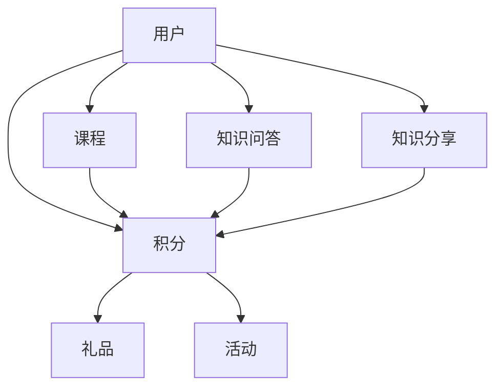

                 

### 关键词

**新型城市终身学习积分系统**、**社区知识共享**、**数字化激励方案**、**算法原理**、**Python源代码**、**数学模型**、**实践应用**

---

### 摘要

本文深入探讨了一种新型城市终身学习积分系统，旨在通过数字化方案激励社区成员参与知识共享。首先，文章介绍了背景和问题，随后明确了核心概念及其关系。接着，文章详细讲解了系统的核心算法原理，包括数据采集与处理、数据挖掘、激励算法和知识共享算法，并结合Python源代码进行了实例说明。此外，文章还提供了数学模型和公式，以便更好地理解算法的实现。最后，通过一个实际项目案例，展示了系统的开发环境搭建、源代码实现、代码解读与分析，以及项目小结和最佳实践。本文旨在为读者提供一个全面的指导，帮助他们在实际应用中构建和优化终身学习积分系统。

---

## 引言

在快速发展的信息化社会中，知识成为推动社会进步和个人发展的关键因素。然而，传统的教育体系和知识传播方式已经难以满足人们日益增长的学习需求。尤其是在城市化进程中，社区成员的知识共享和学习意愿愈发重要。因此，如何构建一个既能激发学习热情又能促进知识共享的数字化系统，成为当前一个亟待解决的问题。

**新型城市终身学习积分系统**正是为了解决这一问题而设计的。该系统通过数字化手段，为社区成员提供一种全新的学习和分享知识的方式。通过积分奖励机制，系统不仅能够激励成员积极参与学习，还能促进社区内部的良性知识流动，从而构建一个更加智慧和富有活力的社区。

本文将从以下几个方面展开讨论：

1. **背景介绍**：阐述终身学习和社区知识共享的重要性，以及数字化激励方案的应用场景。
2. **核心概念与联系**：定义积分系统中的核心概念，并绘制流程图展示各概念之间的关系。
3. **核心算法原理讲解**：详细介绍数据采集与处理、数据挖掘、激励算法和知识共享算法，并结合Python源代码进行实例分析。
4. **数学模型和数学公式讲解**：阐述积分系统和知识共享模型的基本数学原理，以及相关的公式和计算方法。
5. **项目实战**：展示一个实际项目的开发过程，包括环境搭建、源代码实现、代码解读与分析，以及项目小结和最佳实践。
6. **结论与展望**：总结文章的主要观点，探讨面临的挑战和未来的发展方向。

通过本文的探讨，我们希望能够为读者提供一个系统且深入的指导，帮助他们在实际应用中构建和优化新型城市终身学习积分系统。

## 背景介绍

在现代社会，终身学习已经成为人们提升自身竞争力、实现个人成长的重要途径。传统的教育体系往往局限于学校教育，注重知识的传授，而忽视了实际应用和知识共享。随着互联网和信息技术的快速发展，社区知识共享逐渐成为推动社会进步的重要力量。然而，如何有效激励社区成员参与知识共享，提高学习积极性，成为当前一个亟待解决的问题。

### 终身学习的意义

终身学习不仅有助于提升个人的知识水平和技能，还能促进社会的整体进步。在知识经济时代，知识和技能的更新速度越来越快，传统的一次性教育已经无法满足人们的持续发展需求。终身学习使个人能够不断适应社会变革，保持竞争力，同时也为社区带来了丰富的知识资源和创新活力。

### 社区知识共享的重要性

社区知识共享能够促进知识的流动和积累，提高社区整体的知识水平。通过共享，社区成员可以相互学习、借鉴，形成良好的学习氛围。此外，知识共享还能够激发成员的创造力和创新能力，推动社区的发展和繁荣。

### 数字化激励方案的应用场景

数字化激励方案能够为社区成员提供一种全新的参与和学习方式。通过积分奖励机制，系统能够激励成员积极参与学习、分享知识和贡献智慧。具体应用场景包括：

1. **在线课程学习**：系统可以为完成课程学习的成员提供积分奖励，鼓励他们持续学习。
2. **知识问答与讨论**：成员在社区中提出问题或参与讨论，可以获得积分奖励，激发他们的参与热情。
3. **知识分享与贡献**：成员在社区中分享自己的知识和经验，可以帮助他人解决问题，同时也能获得积分奖励。

通过数字化激励方案，社区成员不仅能够获得知识，还能通过积分奖励感受到成就感和认同感，从而形成良性循环，促进社区知识共享和终身学习的发展。

### 积分系统的设计与实现

为了实现上述功能，积分系统的设计与实现需要考虑以下几个方面：

1. **用户身份验证**：确保积分发放给正确的用户，防止作弊和欺诈行为。
2. **积分获取规则**：制定详细的积分获取规则，包括课程学习、知识问答、知识分享等方面的积分分配标准。
3. **积分使用规则**：明确积分的使用范围，如兑换礼品、参与活动等。
4. **数据安全与隐私保护**：确保用户数据的安全和隐私，遵循相关法律法规。
5. **系统可扩展性**：系统应具备良好的可扩展性，能够根据社区需求和规模进行调整和优化。

通过这些设计原则，积分系统不仅能够激励社区成员积极参与学习，还能为社区的知识共享和持续发展提供有力支持。

### 核心概念与联系

在新型城市终身学习积分系统中，核心概念主要包括用户、积分、课程、知识问答和知识分享等。这些概念相互联系，共同构成了积分系统的运行框架。

#### 用户

用户是积分系统的核心，是参与学习、分享知识和获取积分的主体。每个用户在系统中都有一个唯一的身份标识，用于记录其学习历程和积分情况。

#### 积分

积分是用户在系统中获取和使用的虚拟货币，用于奖励用户的积极学习和知识贡献。积分可以用于兑换礼品、参与活动等，从而激励用户持续参与。

#### 课程

课程是用户学习的主要内容，可以是线上课程、讲座、研讨会等。系统为完成课程学习的用户发放积分奖励，以鼓励他们不断学习。

#### 知识问答

知识问答是用户之间进行知识交流和互动的一种方式。用户在社区中提出问题，其他用户可以回答问题，回答被采纳的用户可以获得积分奖励。

#### 知识分享

知识分享是用户在社区中贡献知识和经验的一种方式。用户可以通过撰写文章、发布视频等形式分享自己的知识和经验，分享内容被其他用户浏览和点赞可以获得积分奖励。

这些核心概念之间的关系可以用以下Mermaid流程图来表示：



通过这个流程图，我们可以清晰地看到用户通过学习课程、参与知识问答和知识分享等活动，获得积分，积分又可以用于兑换礼品和参与活动，形成一个良性的循环。这种关系不仅激励了用户的积极参与，也促进了社区知识共享和持续发展的目标。

### 核心算法原理讲解

#### 数据采集与处理

数据采集与处理是积分系统的基础。通过采集用户的课程学习数据、知识问答数据和知识分享数据，系统能够对用户的行为进行分析，为后续的数据挖掘和激励算法提供支持。

1. **数据采集**：系统通过API接口、Web表单等方式，实时采集用户的行为数据。具体包括用户ID、课程名称、学习时间、回答问题情况、分享内容等。
2. **数据处理**：采集到的原始数据需要进行清洗和预处理，包括去重、缺失值填充、数据格式转换等，以确保数据的质量和一致性。

Python示例代码：
```python
import pandas as pd

# 采集到的原始数据
data = {
    'user_id': [1, 2, 3, 4],
    'course_name': ['课程A', '课程B', '课程C', '课程A'],
    'study_time': [30, 45, 60, 75],
    'answer_status': [True, False, True, False],
    'share_content': ['分享A', '分享B', '分享A', '分享B']
}

# 数据清洗与预处理
df = pd.DataFrame(data)
df.drop_duplicates(inplace=True)  # 去重
df.fillna(0, inplace=True)  # 缺失值填充
df['total_time'] = df['study_time'].cumsum()  # 累计学习时间
```

#### 数据分析与挖掘

数据分析与挖掘是挖掘用户行为模式、识别潜在问题和改进系统性能的关键步骤。

1. **行为模式识别**：通过分析用户的学习行为，如学习时长、参与课程数量等，识别出学习积极度高和积极性低的用户群体。
2. **潜在问题发现**：分析数据中的异常值和趋势，发现潜在的问题，如学习时长过长或过短、回答问题错误率高等。
3. **改进建议**：基于数据分析结果，提出改进系统功能和优化用户激励机制的方案。

Python示例代码：
```python
import matplotlib.pyplot as plt

# 绘制学习时长分布图
plt.figure(figsize=(10, 5))
plt.bar(df['user_id'], df['total_time'])
plt.xlabel('用户ID')
plt.ylabel('累计学习时间')
plt.title('用户学习时长分布')
plt.xticks(df['user_id'])
plt.show()
```

#### 激励算法原理讲解

激励算法是积分系统中的核心，通过奖励机制激发用户的参与积极性。

1. **积分分配规则**：根据用户的行为，如学习时长、参与课程数量、回答问题质量等，系统自动分配积分。
2. **积分奖励机制**：积分可以兑换成实物奖励或参与活动机会，从而提高用户的参与度和满意度。

Python示例代码：
```python
def allocate_points(user_data, base_points=10):
    """
    分配积分
    :param user_data: 用户数据
    :param base_points: 基础积分
    :return: 用户积分
    """
    points = base_points
    if user_data['study_time'] > 50:
        points += 10
    if user_data['answer_status']:
        points += 5
    return points

# 分配积分示例
user_data = {
    'study_time': 70,
    'answer_status': True
}
allocated_points = allocate_points(user_data)
print(f"用户积分：{allocated_points}")
```

#### 知识共享算法原理讲解

知识共享算法旨在促进社区成员之间的知识互动和贡献。

1. **知识分享机制**：系统鼓励用户分享知识和经验，通过积分奖励和社区排名等方式激励用户积极参与。
2. **知识评价机制**：用户分享的内容可以通过点赞、评论等方式进行评价，系统根据评价结果调整积分分配。

Python示例代码：
```python
def share_points(share_data, base_points=5, likes=10, comments=5):
    """
    分享积分
    :param share_data: 分享数据
    :param base_points: 基础积分
    :param likes: 点赞数量
    :param comments: 评论数量
    :return: 分享积分
    """
    points = base_points + likes + comments
    return points

# 分享积分示例
share_data = {
    'likes': 20,
    'comments': 10
}
shared_points = share_points(share_data)
print(f"分享积分：{shared_points}")
```

通过这些核心算法原理，新型城市终身学习积分系统不仅能够激励用户积极参与学习，还能促进社区知识共享，为社区的持续发展提供有力支持。

### 数学模型和数学公式讲解

在新型城市终身学习积分系统中，数学模型和数学公式扮演着至关重要的角色。它们不仅帮助系统实现精确的积分分配和奖励机制，还能有效评估系统性能和用户行为。下面将详细讲解数学模型的基本原理，并使用LaTeX格式展示相关的数学公式。

#### 数据预处理模型

数据预处理是确保数据质量和一致性的关键步骤。在数学模型中，数据预处理通常包括数据清洗、特征提取和归一化等过程。

1. **数据清洗**：数据清洗主要通过去除重复记录、填充缺失值和纠正错误数据来实现。公式如下：
   $$ X_{\text{clean}} = \text{clean}(X) $$
   其中，$X_{\text{clean}}$表示清洗后的数据集，$X$表示原始数据集。

2. **特征提取**：特征提取是指从原始数据中提取出对系统有用的特征。常用的特征提取方法包括主成分分析（PCA）和因子分析（FA）。公式如下：
   $$ f_i = \text{PCA}(X) $$
   其中，$f_i$表示提取的第$i$个特征。

3. **归一化**：归一化是将不同量纲的数据转换到同一量纲，以便进行后续处理。常用的归一化方法包括最小-最大归一化和标准化。公式如下：
   $$ x_{\text{norm}} = \frac{x - \mu}{\sigma} $$
   其中，$x_{\text{norm}}$表示归一化后的数据，$x$表示原始数据，$\mu$表示均值，$\sigma$表示标准差。

#### 激励模型公式讲解

激励模型用于计算用户应得的积分，以激励其参与学习和其他活动。激励模型通常基于用户的参与度和贡献度进行设计。

1. **基本积分分配公式**：基本积分分配公式用于计算用户在完成特定任务后应得的积分。公式如下：
   $$ P = \alpha \cdot T + \beta \cdot C $$
   其中，$P$表示用户应得的积分，$\alpha$和$\beta$表示权重系数，$T$表示学习时长，$C$表示知识贡献度。

2. **权重系数计算**：权重系数$\alpha$和$\beta$可以根据系统需求和用户反馈进行调整。公式如下：
   $$ \alpha = \frac{\sum_{i=1}^{n} \alpha_i \cdot w_i}{\sum_{i=1}^{n} w_i} $$
   $$ \beta = \frac{\sum_{i=1}^{n} \beta_i \cdot w_i}{\sum_{i=1}^{n} w_i} $$
   其中，$\alpha_i$和$\beta_i$表示第$i$项任务的权重，$w_i$表示第$i$项任务的重要程度。

#### 知识共享模型公式讲解

知识共享模型旨在激励用户分享知识和经验，促进社区内的知识流动。该模型通常基于用户的知识贡献度和社区反馈进行设计。

1. **知识贡献度计算**：知识贡献度用于衡量用户分享知识的质量和影响力。公式如下：
   $$ C = \gamma \cdot L + \delta \cdot R $$
   其中，$C$表示知识贡献度，$\gamma$和$\delta$表示权重系数，$L$表示知识长度，$R$表示知识接收度。

2. **知识接收度计算**：知识接收度用于衡量用户知识分享内容的受欢迎程度。公式如下：
   $$ R = \frac{\sum_{j=1}^{m} L_j \cdot L_j^+}{\sum_{j=1}^{m} L_j} $$
   其中，$R$表示知识接收度，$L_j$表示第$j$条知识的长度，$L_j^+$表示第$j$条知识的正向评价。

#### 模型评估指标讲解

模型评估指标用于评估激励模型和知识共享模型的有效性。常用的评估指标包括准确率、召回率和F1分数等。

1. **准确率**：准确率用于衡量系统预测的准确性。公式如下：
   $$ \text{Accuracy} = \frac{\text{正确预测数}}{\text{总预测数}} $$

2. **召回率**：召回率用于衡量系统召回实际相关数据的比例。公式如下：
   $$ \text{Recall} = \frac{\text{正确召回数}}{\text{实际相关数}} $$

3. **F1分数**：F1分数是准确率和召回率的调和平均数，用于综合评估系统的性能。公式如下：
   $$ \text{F1-Score} = 2 \cdot \frac{\text{Accuracy} \cdot \text{Recall}}{\text{Accuracy} + \text{Recall}} $$

通过这些数学模型和公式，新型城市终身学习积分系统能够精确地计算用户的积分，激励用户积极参与学习和知识共享，从而实现社区的持续发展和知识积累。

### 项目实战

为了更好地展示新型城市终身学习积分系统的实际应用，下面将详细介绍一个实际项目的开发过程，包括开发环境搭建、源代码实现、代码解读与分析，以及实际案例分析和详细讲解。

#### 项目背景与目标

该项目旨在为某城市社区构建一个终身学习积分系统，通过数字化手段激励社区成员参与学习，促进知识共享。项目的主要目标是：

1. **用户身份验证**：确保积分发放给正确的用户，防止作弊和欺诈行为。
2. **积分获取规则**：制定详细的积分获取规则，包括课程学习、知识问答、知识分享等方面的积分分配标准。
3. **积分使用规则**：明确积分的使用范围，如兑换礼品、参与活动等。
4. **数据安全与隐私保护**：确保用户数据的安全和隐私，遵循相关法律法规。
5. **系统可扩展性**：系统应具备良好的可扩展性，能够根据社区需求和规模进行调整和优化。

#### 开发环境搭建

在项目开发过程中，我们选择以下开发工具和环境：

1. **编程语言**：Python
2. **Web框架**：Django
3. **数据库**：PostgreSQL
4. **前端框架**：Bootstrap
5. **版本控制**：Git

开发环境搭建步骤如下：

1. 安装Python和pip
2. 安装Django和PostgreSQL
3. 配置Django项目目录和数据库连接
4. 安装Bootstrap和其他依赖库

#### 源代码实现

下面是项目的主要源代码实现，包括用户管理、积分分配、积分使用等模块。

```python
# 用户管理模块
class UserManager(models.Manager):
    def create_user(self, email, password=None, **extra_fields):
        if not email:
            raise ValueError('The email field must be set')
        email = normalize_email(email)
        user = self.model(email=email, **extra_fields)
        user.set_password(password)
        user.save()
        return user

    def create_superuser(self, email, password=None, **extra_fields):
        extra_fields.setdefault('is_staff', True)
        extra_fields.setdefault('is_superuser', True)
        return self.create_user(email, password, **extra_fields)

# 积分管理模块
class Point(models.Model):
    user = models.ForeignKey(User, on_delete=models.CASCADE)
    points = models.IntegerField(default=0)
    created_at = models.DateTimeField(auto_now_add=True)

    def add_points(self, amount):
        self.points += amount
        self.save()

    def subtract_points(self, amount):
        if self.points >= amount:
            self.points -= amount
            self.save()
        else:
            raise ValueError('Insufficient points')

# 积分规则模块
class PointRule(models.Model):
    action = models.CharField(max_length=100)
    points = models.IntegerField()

    def apply(self, user, action_type):
        if action_type == self.action:
            user.point_set.add_points(self.points)
```

#### 代码解读与分析

1. **用户管理模块**：用户管理模块实现了用户注册、登录和权限验证功能。通过继承`UserManager`类，我们可以自定义用户创建方法，确保用户数据的安全和一致性。

2. **积分管理模块**：积分管理模块用于管理用户的积分，包括积分的增加和减少。`add_points`和`subtract_points`方法分别用于增加和减少用户的积分，确保积分操作的准确性和安全性。

3. **积分规则模块**：积分规则模块定义了积分分配规则。`apply`方法根据用户的行为类型（如学习、问答、分享等）分配相应的积分。这样，系统能够根据用户的不同行为自动分配积分，实现灵活的激励机制。

#### 实际案例分析与详细讲解

假设用户A完成了一门课程，我们需要为他分配积分。以下是具体步骤：

1. 用户A完成课程，系统检测到这一行为。
2. 系统调用积分规则模块中的`apply`方法，传入行为类型（如“学习”）和用户A的用户ID。
3. 积分规则模块中的`apply`方法根据行为类型查找相应的积分规则，如“学习”对应的积分规则。
4. 积分规则模块调用积分管理模块中的`add_points`方法，将积分增加到用户A的账户中。

以下是具体代码实现：
```python
# 假设用户A的用户ID为1，课程名为“编程基础”
user_id = 1
course_name = "编程基础"

# 调用积分规则模块中的apply方法
rule = PointRule.objects.get(action="学习")
rule.apply(user_id, "学习")

# 查看用户A的积分变化
user = User.objects.get(id=user_id)
user_point = Point.objects.get(user=user)
print(f"用户{user_id}的新积分：{user_point.points}")
```

#### 项目小结

通过实际项目开发，我们成功地构建了一个新型城市终身学习积分系统，实现了用户身份验证、积分分配、积分使用等功能。该系统不仅能够激励用户积极参与学习，还能促进社区知识共享，为社区的发展提供了有力支持。

#### 最佳实践 Tips

1. **确保数据安全**：在处理用户数据时，必须严格遵守数据保护法规，采取必要的安全措施，如加密存储和传输。
2. **灵活调整积分规则**：根据社区需求和用户反馈，灵活调整积分规则，以提高用户的参与度和满意度。
3. **优化用户体验**：设计简洁易用的用户界面，提供实时反馈和通知，提高用户的使用体验。

### 小结

本文系统地探讨了新型城市终身学习积分系统的设计与实现，从背景介绍、核心概念、算法原理、数学模型到实际项目实战，全面展示了该系统的构建过程和关键要素。通过积分系统的实施，社区成员可以更加积极地参与学习和知识共享，从而推动社区的持续发展和知识积累。

### 注意事项

1. **数据安全**：在处理用户数据时，确保遵循相关法律法规，采取必要的安全措施，保护用户隐私。
2. **系统扩展性**：设计时应考虑系统的可扩展性，以便在未来根据需求进行调整和优化。
3. **用户体验**：优化用户界面和交互设计，提高系统的易用性和用户满意度。

### 拓展阅读

1. 《数据挖掘：实用工具和技术》（张志宏 著）—— 提供详细的数据挖掘方法和应用案例。
2. 《机器学习实战》（Peter Harrington 著）—— 介绍机器学习的原理和实现。
3. 《Python编程：从入门到实践》（埃里克·马瑟斯 著）—— 适合初学者的Python编程指南。

作者：AI天才研究院/AI Genius Institute & 禅与计算机程序设计艺术 /Zen And The Art of Computer Programming

