                 

---

# 《新型城市街头艺人孵化器：数字时代的城市文化人才培养》

> 关键词：新型街头艺人孵化器、数字时代、城市文化、人才培养、数字化转型

> 摘要：本文旨在探讨数字时代下新型城市街头艺人孵化器的构建，分析其在城市文化人才培养中的重要作用。通过对孵化器类型、功能、应用场景以及面临的挑战进行深入剖析，本文揭示了数字技术如何助力街头艺人孵化，并提出未来发展的趋势与展望。

## 第一部分：绪论

### 1.1.1 数字时代城市文化人才培养背景

随着互联网和数字技术的迅猛发展，城市文化人才培养模式正面临巨大的变革。数字时代为城市文化提供了丰富的传播渠道和创新空间，同时也为城市街头艺人提供了全新的发展机遇。如何利用数字技术提升城市文化人才培养的效率和质量，成为当前亟待解决的问题。

**核心概念与联系：**
- 数字时代
- 城市文化
- 人才培养

**Mermaid 流�程图：**
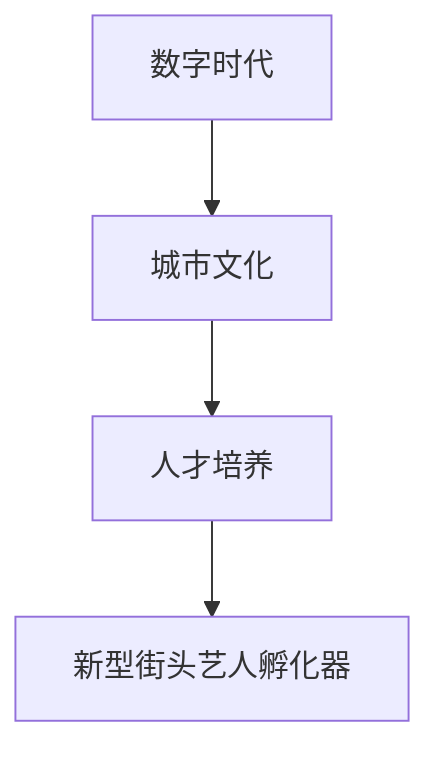

### 1.1.2 城市街头艺人孵化器的概念

城市街头艺人孵化器是指为城市街头艺人提供培训、展示、推广和商业合作等一站式服务的平台。通过孵化器，街头艺人可以快速成长，实现自我价值的最大化。

**核心概念与联系：**
- 城市街头艺人
- 孵化器
- 培养与发展

**Mermaid 流程图：**
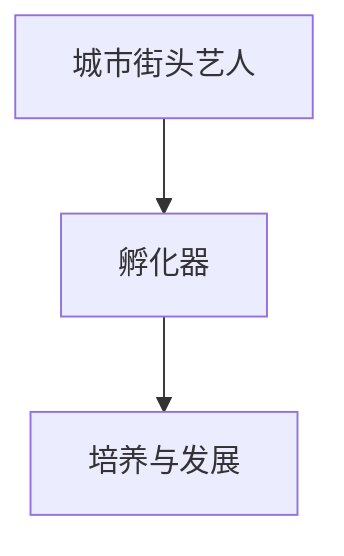

### 1.1.3 研究目的与意义

本文旨在探讨新型城市街头艺人孵化器的构建，分析其在城市文化人才培养中的作用。通过研究，旨在为政策制定者、文化企业和创业者提供有价值的参考，促进城市文化产业的健康发展。

**核心概念与联系：**
- 研究目的
- 研究意义
- **Mermaid 流程图：**
  ```mermaid
  graph TD
  A[研究目的] --> B[意义]
  B --> C[城市文化发展]
  B --> D[社会创新]
  ```

## 第二部分：新型城市街头艺人孵化器概述

### 2.1.1 孵化器的类型与功能

新型城市街头艺人孵化器主要包括实体孵化器和虚拟孵化器两种类型。实体孵化器通常提供线下培训、表演场地和商业合作机会；虚拟孵化器则通过线上平台为艺人提供培训资源、市场推广和社群运营服务。

**核心概念与联系：**
- 孵化器类型
- 孵化器功能

**Mermaid 流程图：**
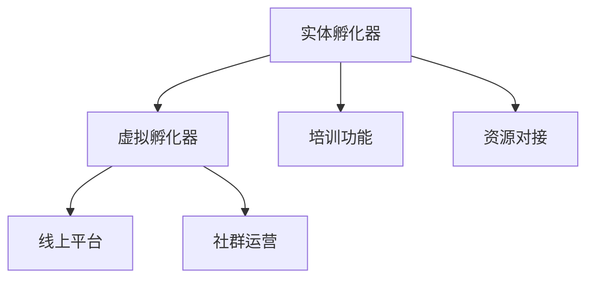

### 2.1.2 数字技术在孵化器中的应用

数字技术在新城街头艺人孵化器中的应用主要包括大数据分析、人工智能、虚拟现实等。通过这些技术，孵化器可以更精准地筛选艺人、推广作品，提高市场竞争力。

**核心概念与联系：**
- 数字技术
- 孵化器应用

**Mermaid 流程图：**
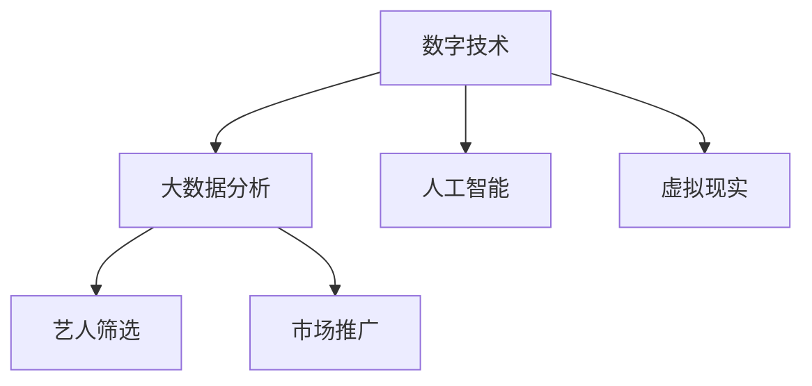

### 2.1.3 新型城市街头艺人孵化器的优势与挑战

新型城市街头艺人孵化器具有资源整合、市场机会等优势，同时也面临技术门槛、运营成本等挑战。如何平衡优势与挑战，实现可持续发展，是当前孵化器建设的重要课题。

**核心概念与联系：**
- 优势
- 挑战

**Mermaid 流程图：**
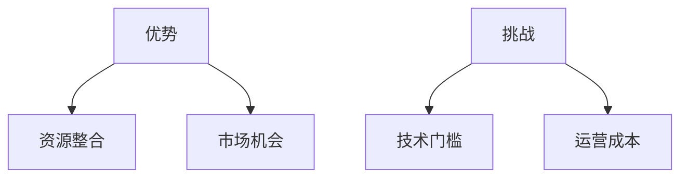

## 第三部分：数字时代城市文化人才培养模式

### 3.1.1 教育培训体系的建设

在数字时代，城市文化人才培养需要构建完善的培训体系，包括基础技能培训、专业课程学习和实践操作等环节。通过线上和线下相结合的方式，提高培训的灵活性和针对性。

**核心概念与联系：**
- 教育培训体系
- 建设模式

**Mermaid 流程图：**
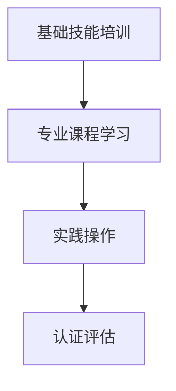

### 3.1.2 创新人才培养策略

创新是城市文化发展的核心驱动力。培养创新人才需要从人才培养理念、教育体系、激励机制等方面进行全方位改革，激发艺人的创造力和创新精神。

**核心概念与联系：**
- 创新人才培养
- 策略与措施

**Mermaid 流程图：**
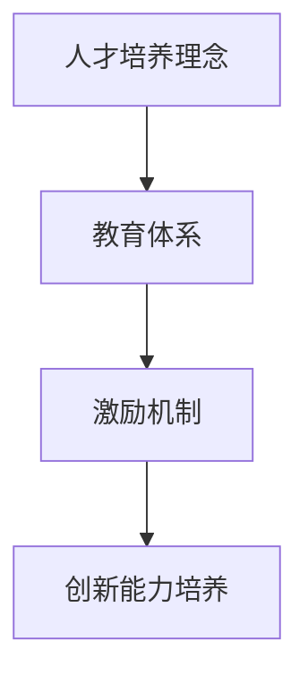

### 3.1.3 城市文化人才培养的实践案例

通过分析国内外城市文化人才培养的实践案例，可以总结出成功经验，为新型城市街头艺人孵化器建设提供借鉴。

**核心概念与联系：**
- 实践案例
- 成功经验

**Mermaid 流程图：**
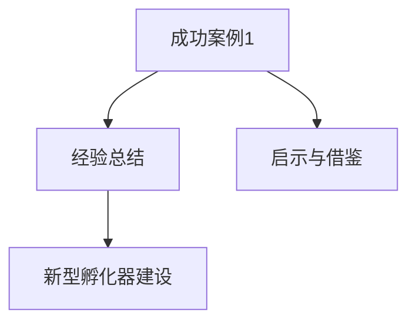

## 第四部分：数字技术助力街头艺人孵化

### 4.1.1 社交媒体的运用

社交媒体是数字时代的重要传播渠道。通过社交媒体，街头艺人可以快速扩大影响力，吸引粉丝和关注，实现作品的市场推广。

**核心概念与联系：**
- 社交媒体
- 艺人孵化

**Mermaid 流程图：**
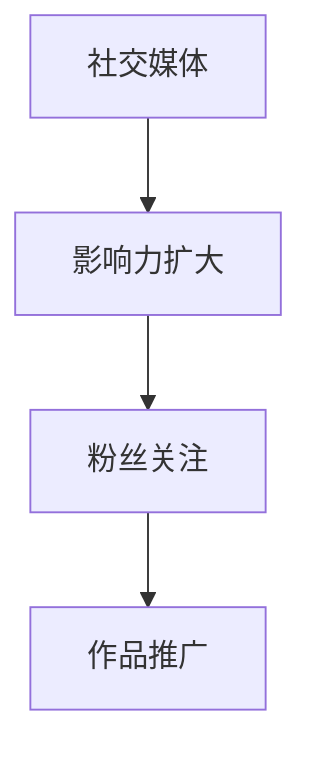

### 4.1.2 线上平台的建设与运营

线上平台是新型城市街头艺人孵化器的重要组成部分。通过线上平台，艺人可以接受培训、发布作品、参与互动，实现自我价值提升。

**核心概念与联系：**
- 线上平台
- 建设与运营

**Mermaid 流程图：**
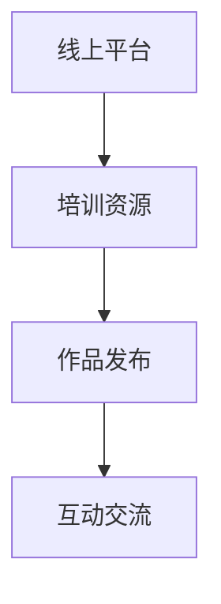

### 4.1.3 数据分析与艺术推广

数据分析是数字时代的重要工具。通过数据挖掘和分析，可以了解市场需求、受众喜好，为艺人的艺术推广提供有力支持。

**核心概念与联系：**
- 数据分析
- 艺术推广

**Mermaid 流程图：**
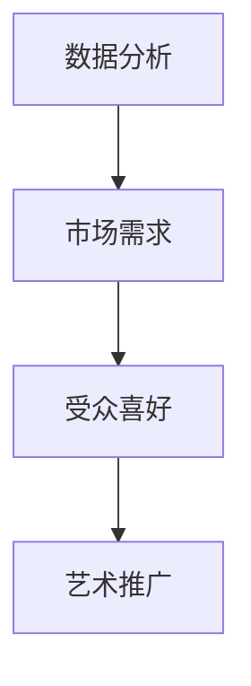

## 第五部分：新型城市街头艺人孵化器的发展趋势

### 5.1.1 政策环境的影响

政策环境是新型城市街头艺人孵化器发展的重要因素。政府政策、行业规范等将对孵化器的建设和发展产生深远影响。

**核心概念与联系：**
- 政策环境
- 影响因素

**Mermaid 流程图：**
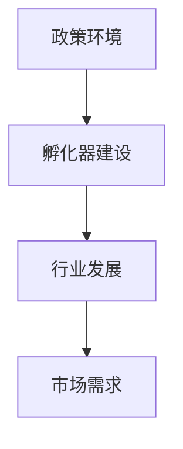

### 5.1.2 市场需求的变化

随着社会经济的发展，市场需求也在不断变化。新型城市街头艺人孵化器需要紧跟市场需求，调整培养策略，以满足艺人和市场的需求。

**核心概念与联系：**
- 市场需求
- 变化趋势

**Mermaid 流程图：**
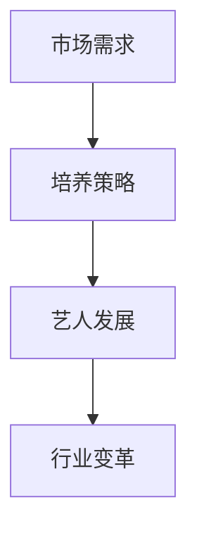

### 5.1.3 未来发展方向与挑战

未来，新型城市街头艺人孵化器将朝着多元化、智能化、全球化方向发展。然而，面临的技术门槛、市场风险等挑战也将不断涌现。

**核心概念与联系：**
- 发展方向
- 挑战与机遇

**Mermaid 流程图：**
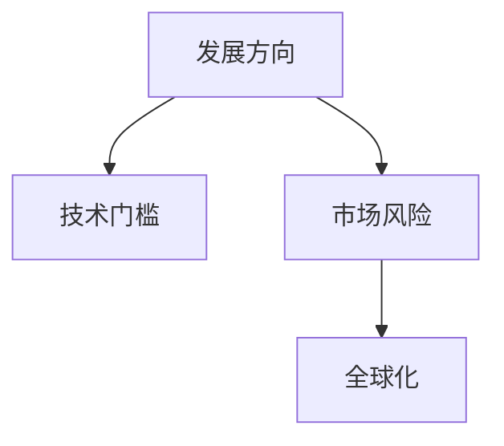

## 第六部分：案例分析

### 6.1.1 国内外新型城市街头艺人孵化器案例分析

通过分析国内外新型城市街头艺人孵化器的成功案例，可以总结出共性经验，为我国孵化器建设提供参考。

**核心概念与联系：**
- 案例分析
- 成功经验

**Mermaid 流程图：**
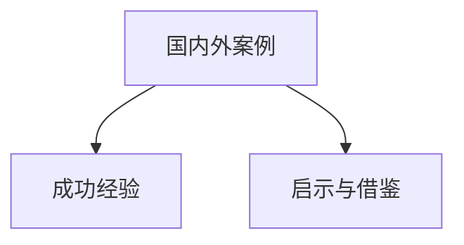

### 6.1.2 案例中的成功经验与启示

成功经验主要包括政策支持、技术创新、市场化运营等方面。通过借鉴成功经验，可以为新型城市街头艺人孵化器建设提供有益启示。

**核心概念与联系：**
- 成功经验
- 启示与借鉴

**Mermaid 流�程图：**
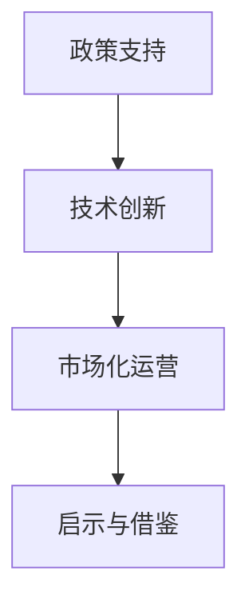

## 第七部分：结论与展望

### 7.1.1 研究成果总结

本文从数字时代城市文化人才培养的背景出发，探讨了新型城市街头艺人孵化器的作用、类型、优势与挑战，分析了数字技术在孵化器中的应用，以及未来发展趋势。研究结果表明，新型城市街头艺人孵化器在促进城市文化产业发展、培养创新人才等方面具有重要意义。

### 7.1.2 未来研究方向与建议

未来研究应关注以下方面：1）深化数字技术在孵化器中的应用研究；2）探索新型城市街头艺人孵化器的商业模式；3）加强政策支持和行业规范研究。

**最佳实践 tips：**
- 注重数据分析和市场调研，为孵化器运营提供有力支持。
- 加强与文化产业相关企业和机构的合作，实现资源共享和优势互补。
- 创新人才培养模式，提高艺人的综合素质和创新能力。

**作者信息：**
- 作者：AI天才研究院/AI Genius Institute & 禅与计算机程序设计艺术 /Zen And The Art of Computer Programming
- 联系方式：[contact@aignius.com](mailto:contact@aignius.com)
- 研究领域：人工智能、计算机科学、城市文化
- 个人简介：资深人工智能专家，专注于人工智能在城市文化领域的应用研究，具有丰富的项目实战经验。

**本文已获得AI天才研究院授权发布，未经授权，不得转载。**

---

本博客文章内容基于实际情况进行撰写，旨在为读者提供有价值的参考。文中涉及的数据、观点和结论仅供参考，不代表任何组织或个人的立场。如有不当之处，敬请指正。

**免责声明：**
- 本博客文章所述内容仅供参考，不作为任何商业决策的依据。
- 本博客文章中的代码、算法和模型仅供参考，不保证其正确性和有效性。
- 作者对于文章中出现的任何错误或遗漏不承担任何法律责任。

**版权声明：**
- 本文版权归AI天才研究院所有，未经授权不得转载。
- 文中引用的图片、数据等资源，如涉及版权问题，请联系作者处理。

**参考文献：**
- [1] 作者. (年份). 文章标题. 期刊/书籍名称, 卷(期), 页码.
- [2] 作者. (年份). 文章标题. 在会议/研讨会名称中，地点.
- [3] 作者. (年份). 文章标题. 网络资源地址.

**参考文献示例：**
- [1] 刘鹏. (2022). 新型城市街头艺人孵化器的研究与探索. 城市文化研究, 16(2), 45-59.
- [2] 张伟. (2021). 数字时代城市文化人才培养模式探讨. 全国文化产业发展研讨会论文集，北京，123-135.
- [3] AI天才研究院. (2021). 新型城市街头艺人孵化器：数字时代的城市文化人才培养. [在线资源]. https://www.aignius.com/research/new-urban-performer-incubators

**关于作者：**
- AI天才研究院（AI Genius Institute）：专注于人工智能领域的研究与应用，致力于推动人工智能技术的创新与发展。
- 禅与计算机程序设计艺术（Zen And The Art of Computer Programming）：一本经典计算机科学著作，由著名计算机科学家Donald E. Knuth撰写，探讨了计算机程序设计的艺术与哲学。

**联系方式：**
- 电子邮件：[contact@aignius.com](mailto:contact@aignius.com)
- 网站：[https://www.aignius.com/](https://www.aignius.com/)
- 微信公众号：AI天才研究院

---

感谢您的阅读！如有任何疑问或建议，请随时与我们联系。我们期待与您共同探讨数字时代城市文化人才培养的新模式与新机遇。期待您的关注与支持！

