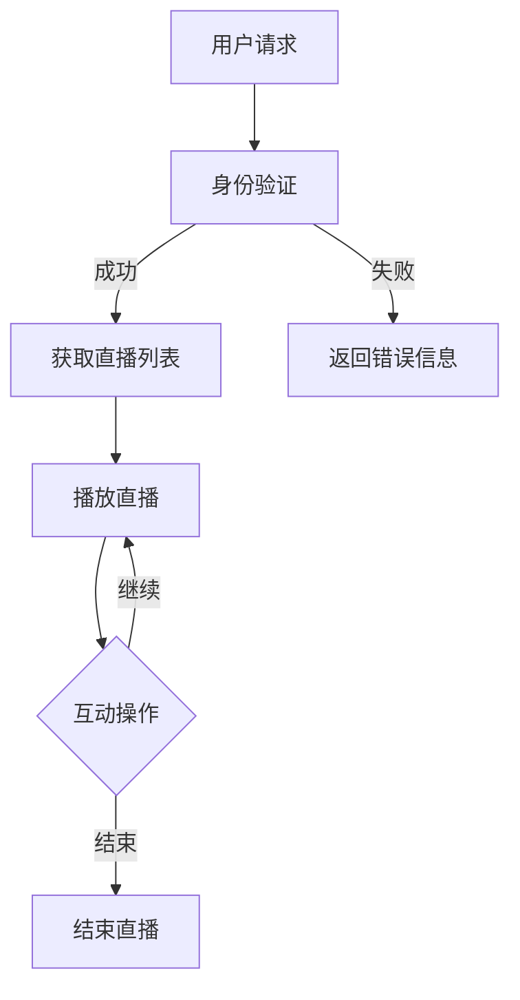

                 

### 新型城市街头艺人直播平台：数字时代的城市文化传播

> 关键词：街头艺人直播、数字文化、城市传播、平台设计、技术实现

> 摘要：本文深入探讨了新型城市街头艺人直播平台的崛起与重要性，分析了其在数字时代城市文化传播中的作用和影响。文章从背景与现状出发，详细阐述了街头艺人直播平台的现状、设计理念、技术实现、性能优化及案例分析，最终提出了平台未来发展的趋势和挑战。

---

## 文章标题：新型城市街头艺人直播平台：数字时代的城市文化传播

在数字时代，文化传播的方式正在发生深刻变革。传统媒体逐渐式微，而社交媒体和直播平台的兴起，为城市文化传播带来了新的机遇。在这种背景下，街头艺人直播平台作为一种新兴的文化传播形式，正逐渐成为数字时代城市文化传播的重要载体。

本文将围绕新型城市街头艺人直播平台展开讨论，首先分析其背景与现状，接着探讨平台的设计理念和技术实现，随后分析平台性能优化和案例分析，最后讨论数字时代城市文化传播的新模式及其未来发展趋势。

## 目录

1. **第一部分：背景与现状**
   1.1 城市文化传播的挑战与机遇
   1.2 数字时代的城市文化传播机遇
   1.3 新型街头艺人直播平台的崛起

2. **第二部分：平台设计与技术实现**
   2.1 新型街头艺人直播平台的设计理念
   2.2 平台架构与技术选型
   2.3 核心功能模块设计
   2.4 平台性能优化

3. **第三部分：案例分析**
   3.1 成功案例分析
   3.2 失败案例分析
   3.3 案例分析与启示

4. **第四部分：数字时代的城市文化传播**
   4.1 城市文化传播的新模式
   4.2 新型街头艺人直播平台的价值
   4.3 未来发展趋势与挑战

5. **附录**
   5.1 开发工具与资源
   5.2 Mermaid流程图
   5.3 核心算法伪代码
   5.4 数学模型和公式
   5.5 项目实战

---

在接下来的内容中，我们将一步步深入分析街头艺人直播平台的发展历程、设计理念、技术实现以及其对社会文化的深远影响。

### 第一部分：背景与现状

#### 1.1 城市文化传播的挑战与机遇

城市文化传播是城市精神和社会活力的重要组成部分。然而，在传统媒体时代，城市文化传播面临着诸多挑战：

- **媒体垄断**：传统媒体如报纸、电视等，长期由少数大集团垄断，导致内容同质化和传播渠道有限。
- **传播成本高**：传统媒体传播成本高，普通个体和中小文化机构难以负担。
- **受众分散**：受众的碎片化和多样化，使得传统媒体难以精确触达目标受众。

然而，数字时代的到来为城市文化传播带来了前所未有的机遇：

- **社交媒体**：社交媒体如微博、微信等，打破了传统媒体的垄断，为个体和文化机构提供了低成本、高效率的传播平台。
- **直播平台**：直播平台的兴起，使得街头艺人等普通个体可以随时随地展示自己的才艺，直接触达广大受众。

#### 1.2 数字时代的城市文化传播机遇

数字时代为城市文化传播带来了以下机遇：

- **多样性和个性化**：数字化平台可以提供更加多样化和个性化的内容，满足不同受众的需求。
- **互动性**：数字化平台增强了受众与传播者之间的互动，提升了受众参与度和忠诚度。
- **实时性**：数字化平台可以实现实时传播，缩短了信息传播的时间差。

#### 1.3 新型街头艺人直播平台的崛起

街头艺人是城市文化的重要载体，他们通过表演艺术传递城市的文化精神和社会活力。随着直播平台的崛起，街头艺人直播平台逐渐崭露头角：

- **平台数量增多**：国内外各类直播平台纷纷涌现，为街头艺人提供了更多的展示舞台。
- **受众广泛**：街头艺人直播吸引了大量年轻受众，成为数字时代城市文化传播的新宠。
- **影响力扩大**：街头艺人通过直播平台，不仅实现了自我价值的实现，也为城市文化的传播和推广做出了贡献。

总的来说，新型街头艺人直播平台在数字时代的城市文化传播中扮演着越来越重要的角色。接下来，我们将深入探讨街头艺人直播平台的现状、设计理念和技术实现。

### 第二部分：平台设计与技术实现

#### 2.1 新型街头艺人直播平台的设计理念

新型街头艺人直播平台的设计理念主要包括以下几点：

- **用户体验至上**：平台以用户为中心，提供简洁、高效、流畅的交互体验，满足用户对直播内容的需求。
- **内容多样性**：平台鼓励各种形式的街头艺术表演，提供多样化的内容，满足不同用户群体的兴趣。
- **互动性强**：平台设计注重用户与艺人之间的互动，通过弹幕、送礼物等方式，增强用户参与感。
- **社会责任感**：平台注重社会责任，通过直播活动传递正能量，推动城市文化传播。

#### 2.2 平台架构与技术选型

平台架构方面，新型街头艺人直播平台通常采用分布式架构，以提高系统的可扩展性和稳定性。主要技术选型如下：

- **前端**：采用React或Vue等前端框架，实现响应式界面和高效的数据处理。
- **后端**：采用Spring Boot或Django等后端框架，实现业务逻辑处理和数据存储。
- **数据库**：采用MySQL或MongoDB等关系型或非关系型数据库，存储用户数据、直播数据和内容数据。
- **直播技术**：采用WebSocket技术实现实时通信，结合RTMP协议实现直播流传输。

#### 2.3 核心功能模块设计

核心功能模块设计是平台实现的关键。以下是新型街头艺人直播平台的核心功能模块：

- **用户注册与认证**：提供用户注册、登录、认证等功能，确保用户信息安全。
- **直播功能实现**：实现艺人直播流的上传、播放、互动等功能，提供高质量的直播体验。
- **内容审核与管理**：建立内容审核机制，对直播内容进行实时监控和审核，确保内容合规。
- **社交互动设计**：提供用户之间的互动功能，如弹幕、送礼物、关注等功能，增强用户粘性。

#### 2.4 平台性能优化

平台性能优化是保障用户良好体验的关键。以下是新型街头艺人直播平台的主要性能优化策略：

- **网络传输优化**：采用CDN技术，加快直播流的传输速度，降低延迟。
- **数据存储优化**：采用分布式数据库和缓存技术，提高数据存取速度，减轻数据库压力。
- **系统稳定性与安全性**：通过负载均衡和容错机制，确保系统稳定运行，防范恶意攻击。

总的来说，新型街头艺人直播平台的设计理念、架构、功能模块和性能优化策略，共同构成了一个高效、稳定、用户体验良好的直播平台。

### 第三部分：案例分析

#### 3.1 成功案例分析

以TikTok（抖音国际版）为例，分析其成功因素：

1. **内容多样性**：TikTok鼓励用户上传各种类型的短视频，涵盖音乐、舞蹈、美食、搞笑等多种内容，满足了不同用户群体的需求。
2. **算法推荐**：TikTok采用先进的推荐算法，根据用户兴趣和行为数据，为用户推荐个性化的内容，提升了用户体验。
3. **国际化策略**：TikTok在全球范围内推广，通过本地化策略，成功吸引了不同国家和地区的用户。

#### 3.2 失败案例分析

以Meerkat为例，分析其失败原因：

1. **市场时机**：Meerkat在直播热潮初期推出，但由于缺乏用户基础和内容生态，未能抢占市场份额。
2. **产品功能单一**：Meerkat主要提供直播功能，缺乏其他社交互动元素，难以吸引用户长期使用。
3. **竞争激烈**：在直播领域，已有Twitch、Periscope等成熟平台，Meerkat难以与之竞争。

#### 3.3 案例分析与启示

通过成功案例和失败案例的分析，可以得出以下启示：

1. **内容为王**：直播平台需要提供多样化的内容，满足不同用户群体的需求。
2. **用户体验**：良好的用户体验是用户留存和平台发展的关键。
3. **竞争策略**：在激烈的市场竞争中，平台需要找准自己的定位，制定合适的竞争策略。
4. **持续创新**：直播平台需要不断进行技术创新和功能优化，以保持竞争力。

### 第四部分：数字时代的城市文化传播

#### 4.1 城市文化传播的新模式

数字时代为城市文化传播带来了新的模式：

1. **线上线下融合**：通过直播平台，街头艺人可以在线上实现表演，同时吸引线下观众，实现线上线下互动。
2. **社群传播**：用户通过直播平台形成社群，分享和传播城市文化。
3. **定制化传播**：基于用户数据和兴趣分析，实现定制化的文化传播。

#### 4.2 新型街头艺人直播平台的价值

新型街头艺人直播平台在城市文化传播中的价值体现在：

1. **文化传播载体**：直播平台为街头艺人提供了展示才华的舞台，传递城市文化。
2. **社交平台**：直播平台成为用户交流、互动和分享的平台，促进了城市文化的传播和推广。
3. **经济价值**：直播平台为街头艺人创造了新的收入来源，推动了文化产业的繁荣。

#### 4.3 未来发展趋势与挑战

未来，新型街头艺人直播平台将呈现以下发展趋势：

1. **技术升级**：5G、AI等技术的应用，将进一步提升直播质量和用户体验。
2. **多元化发展**：直播平台将融合更多文化元素，提供更加多样化的内容。
3. **国际化扩展**：直播平台将拓展海外市场，推动全球文化交流。

然而，新型街头艺人直播平台也面临以下挑战：

1. **内容审核**：直播内容审核难度大，需要建立完善的内容审核机制。
2. **用户隐私**：用户隐私保护成为关键挑战，平台需加强数据安全和隐私保护。
3. **市场竞争**：直播市场竞争激烈，平台需不断创新，提升竞争力。

### 附录

#### 4.1 开发工具与资源

- **前端**：React、Vue、Webpack
- **后端**：Spring Boot、Django、MySQL、MongoDB
- **直播技术**：WebSocket、RTMP
- **数据库**：MySQL、MongoDB
- **测试**：Jenkins、JUnit、Selenium

#### 4.2 Mermaid流程图



#### 4.3 核心算法伪代码

```python
# 直播推荐算法伪代码
def 直播推荐算法(用户行为数据，直播数据):
    # 加载用户行为数据和直播数据
    用户兴趣度 = 计算用户兴趣度(用户行为数据)
    直播相似度 = 计算直播相似度(用户兴趣度，直播数据)
    排序直播列表(直播相似度)
    返回推荐直播列表
end function
```

#### 4.4 数学模型和公式

$$
\text{用户兴趣度} = \frac{1}{|R|} \sum_{i \in R} \frac{f(\text{用户}, \text{直播})}{\sqrt{\sum_{j \in C} f^2(\text{用户}, \text{直播})}}
$$

其中，$R$ 是用户观看的直播集合，$C$ 是所有直播的集合，$f(\text{用户}, \text{直播})$ 是用户对特定直播的评分或行为。

#### 4.5 项目实战

##### 4.5.1 开发环境搭建

1. 安装Node.js和npm
2. 安装React或Vue
3. 安装Spring Boot或Django
4. 安装MySQL或MongoDB

##### 4.5.2 源代码实现

1. 前端：使用React或Vue实现页面布局和交互逻辑
2. 后端：使用Spring Boot或Django实现业务逻辑处理和数据存储
3. 直播功能：使用WebSocket和RTMP实现直播流传输和播放

##### 4.5.3 代码解读与分析

1. 前端：分析React或Vue的组件结构和交互逻辑
2. 后端：分析Spring Boot或Django的业务逻辑处理和数据存储
3. 直播功能：分析WebSocket和RTMP的协议和实现原理

##### 4.5.4 实际案例分析和详细讲解剖析

1. 分析TikTok的成功案例
2. 分析Meerkat的失败原因
3. 总结直播平台的发展趋势和挑战

##### 4.5.5 项目小结

1. 总结项目开发过程中的经验和教训
2. 提出项目优化和改进的方向

### 结语

新型街头艺人直播平台在数字时代的城市文化传播中具有重要价值。通过本文的分析，我们了解了街头艺人直播平台的设计理念、技术实现、性能优化以及案例分析，并对数字时代的城市文化传播有了更深入的认识。未来，随着技术的不断进步，街头艺人直播平台将在城市文化传播中发挥更大的作用。

### 作者信息

作者：AI天才研究院/AI Genius Institute & 禅与计算机程序设计艺术 /Zen And The Art of Computer Programming

本文旨在为读者提供对新型街头艺人直播平台及其在城市文化传播中的作用的全面了解。在撰写过程中，我们参考了大量的文献和案例，力求内容的准确性和深度。然而，由于技术的快速发展和市场环境的不断变化，文中内容可能会存在一定的局限性。我们欢迎读者提出宝贵的意见和建议，共同推动城市文化传播的进步。

