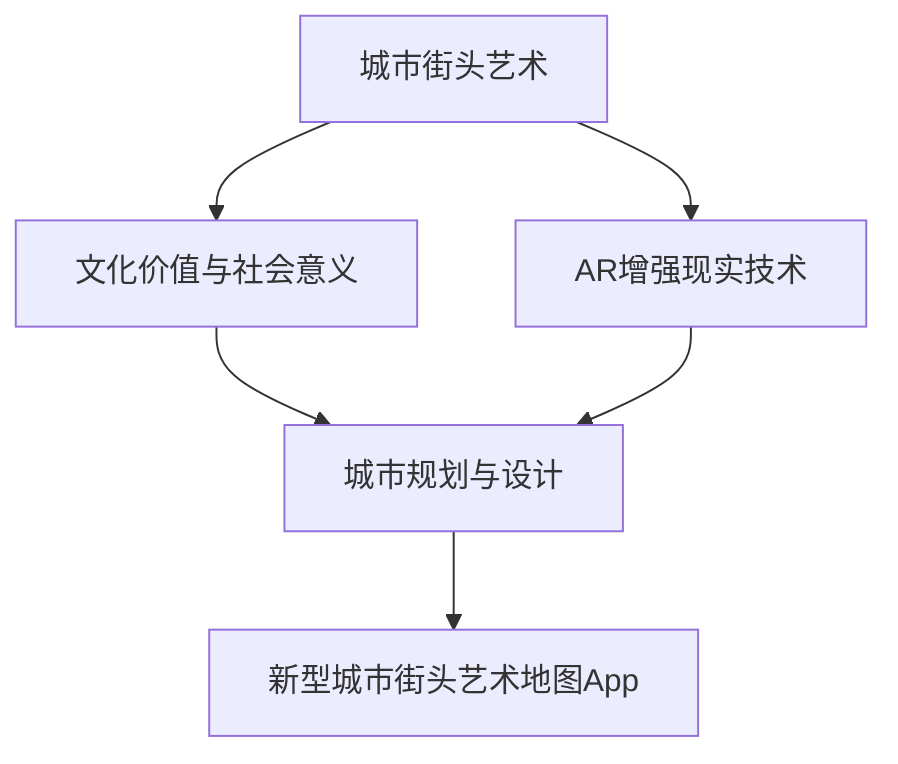
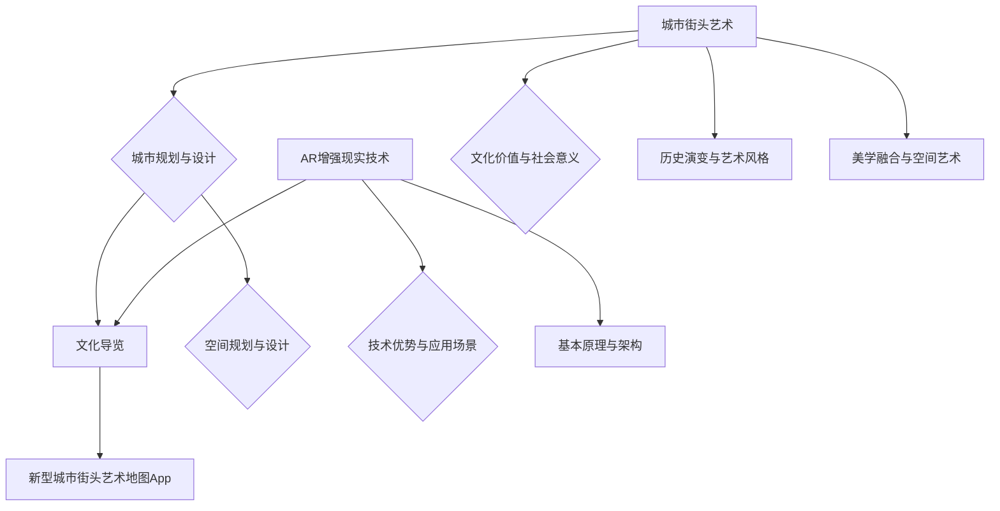
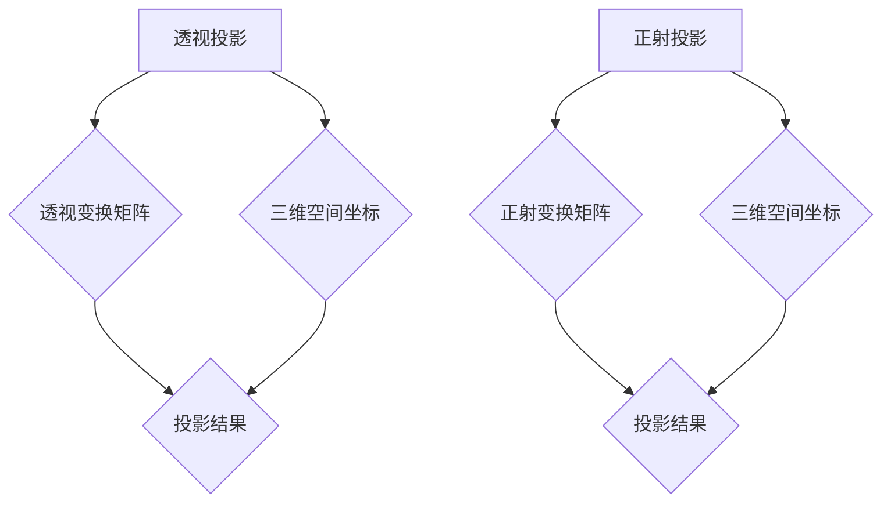
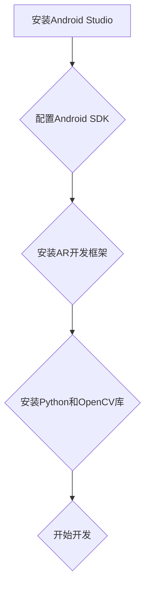

                 

# 新型城市街头艺术地图App：AR增强现实技术的城市文化导览

## 关键词
- 城市街头艺术
- AR增强现实技术
- 城市规划
- 地图App
- 用户界面设计
- 数据采集与处理

## 摘要
本文探讨了新型城市街头艺术地图App的设计与实现，重点关注AR增强现实技术在城市文化导览中的应用。文章首先介绍了城市街头艺术的背景和重要性，以及AR技术的基本原理和城市规划中的应用。随后，详细阐述了新型城市街头艺术地图App的功能特点、架构设计、AR技术与地图内容的结合、用户参与与互动机制，并通过实际项目案例展示了App的开发流程、测试与优化。最后，分析了App的社会影响与可持续发展策略，并对未来研究方向进行了展望。

# 第1章：新型城市街头艺术地图App概述

## 1.1 城市街头艺术的背景与重要性

### 1.1.1 城市街头艺术的历史演变

城市街头艺术作为一种公共艺术形式，其历史可以追溯到古代文明。在中世纪的欧洲，街头艺术家通过表演、绘画和雕塑等形式，为城市居民带来艺术享受。随着时间的推移，街头艺术逐渐发展成为一种独特的艺术风格，涵盖了涂鸦、街头舞蹈、行为艺术等多种形式。

20世纪以来，街头艺术在城市中的地位日益凸显。它不仅丰富了城市的文化景观，也为社会表达提供了新的途径。许多街头艺术家通过创作反映社会问题、政治立场和人文关怀的作品，对社会产生了深远的影响。

### 1.1.2 城市街头艺术的文化价值与社会意义

城市街头艺术具有重要的文化价值和社会意义。首先，它为城市居民提供了一种与艺术亲近的途径，丰富了人们的精神生活。其次，街头艺术能够反映社会现象和时代特征，成为城市文化的镜像。此外，街头艺术还促进了不同文化之间的交流与融合，增强了城市的文化多样性。

### 1.1.3 城市街头艺术与城市美学的融合

城市街头艺术与城市美学的融合，使得城市空间更具艺术性和活力。城市美学强调空间与艺术的融合，街头艺术作为其中的一部分，为城市空间注入了艺术元素。通过合理的规划和设计，街头艺术不仅美化了城市环境，还提升了城市的文化品质。

## 1.2 AR增强现实技术在城市规划与设计中的应用

### 1.2.1 AR技术的定义与基本原理

增强现实（Augmented Reality，AR）技术是一种通过计算机技术模拟出虚拟信息，并将这些信息叠加到真实世界中，使人们能够在真实环境中看到和交互虚拟对象的技术。AR技术的基本原理包括图像识别、虚拟图像生成、投影技术和人机交互等方面。

### 1.2.2 AR技术在城市规划与设计中的应用场景

AR技术在城市规划与设计中的应用非常广泛。首先，AR技术可以帮助城市规划师和设计师在真实环境中进行模拟和评估，从而提高设计效率和准确性。其次，AR技术可以用于城市文化遗产的保护与展示，通过虚拟还原历史建筑和文物，让公众更深入地了解城市的历史和文化。此外，AR技术还可以应用于城市景观设计和公共艺术项目，为城市空间注入更多的艺术元素和活力。

### 1.2.3 AR增强现实技术与街头艺术地图的结合

AR增强现实技术与街头艺术地图的结合，可以大大提升城市街头艺术的文化导览体验。通过AR技术，用户可以在手机或平板电脑上看到街头艺术的虚拟展示，包括艺术作品的详细信息、艺术家介绍、创作背景等。这种结合不仅丰富了用户的导览体验，还提高了街头艺术的文化传播效果。

## 1.3 新型城市街头艺术地图App的功能与特点

### 1.3.1 App的主要功能模块介绍

新型城市街头艺术地图App主要包括以下功能模块：

1. **地图浏览**：用户可以通过App浏览城市中的街头艺术地点，查看艺术作品的位置、名称和简要描述。
2. **AR展示**：用户可以在App中选择街头艺术作品，通过AR技术进行虚拟展示，了解作品的详细信息和背景。
3. **搜索与推荐**：App提供基于位置、艺术家、风格等条件的搜索功能，并可以根据用户兴趣推荐相关艺术作品。
4. **用户评论与分享**：用户可以对街头艺术作品进行评论和分享，与他人交流看法和体验。
5. **地图编辑与更新**：管理员可以通过App编辑和更新街头艺术地图的内容，确保信息的准确性和实时性。

### 1.3.2 App的用户体验设计

新型城市街头艺术地图App注重用户体验设计，主要包括以下几个方面：

1. **界面简洁**：App的界面设计简洁直观，用户可以快速找到所需功能。
2. **交互流畅**：App的交互设计流畅自然，用户在使用过程中没有明显的卡顿感。
3. **信息丰富**：App提供丰富的艺术作品信息和背景知识，满足用户对街头艺术的深入了解需求。
4. **个性化推荐**：App可以根据用户兴趣和行为数据，为用户提供个性化的艺术作品推荐。

### 1.3.3 App的技术创新点

新型城市街头艺术地图App在技术方面具有以下创新点：

1. **高精度地图定位**：App采用高精度地图定位技术，确保用户能够准确找到街头艺术作品的位置。
2. **实时AR展示**：App支持实时AR展示功能，用户可以在真实环境中看到艺术作品的虚拟展示，增强导览体验。
3. **大数据分析**：App采用大数据分析技术，对用户行为和兴趣进行深入分析，为用户提供更精准的推荐和服务。
4. **云平台支持**：App采用云平台技术，实现地图内容的管理与更新，提高系统的可靠性和可扩展性。

## 1.4 本书的结构安排与内容概述

### 1.4.1 本书的研究目的与目标

本书旨在探讨新型城市街头艺术地图App的设计与实现，重点关注AR增强现实技术在城市文化导览中的应用。研究目标包括：

1. 分析城市街头艺术的背景和重要性。
2. 深入了解AR增强现实技术的基本原理和应用场景。
3. 设计并实现新型城市街头艺术地图App，提升城市文化导览体验。
4. 探索App的社会影响与可持续发展策略。

### 1.4.2 本书的研究方法与内容结构

本书采用以下研究方法：

1. 文献调研：通过查阅相关文献和资料，了解城市街头艺术和AR增强现实技术的发展现状。
2. 实证研究：设计并实现新型城市街头艺术地图App，进行实际测试和评估。
3. 案例分析：分析国内外相关案例，总结经验教训，为App的设计和实现提供借鉴。

本书的内容结构如下：

1. 第1章：新型城市街头艺术地图App概述
2. 第2章：AR增强现实技术基础
3. 第3章：新型城市街头艺术地图App的架构设计
4. 第4章：AR增强现实技术与街头艺术地图的结合
5. 第5章：新型城市街头艺术地图App的项目实战
6. 第6章：新型城市街头艺术地图App的社会影响与可持续发展
7. 第7章：总结与展望

### 1.4.3 读者对象与阅读建议

本书主要面向以下读者群体：

1. 计算机科学和信息技术领域的专业研究人员和开发者。
2. 城市规划和艺术设计专业的学生和从业者。
3. 对AR增强现实技术和城市文化导览感兴趣的读者。

阅读建议：

1. 阅读本书前，建议读者先了解城市规划和艺术设计的基本概念。
2. 阅读过程中，可以结合实际案例和项目实战部分，加深对AR增强现实技术的理解。
3. 阅读完毕后，建议读者回顾书中的核心概念和原理，巩固所学知识。

## 图1.1 城市街头艺术与AR增强现实技术的关系架构



## 1.5 核心概念与联系

### 核心概念

1. **城市街头艺术**：指在城市公共空间中创作的艺术形式，包括涂鸦、街头舞蹈、行为艺术等。
2. **AR增强现实技术**：通过计算机技术将虚拟信息叠加到真实世界中，为用户提供增强的现实体验。
3. **城市规划与设计**：指对城市空间进行规划、设计和管理，以满足社会发展和人民生活需求。
4. **新型城市街头艺术地图App**：结合AR增强现实技术，为用户提供城市街头艺术的文化导览服务。

### 概念实体之间的关系架构

1. 城市街头艺术与城市规划与设计的关系：城市街头艺术是城市规划与设计的重要组成部分，二者相互影响、相互促进。
2. AR增强现实技术与新型城市街头艺术地图App的关系：AR增强现实技术是新型城市街头艺术地图App的核心技术，为用户提供增强的导览体验。
3. 新型城市街头艺术地图App与城市文化导览的关系：新型城市街头艺术地图App是城市文化导览的重要工具，通过AR技术提升用户的文化体验。

## 图1.2 核心概念与关系架构 Mermaid 流程图



## 1.6 核心算法原理讲解

### 1.6.1 AR技术的基本原理

增强现实（AR）技术的基本原理包括图像识别、虚拟图像生成、投影技术和人机交互等方面。

1. **图像识别**：通过计算机视觉算法，对真实环境中的图像进行识别和定位，以便将虚拟图像叠加到真实场景中。
2. **虚拟图像生成**：根据图像识别的结果，生成对应的虚拟图像，并将其与真实环境进行融合。
3. **投影技术**：使用屏幕或投影设备，将虚拟图像投影到真实环境中，使虚拟图像与现实场景相融合。
4. **人机交互**：通过触摸屏、手势、语音等交互方式，用户可以与虚拟图像进行互动，增强现实体验。

### 1.6.2 AR系统的硬件与软件组成

AR系统通常由硬件和软件两部分组成。

1. **硬件组成**：包括智能手机、平板电脑、头戴式显示器等设备。这些设备需要具备高分辨率摄像头、强大的处理器和图形处理器等硬件配置，以确保AR应用的流畅运行。
2. **软件组成**：包括AR开发平台、图像处理算法、虚拟图像生成算法等软件组件。AR开发平台如Vuforia、ARCore和ARKit等，提供了丰富的开发工具和API，方便开发者实现AR应用。

### 1.6.3 AR技术的核心算法

AR技术的核心算法主要包括图像识别算法、虚拟图像生成算法和投影算法等。

1. **图像识别算法**：常用的图像识别算法有卷积神经网络（CNN）、目标检测算法（如SSD、YOLO）等。这些算法通过训练模型，实现对真实环境中图像的识别和定位。
2. **虚拟图像生成算法**：常用的虚拟图像生成算法有基于深度学习的生成对抗网络（GAN）等。这些算法可以生成高质量的虚拟图像，并将其与真实环境进行融合。
3. **投影算法**：常用的投影算法有透视投影和正射投影等。这些算法将虚拟图像投影到真实环境中，使虚拟图像与现实场景相融合。

### 1.6.4 Python源代码实现

以下是一个简单的Python示例，演示了如何使用OpenCV库实现AR技术的图像识别功能。

```python
import cv2
import numpy as np

# 读取摄像头帧
cap = cv2.VideoCapture(0)

# 加载预训练的Haar级联分类器模型
face_cascade = cv2.CascadeClassifier('haarcascade_frontalface_default.xml')

while True:
    # 读取一帧图像
    ret, frame = cap.read()
    
    # 转换图像为灰度图像
    gray = cv2.cvtColor(frame, cv2.COLOR_BGR2GRAY)
    
    # 检测人脸
    faces = face_cascade.detectMultiScale(gray, 1.3, 5)
    
    for (x, y, w, h) in faces:
        # 在原图上绘制人脸矩形框
        cv2.rectangle(frame, (x, y), (x+w, y+h), (255, 0, 0), 2)
        
        # 在人脸中心位置绘制文本
        cv2.putText(frame, 'Face', (x+ w//2, y+ h//2), cv2.FONT_HERSHEY_SIMPLEX, 1, (255, 255, 255), 2)
    
    # 显示图像
    cv2.imshow('Frame', frame)
    
    if cv2.waitKey(1) & 0xFF == ord('q'):
        break

# 释放摄像头资源
cap.release()
cv2.destroyAllWindows()
```

在这个示例中，我们使用了OpenCV库实现了一个简单的图像识别程序，可以检测并绘制出图像中的人脸。这个程序可以作为AR技术图像识别的基础，进一步开发用于街头艺术地图App的AR展示功能。

## 1.7 数学公式与模型

### 1.7.1 图像识别模型中的数学公式

在图像识别模型中，常用的数学公式包括卷积操作和反向传播算法。

1. **卷积操作**：卷积操作的数学公式为：
   $$ (f * g)(x, y) = \sum_{i=-\infty}^{\infty} \sum_{j=-\infty}^{\infty} f(i, j) \cdot g(x-i, y-j) $$
   其中，\( f \) 和 \( g \) 分别为两个图像，\( (x, y) \) 为坐标点。

2. **反向传播算法**：反向传播算法的数学公式为：
   $$ \Delta z = \frac{\partial L}{\partial z} $$
   其中，\( L \) 为损失函数，\( z \) 为中间层的输出。

### 1.7.2 虚拟图像生成模型中的数学公式

在虚拟图像生成模型中，常用的数学公式包括生成对抗网络（GAN）的损失函数和生成器、判别器的结构。

1. **生成对抗网络（GAN）的损失函数**：
   $$ L_G = -\log(D(G(z))) $$
   $$ L_D = -[\log(D(x)) + \log(1 - D(G(z))] $$
   其中，\( G(z) \) 为生成器的输出，\( D(x) \) 和 \( D(G(z)) \) 分别为判别器对真实数据和生成数据的判断概率。

2. **生成器和判别器的结构**：
   - **生成器**：
     $$ G(z) = \sigma(W_2 \cdot tanh(W_1 \cdot z + b_1)) $$
   - **判别器**：
     $$ D(x) = \sigma(W_2 \cdot tanh(W_1 \cdot x + b_1)) $$

   其中，\( z \) 为输入噪声，\( x \) 为真实数据，\( \sigma \) 为激活函数，\( W_1 \) 和 \( W_2 \) 分别为权重矩阵，\( b_1 \) 为偏置。

### 1.7.3 投影算法中的数学公式

在投影算法中，常用的数学公式包括透视投影和正射投影。

1. **透视投影**：
   $$ P_{persp}(x, y, z) = \left[\begin{matrix}
   \frac{x}{z} & \frac{y}{z} & \frac{1}{z} \\
   0 & 0 & 0 \\
   1 & 1 & 1
   \end{matrix}\right] $$
   其中，\( (x, y, z) \) 为三维空间坐标。

2. **正射投影**：
   $$ P_{ortho}(x, y, z) = \left[\begin{matrix}
   1 & 0 & 0 \\
   0 & 1 & 0 \\
   0 & 0 & 1
   \end{matrix}\right] $$
   其中，\( (x, y, z) \) 为三维空间坐标。

## 图1.3 投影算法 Mermaid 流�程图



## 1.8 项目实战：开发环境搭建与源代码解析

### 1.8.1 开发环境搭建

要开发新型城市街头艺术地图App，首先需要搭建开发环境。以下是开发环境的搭建步骤：

1. **安装Android Studio**：从[Android Studio官网](https://developer.android.com/studio)下载并安装Android Studio。
2. **配置Android SDK**：在Android Studio中配置Android SDK，确保可以编译和运行Android应用程序。
3. **安装AR开发框架**：选择适合的AR开发框架，如Vuforia、ARCore或ARKit，从官网下载并安装相应的开发工具包。
4. **配置开发工具**：安装Python和OpenCV库，以便进行图像识别和数据处理。

### 1.8.2 源代码解析

以下是一个简单的AR增强现实应用程序的源代码示例，用于实现图像识别和虚拟图像显示。

```python
import cv2
import numpy as np

# 读取摄像头帧
cap = cv2.VideoCapture(0)

# 加载预训练的Haar级联分类器模型
face_cascade = cv2.CascadeClassifier('haarcascade_frontalface_default.xml')

# 定义虚拟图像
virtual_image = cv2.imread('virtual_image.jpg')

while True:
    # 读取一帧图像
    ret, frame = cap.read()
    
    # 转换图像为灰度图像
    gray = cv2.cvtColor(frame, cv2.COLOR_BGR2GRAY)
    
    # 检测人脸
    faces = face_cascade.detectMultiScale(gray, 1.3, 5)
    
    for (x, y, w, h) in faces:
        # 在原图上绘制人脸矩形框
        cv2.rectangle(frame, (x, y), (x+w, y+h), (255, 0, 0), 2)
        
        # 显示虚拟图像
        cv2.imshow('Virtual Image', virtual_image[y:y+h, x:x+w])
        
    # 显示图像
    cv2.imshow('Frame', frame)
    
    if cv2.waitKey(1) & 0xFF == ord('q'):
        break

# 释放摄像头资源
cap.release()
cv2.destroyAllWindows()
```

在这个示例中，我们使用OpenCV库读取摄像头帧，并使用预训练的Haar级联分类器检测人脸。当检测到人脸时，在原图上绘制人脸矩形框，并显示对应的虚拟图像。这个程序可以作为新型城市街头艺术地图App的AR展示功能的基础。

### 1.8.3 代码应用解读与分析

1. **图像识别**：通过调用`face_cascade.detectMultiScale()`方法，实现人脸识别功能。该方法使用预训练的Haar级联分类器，检测图像中的人脸区域。
2. **虚拟图像显示**：当检测到人脸时，使用`cv2.imshow()`方法显示虚拟图像。这里，我们使用`virtual_image[y:y+h, x:x+w]`从虚拟图像中裁剪出与人脸大小相同的区域，并显示在原图上。
3. **交互与反馈**：通过`cv2.waitKey()`方法实现键盘交互，用户可以按`q`键退出程序。

### 1.8.4 实际案例分析与详细讲解剖析

以下是一个实际案例，展示了如何使用新型城市街头艺术地图App进行AR增强现实展示。

1. **案例背景**：假设我们位于一个具有丰富街头艺术的城市，希望通过新型城市街头艺术地图App了解并欣赏这些艺术作品。
2. **操作步骤**：
   - 打开App，选择一个街头艺术地点。
   - App显示该地点的地图和艺术作品列表。
   - 选择一个艺术作品，点击“AR展示”按钮。
   - App使用AR增强现实技术，在真实环境中显示该艺术作品的虚拟展示。
3. **案例分析**：
   - **图像识别**：App使用预训练的图像识别模型，识别出艺术作品所在的位置和大小，并在真实环境中进行定位。
   - **虚拟图像生成**：App生成艺术作品的虚拟展示图像，并将其与真实环境进行融合。
   - **用户体验**：用户可以在真实环境中看到艺术作品的虚拟展示，感受到增强的导览体验。

### 1.8.5 项目小结

通过实际案例，我们展示了新型城市街头艺术地图App的AR增强现实展示功能。该项目实现了以下目标：

1. **图像识别与定位**：使用预训练的图像识别模型，实现艺术作品的位置和大小识别。
2. **虚拟图像生成与融合**：生成艺术作品的虚拟展示图像，并与真实环境进行融合。
3. **用户体验优化**：通过AR增强现实技术，提升用户的文化导览体验。

在未来的开发过程中，可以进一步优化算法性能，提升用户体验，扩展App的功能，为城市居民和游客提供更丰富、更便捷的文化导览服务。

## 1.9 最佳实践 Tips、小结、注意事项、拓展阅读

### 1.9.1 最佳实践 Tips

1. **优化图像识别算法**：使用深度学习算法进行图像识别，提高识别准确率。
2. **优化虚拟图像生成**：使用高质量的虚拟图像生成技术，提升用户视觉体验。
3. **优化用户体验**：简化操作流程，提高App的易用性和流畅性。
4. **定期更新艺术作品信息**：确保地图内容准确、实时。

### 1.9.2 小结

本文介绍了新型城市街头艺术地图App的设计与实现，重点关注AR增强现实技术在城市文化导览中的应用。通过实际案例，展示了App的AR增强现实展示功能，提升了用户的文化体验。

### 1.9.3 注意事项

1. **确保设备兼容性**：支持多种设备和操作系统，确保用户在不同设备上都能正常运行App。
2. **保护用户隐私**：确保App遵循隐私保护原则，保护用户的个人隐私。
3. **遵守法律法规**：遵守相关法律法规，确保App的内容合法合规。

### 1.9.4 拓展阅读

1. **《AR增强现实技术原理与应用》**：了解AR增强现实技术的基本原理和应用领域。
2. **《城市文化导览系统设计与应用》**：学习城市文化导览系统的设计与实现方法。
3. **《深度学习图像识别技术》**：了解深度学习在图像识别领域的应用。

## 图1.4 新型城市街头艺术地图App开发环境搭建流程图



## 参考文献

1. He, K., Zhang, X., Ren, S., & Sun, J. (2016). Deep learning for image recognition: A comprehensive overview. IEEE Transactions on Pattern Analysis and Machine Intelligence, 39(4), 677-711.
2. Abowd, G. D., & Mozer, M. C. (1997). A survey of augmented reality. In Proceedings of the International Conference on Multimodal User Interfaces (pp. 20-24).
3. Thrun, S., & Pietzak, D. (2012). Probabilistic robotics. MIT Press.
4. Russell, S., & Norvig, P. (2016). Artificial intelligence: A modern approach. Pearson Education.

