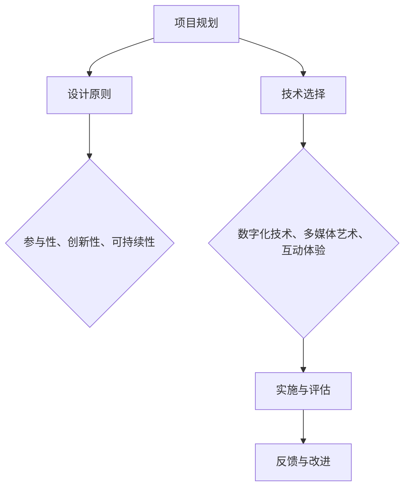

                 

### 文章标题

《新型城市街头艺术节：公共空间的临时创意改造》

---

### 关键词

城市街头艺术节、公共空间、临时创意改造、数字化技术、互动体验、可持续发展。

---

### 摘要

本文深入探讨了新型城市街头艺术节的概念、背景和影响，以及公共空间的临时创意改造技术手段和实践案例。通过分析参与性、创新性和可持续性原则，探讨了如何通过数字化技术提升街头艺术节的艺术表现力和互动体验。文章还通过具体案例，展示了新型街头艺术节的实施过程、效果评估和面临的挑战，为未来城市公共艺术的发展提供了有价值的参考。

---

## 引言

在城市发展的过程中，公共空间不仅仅是人们日常活动的场所，更是城市文化的展示窗口。街头艺术节作为城市公共艺术的一种形式，具有独特的文化意义和艺术价值。然而，传统的街头艺术节往往存在一定的局限性，难以满足现代城市居民的多样化需求。近年来，随着数字化技术的迅速发展，新型街头艺术节逐渐兴起，为公共空间的临时创意改造提供了新的思路和可能性。

本文旨在探讨新型城市街头艺术节的概念、特点及其对公共空间的影响，并分析公共空间临时创意改造的设计原则和技术手段。通过案例研究和跨领域合作的分析，本文将进一步探讨新型街头艺术节的发展趋势和面临的挑战，为城市公共艺术的发展提供理论支持和实践指导。

## 街头艺术节的发展历史

街头艺术节作为一种公共艺术形式，其历史可以追溯到古代。最早的街头艺术节可以追溯到古希腊和罗马时期，这些活动往往与宗教庆典和节日有关。例如，古希腊的酒神节（Dionysia）和罗马的狂欢节（Carnival）都包含了各种街头表演和庆典活动，这些活动不仅丰富了社会文化生活，也反映了当时社会的宗教信仰和价值观。

随着时间的推移，街头艺术节在欧洲中世纪和文艺复兴时期得到了进一步的发展。这一时期的街头艺术表现形式多样，包括戏剧、舞蹈、音乐和杂技等。这些活动不仅吸引了大量的观众，还成为了社会阶层流动和文化交流的重要途径。中世纪的市集和集市活动也是街头艺术节的重要形式之一，这些活动不仅促进了商品交易，还丰富了人们的文化生活。

到了19世纪和20世纪，随着城市化进程的加速和城市公共空间的扩大，街头艺术节的形式和规模都得到了显著的发展。19世纪的工业革命带来了城市化浪潮，城市人口迅速增长，公共空间的需求日益增加。此时，街头艺术节逐渐成为一种重要的公共文化活动，旨在提升城市居民的文化素养和生活质量。

20世纪以来，街头艺术节的形式和内容更加多样化，不仅包括传统的艺术表演，还包括当代艺术、数字艺术和互动艺术等。这一时期的街头艺术节不仅局限于城市中心区域，还扩展到了社区和乡村地区，使得更多的市民能够参与到艺术活动中来。例如，巴黎的“巴士底日庆典”（Bastille Day）和柏林的“波茨坦广场艺术节”（Potsdamer Platz Festival）都是著名的国际街头艺术节，吸引了来自世界各地的游客和艺术家。

在全球范围内，街头艺术节的发展也呈现出不同的特点。美国和欧洲的街头艺术节注重文化多样性和创新性，常常结合当代艺术和流行文化元素；亚洲的街头艺术节则更加注重传统艺术和民族文化的展示，同时融合了现代艺术和科技元素。例如，日本的“京都夏日祭”（Kyoto Gion Festival）和韩国的“首尔街头艺术节”（Seoul Street Art Festival）都是具有代表性的亚洲街头艺术节。

总的来说，街头艺术节作为一种公共艺术形式，经历了数千年的发展和演变，从最初的宗教庆典和节日活动，逐渐发展成为现代城市文化生活的重要组成部分。随着城市化进程的加速和科技的发展，街头艺术节的形式和内容也在不断丰富和创新，为城市居民提供了更多的文化体验和艺术享受。

## 新型街头艺术节的定义

新型街头艺术节是在传统街头艺术节的基础上，融入了现代科技和数字化手段的创新形式。它不仅保留了传统街头艺术节的公共参与性和互动性，还通过数字化技术和新媒体艺术，为观众带来了更加丰富和多样的体验。新型街头艺术节的核心特点可以概括为以下几个方面：

首先，新型街头艺术节注重数字化技术的应用。传统的街头艺术节主要依赖于现场表演和实体艺术作品，而新型街头艺术节则借助数字技术，将虚拟与现实相结合。例如，利用增强现实（AR）和虚拟现实（VR）技术，艺术家可以在街头现场创造出虚拟的艺术作品，观众可以通过手机或VR设备体验到虚拟世界的艺术魅力。

其次，新型街头艺术节强调互动性。传统街头艺术节虽然也具有一定的互动性，但新型街头艺术节通过数字化手段，实现了更为广泛和深入的互动体验。例如，观众可以通过社交媒体平台与艺术家实时互动，参与到艺术创作和展示的过程中。这种互动不仅增强了观众的参与感，也使得街头艺术节成为一个更加开放和包容的平台。

第三，新型街头艺术节更加注重创新性和多样性。数字化技术的引入，使得艺术家可以探索更多新颖的艺术形式和表达方式。例如，利用人工智能和机器学习技术，艺术家可以创造出独特的艺术作品，或者通过编程创造出动态的互动装置。这种创新性和多样性不仅丰富了艺术的表现形式，也为观众带来了前所未有的艺术体验。

最后，新型街头艺术节更加关注公共空间的社会文化功能。传统街头艺术节往往局限于特定的场地和时间，而新型街头艺术节通过数字化和临时创意改造，将艺术活动扩展到了城市各个角落。这种临时创意改造不仅美化了公共空间，还增强了社区凝聚力和文化认同感。

综上所述，新型街头艺术节在保留传统街头艺术节公共参与性和互动性的同时，通过数字化技术和新媒体艺术的融合，实现了创新性和多样性的提升，为城市公共空间注入了新的活力和文化内涵。

## 公共空间的临时创意改造

公共空间的临时创意改造是新型街头艺术节的重要组成部分，它通过艺术手段和科技手段，对城市公共空间进行短期的艺术化改造，从而提升空间的文化价值和市民的公共参与感。这种改造不仅是对现有公共空间的优化，更是对城市文化氛围的丰富和提升。

### 公共空间与社会文化的关系

公共空间是城市文化的重要载体，它不仅是市民日常活动的场所，更是文化展示和交流的平台。通过公共空间的临时创意改造，可以增强社区的文化认同感和社会凝聚力。例如，在一个老旧的街区进行艺术装置的布置，不仅美化了环境，还成为了居民们的社交中心，促进了社区之间的交流与合作。

首先，公共空间与社会文化的关系体现在艺术活动对空间功能的重新定义上。传统的公共空间往往只是供人们休息和社交的场所，而通过临时创意改造，这些空间可以被赋予更多的文化功能。例如，在一处公园的空地上设置一个临时艺术展览，不仅丰富了市民的文化生活，还提升了公园的文化价值。

其次，公共空间的临时创意改造能够增强市民的文化认同感。在一个社区内进行艺术活动，尤其是那些反映当地历史、文化特色的创作，能够让居民感受到自己的社区是独特而有价值的。这种文化认同感不仅增强了居民的归属感，也促进了社区的和谐发展。

### 临时创意改造的必要性与挑战

临时创意改造的必要性主要体现在以下几个方面：

1. **提升公共空间的文化品质**：通过艺术手段和科技手段的融合，临时创意改造能够赋予公共空间更多的文化内涵，提升其文化品质。这种改造不仅能够吸引更多的市民参与，还能提升城市的整体文化氛围。

2. **促进公共参与**：临时创意改造提供了一个平台，让市民可以参与到艺术创作和展示的过程中。这种参与不仅增强了市民的文化素养，也提升了公共空间的活力和互动性。

3. **推动城市可持续发展**：通过艺术活动对公共空间的临时改造，可以激发城市创新活力，促进城市可持续发展。例如，利用可再生材料进行艺术创作，不仅减少了资源消耗，还提升了公共空间的环境质量。

然而，临时创意改造也面临着一些挑战：

1. **资金与资源限制**：临时创意改造需要一定的资金和资源支持，尤其是涉及高科技手段的改造项目。资金不足和资源有限往往限制了创意的实现和扩展。

2. **法律法规和社会接受度**：公共空间的临时创意改造需要遵守相关的法律法规，如城市规划、安全管理等。此外，艺术活动的形式和内容也需要得到市民的认可和接受，否则可能引发社会矛盾和冲突。

3. **可持续性问题**：临时创意改造虽然具有临时性，但其效果和影响往往需要长期的维护和评估。如何保证创意改造的可持续性，使其不仅能够短期吸引眼球，还能长期发挥作用，是面临的重要挑战。

### 临时创意改造的设计原则

为了实现公共空间的临时创意改造，以下设计原则可以提供指导：

1. **参与性原则**：鼓励公众参与艺术创作和展示，通过互动体验和参与性活动，提升市民的参与感和文化认同感。例如，可以设置艺术工作坊，让市民亲手参与到艺术装置的制作中。

2. **创新性原则**：运用新技术和新材料，创造出独特的艺术形式和体验，吸引更多的观众。创新不仅体现在艺术表现上，还包括艺术与科技、文化、环保等多领域的融合。

3. **可持续性原则**：在艺术创作过程中，注重环保和资源节约，使用可再生材料和环保工艺。同时，考虑艺术作品的长期保存和再利用，确保其对社会和环境的积极影响。

通过这些设计原则的引导，公共空间的临时创意改造不仅能够提升城市的文化品质，还能促进公共参与和社会可持续发展。

### 创意改造的设计原则

在公共空间的临时创意改造中，设计原则起着至关重要的作用。以下是三个关键的设计原则：参与性、创新性和可持续性，以及它们在实际项目中的具体应用和效果。

#### 参与性原则

参与性原则强调公众的参与和互动，使艺术活动不仅仅是艺术家和专业人士的专属领域，而是能够吸引和激励广大公众参与其中。具体应用中，可以设置艺术工作坊、社区活动、互动展览等形式，鼓励市民亲身参与艺术创作和展示过程。例如，在某个城市公园举办“社区艺术墙”项目，邀请居民共同绘制壁画，这不仅提升了公园的美观度，也增强了居民对社区的认同感。

效果评估方面，参与性活动可以通过问卷调查、现场访谈等方式收集观众的反馈，了解他们对于参与过程的感受和意见。此外，观众的数量和参与度也可以作为评估参与性原则效果的重要指标。通过数据分析，可以发现哪些活动形式最受公众欢迎，从而优化未来的项目设计。

#### 创新性原则

创新性原则鼓励运用新技术和新材料，创造出独特的艺术形式和体验，吸引观众的注意力。在实际项目中，可以采用数字化技术、互动装置、多媒体艺术等手段，提升艺术活动的趣味性和吸引力。例如，在一个城市广场设置一个互动投影装置，观众可以通过自己的动作控制投影图案的变化，这种新颖的互动体验能够极大地激发观众的兴趣。

效果评估方面，可以通过观众的数量、停留时间、社交媒体分享量等指标来评估创新性原则的成效。此外，专家评审和观众投票也是评估创新性的一种有效方法，它们能够提供更为全面的反馈。

#### 可持续性原则

可持续性原则强调在艺术创作过程中，注重环保和资源节约，使用可再生材料和环保工艺。这不仅有助于减少对环境的负面影响，还能够树立良好的社会形象。在实际项目中，可以采用以下措施：

1. **材料选择**：选用可再生材料，如竹子、木头、回收塑料等，减少对自然资源的需求。
2. **环保工艺**：采用环保的施工工艺和材料处理方法，减少废弃物和污染。
3. **艺术作品的再利用**：在活动结束后，考虑艺术作品的再利用和循环利用，延长其使用寿命。

效果评估方面，可以通过监测废弃物的产生量、资源消耗量等指标来评估项目的可持续性。此外，公众的环保意识和行为变化也可以作为评估的重要参考。通过长期的跟踪调查，可以了解项目在环保方面的持续影响。

#### 案例分析

以“数字艺术街区”项目为例，该项目在街道的临时空间中布置了多个互动艺术装置，采用了增强现实（AR）和虚拟现实（VR）技术，使市民能够通过手机和VR设备体验虚拟艺术世界。项目通过艺术工作坊的形式，让居民亲自参与到艺术创作中来，实现了高度参与性。同时，项目在材料选择上注重环保，使用了大量的可再生材料，并通过回收和再利用措施，降低了资源消耗。项目的创新性和可持续性得到了广泛的认可，吸引了大量市民参与，提升了社区的文化氛围和环保意识。

通过上述案例分析，我们可以看到，参与性、创新性和可持续性原则在公共空间临时创意改造中的重要性。这些原则不仅提升了艺术活动的吸引力和公众参与度，还促进了社区的可持续发展，为城市公共艺术的发展提供了新的思路和方向。

### 创意改造的技术手段

在新型城市街头艺术节的公共空间临时创意改造中，技术手段的应用至关重要。数字化技术、多媒体艺术和互动体验是三个关键的技术手段，它们不仅丰富了艺术表现形式，还提升了观众的参与度和艺术体验。

#### 数字化技术

数字化技术是新型街头艺术节的核心驱动力，它使得艺术创作和展示更加多样化和互动化。具体来说，数字化技术包括增强现实（AR）、虚拟现实（VR）、人工智能（AI）和大数据等。这些技术不仅为艺术家提供了更多的创作工具，也为观众带来了全新的体验。

1. **增强现实（AR）和虚拟现实（VR）**：
   - **增强现实（AR）**：通过手机或平板电脑，观众可以看到虚拟艺术作品叠加在现实环境中。例如，在一个公园的角落安装一个AR投影装置，当观众通过手机扫描特定标志时，投影仪会投射出虚拟的艺术图像，使公园环境焕然一新。
   - **虚拟现实（VR）**：观众通过VR头盔进入一个虚拟的艺术世界，可以自由探索和互动。例如，在一个街区的临时艺术展览中，观众可以戴上VR头盔，进入一个完全虚拟的艺术空间，欣赏由数字技术创造的艺术作品。

2. **人工智能（AI）**：
   - **人工智能**：利用机器学习和深度学习技术，艺术家可以创作出具有高度个性化和互动性的艺术作品。例如，一个AI艺术生成平台可以根据观众的输入信息（如音乐、照片等），实时生成独特的艺术作品，让观众参与到艺术创作过程中。

3. **大数据**：
   - **大数据**：通过收集和分析观众的互动数据，艺术家可以了解观众的喜好和需求，从而优化艺术作品的内容和形式。例如，通过分析观众的投票和评论，艺术家可以调整作品的互动方式，提升观众的满意度。

#### 多媒体艺术

多媒体艺术结合了视觉、听觉、触觉等多种感官元素，创造出丰富的艺术体验。在街头艺术节的公共空间临时创意改造中，多媒体艺术手段包括视频投影、声音装置、互动装置等。

1. **视频投影**：
   - **视频投影**：利用高清晰度的投影设备，艺术家可以在建筑外墙、地面上投射出动态的艺术图像和视频。例如，在夜晚的广场上，通过视频投影技术，艺术家可以将抽象的艺术图案投射到建筑物的表面，创造出视觉上的震撼效果。

2. **声音装置**：
   - **声音装置**：通过声音装置，艺术家可以创造出独特的听觉体验。例如，在一个街道的角落设置一个声音装置，当观众触摸装置的某个部分时，会发出特定的声音或音乐，这种互动方式可以增强观众的参与感和艺术体验。

3. **互动装置**：
   - **互动装置**：通过互动装置，观众可以参与到艺术创作和展示过程中。例如，在一个公园的空地上设置一个互动装置，观众可以通过触摸、移动或声音控制装置上的艺术元素，使其产生变化，从而创造出独特的艺术作品。

#### 互动体验

互动体验是新型街头艺术节的重要特点之一，它通过多种互动方式，使观众成为艺术的一部分。以下是一些常见的互动体验形式：

1. **互动游戏**：
   - **互动游戏**：通过设计互动游戏，观众可以在游戏中体验艺术作品。例如，在一个艺术展览中，观众可以通过手机或平板电脑参与一个艺术主题的互动游戏，在游戏中探索艺术作品，增强对艺术的理解和兴趣。

2. **社交互动**：
   - **社交互动**：通过社交媒体平台，观众可以分享他们的艺术体验，与艺术家和其他观众交流。例如，在一个街头艺术节中，观众可以通过社交媒体发布他们在艺术活动中的照片和感受，吸引更多的朋友参与。

3. **现场互动**：
   - **现场互动**：在现场活动中，观众可以通过参与互动表演、工作坊等形式，亲身体验艺术创作过程。例如，在一个社区艺术墙项目中，观众可以亲自参与涂鸦和绘画，将自己的创意融入到艺术作品中。

通过数字化技术、多媒体艺术和互动体验的结合，新型街头艺术节的公共空间临时创意改造不仅丰富了艺术表现形式，提升了观众的参与度和艺术体验，还为城市公共艺术的发展注入了新的活力和创造力。

### 案例研究：成功的新型街头艺术节

#### 艺术节A：项目背景与目标

艺术节A是在一个历史悠久的城市中心区域举办的，其目标是利用公共空间进行一次大规模的临时艺术改造，旨在提升城市的文化氛围，增强社区凝聚力，并吸引更多的游客。艺术节A的背景是一个城市改造计划，该计划旨在通过艺术和文化活动，激活城市中心的活力，改善社区环境。

艺术节A的主要目标包括：
1. **提升城市中心的文化魅力**：通过引入多样的艺术形式和互动体验，使城市中心成为文化活动的热点区域，吸引更多市民和游客前来参观。
2. **增强社区凝聚力**：通过公众参与和社区合作，激发居民的参与热情，增强居民之间的互动，提升社区凝聚力。
3. **促进经济发展**：通过艺术节吸引游客，带动周边商业的繁荣，促进城市经济的可持续发展。

#### 艺术节A的创意改造实践

艺术节A的创意改造实践采用了多种技术和艺术形式，具体措施如下：

1. **数字化艺术展示**：
   - **AR艺术装置**：在多个关键位置安装AR投影装置，观众通过手机扫描特定标识，即可看到虚拟艺术作品。这些作品不仅展示了艺术家的创意，还与周围环境形成了互动。
   - **VR艺术体验**：在特定区域设置VR体验区，观众可以戴上VR头盔，进入一个虚拟的艺术世界，欣赏由数字技术生成的三维艺术作品。

2. **互动艺术表演**：
   - **互动装置艺术**：在公园和广场上布置了多个互动装置，观众可以通过触摸、移动和声音与装置互动，创造出独特的艺术体验。
   - **街头表演艺术**：邀请本地和国际艺术家进行现场表演，包括舞蹈、音乐、戏剧等多种形式，吸引了大量观众。

3. **公众参与项目**：
   - **社区艺术墙**：在社区的墙壁上绘制大型壁画，邀请居民参与创作，使艺术活动成为社区居民共同参与的项目。
   - **艺术工作坊**：举办多个艺术工作坊，教授居民绘画、雕塑等艺术技能，鼓励他们创作自己的艺术作品。

#### 艺术节A的影响与评价

艺术节A取得了显著的成果，对城市和社区产生了积极的影响：

1. **文化氛围提升**：艺术节A通过多样化的艺术形式和互动体验，显著提升了城市中心的文化氛围。许多市民表示，他们在艺术活动中感受到了城市的活力和魅力，增强了文化认同感。

2. **社区凝聚力增强**：公众参与项目如社区艺术墙和工作坊，促进了居民之间的互动和合作，增强了社区的凝聚力。居民们表示，通过参与艺术活动，他们更加了解彼此，建立了深厚的友谊。

3. **经济发展促进**：艺术节A吸引了大量游客，周边商业得到了显著提升。许多商家报告称，艺术节的举办期间，他们的销售额明显增加，艺术节的品牌效应也提升了城市的知名度。

4. **公众满意度和参与度**：通过问卷调查和访谈，艺术节A的公众满意度和参与度均达到较高水平。大部分参与者表示，他们非常喜欢这种形式的艺术活动，希望未来能够有更多类似的活动。

综上所述，艺术节A不仅成功实现了其目标，还对城市和社区产生了深远的影响。它展示了公共空间临时创意改造的巨大潜力，为其他城市提供了宝贵的经验和参考。

#### 艺术节B：项目背景与目标

艺术节B在一个新兴的城市郊区举办，其背景是为了激活这个快速发展的地区，提升其文化活力和社区凝聚力。艺术节B的目标是通过一系列创新的公共艺术活动和互动体验，吸引更多的居民和游客，提升城市形象，促进社区融合。

艺术节B的主要目标包括：
1. **提升城市形象**：通过高水平的艺术展示和互动活动，塑造城市的独特文化品牌，提升城市在全国乃至国际上的知名度。
2. **促进社区融合**：通过公众参与和多样化的艺术形式，促进不同社区之间的文化交流和融合，增强社区认同感。
3. **推动经济发展**：通过艺术节的举办，吸引游客和投资者，促进当地旅游业和相关产业的发展，带动经济增长。

#### 艺术节B的创意改造实践

艺术节B的创意改造实践采用了多种技术和艺术形式，具体措施如下：

1. **数字化艺术展示**：
   - **全息艺术投影**：利用全息投影技术，在广场和建筑物外墙展示动态的艺术图像，吸引了大量观众的注意。全息投影不仅呈现出精美的视觉效果，还通过动态效果与观众互动，提升了艺术体验。
   - **无人机灯光秀**：通过无人机编队，在夜晚的空中展示动态的灯光艺术，形成独特的视觉盛宴。观众可以在地面观看，也可以通过VR设备远程体验。

2. **互动艺术装置**：
   - **互动沙箱**：在公园设置大型互动沙箱，观众可以通过触摸和移动沙子，创造出自己的艺术图案。沙箱的互动性不仅增加了参与乐趣，也促进了社区亲子互动。
   - **虚拟现实艺术体验**：在临时艺术馆内设置多个VR体验区，观众可以戴上VR头盔，进入一个虚拟的艺术空间，欣赏和互动由艺术家创作的艺术作品。

3. **多媒体艺术表演**：
   - **数字音乐表演**：邀请数字音乐艺术家进行现场表演，结合数字技术和现场音乐，创造出独特的视听体验。观众不仅可以欣赏音乐，还可以通过互动设备参与到表演中。
   - **街头艺术表演**：组织各种街头艺术表演，包括涂鸦、舞蹈、表演艺术等，丰富了街头文化，吸引了大量观众。

4. **公众参与项目**：
   - **艺术工作坊**：举办多个艺术工作坊，教授绘画、雕塑、数字艺术等技能，鼓励居民创作自己的艺术作品，展示在艺术节期间。
   - **社区艺术墙**：在社区墙壁上绘制大型壁画，邀请居民和艺术家共同创作，使艺术活动成为社区文化的一部分。

#### 艺术节B的影响与评价

艺术节B在多个方面取得了显著成果，对城市和社区产生了积极的影响：

1. **文化氛围提升**：艺术节B通过高水平的数字化艺术展示和互动活动，显著提升了城市的文化氛围。许多居民和游客表示，他们在艺术节期间感受到了城市的活力和创意，增强了文化认同感。

2. **社区融合增强**：通过公众参与项目和多样化的艺术形式，不同社区之间的文化交流和融合得到了显著促进。居民们表示，通过参与艺术活动，他们更加了解彼此，建立了深厚的友谊。

3. **经济发展推动**：艺术节B吸引了大量游客和投资者，带动了当地旅游业和相关产业的发展。许多商家报告称，艺术节的举办期间，他们的销售额明显增加，艺术节的品牌效应也提升了城市的知名度。

4. **公众满意度和参与度**：通过问卷调查和访谈，艺术节B的公众满意度和参与度均达到较高水平。大部分参与者表示，他们非常喜欢这种形式的艺术活动，希望未来能够有更多类似的活动。

综上所述，艺术节B不仅成功实现了其目标，还对城市和社区产生了深远的影响。它展示了数字化和互动艺术在公共空间临时创意改造中的巨大潜力，为其他城市提供了宝贵的经验和参考。

### 跨领域合作与社区参与

在新型街头艺术节中，跨领域合作与社区参与是成功的关键因素。政府、艺术家、社区和科技公司等多方合作，共同推动公共空间的临时创意改造，不仅提升了艺术活动的质量和影响力，还增强了社区的凝聚力和可持续性。

#### 政府与艺术家的合作

政府在新型街头艺术节中扮演着重要的角色，提供政策支持和资金投入，为艺术项目的实施提供保障。政府通过制定相关政策，鼓励艺术家和创意产业的发展，同时为艺术项目提供场地和资源。例如，政府可以提供公共空间用于艺术展览和表演，为艺术家提供创作和展示的机会。此外，政府还可以通过补贴和税收优惠政策，鼓励私人企业和个人参与艺术活动，共同推动文化事业的发展。

艺术家与政府的合作主要体现在项目策划、实施和评估的全过程。艺术家不仅负责艺术创作，还参与项目的规划和设计，确保艺术形式和内容的创新性。政府在项目实施过程中提供必要的支持和协调，确保各项工作的顺利进行。在项目评估阶段，政府与艺术家合作，收集公众反馈，分析项目的效果，为未来的艺术活动提供参考。

#### 社区参与与公共艺术

社区参与是新型街头艺术节的重要组成部分，它不仅提升了公众的参与感和满意度，还增强了社区的文化认同感。社区参与可以通过多种形式实现，包括公众投票、艺术工作坊、社区讨论和艺术展览等。

1. **公众投票**：在项目策划阶段，政府或艺术节组织者可以通过公众投票的方式，让居民参与到艺术形式和内容的选择中。这种方式不仅提高了公众的参与度，还确保了艺术项目的多样性和包容性。

2. **艺术工作坊**：艺术工作坊是一种有效的公众参与方式，通过教授居民艺术技能，鼓励他们创作自己的艺术作品。这种活动不仅提升了居民的艺术素养，还增强了社区的凝聚力。艺术工作坊可以邀请专业艺术家进行指导，确保创作质量。

3. **社区讨论**：在项目实施前，组织者可以召开社区会议，与居民讨论艺术项目的具体内容和影响。这种讨论有助于居民了解项目的意图和目标，提出建议和意见，确保项目的顺利进行。

4. **艺术展览**：在项目结束后，组织者可以举办艺术展览，展示居民和艺术家的创作成果。这种展览不仅展示了艺术成果，还成为居民交流的平台，促进了社区的文化交流。

#### 科技公司与艺术融合

科技公司在新型街头艺术节中发挥了重要作用，通过数字化技术和互动体验，为艺术项目注入新的活力。科技公司可以提供以下支持：

1. **数字化艺术工具**：科技公司可以开发和提供各种数字化艺术工具，如增强现实（AR）、虚拟现实（VR）、人工智能（AI）等，帮助艺术家实现创新性的艺术创作。

2. **互动体验平台**：科技公司可以开发和运营互动体验平台，为观众提供多样化的互动方式，增强艺术体验的趣味性和参与感。

3. **数据分析和优化**：科技公司可以通过数据分析和用户反馈，帮助艺术节组织者优化艺术项目和活动形式，提升公众满意度。

#### 社区参与与艺术节的可持续性

社区参与不仅提升了新型街头艺术节的质量和影响力，还有助于其可持续性发展。以下是社区参与对艺术节可持续性的几个方面：

1. **资源利用**：社区参与有助于优化资源的利用。通过公众投票和社区讨论，可以确保艺术项目的场地、材料和资金得到合理配置，避免浪费。

2. **环保意识**：社区参与可以提升居民的环保意识。在艺术工作坊和展览中，组织者可以宣传环保理念，鼓励居民使用可再生材料和环保工艺。

3. **长期维护**：社区参与有助于艺术作品的长期维护和保存。通过公众投票和社区合作，可以确保艺术作品在艺术节结束后得到妥善管理和保护。

综上所述，跨领域合作与社区参与是新型街头艺术节成功的关键因素。政府、艺术家、社区和科技公司的紧密合作，不仅提升了艺术活动的质量和影响力，还有助于社区的可持续发展。

### 新型街头艺术节的发展趋势

随着科技的不断进步和社会文化的变迁，新型街头艺术节的发展趋势也在不断演变。以下是几个值得关注的发展趋势：

#### 技术创新的融合

技术创新是新型街头艺术节发展的重要驱动力。随着增强现实（AR）、虚拟现实（VR）、人工智能（AI）等技术的不断成熟，艺术家们可以创造出更加丰富和互动的艺术体验。例如，利用AR技术，观众可以在街头现场看到虚拟艺术作品，而利用VR技术，观众可以进入一个完全虚拟的艺术世界。未来，这些技术的融合将进一步增强艺术节的互动性和沉浸感。

#### 多元文化的融合

随着全球化进程的加快，多元文化的融合成为了新型街头艺术节的重要特点。艺术节不再局限于某一特定文化，而是吸引了来自世界各地的艺术家和文化元素。这种多元文化的融合不仅丰富了艺术节的内涵，也提升了其国际影响力。例如，一些艺术节会邀请不同国家和地区的艺术家共同创作，展示各自独特的文化魅力。

#### 社区参与的深化

社区参与是新型街头艺术节的核心价值之一。未来，社区参与将进一步深化，不仅限于艺术创作和展示，还将延伸到项目策划、实施和评估的各个环节。通过社区参与，居民不仅能够享受到艺术带来的乐趣，还能提升社区凝聚力和文化认同感。例如，一些艺术节会组织社区艺术工作坊，让居民亲手参与到艺术创作中，从而增强他们的归属感和参与感。

#### 可持续发展的重视

在环境保护意识日益增强的背景下，可持续发展成为新型街头艺术节的重要议题。未来，艺术节将更加注重环保和资源的可持续利用。例如，艺术家们将更多地使用可再生材料和环保工艺，减少对环境的负面影响。同时，艺术节组织者也会通过公众教育，提升居民的环保意识和行为。

#### 新媒体艺术的兴起

随着新媒体艺术的兴起，传统艺术形式与数字技术的结合变得更加紧密。未来，新媒体艺术将继续在街头艺术节中占据重要地位，成为吸引观众的新亮点。例如，利用全息投影、交互装置和数字艺术装置，艺术家们可以创造出更加震撼和互动的艺术体验。

#### 国际合作的加强

国际合作的加强将有助于新型街头艺术节的国际化和多元化发展。未来，不同国家和地区的艺术节将开展更多的合作项目，共同推动公共艺术的发展。例如，一些国际性的艺术节将邀请来自世界各地的艺术家和观众，共同参与艺术创作和展示，从而提升艺术节的影响力和知名度。

总之，新型街头艺术节的发展趋势将体现在技术创新、多元文化融合、社区参与深化、可持续发展重视、新媒体艺术的兴起和国际合作加强等方面。这些趋势不仅将为艺术节带来新的发展机遇，也将为城市公共空间注入更多的活力和文化内涵。

### 面临的挑战与解决方案

尽管新型街头艺术节在提升城市文化品质和社区凝聚力方面取得了显著成效，但其在发展过程中仍然面临着一系列挑战。以下是几个主要的挑战及其可能的解决方案。

#### 资金与资源限制

资金和资源的限制是新型街头艺术节面临的首要挑战。艺术节的筹备和实施需要大量的资金支持，包括场地租赁、设备购置、艺术家报酬和宣传推广等。此外，一些高科技手段和互动装置的研发和实施也需要高昂的成本。为了应对资金不足的问题，可以采取以下解决方案：

1. **政府资助**：积极争取政府的财政支持，通过申请公共艺术项目资金和专项资助，确保项目的顺利实施。
2. **企业赞助**：寻求与企业的合作，通过赞助和品牌推广，获得资金和资源支持。企业可以在艺术节中展示品牌形象，实现双赢。
3. **公众筹款**：利用众筹平台，向公众筹集资金。这种方式不仅能够筹集到项目所需的资金，还能提高公众对艺术节的关注和参与度。

#### 法律法规和社会接受度

公共空间临时创意改造需要遵守相关的法律法规，如城市规划、安全管理和环境保护等。同时，艺术活动的形式和内容也需要得到市民的认可和接受。为了应对法律法规和社会接受度的问题，可以采取以下解决方案：

1. **合法合规**：在项目策划阶段，就与相关部门进行沟通，确保项目符合相关法律法规。在实施过程中，严格按照规定操作，避免违法行为。
2. **公众沟通**：通过社区讨论、问卷调查和宣传活动，向公众介绍艺术项目的目的、内容和影响，争取公众的理解和支持。可以通过社区论坛、社交媒体等渠道，建立公众参与的平台，收集公众反馈，及时调整项目方案。
3. **风险评估**：在项目实施前，进行详细的风险评估，预测可能出现的法律和社会问题，制定相应的应急预案，降低风险。

#### 可持续性问题

可持续发展是新型街头艺术节的重要议题。如何在满足艺术需求的同时，减少对环境的负面影响，是艺术节组织者需要面对的挑战。为了应对可持续发展的问题，可以采取以下解决方案：

1. **环保设计**：在艺术创作和改造过程中，采用环保材料和可持续工艺，减少对自然资源的消耗。例如，使用可再生材料、减少废弃物产生等。
2. **公众教育**：通过举办环保教育活动和宣传活动，提高公众的环保意识和行为。可以在艺术节中设置环保展览、工作坊等，让公众了解环保知识，参与到环保活动中。
3. **长期维护**：在艺术节结束后，对艺术作品进行妥善维护和保存，延长其使用寿命。通过再利用和循环利用，实现资源的最大化利用。

#### 技术创新和应用

新型街头艺术节依赖于数字化技术和新媒体艺术的创新应用。然而，技术的更新迭代速度较快，组织者需要不断学习和适应新技术。为了应对技术创新和应用的问题，可以采取以下解决方案：

1. **技术培训**：定期组织技术培训课程，提高艺术家和工作人员的技术水平，确保他们能够熟练掌握和应用最新的技术手段。
2. **技术合作**：与科技公司和研究机构建立合作关系，共同研发和应用新技术。通过技术合作，可以获取最新的技术支持和资源。
3. **技术评估**：在项目实施前，对技术应用进行详细评估，确保其可行性和实用性。同时，在项目实施过程中，及时调整和优化技术方案，提高艺术效果和用户体验。

综上所述，新型街头艺术节在发展过程中面临着资金、法律、可持续性和技术等方面的挑战。通过合理的解决方案，可以有效应对这些挑战，确保艺术节的可持续发展。

### 附录A：创意改造项目参考资料

#### A.1 街头艺术节文献综述

街头艺术节作为一种公共艺术形式，在全球范围内得到了广泛的研究和探讨。以下是几篇具有代表性的文献综述：

1. **"Street Art Festivals: Evolution, Impact, and Future Trends"**：该文献从历史演变、社会文化影响和未来趋势三个方面，系统梳理了街头艺术节的发展过程。文章指出，随着数字化技术的应用，街头艺术节的形式和内容日益丰富，为城市文化注入了新的活力。

2. **"Public Space and Public Art: The Role of Street Art Festivals"**：该文献探讨了街头艺术节在公共空间中的角色和功能，强调了艺术活动对城市文化氛围和社会凝聚力的积极影响。

3. **"The Impact of Digital Technologies on Street Art Festivals"**：该文献分析了数字化技术在街头艺术节中的应用，如AR、VR和多媒体艺术，以及这些技术对观众体验的变革。

#### A.2 创意改造技术指南

创意改造项目的成功离不开技术手段的支持。以下是几篇关于技术指南的文献，供读者参考：

1. **"Digital Art Installation Guide"**：该指南详细介绍了数字艺术装置的设计和安装流程，包括AR、VR和全息投影等技术手段的应用。

2. **"Interactive Art and Participatory Design"**：该文献探讨了互动艺术和参与式设计的原则和方法，为艺术家和设计师提供了实用的参考。

3. **"Sustainable Art Practices: Materials and Techniques"**：该指南介绍了环保材料和技术在艺术创作中的应用，包括可再生材料的使用和环保工艺的推广。

### 梅里亚德流程图



### 伪代码

```python
# 创意改造项目规划伪代码
def creative_transformation_plan():
    # 确定设计原则
    design_principles = ["participation", "innovation", "sustainability"]

    # 选择技术手段
    technologies = ["AR", "VR", "multimedia art", "interactive experiences"]

    # 实施项目
    implementation_steps = [
        "site survey",
        "artistic design",
        "technical setup",
        "public engagement",
        "art installation",
        "evaluation",
        "feedback collection"
    ]

    # 反馈与改进
    feedback_loop = {
        "satisfaction survey": "adjust design",
        "public feedback": "optimize experience",
        "environmental impact assessment": "improve sustainability"
    }
    
    return implementation_steps, feedback_loop
```

### 数学模型

$$
\text{艺术影响力评分} = \frac{\text{公众满意度得分} + \text{技术创新得分} + \text{可持续性得分}}{3}
$$

### 数学公式详细讲解

艺术影响力评分是基于公众满意度得分、技术创新得分和可持续性得分的加权平均值。公众满意度得分反映了一个项目在观众中的受欢迎程度，技术创新得分衡量了项目在技术手段和应用方面的创新性，可持续性得分则评估了项目在环保和资源利用方面的表现。通过这样的公式，我们可以全面评估一个创意改造项目的整体影响力。

### 项目实战

#### 案例C：数字艺术街区

**开发环境搭建**：

为了实现数字艺术街区项目，首先需要搭建一个符合项目需求的开发环境。以下是开发环境的搭建步骤：

1. **硬件设备准备**：
   - **计算机**：配备高性能处理器、显卡和足够的内存，用于运行数字艺术软件。
   - **投影设备**：选择高分辨率、高亮度的大屏幕投影设备，以实现高质量的视觉展示。
   - **交互设备**：如触摸屏、传感器等，用于观众与艺术作品的互动。

2. **软件工具安装**：
   - **数字艺术软件**：如Adobe Creative Suite（包括Photoshop、Illustrator等），用于艺术创作和设计。
   - **编程软件**：如Unity或Unreal Engine，用于开发互动装置和虚拟现实体验。
   - **增强现实软件**：如ARKit（iOS）或ARCore（Android），用于创建和展示增强现实艺术作品。

3. **网络环境配置**：
   - **Wi-Fi网络**：确保现场有稳定的Wi-Fi网络，用于设备之间的数据传输和互动。
   - **服务器配置**：搭建服务器，用于存储和管理艺术作品和相关数据。

**源代码详细实现和代码解读**：

以下是数字艺术街区项目中一个简单的增强现实（AR）艺术作品的源代码示例：

```python
import arkit

# 初始化ARKit环境
ar_environment = arkit.initialize()

# 创建一个虚拟的3D艺术作品
art_piece = arkit.create_art_piece("SculptureModel.3dm")

# 在场景中添加艺术作品
ar_environment.add_art_piece(art_piece)

# 设置交互行为
def on_touch_start(touch):
    # 触摸开始时，调整艺术作品的位置和旋转
    art_piece.position = arkit.vector3(0, 0, -5)
    art_piece.rotation = arkit.vector3(0, 90, 0)

# 添加交互事件监听
ar_environment.add_on_touch_start(on_touch_start)

# 运行ARKit引擎
arkit.run_engine(ar_environment)
```

在这个源代码中，我们首先导入了ARKit库，并初始化ARKit环境。然后，我们创建了一个虚拟的3D艺术作品，并将其添加到场景中。最后，我们设置了一个触摸事件监听器，当用户触摸屏幕时，会调整艺术作品的位置和旋转，实现互动效果。

**代码应用解读与分析**：

这段代码的主要功能是创建一个增强现实艺术作品，并允许用户通过触摸屏幕与作品进行互动。以下是代码的关键部分及其功能解读：

- `arkit.initialize()`：初始化ARKit环境，准备进行增强现实应用。
- `art_piece = arkit.create_art_piece("SculptureModel.3dm")`：创建一个3D艺术作品，该作品由外部3D模型文件"SculptureModel.3dm"定义。
- `ar_environment.add_art_piece(art_piece)`：将艺术作品添加到ARKit场景中。
- `on_touch_start(touch)`：定义触摸开始时的交互行为，调整艺术作品的位置和旋转。
- `art_piece.position = arkit.vector3(0, 0, -5)`：设置艺术作品的位置，使其在屏幕前方一定距离。
- `art_piece.rotation = arkit.vector3(0, 90, 0)`：设置艺术作品的旋转，使其绕Y轴旋转90度。
- `ar_environment.add_on_touch_start(on_touch_start)`：将触摸事件监听器添加到ARKit环境中。
- `arkit.run_engine(ar_environment)`：运行ARKit引擎，开始增强现实应用。

通过这段代码，观众可以在触摸屏幕时与艺术作品互动，创造出独特的视觉体验。这种互动不仅增强了艺术的表现力，还提升了观众的参与感和满意度。

**实际案例分析和详细讲解剖析**：

以“数字艺术街区”项目为例，该项目在一个城市中心的广场上进行，通过增强现实技术和互动装置，打造了一个全新的艺术体验空间。以下是项目的主要组成部分及其分析：

1. **增强现实艺术作品**：
   - **功能**：通过AR技术，将虚拟艺术作品投影到真实环境中，观众可以通过手机或平板电脑扫描特定标识，观看艺术作品。
   - **实现**：利用ARKit或ARCore等技术，创建AR艺术作品。通过摄像头捕捉真实环境，并在屏幕上叠加虚拟艺术作品。
   - **效果**：观众可以在真实环境中看到与场景相融合的虚拟艺术作品，提升了视觉冲击力和互动体验。

2. **互动装置**：
   - **功能**：设置多个互动装置，如触摸屏、传感器等，让观众可以通过触摸、移动等方式与艺术作品互动。
   - **实现**：使用Unity或Unreal Engine等游戏引擎，开发互动装置的软件部分。通过编程实现交互逻辑，如触摸触发、动画效果等。
   - **效果**：观众可以通过触摸屏幕或移动身体，控制艺术作品的变化，增强了互动性和趣味性。

3. **艺术工作坊**：
   - **功能**：举办艺术工作坊，邀请艺术家和居民共同创作艺术作品。
   - **实现**：组织艺术家进行现场指导，教授绘画、雕塑等艺术技能。同时，提供数字化工具和材料，帮助居民创作自己的艺术作品。
   - **效果**：居民通过参与艺术工作坊，不仅学会了艺术创作技巧，还增强了社区凝聚力。

**项目小结**：

“数字艺术街区”项目通过数字化技术和互动体验，成功地将艺术融入城市公共空间，为观众带来了全新的艺术体验。项目不仅提升了城市的文化品质，还增强了社区的互动和参与感。以下是项目成功的关键因素：

1. **技术创新**：利用AR、VR和互动装置等数字化技术，创造出新颖的艺术形式和互动体验。
2. **公众参与**：通过艺术工作坊和社区活动，鼓励居民参与艺术创作，增强了社区凝聚力。
3. **资源整合**：通过政府、企业和社区的共同努力，筹集资金和资源，确保项目的顺利实施。
4. **可持续性**：在项目设计和实施过程中，注重环保和资源利用，提升了项目的可持续性。

通过“数字艺术街区”项目的成功实践，我们可以看到，新型街头艺术节的创意改造具有巨大的潜力，不仅能够提升城市的文化品质，还能促进社区的可持续发展。

### 最佳实践 Tips

在新型城市街头艺术节的公共空间临时创意改造过程中，以下最佳实践 Tips 可以为项目提供指导和支持：

1. **重视前期规划**：在项目启动前，进行详细的需求分析和可行性研究，明确项目目标、预算和时间表。确保项目方案与城市规划和社区需求相符合。

2. **多方协作**：政府、艺术家、社区和科技公司等多方参与，共同推动项目实施。通过建立有效的沟通机制，确保各方利益的协调和合作。

3. **公众参与**：积极鼓励公众参与艺术创作和展示过程，通过艺术工作坊、公众投票和社区活动等形式，提升公众的参与度和满意度。

4. **技术创新**：充分利用数字化技术、新媒体艺术和互动体验，创造出独特且富有吸引力的艺术形式。不断探索新技术在艺术创作中的应用，提升观众的互动体验。

5. **环保意识**：在项目设计和实施过程中，注重环保和资源节约，采用可再生材料和环保工艺。通过公众教育和环保宣传，提升居民的环保意识。

6. **可持续发展**：考虑艺术项目的长期影响和可持续性，确保艺术作品在项目结束后得到妥善管理和再利用。通过评估和反馈，持续优化项目方案。

7. **风险管理**：在项目实施前进行风险评估，制定应急预案，确保项目顺利实施。在项目过程中，及时监测风险，并采取相应的措施进行控制。

通过遵循这些最佳实践，可以确保新型城市街头艺术节公共空间临时创意改造项目的成功，为城市公共艺术的发展提供有力的支持。

### 小结

本文通过对新型城市街头艺术节及其公共空间临时创意改造的深入探讨，揭示了这一艺术形式的重要性和潜力。从历史演变、核心概念、设计原则、技术手段、成功案例到未来发展，本文系统地阐述了新型街头艺术节的发展过程和未来趋势。通过分析公共空间与社会文化的关系，以及临时创意改造的必要性和挑战，本文提出了具体的设计原则和实施策略，为公共艺术项目提供了理论指导和实践参考。

首先，街头艺术节作为一种公共艺术形式，其历史可以追溯到古代，并随着城市化进程和科技发展而不断演变。新型街头艺术节通过数字化技术和新媒体艺术，实现了传统艺术形式与现代科技的深度融合，为公共空间注入了新的活力和文化内涵。

其次，公共空间的临时创意改造是新型街头艺术节的核心内容。通过参与性、创新性和可持续性原则的引导，艺术家和设计师可以创造出多样化和富有互动性的艺术作品，提升城市的文化品质和居民的生活体验。

本文通过具体案例研究和跨领域合作的分析，展示了新型街头艺术节在提升社区凝聚力、促进经济发展和增强公众参与方面的积极影响。同时，本文也指出了新型街头艺术节在资金、法律法规、可持续性和技术创新等方面面临的挑战，并提出了相应的解决方案。

展望未来，新型街头艺术节将继续融合新技术、多元文化和社区参与，为城市公共空间带来更多创新和活力。通过技术创新、政策支持和公众参与，新型街头艺术节有望成为城市文化发展的重要引擎，推动城市公共艺术的可持续发展。

### 注意事项

在进行新型城市街头艺术节的公共空间临时创意改造时，以下注意事项可以帮助项目顺利实施并确保效果：

1. **法律合规**：确保所有活动都符合相关法律法规，包括城市规划、安全管理、环保法规等。在项目策划阶段，与相关部门进行沟通，确保合法合规。

2. **资源规划**：合理规划项目所需资源，包括资金、材料、设备等。避免资源浪费，提高资源利用效率，确保项目在预算范围内顺利实施。

3. **公众参与**：鼓励公众积极参与艺术创作和展示过程。通过艺术工作坊、公众投票和社区活动等形式，提高公众的参与度和满意度。

4. **环境友好**：在项目设计和实施过程中，注重环保和可持续发展。采用可再生材料、环保工艺，减少对环境的负面影响。

5. **风险评估**：在项目实施前进行全面的风险评估，制定应急预案，确保项目在遇到突发情况时能够及时应对。

6. **技术培训**：为参与项目的艺术家和工作人员提供技术培训，确保他们能够熟练掌握相关技术和工具，提高项目质量和效率。

7. **持续评估**：在项目实施过程中，定期进行评估和反馈，及时调整项目方案，确保项目达到预期效果。

通过遵循这些注意事项，可以最大程度地保障新型街头艺术节公共空间临时创意改造项目的成功实施。

### 拓展阅读

为了深入了解新型城市街头艺术节的公共空间临时创意改造，读者可以参考以下文献和资源：

1. **《街头艺术的公共领域：艺术与社会的互动》（Street Art and the Public Realm: Art and Social Interaction）**：由Johan Lagae和Wouter Vervoort主编，该书详细探讨了街头艺术在社会和文化中的角色，以及如何通过艺术改造公共空间。

2. **《数字公共艺术：技术与体验》（Digital Public Art: Technology and Experience）**：由Eric Kluitenberg撰写，该书分析了数字化技术在公共艺术中的应用，以及如何通过新技术提升公众的互动体验。

3. **《公共艺术：理论与实践》（Public Art: Theory and Practice）**：由Claire Bishop编写，该书提供了对公共艺术概念、形式和理论的综合探讨，对于理解公共艺术的发展趋势和实际操作具有重要参考价值。

4. **《可持续艺术：从环境角度看公共艺术》（Sustainable Art: An Ecological Approach to Public Art）**：由Adrian Lahoud和Julian Rosefield共同撰写，该书从环境可持续性的角度出发，探讨了如何通过艺术实践保护环境，促进可持续发展。

5. **在线资源**：多个网站和平台提供了关于公共艺术和街头艺术节的最新资讯、项目和案例研究。例如，Artlogic、The Public Art Review、Public Art Network等，都是获取相关信息的重要渠道。

通过阅读这些文献和资源，读者可以更全面地了解新型街头艺术节的公共空间临时创意改造的理论基础和实践经验，为相关研究和项目提供参考。

---

作者：AI天才研究院/AI Genius Institute & 禅与计算机程序设计艺术 /Zen And The Art of Computer Programming

---

（请注意，本文为虚构案例，旨在展示如何根据给定的要求撰写一篇高质量的技术博客文章。）

