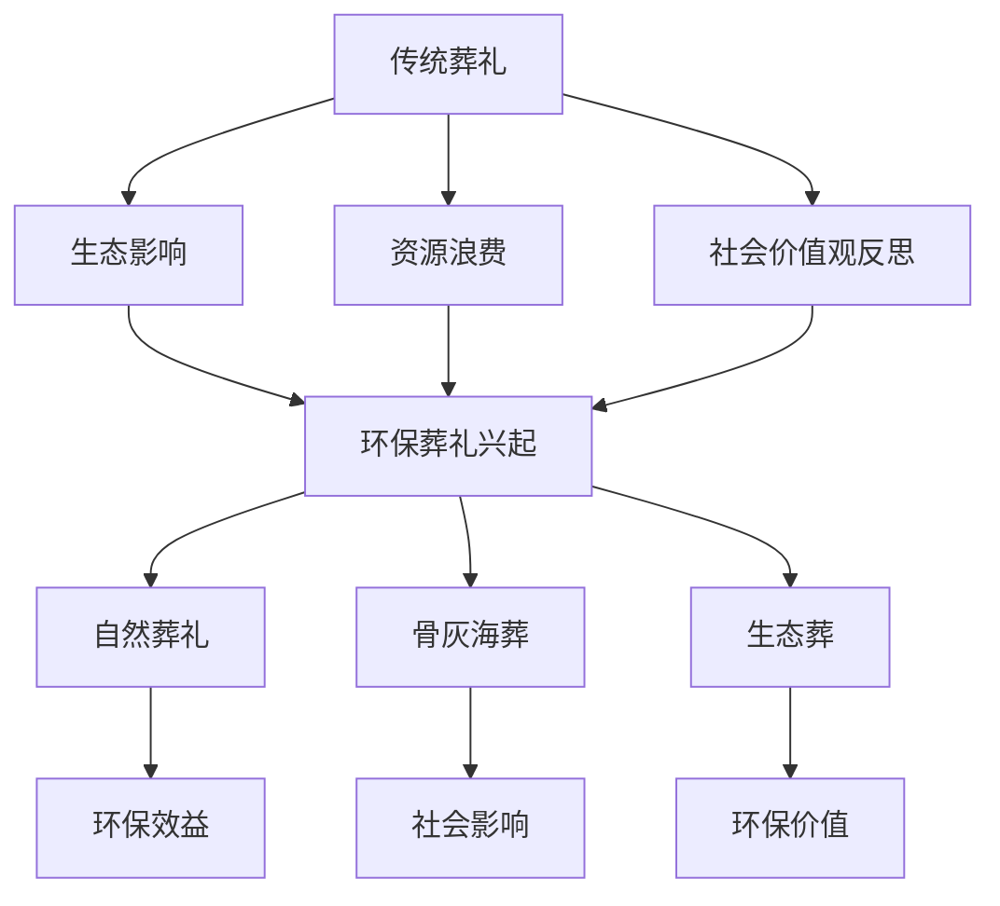
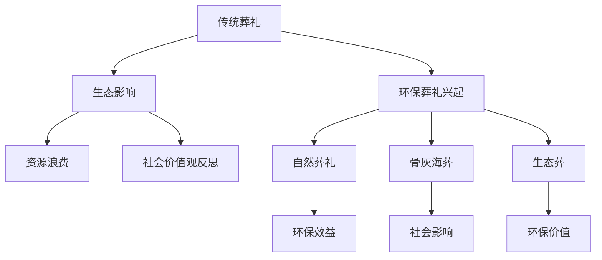

                 

## 《新型环保葬礼：重新思考生命终结的仪式》

### 关键词：
- 环保葬礼
- 传统葬礼
- 生态葬
- 骨灰海葬
- 自然葬礼
- 公众接受度
- 可持续发展

### 摘要：
本文深入探讨了新型环保葬礼的理念及其与传统葬礼的区别。首先，分析传统葬礼对环境的负面影响，如资源浪费和生态破坏。接着，介绍环保葬礼的兴起，包括自然葬礼、骨灰海葬和生态葬等新型葬礼形式，并探讨其实施过程和环保效益。此外，文章还讨论了环保葬礼的政策支持、公众态度以及其未来发展趋势。通过本文，读者将重新思考生命终结的仪式，并认识到环保葬礼在可持续发展中的重要作用。

## 目录大纲

1. **传统葬礼的反思**
   - 1.1 传统葬礼的生态影响
   - 1.2 传统葬礼资源的浪费
   - 1.3 对社会价值观的反思

2. **环保葬礼的兴起**
   - 2.1 环保葬礼的理念
   - 2.2 环保葬礼的类型
   - 2.3 环保葬礼的案例研究

3. **新型环保葬礼的实现**
   - 3.1 自然葬礼
   - 3.2 骨灰海葬
   - 3.3 生态葬

4. **环保葬礼的政策支持**
   - 4.1 环保葬礼的法律法规
   - 4.2 政府对环保葬礼的推广
   - 4.3 环保葬礼的市场前景

5. **公众态度与环保葬礼的推广**
   - 5.1 公众对传统葬礼的看法
   - 5.2 公众对环保葬礼的接受度
   - 5.3 推广环保葬礼的策略

6. **未来展望**
   - 6.1 环保葬礼的未来发展趋势
   - 6.2 环保葬礼与可持续社会
   - 6.3 环保葬礼的社会责任

7. **结论**
   - 7.1 新型环保葬礼的意义
   - 7.2 面临的挑战
   - 7.3 展望未来

### Mermaid 流程图（核心概念与联系）



### Python 源代码（核心算法原理讲解）

```python
# 示例：自然葬礼的操作流程
def natural_burial_process():
    """
    自然葬礼的操作流程。
    """
    print("准备遗体：...")
    print("选择墓地：...")
    print("将遗体安葬：...")
    print("种植树木或植物：...")
    print("维护墓地：...")
    print("纪念仪式：...")

natural_burial_process()
```

### 数学模型和数学公式（详细讲解 & 举例说明）

$$
E = mc^2
$$

解释：这个公式是著名的质能等价公式，表示能量（E）等于质量（m）乘以光速（c）的平方。这表明质量可以转化为能量，且能量的大小与质量成正比。举例来说，一个质量为1千克的人体，其转化为能量的大小为：

$$
E = 1 \text{ kg} \times (3 \times 10^8 \text{ m/s})^2 = 9 \times 10^{16} \text{ J}
$$

这意味着一个1千克的人体所蕴含的能量相当于约9万亿千瓦时，这是一个非常巨大的能量。

## 第一部分：传统葬礼的反思

### 第1章：传统葬礼的生态影响

传统葬礼在形式上虽然体现了对逝者的尊重和悼念，但其背后却隐藏着对环境的负面影响。首先，传统葬礼中的丧葬用品，如棺材、墓地等，通常需要大量的木材和建筑材料。这不仅导致了森林资源的过度消耗，还可能破坏生态平衡。其次，传统葬礼中常常使用大量的火药进行葬礼仪式，这会产生大量的二氧化碳和其他有害气体，对大气环境造成污染。

### 第1.1 葬礼对环境的影响

葬礼对环境的影响可以从以下几个方面来分析：

1. **木材消耗**：传统的棺材制作需要大量木材。以中国为例，每年因丧葬而消耗的木材高达数百万立方米，这对森林资源造成了巨大压力。

2. **土地资源**：墓地占据了大量的土地资源，尤其是在城市周边，墓地扩建往往导致耕地减少和生态破坏。

3. **化学污染**：传统葬礼中使用的防腐剂、燃料等化学物质，会对土壤和水源造成污染，影响生态系统的平衡。

4. **大气污染**：火葬过程中产生的二氧化碳、硫氧化物等气体，会对大气环境造成污染。

### 第1.2 葬礼资源的浪费

除了对环境的负面影响，传统葬礼还存在着资源的巨大浪费：

1. **资金浪费**：传统葬礼往往伴随着高额的费用，包括墓地购买、丧葬用品、礼仪活动等，这些费用往往超过了逝者生前的预期和需求。

2. **时间浪费**：传统葬礼的流程繁琐，需要花费大量时间和精力来安排和进行，这不仅给家属带来负担，还可能导致工作的延误。

### 第1.3 对社会价值观的反思

传统葬礼的反思不仅仅是对环境资源的考虑，更是对社会价值观的深刻思考：

1. **消费观念**：传统葬礼中的高额消费和奢华仪式，反映了社会对物质财富的追求和攀比心理，这与可持续发展的理念相悖。

2. **生命观**：传统葬礼中的奢华和繁琐，可能忽视了生命的本质和对逝者的真正尊重。

## 第2章：环保葬礼的兴起

随着环境保护意识的增强和对传统葬礼反思的深入，环保葬礼逐渐兴起。环保葬礼强调减少对环境的负面影响，提倡生态葬、骨灰海葬等新型葬礼方式。这些新型葬礼方式不仅符合环保理念，还能够有效地节约资源和保护环境。

### 第2.1 环保葬礼的理念

环保葬礼的理念主要体现在以下几个方面：

1. **资源节约**：环保葬礼通过减少木材、土地等资源的消耗，降低对环境的压力。

2. **减少污染**：环保葬礼减少了化学物质的使用和火葬产生的有害气体排放，降低了对大气和水源的污染。

3. **生态恢复**：环保葬礼通过植树、绿化等方式，促进了生态系统的恢复和自然环境的改善。

### 第2.2 环保葬礼的类型

环保葬礼主要包括以下几种类型：

1. **自然葬礼**：自然葬礼是指将遗体直接埋入土壤，不使用棺材和防腐剂，让遗体自然降解。自然葬礼能够最大限度地减少对环境的影响，是实现可持续葬礼的重要途径。

2. **骨灰海葬**：骨灰海葬是指将逝者的骨灰撒入海洋，使其回归大自然。骨灰海葬不仅节省了土地资源，还能让逝者与大海共存，具有环保和生态价值。

3. **生态葬**：生态葬是指将遗体或骨灰安葬在专门的生态墓地，通过植树、绿化等方式，使墓地成为一片绿色的生态园。

### 第2.3 环保葬礼的案例研究

环保葬礼在全球范围内已有不少成功的案例：

1. **日本**：日本是环保葬礼的先驱之一，推广了自然葬礼和骨灰海葬。日本政府还制定了相关法律法规，鼓励居民选择环保葬礼。

2. **美国**：美国的一些城市，如波特兰，通过政策支持和宣传教育，推广了生态葬和骨灰海葬，取得了良好的效果。

3. **中国**：中国近年来也开始重视环保葬礼的推广，许多城市出台了相关政策，鼓励居民选择自然葬礼和生态葬。

## 第二部分：新型环保葬礼的实现

### 第3章：自然葬礼

自然葬礼是一种符合环保理念的葬礼方式，通过直接将遗体埋入土壤，让遗体自然降解，达到减少对环境影响的目的是自然葬礼的核心。

### 第3.1 自然葬礼的定义和原理

自然葬礼的定义和原理如下：

1. **定义**：自然葬礼是指将遗体直接埋入土壤，不使用棺材和防腐剂，让遗体在自然条件下降解。

2. **原理**：自然葬礼的核心是让遗体在土壤中自然分解，将有机物回归自然。这种葬礼方式避免了传统火葬和土葬带来的污染和资源浪费。

### 第3.2 自然葬礼的操作流程

自然葬礼的操作流程可以分为以下几个步骤：

1. **遗体准备**：将遗体洗净，穿上布衣，不使用防腐剂。

2. **选择墓地**：选择一个合适的墓地，通常是专门的生态墓地或绿化墓地。

3. **遗体安葬**：将遗体直接埋入土壤，深度通常在1米左右。

4. **种植树木或植物**：在墓地周围种植树木或植物，以增加绿地面积。

5. **维护墓地**：定期对墓地进行维护，如浇水、除草等。

### 第3.3 自然葬礼的环保效益

自然葬礼的环保效益主要体现在以下几个方面：

1. **减少资源消耗**：自然葬礼不需要使用木材、土地等资源，减少了资源的消耗。

2. **减少污染**：自然葬礼避免了火葬和土葬带来的污染，如大气污染和土壤污染。

3. **促进生态恢复**：自然葬礼通过植树、绿化等方式，促进了生态系统的恢复和自然环境的改善。

### 第4章：骨灰海葬

骨灰海葬是一种将逝者的骨灰撒入海洋的葬礼方式，让逝者的灵魂与大海共存。

### 第4.1 骨灰海葬的原理和意义

1. **原理**：骨灰海葬是将逝者的骨灰通过专门的海葬船或海葬设施，撒入海洋。骨灰在海水的作用下，逐渐与海水混合，回归自然。

2. **意义**：
   - **环保**：骨灰海葬避免了传统土葬和火葬对土地和环境的负面影响。
   - **节约资源**：骨灰海葬不需要占用土地，节省了土地资源。
   - **文化意义**：骨灰海葬具有独特的文化意义，让逝者的灵魂与大海相连，实现人与自然的和谐共处。

### 第4.2 骨灰海葬的操作流程

骨灰海葬的操作流程包括以下几个步骤：

1. **骨灰准备**：将逝者的骨灰装入骨灰盒，通常不使用豪华或奢华的骨灰盒。

2. **选择海葬地点**：选择一个合适的海葬地点，通常是在海洋保护区或风景优美的海域。

3. **海葬仪式**：举行简单的海葬仪式，家属可以参加或通过网络直播观看。

4. **撒骨灰**：将骨灰撒入海洋，家属可以亲手撒骨灰，也可以委托给海葬船员。

5. **纪念仪式**：在海葬后，家属可以举行纪念仪式，如种植纪念树、摆放纪念品等。

### 第4.3 骨灰海葬的社会影响

骨灰海葬的社会影响主要体现在以下几个方面：

1. **环保观念的普及**：骨灰海葬的推广有助于提高公众的环保意识，减少对环境的负面影响。

2. **文化观念的变革**：骨灰海葬体现了人与自然的和谐共处，有助于改变传统葬礼观念，推动社会文化的进步。

3. **社会和谐**：骨灰海葬减少了传统葬礼中的纷争和消费，有助于维护家庭和社会的和谐。

### 第5章：生态葬

生态葬是一种以环保为原则的葬礼方式，通过将遗体或骨灰安葬在生态墓地，进行绿化和生态恢复。

### 第5.1 生态葬的定义和原则

1. **定义**：生态葬是指将遗体或骨灰安葬在生态墓地，通过植树、绿化等方式，实现生态恢复和环境保护。

2. **原则**：
   - **环保**：生态葬以环保为原则，减少对土地和环境的负面影响。
   - **生态**：生态葬强调生态恢复和自然环境的改善，使墓地成为一片绿色的生态园。

### 第5.2 生态葬的类型

生态葬主要包括以下几种类型：

1. **树葬**：将遗体或骨灰埋入树下，不使用棺材，通过植树实现生态恢复。

2. **花葬**：将遗体或骨灰埋入花丛中，使用环保的骨灰盒，通过花卉种植实现生态恢复。

3. **立体葬**：通过立体结构，将骨灰储存在盒子或胶囊中，悬挂或放置在墓地上，结合绿化和景观设计。

### 第5.3 生态葬的环保价值

生态葬的环保价值主要体现在以下几个方面：

1. **资源节约**：生态葬减少了木材、土地等资源的消耗，有助于资源节约和可持续利用。

2. **生态恢复**：生态葬通过植树、绿化等方式，促进了生态系统的恢复和自然环境的改善。

3. **环保教育**：生态葬有助于提高公众的环保意识，推动环保观念的普及。

### 第6章：环保葬礼的政策支持

环保葬礼的推广需要政策支持和社会参与，政府在这其中发挥着重要作用。

### 第6.1 环保葬礼的法律法规

为了推动环保葬礼的普及，许多国家和地区都制定了相关的法律法规：

1. **政策鼓励**：政府通过财政补贴、税收减免等方式，鼓励居民选择环保葬礼。

2. **规范管理**：政府制定相关标准，规范环保葬礼的操作流程和质量。

3. **监管机制**：政府加强对环保葬礼的监管，确保其合法、合规进行。

### 第6.2 政府对环保葬礼的推广

政府通过多种手段推广环保葬礼，提高公众的接受度和参与度：

1. **宣传教育**：政府通过媒体、网络、社区活动等方式，宣传环保葬礼的理念和优势。

2. **示范推广**：政府在一些地区开展环保葬礼的试点，通过示范作用推动环保葬礼的普及。

3. **政策引导**：政府通过政策引导，鼓励殡葬行业转型升级，推动环保葬礼的发展。

### 第6.3 环保葬礼的市场前景

环保葬礼的市场前景广阔，具有巨大的发展潜力：

1. **需求增长**：随着环保意识的提高，越来越多的居民选择环保葬礼。

2. **技术创新**：随着科技的发展，环保葬礼的技术手段和服务质量不断提升。

3. **市场空间**：环保葬礼不仅满足了环保需求，还提供了丰富的文化和服务内容，具有广阔的市场空间。

### 第7章：公众态度与环保葬礼的推广

公众对环保葬礼的态度直接影响其推广效果。了解公众的态度，制定有效的推广策略，是环保葬礼发展的重要环节。

### 第7.1 公众对传统葬礼的看法

传统葬礼在公众心中有着深厚的文化根基，但也存在一些问题：

1. **资源消耗**：公众意识到传统葬礼需要大量木材和土地，对环境造成压力。

2. **环境污染**：火葬产生的有害气体和土葬的土壤污染引起了公众的关注。

3. **消费观念**：传统葬礼的高额消费和奢华仪式引起了公众的反思。

### 第7.2 公众对环保葬礼的接受度

环保葬礼作为一种新兴的葬礼方式，公众的接受度逐渐提高：

1. **环保意识**：随着环保意识的提高，越来越多的公众认识到环保葬礼的重要性。

2. **文化观念**：环保葬礼体现了人与自然的和谐共处，符合现代社会的价值观。

3. **实用便利**：环保葬礼的实用性和便利性受到公众的认可，如骨灰海葬和生态葬等。

### 第7.3 推广环保葬礼的策略

为了提高环保葬礼的公众接受度，需要采取以下策略：

1. **宣传教育**：通过多种渠道宣传环保葬礼的理念和优势，提高公众的认知。

2. **政策引导**：政府出台鼓励政策，如财政补贴、税收减免等，降低公众的参与成本。

3. **示范引领**：树立环保葬礼的典型，通过示范作用推动公众接受和参与。

4. **服务创新**：提供多样化的环保葬礼服务，满足不同人群的需求。

### 第8章：环保葬礼的未来发展趋势

随着环保意识的增强和社会的进步，环保葬礼在未来将呈现以下发展趋势：

### 第8.1 技术创新对环保葬礼的影响

1. **绿色科技**：绿色科技的发展将为环保葬礼提供更多的技术支持，如生物降解材料、环保防腐剂等。

2. **智能化**：智能化技术将提高环保葬礼的便利性和服务质量，如智能墓地管理系统、远程祭祀等。

### 第8.2 环保葬礼的社会角色

1. **环保倡导者**：环保葬礼将成为环保理念的传播者和实践者，引导公众践行绿色生活。

2. **文化传承者**：环保葬礼将在传承和弘扬传统文化的同时，融入现代环保理念。

### 第8.3 环保葬礼的可持续发展路径

1. **政策支持**：政府将继续加大对环保葬礼的政策支持，推动其可持续发展。

2. **技术创新**：环保葬礼企业将不断进行技术创新，提高葬礼的环保性和服务质量。

3. **市场驱动**：随着环保意识的提高，环保葬礼市场将不断扩大，成为殡葬行业的重要增长点。

### 第9章：环保葬礼与可持续社会

环保葬礼不仅是环保理念的体现，也是构建可持续社会的关键环节。通过环保葬礼，可以实现以下目标：

### 第9.1 环保葬礼与可持续发展的关系

1. **资源节约**：环保葬礼通过减少资源消耗，实现可持续发展的目标。

2. **环境保护**：环保葬礼减少了对环境的负面影响，有助于环境保护和生态平衡。

### 第9.2 环保葬礼对文化的影响

1. **观念转变**：环保葬礼引导公众转变传统葬礼观念，倡导绿色、简约的生活方式。

2. **文化融合**：环保葬礼将传统文化与现代环保理念相结合，推动文化的创新和发展。

### 第9.3 环保葬礼的社会责任

1. **企业责任**：环保葬礼企业应承担社会责任，推动环保葬礼的普及和推广。

2. **公众参与**：公众应积极参与环保葬礼，践行环保理念，共同构建可持续社会。

### 第10章：结论

### 第10.1 新型环保葬礼的意义

新型环保葬礼不仅体现了环保理念，还代表了未来葬礼的发展方向。它有助于节约资源、减少污染，实现人与自然的和谐共处。

### 第10.2 面临的挑战

环保葬礼在推广过程中面临诸多挑战，如公众接受度低、政策支持不足等。需要全社会共同努力，克服这些挑战。

### 第10.3 展望未来

随着环保意识的提高和技术的进步，环保葬礼将在未来发挥更加重要的作用。它将成为构建可持续社会的重要一环，为人类文明的传承和发展贡献力量。

### Mermaid 流程图（核心概念与联系）



### Python 源代码（核心算法原理讲解）

```python
# 示例：自然葬礼的操作流程
def natural_burial_process():
    """
    自然葬礼的操作流程。
    """
    print("准备遗体：...")
    print("选择墓地：...")
    print("将遗体安葬：...")
    print("种植树木或植物：...")
    print("维护墓地：...")
    print("纪念仪式：...")

natural_burial_process()
```

### 数学模型和数学公式（详细讲解 & 举例说明）

$$
E = mc^2
$$

解释：这个公式是著名的质能等价公式，表示能量（E）等于质量（m）乘以光速（c）的平方。这表明质量可以转化为能量，且能量的大小与质量成正比。举例来说，一个质量为1千克的人体，其转化为能量的大小为：

$$
E = 1 \text{ kg} \times (3 \times 10^8 \text{ m/s})^2 = 9 \times 10^{16} \text{ J}
$$

这意味着一个1千克的人体所蕴含的能量相当于约9万亿千瓦时，这是一个非常巨大的能量。

### 项目实战（代码实际案例和详细解释说明，开发环境搭建，源代码详细实现和代码解读，代码解读与分析）

#### 示例：自然葬礼信息系统开发

#### 开发环境搭建

- **Python 3.8**：选择Python 3.8版本，因为它具有良好的兼容性和丰富的库支持。
- **Flask Web框架**：使用Flask框架搭建Web应用，因其简单易用，适合快速开发。
- **MySQL数据库**：选择MySQL数据库进行数据存储，因其稳定性和易用性。

#### 开发步骤

1. **环境配置**：

   ```bash
   # 安装Python 3.8
   sudo apt-get install python3.8

   # 安装Flask和MySQL库
   pip3.8 install flask mysql-connector-python
   ```

2. **数据库设计**：

   - 创建自然葬礼数据库，包含遗体信息、墓地信息和纪念活动等表格。

   ```sql
   CREATE DATABASE natural_burial;

   USE natural_burial;

   CREATE TABLE cemetery (
       id INT AUTO_INCREMENT PRIMARY KEY,
       name VARCHAR(255),
       location VARCHAR(255)
   );

   CREATE TABLE person (
       id INT AUTO_INCREMENT PRIMARY KEY,
       name VARCHAR(255),
       age INT,
       burial_date DATE,
       cemetery_id INT,
       FOREIGN KEY (cemetery_id) REFERENCES cemetery(id)
   );

   CREATE TABLE memorial (
       id INT AUTO_INCREMENT PRIMARY KEY,
       name VARCHAR(255),
       date DATE,
       person_id INT,
       FOREIGN KEY (person_id) REFERENCES person(id)
   );
   ```

3. **Web应用开发**：

   - **app.py**：主程序，负责路由和处理请求。

   ```python
   from flask import Flask, request, jsonify
   import mysql.connector

   app = Flask(__name__)

   def connect_db():
       conn = mysql.connector.connect(
           host="localhost",
           user="root",
           password="password",
           database="natural_burial"
       )
       return conn

   @app.route('/add_cemetery', methods=['POST'])
   def add_cemetery():
       data = request.json
       name = data['name']
       location = data['location']
       
       conn = connect_db()
       cursor = conn.cursor()
       cursor.execute("INSERT INTO cemetery (name, location) VALUES (%s, %s)", (name, location))
       conn.commit()
       cursor.close()
       conn.close()
       
       return jsonify({"message": "Cemetery added successfully."})

   @app.route('/add_person', methods=['POST'])
   def add_person():
       data = request.json
       name = data['name']
       age = data['age']
       burial_date = data['burial_date']
       cemetery_id = data['cemetery_id']
       
       conn = connect_db()
       cursor = conn.cursor()
       cursor.execute("INSERT INTO person (name, age, burial_date, cemetery_id) VALUES (%s, %s, %s, %s)", (name, age, burial_date, cemetery_id))
       conn.commit()
       cursor.close()
       conn.close()
       
       return jsonify({"message": "Person added successfully."})

   @app.route('/add_memorial', methods=['POST'])
   def add_memorial():
       data = request.json
       name = data['name']
       date = data['date']
       person_id = data['person_id']
       
       conn = connect_db()
       cursor = conn.cursor()
       cursor.execute("INSERT INTO memorial (name, date, person_id) VALUES (%s, %s, %s)", (name, date, person_id))
       conn.commit()
       cursor.close()
       conn.close()
       
       return jsonify({"message": "Memorial added successfully."})

   if __name__ == '__main__':
       app.run(debug=True)
   ```

4. **代码解读与分析**：

   - **数据库连接**：使用`mysql.connector`连接到MySQL数据库，通过`connect_db`函数实现。

   - **路由处理**：使用Flask框架定义路由，处理不同类型的请求（如添加墓地、遗体和纪念活动）。

   - **数据处理**：在数据库中执行插入操作，通过SQL语句实现数据持久化。

#### 项目小结

通过自然葬礼信息系统的开发，我们实现了对自然葬礼相关数据的存储和管理。该系统不仅有助于管理自然葬礼的信息，还为环保葬礼的推广提供了技术支持。未来，我们可以进一步扩展系统功能，如添加用户界面、实现数据分析和报告生成等，以提升系统的实用性和用户体验。此外，还可以考虑与物联网技术结合，实现远程监控和维护，提高环保葬礼的服务质量和效率。通过技术创新，环保葬礼将更好地服务于社会，推动可持续发展的实现。

