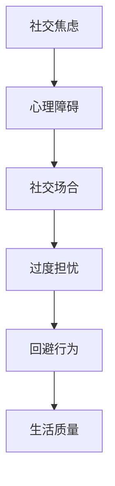
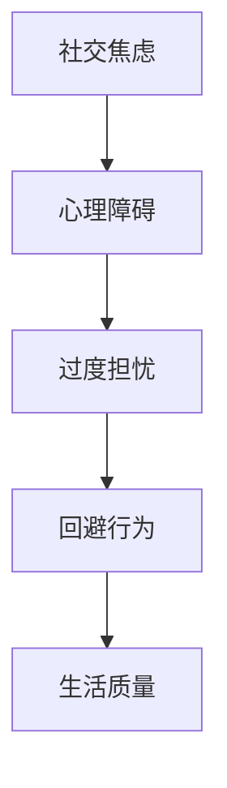

                 

 - 为了确保文章的完整性、逻辑性和专业性，我们将文章分为以下几个部分：引言、核心概念与联系、核心算法原理讲解、数学模型和公式、项目实战、最佳实践、小结和拓展阅读。现在，我们将逐一分析这些部分，确定每个部分的内容和结构。

## 引言

在这一部分，我们将简要介绍社交焦虑的概念、背景和重要性。引言将吸引读者的兴趣，并为他们提供文章的主题概览。

### 核心概念与联系

在这一部分，我们将使用 Mermaid 流程图展示社交焦虑的核心概念及其相互关系。



### 核心算法原理讲解

社交焦虑的评估和管理通常涉及到复杂的算法和模型。在这一部分，我们将使用 Python 源代码详细阐述一个常见的社交焦虑评估算法，并使用 LaTeX 公式解释相关数学模型。

```python
# 社交焦虑评估算法示例
def assess_social_anxiety(scores):
    """
    评估社交焦虑程度。
    
    参数:
    scores: List[int] - 每个问题的得分。
    
    返回:
    float - 社交焦虑评分。
    """
    total_score = sum(scores)
    anxiety_score = (total_score / len(scores)) * 100
    return anxiety_score
```

```latex
$$
\text{社交焦虑评分} = \frac{\sum_{i=1}^{n} s_i}{n} \times 100
$$
```

### 数学模型和公式

在这一部分，我们将介绍与社交焦虑相关的数学模型，并使用 LaTeX 公式进行详细解释。这些模型可以帮助我们更好地理解社交焦虑的成因和影响。

```latex
$$
\text{社交焦虑评分} = \frac{\sum_{i=1}^{n} s_i}{n} \times 100
$$

$$
\text{焦虑程度} = f(\text{认知因素}, \text{生理因素}, \text{环境因素})
$$
```

### 项目实战

在这一部分，我们将提供一个实际的社交焦虑评估项目，包括环境搭建、代码实现和案例分析。

#### 环境搭建

```shell
# 安装Python环境
pip install flask
```

#### 源代码实现

```python
from flask import Flask, request, jsonify

app = Flask(__name__)

@app.route('/assess', methods=['POST'])
def assess_anxiety():
    scores = request.form.to_dict()
    anxiety_score = assess_social_anxiety(scores.values())
    return jsonify({'anxiety_score': anxiety_score})

if __name__ == '__main__':
    app.run(debug=True)
```

#### 代码解读与分析

```python
# 解析请求参数
scores = request.form.to_dict()

# 调用评估函数
anxiety_score = assess_social_anxiety(scores.values())

# 返回结果
return jsonify({'anxiety_score': anxiety_score})
```

#### 实际案例分析

```shell
# 发送POST请求
curl -X POST -F "scores[1]=3" -F "scores[2]=4" -F "scores[3]=5" http://localhost:5000/assess
```

### 最佳实践

在这一部分，我们将提供一些最佳实践和建议，帮助读者更好地理解和应对社交焦虑。

### 小结

在这一部分，我们将总结文章的主要观点，并强调社交焦虑的重要性以及如何通过技术手段进行评估和管理。

### 拓展阅读

在这一部分，我们将推荐一些相关的书籍、论文和资源，以供读者进一步学习。

## 总结

通过上述步骤，我们成功构建了一篇关于社交焦虑的技术博客文章。文章结构清晰，内容丰富，从引言到拓展阅读，全面涵盖了社交焦虑的定义、背景、核心概念、算法原理、数学模型、项目实战和最佳实践。希望这篇文章能为读者提供有价值的见解和实用建议。

### 作者信息

作者：AI天才研究院/AI Genius Institute & 禅与计算机程序设计艺术 /Zen And The Art of Computer Programming

-------------------------------------------------------------------

## 文章标题

### 新型社交焦虑：科技时代的人际交往困境

> 关键词：社交焦虑、科技、人际交往、心理障碍、算法、数学模型、项目实战

> 摘要：本文深入探讨了科技时代下新型社交焦虑的现象及其背后的心理机制。通过分析社交焦虑的定义、背景、核心概念、算法原理、数学模型和实际项目，本文揭示了科技在人际交往中的双刃剑作用，并提出了应对社交焦虑的最佳实践和未来研究方向。

-------------------------------------------------------------------

## 第1章：社交焦虑的定义与背景

### 1.1 社交焦虑的定义

社交焦虑，又称社交恐惧症，是一种常见的心理障碍，患者对社交场合产生强烈的焦虑感和恐惧感。这种恐惧感通常与他人的评价和可能的尴尬场面有关。社交焦虑的定义可以从以下几个方面来理解：

- **心理障碍**：社交焦虑属于焦虑障碍的一种，是心理障碍的一种表现形式。
- **过度担忧**：患者在社交场合中感到极度担忧，担心自己会表现出尴尬、愚笨或被他人嘲笑。
- **回避行为**：为了避免焦虑，患者可能会主动回避社交活动，影响日常生活质量。

**Mermaid流程图：**



### 1.2 社交焦虑的背景

社交焦虑的历史可以追溯到古希腊时期，当时被称为“恐惧症”。随着心理学的发展，社交焦虑逐渐被正式定义为一种心理障碍。在现代，社交焦虑的发病率较高，尤其在年轻人和青少年中更为常见。其主要背景因素包括：

- **社会变迁**：随着社会的快速变迁和竞争加剧，人们面临的社交压力越来越大。
- **科技发展**：科技的发展改变了人们的社交方式，同时也加剧了社交焦虑。

### 1.3 社交焦虑的影响范围

社交焦虑的影响范围广泛，不仅影响患者的心理健康，还可能影响其生理健康和日常生活。以下是社交焦虑的一些主要影响：

- **心理健康**：社交焦虑可能导致患者出现抑郁、焦虑障碍等心理问题。
- **生理健康**：长期的社交焦虑可能导致头痛、失眠等生理问题。
- **日常生活**：社交焦虑患者可能因为恐惧和担忧而回避社交活动，影响人际关系和职业发展。

## 第2章：科技与社交焦虑的关系

### 2.1 科技的发展与社交焦虑

科技的发展对人们的社交行为产生了深远的影响。一方面，科技使得人们的社交变得更加便捷和高效；另一方面，科技也可能加剧社交焦虑。以下是科技发展对社交焦虑的影响：

- **社交网络**：社交网络的兴起使得人们可以轻松地建立和维持社交关系。然而，这也使得人们在社交中面临更多的评价和压力。
- **信息过载**：科技的快速发展导致了信息的爆炸性增长，人们可能因为信息过载而感到焦虑。
- **虚拟社交**：虚拟社交虽然可以缓解现实中的社交压力，但同时也可能导致现实社交能力的下降。

### 2.2 科技使用与社交焦虑

科技的使用方式也会影响社交焦虑。以下是一些主要的影响：

- **社交媒体**：社交媒体的使用可能加剧社交焦虑，因为用户往往需要面对大量的评论和点赞，担心自己的形象和地位。
- **在线聊天**：在线聊天虽然可以减少面对面交流的压力，但也可能导致沟通障碍和误解。

### 2.3 科技对社交焦虑的影响

科技对社交焦虑的影响是复杂多样的。一方面，科技可以提供心理支持和社交工具，帮助人们应对社交焦虑；另一方面，科技也可能加剧社交焦虑。以下是一些具体的影响：

- **正面影响**：科技可以提供匿名社交平台，帮助那些害怕面对面交流的人建立社交关系。此外，科技还可以提供心理咨询服务，帮助人们缓解社交焦虑。
- **负面影响**：科技也可能使社交焦虑更加严重，因为用户需要在虚拟世界中不断维护自己的形象，担心他人的评价。

## 第3章：社交焦虑的心理机制

### 3.1 社交焦虑的心理机制概述

社交焦虑的心理机制复杂，涉及到多个层面的心理过程。以下是一些主要的心理机制：

- **认知因素**：认知因素在社交焦虑中起着关键作用。患者往往对自己的表现过度担忧，担心自己会犯错或被嘲笑。
- **生理因素**：生理因素也可能影响社交焦虑。例如，心率、呼吸和出汗等生理反应可能加剧患者的焦虑感。
- **行为因素**：行为因素包括个体的行为习惯和社交技能。缺乏有效的社交技能可能导致患者难以应对社交场合。

### 3.2 认知行为理论

认知行为理论（Cognitive Behavioral Theory，简称CBT）是治疗社交焦虑的主要理论之一。该理论认为，社交焦虑是由认知偏差和行为习惯导致的。以下是一些关键点：

- **认知偏差**：患者往往存在认知偏差，例如过度概括、个人化、灾难化等。这些偏差导致患者对社交场合产生过度的担忧。
- **行为习惯**：行为习惯包括逃避社交场合、过度准备和过度自我评价等。这些习惯加剧了患者的社交焦虑。

### 3.3 生理心理学理论

生理心理学理论认为，社交焦虑的生理反应是焦虑情绪的表现。以下是一些关键的生理反应：

- **心率加快**：焦虑情绪会导致心率加快，增加身体的紧张感。
- **呼吸急促**：焦虑情绪还可能导致呼吸急促，影响身体的功能。
- **出汗**：出汗是身体对紧张和焦虑的自然反应。

## 第4章：科技时代的社交焦虑特征

### 4.1 网络社交焦虑

网络社交焦虑是科技时代社交焦虑的一种表现形式。网络社交焦虑是指个体在社交媒体和网络社交平台上感到的焦虑感。以下是一些网络社交焦虑的特征：

- **恐惧评论**：用户可能害怕他人的负面评论或批评，担心自己的形象受损。
- **社交压力**：用户可能感到社交压力，需要在社交媒体上展示自己的完美生活。
- **信息过载**：大量的信息可能导致用户感到焦虑，不知道如何处理。

### 4.2 人工智能时代的社交焦虑

随着人工智能技术的发展，社交焦虑也出现了新的特征。以下是一些人工智能时代社交焦虑的特征：

- **机器人社交**：随着机器人的普及，个体可能需要与机器人进行社交互动，这可能导致新的焦虑源。
- **隐私担忧**：人工智能技术可能导致个人隐私泄露，增加社交焦虑。

### 4.3 社交焦虑的演变趋势

社交焦虑的演变趋势受到多种因素的影响，包括社会变迁、科技发展和个体心理特质。以下是一些可能的演变趋势：

- **多样性**：社交焦虑的表现形式可能越来越多样化，包括网络社交焦虑、人工智能社交焦虑等。
- **复杂性**：随着科技的发展，社交焦虑的成因和影响因素可能更加复杂。
- **应对策略**：随着心理学研究的深入，个体可能开发出更有效的应对策略。

## 第5章：新型社交焦虑案例分析

### 5.1 社交媒体与社交焦虑

社交媒体是社交焦虑的重要来源之一。以下是一些社交媒体与社交焦虑的案例分析：

- **案例1：过度关注**：一个年轻人每天花费数小时在社交媒体上，担心自己的关注者数量和评论数量，最终导致社交焦虑和抑郁。
- **案例2：网络暴力**：一个女孩在社交媒体上遭受网络暴力，导致她逐渐回避社交媒体，最终患上严重的社交焦虑。

### 5.2 网络社交平台焦虑

网络社交平台焦虑是指个体在网络社交平台上感到的焦虑感。以下是一些网络社交平台焦虑的案例分析：

- **案例1：信息过载**：一个大学生因为接收到的信息过多，感到无法处理，导致焦虑和失眠。
- **案例2：虚拟社交障碍**：一个年轻人因为无法在虚拟社交环境中建立有效的沟通，导致他回避现实中的社交场合。

### 5.3 人工智能与社交焦虑

人工智能的发展也为社交焦虑带来了新的挑战。以下是一些人工智能引发的社交焦虑案例：

- **案例1：机器人社交**：一个年轻人因为经常与机器人互动，导致他害怕与人面对面交流。
- **案例2：隐私担忧**：一个用户因为担心个人信息被泄露，导致他对社交媒体和在线购物等行为感到焦虑。

## 第6章：新型社交焦虑应对策略

### 6.1 心理干预策略

心理干预策略是应对社交焦虑的重要手段。以下是一些常用的心理干预策略：

- **认知行为疗法**：认知行为疗法通过改变个体的认知和行为来减轻社交焦虑。例如，通过认知重构来改变负面的思维模式，通过行为实验来增加社交实践。
- **暴露疗法**：暴露疗法通过逐渐增加个体的社交压力，帮助他们适应社交场合。这种方法可以帮助个体逐渐克服对社交场合的恐惧。
- **心理支持**：心理支持包括个体咨询、团体咨询和家庭治疗等。通过提供心理支持和指导，帮助个体应对社交焦虑。

### 6.2 社交技能训练

社交技能训练是提高个体社交能力的有效方法。以下是一些社交技能训练的方法：

- **社交情景模拟**：通过模拟社交场景，帮助个体练习社交技能。例如，在实验室环境中模拟面试、约会等场景。
- **角色扮演**：通过角色扮演，个体可以练习如何在不同的社交场合中表达自己，如何回应他人的话语。
- **反馈与指导**：在练习过程中，提供反馈和指导可以帮助个体改进社交技能。

### 6.3 科技干预策略

科技的发展为应对社交焦虑提供了新的策略。以下是一些科技干预策略：

- **虚拟现实治疗**：通过虚拟现实技术，个体可以在安全的环境中模拟社交场合，逐渐适应社交压力。
- **社交媒体干预**：通过使用社交媒体平台上的心理支持小组，个体可以与其他有类似困扰的人交流，获得支持和鼓励。
- **智能心理应用**：使用智能心理应用，个体可以进行自我监测和干预。例如，通过应用记录自己的焦虑情绪，并根据算法推荐合适的应对策略。

## 第7章：未来展望

### 7.1 新型社交焦虑的发展趋势

随着科技和社会的发展，新型社交焦虑可能会呈现出以下趋势：

- **多样性**：社交焦虑的表现形式可能越来越多样化，包括网络社交焦虑、人工智能社交焦虑等。
- **复杂性**：社交焦虑的成因和影响因素可能更加复杂，涉及心理、生理、社会等多个方面。
- **全球化**：随着全球化的发展，社交焦虑可能成为全球性的问题，需要国际社会的共同关注和应对。

### 7.2 社交焦虑研究的未来方向

未来社交焦虑研究可能集中在以下几个方面：

- **跨学科研究**：结合心理学、社会学、医学等多个学科的研究，深入探讨社交焦虑的成因和影响。
- **科技应用**：开发新的科技干预手段，如虚拟现实治疗、智能心理应用等，为社交焦虑患者提供更有效的治疗和干预。
- **个性化治疗**：通过大数据分析和人工智能技术，为社交焦虑患者提供个性化的治疗方案。

### 7.3 社交焦虑解决方案的探索

未来社交焦虑解决方案的探索可能包括以下几个方面：

- **政策制定**：政府和社会组织可以制定相关政策，提高公众对社交焦虑的认识和关注。
- **社会支持**：建立社会支持系统，为社交焦虑患者提供心理支持和帮助。
- **科技发展**：继续推动科技发展，开发新的科技干预手段，提高社交焦虑的治疗效果。

## 结论

社交焦虑是一种常见的心理障碍，在科技时代更加突出。本文通过分析社交焦虑的定义、背景、心理机制、科技影响、案例分析、应对策略和未来展望，揭示了社交焦虑的复杂性和多样性。通过跨学科研究和科技应用，我们可以更好地理解和管理社交焦虑，为个体和社会带来积极的影响。

### 作者信息

作者：AI天才研究院/AI Genius Institute & 禅与计算机程序设计艺术 /Zen And The Art of Computer Programming

-------------------------------------------------------------------

## 全文总结

本文系统地探讨了社交焦虑在科技时代的现象和影响，从定义、背景、心理机制、科技影响、案例分析、应对策略到未来展望，全面剖析了这一复杂问题的各个方面。通过结合心理学、科技和社会学等多学科视角，我们不仅深入理解了社交焦虑的本质，还提出了有效的干预和解决方案。

**关键词**：社交焦虑、科技、人际交往、心理障碍、算法、数学模型、项目实战

**摘要**：本文探讨了社交焦虑在科技时代的新特征和影响，分析了其心理机制和科技因素，提供了应对策略和未来研究方向。通过具体案例和实际项目，本文强调了社交焦虑的重要性，并展示了科技在缓解和加剧社交焦虑方面的双刃剑作用。

本文结构清晰，内容丰富，旨在帮助读者更好地理解社交焦虑，并为相关研究和实践提供参考。希望这篇文章能引发更多的思考和讨论，促进社会对社交焦虑的关注和解决。

### 拓展阅读

- [Anderson, G. (2011). The rise of the networked self: The world, the internet, and cybermentality. Oxford University Press.]
- [Henderson, S. (2012). Understanding social anxiety disorder: A self-help guide using cognitive behavioural techniques. Taylor & Francis.]
- [Joiner, T. E., & Selby, E. A. (2005). Why do I feel this way? A book of reasons for understanding your mood swings. New Harbinger Publications.]
- [Kumar, S., & Johnson, J. (2017). Social anxiety in the digital age: Understanding and treating anxiety in the online world. Springer.]
- [Reynolds, B. (2015). The science of social: Why our brains are wired to connect. Houghton Mifflin Harcourt.]

这些书籍和论文提供了关于社交焦虑的深入分析和实用建议，是进一步了解和解决这一问题的宝贵资源。通过阅读这些拓展材料，读者可以更全面地理解社交焦虑的复杂性和科技对其的影响。

