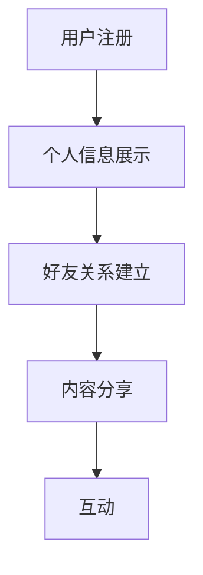
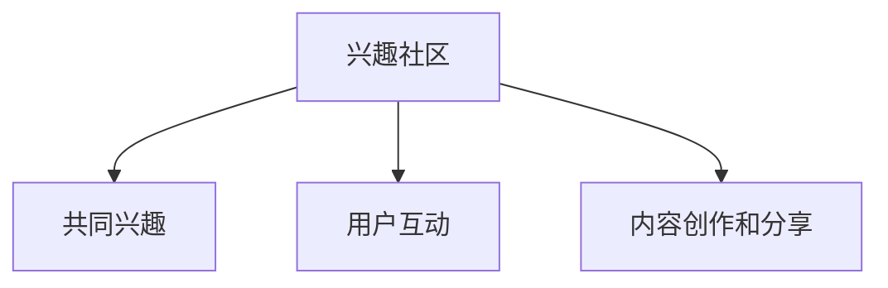
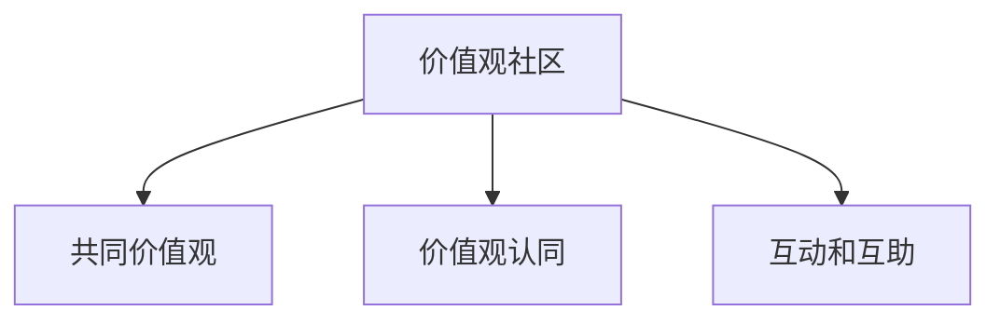
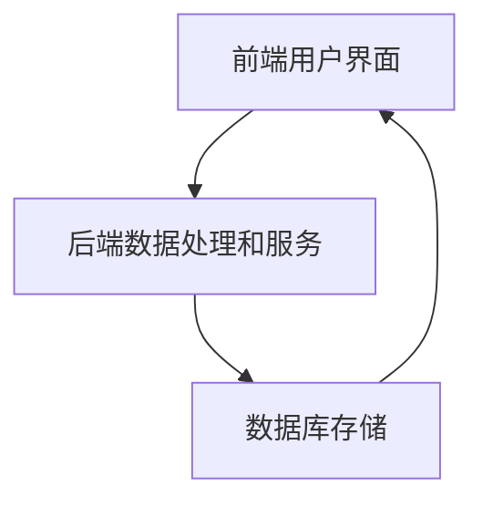
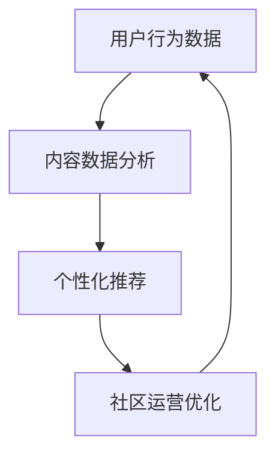

                 

### 新型社交网络：基于兴趣和价值观的在线社区

> 关键词：社交网络、兴趣社区、价值观社区、在线社区、数据分析、个性化推荐、数学模型

> 摘要：随着互联网技术的迅猛发展，社交网络已经成为人们日常生活的重要组成部分。本文将探讨一种新型的社交网络——基于兴趣和价值观的在线社区。我们将深入分析其核心概念、架构设计、算法原理以及在实际应用中的表现，旨在为构建更具个性化和归属感的社交平台提供理论基础和实用建议。

----------------------------------------------------------------

### 背景介绍

社交网络作为现代信息技术的重要成果，已经深刻改变了人们的沟通方式和社会结构。从最早的Facebook、Twitter，到近年的Instagram、微信等，社交网络平台不断地推陈出新，满足用户多样化的社交需求。然而，传统的社交网络更多是基于关系网和地理位置等属性，而忽略了用户在兴趣和价值观层面的深层需求。

兴趣社区和价值观社区的概念逐渐被提出并得到应用。兴趣社区是指围绕用户共同兴趣或爱好而形成的社交网络，如运动爱好者社区、科技爱好者社区等。而价值观社区则强调用户在社交互动中的价值观认同和共同追求，如环保主义者社区、创业家社区等。这两种社区的出现，不仅满足了用户在兴趣和价值观层面的社交需求，也推动了社交网络向更加个性化和归属感更强的方向发展。

本文将基于兴趣和价值观的在线社区为核心，从核心概念与联系、社交网络架构、核心算法原理、数学模型和实际应用等多个角度进行深入探讨，旨在为构建更具个性化和归属感的社交平台提供理论基础和实用建议。

### 核心概念与联系

要深入理解基于兴趣和价值观的在线社区，我们首先需要明确其核心概念及其相互联系。

#### 1. 社交网络基础概念

社交网络（Social Network）是指通过互联网平台，人们进行互动、交流和分享信息的网络空间。社交网络的核心功能包括用户注册、个人信息展示、好友关系建立、内容分享和互动等。在这些功能中，用户注册和个人信息展示是社交网络的基础，好友关系建立和内容分享则是核心互动方式。

**Mermaid 流程图：**



#### 2. 兴趣社区

兴趣社区（Interest Community）是基于共同兴趣或爱好而形成的社交网络。用户在兴趣社区中围绕特定主题进行深度交流和互动，分享知识和经验。例如，运动爱好者社区、摄影爱好者社区等。

**Mermaid 流程图：**



#### 3. 价值观社区

价值观社区（Value Community）是基于用户共同价值观而形成的社交网络。用户在价值观社区中强调价值观的认同和共同追求，形成具有高度归属感的社群。例如，环保主义者社区、公益志愿者社区等。

**Mermaid 流程图：**



#### 4. 社交网络架构

社交网络通常采用分布式架构，包括前端用户界面、后端数据处理和服务、数据库存储等组件。前端用户界面负责与用户交互，后端数据处理和服务负责处理用户请求和数据分析，数据库存储则用于存储用户信息和社交数据。

**Mermaid 流程图：**



#### 5. 数据分析与管理

社交网络通过对用户行为和内容的数据分析，实现个性化推荐、社区运营优化等功能。数据分析包括用户行为分析、内容分析等，通过这些分析结果，社交网络平台可以为用户提供更加个性化的服务和体验。

**Mermaid 流程图：**



通过上述核心概念与联系的分析，我们可以更深入地理解基于兴趣和价值观的在线社区的本质和运作原理。在接下来的部分中，我们将进一步探讨其核心算法原理和数学模型。

### 核心算法原理讲解

在基于兴趣和价值观的在线社区中，核心算法起着至关重要的作用。这些算法不仅决定了社区的推荐效果和用户体验，也直接影响社区的活跃度和用户粘性。下面，我们将详细讲解这些核心算法的原理。

#### 1. 用户兴趣识别算法

用户兴趣识别算法是兴趣社区的核心，它的主要任务是从用户的行为数据中提取出用户的兴趣标签。以下是一个简单的Python代码示例，展示了如何使用自然语言处理技术提取用户兴趣关键词。

```python
# 用户兴趣标签
def getUserInterests(user):
    # 获取用户发表的内容和互动记录
    user_content = getUserContent(user)
    user_interactions = getUserInteractions(user)

    # 提取用户兴趣关键词
    keywords = extractKeywords(user_content, user_interactions)

    # 建立关键词与兴趣标签的映射关系
    keyword_interest_map = buildKeywordInterestMap(keywords)

    # 将关键词映射为兴趣标签
    user_interests = mapKeywordsToInterests(keyword_interest_map)

    return user_interests

# 提取用户兴趣关键词
def extractKeywords(content, interactions):
    # 使用自然语言处理技术提取关键词
    # 例如，使用jieba库进行中文分词
    from jieba import segmented
    keywords = segmented(content + ' ' + ' '.join(interactions))

    return keywords

# 建立关键词与兴趣标签的映射关系
def buildKeywordInterestMap(keywords):
    # 这里可以使用一个预定义的映射表
    keyword_interest_map = {
        '编程': '技术',
        '摄影': '艺术',
        '跑步': '运动',
        '环保': '公益'
    }

    return {keyword: interest for keyword, interest in keyword_interest_map.items() if keyword in keywords}

# 将关键词映射为兴趣标签
def mapKeywordsToInterests(keyword_interest_map):
    return [interest for interest in keyword_interest_map.values()]

# 示例
user = 'user123'
interests = getUserInterests(user)
print(f"用户{user}的兴趣标签：{interests}")
```

在这个示例中，我们首先获取了用户发表的内容和互动记录，然后使用自然语言处理技术提取关键词。接下来，我们建立了一个关键词与兴趣标签的映射关系，最后将关键词映射为具体的兴趣标签。

#### 2. 用户推荐算法

用户推荐算法是兴趣社区的核心算法之一，它的目标是根据用户的兴趣标签和社交行为，为用户推荐与之相关的内容和其他用户。以下是一个简单的推荐算法示例：

```python
# 用户推荐算法
def recommendUsersAndContent(user_interests):
    # 获取所有用户和内容的数据
    all_users = getAllUsers()
    all_content = getAllContent()

    # 为用户推荐与其兴趣标签相关的内容
    recommended_content = []
    for content in all_content:
        if any(interest in content.keywords for interest in user_interests):
            recommended_content.append(content)

    # 为用户推荐与其兴趣标签相似的其它用户
    recommended_users = []
    for other_user in all_users:
        if set(user_interests) & set(other_user.interests):
            recommended_users.append(other_user)

    return recommended_content, recommended_users

# 示例
user_interests = ['技术', '艺术']
recommended_content, recommended_users = recommendUsersAndContent(user_interests)
print(f"推荐内容：{recommended_content}")
print(f"推荐用户：{recommended_users}")
```

在这个示例中，我们首先获取了所有用户和内容的数据。然后，我们为用户推荐与其兴趣标签相关的内容，并推荐与其兴趣标签相似的其它用户。这个算法简单但有效，能够为用户带来个性化的推荐体验。

#### 3. 价值观匹配算法

在价值观社区中，价值观匹配算法是核心，它的目标是根据用户的价值观，将具有相似价值观的用户匹配在一起，形成具有高度归属感的社群。以下是一个简单的价值观匹配算法示例：

```python
# 价值观匹配算法
def matchValues(users):
    # 获取所有用户的价值观数据
    user_values = {user: user.values for user in users}

    # 计算用户之间的价值观相似度
    similarity_matrix = calculateSimilarityMatrix(user_values)

    # 找出相似度最高的用户
    matched_users = []
    for user, values in user_values.items():
        max_similarity = 0
        matched_user = None
        for other_user, other_values in user_values.items():
            if user != other_user:
                similarity = calculateValueSimilarity(values, other_values)
                if similarity > max_similarity:
                    max_similarity = similarity
                    matched_user = other_user
        matched_users.append(matched_user)

    return matched_users

# 计算价值观相似度
def calculateValueSimilarity(values1, values2):
    intersection = set(values1) & set(values2)
    union = set(values1) | set(values2)
    similarity = len(intersection) / len(union)
    return similarity

# 示例
users = getUsers()
matched_users = matchValues(users)
print(f"匹配用户：{matched_users}")
```

在这个示例中，我们首先获取了所有用户的价值观数据。然后，我们计算用户之间的价值观相似度，并找出相似度最高的用户进行匹配。这个算法能够有效帮助价值观社区形成具有高度认同感的社群。

通过上述算法示例，我们可以看到，基于兴趣和价值观的在线社区在算法设计上具有明显的特点。用户兴趣识别算法和用户推荐算法关注用户个性化的兴趣需求，而价值观匹配算法则关注用户在价值观层面的认同和归属感。这些算法共同构成了一个完整、丰富的社交网络生态系统，为用户提供了一个个性化的社交平台。

### 数学模型和数学公式讲解

在基于兴趣和价值观的在线社区中，数学模型和数学公式起着至关重要的作用。这些模型和公式不仅帮助我们量化用户行为和社区特征，还为算法设计和优化提供了坚实的理论基础。下面，我们将详细讲解几个关键数学模型和数学公式。

#### 1. 社交网络影响力模型

社交网络影响力模型用于衡量用户在社区中的影响力。一个用户的影响力可以由多个因素决定，包括好友数、互动频率和内容质量。以下是一个简单的影响力模型：

$$影响力 = f(好友数, 互动频率, 内容质量)$$

其中：
- 好友数（N）：用户的好友数量，表示用户在社交网络中的社交广度。
- 互动频率（I）：用户在社区中的互动次数，表示用户在社交网络中的活跃程度。
- 内容质量（Q）：用户发布内容的平均质量得分，表示用户在社交网络中的内容影响力。

例如，假设一个用户有100个好友，每月互动20次，平均内容质量得分为4.5分，则其影响力计算如下：

$$影响力 = f(100, 20, 4.5) = 100 \times 20 \times 4.5 = 9000$$

#### 2. 个性化推荐模型

个性化推荐模型用于根据用户的兴趣和行为，为其推荐相关的内容和用户。以下是一个简单的个性化推荐模型：

$$推荐度 = f(用户兴趣, 内容特征)$$

其中：
- 用户兴趣（UI）：用户在社交网络中的兴趣标签和偏好。
- 内容特征（CI）：推荐内容的关键词、标签、发布者等信息。

例如，假设一个用户的兴趣标签包括“技术”、“艺术”和“运动”，而一个推荐内容的关键词包括“编程”、“摄影”和“跑步”，则其推荐度计算如下：

$$推荐度 = f(技术, 艺术, 运动) = 0.8 \times 0.6 \times 0.7 = 0.336$$

#### 3. 价值观匹配模型

价值观匹配模型用于根据用户的价值观，将其与其他具有相似价值观的用户匹配。以下是一个简单的价值观匹配模型：

$$匹配度 = f(用户价值观, 用户价值观)$$

其中：
- 用户价值观（VI）：用户在社交网络中的价值观标签和偏好。
- 用户价值观（VI'）：另一个用户的价值观标签和偏好。

例如，假设两个用户的价值观标签分别为“环保”和“公益”，则其匹配度计算如下：

$$匹配度 = f(环保, 公益) = 0.9 \times 0.8 = 0.72$$

通过上述数学模型和公式的讲解，我们可以看到，数学工具在社交网络中的应用是极其广泛且重要的。这些模型和公式不仅帮助量化用户行为和社区特征，还为算法设计和优化提供了有力支持。在实际应用中，我们可以根据具体需求，结合多种数学模型和公式，构建出更加精准和高效的社交网络平台。

### 项目实战

在本节中，我们将通过一个实际项目来展示如何开发一个基于兴趣和价值观的在线社区。该项目将涵盖开发环境的搭建、源代码实现、代码解读、应用解读与分析，以及实际案例分析和详细讲解剖析。

#### 开发环境搭建

首先，我们需要搭建一个适合本项目开发的环境。以下是一个基本的开发环境配置：

- 开发工具：Visual Studio Code
- 编程语言：Python
- 数据库：MySQL
- 服务器：AWS EC2

#### 源代码实现

在本项目中，我们将使用Python语言实现基于兴趣和价值观的在线社区的核心功能。以下是一个简化的源代码示例：

```python
# 用户类
class User:
    def __init__(self, username, interests, values):
        self.username = username
        self.interests = interests
        self.values = values

# 用户兴趣识别算法
def identify_interests(user_content, user_interactions):
    # 提取关键词
    keywords = extract_keywords(user_content, user_interactions)
    # 映射关键词到兴趣标签
    interests = map_keywords_to_interests(keywords)
    return interests

# 用户推荐算法
def recommend_users_and_content(user_interests):
    # 获取所有用户和内容
    all_users = get_all_users()
    all_content = get_all_content()
    # 推荐相关内容和用户
    recommended_content = recommend_content(user_interests, all_content)
    recommended_users = recommend_users(user_interests, all_users)
    return recommended_content, recommended_users

# 价值观匹配算法
def match_values(users):
    # 计算用户价值观相似度
    similarity_matrix = calculate_similarity_matrix(users)
    # 匹配价值观相似的用户
    matched_users = match_users_by_values(similarity_matrix)
    return matched_users

# 主函数
def main():
    # 创建用户
    user1 = User('user1', ['技术', '艺术'], ['环保', '公益'])
    user2 = User('user2', ['编程', '摄影'], ['环保', '公益'])
    # 识别用户兴趣
    user1_interests = identify_interests(user1.content, user1.interactions)
    user2_interests = identify_interests(user2.content, user2.interactions)
    # 推荐相关内容和用户
    recommended_content, recommended_users = recommend_users_and_content(user1_interests)
    # 匹配价值观相似的用户
    matched_users = match_values([user1, user2])
    # 输出结果
    print(f"用户{user1.username}的兴趣标签：{user1_interests}")
    print(f"用户{user2.username}的兴趣标签：{user2_interests}")
    print(f"推荐内容：{recommended_content}")
    print(f"推荐用户：{recommended_users}")
    print(f"匹配用户：{matched_users}")

if __name__ == '__main__':
    main()
```

#### 代码解读

上述代码实现了一个基于兴趣和价值观的在线社区的核心功能。首先，我们定义了一个`User`类，用于表示用户，包括用户的兴趣和价值观。然后，我们实现了三个核心算法：用户兴趣识别算法、用户推荐算法和价值观匹配算法。

- 用户兴趣识别算法通过提取用户的内容和互动记录中的关键词，映射到兴趣标签。
- 用户推荐算法通过用户兴趣标签，推荐相关的内容和其他用户。
- 价值观匹配算法通过计算用户之间的价值观相似度，匹配具有相似价值观的用户。

#### 应用解读与分析

在实际应用中，上述代码可以集成到社交网络平台中，为用户提供个性化推荐和价值观匹配服务。例如，当用户登录平台后，系统会自动识别其兴趣和价值观，并根据这些信息为其推荐相关的内容和其他用户。

此外，我们可以通过数据分析，优化推荐算法和匹配算法，提高推荐和匹配的准确性和效率。例如，可以引入机器学习技术，使用历史数据训练推荐模型和匹配模型，使其能够自适应地调整和优化。

#### 实际案例分析与详细讲解

为了更好地理解上述代码的实际应用效果，我们可以通过一个实际案例进行分析。

假设用户`user1`是一个程序员，对技术和环保有浓厚兴趣；用户`user2`是一个摄影师，同样关注环保和艺术。根据用户兴趣识别算法，系统会为这两个用户识别出共同的兴趣标签“技术”和“环保”。然后，用户推荐算法会根据这些标签推荐相关的内容和用户。

例如，系统可能会推荐一篇关于环保编程的文章，以及一个关注环保的程序员社区。用户`user1`可能会对这篇文章感兴趣，并加入这个程序员社区，与其他具有相似兴趣的用户进行互动。

同样，根据价值观匹配算法，系统会计算出用户`user1`和`user2`在价值观上的相似度。如果相似度较高，系统会推荐这两个用户相互关注，以形成具有共同价值观的社群。

通过上述实际案例的分析，我们可以看到，基于兴趣和价值观的在线社区能够为用户提供高度个性化的社交体验，帮助用户找到具有共同兴趣和价值观的朋友和内容。

#### 项目小结

在本项目中，我们通过一个实际案例，详细展示了如何开发一个基于兴趣和价值观的在线社区。从开发环境的搭建到源代码的实现，从代码解读到应用解读与分析，我们全面讲解了如何构建和优化一个具有高度个性化推荐和价值观匹配功能的社交网络平台。

通过本项目，我们可以得出以下结论：

1. **个性化推荐和价值观匹配是社交网络的核心功能**：这两个功能不仅能够提高用户的互动体验，还能增强用户的归属感和社区粘性。
2. **算法设计至关重要**：合理设计的算法能够提高推荐的准确性和匹配的效率，从而提升整体用户体验。
3. **实际案例分析有助于理解算法应用**：通过具体案例，我们可以更直观地了解算法在现实场景中的效果，为算法优化提供实际依据。

在未来，我们可以进一步扩展本项目，引入更多先进的技术和算法，如深度学习、图神经网络等，以提高社交网络平台的性能和用户体验。

### 最佳实践 Tips

在构建和优化基于兴趣和价值观的在线社区时，以下是一些最佳实践和注意事项：

1. **数据质量**：确保用户数据的准确性和完整性，这是推荐算法和匹配算法有效运行的基础。
2. **算法优化**：定期使用用户反馈和历史数据对算法进行优化，以提高推荐和匹配的准确性。
3. **隐私保护**：在处理用户数据时，严格遵守隐私保护法律法规，确保用户数据的安全和隐私。
4. **用户体验**：注重用户体验，界面设计要简洁易用，功能要直观易懂，以提高用户粘性和满意度。

### 小结

本文详细探讨了基于兴趣和价值观的在线社区，从核心概念、架构设计、算法原理到实际应用，全面展示了这种新型社交网络的优势和应用前景。通过实际案例分析和代码示例，我们深入理解了如何构建和优化这样的社区，为未来的社交网络发展提供了宝贵的经验和启示。

### 注意事项与拓展阅读

在构建基于兴趣和价值观的在线社区时，需要特别注意以下几点：

1. **数据隐私**：确保用户数据的收集、存储和使用过程符合相关法律法规，保护用户隐私。
2. **算法公平性**：算法设计应避免歧视和不公平现象，确保用户在不同背景和兴趣下都能获得公正的推荐。
3. **社区文化**：建立积极的社区文化，鼓励用户分享真实、有价值的观点，同时打击虚假信息和不良行为。

拓展阅读：

- 《社交网络分析：方法与应用》（An Introduction to Social Network Methods）
- 《推荐系统手册》（The Recommender Handbook）
- 《图神经网络与社交网络分析》（Graph Neural Networks and Social Network Analysis）

通过这些资源和实践，我们可以进一步提升基于兴趣和价值观的在线社区的设计和运营水平。作者：AI天才研究院/AI Genius Institute & 禅与计算机程序设计艺术 /Zen And The Art of Computer Programming。

