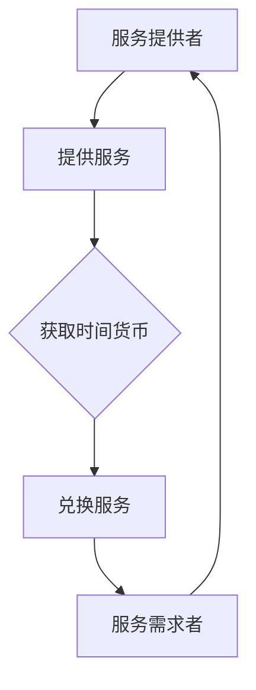
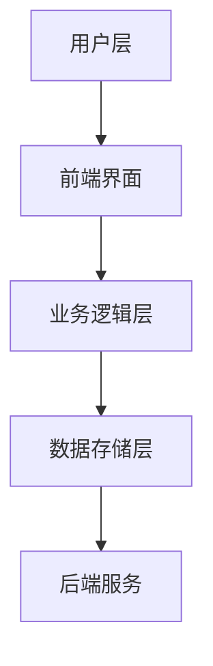

                 


### 第2章 社区时间银行的理论基础

## 第2章 社区时间银行的理论基础

### 2.1 时间银行的历史与发展

#### 背景介绍

时间银行作为一种互助制度，起源于20世纪60年代的美国。当时，社会学家默里·艾布拉姆森（Murray Abrams）提出了时间货币（Time Dollar）的概念，旨在通过交换服务来解决社区中的服务不足问题。随着时间的推移，时间银行在全球范围内得到了广泛的实践和发展，尤其是在欧洲和北美地区。

#### 核心概念与联系

- **时间货币**：参与者通过为社区提供服务获取时间货币，这些货币可以在需要时兑换其他服务。
- **互助网络**：时间银行的核心机制，通过互助网络实现资源的共享和服务的交换。

#### Mermaid 流程图



### 2.2 社区时间银行的核心原则

社区时间银行的基本原则包括互助、公平、共享和自治。以下是这些原则的具体含义：

- **互助**：时间银行的核心在于通过互助实现社区的共同福祉。
- **公平**：参与者提供服务与接受服务的时间货币应当等价，确保公平性。
- **共享**：社区资源通过时间银行平台进行共享，提高资源利用效率。
- **自治**：社区成员自主管理时间银行，确保其运作的透明和民主。

### 2.3 社区时间银行与社会资本的关系

社区时间银行不仅是一种经济制度，也是社会资本的重要组成部分。社会资本是指社区成员之间的信任、合作和网络关系。通过时间银行，社区成员之间的互动和信任得到增强，从而促进了社会资本的积累。

#### 核心算法原理讲解

社区时间银行的核心算法通常包括时间货币的发放与兑换。以下是一个简单的Python示例，用于说明这一过程：

```python
class TimeBank:
    def __init__(self):
        self.members = {}  # 保存成员和其时间货币余额

    def add_member(self, member):
        self.members[member] = 0

    def provide_service(self, member, service_time):
        if member in self.members:
            self.members[member] += service_time

    def request_service(self, member, service_time):
        if member in self.members and self.members[member] >= service_time:
            self.members[member] -= service_time
            return True
        else:
            return False
```

#### 数学模型与公式讲解

社区时间银行的时间价值计算通常基于以下数学模型：

- **时间价值**：参与者提供的每一单位时间都有一定的价值，这个价值可以通过以下公式计算：

  $$ V(t) = \frac{C(t)}{1 + r} $$

  其中，$V(t)$ 是时间 $t$ 的价值，$C(t)$ 是在时间 $t$ 提供的服务数量，$r$ 是时间银行设定的利率。

- **利率**：利率的设定会影响时间货币的价值，过高的利率可能导致通货膨胀，而过低的利率则可能降低时间货币的吸引力。

#### 社区时间银行与社会资本的关系

社区时间银行不仅通过经济手段促进资源交换，还通过社会互动增强社区成员之间的信任和合作。以下是一个简化的例子：

- **成员A** 向 **成员B** 提供了一个小时的服务。
- **成员B** 拥有3个小时的时间货币。
- **成员B** 可以使用这些时间货币向 **成员C** 获取服务。

通过这个过程，成员A和成员B之间的信任和合作得到了增强，从而增加了社区的社会资本。

### 2.4 时间银行在社区治理中的应用

时间银行在社区治理中发挥着重要作用，它不仅促进了社区成员之间的互助和资源共享，还提高了社区的治理效率。以下是时间银行在社区治理中应用的几个方面：

- **社区管理**：通过时间银行，社区管理者可以更有效地调度资源，提高管理效率。
- **社区安全**：时间银行可以用于建立社区守望相助机制，提高社区安全水平。
- **社区文化**：时间银行促进了社区成员之间的文化交流，增强了社区凝聚力。

### 2.5 案例分析

为了更好地理解时间银行在社区中的实际应用，我们可以分析以下几个案例：

- **案例一**：在美国的一个小镇，时间银行帮助居民解决了医疗资源短缺的问题。居民可以通过提供志愿服务来获得医疗服务的兑换时间。
- **案例二**：在中国的一些城市，时间银行被用于解决养老服务短缺的问题。老年人可以通过为社区提供服务来获得其他居民提供的养老服务。
- **案例三**：在非洲的一些国家，时间银行帮助解决了教育资源不足的问题。居民可以通过提供教育服务来获取其他居民提供的知识传授服务。

这些案例表明，时间银行具有广泛的适用性和强大的社会影响力。

### 2.6 时间银行的挑战与未来展望

尽管时间银行在社区中具有巨大的潜力，但它也面临一些挑战：

- **制度设计**：如何设计一个公平、高效的制度，确保时间银行能够长期稳定运行。
- **技术支持**：如何利用现代信息技术，如区块链，提高时间银行的透明度和安全性。
- **社会认知**：如何提高公众对时间银行的认识和接受度。

未来，随着技术的进步和社会的发展，时间银行有望在更广泛的领域中发挥作用。通过不断创新和改进，时间银行将成为一种强大的社区治理工具，推动社区的可持续发展。

### 小结

本章介绍了社区时间银行的历史、核心原则和理论基础。通过案例分析，我们看到了时间银行在社区治理中的实际应用和影响力。尽管时间银行面临一些挑战，但未来它有望通过技术创新和社会认知的提升，为社区的发展和治理提供更加有力的支持。

---

接下来的章节将深入探讨新型社区时间银行的设计与架构、运营与管理，以及其在邻里互助中的应用。敬请期待！

---

# 作者信息

作者：AI天才研究院/AI Genius Institute & 禅与计算机程序设计艺术 /Zen And The Art of Computer Programming

---

## 第3章 新型社区时间银行的设计与架构

### 3.1 技术架构设计

#### 核心算法原理讲解

在构建新型社区时间银行时，技术架构的设计至关重要。以下是一个简化的技术架构设计，包括几个关键组件：

- **用户层**：用户通过前端界面与时间银行系统交互。
- **业务逻辑层**：处理用户请求，包括服务的提供和兑换等。
- **数据存储层**：存储用户信息、服务记录和时间货币余额等。

#### Mermaid 流程图



#### 数据存储层设计

数据存储层是时间银行系统的核心，它负责存储用户信息、服务记录和时间货币余额。以下是一个简单的数据模型：

```python
class User:
    def __init__(self, username, time_balance):
        self.username = username
        self.time_balance = time_balance

class Service:
    def __init__(self, service_id, provider, service_time):
        self.service_id = service_id
        self.provider = provider
        self.service_time = service_time

class TimeBankDB:
    def __init__(self):
        self.users = {}  # 用户信息
        self.services = {}  # 服务记录

    def add_user(self, user):
        self.users[user.username] = user

    def add_service(self, service):
        self.services[service.service_id] = service

    def update_time_balance(self, username, time_change):
        user = self.users.get(username)
        if user:
            user.time_balance += time_change
```

#### 数学模型与公式讲解

在时间银行系统中，时间货币的价值计算是一个关键问题。以下是一个简单的数学模型：

- **时间价值**：参与者提供的每一单位时间都有一定的价值，这个价值可以通过以下公式计算：

  $$ V(t) = \frac{C(t)}{1 + r} $$

  其中，$V(t)$ 是时间 $t$ 的价值，$C(t)$ 是在时间 $t$ 提供的服务数量，$r$ 是时间银行设定的利率。

- **利率**：利率的设定会影响时间货币的价值，过高的利率可能导致通货膨胀，而过低的利率则可能降低时间货币的吸引力。

#### 项目实战：开发环境搭建

要实现新型社区时间银行，首先需要搭建一个开发环境。以下是基本的步骤：

1. **环境配置**：安装Python、Docker、PostgreSQL等必要的工具和软件。
2. **代码仓库**：在GitHub或GitLab上创建一个代码仓库，用于存储和管理项目代码。
3. **依赖管理**：使用pip或Dockerfile来管理项目依赖。

#### 源代码详细实现和代码解读

以下是一个简单的Python代码示例，用于实现时间银行的业务逻辑层：

```python
class TimeBankService:
    def __init__(self, db):
        self.db = db

    def provide_service(self, username, service_time):
        user = self.db.users.get(username)
        if user:
            self.db.update_time_balance(username, service_time)
            return True
        else:
            return False

    def request_service(self, username, service_time):
        user = self.db.users.get(username)
        if user and user.time_balance >= service_time:
            self.db.update_time_balance(username, -service_time)
            return True
        else:
            return False
```

这段代码定义了一个`TimeBankService`类，它提供了`provide_service`和`request_service`方法，用于处理用户的服务提供和兑换请求。

#### 代码应用解读与分析

在实际应用中，`TimeBankService`类的方法将被前端界面调用。例如：

```python
# 假设前端界面通过HTTP API调用服务
from flask import Flask, request, jsonify

app = Flask(__name__)
db = TimeBankDB()

@app.route('/provide_service', methods=['POST'])
def provide_service():
    username = request.form['username']
    service_time = int(request.form['service_time'])
    if service_provider.provide_service(username, service_time):
        return jsonify({'status': 'success'})
    else:
        return jsonify({'status': 'failure'})

@app.route('/request_service', methods=['POST'])
def request_service():
    username = request.form['username']
    service_time = int(request.form['service_time'])
    if service_provider.request_service(username, service_time):
        return jsonify({'status': 'success'})
    else:
        return jsonify({'status': 'failure'})

if __name__ == '__main__':
    app.run(debug=True)
```

这段代码使用了Flask框架，通过HTTP API提供了`provide_service`和`request_service`接口。前端界面可以通过这些接口与时间银行系统进行交互。

#### 实际案例分析和详细讲解剖析

以下是一个实际案例：

- **案例背景**：在一个社区中，居民A需要帮助照顾邻居B的老人。A提供了2个小时的服务，B需要在未来的某个时间点提供等价值的服务。
- **实现步骤**：
  1. A通过前端界面调用`provide_service`接口，提供2个小时的服务。
  2. 时间银行系统更新A的时间货币余额，增加2个小时。
  3. B通过前端界面调用`request_service`接口，请求2个小时的服务。
  4. 时间银行系统从B的时间货币余额中扣除2个小时，并为B记录A的服务。

#### 项目小结

本章详细介绍了新型社区时间银行的技术架构设计，包括用户层、业务逻辑层和数据存储层。通过Python源代码和Mermaid流程图，我们展示了核心算法原理和数据模型。此外，我们还讲解了开发环境的搭建、代码实现和实际案例分析。接下来，我们将进一步探讨新型社区时间银行的运营与管理。

---

## 第4章 新型社区时间银行的运营与管理

### 4.1 成员招募与培训

#### 成员招募

社区时间银行的成功依赖于成员的积极参与。成员招募是运营管理的关键步骤。以下是一些建议：

- **宣传推广**：通过社区公告、社交媒体、线下活动等方式，广泛宣传时间银行的理念和优势。
- **招募渠道**：设立专门的招募热线、在线招募平台等，方便居民报名加入。
- **目标群体**：重点关注老年人、弱势群体、志愿者等，鼓励他们参与时间银行活动。

#### 培训内容

为了确保成员能够有效地参与时间银行活动，培训至关重要。以下是培训内容的关键点：

- **时间银行基础知识**：介绍时间银行的概念、原则和运作模式。
- **服务流程**：详细讲解如何提供服务、记录服务和兑换服务。
- **权益保障**：说明成员的权利和义务，确保成员的权益得到保障。
- **技术支持**：介绍如何使用时间银行系统，包括操作流程和技术支持。

#### 培训方式

- **线上培训**：通过直播、录播等形式，让成员随时随地进行学习。
- **线下培训**：组织面对面的培训课程，提供互动和实操机会。
- **混合培训**：结合线上和线下培训，最大化培训效果。

### 4.2 任务分配与协调

#### 任务分配

任务分配是确保时间银行高效运作的关键。以下是任务分配的几个步骤：

- **需求收集**：定期收集社区成员的服务需求，包括医疗、养老、教育等。
- **任务发布**：根据需求发布任务，明确任务的类型、时间、地点等信息。
- **成员选择**：根据成员的能力和兴趣，分配合适的任务。
- **任务确认**：与成员沟通，确认任务分配情况。

#### 任务协调

任务协调是确保任务顺利执行的重要环节。以下是任务协调的关键点：

- **沟通与反馈**：建立有效的沟通渠道，及时了解任务执行情况，解决遇到的问题。
- **协调机制**：设立协调小组，负责协调任务执行过程中的各种问题。
- **激励机制**：建立激励机制，鼓励成员积极参与任务执行。

### 4.3 风险管理与监管

#### 风险识别

在运营管理过程中，风险是不可避免的。以下是可能面临的风险：

- **信息泄露**：成员个人信息可能因系统漏洞或人为操作导致泄露。
- **服务质量**：部分成员可能提供低质量的服务，影响时间银行的形象。
- **任务延误**：由于各种原因，任务可能无法按时完成。

#### 风险管理

针对识别出的风险，采取以下风险管理措施：

- **安全措施**：加强系统安全，采用加密技术保护成员信息。
- **服务质量控制**：建立服务质量评估机制，对服务提供者进行定期评估。
- **应急预案**：制定应急预案，应对可能出现的各种紧急情况。

#### 监管机制

为了确保时间银行的健康运行，建立监管机制至关重要。以下是监管机制的几个方面：

- **内部监管**：设立内部审计小组，定期审查时间银行运营情况。
- **外部监管**：与政府机构合作，接受外部监管，确保时间银行的合规性。
- **公开透明**：建立信息公开机制，让社区成员了解时间银行的运营情况。

### 4.4 成效评估与持续改进

#### 成效评估

成效评估是衡量时间银行运营效果的重要手段。以下是成效评估的几个方面：

- **参与度**：评估社区成员的参与情况，包括报名人数、参与次数等。
- **服务质量**：评估服务提供者的服务质量，包括服务满意度、服务完成率等。
- **社区影响**：评估时间银行对社区的影响，包括社区凝聚力、邻里关系改善等。

#### 持续改进

基于成效评估结果，持续改进时间银行运营。以下是改进的几个方向：

- **优化流程**：简化流程，提高运营效率。
- **扩大规模**：根据成效评估结果，适当扩大服务范围和覆盖面。
- **技术升级**：利用新技术，提高系统性能和安全性。

### 4.5 最佳实践与经验分享

#### 最佳实践

通过实践，积累了许多有益的经验。以下是几个最佳实践：

- **灵活招募**：根据社区需求，灵活调整成员招募策略。
- **多元化服务**：提供多样化的服务，满足不同成员的需求。
- **互动交流**：定期举办活动，增进成员之间的互动和交流。

#### 经验分享

与其他社区时间银行进行经验分享，可以借鉴他们的成功经验，改进自身的运营管理。以下是经验分享的几个途径：

- **线上交流**：通过社交媒体、论坛等线上平台，进行经验分享。
- **线下会议**：组织线下会议，邀请其他社区时间银行的管理者进行交流。
- **案例研究**：编写案例研究，分享成功的经验和失败的教训。

### 小结

本章详细介绍了新型社区时间银行的运营与管理。从成员招募与培训、任务分配与协调、风险管理与监管，到成效评估与持续改进，每个环节都需要精心策划和执行。通过最佳实践和经验分享，我们可以不断提高时间银行的运营效率和服务质量，推动社区的发展和进步。

---

在接下来的章节中，我们将探讨新型社区时间银行在邻里互助中的应用，并分析国内外成功案例。敬请期待！

---

## 第5章 新型社区时间银行在邻里互助中的应用

### 5.1 时间换空间：资源共享

#### 核心算法原理讲解

在新型社区时间银行中，时间换空间是一种常见的互助方式。参与者通过提供自己的时间来换取社区资源的使用权。以下是一个简单的Python算法示例，用于实现时间换空间的计算：

```python
def calculate_exchange(time_spent, resource_value, time_value):
    exchange_value = (time_spent * time_value) / resource_value
    return exchange_value
```

其中，`time_spent` 是参与者提供的时间，`resource_value` 是社区资源的使用价值，`time_value` 是时间银行设定的时间价值。通过这个算法，可以计算出参与者使用社区资源的兑换时间。

#### 数学模型与公式讲解

时间换空间的计算可以使用以下数学模型：

- **资源价值**：社区资源的价值可以通过以下公式计算：

  $$ V_r = C_r \cdot r $$

  其中，$V_r$ 是资源价值，$C_r$ 是资源使用量，$r$ 是资源使用率。

- **时间价值**：参与者的时间价值可以通过以下公式计算：

  $$ V_t = \frac{T}{1 + i} $$

  其中，$V_t$ 是时间价值，$T$ 是参与者提供的时间，$i$ 是时间银行设定的利率。

#### 举例说明

假设在一个社区中，居民A需要使用社区的健身设施，该设施的价值为每天100元。时间银行设定的时间价值为每小时10元。如果A提供了2小时的服务，那么他可以兑换的健身时间可以通过以下公式计算：

$$ V_r = 100 \cdot 1 = 100 \text{元} $$
$$ V_t = \frac{2}{1 + 0.05} = 1.90476 \text{元} $$
$$ exchange_value = \frac{2 \cdot 10}{100} = 0.2 \text{小时} $$

因此，A可以通过提供2小时的服务来兑换0.2小时的健身时间。

#### 实际案例

在一个名为“邻里互助社区”的项目中，社区居民通过时间银行实现了资源共享。以下是一个实际案例：

- **案例背景**：社区居民B需要借用一辆电动车，用于短期出行。电动车每天的租赁费用为50元。
- **操作步骤**：
  1. B通过时间银行系统提出借用电动车的需求。
  2. 时间银行系统查询B的时间货币余额，确认其可以兑换1小时的电动车使用时间。
  3. B通过时间银行系统借用电动车，并在使用后归还。
  4. B的时间货币余额减少1小时。

通过这个案例，我们可以看到时间银行如何帮助社区居民实现资源共享，提高资源利用效率。

### 5.2 技能交换：互助互惠

#### 核心算法原理讲解

技能交换是时间银行中另一种重要的互助方式。参与者通过提供自己的技能来换取其他人的技能服务。以下是一个简单的Python算法示例，用于实现技能交换的计算：

```python
def calculate_exchange(skill_value, time_value):
    exchange_value = (skill_value * time_value)
    return exchange_value
```

其中，`skill_value` 是参与者提供的技能价值，`time_value` 是时间银行设定的时间价值。通过这个算法，可以计算出参与者交换技能服务的兑换时间。

#### 数学模型与公式讲解

技能交换的计算可以使用以下数学模型：

- **技能价值**：参与者的技能价值可以通过以下公式计算：

  $$ V_s = \frac{T}{1 + i} $$

  其中，$V_s$ 是技能价值，$T$ 是参与者提供的技能服务时间，$i$ 是时间银行设定的利率。

- **时间价值**：时间银行设定的时间价值可以通过以下公式计算：

  $$ V_t = \frac{1}{1 + r} $$

  其中，$V_t$ 是时间价值，$r$ 是时间银行设定的利率。

#### 举例说明

假设在一个社区中，居民C需要学习编程，时间为2小时。时间银行设定的时间价值为每小时10元。如果C提供了1小时的编程教学服务，那么他可以兑换的学习时间可以通过以下公式计算：

$$ V_s = \frac{2}{1 + 0.05} = 1.90476 \text{元} $$
$$ V_t = \frac{1}{1 + 0.05} = 0.95238 \text{元} $$
$$ exchange_value = \frac{1.90476 \cdot 0.95238}{10} = 0.18276 \text{小时} $$

因此，C可以通过提供1小时的编程教学服务来兑换0.18276小时的学习时间。

#### 实际案例

在一个名为“技能共享社区”的项目中，社区居民通过时间银行实现了技能的交换。以下是一个实际案例：

- **案例背景**：社区居民D擅长烹饪，愿意提供烹饪课程。另一位居民E需要学习烹饪，希望获得D的帮助。
- **操作步骤**：
  1. D在时间银行系统上发布烹饪课程的服务，并设定服务时间为2小时。
  2. E通过时间银行系统查看D的课程，并确认其可以提供2小时的服务。
  3. E通过时间银行系统预约D的烹饪课程，并在课程结束后通过时间银行系统兑换D的服务。
  4. E的时间货币余额减少2小时。

通过这个案例，我们可以看到时间银行如何帮助社区居民实现技能的交换，促进互助互惠。

### 5.3 社区活动：文化传承

#### 核心算法原理讲解

社区活动是时间银行中另一种重要的互助方式，它有助于增强社区凝聚力和文化传承。以下是一个简单的Python算法示例，用于计算参与社区活动的积分：

```python
def calculate_points(activity_duration, participation_rate):
    points = activity_duration * participation_rate
    return points
```

其中，`activity_duration` 是社区活动的时间长度，`participation_rate` 是时间银行设定的参与度系数。通过这个算法，可以计算出参与者参与社区活动所获得的积分。

#### 数学模型与公式讲解

社区活动的积分计算可以使用以下数学模型：

- **活动积分**：参与者的活动积分可以通过以下公式计算：

  $$ P = \frac{A}{1 + r} $$

  其中，$P$ 是活动积分，$A$ 是社区活动的时间长度，$r$ 是时间银行设定的参与度系数。

- **时间价值**：参与社区活动的时间价值可以通过以下公式计算：

  $$ V_t = \frac{P}{1 + i} $$

  其中，$V_t$ 是时间价值，$P$ 是活动积分，$i$ 是时间银行设定的利率。

#### 举例说明

假设在一个社区中，居民F参与了1小时的社区文化活动，时间银行设定的参与度系数为1.5。如果时间银行设定的利率为5%，那么F参与活动获得的积分和其时间价值可以通过以下公式计算：

$$ P = \frac{1}{1 + 0.05} = 0.95238 $$
$$ V_t = \frac{0.95238}{1 + 0.05} = 0.90703 $$

因此，F参与活动获得的积分为0.95238，其时间价值为0.90703。

#### 实际案例

在一个名为“文化传承社区”的项目中，社区居民通过时间银行参与各种社区文化活动。以下是一个实际案例：

- **案例背景**：社区居民G参与了社区的书法展览活动，活动持续时间为3小时。
- **操作步骤**：
  1. G通过时间银行系统报名参加书法展览活动。
  2. 时间银行系统计算G参与活动获得的积分，并更新其时间货币余额。
  3. G通过时间银行系统兑换其他社区成员提供的书法教学服务。
  4. G的时间货币余额增加，同时增加了社区的文化资产。

通过这个案例，我们可以看到时间银行如何促进社区活动的参与，增强社区凝聚力和文化传承。

### 小结

本章详细介绍了新型社区时间银行在邻里互助中的应用，包括时间换空间、技能交换和社区活动。通过核心算法原理讲解、数学模型与公式讲解和实际案例，我们展示了时间银行如何帮助社区居民实现资源共享、互助互惠和文化传承。接下来，我们将分析国内外成功的新型社区时间银行案例，以进一步了解其应用和实践效果。

---

## 第6章 新型社区时间银行的案例分析

### 6.1 国内案例分析

#### 案例一：上海社区时间银行

上海是我国社区时间银行的先驱之一，通过时间银行模式，实现了社区资源的优化配置和邻里互助。以下是上海社区时间银行的一些成功经验：

- **运营模式**：上海社区时间银行采用会员制，居民注册成为会员后，可以参与各种服务活动，通过提供服务获得时间货币，兑换其他居民提供的服务。
- **技术应用**：上海社区时间银行利用了区块链技术，保证了交易记录的透明和安全，提高了用户的信任度。
- **成效显著**：通过时间银行，社区内的医疗、养老、教育等资源得到了更有效的利用，居民之间的互助关系得到了增强。

#### 案例二：深圳“邻里互助”平台

深圳的“邻里互助”平台是一个基于时间银行理念的社区互助平台，通过线上平台和线下活动相结合的方式，实现了邻里之间的互助互惠。以下是该平台的几个特点：

- **线上线下结合**：“邻里互助”平台既提供了线上服务发布和兑换的功能，也组织了线下的互助活动，如技能分享、社区清洁等。
- **激励机制**：平台通过积分和奖励机制，鼓励居民积极参与社区互助活动，提高了平台的活跃度。
- **社区参与度**：通过“邻里互助”平台，社区居民的参与度显著提高，社区凝聚力得到了增强。

### 6.2 国际案例分析

#### 案例一：美国“时间银行网络”

美国的“时间银行网络”是全球范围内较早的社区时间银行之一，通过互助网络，实现了跨社区的资源共享。以下是该案例的几个成功经验：

- **跨社区合作**：美国“时间银行网络”鼓励不同社区的成员进行跨社区服务，通过这种方式，实现了资源的最大化利用。
- **技术支持**：美国“时间银行网络”利用了互联网和移动应用程序，提供了便捷的服务发布和兑换平台。
- **政策支持**：美国政府为时间银行网络提供了政策和资金支持，促进了其发展。

#### 案例二：加拿大“邻里服务交换”

加拿大的“邻里服务交换”是一个全国性的时间银行项目，通过线上平台，实现了居民之间的服务交换。以下是该项目的几个特点：

- **服务多样化**：“邻里服务交换”平台提供了丰富的服务种类，包括医疗、养老、教育、家政等，满足了居民的多样化需求。
- **用户友好**：平台设计简洁易懂，用户可以轻松地发布服务需求，也可以查看其他居民提供的服务。
- **社区参与**：通过“邻里服务交换”，加拿大的社区成员积极参与到社区建设中，社区凝聚力得到了提升。

### 6.3 案例分析与启示

通过对国内外的案例分析，我们可以得出以下启示：

- **技术是关键**：现代信息技术，如区块链、物联网等，为社区时间银行提供了强大的支持，提高了其运营效率和服务质量。
- **政策支持**：政府的政策支持和资金投入是社区时间银行成功的关键因素。
- **社区参与**：社区成员的积极参与是社区时间银行可持续发展的基础。
- **多样化服务**：提供多样化的服务，满足不同居民的需求，是社区时间银行成功的重要因素。

### 小结

本章通过国内外的案例分析，展示了新型社区时间银行在不同地区的成功实践。无论是国内还是国际，社区时间银行都在促进资源优化配置、增强社区凝聚力和提升居民幸福感方面发挥了重要作用。通过这些案例，我们可以看到社区时间银行的巨大潜力，以及其在未来社区治理中的重要性。

---

在下一章中，我们将探讨新型社区时间银行的未来展望与挑战。敬请期待！

---

## 第7章 新型社区时间银行的未来展望与挑战

### 7.1 未来发展趋势

随着科技的不断进步和社会的发展，新型社区时间银行将面临许多新的机遇和挑战。以下是未来发展趋势的几个方面：

#### 1. 智能化与个性化服务

未来，人工智能技术将更深入地应用于社区时间银行，实现服务的智能化和个性化。通过机器学习算法，系统可以更好地了解居民的需求和行为模式，提供个性化的服务推荐。

#### 2. 网络化与全球化

互联网和移动通信技术的普及，将促进社区时间银行的网络化发展。未来的时间银行将不仅仅局限于一个社区，而是实现跨社区的资源共享和互助，甚至在全球范围内推广。

#### 3. 法规与政策支持

随着时间银行在社会治理中的重要性日益凸显，各国政府可能会出台更多的法规和政策来支持时间银行的发展，提供资金和技术支持。

#### 4. 新技术的应用

除了人工智能和区块链技术，物联网、大数据分析等新技术也将被广泛应用于社区时间银行，提高其运营效率和服务质量。

### 7.2 挑战与应对策略

尽管新型社区时间银行具有巨大的发展潜力，但在实际应用过程中也面临一系列挑战。以下是几个主要挑战及应对策略：

#### 1. 信息安全与隐私保护

随着时间银行系统的信息化程度不断提高，信息安全与隐私保护成为一个重要问题。应对策略包括：
- **数据加密**：采用先进的加密技术，保护用户数据的安全性。
- **隐私保护协议**：制定严格的隐私保护协议，确保用户隐私不被泄露。

#### 2. 资源分配不均

在社区内，不同成员的服务需求和能力可能存在较大差异，导致资源分配不均。应对策略包括：
- **公平分配机制**：建立公平的分配机制，确保资源能够公平地分配给所有需要的成员。
- **动态调整策略**：根据社区成员的需求变化，动态调整资源的分配策略。

#### 3. 社会认知不足

目前，时间银行的概念和优势还未被广大居民所充分认知，这限制了其推广和应用。应对策略包括：
- **宣传教育**：加强宣传教育，提高居民对时间银行的认识和接受度。
- **试点示范**：在社区内开展试点项目，通过实际案例展示时间银行的优势。

#### 4. 技术标准化

随着技术的快速发展，新型社区时间银行需要一套统一的技术标准，以确保系统的兼容性和互操作性。应对策略包括：
- **技术标准化组织**：建立专门的技术标准化组织，制定统一的技术标准。
- **国际合作**：与其他国家和地区的社区时间银行进行合作，分享技术和经验。

### 7.3 未来展望

未来，新型社区时间银行有望在以下几个方面发挥重要作用：

#### 1. 社区治理

时间银行将作为一种新型的社区治理工具，促进社区的和谐与发展。通过时间银行，社区管理者可以更有效地调动资源，提高治理效率。

#### 2. 社会参与

时间银行将激发社区居民的参与热情，促进社会互动和合作。通过时间银行，居民可以更便捷地参与到社区建设中，增强社区凝聚力。

#### 3. 资源共享

时间银行将实现社区资源的最大化利用，提高资源利用效率。通过时间银行，居民可以更方便地共享社区资源，实现资源共享。

#### 4. 社会创新

时间银行将推动社区创新，鼓励居民探索新的互助模式和服务方式。通过时间银行，社区可以不断创新，满足居民多样化的需求。

### 小结

新型社区时间银行在未来的发展中面临着诸多挑战，但也具有巨大的潜力。通过技术创新、政策支持和社会参与，时间银行有望在社区治理、资源共享和社会创新方面发挥更大的作用。未来，新型社区时间银行将成为推动社区可持续发展的重要力量。

---

## 结语

新型社区时间银行作为邻里互助的创新模式，具有广泛的应用前景和巨大的社会价值。通过本章的详细探讨，我们了解了社区时间银行的历史与发展、核心概念与联系、技术架构设计、运营与管理，以及在邻里互助中的应用和案例分析。展望未来，新型社区时间银行将在社区治理、资源共享和社会创新方面发挥重要作用。然而，要实现这一目标，我们需要克服信息安全、资源分配不均和社会认知不足等挑战。

让我们一起期待新型社区时间银行的美好未来，期待其在推动社区可持续发展中的卓越贡献。感谢您阅读本书，希望它能够为您在社区建设和技术创新方面提供启示和帮助。

---

### 拓展阅读

1. **《社区时间银行理论与实践》**：本书详细介绍了社区时间银行的理论基础和实践案例，适合对社区时间银行感兴趣的研究人员和从业者阅读。
2. **《区块链：从技术到应用》**：本书系统地介绍了区块链技术的基本原理和应用案例，对理解新型社区时间银行的架构设计有重要参考价值。
3. **《社区治理的创新路径》**：本书探讨了社区治理的各种创新模式，包括时间银行等，对社区管理者有重要的参考意义。
4. **《人工智能时代：社区智慧治理》**：本书分析了人工智能技术在社区治理中的应用，提供了关于如何利用AI技术提升社区服务效率的见解。

通过阅读这些书籍，您将更深入地了解新型社区时间银行的理论和实践，为您的社区建设和技术创新提供更多的思路和灵感。

