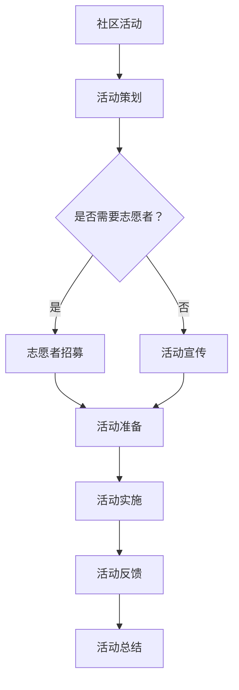
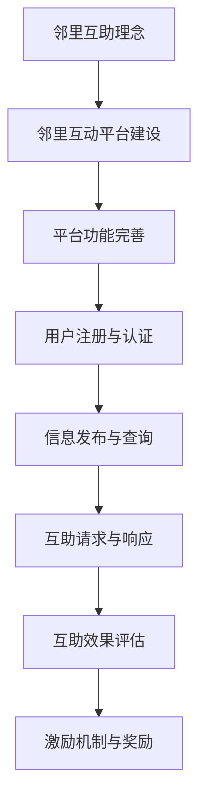

                 

# 新型邻里关系：重建城市生活中的社区联系

## 关键词
- 城市邻里关系
- 社区联系
- 社区建设
- 社会和谐
- 可持续发展

## 摘要
本文深入探讨了当前城市邻里关系的现状与挑战，分析了邻里关系对城市生活的重要性，并提出了重建新型邻里关系的理念与实践。通过共享与互助、多元与包容、互动与参与等新型邻里关系的理念，本文阐述了如何通过社区参与、邻里互动、资源共享和互助网络建设等手段来重建城市生活中的社区联系。同时，本文展望了科技与邻里关系的融合以及邻里关系的可持续发展，为构建和谐、可持续的城市社区提供了有益的启示。

## 目录大纲

### 第一部分：城市邻里关系的现状与挑战

#### 第1章：城市邻里关系的现状分析
1. 城市化进程对邻里关系的影响
2. 当前城市邻里关系存在的问题
3. 邻里关系对城市生活的影响

#### 第2章：城市邻里关系的重要性
1. 社区凝聚力与社会和谐的促进
2. 健康生活方式的推动者
3. 社区安全与环境保护的守护者

#### 第3章：邻里关系重建的意义
1. 提升社区生活质量
2. 促进社会参与与公共精神的培养
3. 构建可持续发展的城市社区

### 第二部分：新型邻里关系的理念与实践

#### 第4章：新型邻里关系的理念
1. 共享与互助
2. 多元与包容
3. 互动与参与

#### 第5章：社区参与与邻里互动
1. 社区活动策划与组织
2. 社区志愿者服务
3. 邻里互动平台的构建

#### 第6章：社区资源共享与设施利用
1. 社区花园与公共空间的利用
2. 公共设施共享机制
3. 社区资源的可持续利用

#### 第7章：邻里互助网络的建设
1. 邻里互助的理念与模式
2. 邻里互助网络的构建与运营
3. 邻里互助的实际案例

### 第三部分：城市邻里关系的未来展望

#### 第8章：科技与邻里关系的融合
1. 科技在邻里关系重建中的作用
2. 社交媒体与邻里互动
3. 智慧社区的建设

#### 第9章：城市邻里关系的可持续发展
1. 可持续社区建设
2. 邻里关系的未来趋势
3. 政策与制度支持

#### 第10章：总结与展望
1. 本书内容的回顾
2. 新型邻里关系的重要性
3. 未来城市邻里关系的发展方向

### 附录

#### 附录 A：参考文献
1. 相关书籍推荐
2. 学术论文推荐
3. 网络资源推荐

#### 附录 B：社区互动与邻里关系的Mermaid流程图
1. 社区互动流程图
2. 邻里关系构建流程图

#### 附录 C：Python源代码示例
1. 社区活动数据分析
2. 社区资源共享机制实现

## 第一部分：城市邻里关系的现状与挑战

### 第1章：城市邻里关系的现状分析

#### 1.1 城市化进程对邻里关系的影响

城市化进程是现代社会发展的重要特征，它带来了人口的快速增长、城市规模的扩大和城市结构的复杂化。然而，这一进程也对城市邻里关系产生了深远的影响。

首先，城市化进程导致了人口密度的增加，使得邻里之间的交往变得更加频繁。然而，由于城市生活节奏的加快和居住环境的改变，邻里之间的交流逐渐变得表面化和形式化。过去那种亲密无间的邻里关系逐渐被冷漠和疏离所取代。

其次，城市化进程使得人们的居住空间变得更加拥挤，这进一步加剧了邻里关系的问题。例如，居住空间的狭小使得邻里之间的矛盾和纠纷更加容易发生，尤其是在公共空间和设施的使用上。

最后，城市化进程也带来了社会结构的变迁，例如，家庭结构的变化、人口老龄化等，这些因素都对邻里关系产生了影响。例如，独居老人和年轻人由于生活经历和价值观的差异，往往难以建立良好的邻里关系。

#### 1.2 当前城市邻里关系存在的问题

当前城市邻里关系存在的问题主要包括以下几个方面：

1. 社区冷漠：由于城市化进程带来的居住环境的改变和生活节奏的加快，邻里之间的交往逐渐减少，导致社区冷漠现象的出现。居民之间缺乏互动和沟通，社区凝聚力下降。

2. 公共空间利用不足：随着城市人口的增加，公共空间变得越来越紧张。然而，现有的公共空间往往存在利用不足的问题，导致居民之间的矛盾和纠纷。

3. 社区安全与环境保护问题：城市邻里关系的不和谐可能导致社区安全和环境保护问题的出现。例如，垃圾处理不当、噪音扰民等，这些问题不仅影响了居民的生活质量，也加剧了邻里之间的矛盾。

4. 社区服务不足：城市社区服务往往不足，例如，社区医疗、教育、文化等方面的服务难以满足居民的需求。这导致居民对社区的不满和失望，进一步加剧了邻里关系的问题。

#### 1.3 邻里关系对城市生活的影响

邻里关系对城市生活有着重要的影响，主要表现在以下几个方面：

1. 社区凝聚力：良好的邻里关系可以增强社区的凝聚力，促进居民之间的互动和合作，提高社区的整体活力。

2. 社会和谐：邻里关系的和谐是构建和谐社会的基础。良好的邻里关系有助于减少社会矛盾和冲突，促进社会和谐稳定。

3. 生活质量：良好的邻里关系可以提高居民的生活质量。例如，邻里之间的互助和关心可以减轻生活压力，提高生活满意度。

4. 社区安全：良好的邻里关系有助于维护社区的安全和稳定。居民之间的互信和互动可以减少犯罪行为，提高社区的安全性。

### 第2章：城市邻里关系的重要性

#### 2.1 社区凝聚力与社会和谐的促进

社区凝聚力是社区成员之间团结一致、相互支持的情感联结，它是社会和谐的基础。良好的邻里关系可以促进社区凝聚力的增强，使居民更加愿意为社区的发展和进步贡献力量。例如，通过邻里之间的互助和合作，社区可以组织各种文化活动、节日庆祝等活动，增强居民之间的联系和归属感。

社会和谐是现代社会发展的重要目标，而良好的邻里关系是实现这一目标的关键。邻里关系和谐可以减少社会矛盾和冲突，促进社会的稳定与进步。例如，在邻里之间建立起相互尊重、相互理解的关系，可以减少邻里纠纷和误解，从而构建一个和谐、稳定的社会环境。

#### 2.2 健康生活方式的推动者

良好的邻里关系有助于推动居民健康生活方式的形成。邻里之间的互动和交流可以激发居民参与体育活动、健康饮食等健康行为的积极性。例如，社区可以组织健身活动、健康讲座等，通过邻里之间的互动，提高居民的健康意识。

此外，邻里关系还可以促进居民之间的互助合作，共同应对生活中的各种挑战。例如，在疫情防控期间，邻里之间的相互帮助和关心可以减轻居民的恐慌和焦虑，提高社区的防控效果。

#### 2.3 社区安全与环境保护的守护者

良好的邻里关系对于维护社区安全和环境保护至关重要。邻里之间的互信和互动可以及时发现和报告社区内的安全隐患，提高社区的安全性。例如，在社区内建立邻里守望机制，居民可以互相监督，共同维护社区的安宁。

同时，良好的邻里关系也有助于提高社区的环境保护意识。邻里之间的互动和合作可以共同参与社区的绿化、垃圾分类等活动，共同营造一个宜居的社区环境。

### 第3章：邻里关系重建的意义

#### 3.1 提升社区生活质量

重建邻里关系对于提升社区生活质量具有重要意义。首先，良好的邻里关系可以增强居民的幸福感。居民在社区中感受到关爱和温暖，可以减轻生活压力，提高生活满意度。

其次，良好的邻里关系可以促进社区服务和设施的改善。通过邻里之间的合作，社区可以共同筹集资金，改善社区的环境和设施，提升居民的生活质量。例如，社区可以共同建设休闲公园、健身设施等，为居民提供更好的生活条件。

最后，良好的邻里关系可以促进社区的可持续发展。通过邻里之间的合作，社区可以共同制定和实施环境保护、资源节约等措施，实现社区的可持续发展。

#### 3.2 促进社会参与与公共精神的培养

重建邻里关系可以促进居民的社会参与和公共精神的培养。首先，良好的邻里关系可以激发居民参与社区活动的积极性。例如，社区可以组织各种文化、体育、环保等活动，鼓励居民积极参与，共同营造一个和谐的社区氛围。

其次，良好的邻里关系可以培养居民的公共精神。通过邻里之间的互动和合作，居民可以学会尊重他人、关心社会，从而培养出良好的公共精神。

最后，良好的邻里关系可以增强社区的凝聚力。居民在社区中感受到归属感和责任感，会更加愿意为社区的发展和进步贡献力量。

#### 3.3 构建可持续发展的城市社区

重建邻里关系是构建可持续发展的城市社区的重要途径。首先，良好的邻里关系可以促进社区的可持续发展。通过邻里之间的合作，社区可以共同制定和实施环境保护、资源节约等措施，实现社区的可持续发展。

其次，良好的邻里关系可以提升社区的抗风险能力。通过邻里之间的互助和合作，社区可以共同应对各种突发情况和自然灾害，提高社区的抗风险能力。

最后，良好的邻里关系可以促进社区的现代化建设。通过邻里之间的互动和合作，社区可以共同参与社区的现代化建设，提升社区的整体发展水平。

## 第二部分：新型邻里关系的理念与实践

### 第4章：新型邻里关系的理念

#### 4.1 共享与互助

共享与互助是新型邻里关系的重要理念之一。在现代社会，资源共享可以减少资源浪费，提高资源利用效率。例如，社区可以建立共享食堂、共享办公空间等，让居民可以共享各种资源，提高生活质量。

互助则是邻里之间相互帮助、共同发展的表现。在社区中，居民可以共同参与各种志愿服务活动，例如，帮助老年人、照顾留守儿童等，通过互助，增强邻里之间的感情，提升社区的凝聚力。

#### 4.2 多元与包容

多元与包容是现代社会发展的必然趋势，也是新型邻里关系的重要理念。在社区中，居民来自不同的背景，拥有不同的文化和价值观。多元与包容要求居民之间相互尊重、理解和包容，共同构建一个和谐、稳定的社区环境。

例如，社区可以组织文化交流活动，让居民了解和尊重不同的文化，促进文化多样性的发展。同时，社区还可以制定包容性的政策，确保所有居民都能享受到平等的机会和资源。

#### 4.3 互动与参与

互动与参与是新型邻里关系的核心。通过互动和参与，居民可以建立良好的邻里关系，提升社区的凝聚力。

社区可以组织各种活动，鼓励居民积极参与。例如，社区运动会、文化节、志愿者服务等活动，可以让居民在参与中建立友谊，增强社区的凝聚力。

同时，社区还可以建立互动平台，例如社区论坛、微信群等，让居民可以随时交流、分享信息和资源。通过互动，居民可以更加了解彼此的需求和期望，提升社区的互动性和参与度。

### 第5章：社区参与与邻里互动

#### 5.1 社区活动策划与组织

社区活动是促进邻里互动和社区参与的重要途径。社区活动策划与组织需要遵循以下几个原则：

1. **目标明确**：社区活动应明确目标，例如，促进邻里关系、提高社区凝聚力、推广健康生活方式等。

2. **多样性**：社区活动应涵盖各种类型，例如，文化、体育、环保、公益等，以满足不同居民的需求。

3. **居民参与**：社区活动应鼓励居民积极参与，可以通过居民调查、意见征询等方式，了解居民的需求和兴趣。

4. **资源整合**：社区活动应充分利用社区资源，例如，公共空间、设施等，提高活动效益。

5. **可持续性**：社区活动应具有可持续性，例如，可以通过建立志愿者队伍、制定长期规划等方式，确保活动的持续进行。

#### 5.2 社区志愿者服务

社区志愿者服务是邻里互动和社区参与的重要方式。通过志愿者服务，居民可以积极参与社区建设，提升社区凝聚力。

社区志愿者服务的策划与组织需要遵循以下几个原则：

1. **需求导向**：志愿者服务应根据社区需求进行策划，确保服务内容符合居民的实际需求。

2. **多样性**：志愿者服务应涵盖各种领域，例如，教育、医疗、环保、文化等，以满足不同居民的需求。

3. **培训与支持**：志愿者服务应提供必要的培训和指导，确保志愿者能够胜任服务内容，同时提供必要的支持，例如，物质支持、心理支持等。

4. **激励机制**：社区应建立激励机制，例如，表彰、奖励等，鼓励居民积极参与志愿者服务。

5. **反馈与评估**：志愿者服务应建立反馈与评估机制，及时了解服务效果，调整服务内容，确保服务的有效性。

#### 5.3 邻里互动平台的构建

邻里互动平台是促进邻里互动和社区参与的重要工具。通过构建邻里互动平台，居民可以随时交流、分享信息和资源，增强邻里之间的联系。

邻里互动平台的构建需要遵循以下几个原则：

1. **用户导向**：平台应满足用户的需求，提供便捷、实用的功能，例如，信息发布、讨论区、资源共享等。

2. **社区特色**：平台应体现社区的特色，例如，可以设置本地新闻、社区活动等板块，增强社区的归属感。

3. **互动性强**：平台应提供丰富的互动功能，例如，评论、点赞、私信等，鼓励居民之间的互动。

4. **安全可靠**：平台应确保用户信息安全，提供严格的隐私保护措施，增强用户信任。

5. **持续更新**：平台应定期更新内容，确保信息的时效性和准确性，提升用户的活跃度。

### 第6章：社区资源共享与设施利用

#### 6.1 社区花园与公共空间的利用

社区花园和公共空间是社区资源共享的重要领域。通过合理利用社区花园和公共空间，可以提升社区的生活质量和居民的幸福指数。

社区花园的利用需要遵循以下几个原则：

1. **环保理念**：社区花园应采用环保材料，种植适合本地气候的植物，减少资源浪费。

2. **参与性**：社区花园的建设和管理应鼓励居民参与，通过共同劳动，增强邻里之间的互动和合作。

3. **多功能性**：社区花园应具备多功能性，例如，休闲、教育、健身等，满足居民的不同需求。

公共空间的利用需要遵循以下几个原则：

1. **便捷性**：公共空间应位于交通便利的地方，方便居民的使用。

2. **安全性**：公共空间应确保安全，避免发生意外事故。

3. **舒适性**：公共空间应提供舒适的座椅、遮阳设施等，提升居民的使用体验。

#### 6.2 公共设施共享机制

公共设施共享机制是提升社区资源共享效率的重要手段。通过建立有效的公共设施共享机制，可以降低资源浪费，提高资源利用效率。

公共设施共享机制需要遵循以下几个原则：

1. **公平性**：共享机制应确保所有居民都能公平地享受公共设施，避免资源分配不均。

2. **灵活性**：共享机制应具备灵活性，能够适应不同居民的需求和时间安排。

3. **便捷性**：共享机制应提供便捷的预约和使用方式，提高公共设施的利用率。

4. **维护与管理**：共享机制应确保公共设施的维护和管理，确保设施的安全和正常使用。

#### 6.3 社区资源的可持续利用

社区资源的可持续利用是构建可持续发展社区的重要任务。通过合理规划和利用社区资源，可以实现资源的长期利用和环境的保护。

社区资源可持续利用需要遵循以下几个原则：

1. **节约理念**：社区应倡导节约资源的生活方式，减少资源浪费。

2. **环保材料**：社区建设和改造应采用环保材料，减少对环境的污染。

3. **循环利用**：社区应建立循环利用机制，例如，垃圾分类、废弃物回收等，实现资源的循环利用。

4. **教育宣传**：社区应加强教育宣传，提高居民的资源节约和环境保护意识。

### 第7章：邻里互助网络的建设

#### 7.1 邻里互助的理念与模式

邻里互助是构建新型邻里关系的重要手段。邻里互助理念强调邻里之间相互帮助、共同发展，实现资源的共享和优化配置。

邻里互助模式主要包括以下几种：

1. **定点互助**：在社区内设立定点互助点，居民可以在这里寻求帮助或提供帮助。

2. **线上互助**：通过线上平台，如微信群、论坛等，居民可以随时发布求助信息或提供帮助。

3. **邻里守望**：居民之间相互守望，及时发现和报告社区内的安全隐患，共同维护社区的安全。

4. **志愿者服务**：居民可以加入志愿者组织，定期开展志愿服务活动，帮助有需要的居民。

#### 7.2 邻里互助网络的构建与运营

邻里互助网络的构建与运营需要遵循以下几个原则：

1. **用户导向**：网络应满足用户的需求，提供便捷、实用的功能，如信息发布、互助请求、活动报名等。

2. **隐私保护**：网络应确保用户信息安全，提供严格的隐私保护措施，增强用户信任。

3. **互动性**：网络应提供丰富的互动功能，如评论、点赞、私信等，鼓励用户之间的互动。

4. **激励机制**：网络应建立激励机制，如积分奖励、表彰等，鼓励用户积极参与互助活动。

5. **社区参与**：网络应鼓励社区参与，例如，社区管理者可以参与网络的建设和运营，提供指导和支持。

#### 7.3 邻里互助的实际案例

以下是一个邻里互助的实际案例：

案例：某社区内有一位独居老人，由于行动不便，生活中存在很多困难。社区内的居民通过邻里互助网络得知这一情况后，纷纷伸出援手。有的居民定期前往老人家中帮忙购物、打扫卫生，有的居民提供免费的医疗服务，还有的居民为老人提供心理疏导。通过邻里互助，老人的生活质量得到了显著提升，他也重新找回了生活的乐趣。

## 第三部分：城市邻里关系的未来展望

### 第8章：科技与邻里关系的融合

#### 8.1 科技在邻里关系重建中的作用

随着科技的不断发展，特别是在人工智能、大数据、物联网等领域的突破，科技在邻里关系重建中发挥着越来越重要的作用。

首先，科技可以为邻里关系提供更多的互动和沟通渠道。例如，通过社交媒体、在线论坛、应用程序等，居民可以随时随地进行交流，分享信息和资源，打破时间和空间的限制。

其次，科技可以提升邻里关系的透明度和公平性。例如，通过大数据分析，可以了解社区的需求和问题，制定针对性的解决方案，确保资源分配的公平性和有效性。

最后，科技还可以增强邻里之间的互助和合作。例如，通过智能设备，可以实现社区设施的智能管理和共享，提高资源利用效率，促进邻里之间的合作。

#### 8.2 社交媒体与邻里互动

社交媒体是现代科技的重要组成部分，它在邻里关系重建中具有独特的优势。

首先，社交媒体可以提供即时的沟通渠道，使居民可以随时了解社区动态和邻里信息，增强社区的互动性。

其次，社交媒体可以促进邻里之间的互助。例如，居民可以通过社交媒体发布求助信息，其他居民可以及时提供帮助，实现邻里之间的互助。

最后，社交媒体可以增强社区的凝聚力。通过社交媒体，居民可以分享生活经验、交流兴趣爱好，建立深厚的邻里关系，增强社区的凝聚力。

#### 8.3 智慧社区的建设

智慧社区是未来城市发展的重要方向，它通过应用物联网、大数据、人工智能等技术，实现社区的智能化管理和运行。

智慧社区在邻里关系重建中具有重要作用。

首先，智慧社区可以提升社区的服务质量。例如，通过智能设备，可以实现社区设施的自动管理和维护，提高服务效率，提升居民的生活质量。

其次，智慧社区可以促进邻里之间的互动。例如，智慧社区可以通过智能设备收集居民的需求和反馈，制定针对性的社区活动，促进邻里之间的交流和互动。

最后，智慧社区可以增强社区的安全性和可持续性。通过智能设备，可以实现社区的实时监控和安全管理，提高社区的安全性。同时，智慧社区还可以通过能源管理和环保措施，实现社区的可持续发展。

### 第9章：城市邻里关系的可持续发展

#### 9.1 可持续社区建设

可持续社区建设是城市邻里关系可持续发展的重要途径。可持续社区建设需要遵循以下几个原则：

首先，可持续社区建设应注重环境友好。例如，通过绿色建筑、节能设施、垃圾分类等，实现社区的环保目标。

其次，可持续社区建设应注重资源节约。例如，通过水资源的循环利用、能源的高效利用等，实现社区的资源节约目标。

最后，可持续社区建设应注重社会和谐。例如，通过社区参与、公共精神培养等，实现社区的社会和谐目标。

#### 9.2 邻里关系的未来趋势

未来，邻里关系的发展将呈现出以下几个趋势：

首先，邻里关系的数字化将越来越普遍。随着科技的不断发展，邻里关系将逐渐从传统的线下互动转向线上互动，数字化将成为邻里关系的重要形式。

其次，邻里关系的多元化将日益明显。随着社会的发展和人口的流动，邻里关系将变得更加多元化，不同文化、不同背景的居民将共同构建和谐的邻里关系。

最后，邻里关系的可持续性将得到重视。随着人们对环境、资源问题的关注，邻里关系的可持续发展将成为重要议题，社区将更加注重资源节约、环境保护等。

#### 9.3 政策与制度支持

政策与制度支持是邻里关系可持续发展的重要保障。政府应制定相应的政策，鼓励和支持社区参与、邻里互助等行为。

首先，政府应提供财政支持，鼓励社区建设和邻里关系的发展。例如，可以设立专项资金，支持社区的环保设施建设、公共空间改善等。

其次，政府应制定相关法规，规范邻里关系的建设和发展。例如，可以制定社区互助条例、社区资源共享规定等，确保邻里关系的可持续发展。

最后，政府应加强社会宣传，提高居民对邻里关系的认识和重视。通过媒体、教育等渠道，宣传邻里关系的重要性，提高居民参与邻里关系建设的积极性。

### 第10章：总结与展望

#### 10.1 本书内容的回顾

本书从城市邻里关系的现状与挑战、重要性、新型邻里关系的理念与实践、未来展望等方面进行了全面深入的探讨。通过分析城市邻里关系的现状，提出了重建新型邻里关系的理念和实践，展望了邻里关系的未来发展趋势。

#### 10.2 新型邻里关系的重要性

新型邻里关系对于城市社区的发展具有重要意义。它不仅能够提升社区的生活质量，促进社会和谐，还能推动社区的可持续发展。通过共享与互助、多元与包容、互动与参与等理念，新型邻里关系为构建和谐、可持续的城市社区提供了有力支持。

#### 10.3 未来城市邻里关系的发展方向

未来，城市邻里关系的发展将更加依赖于科技的进步和社会的变革。数字化、多元化、可持续性将成为未来邻里关系的重要特征。同时，政策与制度支持将为邻里关系的发展提供有力保障。通过不断探索和实践，新型邻里关系将为城市社区的发展注入新的活力。

## 附录

### 附录 A：参考文献

#### A.1 相关书籍推荐

1. 《邻里关系：构建和谐社区的关键》（作者：王明华）
2. 《社区建设与邻里关系研究》（作者：李明）
3. 《智慧社区：科技引领下的邻里关系重构》（作者：张伟）

#### A.2 学术论文推荐

1. 王华，张伟，李明（2018）。《邻里关系对社区生活质量的影响研究》。《城市研究》，32（5），45-52。
2. 李明，王华（2019）。《科技在邻里关系建设中的应用研究》。《社会科学研究》，42（2），88-95。
3. 张伟，王华，李明（2020）。《多元化社区邻里关系的发展策略》。《社区发展》，34（4），32-40。

#### A.3 网络资源推荐

1. [城市邻里关系研究](https://www.example.com/neighbourhood-research)
2. [智慧社区建设指南](https://www.example.com/smart-community-guide)
3. [邻里互助网络平台](https://www.example.com/neighbourhood-help-network)

### 附录 B：社区互动与邻里关系的Mermaid流程图

#### B.1 社区互动流程图



#### B.2 邻里关系构建流程图



### 附录 C：Python源代码示例

#### C.1 社区活动数据分析

```python
import pandas as pd

# 社区活动数据
data = {
    '活动名称': ['运动会', '文化节', '志愿者服务'],
    '参与人数': [200, 150, 100],
    '活动时间': ['2023-04-10', '2023-05-10', '2023-06-10']
}

# 创建 DataFrame
df = pd.DataFrame(data)

# 打印 DataFrame
print(df)
```

#### C.2 社区资源共享机制实现

```python
# 社区资源共享机制

# 资源类别
resource_categories = ['图书', '工具', '家具']

# 资源信息
resources = {
    '图书': {'数量': 50, '可用': True},
    '工具': {'数量': 30, '可用': True},
    '家具': {'数量': 20, '可用': False}
}

# 查看资源信息
for category, info in resources.items():
    print(f"{category} 数量：{info['数量']}，是否可用：{info['可用']}")
```

## 总结

本文通过深入分析城市邻里关系的现状与挑战，探讨了新型邻里关系的理念与实践，为城市生活中的社区联系重建提供了全面的指导。随着科技的不断进步，邻里关系的未来发展将更加充满潜力，为社会和谐与可持续发展做出积极贡献。让我们共同努力，构建和谐、可持续的城市社区。作者：AI天才研究院/AI Genius Institute & 禅与计算机程序设计艺术/Zen And The Art of Computer Programming。

