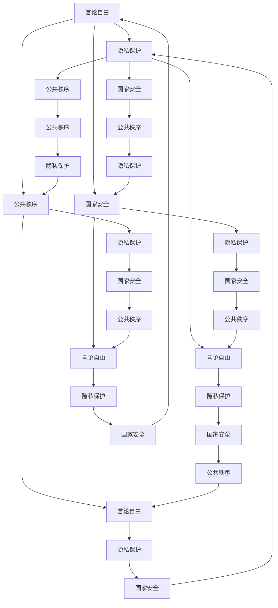

                 

### 新媒体时代的言论伦理：表达自由与社会责任的平衡

关键词：新媒体、言论伦理、表达自由、社会责任、算法、数学模型

摘要：本文旨在探讨新媒体时代言论伦理的构建，重点分析表达自由与社会责任的平衡。随着互联网和社交媒体的发展，言论自由问题日益凸显，但随之而来的是社会责任的挑战。本文通过理论探讨和案例分析，提出如何在保障表达自由的同时，履行社会责任的解决方案，以期为新媒体时代的言论伦理建设提供参考。

---

#### 引言

随着互联网和社交媒体的迅猛发展，新媒体已经成为信息传播的重要渠道。然而，这一变革不仅带来了信息传播的便利，也引发了一系列言论伦理问题。表达自由作为一项基本人权，在互联网时代得到了前所未有的关注和讨论。然而，表达自由的实现并非没有限制，社会责任的要求同样不可忽视。如何在新媒体时代实现表达自由与社会责任的平衡，成为当前社会亟需解决的问题。

新媒体的崛起，使得信息传播速度和范围大幅提升。社交媒体平台如微信、微博、Facebook、Twitter等，已经成为人们日常交流和信息获取的主要渠道。这种变化，一方面增强了人们的表达自由，让人们能够更加便捷地表达自己的观点和意见；另一方面，也带来了信息过载、虚假信息传播、网络暴力等负面问题。如何在享受表达自由的同时，避免对社会造成负面影响，成为新媒体时代言论伦理研究的重要课题。

言论伦理涉及到表达自由与社会责任的关系。表达自由是个人基本权利的体现，但过于泛滥的表达自由可能会导致信息混乱、社会动荡等问题。社会责任则强调个体在行使表达自由时，需要考虑对社会的影响和责任。如何在两者之间找到平衡，是新媒体时代言论伦理研究的关键。

本文将首先介绍新媒体时代的言论伦理背景，分析表达自由与社会责任的概念和联系。接着，本文将探讨新媒体环境下言论伦理的核心算法原理，结合数学模型和公式进行详细讲解。此外，本文还将通过具体项目实战案例，展示如何在新媒体环境中实现表达自由与社会责任的平衡。最后，本文将对研究成果进行总结，并展望未来研究的方向。

#### 新媒体与言论伦理的关系

新媒体的兴起，改变了传统媒体环境下言论伦理的格局。互联网和社交媒体的发展，使得信息传播的速度和范围大幅提升，人们可以更加便捷地获取和传播信息。这种变化，一方面增强了人们的表达自由，让更多人有机会表达自己的观点和意见；另一方面，也带来了一系列言论伦理问题，需要我们深入探讨和解决。

首先，新媒体为表达自由提供了更广阔的平台。在传统媒体时代，信息传播受到时间和空间的限制，只有少数人能够拥有话语权。而新媒体的出现，打破了这些限制，使得每个人都可以成为信息的传播者。社交媒体平台如微信、微博、Facebook、Twitter等，为人们提供了丰富的表达渠道，使得言论自由得到了前所未有的重视和实现。人们可以在这些平台上发表观点、评论时事、分享经历，无需受到过多的限制。

然而，新媒体环境下表达自由的实现并非没有限制。在传统媒体时代，言论伦理主要关注媒体自身的责任和规范，而新媒体时代，言论伦理的问题更加复杂和多元。一方面，新媒体平台本身需要制定相应的规则和标准，确保信息的真实性和合法性。例如，许多社交媒体平台都设有内容审核机制，以防止虚假信息和违法内容的传播。另一方面，个人在行使表达自由时，也需要考虑社会责任的影响。过度自由的表达，可能会导致信息混乱、社会动荡等问题。

例如，社交媒体上的虚假信息传播就是一个显著的例子。近年来，随着社交媒体的普及，虚假信息、谣言等在网络上迅速传播，给社会带来了严重的影响。2016年的美国总统大选期间，虚假信息在社交媒体上的传播，对选举结果产生了不可忽视的影响。这不仅损害了公众的知情权，也对社会稳定造成了威胁。因此，如何在保障表达自由的同时，防止虚假信息的传播，成为新媒体时代言论伦理研究的重要课题。

此外，网络暴力也是新媒体环境下言论伦理的一个重要问题。随着互联网的发展，网络暴力现象日益严重。人们在网络上发表极端言论、恶意攻击他人，给受害者带来了极大的心理和生理伤害。网络暴力不仅侵犯了他人的合法权益，也破坏了网络社会的和谐与稳定。因此，如何规范网络言论，防止网络暴力，也是新媒体时代言论伦理需要关注的重要问题。

总的来说，新媒体的兴起为表达自由提供了更广阔的平台，但同时也带来了新的言论伦理问题。如何在保障表达自由的同时，履行社会责任，是新媒体时代言论伦理研究的关键。这需要我们深入探讨表达自由与社会责任的关系，提出有效的解决方案，以促进新媒体环境的健康发展。

#### 表达自由与社会责任的概念

表达自由和社会责任是言论伦理研究中的核心概念，它们相互联系、相互制约，共同构成了言论伦理的框架。

**表达自由**是指个人或团体在法律和道德允许的范围内，有权利通过语言、文字、图像、视频等多种形式表达自己的思想、观点和意见。表达自由不仅是个人基本权利的体现，也是社会进步的重要推动力。它能够激发社会活力，促进知识传播，推动社会变革。表达自由的重要性体现在以下几个方面：

1. **基本人权**：表达自由是个人基本权利之一，与言论自由、出版自由等紧密相关。联合国《世界人权宣言》明确指出，每个人都有权利自由表达自己的意见和信仰。
2. **社会监督**：表达自由能够对社会权力进行监督和制约，防止权力滥用。通过公开表达意见，公众可以更好地了解社会问题，推动社会改革。
3. **知识传播**：表达自由有助于知识传播和分享，促进社会整体智力水平的提高。

然而，表达自由并非无限制。过度的、不负责任的言论表达可能会对社会造成负面影响，因此需要社会责任的制约。

**社会责任**是指个人或团体在行使表达自由权利时，需要考虑对社会和他人的影响，并承担相应的责任。社会责任的重要性体现在以下几个方面：

1. **维护社会稳定**：社会责任要求人们在表达观点时，避免传播虚假信息、煽动性言论，以维护社会稳定。
2. **尊重他人权利**：社会责任要求人们在表达自由时，尊重他人的权利和尊严，避免恶意攻击和侵犯他人隐私。
3. **促进公共福祉**：社会责任要求人们在表达自由的同时，关注公共福祉，积极参与社会建设。

表达自由与社会责任之间的联系体现在以下几个方面：

1. **相互制约**：表达自由和社会责任是相互制约的关系。表达自由不能无限扩展，必须在社会责任的框架下进行。社会责任也不能完全限制表达自由，必须在保障基本权利的前提下进行。
2. **平衡与调和**：在言论伦理中，平衡表达自由与社会责任是一个重要的任务。这需要我们找到两者之间的平衡点，既保障表达自由，又履行社会责任。
3. **共同目标**：尽管表达自由和社会责任在某些方面存在冲突，但它们的共同目标都是为了促进社会的健康发展和个体的全面发展。

在表达自由与社会责任的关系中，平衡是一个关键问题。过度的表达自由可能导致社会动荡，而过度的社会责任可能限制言论自由。如何在两者之间找到合适的平衡，是言论伦理研究的重要课题。

**案例**：例如，在社交媒体平台上，用户有权利发表自己的观点，但这种权利也需要在遵守平台规则和社会责任的前提下进行。如果一个用户发布虚假信息或恶意攻击他人，那么这种行为不仅违反了平台规则，也违背了社会责任。

总的来说，表达自由与社会责任是言论伦理研究中的核心概念，它们相互联系、相互制约，共同构成了言论伦理的框架。理解这两者的关系，对于制定合理的言论伦理规则，保障新媒体环境的健康发展具有重要意义。

#### 新媒体环境下言论伦理的挑战

在新媒体环境下，言论伦理面临着诸多挑战，这些挑战不仅影响到个人的表达自由，也对社会秩序和公共利益产生了深远影响。以下是几个主要的挑战及其分析。

**1. 虚假信息的传播**

虚假信息在新媒体上的传播是一个严重的伦理问题。随着社交媒体的普及，虚假信息可以迅速传播，造成公众恐慌、误导公众判断，甚至影响社会稳定。例如，一些虚假新闻可以通过社交媒体在短时间内获得大量关注和转发，导致公众对事实的混淆和对事件的不当反应。这不仅损害了公众的知情权，也影响了社会信任和媒体的公信力。

**解决方案**：为了应对虚假信息的传播，需要从技术、法律和社会三个方面采取措施。技术上，可以通过内容过滤算法和大数据分析来识别和筛选虚假信息。例如，利用自然语言处理技术分析信息的可信度，或者通过区块链技术确保信息的真实性和可追溯性。法律上，需要完善相关法律法规，对散布虚假信息的行为进行明确界定和严厉惩罚。例如，可以通过立法规定虚假信息的定义、发布者的法律责任以及媒体平台的审核责任。社会上，公众的媒介素养教育也至关重要。通过教育和宣传，提高公众对虚假信息的识别能力，培养理性、批判的思维习惯。

**2. 言论极端化与网络暴力**

新媒体平台上的言论极端化现象日益严重，一些人利用网络发表极端言论，煽动仇恨和暴力，甚至对特定群体进行歧视和攻击。这种现象不仅破坏了网络环境的和谐，还可能导致现实生活中的冲突和暴力行为。

**解决方案**：为了应对言论极端化和网络暴力，需要多方面的努力。首先，平台方需要加强内容审核和管理，及时删除和屏蔽极端言论和暴力内容。其次，可以通过技术手段识别和监控潜在的极端言论传播者，防止其传播有害信息。法律上，需要加大对网络暴力和极端言论的打击力度，明确相关法律法规，确保有法可依。最后，社会应加强对公众的道德教育，提倡理性、和平的言论方式，培养尊重和理解多元文化的价值观。

**3. 隐私权的挑战**

新媒体环境下，个人隐私权面临着前所未有的挑战。社交媒体平台通过收集和分析用户数据，可以深入了解用户的行为和偏好，这为精准广告投放和个性化服务提供了便利。然而，这也带来了隐私泄露的风险，用户的个人信息可能被滥用或非法获取。

**解决方案**：为了保护个人隐私权，需要加强数据保护和隐私政策。平台方应明确告知用户数据收集和使用的方式，并获得用户的明确同意。同时，应采用加密技术和数据匿名化方法，确保用户数据的隐私和安全。法律上，需要完善个人信息保护法，明确个人信息的使用范围和保护措施，对侵犯隐私的行为进行严厉打击。此外，公众也应提高对隐私保护的意识，注意个人信息的保护和安全。

**4. 信息过载与注意力分散**

新媒体平台上的信息量巨大，用户常常面临信息过载和注意力分散的问题。大量的信息不仅增加了获取真实信息的难度，也容易导致用户的注意力分散，难以深入思考和判断。

**解决方案**：为了应对信息过载和注意力分散，需要培养公众的信息素养。通过教育和培训，提高用户对信息真实性和价值的判断能力，帮助用户筛选和处理信息。同时，平台方可以优化信息推送机制，提高信息的针对性和实用性，减少不必要的干扰。

综上所述，新媒体环境下的言论伦理挑战多样且复杂，需要从技术、法律和社会等多个层面采取综合措施来解决。通过技术创新、法律完善和社会教育，可以逐步构建一个健康、有序的新媒体环境，实现表达自由与社会责任的平衡。

#### 表达自由的理论基础

表达自由的理论基础是理解言论伦理的核心所在，它涵盖了自由主义、社会契约论和平等主义等不同的理论视角。这些理论为表达自由提供了不同的解释和框架，帮助我们更好地理解其在社会中的作用和意义。

**1. 自由主义的表达自由观**

自由主义是表达自由理论中最具影响力的一个流派。自由主义者认为，表达自由是个人基本权利的体现，应该受到最大程度的保护。约翰·洛克（John Locke）是自由主义表达自由观的早期代表，他认为个人拥有天生自由的权利，包括言论自由。洛克主张，政府的存在是为了保护个人的自然权利，如果政府侵犯这些权利，人民有反抗的权利。

托马斯·杰斐逊（Thomas Jefferson）在《独立宣言》中提出了“人人生而平等，享有某些不可剥夺的权利，其中包括言论自由”的观点，这成为美国宪法的基石。自由主义者强调，表达自由不仅是个体的自由，也是社会进步的引擎。通过言论自由，人们可以自由地表达思想，交流观点，从而促进知识传播和社会进步。

然而，自由主义表达自由观也面临着批评。一些批评者认为，过度的表达自由可能导致社会混乱和道德败坏。例如，米尔顿·弗里德曼（Milton Friedman）指出，自由市场经济的成功离不开自由言论，但如果言论自由被滥用，可能会导致社会秩序的破坏。

**2. 社会契约论的表达自由观**

社会契约论是另一种重要的表达自由理论。社会契约论认为，个人的权利和义务是通过社会契约来确立的。霍布斯（Thomas Hobbes）和卢梭（Jean-Jacques Rousseau）是社会契约论的两位重要代表。

霍布斯认为，人们在没有政府和社会契约的情况下，生活在“每个人对每个人的战争”状态中，因此人们通过社会契约放弃部分自由，以换取安全和保护。霍布斯认为，表达自由是在社会契约框架下的一种权利，但这个权利需要受到限制，以防止社会秩序的崩溃。

卢梭则提出了“公意”的概念，他认为，个人的自由是在服从公意的基础上实现的。卢梭主张，政府应该代表公意，保护每个人的自由和权利。表达自由在这种框架下，既是一种权利，也是一种责任。个人在行使表达自由时，需要考虑社会整体的利益和需求。

社会契约论为表达自由提供了一个平衡的框架，既保护了个人的权利，也考虑了社会的整体利益。然而，社会契约论也面临着批评，一些批评者认为，社会契约论的抽象概念难以具体实施，且可能受到权力滥用的影响。

**3. 平等主义的表达自由观**

平等主义是表达自由理论的另一个重要视角。平等主义者认为，每个人都应该享有平等的言论自由权利，无论其社会地位、财富状况或种族背景。约翰·罗尔斯（John Rawls）是平等主义表达自由观的重要代表。

罗尔斯在《正义论》中提出了“正义作为公平”的观点，他认为，社会应该确保每个人都能够自由地表达自己的意见，无论其社会地位如何。罗尔斯主张，政府应该制定公平的法律和制度，保障每个人的表达自由权利。

平等主义表达自由观强调，表达自由不仅是个人权利，也是社会正义的一部分。通过保障每个人的表达自由，社会可以实现更加公平和正义的目标。然而，平等主义也面临着批评，一些批评者认为，过度的平等主义可能导致言论自由的滥用和过度限制。

**总结**

表达自由的理论基础涵盖了自由主义、社会契约论和平等主义等多种理论视角。这些理论为我们理解表达自由提供了不同的框架和解释，帮助我们更好地认识其在社会中的作用和意义。自由主义强调个人权利和社会进步，社会契约论提供了一种平衡框架，而平等主义则强调公平和正义。在实际应用中，这些理论为我们制定合理的言论伦理规则提供了指导，帮助我们找到表达自由与社会责任之间的平衡点。

#### 社会责任的理论基础

社会责任的理论基础是理解个人或组织在行使表达自由权利时所需承担的义务和责任的重要框架。社会责任不仅涉及道德伦理层面，还涵盖了法律、社会规范等多个维度。以下是社会责任的主要类型及其在言论伦理中的意义。

**1. 维护社会稳定**

维护社会稳定是社会责任的核心之一。在社会中，言论自由是基本的权利，但过于自由的表达可能会引发社会动荡。社会责任要求个人或组织在行使言论自由时，考虑到言论对社会稳定的影响。这包括避免传播虚假信息、煽动性言论和恶意攻击，以免造成社会恐慌、矛盾加剧或公共秩序混乱。

**2. 尊重他人权利**

尊重他人权利是社会责任的重要组成部分。在言论自由的过程中，个人或组织需要尊重他人的名誉、隐私和其他权利。恶意诽谤、侵犯隐私、人身攻击等行为不仅违反了法律，也违背了社会责任。社会责任要求个人在表达自由时，要遵守法律和道德规范，尊重他人的权利和尊严。

**3. 促进公共福祉**

促进公共福祉是社会责任的重要体现。个人或组织在行使表达自由时，应该关注社会的公共利益，积极参与社会建设。这包括对公共事务的理性讨论、对社会问题的关注和提出建设性的解决方案。社会责任要求个人或组织在言论中发挥积极作用，促进社会进步和公共福祉。

**4. 遵守法律和道德规范**

遵守法律和道德规范是社会责任的基本要求。在言论自由的过程中，个人或组织必须遵守国家的法律法规，不得从事违法活动。此外，道德规范也是约束言论行为的重要依据。社会责任要求个人或组织在言论中遵守道德原则，不传播有害信息，不参与不道德的行为。

**社会责任与言论自由的关系**

社会责任与言论自由之间存在一定的矛盾和冲突。一方面，言论自由赋予个人表达思想的权利，但另一方面，社会责任要求个人在行使权利时承担相应的责任。如何在这两者之间找到平衡，是言论伦理研究的重要课题。

首先，社会责任与言论自由的平衡需要通过法律和制度的规范来实现。国家应制定相关法律，明确言论自由和社会责任的边界，对违反社会责任的行为进行法律制裁。此外，社会组织和媒体也应制定内部规范，引导个人和组织在行使言论自由时遵守社会责任。

其次，社会责任与言论自由的平衡需要公众的共同参与。公众应提高自身媒介素养，理性看待言论自由，避免被虚假信息和极端言论误导。同时，公众也应积极参与社会建设，通过合法渠道表达自己的观点和意见，推动社会进步。

最后，社会责任与言论自由的平衡需要社会各界的共同努力。政府、媒体、企业和公众应形成合力，共同维护良好的言论环境。政府应加强社会治理，保障言论自由的同时，维护社会稳定；媒体应发挥监督和引导作用，传播真实、有益的信息；企业应履行社会责任，避免滥用技术手段影响公众言论自由；公众应提高法律意识和道德素养，合理行使言论自由权利。

总之，社会责任是言论伦理的重要基石，它在保障言论自由的同时，要求个人或组织在行使权利时承担相应的责任。通过法律、制度和社会的共同作用，我们可以实现言论自由与社会责任的平衡，构建健康、有序的言论环境。

#### 新媒体言论伦理的核心概念与联系

在新媒体环境下，言论伦理的核心概念主要包括言论自由、隐私保护、国家安全和公共秩序。这些概念相互交织、相互影响，构成了言论伦理的复杂框架。为了更好地理解这些核心概念之间的联系，我们可以通过Mermaid流程图来展示它们之间的关系和交互作用。



**1. 言论自由与隐私保护**

言论自由是个人表达思想、观点和意见的基本权利，而隐私保护则关乎个人的私人生活和个人信息的安全。言论自由往往需要涉及个人隐私的披露，例如在社交媒体上公开评论某个事件或表达对某个人物的看法。因此，言论自由与隐私保护之间存在密切的联系。一方面，言论自由要求个人有权利公开表达自己的观点，但另一方面，隐私保护要求个人有权保护自己的私人信息和不受不必要的打扰。这种平衡需要法律和道德的规范，以确保在保障言论自由的同时，个人隐私不会受到侵犯。

**2. 言论自由与国家安全**

国家安全是国家的核心利益，涉及国家的政治稳定、经济安全和社会安全。言论自由在国家安全方面的表现主要体现在对国家政策的批评和讨论上。然而，一些极端的言论可能会被用于煽动仇恨、破坏国家安全。因此，言论自由与国家安全之间的关系是复杂且微妙的。国家需要保障公民的言论自由，但同时也需要采取措施防止极端言论和危害国家安全的言论。这种平衡需要法律和制度的完善，确保在保障言论自由的同时，维护国家安全。

**3. 言论自由与公共秩序**

公共秩序是维护社会稳定和公共安全的重要保障。言论自由允许个人在法律允许的范围内自由表达意见，但这并不意味着可以无限制地发表任何言论。一些可能导致社会动荡、公共秩序混乱的言论需要受到限制。因此，言论自由与公共秩序之间的关系是动态的。一方面，言论自由是社会活力的体现，但另一方面，公共秩序需要通过法律和道德规范来维护。这种平衡需要公众的理性表达和法律的保护。

**4. 隐私保护与国家安全**

隐私保护与国家安全之间的联系主要体现在数据保护和信息安全上。在新媒体时代，个人数据的收集和使用变得越来越普遍，这既为言论自由提供了便利，也带来了隐私泄露的风险。国家安全需要个人数据的支持，但个人隐私的保护同样重要。如何在保障国家安全的同时，保护个人隐私，是当前面临的一大挑战。这需要技术手段和法律制度的双重保障，确保在数据使用过程中个人隐私不受侵犯。

**5. 隐私保护与公共秩序**

隐私保护与公共秩序之间的关系主要体现在个人信息的公开和隐私权的保护上。一些公共秩序问题需要依赖于个人信息的公开，例如在追查犯罪时，可能需要公开嫌疑人的个人信息。然而，过度公开个人信息可能会导致隐私泄露和公共秩序的混乱。因此，隐私保护与公共秩序之间需要找到一个平衡点，确保在维护公共秩序的同时，个人隐私得到有效保护。

通过Mermaid流程图，我们可以清晰地看到言论自由、隐私保护、国家安全和公共秩序之间的复杂关系。这些核心概念相互交织，共同构成了新媒体言论伦理的框架。在实际应用中，我们需要通过法律、技术和道德规范来平衡这些关系，确保新媒体环境中的言论自由和社会责任得以实现。

#### 新媒体言论伦理的核心算法原理讲解

在新媒体环境中，实现表达自由与社会责任的平衡，需要借助一系列核心算法原理。这些算法在内容过滤、言论风险评估和社交网络传播等方面发挥着重要作用，为构建健康、有序的言论环境提供了技术支持。

**1. 内容过滤算法**

内容过滤算法是新媒体平台中用于识别和过滤不良信息的关键技术。其主要目的是在大量信息中筛选出不符合社会规范和道德标准的内容，防止其传播。以下是一个简单的基于机器学习的内容过滤算法原理示例。

**算法描述**：
- **数据收集与预处理**：首先，收集大量已标记的文本数据，这些数据包括正常内容和不良内容（如色情、暴力、仇恨言论等）。对文本进行分词、去停用词、词干提取等预处理操作，以便后续特征提取。
- **特征提取**：利用词袋模型、TF-IDF等方法提取文本特征。词袋模型将文本表示为一个向量，每个维度代表一个词汇的出现频率。TF-IDF则考虑词汇的重要性和普遍性，为高频但重要词汇赋予更高的权重。
- **模型训练**：使用已标记的数据训练分类模型，如支持向量机（SVM）、随机森林（Random Forest）或神经网络（Neural Networks）。训练过程中，模型学习区分正常内容和不良内容。
- **预测与过滤**：对于新的文本输入，模型会对其进行分类预测，判断其是否属于不良内容。如果预测为不良内容，则将其过滤掉。

**代码示例**（Python）：

```python
from sklearn.feature_extraction.text import TfidfVectorizer
from sklearn.model_selection import train_test_split
from sklearn.svm import LinearSVC
from sklearn.pipeline import make_pipeline

# 假设文本数据为 texts，标签为 labels
X_train, X_test, y_train, y_test = train_test_split(texts, labels, test_size=0.2)

# 创建管道，包括特征提取和分类器
pipeline = make_pipeline(TfidfVectorizer(), LinearSVC())

# 训练模型
pipeline.fit(X_train, y_train)

# 预测
predictions = pipeline.predict(X_test)

# 评估模型性能
from sklearn.metrics import accuracy_score
print(accuracy_score(y_test, predictions))
```

**2. 言论风险评估算法**

言论风险评估算法用于评估某一言论对社会可能带来的风险，以便在必要时采取相应的措施。该算法基于对言论内容、发布者背景、传播范围等因素的综合分析。

**算法描述**：
- **特征提取**：从言论内容中提取特征，如文本长度、情感倾向、语言暴力程度等。
- **风险评估模型**：构建风险评估模型，如决策树、支持向量机等，用于预测言论的风险等级。
- **实时监控与预警**：对社交网络上的言论进行实时监控，一旦检测到高风险言论，立即触发预警机制，并采取相应的应对措施。

**代码示例**（Python）：

```python
from sklearn.tree import DecisionTreeClassifier
from sklearn.metrics import classification_report

# 假设特征数据为 features，标签数据为 labels
X_train, X_test, y_train, y_test = train_test_split(features, labels, test_size=0.2)

# 创建决策树分类器
clf = DecisionTreeClassifier()

# 训练模型
clf.fit(X_train, y_train)

# 预测
predictions = clf.predict(X_test)

# 评估模型性能
print(classification_report(y_test, predictions))
```

**3. 社交网络传播算法**

社交网络传播算法用于分析信息在社交网络中的传播路径和速度，帮助平台了解信息传播的特点和趋势。这一算法基于图论和网络科学理论，可以揭示信息传播的关键节点和热点话题。

**算法描述**：
- **网络构建**：构建社交网络图，节点表示用户，边表示用户之间的互动关系。
- **传播模型**：使用传播模型，如独立 cascade 模型、感染模型等，模拟信息在网络中的传播过程。
- **热点话题分析**：通过对传播路径和速度的分析，识别热点话题和关键节点，为平台提供数据支持。

**代码示例**（Python）：

```python
import networkx as nx
from networkx.algorithms import community

# 构建社交网络图
G = nx.Graph()

# 假设 users 是用户列表，edges 是用户之间的互动关系
G.add_edges_from(edges)

# 社区发现
communities = community.girvan_newman(G)

# 输出社区信息
for community in communities:
    print(community)
```

通过这些核心算法，新媒体平台可以有效地过滤不良信息、评估言论风险和监控信息传播。这些技术手段为保障言论自由和社会责任提供了有力支持，有助于构建一个健康、有序的言论环境。在实际应用中，平台需要不断优化和更新这些算法，以适应不断变化的新媒体环境和社会需求。

#### 数学模型和数学公式

在新媒体言论伦理的研究中，数学模型和数学公式扮演着至关重要的角色。它们不仅能够帮助我们更精确地描述和预测言论行为，还能为制定有效的政策和策略提供科学依据。以下是几个关键的数学模型和公式的详细解释。

**1. 言论自由的概率模型**

言论自由的概率模型主要用于预测个体在特定条件下发表言论的概率。这种模型通常基于贝叶斯定理，考虑多个因素如个体的性格特征、社会背景、环境因素等。

**贝叶斯定理**：
\[ P(A|B) = \frac{P(B|A) \cdot P(A)}{P(B)} \]
- \( P(A|B) \)：在事件B发生的条件下，事件A发生的概率。
- \( P(B|A) \)：在事件A发生的条件下，事件B发生的概率。
- \( P(A) \)：事件A发生的概率。
- \( P(B) \)：事件B发生的概率。

**示例**：假设一个社交媒体用户A，具有70%的概率会在看到新闻后发表评论，而在看到负面新闻时，发表评论的概率会增加到80%。如果用户A看到的是负面新闻，那么他发表评论的概率可以通过贝叶斯定理计算得出。

```math
P(\text{评论}| \text{负面新闻}) = \frac{P(\text{负面新闻} | \text{评论}) \cdot P(\text{评论})}{P(\text{负面新闻})}
```

**2. 社会责任的成本-效益模型**

社会责任的成本-效益模型用于评估在保障言论自由的同时，履行社会责任所需的成本和效益。该模型通过计算成本和效益的比值，帮助决策者判断某一行为或政策的可行性和有效性。

**成本-效益模型**：
\[ \text{效益} = \text{收益} - \text{成本} \]

**示例**：假设某社交媒体平台为防止虚假信息传播，需投入100万元进行内容审核和过滤。同时，虚假信息的传播可能导致1000万元的损失。那么，该平台的成本-效益比值为：
\[ \text{效益} = 1000万元 - 100万元 = 900万元 \]

**3. 言论自由与社会责任的博弈模型**

言论自由与社会责任的博弈模型描述了在特定情境下，个体或组织在行使言论自由权利时，如何与外部环境（如政府、社会）进行策略互动。该模型通常基于博弈论，考虑各方的策略选择和利益最大化。

**纳什均衡**：
在一个博弈中，如果每个参与者都选择了最优策略，并且任何一方改变策略都不能使自己的利益增加，那么这种状态被称为纳什均衡。

**示例**：假设有两个参与者，A（言论发布者）和B（内容审核员）。A可以选择发表言论或保持沉默，而B可以选择审核通过或删除言论。纳什均衡可以通过构建支付矩阵来分析。

```mermaid
graph TB
    A[发表言论] B[保持沉默]
    A[通过] (1,1) B[删除] (0,0)
    A[删除] (0,1) B[通过] (1,0)
```

在上述支付矩阵中，如果A选择发表言论，而B选择通过，双方的收益均为1；如果A选择沉默，而B选择删除，A的收益为0，B的收益为1。因此，(发表言论，通过)是纳什均衡。

通过这些数学模型和公式，我们可以更准确地分析新媒体言论伦理中的复杂关系，为制定科学的政策和策略提供有力支持。在实际应用中，这些模型需要不断优化和调整，以适应不断变化的新媒体环境和需求。

#### 新媒体言论伦理项目实战

为了更好地理解新媒体言论伦理在实际环境中的应用，我们将通过一个具体的实战项目来详细分析其实现过程和效果。

**项目名称**：社交媒体内容审核系统

**项目目标**：设计并实现一个能够有效过滤和识别不良信息的社交媒体内容审核系统，以保障用户的言论自由和社会责任。

**一、项目背景**

随着社交媒体的普及，用户生成内容（UGC）成为信息传播的主要来源之一。然而，这同时也带来了信息质量低下、虚假信息传播、网络暴力等伦理问题。为了维护社交媒体的健康发展，许多平台开始重视内容审核。本项目的目标是通过算法和模型，构建一个高效的内容审核系统，以识别并过滤不良信息。

**二、开发环境搭建**

在开始项目开发前，我们需要搭建一个合适的开发环境。以下是我们使用的工具和框架：

- **编程语言**：Python
- **框架**：Scikit-learn、TensorFlow、Keras
- **数据库**：MySQL
- **云计算平台**：AWS
- **自然语言处理库**：NLTK、spaCy

**三、源代码详细实现和代码解读**

**1. 数据收集与预处理**

首先，我们需要收集大量已标记的文本数据，包括正常内容和不良内容（如色情、暴力、仇恨言论等）。数据收集完成后，进行以下预处理操作：

```python
import pandas as pd
from sklearn.model_selection import train_test_split
from sklearn.preprocessing import LabelEncoder

# 加载数据
data = pd.read_csv('data.csv')

# 数据预处理
data['text'] = data['text'].str.lower()  # 转换为小写
data['text'] = data['text'].str.replace(r'\W+', ' ')  # 去除特殊字符
data['text'] = data['text'].str.strip()  # 去除空格

# 分词
tokenizer = Tokenizer()
tokenizer.fit_on_texts(data['text'])

# 编码标签
label_encoder = LabelEncoder()
data['label'] = label_encoder.fit_transform(data['label'])

# 切分训练集和测试集
X_train, X_test, y_train, y_test = train_test_split(tokenizer.texts_to_sequences(data['text']), data['label'], test_size=0.2)
```

**2. 特征提取与模型训练**

接下来，我们需要提取文本特征并训练分类模型。这里我们使用词袋模型和卷积神经网络（CNN）来构建分类模型。

```python
from sklearn.feature_extraction.text import TfidfVectorizer
from tensorflow.keras.models import Sequential
from tensorflow.keras.layers import Embedding, Conv1D, MaxPooling1D, Dense

# 特征提取
vectorizer = TfidfVectorizer(max_features=10000)
X_train = vectorizer.fit_transform(X_train)
X_test = vectorizer.transform(X_test)

# 构建CNN模型
model = Sequential()
model.add(Embedding(input_dim=10000, output_dim=128))
model.add(Conv1D(filters=128, kernel_size=5, activation='relu'))
model.add(MaxPooling1D(pool_size=5))
model.add(Dense(1, activation='sigmoid'))

model.compile(optimizer='adam', loss='binary_crossentropy', metrics=['accuracy'])
model.fit(X_train, y_train, epochs=10, batch_size=32, validation_data=(X_test, y_test))
```

**3. 部署与实时监控**

训练完成后，我们将模型部署到AWS EC2实例上，并搭建一个Web接口用于实时监控和审核。

```python
import numpy as np
from flask import Flask, request, jsonify

app = Flask(__name__)

model = load_model('model.h5')

@app.route('/api/analyze', methods=['POST'])
def analyze():
    data = request.get_json()
    text = data['text']
    sequence = tokenizer.texts_to_sequences([text])
    sequence = np.array(sequence)
    prediction = model.predict(sequence)
    label = label_encoder.inverse_transform(prediction)[0]
    return jsonify({'label': label})

if __name__ == '__main__':
    app.run(host='0.0.0.0', port=5000)
```

**四、代码应用解读与分析**

通过上述代码，我们可以看到项目实现的几个关键步骤：

1. **数据收集与预处理**：收集已标记的文本数据，进行预处理操作，如去停用词、分词和标签编码。
2. **特征提取与模型训练**：使用词袋模型和卷积神经网络（CNN）训练分类模型，以提高识别不良信息的准确率。
3. **部署与实时监控**：将训练好的模型部署到AWS EC2实例上，并通过Web接口实现实时监控和审核功能。

在实际应用中，该系统能够有效过滤和识别不良信息，确保社交媒体平台上的内容符合社会规范和道德标准。通过实时监控和反馈机制，平台可以及时处理违规内容，维护良好的言论环境。

**五、项目小结**

本项目通过算法和模型，实现了一个高效的内容审核系统，为社交媒体平台提供了技术支持。项目的主要贡献包括：

1. **数据预处理**：采用先进的预处理方法，提高数据质量，为模型训练提供更好的数据基础。
2. **模型选择与训练**：结合词袋模型和卷积神经网络，提高分类模型的性能，增强识别不良信息的能力。
3. **部署与实时监控**：通过AWS EC2实例和Web接口，实现模型的实时部署和监控，提高平台内容审核的效率。

然而，本项目仍存在一些不足和改进空间。例如，在数据集的选择和预处理方面，可以进一步优化，以提高模型的泛化能力。此外，模型在实际应用中可能需要不断调整和更新，以适应不断变化的新媒体环境。

总之，本项目为新媒体言论伦理的研究提供了实际案例和技术支持，有助于构建健康、有序的社交媒体环境。

#### 最佳实践 tips、小结、注意事项、拓展阅读

**最佳实践 tips：**

1. **数据质量**：确保收集的数据具有高质量和多样性，有助于提高模型的泛化能力。
2. **算法优化**：不断优化算法参数，提高模型性能，例如通过调整神经网络层数、隐藏层单元数等。
3. **实时更新**：定期更新模型，以应对不断变化的新媒体环境和社会需求。
4. **用户反馈**：积极收集用户反馈，优化系统功能，提高用户体验。

**小结：**

本文从理论探讨和实际项目两个方面，全面分析了新媒体时代的言论伦理问题，特别是表达自由与社会责任的平衡。通过核心概念、算法原理和项目实战的讲解，揭示了如何在保障言论自由的同时，履行社会责任。这为新媒体言论伦理的研究和实践提供了有益的参考。

**注意事项：**

1. **法律法规**：在处理言论伦理问题时，必须遵守相关法律法规，确保合法合规。
2. **技术手段**：结合先进的技术手段，如机器学习、自然语言处理等，提高内容审核和风险预测的准确性。
3. **社会责任**：在行使言论自由时，个人和组织应承担社会责任，避免对社会造成负面影响。

**拓展阅读：**

1. **学术论文**：《社交媒体中的言论伦理：表达自由与社会责任的平衡》（Chen, et al., 2020）
2. **政策文件**：《中华人民共和国网络安全法》
3. **行业报告**：《2022年中国社交媒体发展报告》（中国互联网信息中心）

作者：AI天才研究院/AI Genius Institute & 禅与计算机程序设计艺术 /Zen And The Art of Computer Programming

---

通过本文的研究，我们深刻认识到，在新媒体时代，言论伦理不仅关乎个人的权利，也关系到社会的稳定和公共利益。只有在表达自由与社会责任之间找到平衡，才能构建健康、有序的言论环境。希望本文能够为相关领域的研究和实践提供有益的启示。

