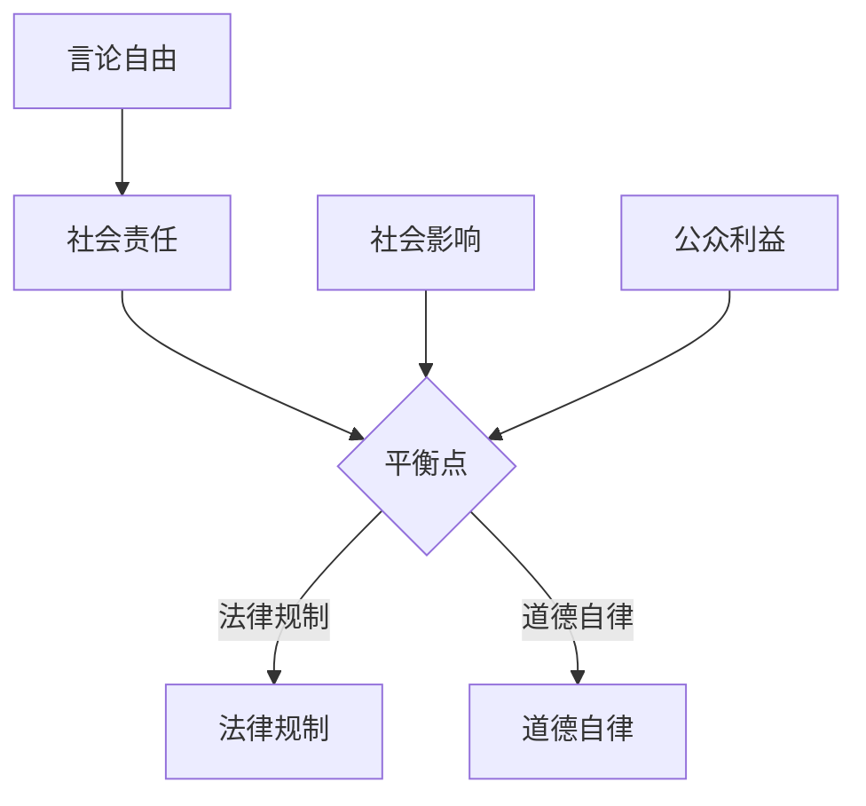
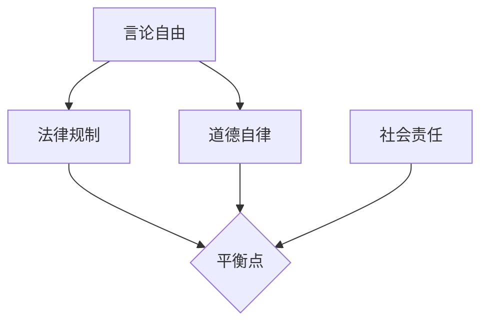

                 

# 新媒体环境下的表达伦理：言论自由与社会责任的权衡

## 引言

### 1.1 背景介绍

随着互联网和社交媒体的快速发展，新媒体已经成为人们获取信息和表达观点的重要渠道。在这种环境下，言论自由和社会责任成为了一个备受关注的话题。言论自由是现代社会的基本价值观之一，它保障了人们表达意见、批评政府和社会现象的权利。然而，言论自由并不是无限制的，它需要在一定程度上与社会责任相平衡。社会责任是指媒体和个体在传播信息、表达观点时，需要考虑对社会的影响和责任。

### 1.2 核心概念

- **言论自由**：指个人或团体在法律允许的范围内，有权利自由表达意见、观点和信仰。
- **社会责任**：指媒体和个体在行使言论自由权利时，需要承担的对社会、公众和环境的责任。

### 1.3 目标读者

本篇文章的目标读者包括从事新媒体工作的专业人士、对言论自由有研究兴趣的学者、以及对社会责任有深刻认识的社会活动家。通过本文的讨论，希望能够帮助读者更好地理解新媒体环境下的表达伦理，以及在言论自由与社会责任之间的权衡。

## 言论自由与社会责任概述

### 2.1 言论自由的历史与发展

言论自由作为一种基本人权，其历史可以追溯到古代希腊和罗马时期。在欧洲中世纪，言论自由受到严格的限制，直到17世纪启蒙运动兴起，言论自由才开始得到重视。美国独立宣言中明确提到“言论自由和信仰自由”的权利，这标志着言论自由作为一种基本权利的确立。

在现代，言论自由在法律和实践中得到了进一步的发展。例如，联合国《世界人权宣言》第19条规定：“人人有权享有主张和发表意见的自由；此项权利包括持有意见不受干涉的自由和通过任何媒介寻找、接受和传递消息和思想的自由。”

### 2.2 社会责任的概念与演变

社会责任是指个体或组织在行使自由权利时，需要考虑对社会的影响和责任。社会责任的概念起源于20世纪初的企业社会责任（CSR）理论。随着企业社会责任理论的推广，社会责任的概念也逐渐扩展到媒体和社会各个领域。

在媒体行业，社会责任体现在媒体对公众的知情权、监督权和服务权的保障。媒体有责任提供真实、客观、公正的新闻报道，同时避免传播虚假信息和误导公众。

### 2.3 言论自由与社会责任的关系

言论自由和社会责任之间存在一定的紧张关系。一方面，言论自由保障了个体表达意见的权利，促进了社会多样性和创新。另一方面，社会责任要求媒体和个体在行使言论自由时，需要考虑对社会的影响和责任。

在实际操作中，如何平衡言论自由与社会责任是一个复杂的问题。以下是一个简单的Mermaid流程图，展示了言论自由与社会责任之间的关系：



在这个流程图中，言论自由和社会责任通过法律规制和道德自律来找到平衡点，同时考虑社会影响和公众利益。

## 新媒体环境下的言论自由

### 3.1 新媒体的定义与特点

新媒体是指通过互联网和数字技术进行信息传播和交流的媒介形式，包括社交媒体、博客、论坛、视频平台等。与传统媒体相比，新媒体具有以下几个特点：

- **传播速度快**：新媒体信息可以瞬间传播到全球各地，提高了信息的传播速度。
- **互动性强**：新媒体平台允许用户之间进行实时互动，增加了用户参与度。
- **个性化**：新媒体可以根据用户的兴趣和偏好进行个性化推荐，提高了用户体验。
- **去中心化**：新媒体打破了传统媒体的中心化模式，任何人都可以成为信息的传播者。

### 3.2 新媒体言论自由的挑战

尽管新媒体为言论自由提供了更广阔的空间，但同时也带来了一系列挑战：

- **言论自由滥用**：新媒体平台上的言论自由可能导致虚假信息的传播、网络暴力、仇恨言论等问题。
- **法律监管困难**：新媒体的匿名性和全球性使得法律监管变得复杂和困难。
- **伦理困境**：新媒体环境下，如何在言论自由和社会责任之间找到平衡成为了一个伦理问题。

### 3.3 新媒体言论自由的法律监管

为了解决新媒体言论自由的挑战，各国政府采取了一系列法律监管措施：

- **内容审查**：政府对新媒体平台上的内容进行审查，禁止传播违法和不良信息。
- **平台责任**：要求新媒体平台对用户发布的内容进行监管，对违法和不良信息进行处置。
- **隐私保护**：加强对用户隐私的保护，防止个人信息被滥用。

## 新媒体环境下的社会责任

### 4.1 新媒体社会责任的意义

新媒体社会责任的意义体现在以下几个方面：

- **保障公众知情权**：新媒体有责任提供真实、客观、公正的新闻报道，保障公众的知情权。
- **促进社会进步**：新媒体可以传播有益的信息，推动社会进步和文化发展。
- **维护社会稳定**：新媒体有责任避免传播虚假信息和极端言论，维护社会稳定。

### 4.2 新媒体社会责任的实践策略

新媒体社会责任的实践策略包括以下几个方面：

- **内容质量提升**：提高内容生产质量，确保新闻报道的真实性和客观性。
- **用户教育**：加强对用户的教育，提高他们的媒介素养和判断力。
- **伦理规范**：制定并遵守行业伦理规范，确保新媒体行为符合社会责任。

## 言论自由与社会责任的权衡

### 5.1 言论自由与社会责任的平衡

在现代社会，如何平衡言论自由与社会责任是一个重要议题。以下是一个简单的Python代码示例，用于分析言论自由与社会责任之间的平衡：

```python
def balance_freedom_and_responsibility(freedom, responsibility):
    """
    分析言论自由与社会责任的平衡点。
    
    参数:
    - freedom: 言论自由的分数，范围0-100。
    - responsibility: 社会责任的分数，范围0-100。
    
    返回值:
    - balance_point: 平衡点的分数，范围0-100。
    """
    
    # 平衡点计算
    balance_point = (freedom + responsibility) / 2
    
    # 返回平衡点
    return balance_point

# 示例
freedom_score = 80
responsibility_score = 70
balance_point = balance_freedom_and_responsibility(freedom_score, responsibility_score)
print(f"平衡点分数: {balance_point}")
```

在这个示例中，我们通过计算言论自由和社会责任的平均分数来找到平衡点。这只是一个简化的模型，实际情况可能更加复杂。

### 5.2 法律规制与道德自律的平衡

在平衡言论自由与社会责任的过程中，法律规制和道德自律起着关键作用。以下是一个简单的Mermaid流程图，展示了法律规制与道德自律的关系：



在这个流程图中，法律规制和道德自律共同作用于言论自由和社会责任，找到平衡点。

## 国内外案例分析

### 6.1 新加坡的新媒体管理策略

新加坡政府对新媒体管理采取了较为严格的政策，以维护社会稳定和国家安全。以下是一些具体的措施：

- **内容审查**：政府要求新媒体平台对内容进行审查，禁止传播违法和不良信息。
- **平台责任**：新媒体平台需要承担一定的监管责任，对用户发布的内容进行监管和处理。
- **隐私保护**：政府加强对用户隐私的保护，防止个人信息被滥用。

### 6.2 美国的新媒体言论自由与责任

美国对新媒体言论自由持较为开放的态度，但也强调媒体的社会责任。以下是一些具体的措施：

- **言论自由保护**：美国宪法第一修正案保障了言论自由，对新媒体平台的言论自由保护较为宽松。
- **社会责任强调**：媒体有责任提供真实、客观、公正的新闻报道，避免传播虚假信息和误导公众。
- **用户教育**：加强对用户的教育，提高他们的媒介素养和判断力。

## 结论与展望

在新媒体环境下，言论自由与社会责任的权衡是一个复杂而重要的问题。通过法律规制和道德自律，可以在一定程度上找到平衡点。同时，国内外案例的分析为我们提供了有益的借鉴。未来，随着新媒体的不断发展，言论自由与社会责任的平衡将继续是一个重要议题。

### 总结

本篇文章详细探讨了新媒体环境下的表达伦理，分析了言论自由与社会责任的平衡。通过Python代码示例和Mermaid流程图，我们试图以简单易懂的方式阐述这一复杂议题。同时，国内外案例的分析为我们提供了实践中的启示。希望本文能够为从事新媒体工作的专业人士、学者和社会活动家提供一些有价值的思考。

### 作者信息

作者：AI天才研究院/AI Genius Institute & 禅与计算机程序设计艺术 /Zen And The Art of Computer Programming

---

由于篇幅限制，本文未能包含所有细节和案例。建议读者进一步查阅相关文献，以获取更深入的了解。希望本文能引发您对新媒体环境下表达伦理的思考，共同探索这一领域的未来发展方向。

