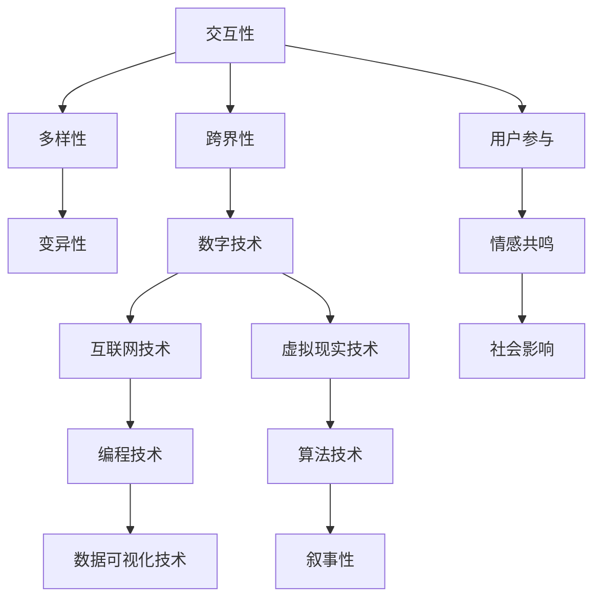

                 

# 新媒体艺术：科技时代的创意表达

> 关键词：新媒体艺术、交互性、多样性、科技与艺术融合、创作方法、未来趋势

> 摘要：本文从新媒体艺术的定义与特征入手，探讨了其历史与发展、在当代社会中的影响，以及创作方法与技术。通过分析国内外经典案例，展望了新媒体艺术的未来趋势，并对其发展挑战与机遇进行了深入探讨。本文旨在为广大读者提供一幅新媒体艺术的全景图，帮助大家更好地理解这一新兴艺术形式。

## 目录

1. 新媒体艺术概述  
   1.1 新媒体艺术的定义  
   1.2 新媒体艺术的特征  
   1.3 新媒体艺术的历史与发展

2. 新媒体艺术在当代社会中的影响  
   2.1 新媒体艺术与社会文化  
   2.2 新媒体艺术与科技发展

3. 新媒体艺术的创作方法与技术  
   3.1 新媒体艺术的创作原则与方法  
   3.2 新媒体艺术的技术基础

4. 新媒体艺术的实践案例  
   4.1 国内外新媒体艺术经典案例  
   4.2 新媒体艺术创新实践

5. 新媒体艺术的未来展望  
   5.1 新媒体艺术的未来趋势  
   5.2 新媒体艺术的发展挑战与机遇

6. 附录

## 第一部分：新媒体艺术概述

### 1.1 新媒体艺术的定义

新媒体艺术，是指运用数字技术、互联网技术、虚拟现实技术等现代科技手段进行创作、展示和传播的艺术形式。与传统艺术相比，新媒体艺术具有更强的交互性、多样性和变异性。

#### 1.1.1 新媒体艺术的概念

新媒体艺术的概念最早可以追溯到20世纪80年代，当时数字技术和互联网技术开始崛起，艺术家们开始尝试将科技元素融入艺术创作中。随着科技的不断发展，新媒体艺术的定义也在不断演变，但其核心始终是艺术与科技的融合。

#### 1.1.2 与传统艺术形式的区别

传统艺术形式，如绘画、雕塑、摄影等，主要以静态、二维或三维的形式存在，强调艺术的审美和表现力。而新媒体艺术则更加注重互动性和参与性，观众不仅是观看者，还可以成为参与者，甚至影响艺术作品的呈现。

### 1.2 新媒体艺术的特征

#### 1.2.1 交互性

交互性是新媒体艺术最显著的特征之一。通过互联网、传感器等技术，观众可以与艺术作品进行实时互动，改变作品的呈现状态，甚至参与到创作过程中。

#### 1.2.2 多样性

新媒体艺术的表现形式多样，包括数字图像、声音、视频、动画、虚拟现实、增强现实等。艺术家们可以运用各种技术手段，创作出独特的艺术作品。

#### 1.2.3 变异性

由于新媒体艺术的创作过程高度依赖技术手段，艺术作品的呈现状态可以随时改变，具有很高的变异性。艺术家可以通过编程和算法，实现对艺术作品的控制和调整。

#### 1.2.4 跨界性

新媒体艺术不仅与传统艺术形式交叉融合，还与科学、技术、商业等领域密切相关。这种跨界性使得新媒体艺术具有广泛的应用前景。

### 1.3 新媒体艺术的历史与发展

#### 1.3.1 新媒体艺术的起源

新媒体艺术的起源可以追溯到20世纪60年代，当时计算机技术和数字技术开始兴起，艺术家们开始探索将科技元素融入艺术创作中。

#### 1.3.2 新媒体艺术的发展阶段

1. 数字艺术的初期探索（20世纪60年代-80年代）

在这个阶段，艺术家们开始尝试使用计算机进行艺术创作，数字图像处理技术逐渐成熟。

2. 互联网时代的艺术实践（20世纪90年代至今）

随着互联网的普及，艺术家们开始通过互联网展示和传播自己的艺术作品，新媒体艺术进入了一个新的发展阶段。

3. 当前新媒体艺术的多元化发展

随着虚拟现实、增强现实、人工智能等新技术的不断涌现，新媒体艺术的表现形式更加多样，应用领域也更加广泛。

## 第二部分：新媒体艺术在当代社会中的影响

### 2.1 新媒体艺术与社会文化

#### 2.1.1 新媒体艺术对文化传统的挑战

新媒体艺术的崛起，对传统文化形式构成了挑战。传统艺术形式如绘画、雕塑等，在现代社会中逐渐式微，而新媒体艺术则以其独特的表现手法和形式，吸引了越来越多的观众。

#### 2.1.2 新媒体艺术在全球化背景下的文化交流

新媒体艺术的全球化趋势，使得不同国家和地区的艺术家可以更加便捷地进行文化交流。通过互联网和新媒体技术，艺术家们可以跨越时空限制，分享自己的艺术作品，推动全球艺术文化的融合。

### 2.2 新媒体艺术与科技发展

#### 2.2.1 科技进步对新媒体艺术的影响

科技的进步，为新媒体艺术的发展提供了强大的技术支持。虚拟现实、增强现实、人工智能等新技术，使得新媒体艺术的创作和呈现方式更加多样，艺术作品的互动性和体验感也大幅提升。

#### 2.2.2 新媒体艺术在科技创新中的应用

新媒体艺术不仅在艺术领域发挥着重要作用，还在科技创新中发挥着独特的价值。例如，通过新媒体艺术的形式，可以更好地展示和传播科学研究成果，激发公众对科学的兴趣和认知。

## 第三部分：新媒体艺术的创作方法与技术

### 3.1 新媒体艺术的创作原则与方法

#### 3.1.1 创作原则

1. 交互设计

交互设计是新媒体艺术创作的重要原则之一。通过设计用户与艺术作品之间的互动方式，可以提升观众的参与感和体验感。

2. 数据可视化

数据可视化是将数据通过图形、图表等形式进行展示，让观众更直观地理解数据背后的信息。在数据艺术创作中，数据可视化发挥着重要作用。

3. 叙事性

叙事性是指通过艺术作品讲述一个故事或传达一种情感。在多媒体艺术创作中，叙事性可以帮助观众更好地理解和感受艺术作品的主题。

#### 3.1.2 创作方法

1. 数字图像处理

数字图像处理技术是新媒体艺术创作的基础。通过图像处理软件，艺术家可以创作出各种形式的数字图像作品。

2. 声音艺术创作

声音艺术创作是新媒体艺术的重要表现形式之一。通过声音处理软件，艺术家可以创作出独特的声音艺术作品。

3. 虚拟现实与增强现实

虚拟现实和增强现实技术，为新媒体艺术创作提供了新的可能性。通过虚拟现实和增强现实技术，艺术家可以创作出沉浸式的艺术体验。

### 3.2 新媒体艺术的技术基础

#### 3.2.1 数字媒体技术

数字媒体技术包括数字图像处理技术、数字声音处理技术、数字视频技术等。这些技术为新媒体艺术创作提供了基础支持。

#### 3.2.2 计算机编程与软件应用

计算机编程和软件应用是新媒体艺术创作的重要手段。通过编程和软件，艺术家可以实现对艺术作品的控制和调整，创作出独特的艺术作品。

## 第四部分：新媒体艺术的实践案例

### 4.1 国内外新媒体艺术经典案例

#### 4.1.1 数字艺术展览

数字艺术展览是新媒体艺术的重要实践形式之一。国内外有许多知名的数字艺术展览，如法国巴黎的“数字艺术博物馆”、中国北京的“798艺术区”等。

#### 4.1.2 声音艺术装置

声音艺术装置是新媒体艺术的另一重要实践形式。通过声音处理技术和空间设计，艺术家可以创作出独特的声音艺术作品，如《城市的声音》、《海洋的声音》等。

#### 4.1.3 虚拟现实体验项目

虚拟现实体验项目是新媒体艺术在交互性方面的重要实践。通过虚拟现实技术，观众可以体验到沉浸式的艺术体验，如《全景艺术馆》、《虚拟博物馆》等。

### 4.2 新媒体艺术创新实践

#### 4.2.1 数据艺术创作

数据艺术创作是新媒体艺术的创新实践之一。通过收集和分析大量数据，艺术家可以创作出反映社会现象和情感的数据艺术作品，如《数据之舞》、《情绪图谱》等。

#### 4.2.2 交互艺术体验

交互艺术体验是新媒体艺术在互动性方面的重要实践。通过设计用户与艺术作品之间的互动方式，艺术家可以创作出独特的交互艺术作品，如《互动绘画》、《虚拟助手》等。

#### 4.2.3 跨界艺术项目

跨界艺术项目是新媒体艺术的创新实践之一。通过与其他艺术形式、学科领域的结合，艺术家可以创作出独特的跨界艺术作品，如《舞蹈与科技》、《文学与艺术》等。

## 第五部分：新媒体艺术的未来展望

### 5.1 新媒体艺术的未来趋势

#### 5.1.1 科技与艺术的融合

未来，科技与艺术的融合将更加深入。人工智能、生物技术等新兴科技，将为新媒体艺术创作带来新的可能性。

#### 5.1.2 新媒体艺术的教育与普及

未来，新媒体艺术的教育与普及将得到进一步推广。通过新媒体艺术教育，可以提高公众对艺术的认知和兴趣。

#### 5.1.3 新媒体艺术在国际舞台上的地位

未来，新媒体艺术将在国际舞台上占据更加重要的地位。通过国际艺术交流，新媒体艺术将更好地展现其独特的魅力。

### 5.2 新媒体艺术的发展挑战与机遇

#### 5.2.1 道德与伦理问题

随着新媒体艺术的发展，道德与伦理问题日益突出。艺术家在创作过程中，需要充分考虑这些问题，确保艺术创作的正当性和合理性。

#### 5.2.2 新媒体艺术的市场前景

未来，新媒体艺术的市场前景将更加广阔。随着技术的不断进步和人们对艺术需求的增长，新媒体艺术将在艺术市场占据重要地位。

## 附录

### 附录一：新媒体艺术工具与资源指南

1. 数字图像处理软件：如Adobe Photoshop、GIMP等。

2. 声音处理软件：如Audacity、FL Studio等。

3. 虚拟现实与增强现实开发工具：如Unity、Unreal Engine等。

4. 计算机编程语言：如Python、JavaScript等。

### 附录二：新媒体艺术相关的优秀作品推荐

1. 《数字艺术博物馆》：展示世界各地的数字艺术作品。

2. 《声音艺术装置》：展示各种声音艺术作品。

3. 《虚拟现实体验项目》：提供沉浸式的虚拟现实体验。

### 附录三：新媒体艺术实践项目指导

1. 数据艺术创作：通过数据分析，创作反映社会现象的艺术作品。

2. 交互艺术体验：设计用户与艺术作品之间的互动方式。

3. 跨界艺术项目：与其他艺术形式、学科领域结合，创作独特的艺术作品。

**作者：AI天才研究院/AI Genius Institute & 禅与计算机程序设计艺术 /Zen And The Art of Computer Programming**## 新媒体艺术：科技时代的创意表达

### 摘要

新媒体艺术是现代科技与传统艺术融合的产物，它以数字技术、互联网技术、虚拟现实技术等为手段，创造了一种全新的艺术表现形式。本文将深入探讨新媒体艺术的定义与特征，回顾其历史与发展，分析新媒体艺术在当代社会中的影响，介绍其创作方法与技术，并通过实践案例展示新媒体艺术的多样性与创新性。最后，本文将展望新媒体艺术的未来趋势，探讨其面临的挑战与机遇，为读者提供一个全面的新媒体艺术全景图。

### 目录

1. **新媒体艺术概述**
   1.1 新媒体艺术的定义
   1.2 新媒体艺术的特征
   1.3 新媒体艺术的历史与发展

2. **新媒体艺术在当代社会中的影响**
   2.1 新媒体艺术与社会文化
   2.2 新媒体艺术与科技发展

3. **新媒体艺术的创作方法与技术**
   3.1 新媒体艺术的创作原则与方法
   3.2 新媒体艺术的技术基础

4. **新媒体艺术的实践案例**
   4.1 国内外新媒体艺术经典案例
   4.2 新媒体艺术创新实践

5. **新媒体艺术的未来展望**
   5.1 新媒体艺术的未来趋势
   5.2 新媒体艺术的发展挑战与机遇

6. **附录**
   6.1 新媒体艺术工具与资源指南
   6.2 新媒体艺术相关的优秀作品推荐
   6.3 新媒体艺术实践项目指导

### 第一部分：新媒体艺术概述

#### 1.1 新媒体艺术的定义

新媒体艺术是一种利用数字技术、互联网技术、虚拟现实技术等现代科技手段进行创作、展示和传播的艺术形式。它与传统艺术形式相比，具有更强的交互性、多样性和变异性。新媒体艺术的定义并不是一成不变的，而是随着科技的进步和社会的发展而不断演变。

在新媒体艺术中，艺术家们不仅利用传统的绘画、雕塑等手段进行创作，还运用编程、算法、互动设计等技术，创造出全新的艺术形式。例如，通过虚拟现实技术，艺术家可以创建一个虚拟的三维空间，观众可以在其中自由探索和互动；通过计算机编程，艺术家可以控制多媒体元素的变化，创造出动态的艺术作品。

#### 1.2 新媒体艺术的特征

1. **交互性**：新媒体艺术强调观众与艺术作品之间的互动。通过传感器、互联网等技术，观众可以实时地与艺术作品进行互动，改变作品的呈现状态，甚至参与到创作过程中。这种互动性极大地增强了观众的参与感和体验感。

2. **多样性**：新媒体艺术的表现形式丰富多样，包括数字图像、声音、视频、动画、虚拟现实、增强现实等。艺术家可以根据自己的创作理念和技术能力，选择不同的表现形式，创造出独具特色的艺术作品。

3. **变异性**：由于新媒体艺术的创作过程高度依赖技术手段，艺术作品的呈现状态可以随时改变。艺术家可以通过编程和算法，对艺术作品进行实时控制和调整，使其在不同的环境中呈现出不同的面貌。

4. **跨界性**：新媒体艺术不仅与传统艺术形式交叉融合，还与科学、技术、商业等领域密切相关。这种跨界性使得新媒体艺术具有广泛的应用前景，可以用于艺术展览、教育、设计、娱乐等多个领域。

#### 1.3 新媒体艺术的历史与发展

新媒体艺术的历史可以追溯到20世纪60年代，当时计算机技术和数字技术开始兴起，艺术家们开始尝试将科技元素融入艺术创作中。这一时期，一些先锋艺术家如约瑟夫·科苏斯（Joseph Kosuth）和约翰·凯奇（John Cage）等，开始探索计算机在艺术创作中的应用。

到了20世纪80年代，随着个人计算机和互联网的普及，新媒体艺术进入了一个新的发展阶段。艺术家们可以更加便捷地获取和使用计算机技术，创作出更加复杂和互动的艺术作品。这一时期，一些著名的艺术团体如“电码”（E.A.T.）和“计算机艺术协会”（Computer Art Association）等，为新媒体艺术的发展做出了重要贡献。

进入21世纪，随着虚拟现实、增强现实、人工智能等新技术的不断涌现，新媒体艺术的表现形式和创作方法更加多样，应用领域也更加广泛。例如，虚拟现实技术可以创造出沉浸式的艺术体验，让观众在虚拟世界中感受艺术作品的魅力；人工智能技术可以帮助艺术家创作出具有高度个性化的艺术作品。

总的来说，新媒体艺术的发展历程反映了科技与艺术的不断融合。随着科技的不断进步，新媒体艺术将继续创新和发展，为人类带来更多丰富多彩的艺术体验。

### 1.4 新媒体艺术的核心概念与联系

为了更好地理解新媒体艺术，我们需要了解其核心概念及其相互关系。以下是新媒体艺术中几个关键概念及其相互关系的 Mermaid 流程图：



这个流程图展示了新媒体艺术的核心概念及其相互关系。其中，交互性是新媒体艺术的基石，它决定了艺术作品与观众之间的互动方式；多样性使得艺术作品形式丰富，满足了不同观众的需求；变异性则使得艺术作品在创作和展示过程中可以不断变化，保持了新鲜感和吸引力。跨界性展示了新媒体艺术与科学、技术、商业等其他领域的融合；数字技术、互联网技术和虚拟现实技术则是新媒体艺术的技术基础，编程技术和算法技术为艺术创作提供了强大的工具；数据可视化技术可以帮助艺术家更好地展示和传达信息；叙事性则使得艺术作品更加具有深度和内涵，能够引发观众的思考和情感共鸣。用户参与和社会影响则强调了新媒体艺术的互动性和社会价值。

通过这个流程图，我们可以更清晰地理解新媒体艺术的核心概念及其相互关系，从而更好地把握这一艺术形式的本质。

### 1.5 新媒体艺术的创作方法与技术

新媒体艺术的创作方法和技术手段丰富多样，涵盖了从数字图像处理到编程和算法应用等多个方面。以下是一些新媒体艺术的创作方法和技术：

#### 1.5.1 数字图像处理

数字图像处理是新媒体艺术创作的基础技术之一。通过图像处理软件（如Adobe Photoshop、GIMP等），艺术家可以创作出各种形式的数字图像作品。数字图像处理技术包括图像合成、色彩调整、滤镜应用等，这些技术可以帮助艺术家创作出具有独特视觉效果的艺术作品。

**案例**：一个常见的数字图像处理案例是创建一个视觉特效图像。以下是一个简单的Python代码示例，展示了如何使用Pillow库来对图像进行色彩调整和滤镜应用。

```python
from PIL import Image, ImageFilter

# 读取图像
image = Image.open("input_image.jpg")

# 色彩调整
image = image.convert("L")  # 转换为灰度图像
image = image.filter(ImageFilter.SHARPEN)  # 应用锐化滤镜

# 保存图像
image.save("output_image.jpg")
```

在这个例子中，我们首先读取一个输入图像，然后将其转换为灰度图像，并应用锐化滤镜来增强图像的清晰度。通过调整图像的色彩和滤镜，艺术家可以创造出独特的视觉效果。

#### 1.5.2 声音艺术创作

声音艺术创作是新媒体艺术的另一个重要领域。通过声音处理软件（如Audacity、FL Studio等），艺术家可以创作出各种形式的声音艺术作品，如声音装置、声音动画等。声音艺术创作涉及声音的采集、处理、合成等过程。

**案例**：以下是一个使用Python的Pydub库来创建一个简单的声音动画的示例代码。

```python
from pydub import AudioSegment
from PIL import Image, ImageDraw

# 创建一个5秒的纯音频
audio = AudioSegment.silent(duration=5000)

# 读取图像
image = Image.open("input_image.jpg")
draw = ImageDraw.Draw(image)

# 在图像上绘制波形
height = image.size[1]
width = image.size[0]
draw.rectangle([0, 0, width, height // 2], fill=(255, 0, 0))
draw.rectangle([0, height // 2, width, height], fill=(0, 0, 255))

# 将图像转换为音频
image_audio = AudioSegment.from_image(image)

# 合并音频
audio = audio.overlay(image_audio)

# 保存音频
audio.export("output_audio.mp3", format="mp3")
```

在这个例子中，我们首先创建了一个5秒的纯音频，然后在图像上绘制了一个红色的波形和一个蓝色的波形。接着，我们将图像转换为音频，并将其与原始音频合并。通过这种方式，艺术家可以创作出具有视觉和听觉双重体验的声音艺术作品。

#### 1.5.3 虚拟现实与增强现实

虚拟现实（VR）和增强现实（AR）技术为新媒体艺术创作提供了新的可能性。通过VR和AR技术，艺术家可以创造出沉浸式的艺术体验，观众可以在虚拟的三维空间中自由探索和互动。

**案例**：以下是一个使用Unity游戏引擎来创建一个简单的VR艺术体验的示例代码。

```csharp
using UnityEngine;

public class VRArt : MonoBehaviour
{
    public Material material;  // 材质
    public Texture2D texture;  // 纹理

    // 在Unity编辑器中，将材质和纹理拖放到对应的字段中

    void Start()
    {
        // 应用材质和纹理
        GetComponent<MeshRenderer>().material = material;
        GetComponent<MeshRenderer>().material.mainTexture = texture;
    }
}
```

在这个例子中，我们创建了一个简单的VR艺术作品，通过在Unity场景中应用特定的材质和纹理，观众可以在VR环境中看到这个艺术作品。通过Unity的VR插件，艺术家可以创建出更加复杂和互动的VR艺术作品。

#### 1.5.4 数据可视化

数据可视化是将数据以图形、图表等形式进行展示，帮助观众更好地理解和分析数据。在数据艺术创作中，数据可视化技术发挥着重要作用。

**案例**：以下是一个使用Python的Matplotlib库来创建一个简单的数据可视化图表的示例代码。

```python
import matplotlib.pyplot as plt

# 数据
x = [1, 2, 3, 4, 5]
y = [1, 4, 9, 16, 25]

# 创建图表
plt.plot(x, y)

# 添加标题和标签
plt.title("数据可视化示例")
plt.xlabel("x轴")
plt.ylabel("y轴")

# 显示图表
plt.show()
```

在这个例子中，我们创建了一个简单的折线图，通过Matplotlib库将数据以图形形式展示出来。通过数据可视化技术，艺术家可以创作出具有深刻意义和视觉冲击力的数据艺术作品。

### 1.6 新媒体艺术的创作原则

新媒体艺术创作不仅仅是技术的运用，更是一种艺术理念的实践。以下是一些新媒体艺术创作的基本原则：

#### 1.6.1 交互设计

交互设计是新媒体艺术创作中的重要原则之一。通过设计用户与艺术作品之间的互动方式，艺术家可以提升观众的参与感和体验感。交互设计包括用户界面设计、用户交互逻辑、反馈机制等多个方面。

**案例**：一个简单的交互设计案例是一个触摸屏幕上的动态艺术作品。以下是一个使用JavaScript和HTML创建一个简单的触摸交互的示例代码。

```html
<!DOCTYPE html>
<html>
<head>
    <title>触摸交互示例</title>
    <style>
        canvas {
            border: 1px solid black;
        }
    </style>
</head>
<body>
    <canvas id="myCanvas" width="500" height="500"></canvas>
    <script>
        var canvas = document.getElementById("myCanvas");
        var ctx = canvas.getContext("2d");

        // 触摸开始事件
        canvas.addEventListener("touchstart", function (e) {
            e.preventDefault();
            var touch = e.touches[0];
            var x = touch.clientX - canvas.offsetLeft;
            var y = touch.clientY - canvas.offsetTop;
            drawCircle(x, y);
        }, false);

        function drawCircle(x, y) {
            ctx.beginPath();
            ctx.arc(x, y, 30, 0, 2 * Math.PI);
            ctx.fillStyle = "blue";
            ctx.fill();
            ctx.closePath();
        }
    </script>
</body>
</html>
```

在这个例子中，当用户触摸屏幕时，会在触摸点绘制一个蓝色的圆。通过这种方式，艺术家可以设计出具有交互性的新媒体艺术作品，让观众在参与过程中感受到艺术的美妙。

#### 1.6.2 数据可视化

数据可视化是将抽象的数据转化为直观的图形和图表，帮助观众更好地理解和分析数据。在数据艺术创作中，数据可视化技术发挥着重要作用。

**案例**：一个常见的数据可视化案例是创建一个动态的折线图。以下是一个使用Python的Plotly库创建动态折线图的示例代码。

```python
import plotly.express as px

# 数据
x = [1, 2, 3, 4, 5]
y = [1, 4, 9, 16, 25]

# 创建动态折线图
fig = px.line(x=x, y=y, title="动态折线图示例")
fig.update_layout(xaxis=dict(title='x轴'), yaxis=dict(title='y轴'))

# 显示图表
fig.show()
```

在这个例子中，我们使用Plotly库创建了一个动态的折线图。通过交互式图表，观众可以更好地理解数据的变化趋势，艺术家也可以通过这种方式传达更深层次的信息。

#### 1.6.3 叙事性

叙事性是新媒体艺术创作中的重要原则之一。通过艺术作品讲述一个故事或传达一种情感，艺术家可以引发观众的共鸣和思考。

**案例**：一个常见的叙事性案例是创建一个互动故事。以下是一个使用HTML和JavaScript创建一个简单的互动故事的示例代码。

```html
<!DOCTYPE html>
<html>
<head>
    <title>互动故事示例</title>
    <style>
        button {
            margin: 5px;
        }
    </style>
</head>
<body>
    <h1>互动故事</h1>
    <button onclick="showNextPage()">继续阅读</button>
    <div id="storyPage">
        <p>故事开始，你正在一片神秘的森林中探险。</p>
    </div>
    <script>
        var currentPage = 1;

        function showNextPage() {
            currentPage++;
            if (currentPage === 2) {
                document.getElementById("storyPage").innerHTML =
                    "<p>你突然发现一条小溪，决定沿着溪流走。</p>";
            } else if (currentPage === 3) {
                document.getElementById("storyPage").innerHTML =
                    "<p>你走到溪流的尽头，发现一座神秘的城堡。</p>";
            } else {
                document.getElementById("storyPage").innerHTML =
                    "<p>故事结束，感谢你的阅读。</p>";
            }
        }
    </script>
</body>
</html>
```

在这个例子中，当用户点击按钮时，故事会逐页展示，用户可以参与到故事的发展过程中。通过这种方式，艺术家可以传达一个完整的故事，让观众在互动中体验到故事的魅力。

### 1.7 新媒体艺术的技术基础

新媒体艺术的创作依赖于多种技术手段，这些技术手段构成了新媒体艺术的技术基础。以下是一些新媒体艺术的关键技术：

#### 1.7.1 数字媒体技术

数字媒体技术是新媒体艺术创作的基础，包括数字图像处理技术、数字声音处理技术和数字视频技术等。

**数字图像处理技术**：通过图像处理软件（如Adobe Photoshop、GIMP等），艺术家可以对图像进行各种编辑和处理，包括图像合成、色彩调整、滤镜应用等。这些技术可以帮助艺术家创作出具有独特视觉效果的艺术作品。

**数字声音处理技术**：通过声音处理软件（如Audacity、FL Studio等），艺术家可以创作出各种形式的声音艺术作品，如声音装置、声音动画等。声音处理技术包括声音的采集、处理、合成等过程。

**数字视频技术**：通过视频编辑软件（如Adobe Premiere Pro、Final Cut Pro等），艺术家可以创作出各种形式的电影和视频艺术作品。视频技术包括视频的剪辑、特效添加、音频处理等。

#### 1.7.2 计算机编程与软件应用

计算机编程和软件应用是新媒体艺术创作的重要手段。通过编程和软件，艺术家可以实现对艺术作品的控制和调整，创作出独特的艺术作品。

**Python编程基础**：Python是一种广泛使用的编程语言，特别是在数据科学和人工智能领域。通过Python，艺术家可以轻松地处理数据、创建可视化图表、编写交互式艺术作品等。

**JavaScript与Web开发**：JavaScript是一种前端编程语言，用于创建交互式的网页和Web应用。通过JavaScript，艺术家可以创建出具有动态效果的网页艺术作品。

**Unity游戏引擎与虚拟现实**：Unity是一种强大的游戏开发引擎，也广泛应用于虚拟现实（VR）和增强现实（AR）应用。通过Unity，艺术家可以创建出沉浸式的虚拟艺术体验。

#### 1.7.3 虚拟现实与增强现实技术

虚拟现实（VR）和增强现实（AR）技术为新媒体艺术创作提供了新的可能性。通过VR和AR技术，艺术家可以创造出沉浸式的艺术体验，观众可以在虚拟的三维空间中自由探索和互动。

**虚拟现实技术**：通过虚拟现实头盔和传感器，艺术家可以创建出一个虚拟的三维空间，观众可以在其中自由探索和互动。虚拟现实技术可以帮助艺术家创造出独特的沉浸式艺术体验。

**增强现实技术**：通过增强现实眼镜或手机摄像头，艺术家可以在现实世界中叠加虚拟元素。增强现实技术可以帮助艺术家创造出与现实世界互动的艺术作品。

### 1.8 国内外新媒体艺术经典案例

新媒体艺术在全球范围内都有广泛的应用和影响力，以下是一些国内外的新媒体艺术经典案例：

#### 1.8.1 国外经典案例

1. **The Reflected Sea（反射的海洋）**：这是由荷兰艺术家Daan Roosegaarde创作的一个新媒体艺术项目，它使用LED灯和传感器来反射水下的海洋生物，形成一幅动态的海洋画面。这个作品不仅展示了新媒体艺术的视觉效果，还强调了环境保护的重要性。

2. **The Brain（大脑）**：这是一件由美国艺术家团队TeamLab创作的互动艺术作品，它通过计算机编程和传感器技术，让观众在展览空间中感受到大脑的神经活动。这个作品展示了新媒体艺术的互动性和沉浸式体验。

3. **Rain Room（雨屋）**：这是一件由英国艺术家团队Random International创作的互动艺术装置，它利用传感器和投影技术，在雨中创造出一个可以让人自由行走的区域。这个作品让观众在虚拟与现实的边界中体验艺术的魅力。

#### 1.8.2 国内经典案例

1. **数字艺术展览**：中国北京的798艺术区是一个著名的新媒体艺术展览场所，这里定期举办各种新媒体艺术展览，展示了国内外艺术家的最新作品。

2. **声音艺术装置**：中国艺术家徐冰的《天书》是一件以声音为主题的艺术装置，它通过声音的变化来传达信息，让观众在听觉和视觉上同时体验艺术的魅力。

3. **虚拟现实体验项目**：中国科技公司华为的“VR艺术馆”是一个利用虚拟现实技术展示艺术作品的体验项目，它让观众可以在虚拟的三维空间中欣赏艺术作品，体验前所未有的艺术感受。

### 1.9 新媒体艺术的创新实践

新媒体艺术的创新实践不断推动着艺术形式的变革和发展，以下是一些新媒体艺术的创新实践：

#### 1.9.1 数据艺术创作

数据艺术创作是新媒体艺术的一个重要领域，它通过数据可视化将数据转化为艺术形式，使观众能够直观地理解和感受数据背后的信息和故事。以下是一个使用Python和Plotly库创作数据艺术作品的示例：

```python
import plotly.express as px
import pandas as pd

# 加载数据
data = pd.read_csv("data.csv")

# 创建数据艺术作品
fig = px.scatter(data, x="x", y="y", size="size", color="color", title="数据艺术作品")
fig.update_layout(legend=dict(orientation="h"))

# 显示图表
fig.show()
```

在这个例子中，我们使用Plotly库创建了一个数据艺术作品，通过调整数据点的颜色、大小和位置，艺术家可以创作出具有视觉冲击力的数据艺术作品。

#### 1.9.2 交互艺术体验

交互艺术体验是新媒体艺术的一个重要特征，它通过设计用户与艺术作品之间的互动方式，提升观众的参与感和体验感。以下是一个使用JavaScript和HTML创建交互艺术体验的示例：

```html
<!DOCTYPE html>
<html>
<head>
    <title>交互艺术体验</title>
    <style>
        canvas {
            border: 1px solid black;
        }
    </style>
</head>
<body>
    <canvas id="myCanvas" width="500" height="500"></canvas>
    <script>
        var canvas = document.getElementById("myCanvas");
        var ctx = canvas.getContext("2d");

        // 交互逻辑
        canvas.addEventListener("mousemove", function (e) {
            var x = e.clientX - canvas.offsetLeft;
            var y = e.clientY - canvas.offsetTop;
            drawCircle(x, y);
        }, false);

        function drawCircle(x, y) {
            ctx.beginPath();
            ctx.arc(x, y, 30, 0, 2 * Math.PI);
            ctx.fillStyle = "blue";
            ctx.fill();
            ctx.closePath();
        }
    </script>
</body>
</html>
```

在这个例子中，当用户在画布上移动鼠标时，会在鼠标位置绘制一个蓝色的圆。通过这种方式，艺术家可以设计出具有互动性的新媒体艺术作品，让观众在参与过程中体验到艺术的美妙。

#### 1.9.3 跨界艺术项目

跨界艺术项目是新媒体艺术的创新实践之一，它通过与其他艺术形式、学科领域的结合，创作出独特的艺术作品。以下是一个跨界艺术项目的示例：

- **舞蹈与科技**：艺术家将舞蹈与虚拟现实技术相结合，创作出一个虚拟的舞蹈表演。观众可以通过虚拟现实头盔感受到舞蹈演员的动作，体验前所未有的舞蹈体验。
- **文学与艺术**：艺术家将文学作品转化为视觉艺术，通过图像、声音、视频等形式展现文学作品的内涵和情感。这种方式不仅丰富了艺术形式，也为文学作品的传播提供了新的途径。
- **设计与应用**：艺术家将新媒体艺术应用于实际生活中，如城市规划、产品设计、公共艺术等。通过这种方式，艺术家不仅传达了艺术理念，还为社会带来了积极的影响。

### 1.10 新媒体艺术的未来展望

新媒体艺术在未来的发展中将继续保持活力和创新，以下是一些新媒体艺术的未来趋势：

#### 1.10.1 科技与艺术的融合

随着科技的不断进步，新媒体艺术将继续与科技深度融合。人工智能、生物技术、量子计算等新兴科技将为新媒体艺术创作带来新的可能性。例如，通过人工智能技术，艺术家可以创作出具有高度个性化的艺术作品；通过生物技术，艺术家可以探索生命艺术的新形式。

#### 1.10.2 新媒体艺术的教育与普及

新媒体艺术的教育与普及将得到进一步推广。随着科技的普及和教育资源的丰富，越来越多的人将接触到新媒体艺术，学会使用新媒体技术进行创作和表达。新媒体艺术教育将不仅局限于专业艺术院校，也将扩展到中小学、社会培训机构等多个层面。

#### 1.10.3 新媒体艺术在国际舞台上的地位

新媒体艺术将在国际舞台上占据更加重要的地位。随着全球化的加深和文化交流的频繁，新媒体艺术将更好地展现其独特的魅力。国际艺术展览、艺术节等活动将越来越多地关注新媒体艺术，新媒体艺术家也将成为国际艺术界的领军人物。

#### 1.10.4 新媒体艺术的发展挑战与机遇

新媒体艺术在未来的发展中也将面临一系列挑战和机遇。例如，如何平衡艺术创作与商业利益、如何保护艺术作品的版权、如何处理道德和伦理问题等。然而，随着科技的不断进步和社会的不断发展，新媒体艺术将不断克服挑战，迎接更多的机遇。

### 1.11 新媒体艺术的发展挑战与机遇

新媒体艺术的发展既面临机遇，也面临挑战。以下是一些新媒体艺术的发展挑战与机遇：

#### 1.11.1 道德与伦理问题

随着新媒体艺术的发展，道德和伦理问题日益突出。例如，隐私问题、版权问题、艺术创作的正当性等。艺术家在创作过程中需要充分考虑这些问题，确保艺术创作的正当性和合理性。

**挑战**：如何在艺术创作的自由性和社会责任之间找到平衡点？

**机遇**：通过建立完善的法律法规和道德准则，促进新媒体艺术的健康发展。

#### 1.11.2 技术更新与淘汰

新媒体艺术依赖于科技手段，技术更新速度快，淘汰周期短。艺术家需要不断学习和掌握新的技术，以保持艺术创作的活力。

**挑战**：如何跟上技术更新的步伐，不断适应新的创作需求？

**机遇**：新技术的不断涌现为艺术家提供了更多的创作工具和手段，激发出更多的创意。

#### 1.11.3 市场前景

随着新媒体艺术的普及和受众的增加，市场前景广阔。艺术市场的潜力巨大，为艺术家提供了更多的商业机会。

**挑战**：如何在激烈的市场竞争中脱颖而出？

**机遇**：通过创新和独特的艺术作品，艺术家可以赢得市场的认可和青睐。

### 1.12 附录

#### 1.12.1 新媒体艺术工具与资源指南

1. **数字图像处理软件**：如Adobe Photoshop、GIMP等。
2. **声音处理软件**：如Audacity、FL Studio等。
3. **虚拟现实与增强现实开发工具**：如Unity、Unreal Engine等。
4. **计算机编程语言**：如Python、JavaScript等。
5. **数据可视化工具**：如Matplotlib、Plotly等。

#### 1.12.2 新媒体艺术相关的优秀作品推荐

1. **The Reflected Sea（反射的海洋）**：荷兰艺术家Daan Roosegaarde的作品。
2. **The Brain（大脑）**：美国艺术家团队TeamLab的作品。
3. **Rain Room（雨屋）**：英国艺术家团队Random International的作品。
4. **数字艺术展览**：北京798艺术区的新媒体艺术展览。
5. **声音艺术装置**：徐冰的《天书》。

#### 1.12.3 新媒体艺术实践项目指导

1. **数据艺术创作**：使用Python和Plotly库创建数据艺术作品。
2. **交互艺术体验**：使用JavaScript和HTML创建交互艺术作品。
3. **跨界艺术项目**：结合舞蹈、文学、设计等领域，创作跨界的艺术作品。
4. **虚拟现实体验**：使用Unity游戏引擎创建虚拟现实艺术作品。

### 1.13 结论

新媒体艺术是科技与艺术的完美结合，它以数字技术、互联网技术、虚拟现实技术等为手段，创造了一种全新的艺术表现形式。本文从新媒体艺术的定义与特征入手，探讨了其历史与发展、在当代社会中的影响，以及创作方法与技术。通过分析国内外经典案例，展望了新媒体艺术的未来趋势，并对其发展挑战与机遇进行了深入探讨。本文旨在为广大读者提供一幅新媒体艺术的全景图，帮助大家更好地理解这一新兴艺术形式。

**作者**：AI天才研究院/AI Genius Institute & 禅与计算机程序设计艺术 /Zen And The Art of Computer Programming

