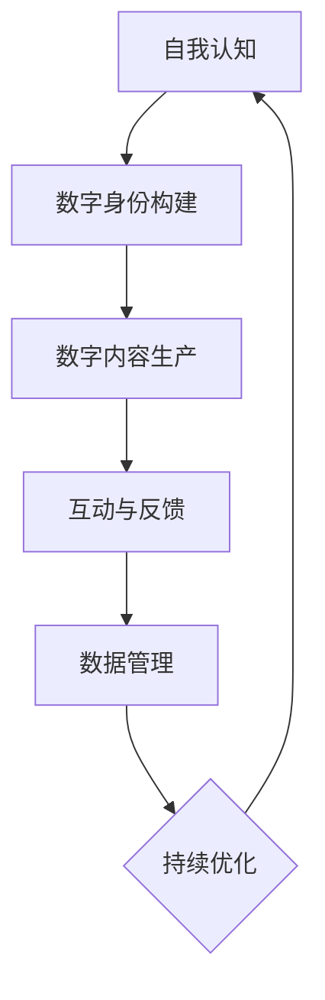

                 

### 《新存在主义宣言：数字时代的自我定义》

#### 关键词
- 新存在主义
- 数字时代
- 自我定义
- 数字伦理
- 数字身份

#### 摘要
在数字化迅猛发展的今天，我们的生活方式、人际关系乃至自我认知都发生了深刻的变革。本文旨在探讨这一变革背景下，新存在主义如何引导我们在数字时代重新定义自我。通过回顾传统存在主义的发展，分析数字化带来的挑战，我们试图构建一个以数字化为背景的新存在主义框架，为个体在数字世界的自我定位提供指导。文章将深入讨论数字身份、数字化生存的挑战与机遇，以及数字化时代的伦理问题，最后展望新存在主义在未来社会中的发展路径。

---

### 第一部分：引言

#### 1.1 存在主义的起源与发展

##### 1.1.1 存在主义的概念与哲学背景

存在主义（Existentialism）作为一种哲学流派，起源于20世纪初的欧洲，其核心理念是强调个体的自由、选择和责任。存在主义认为，人类的存在是独立于任何预设的实体或意义的，每个人必须通过自己的选择和行动来定义自己的生命意义。

存在主义哲学的重要代表人物包括丹麦哲学家基尔克戈尔（Søren Kierkegaard）、德国哲学家海德格尔（Martin Heidegger）和法国哲学家萨特（Jean-Paul Sartre）。基尔克戈尔关注个体在信仰和生活的选择中面临的困境，海德格尔则探讨了存在的本质及其与语言的关系，萨特则通过“存在先于本质”（existence precedes essence）这一命题，强调了个体自由选择的重要性。

##### 1.1.2 存在主义的关键思想与代表人物

存在主义的关键思想可以概括为以下几点：

1. **个体自由**：存在主义认为，个体拥有自由选择和创造自己生活意义的权利。这种自由是绝对的，不受任何外部因素的限定。
2. **选择与责任**：个体的自由伴随着责任，每个选择都可能导致不同的后果，个体必须为自己的选择承担后果。
3. **焦虑与荒谬**：存在主义认为，人类在现实生活中会感到焦虑和荒谬，这是由于生命的不可预测性和无意义性。
4. **主观性**：存在主义强调个体的主观体验和情感，认为这些体验是理解人类存在的关键。

代表人物方面，基尔克戈尔的《恐惧与颤粟》（The Sickness unto Death）探讨了个体如何通过信仰和道德来克服存在的焦虑；海德格尔的《存在与时间》（Being and Time）分析了存在的本质和语言的哲学意义；萨特的《存在与虚无》（Being and Nothingness）则通过现象学方法探讨了存在的本质和个体自由的选择。

#### 1.2 数字时代对存在主义的挑战

##### 1.2.1 技术变革对人类生活的深远影响

随着数字技术的发展，人类的生活发生了翻天覆地的变化。互联网的普及、社交媒体的兴起、人工智能的应用，这些技术变革深刻地影响了我们的生活方式、工作模式、甚至自我认知。数字化时代为我们提供了前所未有的便利和资源，但同时也带来了新的挑战。

1. **隐私与安全**：数字技术使个人信息的收集、存储和传播变得异常便捷，但也引发了隐私泄露和数据滥用的风险。
2. **数字鸿沟**：数字技术带来了信息获取的不平等，贫富差距和社会不公问题更加突出。
3. **人际关系**：社交媒体和虚拟现实等技术改变了人与人之间的互动方式，既带来了便利，也带来了新的社交障碍和情感疏离。

##### 1.2.2 数字化时代下存在主义的重新审视

数字化时代对存在主义提出了新的挑战，也提供了新的思考维度。首先，数字技术使得个体的存在形式更加多样化，我们不仅存在于现实世界，也存在于虚拟世界。这种多元存在的现实要求我们重新审视存在主义关于个体自由和责任的核心命题。

其次，数字化时代的隐私和安全问题引发了存在主义关于自由和责任的深刻讨论。如何在保障个体自由的同时，确保隐私和安全，成为存在主义在数字化时代必须回答的问题。

最后，数字化时代下的人际关系挑战了存在主义关于人际关系本质的思考。在虚拟社交中，个体如何维持真实的自我，如何在数字世界中建立有意义的人际关系，是存在主义需要探讨的新领域。

#### 1.3 本书的目标与结构概述

##### 1.3.1 探讨数字时代下的存在主义问题

本书的目标是探讨数字时代对存在主义提出的挑战，并探索如何在数字化背景下重新定义自我。我们将通过分析数字技术的应用，探讨个体在数字世界中的定位、数字化生存的挑战与机遇，以及数字伦理问题，为个体在数字时代找到新的存在意义。

##### 1.3.2 探索数字时代中自我定义的新途径

在数字化时代，个体如何定义自我是一个复杂而重要的课题。本书将介绍一系列的数字自我定义的路径与方法，结合实际案例分析，帮助读者理解如何在数字世界中找到自己的位置，建立和维护数字身份。

#### 1.3.3 结构概述

本书分为四个部分：

- **第一部分：引言**：介绍存在主义的起源与发展，以及数字化时代对存在主义提出的挑战。
- **第二部分：数字时代的自我认知**：探讨个体在数字世界的定位、数字化生存的挑战与机遇，以及数字伦理问题。
- **第三部分：自我定义的实践**：介绍数字自我定义的路径与方法，并通过实际案例分析，帮助读者理解如何定义自我。
- **第四部分：数字时代的新存在主义**：探讨新存在主义的哲学基础、伦理维度和社会影响，以及未来展望。

---

在接下来的章节中，我们将逐一深入探讨这些主题，为读者提供深刻的见解和实用的指导。通过本文的阅读，我们希望读者能够对数字时代的新存在主义有更加清晰的理解，并为自己的数字生活找到新的方向和意义。

---

## 第二部分：数字时代的自我认知

在数字化时代，个体的存在形式变得更加多元和复杂。数字技术不仅改变了我们的生活方式，也重新定义了自我认知的方式。本部分将深入探讨个体在数字世界的定位、数字化生存的挑战与机遇，以及数字伦理问题，帮助读者理解如何在数字时代中找到自我，并维护自我认同。

#### 2.1 个体在数字世界的定位

##### 2.1.1 数字身份的构建与挑战

在数字化时代，数字身份成为个体在数字世界中定位的重要标志。数字身份不仅包括我们在各种数字平台上注册的账号信息，还涉及我们的在线行为、社交媒体互动以及数据轨迹等。构建一个清晰、独特的数字身份对于个体在数字世界中的社交、职业发展具有重要意义。

然而，数字身份的构建也面临诸多挑战：

1. **隐私泄露**：数字平台的广泛使用使得个人数据容易受到黑客攻击和隐私泄露的风险。如何在确保信息安全和隐私的同时构建数字身份，成为亟待解决的问题。
2. **信息真实性**：在数字世界中，虚假信息、虚假身份层出不穷。如何确保数字身份的真实性和可靠性，是构建数字身份时必须考虑的问题。
3. **身份多样化**：个体在数字世界中的身份可能具有多重性，例如工作身份、社交身份、兴趣身份等。如何平衡这些身份，确保其在不同场景下的统一性和一致性，是数字身份构建的一个挑战。

##### 2.1.2 数字化时代下的自我表达与隐私

数字化时代为个体提供了丰富的自我表达渠道，例如社交媒体、博客、视频平台等。通过这些渠道，个体可以自由地展示自己的思想、兴趣和个性，实现自我表达和认同。然而，这种自由也带来了隐私问题：

1. **隐私暴露**：个体在数字平台上的互动和分享，往往涉及个人隐私。如何在享受自我表达的自由的同时，保护个人隐私，成为数字化时代必须面对的挑战。
2. **隐私选择**：个体需要学会如何选择性地分享信息，控制自己的隐私暴露范围。这需要我们具备数字素养，了解隐私保护的基本知识和技巧。
3. **隐私伦理**：在数字时代，个体和平台之间存在着隐私伦理问题。如何确保个人数据不被滥用，平台如何履行隐私保护责任，是数字伦理需要探讨的重要议题。

#### 2.2 数字化生存的挑战与机遇

##### 2.2.1 数字化生存的负面影响

数字化生存为我们带来了诸多便利，但同时也伴随着一些负面影响：

1. **信息过载**：在数字化时代，信息量爆炸式增长，个体容易陷入信息过载的困境。如何筛选和处理有用信息，避免信息疲劳，是数字化生存的一个挑战。
2. **网络成瘾**：数字技术的普及使得网络成瘾问题愈发严重。长时间沉浸在虚拟世界中，不仅影响个体的身心健康，还可能导致社交能力和现实生活技能的退化。
3. **数字化焦虑**：在数字时代，个体可能会因为技术依赖和隐私担忧而产生焦虑感。如何应对数字化焦虑，保持心理健康，是数字化生存的重要课题。

##### 2.2.2 数字化生存带来的机遇与解决方案

尽管数字化生存存在挑战，但它也带来了诸多机遇：

1. **知识获取**：数字化平台为我们提供了丰富的学习资源和知识库，使得知识获取更加便捷。如何利用这些资源提升自身能力，是数字化生存的一个重要机遇。
2. **远程工作**：数字化技术使得远程工作成为可能，提供了更加灵活的工作方式和更广泛的工作机会。如何适应远程工作环境，提升工作效率，是数字化生存的一个重要课题。
3. **社交网络**：数字化平台为我们提供了广阔的社交网络，使得人与人之间的互动更加便捷。如何维护和拓展这些社交网络，建立有意义的人际关系，是数字化生存的一个重要机遇。

为了应对数字化生存的挑战和抓住机遇，我们需要：

1. **提升数字素养**：了解数字技术的基本原理，掌握数字工具的使用方法，提升数字素养，是应对数字化生存挑战的基础。
2. **心理健康教育**：通过心理健康教育，提高个体对数字化生存的心理适应能力，减少数字化焦虑，提升心理健康水平。
3. **隐私保护意识**：增强隐私保护意识，学会如何保护个人隐私，避免隐私泄露和滥用。

#### 2.3 数字伦理与道德责任

##### 2.3.1 数字伦理的基本原则

数字伦理（Digital Ethics）是探讨数字技术在社会中的应用及其道德影响的哲学分支。数字伦理的基本原则包括：

1. **隐私保护**：尊重个体的隐私权利，确保个人数据不被滥用。
2. **公平公正**：确保数字技术应用的公平性和公正性，避免技术歧视和不公。
3. **透明性**：确保数字技术操作的透明性，使个体能够了解和处理自己的数据。
4. **责任担当**：数字平台和开发者应对技术应用中的道德责任承担。

##### 2.3.2 个体在网络世界中的道德责任

在数字时代，个体在网络世界中的行为同样需要遵循道德准则：

1. **诚信**：在网络互动中保持诚信，不传播虚假信息，不恶意攻击他人。
2. **尊重**：尊重他人的隐私和权利，不侵犯他人的数字财产和知识产权。
3. **责任**：对自己的数字行为负责，不参与网络欺诈、网络暴力等违法活动。
4. **社会责任**：积极参与数字公益活动，促进数字社会的和谐发展。

#### 2.4 自我定义与数字化时代的意义

##### 2.4.1 数字化时代的自我认同

在数字化时代，自我认同变得更加复杂和多元。个体不仅需要认同现实中的自我，还需要在数字世界中找到自我位置。这种自我认同不仅关乎个体的心理状态，还影响到个体的社交关系、职业发展和社会认同。

1. **多重身份**：数字化时代允许个体拥有多重身份，例如在职场中是一个专业的工程师，在社交平台中是一个活跃的博主，在兴趣小组中是一个爱好者。如何协调和管理这些身份，确保其在不同场景下的统一性和一致性，是数字化时代自我认同的一个挑战。
2. **数字人格**：数字化时代中，个体的数字人格（Digital Persona）成为一个重要概念。数字人格是指个体在数字世界中的形象和表现，包括行为风格、语言习惯、价值观等。如何塑造和维护一个积极、健康的数字人格，对于个体在数字世界中的认同和影响力至关重要。

##### 2.4.2 数字化时代下的意义重构

数字化时代不仅改变了我们的生活方式，也重新定义了生活的意义。在数字化背景下，个体需要重新思考生命的意义和价值：

1. **技术依赖与独立**：在享受数字技术带来的便利的同时，个体需要保持独立思考，不依赖技术解决所有问题，以免失去自我。
2. **人际关系与虚拟互动**：在数字世界中，个体需要平衡虚拟互动和现实人际关系，确保数字关系与现实关系相互补充，而非取代。
3. **自我实现与社会贡献**：个体需要在数字化时代找到自我实现的途径，同时为社会发展贡献自己的力量，实现个人价值和社会价值的统一。

#### 2.5 数字自我定义的路径与方法

在数字化时代，个体需要通过一系列的路径和方法来定义自我，确保在数字世界中的存在和影响力：

1. **数字品牌建设**：通过在社交媒体、博客等平台上的积极互动，建立和提升个人的数字品牌，展示个人的专业能力和价值观。
2. **数据管理**：学会管理个人数据，确保数据安全和隐私，同时利用数据提升自我认知和决策能力。
3. **数字素养提升**：通过学习数字技术知识和技能，提升数字素养，确保在数字化时代具备适应和发展的能力。

#### 2.6 数字自我定义的实际应用场景

在数字自我定义的过程中，实际应用场景多种多样，以下是一些典型的应用场景：

1. **职业发展**：通过在职业社交平台（如LinkedIn）上建立个人品牌，展示专业能力和成就，提高职业竞争力。
2. **社交互动**：通过社交媒体平台（如Facebook、Twitter）与朋友和同行保持联系，分享生活和工作经验，建立和维护人际关系。
3. **兴趣发展**：通过兴趣社区（如Reddit、知乎）参与讨论和交流，展示个人兴趣和专业知识，结识志同道合的朋友。

#### 2.7 数字自我定义的未来展望

随着数字化技术的不断发展，数字自我定义的方式和路径也将不断演变。未来，我们可能看到更多基于人工智能和大数据分析的个性化数字自我定义工具，帮助个体更精准地定位自我，提升数字世界的存在感和影响力。

总之，在数字化时代，自我定义不仅关乎个体的生存和认同，也影响到个体在数字世界中的地位和影响力。通过深入探讨数字自我定义的路径和方法，我们希望读者能够更好地理解数字化时代的自我认知，并在数字世界中找到属于自己的位置。

### 3.1 数字自我定义的路径与方法

在数字化时代，个体如何定义自我是一个复杂而关键的问题。数字自我定义不仅关乎个人的身份认同，还影响到社交关系、职业发展和个人价值实现。本节将详细介绍数字自我定义的路径与方法，帮助读者在数字世界中找到属于自己的定位。

#### 3.1.1 数字自我定义的框架与模型

为了有效地进行数字自我定义，我们需要构建一个系统性的框架与模型。以下是一个基本的数字自我定义框架：

1. **自我认知**：个体需要通过自我反思，了解自己的兴趣、价值观、技能和目标。这一步是数字自我定义的基础。
2. **数字身份构建**：基于自我认知，个体在数字平台（如社交媒体、职业社交平台、博客等）上创建数字身份，展示个人的专业能力、兴趣和价值观。
3. **数字内容生产**：个体通过生产有价值的数字内容（如博客文章、视频、社交媒体帖子等），提升数字身份的知名度和影响力。
4. **互动与反馈**：个体积极参与数字平台的互动，获取反馈，不断优化数字身份和内容生产策略。
5. **数据管理**：个体需要管理个人数据，确保数据安全和隐私，同时利用数据提升自我认知和决策能力。

#### 3.1.2 数字自我定义的实际应用场景

以下是一些数字自我定义的实际应用场景：

1. **职业发展**：在职业社交平台（如LinkedIn）上建立个人品牌，展示专业能力和成就，吸引潜在雇主和合作伙伴。
   - **示例**：一位工程师在LinkedIn上分享自己的项目经验、技术博客，以及参与的技术讨论，提升职业形象，增加求职机会。
   
2. **社交互动**：在社交媒体平台（如Facebook、Twitter）上建立社交网络，分享生活和工作经验，建立和维护人际关系。
   - **示例**：一位创业者通过Twitter分享自己的创业经历、市场洞察，吸引志同道合的朋友和潜在投资者。

3. **兴趣发展**：在兴趣社区（如Reddit、知乎）上参与讨论和交流，展示个人兴趣和专业知识，结识志同道合的朋友。
   - **示例**：一位编程爱好者在Reddit的编程社区分享自己的编程经验和技巧，获得其他爱好者的认可和帮助。

#### 3.1.3 数字自我定义的方法与策略

为了有效地进行数字自我定义，个体可以采取以下方法和策略：

1. **内容为王**：生产高质量的数字内容，展示专业能力和兴趣。内容应具有独特性、实用性和价值性。
2. **持续更新**：定期更新数字内容，保持数字身份的活跃度和相关性。这有助于吸引和维持关注者。
3. **互动参与**：积极参与数字平台的互动，与关注者建立良好的互动关系。这有助于提升数字身份的知名度和影响力。
4. **品牌建设**：通过数字品牌建设，塑造独特的个人形象和价值观。这有助于在数字世界中建立独特的身份标识。
5. **隐私保护**：在数字自我定义过程中，注意保护个人隐私，避免隐私泄露和滥用。

#### 3.1.4 数字自我定义的案例分析

以下是一个数字自我定义的案例分析：

**案例一：数字时代的个人品牌建设**

**案例背景**：
小明是一名年轻的软件工程师，他希望通过数字平台建立自己的个人品牌，提升职业竞争力。

**案例过程**：

1. **自我认知**：小明通过自我反思，确定了他在编程、人工智能和机器学习方面的专业兴趣和优势。
2. **数字身份构建**：小明在LinkedIn、GitHub和Medium上创建了个人账号，并在这些平台上分享了自己的项目经验、技术博客和编程技巧。
3. **内容生产**：小明定期更新自己的博客，撰写关于编程、人工智能和机器学习的文章，同时参与相关技术讨论。
4. **互动与反馈**：小明积极回复读者留言和评论，与同行建立良好的互动关系，获取了宝贵的反馈和建议。
5. **品牌建设**：小明通过高质量的内容和积极的互动，逐渐在数字平台上建立了自己的个人品牌，吸引了众多关注者。

**案例结果**：

小明通过数字自我定义，成功提升了职业竞争力。他的博客文章被多个技术社区转载，他在LinkedIn上的关注者数量显著增加。小明还通过这些平台结识了许多同行，扩展了自己的职业网络。

**案例启示**：

通过本案例分析，我们可以看到，数字自我定义不仅需要个体具备明确的兴趣和专业方向，还需要通过高质量的内容生产和积极的互动参与来实现。数字自我定义的成功，离不开对个人品牌的持续建设和对数字平台的有效利用。

### 3.2 数字自我定义的案例分析

在数字时代，个人品牌的建设和自我定义成为许多专业人士和创业者关注的重点。以下我们将通过两个具体的案例，详细分析他们在数字自我定义过程中的成功策略和方法。

#### 3.2.1 案例一：数字时代的个人品牌建设

**案例背景**：
张华是一位年轻的程序员，他在数字化时代希望利用网络平台建立自己的个人品牌，提升职业竞争力。

**案例过程**：

1. **自我认知**：
   张华通过自我反思，确定了他在云计算、大数据和人工智能领域的专业兴趣和优势。他决定将自己的专业知识和经验分享给更多人。

2. **数字身份构建**：
   张华在LinkedIn、GitHub和博客平台上创建了个人账号，并开始积极更新内容。他在LinkedIn上分享了多个项目案例、技术博客文章，并在GitHub上贡献了多个开源项目。

3. **内容生产**：
   张华定期撰写关于云计算、大数据和人工智能的技术文章，并在博客平台上发布。他的文章涵盖了技术原理、应用场景和实际案例分析，具有很高的实用性和深度。

4. **互动与反馈**：
   张华积极回复读者留言和评论，与同行建立良好的互动关系。他还参与了一些技术论坛和社区，贡献了自己的见解和经验。

5. **品牌建设**：
   通过高质量的内容和积极的互动，张华逐渐在数字平台上建立了自己的个人品牌。他的文章被多个技术社区和博客转载，吸引了众多关注者。

**案例结果**：

张华的个人品牌建设取得了显著成效。他的博客文章在技术社区中引起了广泛关注，LinkedIn上的关注者数量显著增加。通过数字平台的活跃参与，张华成功提升了职业竞争力，获得了多家知名公司的offer。

**案例启示**：

张华的成功案例表明，在数字时代建立个人品牌需要明确的自我认知、高质量的内容生产和积极的互动参与。通过持续的内容更新和与同行的互动，个人品牌可以逐渐形成并得到认可。

#### 3.2.2 案例二：社交媒体中的自我呈现策略

**案例背景**：
李梅是一位市场营销专业的毕业生，她在求职过程中希望通过社交媒体平台展示自己的专业能力和个性，吸引雇主的注意。

**案例过程**：

1. **自我认知**：
   李梅通过自我评估，确定了她在数字营销、社交媒体运营和品牌管理方面的专业兴趣和优势。

2. **数字身份构建**：
   李梅在LinkedIn、微博和微信公众号上创建了个人账号，并开始积极更新内容。她设置了专业的头像和简介，展示了她在数字营销和社交媒体方面的经验。

3. **内容生产**：
   李梅定期发布关于数字营销、社交媒体运营和品牌管理的文章和案例。她的内容不仅涵盖了理论知识，还包括实际操作经验和数据分析。

4. **互动与反馈**：
   李梅积极与读者互动，回复评论和私信，参与行业讨论。她还在社交媒体上关注了一些知名营销专家和公司，与他们建立了联系。

5. **品牌建设**：
   通过高质量的内容和积极的互动，李梅在社交媒体上建立了自己的专业形象。她的文章和观点得到了同行的认可，并吸引了一些知名公司的关注。

**案例结果**：

李梅在社交媒体上的活跃参与和高质量内容吸引了多家知名公司的注意。她通过数字平台成功地展示了自己的专业能力和个性，成功获得了一份理想的工作。

**案例启示**：

李梅的案例表明，在数字自我定义过程中，个性化的内容生产和积极的互动参与是关键。通过展示专业能力和个性，个人可以有效地吸引雇主的注意，提升求职竞争力。

### 3.3 数字自我定义的未来展望

随着数字化技术的不断发展，数字自我定义的方式和路径也将不断演变。未来，我们可能看到更多基于人工智能和大数据分析的个性化数字自我定义工具，帮助个体更精准地定位自我，提升数字世界的存在感和影响力。

#### 3.3.1 数字自我定义的趋势与挑战

1. **个性化趋势**：未来的数字自我定义将更加个性化，个体将能够根据自身需求和偏好，定制化的数字身份和内容。
2. **隐私保护挑战**：随着数字化程度的提高，个人隐私保护将成为更大挑战。如何确保数字身份的安全性和隐私性，将是未来需要解决的重要问题。
3. **算法歧视问题**：基于人工智能的数字自我定义可能会引入算法歧视，如何避免算法偏见，确保数字技术的公平性和公正性，是未来需要关注的问题。

#### 3.3.2 数字自我定义的未来发展路径

1. **技术融合**：未来的数字自我定义将结合人工智能、大数据、区块链等技术，提供更智能、更安全的自我定义工具。
2. **跨平台整合**：数字自我定义将不仅限于单一平台，而是实现跨平台整合，个体可以在多个平台上统一管理自己的数字身份和内容。
3. **社会参与**：未来的数字自我定义将更加注重个体的社会责任和参与，个体将通过数字平台参与社会议题和公益活动，提升社会影响力。

总之，数字自我定义在数字化时代具有重要意义。通过深入理解数字自我定义的趋势和挑战，个体可以在数字世界中找到自己的位置，实现自我价值和社会价值的统一。

---

在数字时代，自我定义不仅关乎个体的生存和认同，也影响到个体在数字世界中的地位和影响力。通过本章节的探讨，我们了解到数字自我定义的路径与方法，以及实际应用场景。通过案例分析和未来展望，我们看到了数字自我定义的发展趋势和机遇。希望读者能够结合自身实际，探索适合自己的数字自我定义路径，在数字世界中找到属于自己的位置。

---

## 第四部分：数字时代的新存在主义

### 4.1 新存在主义的哲学基础

随着数字化时代的到来，传统的存在主义哲学在数字环境中面临着新的挑战和机遇。新存在主义（New Existentialism）是一种结合传统存在主义思想和现代数字技术的哲学观点，旨在重新审视和定义人类在数字时代的存在。

#### 4.1.1 新存在主义的核心理念

新存在主义的核心理念可以概括为以下几点：

1. **数字化生存**：新存在主义认为，个体不仅在现实世界中存在，也在虚拟数字世界中拥有生存的维度。数字化生存成为个体存在的重要部分，影响着个体的自我认知和社会互动。
2. **数字身份**：新存在主义强调数字身份的重要性。数字身份不仅是个体的在线标识，还包含了个体的数字行为、互动和贡献。个体需要通过数字身份来表达自我，实现自我价值。
3. **自由选择与责任**：新存在主义继承了传统存在主义的自由选择和责任观念。在数字时代，个体需要做出更多的选择，包括数字身份的构建、信息分享和隐私保护，同时承担相应的责任。
4. **意义重构**：数字化技术改变了个体和世界的互动方式，也改变了个体对生命意义的理解和追求。新存在主义认为，个体需要重新思考和重构生命的意义，以适应数字时代的变化。

#### 4.1.2 新存在主义与数字化时代的结合

新存在主义与数字化时代的结合主要体现在以下几个方面：

1. **技术哲学**：新存在主义将技术视为一种哲学思考的对象，探讨技术在个体生存和自我定义中的作用。通过技术哲学的视角，新存在主义分析数字化技术对个体存在的深远影响。
2. **数字伦理**：新存在主义强调数字伦理的重要性，认为个体在数字世界中的行为应遵循一定的道德准则。数字伦理不仅涉及隐私保护，还包括信息真实性、数字鸿沟和算法歧视等问题。
3. **虚拟现实**：新存在主义关注虚拟现实（VR）和增强现实（AR）技术的发展，认为这些技术为个体提供了新的生存维度和互动方式。虚拟现实和增强现实不仅改变了人类的感知方式，也重新定义了个体存在的本质。
4. **数字化自我**：新存在主义探讨数字化自我的概念，认为数字化自我不仅是一种在线身份，还包括个体在数字世界中的行为、互动和贡献。数字化自我是个体在数字时代的重要体现，影响着个体的社会认同和自我价值。

### 4.2 新存在主义的伦理维度

在数字时代，新存在主义提出了许多伦理问题，这些问题的解决对于构建一个健康、可持续的数字社会至关重要。

#### 4.2.1 新存在主义下的道德思考

新存在主义下的道德思考主要包括以下几个方面：

1. **隐私伦理**：在数字化时代，个人隐私面临严重威胁。新存在主义强调个体有权保护自己的隐私，数字平台和开发者有责任确保个人数据的保密性和安全性。
2. **信息伦理**：在数字世界中，信息传播速度极快，信息的真实性、准确性和可靠性变得尤为重要。新存在主义倡导个体在传播信息时遵循道德原则，不传播虚假信息，不滥用信息权力。
3. **数字鸿沟伦理**：数字鸿沟问题在数字时代愈发严重，新存在主义关注数字鸿沟带来的社会不公问题，倡导通过技术手段缩小数字鸿沟，促进社会公平。
4. **算法伦理**：算法在数字社会中发挥着重要作用，但也可能带来算法歧视和偏见。新存在主义认为，算法的开发和部署应遵循道德原则，确保算法的公正性和透明性。

#### 4.2.2 数字时代下的伦理困境与解决方案

数字时代下，新存在主义面临诸多伦理困境，以下是一些典型的困境及其解决方案：

1. **隐私泄露困境**：随着个人数据的广泛应用，隐私泄露问题日益严重。解决方案包括加强隐私保护法律法规、提高个体的数字素养和隐私保护意识。
2. **信息泛滥困境**：在数字时代，信息过载成为普遍现象，个体难以筛选和处理大量信息。解决方案包括提升信息筛选和处理能力、倡导高质量的信息生产和传播。
3. **算法歧视困境**：算法在决策过程中可能引入歧视和偏见，影响社会公平。解决方案包括提高算法透明度、加强对算法的伦理审查和监管。
4. **数字鸿沟困境**：数字鸿沟导致社会不公，影响个体的数字化生存和发展。解决方案包括加强数字基础设施建设和普及数字技能培训，提高个体的数字素养。

### 4.3 新存在主义的社会影响

新存在主义不仅在哲学和伦理层面具有重要意义，也在社会层面产生了深远的影响。

#### 4.3.1 新存在主义对社会结构的冲击

新存在主义对传统社会结构提出了挑战，主要体现在以下几个方面：

1. **权力结构变化**：在数字时代，信息权力逐渐转移到个体手中，传统权力结构受到冲击。新存在主义强调个体的自由和选择权，推动了社会权力结构的重构。
2. **社会关系重构**：数字化技术改变了人与人之间的互动方式，传统的面对面交流逐渐被在线互动所取代。新存在主义关注数字化社会关系的特点和影响，探讨如何在数字世界中建立有意义的人际关系。
3. **工作模式变革**：数字化技术推动了远程工作和自由职业的发展，传统的工作模式受到挑战。新存在主义探讨数字化时代下新的工作模式，以及其对个体和社会的影响。

#### 4.3.2 新存在主义对个体生活的深远影响

新存在主义对个体生活的影响体现在多个方面：

1. **自我认知**：在数字化时代，个体需要重新审视自我，理解数字化自我和现实自我之间的关系。新存在主义提供了一种框架，帮助个体理解和构建数字化自我。
2. **生活方式**：数字化技术改变了个体生活方式，提供了更多的便利和选择。新存在主义关注个体如何在数字时代中找到平衡，实现生活方式的优化。
3. **心理健康**：数字化时代带来了一些心理健康问题，如数字焦虑、孤独感等。新存在主义提供了一些应对策略，帮助个体维护心理健康。

### 4.4 新存在主义的未来走向

展望未来，新存在主义将继续在数字化时代中发展，面临新的机遇和挑战。

#### 4.4.1 新存在主义在数字化时代的发展趋势

1. **技术融合**：新存在主义将更加融合于现代技术，如人工智能、大数据、区块链等，推动数字化自我定义和社会互动的深化。
2. **伦理深化**：随着数字化技术的不断进步，新存在主义将更加关注数字伦理问题，推动数字社会的道德发展。
3. **社会参与**：新存在主义将鼓励个体积极参与数字社会的建设，推动社会公平和可持续发展。

#### 4.4.2 新存在主义对人类文明的长远影响

新存在主义不仅影响个体生活和社会结构，也将对人类文明产生深远影响：

1. **文化重塑**：新存在主义将推动数字化文化的形成和发展，重塑人类的文化形态和价值观念。
2. **社会进步**：新存在主义倡导个体自由和责任，促进社会公平和进步，推动人类文明的发展。
3. **文明融合**：新存在主义将促进不同文明之间的交流和融合，推动全球化进程。

总之，新存在主义在数字化时代具有重要意义。通过理解和实践新存在主义，个体可以在数字世界中找到自我，建立和维护数字化身份，同时推动数字社会的道德发展和文明进步。

### 第五部分：结论

#### 5.1 本书的主要观点回顾

本书旨在探讨数字时代下新存在主义的哲学基础、伦理维度和社会影响。通过回顾存在主义的起源与发展，我们了解到数字化时代对存在主义提出的挑战。在数字时代的自我认知部分，我们探讨了个体在数字世界的定位、数字化生存的挑战与机遇，以及数字伦理问题。在自我定义的实践中，我们介绍了数字自我定义的路径与方法，并通过案例分析展示了实际应用。最后，在数字时代的新存在主义部分，我们探讨了新存在主义的哲学基础、伦理维度和社会影响，展望了其未来走向。

#### 5.2 展望未来：数字时代的新存在主义

未来，数字时代的新存在主义将继续在数字化背景下发展。随着人工智能、大数据、区块链等技术的进步，个体在数字世界中的自我认知和存在方式将更加多样化和复杂化。新存在主义将更加关注个体的数字化自我定义、隐私保护、数字伦理问题，推动数字社会的道德发展和社会进步。同时，新存在主义也将促进不同文明之间的交流和融合，为人类文明的发展提供新的思路和方向。

#### 5.3 结论与展望

综上所述，数字时代的新存在主义为个体在数字世界中的自我定位和存在提供了新的视角和框架。通过理解和实践新存在主义，个体可以在数字世界中找到自我，建立和维护数字化身份，同时推动数字社会的道德发展和文明进步。面对未来的挑战和机遇，我们应该积极拥抱新存在主义，探索数字时代的新机遇，为实现个体的自我价值和人类的共同进步贡献力量。

### 附录

#### 附录A：参考书目与拓展阅读

1. Sartre, J.-P. (1943). "Being and Nothingness: A Phenomenological Essay on Ontology." Washington Square Press.
2. Heidegger, M. (1927). "Being and Time." Blackwell Publishing.
3. Kierkegaard, S. (1843). "The Sickness unto Death." Princeton University Press.
4. Nussbaum, M. C. (2010). "Not for Profit: Why Democracy Needs the Humanities." Princeton University Press.
5. Zuboff, S. (2019). "The Age of Surveillance Capitalism: The Fight for a Human Future at the New Frontier of Power." PublicAffairs.

#### 附录B：专业术语表

- **数字身份**：个体在数字世界中的身份标识，包括账号信息、数字行为和贡献。
- **数字化生存**：个体在虚拟数字世界中的存在形式和生活方式。
- **数字伦理**：研究数字技术在社会中的应用及其道德影响的哲学分支。
- **数字鸿沟**：指不同社会群体在数字技术获取和利用上的差异。
- **新存在主义**：结合传统存在主义思想和现代数字技术的哲学观点，重新审视人类在数字时代的存在。

#### 附录C：Mermaid流程图示例

此流程图展示了数字自我定义的基本路径，包括自我认知、数字身份构建、数字内容生产、互动与反馈以及数据管理，形成了一个闭环系统，不断优化和提升数字自我定义的质量。

---

通过本文的阅读，我们深入探讨了数字时代的新存在主义，了解了个体在数字世界中的定位、自我定义的路径与方法，以及数字伦理问题。希望读者能够结合自身实际，积极应对数字化时代的挑战，找到属于自己的数字生存之道，同时推动数字社会的道德发展和文明进步。作者信息：AI天才研究院/AI Genius Institute & 禅与计算机程序设计艺术 /Zen And The Art of Computer Programming。

