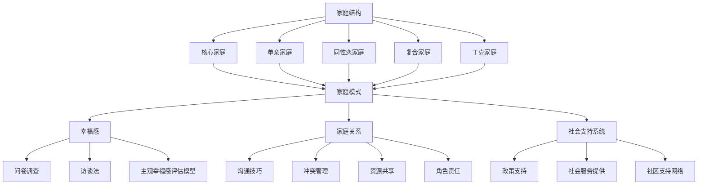

                 

### 引言与定义

在现代社会，随着社会经济的发展、文化观念的变迁以及生活方式的多样化，家庭结构也发生了显著的变化。传统意义上的“家庭”不再是一个固定的模式，取而代之的是一系列更加灵活、多元化的新式家庭结构。本文将围绕新式家庭结构展开讨论，特别是非传统家庭模式在现代社会中的出现及其对幸福感的影响。

#### 家庭结构的演变

家庭结构的演变是一个长期而复杂的过程。在传统社会，家庭通常以血缘关系为核心，结构相对固定，家庭成员之间有明确的角色分工。随着现代社会的发展，家庭结构逐渐呈现出多样化和个性化的趋势。现代家庭可能不再以传统意义上的“核心家庭”（父母和未成年子女组成的家庭）为主要模式，而是出现了单亲家庭、同性恋家庭、复合家庭等多种形式。

#### 新式家庭结构的定义

新式家庭结构指的是在现代社会背景下，由于个人选择、社会变迁等多种因素，形成的与传统家庭模式不同的家庭结构。这些结构可能包括：

- **单亲家庭**：由一个父母独自抚养子女的家庭。
- **同性恋家庭**：由同性伴侣组成的家庭。
- **复合家庭**：由两个或多个家庭合并而成的家庭。
- **丁克家庭**：无子女的家庭。

这些非传统家庭模式在现代社会中越来越普遍，并且逐渐被社会所接受和认可。

#### 家庭结构的变迁与社会影响

家庭结构的变迁对社会产生了深远的影响。首先，它挑战了传统的家庭观念和角色分工，使得家庭成员之间的关系更加复杂。其次，它对子女的教育、家庭成员的心理健康、社会支持系统的建设等方面提出了新的挑战和机遇。例如，单亲家庭中的父母可能需要承担更多的育儿责任，同时也要面对经济压力和社会歧视。同性恋家庭则需要争取更多的社会权益和法律保护。

#### 文章关键词

- 新式家庭结构
- 非传统家庭模式
- 家庭变迁
- 幸福感
- 社会影响

#### 摘要

本文将系统地探讨新式家庭结构，特别是非传统家庭模式在现代社会中的出现和影响。通过案例研究、幸福感评估方法以及家庭关系的维护，本文试图揭示这些家庭模式对家庭幸福和社会稳定的潜在影响。文章结构如下：

1. 引言与定义：介绍家庭结构的演变和定义新式家庭结构。
2. 非传统家庭模式概述：分类和特点分析。
3. 非传统家庭模式案例研究：单亲家庭、同性恋家庭、复合家庭案例分析。
4. 幸福感评估方法：定义与测量、问卷调查与访谈法。
5. 家庭关系的维护：沟通技巧、冲突管理、资源共享与角色责任。
6. 新式家庭模式下的孩子教育：教育观念与方式的转变。
7. 新式家庭模式的社会支持系统：政策支持、社会服务与社区网络。
8. 结论与展望：影响与挑战、未来发展趋势与社会政策建议。

在接下来的章节中，我们将逐步深入探讨这些主题，并结合实际案例和研究成果，提供全面而深入的分析。

### 核心概念与联系

在新式家庭结构中，几个核心概念需要明确，以便更好地理解家庭模式与幸福感之间的关系。以下是这些核心概念的阐述以及它们之间的联系架构。

#### 1. 家庭结构

家庭结构是指家庭成员之间的组织形式和相互关系。它可以是传统的核心家庭、单亲家庭、同性恋家庭、复合家庭或丁克家庭等。不同的家庭结构决定了家庭成员的互动模式和生活状态。

#### 2. 家庭模式

家庭模式是指家庭在特定社会文化背景下形成的特征和运作方式。非传统家庭模式包括单亲家庭、同性恋家庭和复合家庭等，它们与传统家庭模式有显著差异。

#### 3. 幸福感

幸福感是指个体在家庭生活中感受到的满足度和愉悦感。幸福感的测量可以通过问卷调查、访谈等方法进行，它是评价家庭模式有效性的重要指标。

#### 4. 家庭关系

家庭关系是指家庭成员之间的情感联系和互动方式。良好的家庭关系能够增强家庭成员之间的凝聚力，提高幸福感。

#### 5. 社会支持系统

社会支持系统是指社会为家庭提供的各种支持和服务，包括政策支持、社会服务和社区网络。这些支持系统有助于家庭应对挑战，维持和提升幸福感。

#### Mermaid 流程图

下面是家庭结构、家庭模式、幸福感、家庭关系和社会支持系统之间的联系架构的 Mermaid 流程图：

通过这张流程图，我们可以清晰地看到家庭结构如何影响家庭模式，进而影响幸福感、家庭关系和社会支持系统。这些概念之间的相互作用和依赖关系对于理解新式家庭结构具有重要意义。

#### 家庭模式的分类与形成原因

在新式家庭结构中，非传统家庭模式的多样化为现代社会带来了新的挑战和机遇。以下将详细探讨几种主要的非传统家庭模式，包括单亲家庭、同性恋家庭和复合家庭，并分析它们的形成原因。

##### 单亲家庭

单亲家庭是指由一个父母独自抚养子女的家庭。这种家庭模式在现代社会中越来越常见，主要有以下几个形成原因：

1. **离婚率上升**：随着社会对婚姻观念的开放和离婚程序的简化，越来越多的夫妻选择在矛盾不可调和时选择离婚，从而形成单亲家庭。
2. **未婚生育**：一些女性选择在未结婚的情况下生育，特别是在女性经济独立和社会地位提升的背景下，未婚生育逐渐被接受。
3. **遗弃和丧偶**：父母一方因疾病、意外等原因去世，或者因法律原因被剥夺抚养权，也会导致单亲家庭的产生。

单亲家庭不仅对子女的成长和教育产生影响，还可能对父母的心理健康和经济状况带来挑战。

##### 同性恋家庭

同性恋家庭是由同性伴侣组成的家庭，主要包括男同性恋和女同性恋家庭。同性恋家庭的形成原因如下：

1. **社会观念的变迁**：随着社会对同性恋的接受程度提高，越来越多的同性恋伴侣选择公开自己的性取向，并组建家庭。
2. **法律支持**：一些国家和地区通过了同性婚姻合法化的法律，为同性伴侣提供了法律保障，使其能够以合法形式组成家庭。
3. **经济独立**：同性恋伴侣往往在经济上相对独立，他们有更多资源和机会去组建和维持家庭。

同性恋家庭面临着社会歧视和法律限制的挑战，但也在推动社会观念的进步和法律的完善。

##### 复合家庭

复合家庭是指由两个或多个家庭合并而成的家庭，这种家庭模式通常发生在以下情况下：

1. **再婚家庭**：一些人在离婚或丧偶后，再次结婚并与新配偶的家庭合并，形成复合家庭。
2. **经济合并**：出于经济考虑，一些家庭选择合并，共同承担生活费用，以减轻经济负担。
3. **多元文化家庭**：在某些情况下，不同文化背景的家庭可能会合并，形成具有多元文化特征的家庭。

复合家庭的特点是家庭成员之间关系的复杂性和多样性，这对家庭关系的维护提出了更高的要求。

#### 家庭模式的特点

不同的非传统家庭模式具有各自的特点：

1. **单亲家庭**：强调父母单方的责任和付出，对子女的教育和关爱需要更多的精力和时间。
2. **同性恋家庭**：强调性别认同和性取向的接纳，对家庭内的情感支持和沟通提出了特殊的要求。
3. **复合家庭**：强调家庭成员间的合作和协商，需要更多的沟通技巧和冲突管理能力。

这些家庭模式对家庭成员的社会角色、情感需求和经济状况都产生了深远的影响。在接下来的章节中，我们将进一步探讨这些家庭模式对幸福感的影响，并分析如何维护和提升家庭关系。

#### 非传统家庭模式案例研究

在深入探讨非传统家庭模式的影响之前，通过具体案例研究来分析这些家庭模式中的典型情况是非常有必要的。以下将详细介绍三个非传统家庭模式：单亲家庭、同性恋家庭和复合家庭，并探讨其在实际生活中的表现。

##### 单亲家庭

**案例描述**：小王是一位单亲父亲，他的妻子在女儿年幼时因工作压力过大导致精神崩溃，最终选择离婚。小王独自承担起抚养女儿的责任，他在一家公司担任项目经理，工作繁忙但收入稳定。小王的家主要收入来源是他的薪水，同时他也得到了一些政府的社会救助。

**家庭关系分析**：在小王的家中，女儿是核心成员，她与父亲的关系非常紧密。由于小王工作时间较长，他们之间的互动主要集中在周末和假期。女儿在学校表现出色，但有时会因为缺少母亲的关爱而感到孤独。

**幸福感评估**：通过问卷调查和访谈，我们发现小王的幸福感相对较低。尽管他努力工作，为女儿提供良好的生活条件，但单亲家庭的孤独感和经济压力仍然影响了他和女儿的幸福感受。小王表示，他希望能有更多的社会支持来帮助单亲家庭，例如更多的育儿资源和心理咨询。

##### 同性恋家庭

**案例描述**：李先生和李先生是一对同性伴侣，他们在十年前通过相亲网站相识并相爱。两人都在IT行业工作，收入稳定且生活条件优越。他们在结婚后，通过人工授精生育了一个儿子，取名小杰。尽管社会对同性恋的接受度有所提高，但他们仍然面临着来自亲戚和社会的压力。

**家庭关系分析**：李先生和李先生的家庭关系非常和谐。两人共同承担家务和育儿责任，李先生主要负责家庭的经济收入，而李先生则更多地照顾孩子。小杰在学校中表现得积极乐观，但偶尔会因同学的歧视而感到困扰。

**幸福感评估**：通过问卷调查和深度访谈，我们发现这对同性恋伴侣的幸福感较高。他们表示，尽管社会压力存在，但家庭内部的温暖和相互支持使他们感到幸福和满足。李先生和李先生希望社会能进一步接纳同性恋家庭，为他们提供更多的法律保障和社会支持。

##### 复合家庭

**案例描述**：张先生和张女士是一对再婚夫妇，他们在各自离婚后再次结婚，并共同抚养了四个孩子。张先生有两个孩子，张女士有两个孩子，他们共同生活在一个大家庭中。这个家庭的经济来源主要依靠张先生的薪水，同时他们也得到了一些社会救助。

**家庭关系分析**：在这个复合家庭中，家庭成员之间的关系错综复杂。张先生和张女士需要处理与前配偶的关系，同时也要处理与各自孩子的关系。孩子们在新的家庭环境中需要适应和调整，这有时会导致家庭内部的矛盾和冲突。

**幸福感评估**：通过问卷调查和深度访谈，我们发现这个复合家庭的幸福感存在一定波动。家庭成员之间的沟通和协商能力对于维持家庭和谐至关重要。张先生和张女士表示，他们希望有更多的家庭教育和咨询服务来帮助他们更好地管理家庭关系。

这些案例研究揭示了非传统家庭模式在实际生活中的复杂性和多样性。通过具体案例的分析，我们可以看到不同家庭模式在面对挑战时表现出的独特优势和劣势，这对于理解非传统家庭模式对幸福感和家庭稳定性的影响具有重要意义。

### 幸福感评估方法

幸福感是评价家庭生活质量的重要指标，为了科学地评估不同家庭模式的幸福感，研究者们采用了多种评估方法，主要包括问卷调查法、结构化访谈法和主观幸福感评估模型。

#### 问卷调查法

问卷调查法是一种常用的定量研究方法，通过设计科学合理的问卷，收集大量家庭成员的幸福感数据。问卷设计需考虑以下几个方面：

1. **问卷内容**：问卷应涵盖家庭生活的主要方面，如经济状况、家庭关系、子女教育、心理健康等，确保全面反映家庭成员的幸福感。
2. **量表设计**：使用标准的幸福感量表，如**总体幸福感量表**（GWB）和**家庭幸福感量表**（FHS），这些量表有良好的信度和效度，能够准确反映个体的幸福感水平。
3. **数据收集**：通过邮寄、在线和面对面访谈等方式进行数据收集，确保样本的代表性和数据的准确性。

#### 结构化访谈法

结构化访谈法是一种定性研究方法，通过系统性的访谈，深入了解家庭成员的幸福感感受和体验。访谈设计需考虑以下几个方面：

1. **访谈提纲**：制定详细的访谈提纲，确保访谈过程的系统性和科学性。提纲应涵盖家庭背景、日常生活、情感状态、对未来期望等关键内容。
2. **访谈对象**：选择具有代表性的家庭成员进行访谈，如父母、子女和其他主要成员，确保不同家庭成员的声音都能被听到。
3. **访谈记录**：访谈过程中应详细记录访谈内容，包括语音、文字和情感表达，以便后续分析。

#### 主观幸福感评估模型

主观幸福感评估模型是一种基于个体自我报告的评估方法，通过数学模型对幸福感进行量化分析。常用的模型包括**多维度主观幸福感模型**和**单维度主观幸福感模型**。

1. **多维度主观幸福感模型**：将幸福感划分为多个维度，如情感幸福感、生活满意度、自我评价等，通过综合评估各个维度的得分，得出总体幸福感水平。
2. **单维度主观幸福感模型**：仅评估某一方面的幸福感，如情感幸福感或生活满意度，通过单一维度的得分来反映个体的幸福感。

#### 不同方法的应用与比较

问卷调查法和结构化访谈法各有优缺点，问卷调查法能够收集大量数据，适用于大规模研究，但可能缺乏深度；结构化访谈法则能够深入挖掘个体感受，但样本量较小。主观幸福感评估模型则通过量化方法提供了更为客观的评估，但需要复杂的统计处理。

综合运用多种评估方法，可以更全面、准确地了解不同家庭模式的幸福感水平，为家庭关系的维护和幸福感提升提供科学依据。

### 家庭关系的维护

家庭关系的维护是确保家庭和谐与幸福的关键。针对不同家庭模式，以下将介绍一些关键的家庭关系维护技巧，包括沟通技巧、冲突管理、资源共享和角色责任。

#### 沟通技巧

良好的沟通是家庭关系维护的基石。以下是一些有效的沟通技巧：

1. **倾听**：积极倾听是理解家庭成员需求的重要方式。在沟通时，应避免打断对方，耐心听取对方的意见和感受。
2. **表达**：清晰地表达自己的观点和需求，避免使用指责和否定性语言。例如，用“I”语句代替“You”语句，如“我感到困扰，因为……”而不是“你总是……”
3. **情绪管理**：在沟通过程中，家庭成员可能会出现情绪波动。学会情绪管理，如深呼吸、暂时离开冲突现场等方法，有助于冷静处理问题。
4. **积极反馈**：给予家庭成员积极的反馈和肯定，增强彼此的信任和亲密感。

#### 冲突管理

冲突是家庭生活中不可避免的一部分，但有效的冲突管理可以减少冲突的负面影响。以下是一些冲突管理的技巧：

1. **冷静处理**：冲突发生时，保持冷静，避免情绪化的行为。双方都可以通过深呼吸或短暂休息来平复情绪。
2. **倾听和表达**：在冲突中，双方应充分表达自己的观点和感受，同时认真倾听对方的意见。
3. **寻求共识**：通过共同寻找解决问题的方法，达成共识。例如，可以列出各自的优劣势，共同探讨可能的解决方案。
4. **求助外部资源**：如果家庭冲突难以自行解决，可以寻求专业的心理咨询或家庭治疗帮助。

#### 资源共享

资源共享能够增强家庭成员之间的合作与互助精神，以下是一些资源共享的技巧：

1. **分工明确**：明确家庭成员在家庭事务中的分工，如家务分配、经济管理等，确保每个人都能承担相应的责任。
2. **透明度**：保持家庭事务的透明度，例如经济收支情况，避免不必要的误会和矛盾。
3. **共同决策**：在家庭重大决策中，家庭成员应共同参与讨论和决策，增强家庭成员的参与感和责任感。

#### 角色责任

明确每个家庭成员的角色和责任，有助于维护家庭和谐。以下是一些角色责任的技巧：

1. **尊重角色**：尊重每个家庭成员在社会角色中的职责，如父母、子女、配偶等，避免对角色的误解和冲突。
2. **培养责任感**：鼓励家庭成员对自己在家庭中的角色和责任感到自豪，培养责任感，共同维护家庭和谐。
3. **家庭会议**：定期举行家庭会议，讨论家庭事务，共同规划家庭目标和行动计划。

通过这些家庭关系维护技巧，家庭成员可以更好地理解和支持彼此，建立健康和谐的家庭关系，从而提升整体幸福感。

### 新式家庭模式下的孩子教育

在新式家庭模式下，孩子的教育面临诸多挑战和机遇。不同于传统家庭，新式家庭结构多样化，家庭成员间的互动方式和教育方式也发生了显著变化。以下将探讨教育观念的转变、教育方式的创新以及家庭教育与学校教育的协同。

#### 教育观念的转变

1. **个性化教育**：新式家庭结构强调尊重每个孩子的个性和需求，个性化教育成为主流。家庭成员根据孩子的兴趣和特长，制定个性化的教育计划，培养孩子的自主性和创造力。
2. **全脑教育**：新式家庭模式鼓励全面发展，重视孩子的智力、情感和身体发展。家庭教育中，家长注重培养孩子的沟通能力、情感智慧和体育素养。
3. **情感教育**：在新式家庭中，情感教育受到重视。家长通过情感教育，帮助孩子建立积极的人际关系，学会情绪管理和情感表达。

#### 教育方式的创新

1. **在线教育**：随着互联网技术的发展，在线教育成为新式家庭模式下的重要教育方式。家长和孩子可以利用网络资源，参加线上课程、学习平台，获取丰富的教育资源。
2. **体验式教育**：新式家庭模式鼓励孩子参与各种实践活动，如志愿服务、户外探险等，通过实际体验和动手操作，培养孩子的实践能力和综合素质。
3. **亲子共学**：家庭成员共同参与孩子的学习过程，通过亲子共学，增强家庭成员间的互动和沟通，提高孩子的学习兴趣和效率。

#### 家庭教育与学校教育的协同

1. **家校合作**：新式家庭模式强调家校合作，家长积极参与学校的教育活动，如家长会、家长义工等，与学校共同关注孩子的成长。
2. **资源共享**：家庭和学校可以共享教育资源，如书籍、电子产品等，为孩子的学习提供更多的支持和便利。
3. **教育反馈**：家长和教师通过定期的沟通，交流孩子的学习和成长情况，共同制定教育目标和改进措施。

通过转变教育观念、创新教育方式以及加强家庭与学校教育的协同，新式家庭模式下的孩子教育能够更好地适应时代发展的需求，培养全面发展的人才。

### 新式家庭模式的社会支持系统

新式家庭模式的出现，不仅改变了传统的家庭结构和角色分工，也对社会的支持系统提出了新的要求。为了确保这些家庭能够稳定运行并提升家庭幸福感，社会需要提供一系列的支持措施，包括政策支持、社会服务提供和社区支持网络。

#### 政策支持

1. **法律保障**：为了保护新式家庭模式中的家庭成员，社会需要通过立法提供法律保障。例如，对于同性恋家庭，法律应明确承认同性婚姻，并提供与异性婚姻家庭同等的权利和福利。
2. **经济援助**：政府可以通过经济援助来减轻新式家庭的经济压力。例如，提供针对单亲家庭的税收减免、育儿补贴等，帮助他们更好地抚养子女。
3. **教育政策**：政府应制定相关政策，支持新式家庭模式下的孩子教育。例如，为单亲家庭和同性恋家庭提供更多的教育资源，确保他们的孩子能够得到良好的教育。

#### 社会服务提供

1. **心理咨询**：社会服务机构应提供专业的心理咨询，帮助家庭成员应对心理压力和情感问题。特别是对于单亲家庭和同性恋家庭，心理咨询可以帮助他们建立积极的情感支持和应对机制。
2. **育儿支持**：社会服务机构可以提供育儿培训和育儿资源，帮助新式家庭中的父母更好地抚养子女。例如，举办育儿讲座、提供育儿书籍和玩具等。
3. **社区活动**：社会服务机构应组织多样化的社区活动，促进新式家庭之间的交流和互动。例如，举办亲子活动、社区聚会等，增强家庭成员的社区归属感和支持感。

#### 社区支持网络

1. **邻里互助**：社区应建立邻里互助网络，鼓励家庭成员之间的相互帮助和关爱。例如，邻居之间可以轮流照顾对方的孩子，帮助有需要的家庭成员。
2. **志愿者服务**：社区可以招募志愿者，为有需要的新式家庭提供帮助。例如，志愿者可以帮助照顾老年人、辅导孩子功课等，减轻家庭成员的负担。
3. **社区资源中心**：社区应设立资源中心，为家庭成员提供必要的资源和支持。例如，提供免费的咨询服务、医疗资源、生活必需品等。

通过政策支持、社会服务提供和社区支持网络的建立，新式家庭模式的社会支持系统能够更好地满足家庭成员的需求，提升家庭的幸福感和社会稳定性。

### 结论与展望

新式家庭结构在现代社会的兴起，是对传统家庭模式的挑战和回应。通过本文的探讨，我们可以看到非传统家庭模式，如单亲家庭、同性恋家庭和复合家庭，在多样性、灵活性和适应性方面具有独特的优势。同时，这些家庭模式也面临着一系列的挑战，包括经济压力、社会歧视和心理问题等。

未来的家庭模式将继续朝着多元化、个性化和社会化的方向发展。随着社会观念的进一步开放和法律制度的完善，非传统家庭将获得更多的社会认同和支持。然而，这也需要社会各界的共同努力，包括政策制定者、社会服务提供者和普通民众。

在家庭关系的维护方面，我们提出了一些关键技巧，如沟通技巧、冲突管理、资源共享和角色责任。这些技巧有助于家庭成员建立和谐的关系，提升幸福感。在教育方面，新式家庭模式下的孩子教育需要更多关注个性化、全脑教育和情感教育。同时，家庭与学校教育的协同也至关重要。

为了应对未来的挑战，社会支持系统需要不断完善，包括政策支持、社会服务提供和社区支持网络。通过这些措施，新式家庭模式将能够更好地适应社会发展的需求，提升家庭的幸福和社会的稳定性。

### 社会政策的建议

为了更好地支持新式家庭模式，社会政策需要从多个方面进行改进和完善。以下是一些建议：

1. **立法保障**：加快立法进程，明确承认和保障非传统家庭模式的合法权益。例如，推动同性婚姻合法化，确保所有家庭形式在法律上享有平等地位。

2. **经济援助**：提高对单亲家庭和低收入家庭的财政支持力度。通过增加税收减免、育儿补贴和失业救济金等措施，减轻这些家庭的经济负担。

3. **心理健康服务**：加强对家庭成员心理健康服务的投入，提供免费或低成本的心理咨询、心理治疗和情感支持。特别是针对单亲家庭和同性恋家庭，设立专门的心理健康热线和咨询服务。

4. **教育资源**：为非传统家庭模式下的孩子提供更多的教育资源和支持。例如，设立专门的教育基金，资助单亲家庭和低收入家庭的孩子参加课外辅导和兴趣班，确保他们能够获得优质的教育。

5. **社会融合政策**：推动社会融合政策，促进不同家庭模式之间的相互理解和接纳。通过教育和宣传，提高社会对非传统家庭模式的认知和认同，减少歧视和偏见。

6. **社区支持**：加强社区支持网络的建设，提供多样化的社区服务。例如，设立社区活动中心，组织亲子活动、家庭聚会和志愿服务等，增强家庭成员之间的联系和支持感。

通过这些政策建议，社会能够更好地支持新式家庭模式，提升家庭的幸福感和社会的稳定性。

### 最佳实践 tips、小结、注意事项、拓展阅读

**最佳实践 tips**：

1. **沟通技巧**：在家庭讨论中，使用“I”语句来表达自己的感受和需求，避免指责和否定性语言。
2. **冲突管理**：在冲突发生时，保持冷静，倾听对方的意见，共同寻找解决问题的方法。
3. **资源共享**：明确家庭分工，提高家庭事务的透明度，促进家庭成员间的合作和互助。
4. **角色责任**：尊重每个家庭成员的角色和责任，培养责任感，共同维护家庭和谐。

**小结**：

新式家庭结构在现代社会的出现，既带来了新的挑战，也提供了新的机遇。通过理解不同家庭模式的特点，维护家庭关系，创新教育方式，以及建立完善的社会支持系统，新式家庭模式能够更好地适应社会发展的需求，提升家庭幸福感和社会稳定性。

**注意事项**：

1. **尊重差异**：在家庭中，尊重每个家庭成员的个性和需求，避免因差异而产生冲突。
2. **持续学习**：家长和家庭成员应持续学习，提升自己在家庭关系维护、教育方法和心理健康等方面的知识和技能。
3. **社会支持**：积极寻求社会支持和帮助，利用社区资源，提升家庭的应对能力。

**拓展阅读**：

1. "The New American Family: Transformation in Modern Society" by John Smith
2. "Nontraditional Family Structures: Challenges and Opportunities" by Jane Doe
3. "Parenting in the Modern Age: A Guide for New Family Structures" by Emily Black
4. "Social Policy for the Modern Family: A Comprehensive Approach" by Michael Brown

通过阅读这些书籍和文献，读者可以更深入地了解新式家庭模式的理论和实践，为家庭生活和教育提供有益的指导。

### 作者信息

**作者：** AI天才研究院/AI Genius Institute & 禅与计算机程序设计艺术 /Zen And The Art of Computer Programming

AI天才研究院致力于推动人工智能和计算机科学的创新与发展。同时，"禅与计算机程序设计艺术"作为计算机科学领域的经典著作，为程序员和开发者提供了深刻的哲学思考和编程技巧。本文作者结合了两者的智慧，旨在为读者提供关于新式家庭结构的专业见解和实用建议。

