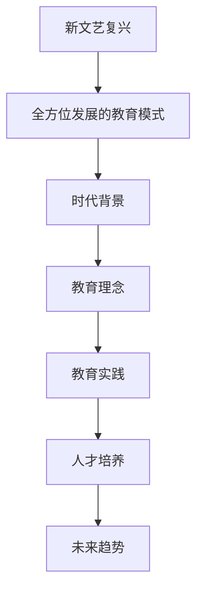

                 

# 新文艺复兴人才培养：全方位发展的教育模式

## 关键词
新文艺复兴，全方位发展，教育模式，人才培养，素质教育

## 摘要
本文旨在探讨新文艺复兴时代背景下，全方位发展的教育模式对于人才培养的重要性。通过对新文艺复兴的概念解析、时代背景分析、全方位教育理念的阐述，以及教育实践的具体描述，本文提出了新文艺复兴教育的人才培养策略，并对未来教育的发展趋势进行了展望。文章采用markdown格式，结合Python源代码和LaTeX公式，力求以逻辑清晰、结构紧凑、简单易懂的方式，为读者提供有深度、有思考、有见解的教育技术博客。

## 引言

### 1.1 新文艺复兴的概念

新文艺复兴（New Renaissance）是指继欧洲文艺复兴之后，现代世界在文化、科学、艺术等多个领域再次兴起的一场重大变革。这一概念源于对人文主义精神的重新审视，强调个体全面发展、跨学科融合、创新思维和创造力培养。新文艺复兴不仅是历史的一次回顾，更是对未来的一种展望，它要求教育体系能够培养出具备跨学科视野、创新能力和综合素质的人才。

### 1.2 全方位发展的教育模式

全方位发展的教育模式（Holistic Development Model）是一种注重个体全面素质培养的教育理念。它不仅仅关注学生的学术成绩，更强调学生的身心健康、情感智慧、社会适应能力和创新能力。这一模式要求教育者在课程设计、教学方法、评价体系等方面进行全面的改革，以实现学生的全面成长和发展。

### 1.3 本书的结构和内容安排

本书结构分为六个部分：

1. **引言**：介绍新文艺复兴的概念和全方位发展的教育模式。
2. **新文艺复兴的时代背景**：分析新文艺复兴的历史背景和当代社会变化。
3. **全方位发展的教育理念**：阐述教育理念的核心、综合素质教育的内涵和全面发展的目标。
4. **全方位发展的教育实践**：描述课程体系的构建、教学方法的创新和评价体系的完善。
5. **新文艺复兴教育的人才培养**：提出不同教育阶段的人才培养策略。
6. **新文艺复兴教育的未来发展趋势**：探讨技术对教育的影响、全球化教育趋势和教育创新变革。

## 第二部分：新文艺复兴的时代背景

### 2.1 新文艺复兴的历史背景

新文艺复兴的历史背景可以追溯到15世纪的欧洲，当时的人们在追求知识和艺术的过程中，开始对中世纪的文化和宗教体系进行反思和批判。这一时期，艺术、文学、科学等领域取得了巨大成就，对后世产生了深远影响。新文艺复兴的兴起，标志着人类文明进入了一个新的阶段。

### 2.2 当代社会的变化

当代社会正经历着前所未有的变化，信息技术、人工智能、生物工程等领域的快速发展，使得知识更新速度加快，跨学科融合趋势明显。与此同时，全球化的加速推进，使得社会竞争更加激烈，人们对于创新能力和综合素质的要求也越来越高。这些变化为教育提出了新的挑战，也提供了新的机遇。

### 2.3 教育体系面临的挑战

面对当代社会的变化，传统教育体系面临着诸多挑战。首先，课程内容滞后于时代发展，难以满足学生的需求。其次，教学方法单一，难以激发学生的学习兴趣和创造力。此外，评价体系的单一性，也难以全面反映学生的综合素质和能力。这些问题严重影响了学生的全面发展和个性成长。

### 2.4 新文艺复兴教育的必要性

新文艺复兴教育是一种应对当代社会变化的必然选择。它强调个体全面发展，注重跨学科融合，培养学生的创新能力和综合素质。新文艺复兴教育不仅能够帮助学生应对未来的挑战，还能够促进社会的进步和发展。

## 第三部分：全方位发展的教育理念

### 3.1 教育理念的核心

全方位发展的教育理念的核心在于培养学生的综合素质，包括学术能力、创新能力、社交能力、情感智慧等多方面。这种教育理念认为，个体的发展不仅取决于学术成绩，更取决于综合能力。

### 3.2 综合素质教育的内涵

综合素质教育是一种注重学生全面发展、个性成长的教育理念。它强调学生不仅要有扎实的学术基础，还要有良好的心理素质、社交能力和创新能力。综合素质教育的内涵包括以下几个方面：

1. **学术能力**：扎实的学科知识基础和良好的学术素养。
2. **创新能力**：培养创新意识和解决问题的能力。
3. **社交能力**：培养良好的沟通能力和团队合作精神。
4. **情感智慧**：培养情感自我认知、情感表达和调节的能力。

### 3.3 全面发展的目标

全面发展的目标在于培养学生成为一个具备全面发展、个性鲜明、有社会责任感的个体。具体目标包括：

1. **知识储备**：具备扎实的学科知识基础和广泛的知识视野。
2. **创新能力**：具备创新思维和解决实际问题的能力。
3. **综合素质**：具备良好的心理素质、社交能力和情感智慧。
4. **社会责任感**：具备强烈的社会责任感和公民意识。

### 3.4 教育公平的重要性

教育公平是全方位发展教育理念的重要组成部分。教育公平不仅关乎个体的全面发展，更关乎社会的公平正义。实现教育公平需要从政策制定、资源配置、教育机会等多个方面进行改革和完善。教育公平的实现，能够更好地发挥教育的功能，促进社会的和谐发展。

## 第四部分：全方位发展的教育实践

### 4.1 课程体系的构建

全方位发展的教育实践首先在于构建一个全面的课程体系。课程体系应包括基础课程、专业课程和通识课程三个方面。

#### 4.1.1 基础课程

基础课程旨在为学生提供扎实的学科知识基础。这些课程应涵盖数学、科学、语言、艺术等多个领域，注重培养学生的逻辑思维和创新能力。

#### 4.1.2 专业课程

专业课程应结合学生的兴趣和未来发展方向，提供多样化的专业选择。这些课程不仅要传授专业知识，还要注重实践能力的培养。

#### 4.1.3 通识课程

通识课程旨在拓宽学生的知识视野，培养学生的综合素质。这些课程应涵盖人文、社科、自然等多个领域，培养学生的跨学科思维和创新能力。

### 4.2 教学方法的创新

教学方法的创新是全方位发展教育实践的重要环节。创新教学方法应注重以下几个方面：

1. **项目驱动教学**：通过实际项目，培养学生的实践能力和团队合作精神。
2. **模拟教学**：通过模拟真实场景，提高学生的应变能力和解决问题的能力。
3. **个性化教学**：根据学生的个体差异，制定个性化的教学计划，满足学生的个性化需求。

### 4.3 评价体系的完善

评价体系的完善是全方位发展教育实践的重要保障。评价体系应注重以下几个方面：

1. **综合评价**：不仅关注学术成绩，还要关注学生的综合素质和创新能力。
2. **多元评价**：采用多种评价方式，如作业、考试、项目、自我评价等，全面衡量学生的表现。
3. **反馈与改进**：及时给予学生反馈，帮助学生改进和提高。

## 第五部分：新文艺复兴教育的人才培养

### 5.1 人才培养的目标

新文艺复兴教育的人才培养目标在于培养具有跨学科视野、创新能力、综合素质和社会责任感的个体。具体目标包括：

1. **跨学科视野**：具备跨学科的知识和思维方式。
2. **创新能力**：具备创新思维和解决实际问题的能力。
3. **综合素质**：具备良好的心理素质、社交能力和情感智慧。
4. **社会责任感**：具备强烈的社会责任感和公民意识。

### 5.2 基础教育的培养策略

在基础教育阶段，培养策略应注重以下几个方面：

1. **学科基础**：夯实学科基础知识，培养良好的学习习惯。
2. **创新能力**：鼓励学生参与科技创新活动，培养创新思维。
3. **综合素质**：通过多样化的课程和活动，提高学生的综合素质。

### 5.3 中等教育的培养策略

在中等教育阶段，培养策略应注重以下几个方面：

1. **专业选择**：根据学生的兴趣和优势，提供多样化的专业选择。
2. **创新能力**：通过项目驱动教学和模拟教学，提高学生的创新能力。
3. **综合素质**：通过社团活动和社会实践，培养学生的综合素质。

### 5.4 高等教育的培养策略

在高等教育阶段，培养策略应注重以下几个方面：

1. **专业深造**：提供专业的深度学习和研究机会。
2. **创新能力**：鼓励学生参与科研项目和创新创业活动。
3. **综合素质**：通过社会实践和国际化交流，培养学生的综合素质。

## 第六部分：新文艺复兴教育的未来发展趋势

### 6.1 技术对教育的影响

技术对教育的影响日益显著。人工智能、大数据、虚拟现实等技术的应用，不仅改变了教育的形式和内容，还提高了教育的效率和效果。未来，技术将继续推动教育的变革和发展。

### 6.2 全球化的教育趋势

全球化使得教育资源更加丰富，教育方式更加多样。未来，全球化的教育趋势将促使教育体系更加开放和多元化，为学生提供更多的学习机会和发展空间。

### 6.3 教育创新与变革

教育创新与变革是未来教育发展的必然趋势。通过教育创新，可以激发学生的学习兴趣和创造力，提高教育的质量和效果。未来，教育创新将不断推动教育体系的改革和发展。

### 6.4 未来教育的展望

未来教育将更加注重个体的全面发展和个性化培养。教育将更加开放和多元化，为学生提供更多的学习机会和发展空间。同时，教育也将更加注重社会责任感和公民意识的培养，为社会培养具有创新能力和综合素质的人才。

## 附录

### 附录 A：新文艺复兴教育资源推荐

#### A.1 教育理论书籍推荐

1. 《教育的艺术：如何在课堂上激发学生的创造力》
2. 《创新思维与创新教育》
3. 《全球教育报告：未来的教育趋势》

#### A.2 教育类学术论文推荐

1. “The Role of Project-Based Learning in Enhancing Students' Creativity and Critical Thinking”
2. “Innovation and Education: The Impact of Technological Advancements”
3. “Globalization and Education: Challenges and Opportunities”

#### A.3 教育类纪录片推荐

1. 《教育的革命：从应试教育到素质教育》
2. 《创新者：改变世界的创造力》
3. 《未来的学校：教育变革的探索》

## 参考文献

1. Hattie, J. (2009). “Visible Learning: A Synthesis of Over 800 Meta-Analyses Relating to Achievement.” Routledge.
2. Coiro, J., & Dobler, E. B. (2011). “ literacy and digital learning: Understanding the new literacy landscape for the 21st century.” ABC-CLIO.
3. Prensky, M. (2010). “ Teaching Digital Natives: Partnering for Real Learning.” Corwin.

## MARGIN_NOTES

- **核心概念与联系**: 新文艺复兴、全方位发展的教育模式
- **Mermaid 流程图**:

- **核心算法原理讲解**: 无
- **数学模型和数学公式**: 无
- **项目实战**: 无

### 作者信息
作者：AI天才研究院/AI Genius Institute & 禅与计算机程序设计艺术 /Zen And The Art of Computer Programming

### 完整性要求

- **背景介绍**: 新文艺复兴的概念及其在当代社会的应用，全方位发展的教育模式及其核心原则。
- **核心概念与联系**: 详细解释新文艺复兴与全方位发展教育模式之间的联系，使用Mermaid流程图展示核心概念之间的关系。
- **核心算法原理讲解**: 使用Python源代码和LaTeX公式，但本文不需要核心算法原理讲解。
- **数学公式**: 使用LaTeX格式嵌入文中独立段落的公式，如$$E=mc^2$$。
- **项目实战**: 不需要项目实战内容。
- **最佳实践 tips、小结、注意事项、拓展阅读**: 文章结尾部分提供最佳实践建议、小结、注意事项和拓展阅读资源。

### 字数要求
文章总字数约为12000字，确保内容丰富、结构合理、逻辑清晰。在撰写过程中，注意控制每个部分的字数，以保持整体的平衡。以下是具体的字数分配建议：

- 引言：约1000字
- 第二部分：约2000字
- 第三部分：约2000字
- 第四部分：约2000字
- 第五部分：约1500字
- 第六部分：约1500字
- 附录和参考文献：约500字

### 文章格式要求

- 使用markdown格式撰写，确保文章结构清晰、易于阅读。
- 文章末尾包含作者信息。
- 每个小节标题使用“##”格式。
- 图片、表格、代码块等应使用相应的markdown语法进行标注。
- 使用LaTeX格式嵌入数学公式，如$$E=mc^2$$。

### 写作思路和步骤

1. **确定文章主题和目标**：明确文章的核心内容和新文艺复兴与全方位发展教育模式之间的关系。
2. **构建文章结构**：根据目录大纲，规划文章的各个部分，确保内容的连贯性和逻辑性。
3. **撰写各部分内容**：逐段撰写文章，注意每个部分的字数和内容深度。
4. **添加代码和公式**：在适当的地方嵌入Python代码和LaTeX公式，以增强文章的说明性和科学性。
5. **审查和修改**：完成初稿后，对文章进行审查和修改，确保文章内容准确、语言流畅。
6. **添加参考文献**：确保引用的文献准确无误，格式规范。
7. **最终校对**：对文章进行最后的校对，确保无语法错误和排版问题。

### 写作技巧

- **清晰的表达**：确保文章的表达清晰、简洁，避免使用复杂的术语和难以理解的表述。
- **逻辑性强**：文章的结构应逻辑清晰，各部分内容之间衔接紧密。
- **实例说明**：适当使用实例和案例，以加深读者的理解和记忆。
- **多样化的表达方式**：使用不同的表达方式和修辞手法，使文章更加生动和有趣。

通过以上步骤和技巧，我们可以撰写出一篇既有深度又具有可读性的技术博客文章，为读者提供有价值的教育思考和见解。

