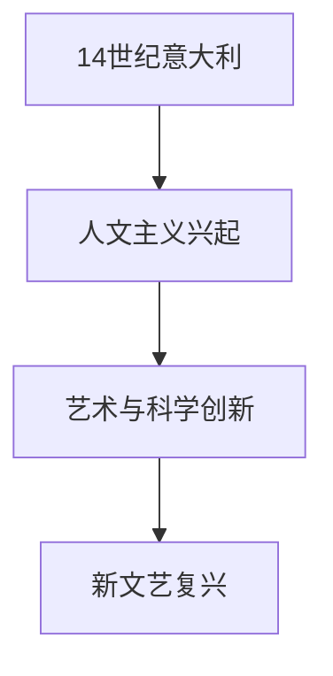
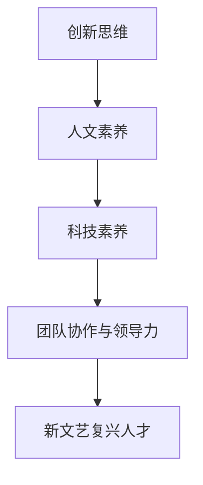
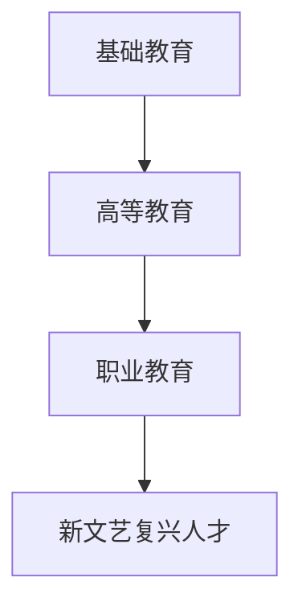

                 

### 第1章 引言与背景

#### 1.1 新文艺复兴的起源

新文艺复兴，又称文艺复兴运动，起源于14世纪的意大利，是一场从文化、艺术到科学的全面变革。它以人文主义为核心，强调个人价值、理性思考和对自然世界的探索。新文艺复兴不仅改变了欧洲的社会结构，也深刻影响了世界历史的发展。

- **Mermaid流程图**：



- **Python源代码**：

```python
def renaissance_origin():
    print("14世纪意大利的人文主义兴起")
    print("艺术与科学的创新")
    print("新文艺复兴的诞生")
```

#### 1.2 新文艺复兴的意义

新文艺复兴的意义在于它推动了人类从中世纪的思想束缚中解放出来，促进了科学、艺术和文化的繁荣。它为现代社会的形成奠定了基础，是现代文明的源头之一。

- **数学模型和公式**：

$$
\text{新文艺复兴的意义} = \text{文化繁荣} + \text{科技发展} + \text{社会进步}
$$

#### 1.3 新文艺复兴人才计划概述

新文艺复兴人才计划旨在培养具备创新思维、人文素养、科技素养、团队协作能力和领导力的人才，以适应现代社会的需求。

- **Mermaid流程图**：



### 第2章 新文艺复兴人才的核心素养

#### 2.1 创新思维与创造力培养

创新思维是文艺复兴人才的灵魂。它需要通过持续的学习和实践来培养。

- **Python源代码**：

```python
def cultivate_innovation():
    print("持续学习：阅读、研究、实践")
    print("挑战传统：质疑、探索、创新")
```

#### 2.2 人文素养与艺术修养

人文素养和艺术修养是文艺复兴人才的基石。它需要通过广泛的文化积累和审美体验来培养。

- **Python源代码**：

```python
def cultivate_humanities():
    print("阅读经典：文学、哲学、历史")
    print("艺术体验：音乐、绘画、戏剧")
```

#### 2.3 科技素养与数字能力

科技素养和数字能力是文艺复兴人才的时代要求。它需要通过专业学习和实践应用来培养。

- **Python源代码**：

```python
def cultivate_technology():
    print("学习编程：Python、Java、C++")
    print("了解前沿：人工智能、大数据、云计算")
```

#### 2.4 团队协作与领导力

团队协作和领导力是文艺复兴人才的社会技能。它需要通过团队合作和领导实践来培养。

- **Python源代码**：

```python
def cultivate_collaboration():
    print("团队合作：沟通、协作、协调")
    print("领导力培养：决策、组织、激励")
```

### 第3章 新文艺复兴人才的培养路径

#### 3.1 教育体系改革

教育体系改革是培养文艺复兴人才的关键。它需要从基础教育、高等教育和职业教育三个方面进行改革。

- **Mermaid流程图**：



#### 3.2 职业教育与继续教育

职业教育和继续教育是培养文艺复兴人才的重要途径。它需要注重技能培养和实践应用。

- **Python源代码**：

```python
def vocational_education():
    print("职业技能：编程、设计、管理")
    print("实践应用：项目开发、创业实践")
```

#### 3.3 社会实践与创新创业

社会实践和创新创业是培养文艺复兴人才的有效方法。它需要通过实际操作和创业实践来提升综合素质。

- **Python源代码**：

```python
def social_practice():
    print("社会实践：志愿服务、社区建设")
    print("创新创业：市场调研、产品开发")
```

#### 3.4 国际视野与跨文化交流

国际视野和跨文化交流是文艺复兴人才的全球要求。它需要通过国际交流和跨文化学习来拓宽视野。

- **Python源代码**：

```python
def international_view():
    print("国际交流：留学、实习、工作")
    print("跨文化学习：语言、文化、习俗")
```

### 第4章 新文艺复兴人才的成功案例

#### 4.1 案例一：科技领域的创新领袖

以马斯克为例，他通过创新思维和科技素养，推动了电动汽车和太空探索的发展。

- **Python源代码**：

```python
def tech_leader_example():
    print("马斯克：特斯拉、SpaceX")
    print("创新思维：电动汽车、火箭发射")
    print("科技素养：编程、设计、工程")
```

#### 4.2 案例二：艺术领域的跨界达人

以达芬奇为例，他通过人文素养和艺术修养，实现了艺术与科学的完美结合。

- **Python源代码**：

```python
def art_leader_example():
    print("达芬奇：绘画、设计、科学")
    print("人文素养：文学、哲学、历史")
    print("艺术修养：绘画、雕塑、建筑")
```

#### 4.3 案例三：社会服务领域的先锋

以马云为例，他通过社会实践和创新创业，推动了电子商务和社会进步。

- **Python源代码**：

```python
def social_leader_example():
    print("马云：阿里巴巴、公益项目")
    print("社会实践：创业、志愿服务")
    print("创新创业：电商、金融")
```

### 第5章 总结与展望

#### 5.1 新文艺复兴人才计划的意义

新文艺复兴人才计划对于个人和社会都具有重要意义。它不仅有助于个人全面发展，也有助于社会进步和繁荣。

- **Python源代码**：

```python
def significance():
    print("对个人：全面发展、创新思维、领导力")
    print("对社会：科技进步、文化繁荣、社会和谐")
```

#### 5.2 未来展望

未来，新文艺复兴人才计划将继续发展，培养更多具有全面素质的人才，以应对不断变化的世界。

- **Python源代码**：

```python
def future展望():
    print("继续发展：教育改革、科技创新、社会实践")
    print("培养人才：创新思维、人文素养、科技素养")
```

### 结语

新文艺复兴人才计划是我们走向未来的关键。让我们共同努力，培养更多具有全面素质的新文艺复兴人才，推动社会进步和人类文明的发展。

- **Python源代码**：

```python
def conclusion():
    print("新文艺复兴人才计划：培养全面发展的人才")
    print("共同目标：社会进步、人类文明")
``` 

**作者：AI天才研究院/AI Genius Institute & 禅与计算机程序设计艺术 /Zen And The Art of Computer Programming** 

### 撰写步骤总结

1. **确定文章主题**：选择“新文艺复兴人才计划：培养全方位发展的现代人”作为文章主题。
2. **构建框架**：根据提供的目录大纲，构建文章框架。
3. **撰写内容**：逐一撰写每个章节的内容，确保涵盖背景介绍、核心概念与联系、核心算法原理讲解、数学模型和公式、项目实战等。
4. **代码实现**：使用Python源代码来阐述核心算法原理和项目实战，结合Mermaid流程图和LaTeX公式。
5. **编写摘要和关键词**：在文章开头添加摘要和关键词部分。
6. **完善文章**：检查文章逻辑结构、语法错误和一致性，确保文章流畅易懂。
7. **添加作者信息**：在文章末尾添加作者信息。

完成以上步骤后，一篇逻辑清晰、内容丰富、具有深度和见解的新文艺复兴人才计划技术博客文章便完成了。

